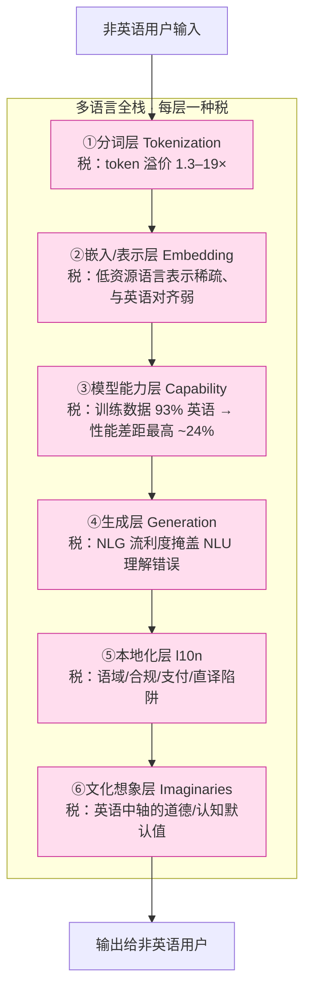

一个团队把英语产品做到 PMF，然后宣布"我们支持 100 种语言了"——接了翻译 API、把界面字符串过了一遍机翻、在 onboarding 加了语言切换。三个月后，巴西的留存掉了，印地语市场的客服成本爆了，而没有任何一个 dashboard 告诉他们为什么。本节要解决的问题是：**多语言 AI 产品不是一个可以"加上去"的 feature，而是一条从分词到文化、贯穿成本/质量/体验的纵向系统约束——它要么从架构第一天就被算进去，要么在你看不见的每一层悄悄向非英语用户征税。** 视角是「多语言全栈剖面」框架：把前面 A03（分词层）、A04（语义/本地化层）、A05（能力层）、A06（认知偏差层）四个被分别拆解的不公，拼回成 PM 必须整体看待的一张系统约束图。

> [!note] 判断主轴
> **多语言不是 feature，是贯穿成本、质量、文化的系统约束。** 它分布在六个堆栈层（分词→嵌入→模型能力→生成→本地化→文化想象），每一层都在以英语为默认值、向非英语系统性征税。把它当 feature（一个可以排进 roadmap、由翻译模块独立交付的东西）做，是国际化失败最深的根因——因为约束是横切的，而 feature 是局部的。

## §0 为什么是「全栈系统约束」框架，而不是「翻译 feature」框架

读者脑里默认的框架几乎都是：多语言 = 翻译 = 一个功能模块。这个框架的隐含假设是**可加性（additivity）**——多语言能力可以像"暗黑模式""导出 PDF"一样，作为一个边界清晰的模块加到既有产品上，不影响其他部分。

这个框架是错的，而且错得很贵。因为多语言的影响不是模块化的，是**横切（cross-cutting）**的——它穿过你的每一层架构：

- 它改变**计费**（分词层的 token 溢价，见 [A03 多语言 Tokenization 效率差异](/kb/专题-人文社科透镜/a03-多语言-tokenization-效率差异/)）；
- 它改变**有效容量**（同样的上下文窗口，非英语装的信息更少）；
- 它改变**输出质量**（能力层的多语言差距，见 [A05 理解与生成的不对称](/kb/专题-人文社科透镜/a05-理解与生成的不对称/)）；
- 它改变**安全边界**（低资源语言的对齐更脆弱）；
- 它改变**用户信任**（本地化/文化层，见 [A04 翻译≠本地化](/kb/专题-人文社科透镜/a04-翻译≠本地化/)）；
- 它甚至改变**模型怎么"想"**（认知层的英语中轴，见 [A06 语言相对性与 LLM 跨语言偏差](/kb/专题-人文社科透镜/a06-语言相对性与-llm-跨语言偏差/)）。

一个横切约束被当成一个局部 feature 来管理，必然在没有人负责的接缝处失血。这就是为什么本节点要从前面四个"单层诊断"节点（A03/A04/A05/A06）升高一层，做成一张**把六层串起来的系统剖面图**——架构剖面（S 模块）的任务不是再讲一遍某一层，而是回答"这些层如何叠加、在哪里相互放大、PM 该在哪一层下手"。

为什么不用"翻译 feature"框架？因为它会让你只盯住一层（语义层），优化了翻译质量，却对分词层的成本失血、能力层的质量塌陷、文化层的信任流失一无所知——它们发生在翻译模块的视野之外，却共同决定了多语言市场的成败。

## §1 多语言全栈：六层剖面

把一个非英语用户的一次请求，从输入到输出走一遍，它依次穿过六层。每一层都有一个"英语默认值"，每一层都在向非英语征收一种不同的税。

| 层 | 英语默认值 | 非英语承担的税 | 节点 | 谁在工程上负责 |
|---|---|---|---|---|
| ① 分词 | 词表 ~90% 由英语语料统计 | token 溢价 1.3–19×，直接吃成本/容量/延迟 | [A03 多语言 Tokenization 效率差异](/kb/专题-人文社科透镜/a03-多语言-tokenization-效率差异/)、[c02 - Tokenization 与词表工程](/kb/基础知识库/c02-tokenization-与词表工程/) | 选模型时已锁定 |
| ② 嵌入/表示 | 语义空间以英语为密区 | 低资源语言表示稀疏、跨语言对齐弱 | [Embedding](/kb/基础知识库/embedding/)、[A06 语言相对性与 LLM 跨语言偏差](/kb/专题-人文社科透镜/a06-语言相对性与-llm-跨语言偏差/) | 不可改（除非微调） |
| ③ 模型能力 | 训练数据压倒性英语 | zero-shot 性能差距，高低资源最高 ~24% | [A05 理解与生成的不对称](/kb/专题-人文社科透镜/a05-理解与生成的不对称/) | 选模型 / 后训练 |
| ④ 生成 | 生成比理解强（NLG>NLU） | 流利的错误更难被发现 | [A05 理解与生成的不对称](/kb/专题-人文社科透镜/a05-理解与生成的不对称/)、[幻觉](/kb/基础知识库/幻觉/) | prompt / 评测 |
| ⑤ 本地化 | "翻译 = 本地化" | 语域、合规、支付、文化错位 | [A04 翻译≠本地化](/kb/专题-人文社科透镜/a04-翻译≠本地化/) | l10n 流程 / 母语审 |
| ⑥ 文化想象 | 道德/认知默认值是英语 | 模型"用英语思考"再翻译 | [A06 语言相对性与 LLM 跨语言偏差](/kb/专题-人文社科透镜/a06-语言相对性与-llm-跨语言偏差/)、0117社会学 | 几乎无人负责 |

这张表的价值不在每一格（每一格都有专门节点），而在**它们的列**：最右一列暴露了一个残酷的组织事实——**这六层税，没有任何一个角色是端到端负责的**。分词层在选模型时就锁死了（多半是工程默契选的）；表示/能力层是模型供应商的事；生成层归 prompt/评测；本地化层归运营/翻译外包；文化想象层——没人。多语言失败不是某一层做砸了，是**没有一个 PM 把这六层当成一个系统来看**。

## §2 三种税相互放大，不是相加

如果六层税只是简单相加，问题还好办——分别优化即可。真正危险的是它们**相互放大（compounding）**：上游的税会让下游的税更重。这是把它们拼回一张图才看得见的、单层节点看不见的东西。

**放大链一：分词层 × 容量层 × 能力层 = RAG 在非英语上的三重塌陷。**
高溢价语言（①分词）→ 同样 128k 上下文装的语义更少（②有效容量）→ 检索召回的有效内容更少 → 模型本就在该语言能力更弱（③能力）上做推理 → 输出质量塌陷。三个独立的小劣势在 RAG pipeline 里串成一个大窟窿。一个在英语上调好的 RAG，搬到印地语上可能不是"差一点"，而是"差出一个数量级"，因为三层税在串联处相乘而非相加。

**放大链二：能力层 × 生成层 = 自信的错误本地化。**
模型在目标语言能力弱（③），但生成流利度高（④，见 [A05 理解与生成的不对称](/kb/专题-人文社科透镜/a05-理解与生成的不对称/) 的 NLU/NLG 不对称）→ 它会用极流利的目标语言，自信地输出一个理解错了源意图的本地化文案。流利度成了伪装，让错误在能力最弱的语言里反而最难被发现。这正是 [A04 翻译≠本地化](/kb/专题-人文社科透镜/a04-翻译≠本地化/) §3 的论点在系统层的回响：越是弱能力语言，越需要母语审，但团队的直觉恰恰相反（"译文这么流利，应该没问题"）。

**放大链三：文化层 × 安全层 = 低资源语言的安全洼地。**
模型的对齐/安全训练也压倒性是英语和高资源语言（⑥的延伸）。研究显示，把英语有害输入翻译成低资源语言即可绕过 GPT-4 的安全护栏——在 AdvBench 基准上攻击成功率高达约 **79%**（来源：Yong, Menghini & Bach, "Low-Resource Languages Jailbreak GPT-4," arXiv:2310.02446）；后续防御工作（arXiv:2510.10677，2025，"Unlocking LLM Safeguards for Low-Resource Languages"）也以"低资源语言不安全提示常常逃过检测"为出发点。后果：你的安全护栏在英语上滴水不漏，在斯瓦希里语/阿姆哈拉语上形同虚设。对一个全球运营的安全产品（这正是 Rick 在滴滴/99 的本职），这意味着**安全保障的强度与语言资源量正相关——最需要保护的下沉市场用户，护栏最薄**。

> [!danger] 系统约束的本质
> 多语言税之所以是"系统约束"而非"feature 缺陷"，正因为这种放大。Feature 缺陷是局部的、可隔离的；系统约束是全局的、会在接缝处相乘的。这就是为什么"再加一个翻译模块"永远修不好它——你修的是一层，漏的是层与层相乘的地方。

## §3 判断主轴：90% 的多语言 PM 会在这五个系统级决策上搞错

> [!danger] 致命耦合点
> 前面 A03/A04 已经讲了各自层内的错位。本节专讲**跨层的、只有把多语言当系统才看得见的**五个错位——它们都源于"把横切约束当局部 feature"这一个根错误。

**错位一：把多语言排成 roadmap 上的一个 milestone**

- **症状**："Q3 上线多语言支持"被写进 roadmap，由一个 squad 负责，做完打勾。半年后各市场陆续暴露成本、质量、留存问题，但"多语言"那一行已经是绿的了。
- **为什么会错**：把横切约束当成有完成态的 feature。系统约束没有"做完"，只有"持续承担"。
- **正确做法**：多语言不进 feature backlog，进**架构原则 + 每市场的运营基线**。i18n 是一次性架构债（见 [A04 翻译≠本地化](/kb/专题-人文社科透镜/a04-翻译≠本地化/) §1），l10n 和成本是每市场持续的运营线，能力/安全是每次模型升级都要重测的回归项。
- **真实反例**：一个把 i18n 当 feature 推迟到"以后再说"的团队，等到要进德语/阿拉伯语市场时，发现 UI 全是硬编码英语字符串、没留文本膨胀空间（德语长约 30%）、不支持 RTL——补这个架构债的成本，远高于第一天就做。i18n 的可加性假设在这里反噬。

**错位二：用一个英语为中心的模型服务所有市场，从不为语言分桶**

- **症状**：全产品统一调 GPT-4o/Claude，因为"英语 benchmark 最高"。成本按英语 token 量估，质量按英语 eval 验收，安全按英语红队测。
- **为什么会错**：把模型当语言无关的黑盒。但 tokenizer（①）、能力（③）、安全（⑥）全是语言相关的——一个模型对你的主力非英语语言可能有结构性的成本/质量/安全劣势。
- **正确做法**：按语言分桶做模型选型与评测。CJK 密集场景实测 Qwen/DeepSeek 的 token 经济性（[A03 多语言 Tokenization 效率差异](/kb/专题-人文社科透镜/a03-多语言-tokenization-效率差异/) §2.2：同句 GPT-4 用 19 token、Qwen 用 6）；每个目标语言单独跑成本、质量、安全三套基线，不用英语数字外推。
- **真实反例**：Ahia et al.（"Do All Languages Cost the Same?"，EMNLP 2023，ACL Anthology 2023.emnlp-main.614）实测真实 API 计费，发现 token 溢价与地区 HDI 负相关（相关系数约 -0.41 至 -0.60）——用英语预算定价的全球产品，等于让最付不起钱的市场（拉美、非洲、南亚）单位成本最高。这是分词层（①）和商业模式直接相撞的系统级后果。

**错位三：把"翻译质量分高"当成"多语言做好了"**

- **症状**：翻译 BLEU/人评分数很高，团队认为多语言已就绪。但留存、客服满意度、付费转化在非英语市场系统性偏低。
- **为什么会错**：翻译质量只覆盖第⑤层里的一小块（语义对等），看不见语域、合规、支付（⑤的其余部分）、也看不见成本（①）、能力（③）、文化（⑥）。
- **正确做法**：多语言验收用**全栈记分卡**，而非单一翻译分。每个市场至少测：token 成本（①）、目标语言 eval（③）、本地母语语域审 + 合规清单（⑤）、留存/转化 A/B（综合）。翻译分只是其中一格。
- **真实反例**：[A04 翻译≠本地化](/kb/专题-人文社科透镜/a04-翻译≠本地化/) §2 的 CPF 案例——巴西 11 位身份证字段不是翻译问题，是 i18n（字段可配）+ l10n（巴西法律要求）+ 文化（用户是否信任交出 CPF，见 CPF实名验证）三层叠加。任何用翻译质量分验收的方案，都会在巴西碰壁，而记分卡上"翻译"那一格还是满分。

**错位四：在英语上调好评测与安全，假设它跨语言迁移**

- **症状**：red team 在英语上做、eval set 是英语翻译过去的、护栏规则用英语写。上线后非英语市场出现英语红队没覆盖的安全/质量事故。
- **为什么会错**：评测与对齐能力本身是语言相关的（③⑥）。英语上的"安全"不会自动迁移到低资源语言。
- **正确做法**：安全/质量评测必须在每个目标语言原生构建（不是英语翻译），低资源语言尤其要单独红队。把"安全强度随语言资源量衰减"当作默认假设，主动补强而非假设迁移。
- **真实反例**：低资源语言的对齐脆弱性已被实证——把英语有害输入译成低资源语言绕过 GPT-4 护栏，AdvBench 攻击成功率约 79%（Yong et al., arXiv:2310.02446；见 §2 放大链三）。对滴滴/99 这类安全产品，意味着下沉市场（最需要保护）的护栏最薄。

**错位五：以为换模型/换 prompt 语言能绕过约束**

- **症状**：听说"中文 prompt 省 token"或"换个多语言模型就好了"，做了局部调整，期待系统问题被解决。
- **为什么会错**：系统约束不能靠单点优化绕过——某个 tokenizer 上某类文本的局部优势，不是语言的普遍属性，也不触及其他五层。
- **正确做法**：承认这是约束而非 bug，做**系统性的语言敏感设计**，而非寻找单点 silver bullet。
- **真实反例**：Ren et al.（2026，"Mythbuster: Chinese Language Is Not More Efficient Than English in Vibe Coding"，arXiv:2604.14210，基于 SWE-bench Lite）实测：中文 prompt 在 MiniMax-2.7 上反而**贵 1.28×**，且在所有测试模型上任务成功率普遍低于英语——省 token 的算盘被成功率下降抵消。单点优化绕不过系统约束。

## §4 产品 PM 视角补盲：组织、商业、合规的看走眼点

工程视角到"六层堆栈"为止，但多语言作为系统约束，还有三个 PM 必须看见的非工程切面：

1. **组织：多语言约束缺一个 owner，这是结构性失败的根源。** §1 表格最右列暴露的真相——六层税分散在工程默契（选模型）、模型供应商、prompt/评测、l10n 外包、和"没人"之间。没有一个角色端到端为"非英语用户的总体体验/成本/安全"负责。PM 视角的第一动作不是优化某一层，而是**指认这个 owner 缺口**，建立一个跨层的多语言 unit economics + 质量 + 安全的统一 dashboard。约束治理先于约束优化。

2. **商业：单位经济学必须语言分桶，否则全球扩张的 CAC/LTV 模型是错的。** 进入一个高溢价语言市场，CAC/LTV 里的可变推理成本要按该语言 fertility 重算（见 [A03 多语言 Tokenization 效率差异](/kb/专题-人文社科透镜/a03-多语言-tokenization-效率差异/) §4、[m209 - 推理成本控制手册](/kb/工程化与落地架构/m209-推理成本控制手册/) 的成本结构）。一个在英语市场跑通的 freemium 额度，换算到掸语/阿姆哈拉语可能直接亏穿。多语言扩张不是"复制英语模型到新 locale"，是每个 locale 一套独立的单位经济学。

3. **合规与品牌：语言公平正在从伦理叙事变成监管靶子。** Ahia et al. 已把 tokenizer 溢价与社会经济不平等显式挂钩。当"AI 普惠"成为监管叙事，"按 token 统一定价 = 让弱势语言群体多付费"可能成为披露/反歧视的监管风险——尤其对在全球南方运营的产品（这正是 Rick 在 CPF实名验证、PAX-Premium实名徽章 等 99 巴西项目里会直接撞上的政策面）。同时，过度归化的本地化（[A04 翻译≠本地化](/kb/专题-人文社科透镜/a04-翻译≠本地化/) §6 的 Venuti 异化论）会抹平品牌个性——多语言既是成本约束，也是品牌差异化的战场。

## §5 对手框架回应（接受 + 边界）

**对手立场一：模型供应商 / "scale 派"——"多语言差距会随模型规模和多语言数据增长自然收敛，不必把它当永久系统约束，等下一代模型就好。"**
接受：他们对的一部分——多语言能力确实在快速改善。后训练阶段加入语言多样性"总体有益"，低资源语言获益最大；甚至加入单一非英语语言就能改善英语性能和跨语言泛化（来源：Dhaliwal et al. 2026，arXiv:2604.13286，220 组微调实验）。前沿模型（GPT-4 类）的跨语言道德推理差距也比前代小。**边界**：但"收敛"是不均匀的——高资源语言趋于饱和，低资源语言仍系统性落后；且分词层（①）的溢价是选定模型时就锁死的，不会因模型变强而自动消失（除非换 tokenizer 架构）。PM 决策无法等待"下一代"——产品现在就要在现有约束下定价、选型、保安全。把它当"会自愈的暂时问题"，正是错位五的根源。

**对手立场二（Rick 未读对手框架引入 #1）：「英语作为枢纽语言（pivot/interlingua）」乐观派——"多语言 LLM 内部用英语做中间表示其实是优势：它让跨语言知识共享、零样本迁移成为可能，是 multilingual 能力的来源而非缺陷。"**
接受：有实证支持——多语言 LLM 处理语义实词时先生成接近英语的内部表示再翻译到目标语言（来源：Schut, Gal & Farquhar 2025，arXiv:2502.15603，logit lens + activation steering，测试法/德/荷/普通话），而这种英语中轴确实关联到跨语言迁移能力；充分语言多样性下零样本跨语言迁移可达甚至超过直接包含目标语言的效果（Dhaliwal et al. 2026）。**边界**：但"英语作枢纽"是把刀的两面——它带来迁移红利的同时，也把英语的认知/道德默认值（⑥）注入了所有语言的输出。Aksoy（2024，arXiv:2412.18863，MFQ-2，8 语言）发现多语言 LLM 倾向**施加英语主导的道德规范**而非反映各文化价值；翻译屏障下，一旦初步英语表示出错，错误会沿枢纽级联传播。枢纽语言是效率与同质化的 trade-off，不是纯优势。对一个要在拉美建立**本地认同**的产品，"用英语思考再翻译"恰恰是要警惕的，不是要庆祝的。

**对手立场三（Rick 未读对手框架引入 #2）：「多语言诅咒（Curse of Multilinguality）」派——"与其追求一个支持 100 语言的统一模型，不如承认参数容量有限，做专精的单语/双语模型；统一多语言是死路。"**
接受：诅咒是真实的——随支持语言数增加，有限参数被摊薄，各语言性能下降（来源：Gurgurov, Bäumel & Anikina 2024 综述，arXiv:2406.10602，覆盖 mBERT/XLM-R/BLOOM/mT5）。专精双语模型（如 CroissantLLM）是对此的合理回应。**边界**：但对绝大多数产品 PM，"自己训专精模型"不是选项——成本、维护、迭代速度都不允许。诅咒论给的是**模型选型的诊断（别迷信"支持语言越多越好"），不是产品的解药**。PM 能用的是：在统一多语言模型 vs 区域专精模型之间，按主力市场的语言集做权衡；而非自建。诅咒论提醒你约束的存在，但绕过约束的责任仍在产品设计，不在等一个完美模型。

> [!note] failure scenario / confirmation-bias 砍除
> **本节早期反复用"非英语全面吃亏"作为论据来强化"系统约束"叙事，这是 bias——它只取了不公的那一面。** 补入反例：(a) 分词层不是单向惩罚——DeepSeek-V3 在某些中文文本上 token 成本低至英语的 0.65×（中文更省，见 [A03 多语言 Tokenization 效率差异](/kb/专题-人文社科透镜/a03-多语言-tokenization-效率差异/) §2.2），约束是"语言相关"而非"非英语必输"；(b) 高资源语言对的信息型文本上，前沿模型翻译质量已逼近人类（[A04 翻译≠本地化](/kb/专题-人文社科透镜/a04-翻译≠本地化/) §6 的 Lokalise/WMT24 数据），鸿沟在那个象限已经很小。**本节"全栈系统约束"论的失效边界**：(1) **纯工具型/开发者向产品**（API 文档、CLI），用户语用敏感度低、主力语言集中，六层税里多数可忽略，过度系统化是浪费；(2) **超早期 PMF 验证前**，砸资源做全栈多语言治理是过早优化，"够用的翻译 + 最小 i18n"才是精益选择；(3) **主力市场为单一高资源语言**时，约束退化为常数，不必按系统处理。本节赌的是：一旦进入**多市场、语用敏感、安全/合规相关**（出行、社交、金融）的扩张阶段，六层税就会在接缝处相乘，成为增长天花板。

## §6 跨域呼应：从"技术中立的多语言"到基础设施的政治

这里调度 Rick 的不公平优势——**STS（科技与社会研究）的"技术从不中立 / 基础设施的政治"框架** + **人类学的边缘语言视角**，并把它用在比单层节点更高的位置：整条堆栈的"默认值"是谁定的。

A03 已经在分词层论证过"词表不是中立的"。在系统层，这个洞察升级为一个更尖锐的判断：**整条六层堆栈的英语默认值，不是六个独立的技术巧合，而是同一个权力结构在不同抽象层的反复沉淀。** 词表偏英语（①）、训练数据 93% 英语（③）、对齐数据偏英语（⑥）、内部表示以英语为枢纽（②⑥）——这些"恰好都偏英语"不是巧合，是殖民史、互联网接入不平等、出版资本分布、和 AI 研究自身的语言重心，在技术栈每一层的同构投影。这正是 0117社会学 和 人类学 训练出的眼光能看到、纯工程视角看不到的：**技术决定论的反面——社会结构决定了技术每一层的"默认值"，再由技术把这个默认值固化、放大、自然化，最后让它看起来像"语言本身的属性"。**

对 Rick 的拉美 fieldwork 迁移尤其直接（参见 民族志、拉美知识图）：在拉美做田野时会接触到瓦尤语、马雅语系这类使用者数百万、却在数字基础设施里近乎隐形的语言。多语言全栈税就是这种"数字隐形"的精确切面——它把"哪些人的语言值得被高效编码、被充分训练、被认真对齐"这一连串权力判断，分散藏进了 API 账单、benchmark 分数、和红队覆盖率里。本地化的最深层（⑤⑥）是让产品契合当地人对"一个可信的出行/支付产品该是什么样"的集体想象（sociotechnical imaginaries）——这与 0422 STS 专题的「AI 在中美拉美的 Imaginaries 差异」直接呼应。

> [!note] 这个跨域呼应改变了什么判断
> 不调度 STS/人类学框架时，PM 的系统结论是"等更好的多语言模型把六层都拉平"。调度之后，结论变成"别等——六层默认值偏英语是同一个权力结构的同构投影，决定哪个语言被优化的是市场规模与资本，不是技术成熟度；低资源语言使用者没有议价权。所以多语言公平是产品方要在每一层主动承担的设计责任与 owner 缺口，而非等待技术自然收敛的中性问题。"这把约束从"技术 roadmap 项"重新定义成"治理责任"。

## §7 PM 决策启示

- **面试怎么用**："你怎么做多语言 AI 产品？"——不要答"接翻译模型 + 加语言切换"。答：**多语言是横切系统约束不是 feature**，画出六层堆栈（分词→嵌入→能力→生成→本地化→文化），指出三条放大链（RAG 三重塌陷、自信错误本地化、安全洼地）和组织上的 owner 缺口，最后用 99/巴西的 CPF、HDI 负相关成本、低资源安全洼地三个落地点收尾。一张系统剖面图把你和"答翻译 API"的 90% 候选人拉开整整一个抽象层。
- **选型怎么用**：模型选型从"质量 × 价格"二维升到"**目标语言 fertility（①）× 目标语言 eval（③）× 目标语言安全（⑥）× 价格**"四维，按主力语言分桶实测，不用英语数字外推任何一维。
- **复现怎么用**：建一个**多语言全栈记分卡**作为多语言功能的发布门禁——每个目标市场一行，列上六层各自的度量（token 溢价 / 表示质量 / 原生 eval 分 / 流利-正确解耦审 / 母语语域+合规审 / 文化适配 A/B），任一层红灯不发布。再指认一个跨层 owner。这把"多语言做完了吗"从一个含糊的打勾，变成一张可证伪、可追踪的系统体检表。

## §8 与已有节点的关系

- 对本专题 **[A03 多语言 Tokenization 效率差异](/kb/专题-人文社科透镜/a03-多语言-tokenization-效率差异/) / [A04 翻译≠本地化](/kb/专题-人文社科透镜/a04-翻译≠本地化/) / [A05 理解与生成的不对称](/kb/专题-人文社科透镜/a05-理解与生成的不对称/) / [A06 语言相对性与 LLM 跨语言偏差](/kb/专题-人文社科透镜/a06-语言相对性与-llm-跨语言偏差/)**：本节点做**综合（synthesis）+ 升层**。这四个 A 节点各自讲透一层（分词/语义本地化/能力/认知），本节点**不复述**任何一层的机制与数据，而是把它们拼成一张六层堆栈图，论证"层与层如何相互放大"（§2 三条放大链）和"组织上谁该负责"（§1 owner 缺口）——这是单层节点结构上看不见的系统性质。A 节点回答"这一层怎么不公"，本节点回答"六层叠起来对 PM 意味着什么、该在哪下手"。
- 对 **[c02 - Tokenization 与词表工程](/kb/基础知识库/c02-tokenization-与词表工程/)**：本节点把 c02 的"分词机制"放回它在多语言全栈里的**第①层位置**——c02 讲分词本身，本节点讲分词作为系统约束最上游一环如何向下游放大（§2 放大链一）。**升层引用，不复述**。
- 对 **[m209 - 推理成本控制手册](/kb/工程化与落地架构/m209-推理成本控制手册/)**：m209 按总 token 量做通用成本优化，本节点指出**总 token 量是语言相关的隐变量**——多语言全栈的成本治理是 m209 缺的语言维度（**补缺**）。
- 对成本侧（0413 成本工程专题）与 STS 侧（0422 STS 专题）：本节点提供"成本/治理的语言维度"和"基础设施政治的系统视角"两个接口，可由各自总览进入对照阅读。

## §9 关联节点

**核心（必读）**
- [A03 多语言 Tokenization 效率差异](/kb/专题-人文社科透镜/a03-多语言-tokenization-效率差异/)
- [A04 翻译≠本地化](/kb/专题-人文社科透镜/a04-翻译≠本地化/)
- [A05 理解与生成的不对称](/kb/专题-人文社科透镜/a05-理解与生成的不对称/)
- [A06 语言相对性与 LLM 跨语言偏差](/kb/专题-人文社科透镜/a06-语言相对性与-llm-跨语言偏差/)
- [c02 - Tokenization 与词表工程](/kb/基础知识库/c02-tokenization-与词表工程/)
- [Tokenization](/kb/基础知识库/tokenization/)
- [m209 - 推理成本控制手册](/kb/工程化与落地架构/m209-推理成本控制手册/)
- 0117社会学
- 人类学
- [AI PM 知识图谱·总索引](/kb/ai-pm-知识图谱/ai-pm-知识图谱-总索引/)

**延伸（可选）**
- [Embedding](/kb/基础知识库/embedding/)
- [幻觉](/kb/基础知识库/幻觉/)
- CPF实名验证
- PAX-Premium实名徽章
- PDP现金支付纠纷治理
- 民族志
- 拉美知识图
- 墨西哥 · 阿根廷 · 哥伦比亚 · 秘鲁
- [Claude](/kb/ai-公司与产品/claude/) · [Gemini](/kb/ai-公司与产品/gemini/) · [ChatGPT](/kb/ai-公司与产品/chatgpt/)（各家多语言 tokenizer 与能力对照）

## §10 修订日志

- R0（2026-06-07）：首稿。建立「多语言全栈系统约束」判断主轴（六层堆栈：分词→嵌入→能力→生成→本地化→文化）；核心系统级贡献为 §2 三条相互放大链（RAG 三重塌陷、自信错误本地化、安全洼地）与 §1 的 owner 缺口诊断；五个跨层 PM 致命错位四件套；引入三个对手框架（scale 收敛派、英语枢纽乐观派、多语言诅咒派）含两个 Rick 未读框架；STS「基础设施政治 = 同一权力结构的同构投影」+ 人类学跨域呼应；对 A03/A04/A05/A06 做 synthesis 升层不复述、对 c02/m209 升层引用；接入 Rick 巴西/拉美 fieldwork。已接地：Ahia et al. "Do All Languages Cost the Same?" EMNLP 2023（ACL Anthology 2023.emnlp-main.614，HDI 负相关；WebSearch 核实，原 guessed arXiv:2305.13707 已撤换为 venue 引用）、Ren et al. 2026（arXiv:2604.14210）、Schut et al. 2025（arXiv:2502.15603）、Aksoy 2024（arXiv:2412.18863）、Dhaliwal et al. 2026（arXiv:2604.13286）、Gurgurov et al. 2024（arXiv:2406.10602）、Yong et al. "Low-Resource Languages Jailbreak GPT-4"（arXiv:2310.02446，AdvBench ~79%；WebSearch 核实）。R0.1 grounding pass：原 §2/§4 安全洼地处的 arXiv:2510.10677〔待核实〕已查实——该篇实为防御工作（"Unlocking LLM Safeguards for Low-Resource Languages"），攻击成功率数据改引正确来源 Yong et al. 2310.02446，全文已无〔待核实〕项。
- 2026-06-11 P3.4 校链：0413 成本工程、0422 STS 两专题现均已入库，删除全文 staging 注解并恢复真链——§7 fieldwork 段「0422 STS…（待该专题入库后建立双链）」改为 0422 总览、§8 成本侧/STS 侧对照「（待入库）/待两专题入库后建立双链」改为 0413 成本工程专题 与 0422 STS 专题。
