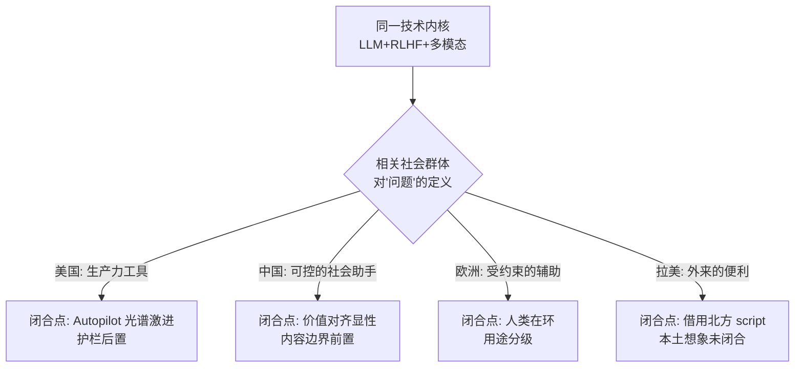

同一套大模型技术（Transformer + RLHF + 多模态）落到中国、美国、拉美、欧洲，为什么长成了形态、监管、商业模式都不同的产品？本节点要解决的问题是：当一家公司做 AI 国际化时，它到底在跨越什么——是语言、是 UI，还是某种更深的东西？本节的视角是把 Jasanoff 的**社会技术想象（sociotechnical imaginaries）** 与 Pinch & Bijker 的 **SCOT（技术的社会建构）** 拼成一台双镜头分析仪：imaginaries 看"一个社会想用 AI 实现什么样的未来秩序"，SCOT 看"相关社会群体如何把同一人工物协商成不同形态"。判断主轴一句话：**AI 国际化不是翻译，是 imaginaries 的再建构**——把一个产品的 script 从一套社会秩序的想象里拔出来，重新嵌进另一套。这是 Rick 在滴滴/99 巴西-拉美一线踩过的、招聘 JD 永远说不清的那道墙。

## §0 为什么是 imaginaries+SCOT，而不是"用户采纳曲线"

PM 默认的跨文化框架是 **Rogers 的创新扩散曲线**（早期采用者→晚期大众）或 Hofstede 文化维度（个人主义/集体主义那套打分卡）。这两个框架的共同错误是把"文化差异"当成**同一条产品轨道上的快慢**：技术是给定的、最优形态是唯一的，只是不同社会以不同速度爬同一条曲线。这正是 STS 用四十年火力打掉的**技术决定论**——"通向现在的路径并非唯一可能的路径"（Wikipedia SCOT 条目，WebFetch 核实；Pinch & Bijker 1984，*Social Studies of Science* 14(3): 399–441，SAGE DOI 已核实）。

为什么需要两个框架而不是一个？因为它们切的层不同，且互补：

| 框架 | 切的层 | 回答的问题 | 单用的盲区 |
|---|---|---|---|
| **Imaginaries**（Jasanoff & Kim 2009/2015） | 宏观·国家/制度 | 这个社会"想用 AI 实现什么可欲未来" | 看不见产品层的具体协商 |
| **SCOT**（Pinch & Bijker 1984） | 中观·相关社会群体 | 哪些群体把人工物诠释成什么 | 早期版本对宏观结构（资本、国家）不敏感（Klein & Kleinman 2002，SAGE DOI 已核实） |

Imaginaries 解释"为什么中美欧的监管底色不同"，SCOT 解释"为什么同一个聊天框在巴西和德国被做成两种东西"。把宏观想象和中观协商扣在一起，才能解释 Rick 真正遇到的现象：不是某个市场"AI 渗透率低"，而是那个市场对 AI 的**问题定义本身**就不一样。

## §1 四象限：同一技术，四种 imaginary

用 Jasanoff/Kim 的定义——想象是"集体持有、制度上稳定化、并被公开表演的关于可欲未来的愿景"——把四个市场的 AI 主导想象排开（综合 Richter, Katzenbach & Zeng 2025，*Journal of Science Communication*，n=40 访谈批判性话语分析；及 2009 核能跨国比较的范式）：

| 市场 | 主导 AI 想象 | 国家自我定位 | 监管底色 | 产品形态后果 |
|---|---|---|---|---|
| **美国** | "全球霸权的 AI 竞赛"（绑定美国例外主义）+ 产业主导 | 创新引擎，监管让位于竞争 | 轻触、事后、行业自律 | 能力优先、护栏后置、Autopilot 激进 |
| **中国** | "可信赖的社会解决方案" + 追赶中的超级大国 | 技术整合进社会治理 | 前置审批、内容备案、算法登记 | 安全/合规内嵌设计、价值对齐显性化 |
| **欧洲** | "主权 AI 竞赛"（受规制的第三极）+ 人类控制下的工具 | 规则制定者、价值守门人 | 风险分级、事前合规（AI Act 框架） | 可解释性、人类在环、用途分级 |
| **拉美** | 〔无单一国家级想象——见 §2 的判断主轴〕 | 技术接受者/被治理者 | 碎片化、滞后、借用他国框架 | 想象被外部 script 殖民 |

> [!note] 跨域呼应一（imaginaries 的制度惯性）
> Jasanoff 2015《Dreamscapes of Modernity》的核心命题：想象一旦制度化，就有**惯性，能抵御反证**。2009 年核能论文给出的经典对照——美国是"驯空原子"（containing the atom，国家定位为应对失控技术的监管者，三里岛/切尔诺贝利被吸收为强化监管的依据），韩国是"发展的原子"（atoms for development，核技术整合进民族发展叙事）——同一技术、两种治理。把"核能"换成"生成式 AI"，框架原样成立：**同一个 GPT-4 级模型，在"竞赛想象"下被催着放开，在"治理想象"下被要求先备案**。这不是监管严松的程度差异，是想象层的种类差异。

## §2 判断主轴：国际化不是翻译，是 imaginaries 再建构

这是本节点的命门，也是 Rick 的一手资产能直接落地的地方。90% 的产品国际化在这四个点上翻车——每个都给"症状→为什么会错→正确做法→真实反例"四件套。

**错位一：把 i18n 当 localization 的终点。**
- 症状：团队把"国际化"等同于翻译字符串 + 适配货币/日期 + 换图标。AI 产品尤甚——以为把 prompt 模板和回答翻成葡语就完成了巴西版。
- 为什么会错：翻译迁移的是**符号**，迁移不了 **script**。Akrich 1992（"The De-Scription of Technical Objects"，收于 Bijker & Law 编《Shaping Technology / Building Society》，MIT Press，pp. 205–224；注意编者是 Bijker & **Law** 非 Pinch，二手文献常错，已核实）指出：设计者把"对未来世界的预测与愿景"铭刻（inscription）进技术物，产物即 script。一个美国设计的 AI 助手，其 script 预设了一个**高信任、高文本素养、信用卡普及、把效率当默认善**的用户。这套预设在巴西低信用卡渗透、高现金依赖、对自动化扣费高度警惕的语境里直接失效。
- 正确做法：做 **de-scription**——先读出原产品铭刻了哪套用户预设，再判断目标市场的 imaginary 要求哪套，重新 inscription。
- 真实反例（Rick 一手）：滴滴/99 在巴西做的 PDP现金支付纠纷治理 与 CPF实名验证。北美/中国网约车的 script 默认"绑卡即结算、身份即真实"；巴西现金支付比例高，CPF（个人税号）的社会含义、伪造/共用模式、乘客对"实名"的接受度都不同。把中国的实名徽章方案直译过去会被当成隐私入侵或形同虚设——这正是 SCOT 说的"相关社会群体对同一人工物给出完全不同诠释"（解释弹性，interpretive flexibility，SCOT 最具区别性的概念，已核实）。AI 反欺诈/风控产品移植时同理：模型把"非典型行为"判为欺诈，而那"非典型"恰是另一社会的常态。

**错位二：以为目标市场有一个等你去满足的 imaginary。**
- 症状：把"拉美"当一个待填的需求空位，套用"教育市场"逻辑——用户还没想象到 AI 能干嘛，我们去教育。
- 为什么会错：imaginaries 是**集体持有、被公开表演**的，不是个体偏好之和。很多市场（尤其全球南方）的 AI 想象是**被外部 script 殖民**的——它消费的是北方公司铭刻好的产品，没有制度化的本土想象。这正是 imaginaries 框架被批评"国家中心、精英偏向、低估从属性想象"的地方（Rudek 2021，*Science and Public Policy* 49(2)，已核实），但这个批评恰恰是 PM 的机会：**南方市场的想象处在未闭合（pre-closure）状态，谁先 inscription，谁就定义这个市场对 AI 的问题框架**。
- 正确做法：做的是 imaginary 的**再建构**而非满足——主动协商目标市场相关社会群体（监管者、本地运营商、司机/乘客社群、媒体）对"AI 该解决什么"的定义。
- 真实反例：Rick 的 降发生方法论 与 安全感知与干预。"安全"在巴西/拉美语境里的相关社会群体（受暴力影响的女性乘客、被算法派单的司机、与警方关系紧张的社区）对"什么算安全、谁来定义干预"的诠释，和中国/美国差异巨大。AI 安全感知产品不是把中国模型搬过去，是重新协商"安全想象"——这是 imaginary 再建构的字面意义。

**错位三：把监管差异读成"宽松/严格"的一维标尺。**
- 症状：用一根滑块衡量各国监管——美国宽、欧洲严、中国"特殊"。
- 为什么会错：监管不是松紧度，是**不同 imaginary 的制度化产物**，方向都不同。欧洲的"人类控制下的工具"想象产出**用途分级 + 可解释性**要求；中国的"可信赖社会解决方案"想象产出**内容备案 + 价值对齐前置**；两者都"严"，但严在完全不同的维度。把它们放一根滑块上，你会在欧洲过度投资内容审核（那是中国维度）、在中国过度投资 explainability dashboard（那是欧洲维度）。
- 正确做法：先识别目标市场是哪种 imaginary，再判断它把合规重量压在哪个产品环节。
- 真实反例：疲劳驾驶合规 与 费用治理。同样是"算法管人"，欧洲框架问"司机能否申诉、决策能否解释"，中国框架问"是否符合平台责任与社会稳定预期"，巴西框架可能根本没有对应规则、得借用欧盟 GDPR 的影子。同一个疲劳监测 AI，三地的合规剖面不重叠。

**错位四：忽略 AI 的 script 比传统产品更强——它在改写用户行为。**
- 症状：把 AI 产品当成"更聪明的传统软件"做国际化，沿用静态本地化清单。
- 为什么会错：传统产品的 script 铭刻在固定界面里；AI 产品的**输出本身就在持续 re-inscription**。一个生成式助手每次回答都在向用户演示"什么问题值得问、什么答案算好"，它在**实时建构用户的 imaginary**。EASST 2026 专题正在争论这一点——生成式 AI 是否颠覆了 Akrich 1992 的 script 概念，因为"谁在铭刻"（训练者？提示工程师？用户？）极度模糊（EASST Eurograd 2026-04-29 消息，争议中〔尚无定论〕）。对国际化的含义：你导出的不只是产品，是一台持续向目标社会推送某种 AI 想象的机器。
- 正确做法：把"模型输出的文化预设"纳入合规与产品审查，而非只审 UI 文案。
- 真实反例：乘客信息透明化。模型/算法决定"展示哪些乘客信息给司机"时，内嵌了一套关于隐私/信任的预设；在巴西展示和在中国展示，重塑的是不同社会的信任规范——这是 AI script 在改写行为，不是被动适配。

## §3 SCOT 微观机制：同一聊天框，四种闭合

Imaginaries 解释了宏观底色，SCOT 解释产品层的具体分叉。用 SCOT 三概念跑一遍"AI 助手"这个人工物：

- **相关社会群体（relevant social groups）**：监管者、平台、开发者、本地运营、用户社群、媒体。每个市场的群体构成与话语权重不同——这决定了谁的诠释会主导闭合。
- **解释弹性（interpretive flexibility）**：同一个"AI 自动决策"，对美国生产力社群是赋能，对欧洲数字权利社群是需被约束的风险，对巴西现金经济用户可能是不可信的扣费威胁。这不是用户"不懂"，是诠释本就开放。
- **闭合与稳定化（closure & stabilization）**：通过修辞闭合（声称问题已解决）或问题重新定义达成。关键判断：**国际化失败往往是把 A 市场已闭合的方案，强加到 B 市场尚未闭合的争议上**——你以为问题解决了，目标市场的相关群体根本没参与那次协商。

> [!note] 跨域呼应二（ANT：AI agent 作为非人行动者）
> 把分析推到组织层，用 Latour/Callon 的 ANT（行动者网络理论）。AI agent 不是工具而是 **actant**（行动元，本体论对称地纳入分析）。当 [Agent](/kb/基础知识库/agent/) 进入一个跨国组织的工作流，它会重组权力与信息流——成为 Callon 转译模型里的**必经节点（OPP, obligatory passage point）**：所有决策得经它过滤（Callon 1984，*The Sociological Review* 32(S1): 196–233，圣布里厄湾扇贝研究，已核实；Morton Gutiérrez 2023/2024 "On Actor-Network Theory and Algorithms: ChatGPT…"，*AI and Ethics* 4: 1071–1084，DOI 10.1007/s43681-023-00314-4，已核实，把 [ChatGPT](/kb/ai-公司与产品/chatgpt/) 作为重构权力关系的非人行动元）。对国际化的含义：你部署的不是一个会说葡语的助手，是一个会**重新安排本地团队权力关系**的行动元。它在巴西团队和在北京团队登记（enrollment）出的网络不同——同一个 [Anthropic](/kb/ai-公司与产品/anthropic/) 或 OpenAI 模型，转译出两套组织。

## §4 产品 PM 视角补盲：工程之外的三个看走眼点

跳出"工程国际化"（多语言、时区、CDN）视角，补三个非技术盲点：

1. **用户心理模型差异不是偏好，是信任的社会基础设施。** 巴西用户对"自动扣费"的警惕，根源是对金融机构和平台的低制度信任，不是个体保守。AI 产品若默认"用户信任自动化"，等于把美国的信任基础设施当普世前提——这会触发 [幻觉](/kb/基础知识库/幻觉/) 的不对等放大：弱势/低数字素养用户更难识别模型错误，错误后果（错误扣费、错误风控封号）落在他们身上更重。

2. **商业模式被 imaginary 锁定。** "竞赛想象"下美国能跑订阅制 + 能力溢价；"治理想象"下中国的 AI 商业化绑定 B 端合规与政府场景；拉美低 ARPU + 高现金比例使订阅制水土不服。同一个模型，变现路径由想象决定，不是定价能力问题。

3. **合规边界是 GTM 的前置变量不是后置清单。** 在欧洲，AI Act 的用途分级决定你能不能上线某功能（高风险用途需事前合规）；在中国，算法登记/内容备案决定上线节奏；把合规当"上线后补"，等于赌错 imaginary。

## §5 对手框架回应（接受 + 边界）

**对手一：Hofstede / Rogers 路线（业界主流跨文化框架）。** 接受——文化维度打分和采纳曲线在做**粗粒度市场排序、营销节奏**时有操作价值，imaginaries 太重、不适合每个 sprint 都跑。边界：它们假设产品轨道唯一、只是快慢，这在 AI 这种 script 强、形态高度可塑的产品上会系统性误导。**赌注**：我赌"形态分叉"比"采纳快慢"对 AI 国际化决策更致命；若未来 AI 产品高度标准化（像 USB 接口那样闭合到全球单一形态），这个赌注会变弱。

**对手二：imaginaries 框架自身的批评者（Rick 未读的对手框架 #1）。** Rudek 2021 与 Waller（~2020，SSRN:3605494，已核实）批评：imaginaries 国家中心、精英偏向、循环论证（想象主导因为有表演力，表演力又来自表演本身），且大量研究只**登记**既有想象、不追问其**形成机制**。接受——这是真问题，本节点对"拉美无单一想象"的判断确实主要基于政策/媒体话语，**忽视了普通人叙事与流行文化**〔此处是边界，非确证〕。边界：对 PM 而言，"登记主导想象"恰恰是可操作的最小动作，形成机制的学术完备性不是上线决策的前置。

**对手三：企业正在取代国家成为想象生产者（Rick 未读的对手框架 #2）。** Barkett 2026（"The Compulsory Imaginary: AGI and Corporate Authority"，arXiv:2602.23679，已核实）把想象框架从民族国家延伸到私营企业，分析 Altman《The Intelligence Age》与 Amodei《Machines of Loving Grace》的四种修辞操作（自我豁免、目的论自然化、有限承认、隐性不可或缺）。接受并升级本节点：**国际化的对手未必是目标国政府，而是已经全球铺开的企业想象**——OpenAI/Anthropic 的产品本身在向各国推送一套 AGI 想象，本地化是在和这套企业想象竞争话语权。这是 §2 错位四的理论根。

> [!warning] failure scenario
> 本节点的核心判断"国际化=imaginaries 再建构"在以下场景失效：(a) 纯 B 端 API 中间件产品，几乎无终端用户 script，文化想象层影响弱；(b) 监管已全球协调收敛的领域（若出现全球 AI 条约）；(c) 目标市场被单一企业想象彻底闭合、本土协商空间归零时，框架从"再建构"退化为"接受既定 script"。

## §6 PM 决策启示（三类落地）

- **面试**：被问"怎么做 AI 产品国际化"时，30 秒框架——"国际化不是翻译是 imaginaries 再建构：先 de-scription 读出原产品铭刻的用户预设，再识别目标市场的主导 AI 想象（竞赛/治理/工具/未闭合），重新 inscription；监管不是松紧滑块是不同想象的制度化，合规重量压在不同环节。" 配巴西 CPF/现金支付一手反例，立刻区别于背诵 Hofstede 的候选人。
- **选型/立项**：跨国上线前跑一张"四象限 × 相关社会群体 × 闭合点"表，识别"我把哪个市场已闭合的方案强加给了未闭合的争议"。
- **复现/落地**：把"模型输出的文化预设审查"纳入 review pipeline（呼应 §2 错位四），不只审 UI 文案。

## §7 与已有节点的关系

- **升级对照 Rick 国际化节点**：PDP现金支付纠纷治理、CPF实名验证、乘客信息透明化、降发生方法论、安全感知与干预，以及他在出行平台安全感知方向、费用治理实践的一手工作履历，这些是 Rick 的**一手经验记录**；本节点对它们做的是**理论拔高（深化）**——把"巴西现金支付难题"从案例上升为"script 迁移失败"的一般机制，给一手经验配上 STS 解释框架。不复述这些节点的事实细节。
- **对照专题内节点**：本节点（S03）是架构剖面层的跨文化切片，依赖 [S01 Agent 六层架构剖面](/kb/专题-安全对齐与失败/s01-agent-六层架构剖面/)〔此为 0411 专题节点，仅在 ANT/agent 层相关时引用〕的 agent 概念；与本专题 imaginaries/SCOT/Akrich/ANT 基础节点构成调度关系。
- **链入图谱**：[AI PM 知识图谱·总索引](/kb/ai-pm-知识图谱/ai-pm-知识图谱-总索引/)、0117社会学、0115道德哲学-伦理学、人类学、民族志、霸权、生命政治。

## §8 关联节点

**核心（必读）**
- PDP现金支付纠纷治理 — script 迁移失败的一手反例
- CPF实名验证 — 实名的解释弹性
- 安全感知与干预 — 安全想象的跨文化再建构
- [Agent](/kb/基础知识库/agent/) — ANT 中的非人行动者
- [幻觉](/kb/基础知识库/幻觉/) — 跨文化的不对等放大
- 0117社会学 — STS 入口
- 人类学 — Rick 的不公平优势底子

**延伸（可选）**
- [ChatGPT](/kb/ai-公司与产品/chatgpt/) / [Anthropic](/kb/ai-公司与产品/anthropic/) — 企业想象的载体
- 乘客信息透明化 / 降发生方法论 / 费用治理 / 疲劳驾驶合规
- 出行平台安全感知方向 / 出行平台费用治理实践（均为一手履历）
- 民族志 — de-scription 的方法亲缘
- 霸权 / 生命政治 — 北方 script 殖民的批判资源
- 0115道德哲学-伦理学
- [AI PM 知识图谱·总索引](/kb/ai-pm-知识图谱/ai-pm-知识图谱-总索引/)

## 修订日志
- R1（2026-06-07）：首稿。建立 imaginaries+SCOT 双镜头框架；四象限表；判断主轴四错位（i18n≠localization、市场无现成 imaginary、监管非一维、AI script 自我改写）配 Rick 一手反例；三处对手回应（Hofstede/Rogers、imaginaries 自身批评、Barkett 企业想象）；两处跨域呼应（Jasanoff 制度惯性、Latour ANT/OPP）；failure scenario；升级对照 Rick 国际化节点。arXiv:2602.23679 已 WebFetch 核实（Barkett 2026，标题/作者/日期/论点全对）。
- 2026-06-12 内审·arXiv 联网核实：清了 0 个、存疑 0 个（本节点唯一 arXiv:2602.23679 此前已核实；本轮重新 WebFetch 复核仍为真实论文，标题/作者/提交日不变）。
