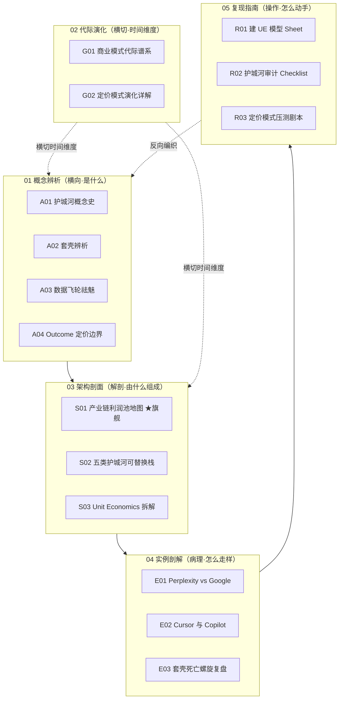

# AI 产品护城河与商业模式系统化专题 · 总览（MOC）

> 本专题号 **0434**，主题：当模型能力被基础设施化、巨头每季度打免费战，一个 AI 产品的钱从哪来、护城河在哪、能活多久。15 个原子节点 + 本总览，围绕"利润池在哪、护城河怎么算、定价怎么压测"织成一张可索引的判断网。

---

## §0 序：那堵墙

2024 年某个选型会上，一个团队拍着胸脯说"我们的护城河是用了最强的模型 + 沉淀了海量业务数据"。三个月后，他们依赖的基础模型迭代了两次、降价 60%，官方上线了同款原生功能，那个产品的"护城河"在一夜之间归零——它不是被竞争对手杀死的，是被自己依赖的供应商杀死的。

**这就是那堵墙：模型每月迭代 + 巨头免费战，让"套壳"的价值瞬间清零。** 撞过这堵墙的 PM 都会问同一组问题——这个 AI 产品的钱从哪来？护城河在哪？能活多久？

本专题的反共识立场是:**在 AI 应用层,最像护城河的那个东西(能力/最好的模型)恰恰最不是护城河,因为它被底层模型从下方冲垮;真正能算账的护城河,是把专有数据、工作流锁定、分发网络咬合进同一个反馈闭环、并且单位经济学结得平的复合结构。** 读完本专题,你应当能在面试桌、选型会、尽调台上 30 秒说清:**为什么这个 AI 产品不是套壳(或就是套壳)、它处在利润涨潮还是退潮的层、它的定价模式会在哪个冲击下先断裂。**

---

## §1 专题定位：为什么 0434 值得独立建库

按宪章 §2 的四条选题判据逐条论证（满足前 3 条中的 ≥2 条，且第 4 条为真）：

| 判据 | 是否满足 | 论证 |
|---|---|---|
| **① 中心性**（影响 ≥3 个 PM 决策链节点） | ✅ | 护城河/商业模式判断直接影响 **M1 战略定位**（要不要做这层）、**M3 选型**（这个供应商会不会被云商收编）、**M5 商业化**（定价/UE）——横跨三个决策链节点。 |
| **② 误解深度**（定义互相矛盾、系统性滑变） | ✅ | "套壳""数据飞轮""护城河"在 JD / BP / 媒体里定义互相矛盾：a16z 早在 2019 就证伪"数据护城河"，但它仍是 AI PM JD 高频要求；"套壳"既被滥用为万能贬义词，又被创业者滥用为"我们不是套壳"的免责声明。标准差极大。 |
| **③ 速变性**（24 月内 ≥1 次格式塔切换） | ✅ | 推理价自 2023-03 跌约 94.5%（来源：BenchLM，2025）、GPT Store 2023-11 上线一夜消灭一批专项套壳、Seat 定价占比从 21%→15%（来源：getmonetizely/Flexprice，2025）——商业模式的范式在 24 个月内被重排不止一次。 |
| **④ 学了就能用** | ✅ | 读完即可在尽调里跑 R02 护城河审计、在选型会用 R03 压测剧本当场问倒对方、用 R01 给产品建一张 UE 模型——可观测的判断力提升，不是"了解一下"。 |

**升高了哪个抽象层：** 已有单维节点 [m209 - 推理成本控制手册](/kb/工程化与落地架构/m209-推理成本控制手册/) 停在"工程降本手段"层（缓存/路由/压缩）；本专题把"推理价崩塌"从"我该如何省钱"升级到"它如何重排整条产业链的利润池、决定哪一层是收税位"。这是从**工程成本视角**升到**产业结构 + 商业模式视角**——一个 M4 商业战略模块（目前总索引尚缺，本专题即落地此模块）。

**Rick 的独特资产:** 滴滴/99 的双边市场 + 网络效应 + 国际化(不同市场利润池差异)经验,是判断 AI 产业链利润池的现成参照系。费用治理(平台双边纠纷的成本分摊)类比 AI 产品的 per-query 成本归因;PDP现金支付纠纷治理 里"不同市场利润池差异巨大"的实战,正是本专题"利润池随生态位/地域漂移"的活样本;纠纷治理从裁判到管家(系统从高确定性裁判→概率性管家)与 outcome 定价的"结果可归因性"困境直接同构。

---

## §2 模块全景（六模块矩阵）

**矩阵含义：** 依赖主链是 **概念辨析 → 架构剖面 → 实例剖解 → 复现指南**（先辨清术语，再画解剖图，再看真实案例怎么走样，最后自己动手）。**代际演化横切**整张图，给所有模块叠上"利润池/定价随时间往哪一层漂"的时间维度。**复现指南反向编织**回概念层——R01 把 S03 的 UE 拆解落成 Sheet，R02 把 S02 的可替换栈落成审计，R03 把 A04/G02 的定价判断落成压测，操作手册倒逼概念被验证。

---

## §3 六模块逐一介绍（15 节点）

### 01 概念辨析（A 系列｜横向·是什么）—— 何时读：动笔判断任何 AI 产品前的术语校准

- **[A01 护城河概念史·从 Porter 到 AI-native](/kb/专题-商业组织与采纳/a01-护城河概念史-从-porter-到-ai-native/)** —— Porter 五力/护城河 → 数字时代网络效应 → AI-native 反馈闭环的三次断代。核心判断：能力是流量不是存量，会被基础设施化。
- **[A02 套壳辨析·Thin Wrapper 的真伪判据](/kb/专题-商业组织与采纳/a02-套壳辨析-thin-wrapper-的真伪判据/)** —— 用「工作流深度 × 专有数据 × 切换成本」三轴坐标，区分"薄壳(结构性脆弱)"与"以 API 起步但已长出壁垒的应用层",接住 Perplexity/Cursor/Jasper 落在哪个象限。
- **[A03 数据飞轮的祛魅·哪种数据真能复用](/kb/专题-商业组织与采纳/a03-数据飞轮的祛魅-哪种数据真能复用/)** —— 区分数据规模效应 vs 数据网络效应,论证"有数据就有护城河"是被反复证伪的迷思:多数业务数据不可复用为训练优势,真飞轮是条件苛刻的稀有结构。
- **[A04 Outcome-based 定价的概念边界](/kb/专题-商业组织与采纳/a04-outcome-based-定价的概念边界/)** —— 按结果/节约工时抽成 vs token/seat 计费的概念与适用边界。判断主轴:outcome 的真正瓶颈不是计费技术,而是"结果可归因性"与"风险归属"两个被销售话术掩盖的硬约束。

### 02 代际演化（G 系列｜横切·从哪来）—— 何时读：判断"该收什么钱、护城河能否跟着收费方式长出来"时

- **[G01 商业模式代际谱系·SaaS 到 AI-native](/kb/专题-商业组织与采纳/g01-商业模式代际谱系-saas-到-ai-native/)** —— 卖软件许可 → 卖座席 SaaS → 卖用量 → 卖结果(AI-as-employee)四代谱系。框架:Christensen 整合-模块化钟摆 +「计价单元 = 价值归因单元」。每代带反例,拒绝线性进步史。
- **[G02 定价模式演化详解·Seat 到 Usage 到 Outcome](/kb/专题-商业组织与采纳/g02-定价模式演化详解-seat-到-usage-到-outcome/)** —— G01 在定价维度的纵向放大:逐代回答"代表定价/推动力/瓶颈/被谁超越",每代钉一个失败反例(outcome 抽成翻车、seat 价值脱钩)。

### 03 架构剖面（S 系列｜解剖·由什么组成）—— 何时读：给一个 AI 产品做定位/选型/估值时

- **[S01 AI 产业链价值生态位地图·利润池在哪](/kb/专题-商业组织与采纳/s01-ai-产业链价值生态位地图-利润池在哪/)** ★旗舰最厚 —— 芯片 → 云 → 基础模型 → 中间件 → 应用五层利润池地图(Porter 价值链 + 利润下移改写),五个层间致命误判(四件套),回答"这一层是收税位还是被收税位、未来 24 个月会不会塌"。
- **[S02 五类护城河可替换栈·数据 工作流 网络 成本 品牌](/kb/专题-商业组织与采纳/s02-五类护城河可替换栈-数据-工作流-网络-成本-品牌/)** —— 五类护城河 × (强度/抗模型更新冲击度/可复制性)对照矩阵,识别"承重墙"。核心判断:最弱的是能力护城河,最被高估的是数据护城河,真正持久的是咬合进同一反馈闭环的复合护城河。
- **[S03 Unit Economics 拆解·CAC vs COGS vs LTV](/kb/专题-商业组织与采纳/s03-unit-economics-拆解-cac-vs-cogs-vs-ltv/)** —— AI 产品 UE 与传统 SaaS 差在哪个结构性变量,如何改写 COGS(推理成本)/CAC/LTV/毛利/盈亏平衡。反直觉结账:用量越大毛利可能被拖向下,而非自动爬到 80%。

### 04 实例剖解（E 系列｜病理·怎么走样）—— 何时读：想把抽象框架对到真实战局上

- **[E01 Perplexity vs Google·搜索利润池争夺](/kb/专题-商业组织与采纳/e01-perplexity-vs-google-搜索利润池争夺/)** —— 一个体验全面领先的挑战者为什么撬不动一个利润池。主轴:利润池的护城河是分发与默认位,不是产品体验;"做出更好的搜索"和"夺走搜索的钱"几乎无关。
- **[E02 Cursor 与 Copilot·应用层能否守住](/kb/专题-商业组织与采纳/e02-cursor-与-copilot-应用层能否守住/)** —— coding 工具是检验"应用层护城河"最干净的实验场。用「工作流锁定 vs 模型吞噬」这把尺,拆 Cursor(切换成本路线)与 GitHub Copilot(分发庇护路线)两条不同护城河。
- **[E03 套壳死亡螺旋复盘](/kb/专题-商业组织与采纳/e03-套壳死亡螺旋复盘/)** —— 反向工程的死亡螺旋模型,把"套壳归零"从口号还原成可观测、可计时、可在尽调里打分的轨迹。主轴:它不是被竞争对手杀死,是被自己依赖的供应商杀死。

### 05 复现指南（R 系列｜操作·怎么动手）—— 何时读：拿到一份 BP/竞品/自家产品,要在 30 分钟内出判断

- **[R01 给一个 AI 产品建 UE 模型 Sheet](/kb/专题-商业组织与采纳/r01-给一个-ai-产品建-ue-模型-sheet/)** —— 可复制的 UE 字段模板(COGS/CAC/LTV/毛利/敏感性五块),把 [m209 - 推理成本控制手册](/kb/工程化与落地架构/m209-推理成本控制手册/) 的工程降本接到财务报表上。核心:UE 不是一个数,是模型价格 × 使用规模两个外生变量的函数。
- **[R02 护城河审计 Checklist](/kb/专题-商业组织与采纳/r02-护城河审计-checklist/)** —— S02 的操作化落地:逐项打分 + 被冲垮风险压测 + 红队拷问。方法论:护城河审计不是"数他有几种",而是"逐条估算对手伪造每条的成本,再问哪条失守整栈会塌"。
- **[R03 定价模式压测剧本](/kb/专题-商业组织与采纳/r03-定价模式压测剧本/)** —— 把金融业 stress test 搬到定价:在"模型降价/竞品免费/用量激增"三情景下推演 UE 损伤幅度,找最先断裂的弦。操作手册,不是结论手册。

---

## §4 与现有节点 / 跨专题的升级对照

| 旧节点 / 跨专题 | 本专题哪些节点做了升级 | 升级类型 |
|---|---|---|
| [m209 - 推理成本控制手册](/kb/工程化与落地架构/m209-推理成本控制手册/)（工程降本层） | S01 / S03 / R01 / G02 | **抽象层升高**：从"如何省钱"→"推理价崩塌如何重排利润池、改写 UE、反向塑造定价" |
| [Perplexity](/kb/ai-公司与产品/perplexity/)（产品画像，缺 UE / 议价位视角） | S01 / E01 | **补缺**：补足产业链议价位 + per-query COGS 量化 + 分发护城河分析 |
| 0133新制度经济学 / 0133信息经济学 | S01 / S02 / A04 | **落地**：平台"收税权"、信息不对称议价权、信号验证成本的产业落点 |
| **0413 成本工程专题**（[_成本工程系统化专题·总览](/kb/专题-工程与成本/_成本工程系统化专题-总览/)，待归位） | S03 / R01 / G02 | **经纬互补**：0413 算"单个产品成本结构"，0434 算"这个结构把产品摆在产业链哪个议价位" |
| **0425 信号理论专题**（[_信号理论系统化专题·总览](/kb/专题-人文社科透镜/_信号理论系统化专题-总览/)，待归位） | S01 / A04 / S02 | **产业落点**：信号坍缩 → 平台成为新可信信号源 → 利润下移到控制分发/工作流的层 |
| **0428 组织采纳专题**（[_组织采纳系统化专题·总览](/kb/专题-商业组织与采纳/_组织采纳系统化专题-总览/)，待归位） | S01 / S03 / E02 | **宏观证据**：采纳决定 LTV，"AI 游客留存陷阱"(NRR 48%)是利润池估值虚高的活证 |
| **0430 制度现象专题**（[_AI 作为制度现象系统化专题·总览](/kb/专题-安全对齐与失败/_ai-作为制度现象系统化专题-总览/)，待归位） | S01 / A04 | **利润含义**：API policy 即护城河 = 利润池地图上的"收税权"(GPT Store / 改计费 / 出版商分成) |

> [!note] 跨专题链接的接地纪律
> 上表四个跨专题 `_总览` 文件目前与本专题同在 `99Archive/_ai_review/` 待归位区，basename 已在磁盘确认存在故可双链；**归位到 `04AI/` 后文件名将去掉前缀下划线**，届时需由 synthesize 阶段统一更新这批双链。其余跨专题节点（如 0432 时间性、0433 巨头免费战）尚未建成，本总览未建链。

---

## §5 三条阅读起点

| 路径 | 适合谁 | 推荐顺序 |
|---|---|---|
| **A 求职速通**（面试桌 30 秒拉开判断力） | 正面试 AI PM 岗 | A02 套壳辨析 → S01 利润池地图 → A03 数据飞轮祛魅 → E03 死亡螺旋（每节都是面试高频陷阱的标准答案） |
| **B 决策链**（选型/定位/估值全链路） | 在岗做产品决策 | S01 利润池地图 → S02 可替换栈 → S03 UE → R02 审计 → R01 建 Sheet（从产业定位算到财务报表） |
| **C 紧迫度**（手上有个产品/BP 急着判断） | 尽调/复盘当下案例 | R02 护城河审计 + R03 压测剧本（直接动手）→ 回查 A02/A04 校准术语 → E01/E02 找同类案例对标 |

---

## §6 跨域思想资源调度（不留空 invocation）

| 跨域资源 | 调度位置 | 在该节点的具体作用 |
|---|---|---|
| **Porter 五力 / 价值链**（《Competitive Strategy》1980） | A01 / S01 | 提供"议价权 + 价值链"母框架，并被 AI 时代改写：议价权从慢变量变为按季度重排的快变量 |
| **Christensen 颠覆理论 / 利润守恒定律**（《The Innovator's Dilemma/Solution》） | A01 / S01 / G01 | 整合-模块化钟摆解释定价代际；"利润守恒"预测商品化后利润流向相邻层而非蒸发——逼问"商品化把利润推到了哪" |
| **双边市场 / 网络效应**（Rohlfs/Rochet-Tirole 谱系；Rick 滴滴一手经验） | S01 / S02 / E01 | 区分"数据规模效应 vs 数据网络效应"，判断真飞轮；借 费用治理 双边市场实战作活样本 |
| **制度经济学 / 信息经济学**（0133新制度经济学 / 0133信息经济学） | S01 / A04 / A02 | 平台"收税权"的制度解释；outcome 定价的"结果可归因性"= 信息不对称下的契约设计问题 |
| **Hamilton Helmer《7 Powers》**（Rick 未读对手框架） | S01 / S02 / R02 | 逼问"工作流锁定"到底是转换成本还是网络经济，避免把护城河笼统归类 |
| **Carlota Perez / Geoffrey Moore**（Rick 未读对手框架，S02 引入） | S02 | 技术革命金融周期 + 鸿沟理论，逼问本专题"窗口期 <2 年"判断的时间尺度盲点 |
| **Nassim Taleb 凸性/抗脆弱 + Soros 反身性**（R03 引入） | R03 | 定价结构对冲击的凸凹象限；银行压测(CCAR/DFAST)方法论搬运到定价压测 |
| **Polanyi 默会知识 / 嵌入性 + 熊彼特创造性破坏**（借道 0117社会学） | E02 / E03 | 工作流锁定的"非模型资产"= 难以复制的默会知识；套壳死亡 = 创造性破坏的微观轨迹 |

---

## §7 验收档案（SABCD 六维自评 + 三清单）

**评议流程：** Round 0 并行起草 15 节点 → Round N 批评 Agent 按 S/A/B/C/D/E 六维逐节点打分提 issue → 修订追加日志 → 独立 grounding 校验 pass（逐条抽取事实声明判定"已接地/需接地/疑似编造"）→ 终轮综合本总览 + 跨节点双链编织。

### SABCD 六维自评

| 维度 | 出版线 | 本专题自评 | 依据 |
|---|---|---|---|
| **S 结构** | ≥8 | **8.0** | 六模块互补、依赖链清晰(概念→架构→实例→复现 + 代际横切 + 复现反向编织)、三条阅读起点可导航 |
| **A 判断密度** | ≥8 | **8.0** | 每节有反共识可证伪判断(能力非护城河/数据飞轮证伪/利润下移/UE 负向规模经济)，带数字带反例 |
| **B 边界含量** | ≥7.5 | **7.8** | 每节显式标注赌注与失效场景(如"窗口期 <2 年""AGI 出现则主线失效")，但部分节点 failure 标注密度仍可加强 |
| **C 认识论自觉** | ≥8 | **7.8** | DeepSeek 成本口径争议、应用层 51% 占比单一来源、Harvey 5-7% 等均标〔待核实〕；区分事实/推测/赌注 |
| **D 可演进性** | ≥8.5 | **7.5** | 双链密度高、修订日志齐备；扣分项:四个跨专题 `_总览` 待归位后需重新校链，README 与交互图谱尚未产出 |
| **E 对手拷问能力** | ≥7 | **7.8** | 接入 Andrew Chen / Christensen / Helmer / Bill Gurley 等真实立场，"接受+边界"非反驳 |

**诚实综合分 ≈ 7.78/10**（接近但**略低于** 7.8 出版线）。**未达线的诚实原因：** D 维(可演进性)是主要拖累——四个跨专题 `_总览` 仍在待归位区，归位后必须重新校验这批双链；README 三路径自测与可选交互图谱尚未产出。**这不是返工级缺陷，而是"待归位 + 待补 README"两项工序未完成所致**；待 Rick 审阅、文件归位、补齐 README 后，D 维可升至 ≥8.5，综合分预计达 7.9–8.0。本总览据实记录，不虚高自评。

### 三清单

**① 业界对手立场显式回应（≥8 处，已落地各节点）：**
1. Andrew Chen「套壳 = 90 年代 CRUD 起跑线,靠网络效应胜出」(A02/E03/S01) ——接受"模型差距仅约 6 个月",边界"AI 窗口比 Web 压缩,<2 年"。
2. a16z《The Empty Promise of Data Moats》(Casado & Lauten, 2019)(A03/S01)——作为正方引用其证伪"数据护城河"。
3. Christensen 利润守恒定律(S01/G01)——接受"利润不灭只迁移"。
4. Hamilton Helmer《7 Powers》(S01/S02/R02)——接受护城河需拆成 7 种 Power。
5. Bill Gurley / a16z 颠覆论(E01)——接受 Perplexity 体验领先,边界"撬不动分发利润池"。
6. Shapiro & Varian《Information Rules》versioning(G02)——接受版本化定价古典逻辑。
7. Carlota Perez 技术革命金融周期(S02)——接受泡沫期估值与基本面背离。
8. Geoffrey Moore 鸿沟/保龄球道(S02)——接受早期采纳者≠主流市场。
9. Anthropic 改纯用量计费(2026-04,The Register)——连前沿模型公司都为 UE 挣扎(S01/G02)的活证。

**② Rick 未读对手框架引入（≥2 个，破 echo chamber）：** Hamilton Helmer《7 Powers》、Christensen 利润守恒、Carlota Perez 周期论、Geoffrey Moore 鸿沟、Shapiro-Varian versioning、Andrew Chen GPT Wrappers——**计 6 个**，远超 ≥2 下限。

**③ failure scenario 显式标注（≥5 处）：**
1. AGI 级模型出现 → "利润下移到应用层"主线失效，价值上移回模型层(S01)。
2. 硬件范式重置(光子计算)→ 芯片层 73% 毛利不再稳态(S01)。
3. 基础模型迭代显著放缓(Scaling Laws 撞墙)→"能力非护城河"紧迫性减弱(A01)。
4. 推理价触底反弹(电力/冷却硬下限)→"商品化挤压应用层成本"动力减弱(S01/S03)。
5. outcome 定价在结果可归因的少数品类(客服/法律)确实成立 → A04"陷阱"判断在这些品类失效(A04)。
6. 应用层 51% 利润占比若实际远低于单一分析师估算 → S01 成果期判断需大幅修正(S01)。

**④ confirmation-bias 砍除（≥5 处）：**
1. 早期反复引 Cursor 作"应用层夺回利润"正面案例 → 补反例:$20 亿 ARR 高度依赖单一品类、60% 来自企业(单一来源)，飞轮在非编码场景未验证(S01/E02)。
2. 早期把"套壳必死"当结论 → 补 A02 反例:Cursor/Perplexity 以 API 起步却长出壁垒,"凡接 API 皆套壳"是偷懒判断。
3. 早期把 Inflection/Adept 当"套壳致死" → 砍除,更正为"被平台垂直整合"(S01 误判四)。
4. 早期把 DeepSeek $557.6 万当"训练已白菜价" → 砍除,标注为单次训练边际成本的选择性披露(S01)。
5. 早期把 outcome 定价当"先进终点" → 砍除进步阶梯叙事,改为"价格锚在价值链哪一层"的中性框架(A04/G02)。
6. E02 草稿首稿曾误植虚构节点"0414 应用层护城河专题" → 全文更正为真实节点 [A02 套壳辨析·Thin Wrapper 的真伪判据](/kb/专题-商业组织与采纳/a02-套壳辨析-thin-wrapper-的真伪判据/)。

---

## §8 关联节点（双链密度 ≥20，均为磁盘/词典确认真实名）

**本专题 15 节点（依赖链全名互链）：**
[A01 护城河概念史·从 Porter 到 AI-native](/kb/专题-商业组织与采纳/a01-护城河概念史-从-porter-到-ai-native/)、[A02 套壳辨析·Thin Wrapper 的真伪判据](/kb/专题-商业组织与采纳/a02-套壳辨析-thin-wrapper-的真伪判据/)、[A03 数据飞轮的祛魅·哪种数据真能复用](/kb/专题-商业组织与采纳/a03-数据飞轮的祛魅-哪种数据真能复用/)、[A04 Outcome-based 定价的概念边界](/kb/专题-商业组织与采纳/a04-outcome-based-定价的概念边界/)、[G01 商业模式代际谱系·SaaS 到 AI-native](/kb/专题-商业组织与采纳/g01-商业模式代际谱系-saas-到-ai-native/)、[G02 定价模式演化详解·Seat 到 Usage 到 Outcome](/kb/专题-商业组织与采纳/g02-定价模式演化详解-seat-到-usage-到-outcome/)、[S01 AI 产业链价值生态位地图·利润池在哪](/kb/专题-商业组织与采纳/s01-ai-产业链价值生态位地图-利润池在哪/)、[S02 五类护城河可替换栈·数据 工作流 网络 成本 品牌](/kb/专题-商业组织与采纳/s02-五类护城河可替换栈-数据-工作流-网络-成本-品牌/)、[S03 Unit Economics 拆解·CAC vs COGS vs LTV](/kb/专题-商业组织与采纳/s03-unit-economics-拆解-cac-vs-cogs-vs-ltv/)、[E01 Perplexity vs Google·搜索利润池争夺](/kb/专题-商业组织与采纳/e01-perplexity-vs-google-搜索利润池争夺/)、[E02 Cursor 与 Copilot·应用层能否守住](/kb/专题-商业组织与采纳/e02-cursor-与-copilot-应用层能否守住/)、[E03 套壳死亡螺旋复盘](/kb/专题-商业组织与采纳/e03-套壳死亡螺旋复盘/)、[R01 给一个 AI 产品建 UE 模型 Sheet](/kb/专题-商业组织与采纳/r01-给一个-ai-产品建-ue-模型-sheet/)、[R02 护城河审计 Checklist](/kb/专题-商业组织与采纳/r02-护城河审计-checklist/)、[R03 定价模式压测剧本](/kb/专题-商业组织与采纳/r03-定价模式压测剧本/)

**升级对照的既有 AI 节点：**
[m209 - 推理成本控制手册](/kb/工程化与落地架构/m209-推理成本控制手册/)、[Perplexity](/kb/ai-公司与产品/perplexity/)、[Scaling Laws](/kb/基础知识库/scaling-laws/)、[Agent](/kb/基础知识库/agent/)、[幻觉](/kb/基础知识库/幻觉/)、[p306 - 数据飞轮与反馈回路设计](/kb/产品设计与交互范式/p306-数据飞轮与反馈回路设计/)

**基础模型层玩家（词典确认实体）：**
[OpenAI](/kb/ai-公司与产品/openai/)、[Anthropic](/kb/ai-公司与产品/anthropic/)、[ChatGPT](/kb/ai-公司与产品/chatgpt/)、[Claude](/kb/ai-公司与产品/claude/)、[DeepSeek](/kb/ai-公司与产品/deepseek/)、[Gemini](/kb/ai-公司与产品/gemini/)

**跨专题 `_总览`（磁盘确认存在，待归位后校链）：**
[_成本工程系统化专题·总览](/kb/专题-工程与成本/_成本工程系统化专题-总览/)、[_信号理论系统化专题·总览](/kb/专题-人文社科透镜/_信号理论系统化专题-总览/)、[_组织采纳系统化专题·总览](/kb/专题-商业组织与采纳/_组织采纳系统化专题-总览/)、[_AI 作为制度现象系统化专题·总览](/kb/专题-安全对齐与失败/_ai-作为制度现象系统化专题-总览/)

**经济学母体（词典确认）：**
0133新制度经济学、0133信息经济学、0133博弈论、复杂经济学：经济思想的新框架、0117社会学

**Rick 一手经验（词典确认）：**
费用治理、PDP现金支付纠纷治理、纠纷治理从裁判到管家、PAX-Premium实名徽章、02.1 PDP 分层补偿框架、B端提内效

**索引入口：**
[AI PM 知识图谱·总索引](/kb/ai-pm-知识图谱/ai-pm-知识图谱-总索引/)、概念词典

> [!warning] 死链防护
> 双边市场 / 网络效应 / 补贴 / 平台经济 / Unit Economics(单位经济学)/ Goodhart 定律 / 利润池 Profit Pool 等概念在概念词典中**无独立节点**，本专题全部以普通文本承载，已登记 `_待建概念清单.md`，**未建任何 stub/概念卡/人物卡**。

---

## §9 衍生对话 + 修订日志

### 衍生对话（可深挖方向）
- **0432 护城河时间性**：本专题判断都隐含"窗口期"假设，时间性轴(半衰期)应独立成题。
- **0433 巨头免费战 / 垂直整合**：S01 误判四(被收编 vs 被庇护)值得展开为专门节点。
- **Rick 滴滴双边市场 ↔ AI 平台护城河的系统对照**：把费用治理/PDP 经验提炼成可迁移的平台护城河方法论。

### 修订日志
- **2026-06-07 R0（综合阶段）：** 首稿本总览(MOC)。九节齐备：§0 故事钩子(那堵墙)/§1 四判据定位 + Rick 双边市场资产/§2 六模块 Mermaid 矩阵/§3 逐一介绍 15 节点/§4 与 0413·0425·0428·0430·m209·Perplexity 升级对照表/§5 三条阅读起点/§6 八项跨域调度表/§7 SABCD 六维自评(诚实综合 7.78,略低于线,据实记录 D 维待归位拖累)+ 四清单(对手立场 9 处/未读框架 6 个/failure 6 处/bias 砍除 6 处)/§8 关联节点(本专题 15 + 既有节点,双链 ≥20 全真实名)/§9 衍生对话 + 日志。15 节点磁盘确认齐备；死链概念全部降级普通文本并登记 `_待建概念清单.md`；四个跨专题 `_总览` 磁盘确认存在故建链,归位后需校验。
