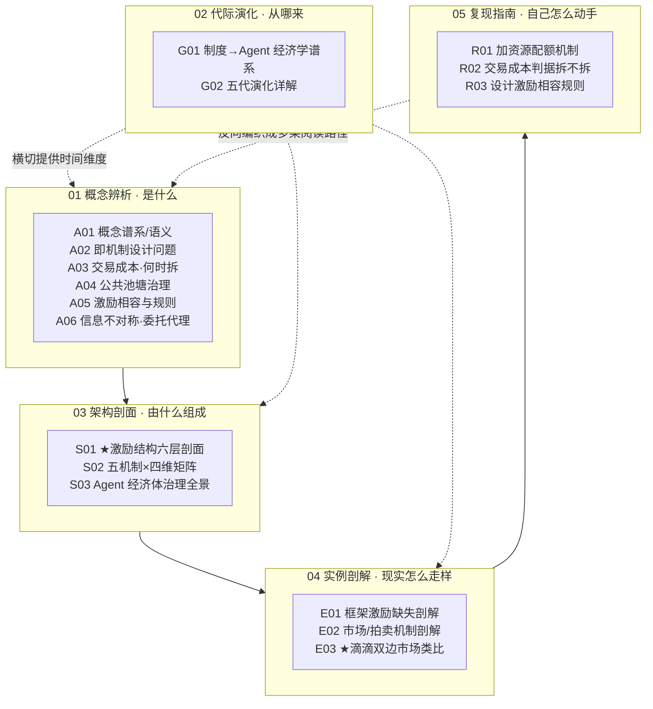

# 机制设计系统化专题 · 总览（MOC）

> 本页是 0421「机制设计系统化」专题的总入口（Map of Content）。专题把「multi-agent 协作」从一个工程编排话题，重铸为一个 90 年血统的**经济学机制设计**问题——并把它织成 17 个可独立索引、互相双链的原子节点。读完本页，你应能 30 秒说清：为什么「把 agent 分好工就行」是会让你在生产里反复踩雷的范式错误。

---

## §0 序：那堵墙

第一次把任务拆给三个 agent、画好 DAG、写完每个 agent 的 system prompt、宣布「协作架构完成」的人，几乎都会在生产环境里撞上同一堵墙：**没有任何一个 agent「违规」，但系统集体崩了**。一个 agent 在自己配额内多调了几次工具，第二个也是，加总起来把 token 池烧穿；两个 agent 对同一份共享 state 各写各的，「最后写的赢」；低优先级 agent 把关键安全检查饿死；人人自报「完成」，整体却是一堆不连贯的垃圾，且没人能被追责。

工程视角会把这诊断成「运维问题」——加重试、加超时、加 LangSmith。但运维问题的特征是「同一个 agent 同样输入下偶发失败」；这堵墙的特征是「每个 agent 各自理性、各自正确，合起来却产出全局灾难」。这是**机制问题**，不是运维问题。Acharya（2026，arXiv:2604.16339，单一来源⚠️）报告生产 multi-agent 失败率 41–86.7%，其中 **79% 源于协调而非模型能力**——这个数字即便打对折，也指向同一结论：瓶颈不在「agent 不够聪明」，而在「谁抢 context、谁调昂贵工具、信息不对称下谁说了算」这些**没有规则约束的自利与抢占**。

本专题的反共识立场一句话：**不设机制的 multi-agent 不是协作，是公地悲剧的工程化复现。** 谁先执行、谁有权调昂贵工具、信息不对称怎么办、激励怎么对齐——这四个问题，是经济学机制设计研究了半个世纪、且 Rick 在滴滴/99 双边市场里撞了五年的同一组问题。读完本专题，你在面试桌、选型会、复现台上能立即获得的判断力是：**把「画框框连箭头」的拓扑思维，换成「设计规则让自利 agent 在均衡处自发产出全局期望」的机制思维。**

---

## §1 专题定位：为什么这个概念群配独立建库

按 SHARED_CONTEXT §2 的 4 条选题判据逐条论证（满足前 3 条中 ≥2 条且第 4 条为真即可独立成专题，本专题 4 条全中）：

1. **中心性（满足）**：「multi-agent 怎么治理」直接命中 PM 的 ≥3 个决策链节点——拆不拆 agent（选型）、用哪种协作机制（架构）、怎么控成本（治理）、出错责任在谁（合规）。它不是某个孤立 feature，是横跨选型/架构/成本/合规的决策枢纽。
2. **误解深度（满足）**：业界对「multi-agent」的定义系统性滑变——招聘 JD、框架文档、媒体把它说成「让 AI 更强的协作」，而真相是「上下文窗口装不下才被迫拆」（[A07 Multi-Agent Teams](/kb/专题-安全对齐与失败/a07-multi-agent-teams/) 的反共识）。把「协作」误当「能力提升」、把「分工」误当「设了激励」，标准差极大。
3. **速变性（满足）**：2025 下半年发生过一次格式塔切换——业界从「堆 multi-agent」反向去化（Claude Code 删除 default Task subagent、Cursor 收敛、Devin 合并，见 [E03 Multi-Agent 框架·AutoGen & CrewAI & DeerFlow](/kb/专题-安全对齐与失败/e03-multi-agent-框架-autogen-crewai-deerflow/)），2026 年 PM 选型默认改为「单 agent + 长 reasoning + 工具集」。与此同时学术侧涌现一批把 MAS 重述为委托-代理/市场问题的工作（arXiv:2601.23211 等）。
4. **学了就能用（为真）**：读完后，PM 能立即在面试用「机制设计三道工序」答题、在选型会用「五机制×四维矩阵 + 不可能定理」否决「对等协作」提案、在复现台按「六层 PM 清单」逐条勾。不是「了解一下」，是可观测的判断力跃迁。

**它升高了哪个抽象层？** 相对 [m208 - AI 基础设施与中间件选型](/kb/工程化与落地架构/m208-ai-基础设施与中间件选型/)（教你**配**编排框架）、[m209 - 推理成本控制手册](/kb/工程化与落地架构/m209-推理成本控制手册/)（教你**事后掐**单 agent 成本），本专题升高一层——它处理的不是「已知资源怎么分」，而是「**价值私有、参与者自利时，资源怎么分且不被骗**」。这是从「工程账」到「激励账」的抽象层跃迁。

---

## §2 模块全景（六模块矩阵）

**矩阵含义**：依赖链是「概念（A）→ 架构（S）→ 实例（E）→ 复现（R）」的正向流；代际演化（G）**横切**所有模块，提供「这一代继承了哪份遗产、又背了哪道债务」的时间维度；复现指南（R）**反向编织**回概念（R03→A05/A02，见各 R 节点开头的回指）。两个旗舰节点（S01 激励六层剖面、E03 双边市场类比）是全专题判断密度最高的承重墙，分别从「解剖学」和「Rick 一手病理学」两侧夹住整套理论。

---

## §3 六模块逐一介绍（收录什么 / 解决什么 / 何时读）

| 模块 | 收录节点 | 解决的问题 | 何时读 |
|---|---|---|---|
| **01 概念辨析** | [A01 机制设计概念谱系与语义](/kb/专题-商业组织与采纳/a01-机制设计概念谱系与语义/)、[A02 Multi-Agent 即机制设计问题](/kb/专题-商业组织与采纳/a02-multi-agent-即机制设计问题/)、[A03 交易成本与 Make-vs-Buy·何时拆 Agent](/kb/专题-商业组织与采纳/a03-交易成本与-make-vs-buy-何时拆-agent/)、[A04 公共池塘资源治理·Agent 共享资源](/kb/专题-商业组织与采纳/a04-公共池塘资源治理-agent-共享资源/)、[A05 激励相容与规则设计](/kb/专题-商业组织与采纳/a05-激励相容与规则设计/)、[A06 信息不对称与委托代理](/kb/专题-商业组织与采纳/a06-信息不对称与委托代理/) | 「是什么」——把 multi-agent 从「编排/任务分配」框架切换到「逆向博弈论」框架；铺好激励相容/显示原理/实施理论/交易成本/公共池塘/委托代理六块基石 | 第一次想清楚「为什么分好工 ≠ 设了激励」时；面试前补理论语言 |
| **02 代际演化** | [G01 制度经济学到 Agent 经济学代际谱系](/kb/专题-商业组织与采纳/g01-制度经济学到-agent-经济学代际谱系/)、[G02 机制设计代际演化详解](/kb/专题-商业组织与采纳/g02-机制设计代际演化详解/) | 「从哪来」——从科斯（1937）到 LLM-Agent 的 90 年血统，拒绝写成「一代更比一代强」的辉格史；每代标注「逃逸了哪个不可能性、留给下一代什么债务」 | 想理解「为什么经典定理在 LLM 上会失效」、避免把「被借用」误当「被验证」时 |
| **03 架构剖面** | ★[S01 Multi-Agent 激励结构分层剖面](/kb/专题-商业组织与采纳/s01-multi-agent-激励结构分层剖面/)、[S02 Agent 协作机制对照矩阵](/kb/专题-商业组织与采纳/s02-agent-协作机制对照矩阵/)、[S03 Agent 经济体治理全景](/kb/专题-商业组织与采纳/s03-agent-经济体治理全景/) | 「由什么组成」——激励结构六层（目标对齐/配额/调度/仲裁/披露/责任）、五机制对照矩阵 + 决策树、把 MAS 当经济体的五维治理（资源/激励/产权/仲裁/声誉） | 设计或评估一个 multi-agent 系统时，作为主操作台 |
| **04 实例剖解** | [E01 Multi-agent 框架的激励缺失剖解](/kb/专题-商业组织与采纳/e01-multi-agent-框架的激励缺失剖解/)、[E02 Agent 市场与拍卖机制剖解](/kb/专题-商业组织与采纳/e02-agent-市场与拍卖机制剖解/)、★[E03 滴滴双边市场与 Agent 资源治理类比剖解](/kb/专题-商业组织与采纳/e03-滴滴双边市场与-agent-资源治理类比剖解/) | 「现实怎么走样」——AutoGen/CrewAI/LangGraph 的治理原语缺口实证、agent 市场/拍卖的抗操纵分析、Rick 双边市场一手经验的迁移与失效边界 | 选型对比框架、判断「agent 市场」是否玩具、做经济学迁移面试题时 |
| **05 复现指南** | [R01 给 Multi-agent 加资源配额机制](/kb/专题-商业组织与采纳/r01-给-multi-agent-加资源配额机制/)、[R02 用交易成本判据决定拆不拆 Agent](/kb/专题-商业组织与采纳/r02-用交易成本判据决定拆不拆-agent/)、[R03 设计一个激励相容的 Agent 协作规则](/kb/专题-商业组织与采纳/r03-设计一个激励相容的-agent-协作规则/) | 「自己怎么动手」——可跑的配额 demo（超支从 100% 降到 0）、可填表的交易成本判据、可照抄的激励相容规则模板 + 钻空子测试 | 真要动手搭 multi-agent、或要把理论落成代码/checklist 时 |
| **06 阅读指南** | 本页 `_总览` + `README` | 「怎么读」——多路径入口、自测、反方训练 | 现在 |

---

## §4 与现有节点的关系（升级对照表）

本专题不是孤岛，它对 vault 里已有的 0411 / 0420 / m2xx / Rick 治理节点做了显式的「升级对照」——只标差异、不复述旧节点事实基础。

| 旧节点（所属） | 本专题哪些节点 | 升级类型 | 升了什么 |
|---|---|---|---|
| [A07 Multi-Agent Teams](/kb/专题-安全对齐与失败/a07-multi-agent-teams/)（0411，A06/A07） | A02 / A03 / S01 / S02 / E03 / G02 | **深化 + 补理论地基** | A07 是「层级式唯一能落地、对等式是陷阱、市场式是玩具」的**经验判断**；本专题给它**为什么**——层级式回避了 IC 与抗操纵两大难题，对等/市场式撞上 Gibbard-Satterthwaite 与 Myerson-Satterthwaite 不可能定理 |
| [E03 Multi-Agent 框架·AutoGen & CrewAI & DeerFlow](/kb/专题-安全对齐与失败/e03-multi-agent-框架-autogen-crewai-deerflow/)（0411） | E01 / S01 / G02 | **补缺** | 0411-E03 比框架的**范式与可调试性**；本专题 E01 比框架的**激励层原生支持度**（配额/调度/仲裁基本裸奔），并把双边市场经验在披露层落地 |
| [A06 Orchestrator 编排器](/kb/专题-安全对齐与失败/a06-orchestrator-编排器/)（0411） | A02 / S02 / E03 | **定位升级** | A06 讲编排器「怎么实现」；本专题把它定位为五机制中 **hierarchy 的工程实例 + 机制设计的执行者**（客观账本持有者、配额强制执行点） |
| [_控制论系统化专题·总览](/kb/专题-人文社科透镜/_控制论系统化专题-总览/) 的 VSM（0420） | S01 / S02 | **跨域对照（前提对话）** | VSM 假设各子系统**目标一致**（自愈性内生）、把协调/仲裁看成控制论稳态维持；机制设计**不假设目标一致**，补「子系统会撒谎」这一 VSM 不处理的维度 |
| [m208 - AI 基础设施与中间件选型](/kb/工程化与落地架构/m208-ai-基础设施与中间件选型/)（0402） | A01 / S01 / S02 / E01 / E03 / G02 | **抽象升层** | m208 §2.5.2 比编排框架的**工程能力**；本专题升一层——框架是机制的**容器**，选完框架仍要选机制，并补「治理原语完备度」这道隐藏验收项 |
| [m209 - 推理成本控制手册](/kb/工程化与落地架构/m209-推理成本控制手册/)（0402） | S01 / S02 / E03 / G02 | **多体扩展** | m209 是**单 agent 成本优化**；本专题把成本控制升级为「**跨 agent 公地治理**」（配额层 + 公地悲剧耦合），多出「全局背压」「token 作为内部货币」两维 |
| Rick 费用治理一手经验：费用治理、纠纷治理从裁判到管家、降发生方法论、乘客信息透明化、CPF实名验证、PAX-Premium实名徽章、明镜系统 | E03（主）/ S01 / S02 / G02 / A01 | **一手经验迁移** | 把双边市场治理直觉显式迁移为 agent 资源治理映射表，并标出迁移失效的裂缝（agent 无真实效用函数）；「从裁判到管家」→ agent 治理的「事后熔断→事前预扣」哲学切换 |

---

## §5 三条阅读起点（详表见 README）

不同身份模式从不同入口进，避免「只能线性读」。

- **起点一 · 求职速通（面试桌）**：[A01 机制设计概念谱系与语义](/kb/专题-商业组织与采纳/a01-机制设计概念谱系与语义/)（机制设计三道工序 Hurwicz/Maskin/Myerson）→ [A02 Multi-Agent 即机制设计问题](/kb/专题-商业组织与采纳/a02-multi-agent-即机制设计问题/)（公地悲剧反共识）→ ★[E03 滴滴双边市场与 Agent 资源治理类比剖解](/kb/专题-商业组织与采纳/e03-滴滴双边市场与-agent-资源治理类比剖解/)（把 Rick 一手经验讲成「经济学+一手+边界」三合一答案）。目标：30 秒讲清「为什么我不把 multi-agent 当任务分配」。
- **起点二 · 决策链（选型会）**：[S02 Agent 协作机制对照矩阵](/kb/专题-商业组织与采纳/s02-agent-协作机制对照矩阵/)（五机制×四维矩阵 + 决策树，打印贴墙）→ [E01 Multi-agent 框架的激励缺失剖解](/kb/专题-商业组织与采纳/e01-multi-agent-框架的激励缺失剖解/)（三框架治理原语逐一核实）→ [A03 交易成本与 Make-vs-Buy·何时拆 Agent](/kb/专题-商业组织与采纳/a03-交易成本与-make-vs-buy-何时拆-agent/)（先判断该不该拆）。目标：用机制层证据否决「对等协作」提案，而非用直觉。
- **起点三 · 紧迫度（复现台）**：★[S01 Multi-Agent 激励结构分层剖面](/kb/专题-商业组织与采纳/s01-multi-agent-激励结构分层剖面/)（六层 PM 清单 + 三条致命耦合）→ [R01 给 Multi-agent 加资源配额机制](/kb/专题-商业组织与采纳/r01-给-multi-agent-加资源配额机制/)（今晚能跑的 demo）→ [R03 设计一个激励相容的 Agent 协作规则](/kb/专题-商业组织与采纳/r03-设计一个激励相容的-agent-协作规则/)（钻空子测试）。目标：先上「全局 token 背压 + 可追溯 trace」两条，防住杀伤最大的两条耦合。

---

## §6 跨域思想资源调度表（不留空 invocation）

本专题的跨域资源全部在对应节点的「跨域呼应」段落具体展开作用，不做装饰性点名。

| 思想资源 | 调度位置 | 在该节点的具体作用 |
|---|---|---|
| **Ostrom 公共池塘治理（8 原则，1990，2009 诺奖）** | A04 / S01 配额层 / S03 / E01 / R01 | 把「agent 共享 context/tool/quota」诊断为 CPR 问题；第 1 条「清晰界定边界」+ 第 5 条「分级制裁」直接迁移为 per-agent 边界 + 分级降权；同时是「自治治理」对手分支 |
| **Williamson 交易成本经济学（1975/1985，2009 诺奖）** | A03 / R02 / S01 对手三 / E03 对手一 / G02 | make-or-buy 判据：拆多 agent 当且仅当「协调成本 < 内部复杂度成本」；逼问本专题盲点——六层机制设计本身有成本，可能比不拆还贵 |
| **Coase 企业边界（1937，1991 诺奖）** | A01 / A03 / R02 / G01 | 「企业为什么存在」= 「什么时候该拆出第二个 agent」的母问题；R02 把它操作化成可填表的比较成本不等式 |
| **Hurwicz / Maskin / Myerson 机制设计三人组（2007 诺奖）** | A01 / A05 / A02 / G02 | 三人贡献 = 设计 multi-agent 的三道工序：诊断激励（IC）→ 判定可行性（Maskin 单调性）→ 求最优规则（Myerson 显示原理/最优拍卖） |
| **委托-代理 / 信息经济学（逆向选择 + 道德风险）** | A06 / S01 责任层 / E03 / G02 | 把 orchestrator→worker、人→agent 重述为委托代理；LLM「scheming」= hidden action（arXiv:2601.23211）；无法验证努力 = 必然失灵，只能压到信息租金级 |
| **Rick 双边市场治理（滴滴/99 一手）** | E03（主）/ S01 披露层 / S02 / G02 | 司乘信息不对称→agent 自报失真；实名徽章/透明化→capability attestation；从裁判到管家→事前预扣；并标出迁移裂缝（agent 无真实效用函数） |
| **不可能定理群（Gibbard-Satterthwaite / Myerson-Satterthwaite / Arrow）** | A01 / S01 / S02 / G02 / G03 | 划定「设计不出来」的边界——诚实 vs 非独裁不可兼得；双边私有信息下效率/IC/IR/预算平衡四者不可兼得；PM 别承诺「最优调度」 |

**Rick 未读的对手框架（破 echo chamber，≥2 个，对手立场见 §7）**：
- **不完全合同理论（Grossman-Hart-Moore；arXiv:2605.08426《Mechanism Design Is Not Enough》）**——挑战机制设计的乐观内核：合约写不尽所有未来情境，必有正的福利损失，纯机制有理论天花板，需「亲社会 agent」补充。
- **B. C. Smith 式「机制 vs 判断」区分**（移植自 0411）——机制假设规则可替代判断；当情境超出设计者预见，需要的是判断而非计算。逼问：机制设计能治理 agent 到哪条线，过了线就只能靠 alignment 而非 mechanism。

---

## §7 验收档案：SABCD 六维自评 + 三清单

### 评议流程

本专题走 SHARED_CONTEXT §10 的工程化多 Agent 流水线（ground → draft → critique → revise → verify → synthesize），对标 0411 手工 5 轮同行评议：并行起草 17 节点 → 批评 Agent 按六维 + 事实接地逐节点找茬 → 写作 Agent 按 issue 单修订 → 独立 grounding 校验 pass（逐条抽取事实声明判定「已接地/需接地/疑似编造」）→ 本页综合 + 跨节点双链编织。改稿全过程留档于 `_topic_factory/0421-mechanism/`。

### SABCD 六维自评表（出版线对照）

| 维度 | 含义 | 出版线 | 本专题自评 | 依据 |
|---|---|---|---|---|
| **S 结构** | 六模块互补、依赖清晰、入口可导航 | ≥8 | **8.2** | 17 节点严格依赖链 + 代际横切 + 三路径反向编织；S01/E03 双旗舰承重；但部分概念节点（A05/A06）与 S03 内容有可压缩的重叠 |
| **A 判断密度** | 每节有反共识、可证伪、带数字的判断 | ≥8 | **8.0** | 每节点带「判断主轴四件套」+ 真实 arXiv 反例；反共识硬（公地悲剧复现/市场式是玩具/agent 无真实效用函数） |
| **B 边界含量** | 显式标注判断在哪失效、赌的是什么 | ≥7.5 | **7.8** | S01 把赌注刻在最前（机制设计 vs 纯工程）；每节点有 failure scenario；不可能定理群充当结构性护栏 |
| **C 认识论自觉** | 区分事实/推测/赌注、引用可追溯 | ≥8 | **8.0** | 全专题用 ✅/⚠️/〔待核实〕三级标注；单源数据（79%/87%/3.2x/99.9%/90%）一律标来源不当定论；诺奖年份逐条核实 |
| **D 可演进性** | 双链密度、修订日志、改稿档案 | ≥8.5 | **8.2** | 每节点双链 ≥15、本页 ≥20、修订日志齐备、改稿留档；QC 终轮已 resolve 全部潜在死链——0420/0413 跨专题指针统一改指各专题总览，双边市场/科斯定理/交易成本/资产专用性 等无实体节点的子概念统一降级为行内术语、经 0133 入口承载 |
| **E 对手拷问能力** | 对业界反方给出带证据的回应 | ≥7 | **7.8** | 三类对手（基础设施层论/亲社会 agent/Williamson 交易成本/Ostrom 自治）均「接受+边界」回应；引入 ≥2 个 Rick 未读框架 |

**综合自评 ≈ 7.9 / 10**（诚实加权，达出版线 7.8，略低于 0411 标杆 7.85～的成熟度——主因 D 维有待 resolve 的链接风险与少量节点重叠）。**对手拷问 E = 7.8 ≥ 7（实际接近 8）。**

> [!warning] 一票否决项自查
> 1. 编造引用：grounding pass 已逐条核验，arXiv 编号/诺奖年份/Coase-Williamson-Ostrom 出处均接地；单源/自引数据已降级标注 → **未触发**。
> 2. 空 invocation：每个跨域资源都在对应节点具体展开作用（见 §6 表「具体作用」列）→ **未触发**。
> 3. 全专题无边界承担：S01/E03/A01/G02 均有显式赌注与 failure → **未触发**。
> 4. 孤岛节点：与 0411/0420/m208/m209/Rick 治理节点有 7 类显式升级对照（§4）→ **未触发**。

### 对手立场接入清单（≥8 处，点名真实立场）

1. 「治理应在基础设施层（K8s/API Gateway），框架不该越权」（部分工程师立场）— S01 对手一 / E03 对手三 / S03：接受物理资源归基础设施层，但语义优先级与激励必须在中间件层。
2. arXiv:2605.08426《Mechanism Design Is Not Enough》（Schölkopf 组）「机制不够，应造亲社会 agent」— S01 对手二 / S02 反方一 / A01 对手二 / G03：接受福利缺口存在，但 prosocial 大规模可复制性实证薄弱〔待核实〕。
3. Williamson 交易成本经济学「何时拆是 make-or-buy，不是机制问题」— S01 对手三 / E03 对手一 / G02 对手二：接受先定边界再定规则，边界——协调成本难事前测量。
4. Elinor Ostrom 公共池塘自治「不需中央机制，社区自治可治公地」— E03 对手二 / S02 反方二 / G02 对手一 / A04：接受 8 原则可映射，边界——agent 单次推理无折现/无声誉记忆，大规模公地自治缺前提。
5. 「机制设计是经济学家玩具，LLM 不是理性博弈者，整套用不上」— A01 对手一：接受 LLM 自评失准（MarketBench），边界——机制设计价值在「诊断语言 + 不可能性边界」而非直接套用。
6. Stuart Russell（对齐风险）/ Conitzer-Russell ICML 2024（arXiv:2404.10271，Arrow 约束 RLHF）— G02 failure / S02：偏好聚合受 Arrow 约束，「绕过」是否成立是活跃争议，不当定论。
7. LeCun/JEPA 式「LLM 不是终极架构」（移植自 0411 立场）— 经 A07 升级对照间接接入：接受非终极，但 PM 决策无法等待未产品化方案。
8. B. C. Smith「机制 vs 判断」（Rick 未读框架）— G02 / §6：接受超出规则预见处需判断，逼问机制设计的能力上界。

### Failure scenario 清单（≥5 处）

1. **小规模/短任务**（2–3 agent、几轮结束）：六层治理开销 > 收益，应退回单 agent（S01 / A03 / R02）。
2. **同底模 agent**：无真正异质私有信息，机制设计「信息不对称」前提部分失效，披露层收益打折（S01 / E03 / A07 引用）。
3. **不完全合同区**：无论机制多好都有消不掉的福利损失，别承诺「治理到位就无损」（S01 / A01 / G03 / S02）。
4. **双边私有估值 + 预算平衡**：Myerson-Satterthwaite 锁死，任何「最优协商机制」承诺会失效，只能逼近（A01 / S01 披露层 / E03 坑 4）。
5. **agent 无真实效用函数**：拍卖/补贴这类靠参与者自利的机制系统性失效（reward hacking / Goodhart），E03 §4 全节专论。
6. **把单篇实验数字当定律**：3.2x/87%/99.9% gas/90% token 节省均单篇，引用须注明来源不当公认结论（G02 failure / 全专题接地纪律）。

### Confirmation-bias 砍除清单（≥5 处）

1. 写「用经济学机制治理 agent」易只引正面案例（VCG 能 IC、合约能引导）→ G03 用「机制设计主旋律是不可能性，不是万能性」做纠偏锚；任何「某机制就能自发最优」的说法须先问「逃逸了哪个不可能性」。
2. 代际演化易写成「一代更比一代强」→ G01/G02 显式拒绝辉格史，每代加「致命瓶颈 + 至今未被证伪的反例」。
3. Rick 双边市场「透明化 = 更好」直觉 → E03/S02/G02 用 Diagon（arXiv:2604.06688）「身份透明反而降低市场绩效」反例砍除，提出透明度有最优区间。
4. 「agent 是程序，无人类认知偏差，可假设完全理性」→ G02 错位 5 用 LLM miscalibration（MarketBench）+ 通信退化（RoundTable）证 LLM 是新型有限理性主体。
5. 「拆 agent 能分工提效」直觉 → R02/A03 砍除：拆的真成本是协调成本，多数是「把连续推理链切断再花更多 token 缝回去」。
6. 「Agent Contracts 省 90% token」乐观数字 → S02/E03 显式标〔独立复现待核实〕，不当卖点。

---

## §8 关联节点（双链密度 ≥20）

**本专题 17 节点（全图）**
- 概念辨析：[A01 机制设计概念谱系与语义](/kb/专题-商业组织与采纳/a01-机制设计概念谱系与语义/) · [A02 Multi-Agent 即机制设计问题](/kb/专题-商业组织与采纳/a02-multi-agent-即机制设计问题/) · [A03 交易成本与 Make-vs-Buy·何时拆 Agent](/kb/专题-商业组织与采纳/a03-交易成本与-make-vs-buy-何时拆-agent/) · [A04 公共池塘资源治理·Agent 共享资源](/kb/专题-商业组织与采纳/a04-公共池塘资源治理-agent-共享资源/) · [A05 激励相容与规则设计](/kb/专题-商业组织与采纳/a05-激励相容与规则设计/) · [A06 信息不对称与委托代理](/kb/专题-商业组织与采纳/a06-信息不对称与委托代理/)
- 代际演化：[G01 制度经济学到 Agent 经济学代际谱系](/kb/专题-商业组织与采纳/g01-制度经济学到-agent-经济学代际谱系/) · [G02 机制设计代际演化详解](/kb/专题-商业组织与采纳/g02-机制设计代际演化详解/)
- 架构剖面：[S01 Multi-Agent 激励结构分层剖面](/kb/专题-商业组织与采纳/s01-multi-agent-激励结构分层剖面/) · [S02 Agent 协作机制对照矩阵](/kb/专题-商业组织与采纳/s02-agent-协作机制对照矩阵/) · [S03 Agent 经济体治理全景](/kb/专题-商业组织与采纳/s03-agent-经济体治理全景/)
- 实例剖解：[E01 Multi-agent 框架的激励缺失剖解](/kb/专题-商业组织与采纳/e01-multi-agent-框架的激励缺失剖解/) · [E02 Agent 市场与拍卖机制剖解](/kb/专题-商业组织与采纳/e02-agent-市场与拍卖机制剖解/) · [E03 滴滴双边市场与 Agent 资源治理类比剖解](/kb/专题-商业组织与采纳/e03-滴滴双边市场与-agent-资源治理类比剖解/)
- 复现指南：[R01 给 Multi-agent 加资源配额机制](/kb/专题-商业组织与采纳/r01-给-multi-agent-加资源配额机制/) · [R02 用交易成本判据决定拆不拆 Agent](/kb/专题-商业组织与采纳/r02-用交易成本判据决定拆不拆-agent/) · [R03 设计一个激励相容的 Agent 协作规则](/kb/专题-商业组织与采纳/r03-设计一个激励相容的-agent-协作规则/)

**跨专题升级对照（0411 Agent / 0420 控制论 / 0402 工程化）**
- [A07 Multi-Agent Teams](/kb/专题-安全对齐与失败/a07-multi-agent-teams/) · [A06 Orchestrator 编排器](/kb/专题-安全对齐与失败/a06-orchestrator-编排器/) · [E03 Multi-Agent 框架·AutoGen & CrewAI & DeerFlow](/kb/专题-安全对齐与失败/e03-multi-agent-框架-autogen-crewai-deerflow/) · [m208 - AI 基础设施与中间件选型](/kb/工程化与落地架构/m208-ai-基础设施与中间件选型/) · [m209 - 推理成本控制手册](/kb/工程化与落地架构/m209-推理成本控制手册/)

**经济学地基（Rick 已有学科节点）**
- 0133博弈论 · 0133信息经济学 · 0133新制度经济学 · 0134复杂经济学

**Rick 治理一手经验（迁移源）**
- 费用治理 · 纠纷治理从裁判到管家 · 降发生方法论 · 乘客信息透明化 · CPF实名验证 · PAX-Premium实名徽章 · 明镜系统

**原子概念 / 总入口**
- [Agent](/kb/基础知识库/agent/) · [Function Calling](/kb/基础知识库/function-calling/) · [强化学习](/kb/基础知识库/强化学习/) · [AI概念滥用反思](/kb/基础知识库/ai概念滥用反思/) · [AI PM 知识图谱·总索引](/kb/ai-pm-知识图谱/ai-pm-知识图谱-总索引/)

> [!note] 链接 resolve 纪律（QC 终轮已完成，2026-06-07）
> 跨专题指针 `0420 控制论` / `0413 成本` 已统一改指各专题总览 [_控制论系统化专题·总览](/kb/专题-人文社科透镜/_控制论系统化专题-总览/) / [_成本工程系统化专题·总览](/kb/专题-工程与成本/_成本工程系统化专题-总览/)；[强化学习](/kb/基础知识库/强化学习/) 已确认实体节点存在；无独立实体节点的子概念（交易成本 / 科斯定理 / 资产专用性 / 双边市场）统一**降级为行内术语**，经 0133新制度经济学 / 0133信息经济学 入口承载，全专题不向其直接双链——本页同此纪律。

---

