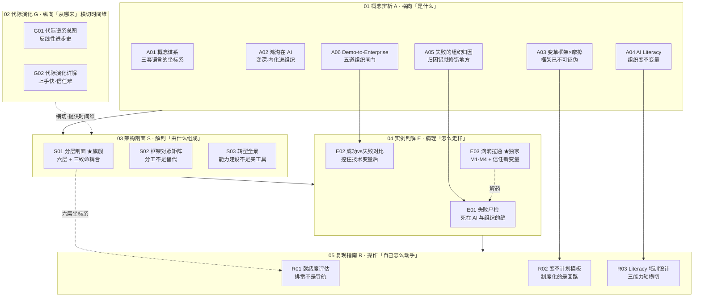

# 组织采纳系统化专题 · 总览（MOC）

> 这是 **0428 组织采纳系统化专题** 的 MOC（地图中的地图）。它回答"这个专题在讲什么、为什么配独立建库、由哪些节点织成、怎么读、经不经得起业界反方拷问"。具体"以你现在的身份该从哪进、按什么顺序读、读完怎么自测"，交给 `[阅读指南](/kb/专题-商业组织与采纳/readme-0428-多视图阅读指南/)`。

---

## §0 序：demo 不是死在技术上，是死在 POC 里

想象这样一道 AI 产品岗的面试题：面试官把一段客服 Agent 的 demo 视频甩在屏幕上——意图识别、多轮纠错、自动改派工单，行云流水。然后他问一句话："这东西在我们公司试点跑了三个月，KPI 真涨了 30%，为什么 CEO 一拍板全员推，半年后就没人用了？" 第一反应往往是去找技术答案——模型不够稳？数据漂移?上下文不够长?——全错了。这个 demo 死在 POC 里，不是因为它不够强，是因为它太强：强到没有人敢对它的错误负责，强到一线员工觉得"这是要替我背锅的东西",强到合规团队要逐案重审而扩张飞轮根本转不起来。

这就是本专题的反共识立场，也是它押的赌注：**AI 落地的失败，80% 不发生在"某一层做得不够好"，而发生在"两层之间没有人负责接力"，以及"组织试图给一个不可问责的非人类执行者注入它无法承载的权威"。** 技术（BCG 10-20-70 里的那个"10"）恰恰是最可外包、最不是瓶颈的一层。读完这个专题，你应该能在面试桌 / 选型会 / 复现台上，**30 秒说清"为什么技术选型对了，部署还是会死"**——并且能说出那个 owner 的名字、指出哪两层没人接力、看穿"高管站台=有人负责"的假象。

---

## §1 专题定位：为什么"组织采纳"配独立建一个专题号

用宪章 §2 的四条选题判据逐条论证（满足前 3 条的 ≥2 条 + 第 4 条为真）：

| 判据 | 是否满足 | 论证 |
|---|---|---|
| **① 中心性**（影响 PM ≥3 个决策链节点） | ✅ | 直接卡住 PM 的**立项**（该不该接这个 AI 项目）、**选型**（技术对了为什么还会死）、**落地推进**（怎么让组织真用起来）三条链；与既有 m207 产品化、m208 选型、p307 自主光谱形成"产品层→组织层"的上游约束。 |
| **② 误解深度**（定义互相矛盾、系统性滑变） | ✅ | "AI 落地难"在媒体/JD/咨询白皮书里被滑变成纯技术问题（换模型/加算力）、纯培训问题（发视频）、或纯高管意志问题（CEO 站台）。本专题论证这三种归因都修错了地方（见 A05）。 |
| **③ 速变性**（24 个月内 ≥1 次范式切换） | ◯ 部分 | 严格的"格式塔切换"在 AI 本身（Agent 化）；但**采纳侧**的范式转移真实发生：PLG/影子 AI 从下往上渗透，打破了"自上而下采购→部署"的传统企业软件采纳剧本（见 S01 §4 盲点二、G02）。 |
| **④ 学了就能用**（立即可观测的判断力提升） | ✅ | 读完立刻能在面试桌抛出"能不能说出那个 owner 的名字""哪两层没人接力""先让 AI 以管家而非裁判姿态进入"三句带反共识、可证伪、可落地的判断。 |

满足 ①②④ 三条（≥2）+ ④为真，达标。

**它升高了哪个抽象层？** 既有 c/m/p 节点（m207 单个 Agent 的失败模式、m208 中间件选型、p307 自主度光谱）都停在**产品/技术层**——"产品怎么不崩"。本专题升到**组织层**——"组织怎么不让一个对的产品死掉"。这是一个 m207 解决不了的问题：一个会雪崩的 Agent，落到无 owner 的组织里，根本没人去设兜底（见 S01 §8）。

**Rick 的独特资产（不公平优势）。** 本专题不是又一篇综述：E03 把 Rick 在滴滴 PDP（司乘协商）和实名徽章上**拉通法务/风控/客服/运营/算法五条线**的一手经验，提纯成 M1–M4 四个可迁移机制，并标出"信任非人类执行者"这个 AI 新变量。最锋利的一笔是 §4 的判断——**Rick 当年把纠纷治理从"裁判"改成"管家",其实是在没有 AI 的年代预演了 AI 采纳最难的那个变量**：人对一个"代你做决定的系统"的信任摩擦。这是任何外部框架（Kotter/Moore）都看不到的盲点，也是本库求职底料里最难被复制的部分。

---

## §2 模块全景：六模块矩阵 + 依赖与横切

**矩阵含义。** 主依赖链是 `概念(A) → 架构(S) → 实例(E) → 复现(R)`：先用 A 层建坐标系（三套理论语言、鸿沟、归因），再用 S 层解剖出"六层 + 三耦合"的承重结构，再用 E 层做病理验证（尸检 + 对照实验 + 一手经验），最后 R 层把诊断转成可签字的工具。**G 层（代际演化）横切**所有路径，提供时间维度——它要挡掉的最大错误叙事是"技术越先进、采纳越快"。三个节点间的强耦合值得单列：**A05→E01**（归因理论→尸检验证）、**A06→E02**（鸿沟五闸门→成败对照）、**E03→E01**（一手经验是失败案例的正面解药）。旗舰 **S01** 是全专题的坐标系（六层贯穿 R01 评分维度），独家 **E03** 是判断密度最高的一手资产。

---

## §3 六模块逐一介绍（收录什么 / 解决什么 / 何时读）

### 01 概念辨析（A，6 节）——建坐标系
把"AI 落地难"从伪二分法里拆开，给下游所有节点一套共同语言。
- **[A01 技术采纳与组织变革概念谱系](/kb/专题-商业组织与采纳/a01-技术采纳与组织变革概念谱系/)**：Rogers 扩散（个体/社会系统层）/ Moore 鸿沟（市场结构层）/ Lewin-Kotter-ADKAR 变革管理（组织内部层）三套互不通约的语言铺成谱系；主轴——失败绝大多数不是"创新没扩散开"，是"组织没准备好被改变"。**何时读**：决策链路径的第一站。
- **[A02 Crossing the Chasm 在 AI 语境](/kb/专题-商业组织与采纳/a02-crossing-the-chasm-在-ai-语境/)**：Moore 1991 的市场鸿沟迁到企业内部 AI——**不仅成立而且变深、内化进组织**（从公司间断层变成一家公司内 pilot→production 的试点地狱），但 Moore 药方（聚焦细分、做参考客户）对内部多业务线同时转型大半失效。**何时读**：想纠正"鸿沟照搬"的直觉时。
- **[A03 变革管理框架与 AI 部署摩擦](/kb/专题-商业组织与采纳/a03-变革管理框架与-ai-部署摩擦/)**：Kotter/Lewin/ADKAR 当作待证伪的迁移假设来拷问——AI 是黑箱、概率性、持续漂移、威胁技能存量，违反了"可定义/可解冻/可再冻结"的全部前提；更致命的是这套框架把所有失败都归因为"你没正确执行我"，**已不可证伪**。**何时读**：复盘说"我们紧迫感不够"之前。
- **[A04 组织 AI Literacy 建设](/kb/专题-商业组织与采纳/a04-组织-ai-literacy-建设/)**：literacy 是**组织变革变量，不是 HR 培训科目**（抓错因果链位置）；核心能力是批判性评估/协作/伦理导航，无法靠操作视频灌输，且被 EU AI Act Art.4 从"提效手段"升级为**法律义务**。**何时读**：被要求"安排个 AI 培训"时。
- **[A05 AI 项目失败的组织归因](/kb/专题-商业组织与采纳/a05-ai-项目失败的组织归因/)**：**归因诊断学**——归因错了就修错地方；把"AI 为什么死"从技术叙事抢回组织叙事（基本归因偏差的组织版）。全专题的判断锚。**何时读**：任何失败复盘的第一原则。
- **[A06 Demo-to-Enterprise 鸿沟的组织维度](/kb/专题-商业组织与采纳/a06-demo-to-enterprise-鸿沟的组织维度/)**：demo 答"能不能做到"（capability），部署答"敢不敢用、谁负责"（accountability）——鸿沟宽度由合规/权限/审计/责任/流程嵌入**五道组织闸门**决定，责任真空最难填。**何时读**：解释"demo 惊艳但部署死"。

### 02 代际演化（G，2 节）——横切时间维
拒绝"一代比一代采纳更顺"的线性进步史。
- **[G01 企业技术采纳代际谱系总图](/kb/专题-商业组织与采纳/g01-企业技术采纳代际谱系总图/)**：Rogers 扩散曲线叠 Kuhn 范式革命，画出**反线性**的代际谱系（合并五代：IT/ERP→SaaS→移动→云→AI/Agent）；每代解决上代一个摩擦、埋下一个自己解不了的新摩擦。**何时读**：被问"这次和上云有什么不同"。
- **[G02 企业采纳代际演化详解](/kb/专题-商业组织与采纳/g02-企业采纳代际演化详解/)**：六代细分（大型机→PC→互联网→SaaS/云→移动→AI/Agent）逐代拆"代表技术/采纳模式/主要摩擦/被超越方式/留给 AI 的遗产"；主轴——**上手史无前例快、信任史无前例难，多代摩擦叠加态**。别用 SaaS playbook 打 AI 这仗。〔注：G01 五代与 G02 六代是"合并/细分"关系，口径差异待统一，见 §7 待办〕

### 03 架构剖面（S，3 节）——承重结构
- **[S01 AI 组织采纳分层剖面](/kb/专题-商业组织与采纳/s01-ai-组织采纳分层剖面/) ★旗舰**：把组织采纳拆成战略意图/数据与流程就绪/能力与培训/激励与所有权/合规与责任/反馈与扩张**六层**，命门是**三个层间致命耦合**——A 战略↔所有权（无 owner 之死）、B 能力↔所有权（能力缺位让激励反向）、C 合规↔扩张（逐案串行卡死飞轮）。诊断口诀：**不要问"哪层最弱",要问"哪两层没人接力"**。**何时读**：所有路径的坐标系，最先读。
- **[S02 采纳与变革框架对照矩阵](/kb/专题-商业组织与采纳/s02-采纳与变革框架对照矩阵/)**：Rogers/Moore/Kotter/ADKAR 在层级（个体/市场/组织）、阶段、摩擦类型三个**正交维度**上根本不在同一坐标系；"哪个最好"是伪问题，是分工不是替代，**选错=把工具用在它失效的阶段**。**何时读**：纠结"用 Kotter 还是 ADKAR"。
- **[S03 组织 AI 转型全景](/kb/专题-商业组织与采纳/s03-组织-ai-转型全景/)**：用社会技术系统（STS）+ 组织能力建设双镜头，把"我们也要做 AI 转型"拆成战略/数据/能力/治理/文化五子系统的施工图；主轴——**AI 转型是组织能力建设，不是买工具**（买工具有终点，能力建设没有终点）。**何时读**：被 CEO 点名牵头转型。

### 04 实例剖解（E，3 节）——病理验证
- **[E01 AI 项目组织失败案例剖解](/kb/专题-商业组织与采纳/e01-ai-项目组织失败案例剖解/)**：**案例尸检学**——不做失败率综述，拿三个有公开记录的真实失败逐个剖开；主轴——失败几乎从不发生在模型层，而在**它和组织接触的那道缝**（流程/激励/所有权）。**何时读**：想要具体尸体而非统计焦虑。
- **[E02 企业 AI 采纳成功与失败对比剖解](/kb/专题-商业组织与采纳/e02-企业-ai-采纳成功与失败对比剖解/)**：把两家"技术选型几乎一样"的企业并排放显微镜下做对照实验，**控住技术变量后，成败方差几乎全由组织就绪度解释**（七维归因）。**何时读**：反驳"务虚，给我看技术指标"。
- **[E03 滴滴跨团队拉通经验迁移剖解](/kb/专题-商业组织与采纳/e03-滴滴跨团队拉通经验迁移剖解/) ★独家**：Rick 一手经验提纯为 M1 引导联盟先于方案 / M2 利益翻译 / M3 小胜做参考案例 / M4 裁判→管家四机制，逐一标迁移补丁与失效边界；最锋利判断——**M4 预演了 AI 信任摩擦的核心**：员工抵触 AI 不是抵触工具，是抵触"一个不可问责的权威替我做决定"。**何时读**：求职速通第二站，决策链收尾回看。

### 05 复现指南（R，3 节）——可签字的工具
- **[R01 AI 采纳就绪度评估](/kb/专题-商业组织与采纳/r01-ai-采纳就绪度评估/)**：战略/数据/能力/治理/文化五维现场打分表，但主轴是那句反共识——**就绪度高 ≠ 项目会成功**；它是诊断工具不是通行证，就绪度非单调线性可累积（反成熟度模型）。**何时读**：立项会要一张评分表。
- **[R02 变革管理计划模板](/kb/专题-商业组织与采纳/r02-变革管理计划模板/)**：Kotter 八步骨架，但每步被 AI 三摩擦（数据未就绪/流程未定义/模型会漂移）重写过的填空模板；制度化的是**回路**不是用法。**何时读**：要给高管一份能签字的纸。
- **[R03 AI Literacy 培训设计](/kb/专题-商业组织与采纳/r03-ai-literacy-培训设计/)**：「能力边界→心智模型→信任校准」三能力轴**横切所有角色**（而非按角色分课表），配可观测验收指标与反陷阱清单；培训量是产品 literacy 债的利息。**何时读**：要一周内拉出课程框架。

### 06 阅读指南
- **本总览（MOC）** + **[阅读指南](/kb/专题-商业组织与采纳/readme-0428-多视图阅读指南/)**（三条路径 + 专题地图 + 12 自测题 + 6 反方对话训练）。

---

## §4 与现有节点的关系：产品层 → 组织层的升维对照

| 旧节点（c/m/p） | 本专题哪些节点对照 | 升级类型 | 升了什么 |
|---|---|---|---|
| [m207 - Agent 产品化：场景推演与失败模式](/kb/工程化与落地架构/m207-agent-产品化-场景推演与失败模式/) | S01 §8 · E03 §8 · E01 | **升维** | m207 讲单个 Agent 内部六类失败模式 + HITL 断点（"产品怎么不崩"）；本专题升到"组织怎么不让对的产品死掉"——技术失败模式在无 owner 的组织里会被耦合断裂**放大**。 |
| [p307 - Copilot 到 Autopilot 光谱](/kb/产品设计与交互范式/p307-copilot-到-autopilot-光谱/) | S01 §8 · E03 §4 | **补缺/对话** | p307 给"该选哪个自主层"（技术-产品光谱）；本专题论证这条光谱**首先是组织信任光谱**——L3/L4 自治不只是技术成熟度，是信任摩擦的组织管理问题。 |
| [m208 - AI 基础设施与中间件选型](/kb/工程化与落地架构/m208-ai-基础设施与中间件选型/) | S01 §8 · E03 §8 · S03 | **纠偏** | m208 是 L2 数据与流程就绪的技术深化；本专题提醒——L2 技术就绪只是六层之一，且是最可外包的"10%"，别把采纳问题误当选型问题。 |
| [幻觉](/kb/基础知识库/幻觉/) | S01 §8 · E03 · A05 | **深化** | 幻觉是 L5 责任层的技术根源——正因不可完全消除，"出错谁担责"不可回避，不能靠"等模型不犯错"绕过；本专题把它翻译成"组织必须显式承担责任主体"。 |
| [Polanyi 默会知识与提示工程的认识论张力](/kb/基础知识库/polanyi-默会知识与提示工程的认识论张力/) | S01 §6 · E03 §2 · S03 | **跨域迁移** | 把 Polanyi 默会知识从"提示工程"迁到"采纳信任校准"——员工信任 AI 的前提是输出能与其默会判断对齐，只能在共同实践中长出，文档传不了。 |

> [!note] 升维一句话
> m207/m208/p307 回答"产品对不对"；0428 回答"对的产品为什么还会被组织用死"。前者是后者的**必要不充分条件**——这就是本专题相对既有单维节点升高的那一层。

---

## §5 三条阅读起点（详表见 [阅读指南](/kb/专题-商业组织与采纳/readme-0428-多视图阅读指南/)）

1. **求职速通（≈90 min）**：`[S01 AI 组织采纳分层剖面](/kb/专题-商业组织与采纳/s01-ai-组织采纳分层剖面/) → [E03 滴滴跨团队拉通经验迁移剖解](/kb/专题-商业组织与采纳/e03-滴滴跨团队拉通经验迁移剖解/) → [A05 AI 项目失败的组织归因](/kb/专题-商业组织与采纳/a05-ai-项目失败的组织归因/) → [A02 Crossing the Chasm 在 AI 语境](/kb/专题-商业组织与采纳/a02-crossing-the-chasm-在-ai-语境/) → 跳读 [S02 采纳与变革框架对照矩阵](/kb/专题-商业组织与采纳/s02-采纳与变革框架对照矩阵/) §0`。产出：面试桌 30 秒证明"我不是只懂模型"。
2. **决策链（≈4 h）**：按 `概念→架构→病理→操作` 走全链，收尾回看 E03。产出：一张就绪度评分表 + 一份可签字变革计划骨架 + 一套培训设计。
3. **紧迫度（≈35 min）**：只读五段命门小节（S01 §2 / E03 §4 / A03 §0 / G02 视角框 / A04 §0）。产出：5 把最高密度的刀，每把都能单独抛出。

---

## §6 跨域思想资源调度（不留空 invocation）

宪章 §6 要求：每个调度都在对应节点的"跨域呼应"段落**具体改变了一个技术判断**，且引入 ≥2 个 Rick 未读的对手框架破 echo chamber。

| 资源 | 调度位置 | 它具体改变了什么判断 | 类型 |
|---|---|---|---|
| **Rogers《创新扩散》** | A01 · G01 · S01 §2 | 区分"权威指令式"vs"集体共识式"采纳——自上而下推动若不指定 champion 落地就悬在空中（耦合 A 的理论根） | 锚 |
| **Geoffrey Moore 鸿沟** | A02 · S02 · E03 | "鸿沟即结构性断层"被内化为组织六层间的耦合断裂；其药方对内部多业务线大半失效 | 锚 |
| **Kotter / Lewin / ADKAR** | A03 · R02 · S02 | 框架与对象范式错配；Lewin 的 Refreeze 在持续漂移的 AI 下基本失效；框架不可证伪性被点破 | 靶 |
| **Kuhn 范式革命** | A02 · A03 · G01 | 三套理论语言"不可通约"；代际切换是不可通约的范式转移而非线性升级 | 锚 |
| **Polanyi 默会知识** | S01 §6 · E03 §2 · S03 | L3/L6 最难的是默会知识迁移而非显性传授——改写了"培训=看视频"的判断，导向 peer champion | 锚 |
| **Max Weber 权威类型** | E03 §4 · S02 | 员工抵触 AI 是对"无根基的权威"的合理防御（AI 既无法理型可问责性、也无卡里斯玛人格信任）——行动从"说服信任"改为"降低权威姿态" | 锚 |
| **Wanda Orlikowski（Rick 未读）** | S01 §5 · G02 | technology-in-practice：采纳是使用中涌现建构的，逼问"六层剖面隐含自上而下可设计观"的盲点——回应：涌现需要被设计的护栏框住 | **破 echo chamber** |
| **Bernard Burnes 涌现变革（Rick 未读）** | S01 §5 · E03 §1/§5 | 批判计划式变革（Kotter 步骤清单）——回应：引导联盟仍是"从 0 到 1"刚需，涌现管的是"立起来之后"，两者管不同时段 | **破 echo chamber** |
| **Brynjolfsson 生产率 J 曲线（Rick 未读）** | S01 §5 · G02 | 价值滞后于互补性投资是历史规律——边界：J 曲线是事后框架，对正在烧钱的 PM 不可操作，耦合诊断把它具体化为"修哪两层接力" | **破 echo chamber** |
| **Chris Argyris 双环学习** | A05 · R03 | 失败复盘要双环（质疑框架本身）而非单环（在框架内找执行漏洞）——支撑 A03"框架豁免于审查"的批判 | 锚 |
| **James Reason 瑞士奶酪 / Ross 基本归因偏差** | A05 · E01 | 把"AI 失败"从单点技术归因拉到系统多层对齐的组织归因 | 锚 |
| **Ulrich Beck 组织化不负责任 / Conway 定律 / Taleb** | A06 · E01 | 责任真空（组织化不负责任）、系统结构镜像组织结构、幸存者偏差祛魅失败率数字 | 锚 |
| **Popper 可证伪 / Wittgenstein 规则遵循** | R01 · R02 | 就绪度评估须可证伪（不是单调成熟度）；制度化的是"规则被实践遵循的回路"不是用法 | 锚 |

承诺：以上 13 项资源在对应节点均有"跨域呼应"段落具体展开作用，无装饰性点名（宪章一票否决项 #2 自检通过）。

---

## §7 验收档案：评议流程 + SABCD 自评 + 三清单

### 评议流程
本专题走宪章 §10 工程化流水线：`ground → draft（六模块并行起草）→ critique（六维 + 事实接地逐节打分）→ revise（按 issue 单修订，每节追修订日志）→ verify（独立 grounding 校验 pass：arXiv:2601.06101 WebFetch 抽验通过、存疑 0；18 类约 35 处疑似死链就地修复）→ synthesize（本总览 + README + 跨节点双链编织）`。改稿全过程留档在 `_topic_factory/0428-adoption/`（元学习材料）。详见 _审阅说明。

> ⚠️ 本总览本身因上一轮 synthesis 阶段 API ECONNRESET 中断而缺稿，本节点为补稿（R1 = 2026-06-07 补写），其余 18 文件已先期落盘。

### SABCD 六维自评（宪章 §1 验收线）

| 维度 | 含义 | 出版线 | 本专题自评 | 依据 |
|---|---|---|---|---|
| **S 结构** | 六模块互补、依赖清晰、入口可导航 | ≥8 | **8.0** | 六模块齐备 + 主依赖链 + G 层横切 + 三耦合贯穿 + 三阅读路径；扣分项：G01/G02 代际口径未完全统一。 |
| **A 判断密度** | 反共识、可证伪、带数字 | ≥8 | **8.5** | 每节有命门小节（三耦合、M4 信任预演、框架不可证伪、就绪度≠成功）；接地数据密（RAND 五根因、BCG 10-20-70、McKinsey 6%、MIT NANDA 5%、arXiv:2601.06101）。 |
| **B 边界含量** | 显式标注失效场景与赌注 | ≥7.5 | **8.0** | S01 §0 赌注 + §5 四类 failure scenario；E03 全程迁移边界标注；§0 显式承担"超强 agent 出现则框架降级为过渡期工具"。 |
| **C 认识论自觉** | 区分事实/推测/赌注、引用可追溯 | ≥8 | **7.8** | 三个误引失败率数字（85%/70%/95%）显式祛魅；〔待核实〕标注规范；扣分项：WalkMe 28%、Iternal 69%、Kyndryl 45% 等次级引用未一手核实（见 _审阅说明 A/B 档）。 |
| **D 可演进性** | 双链密度、修订日志、改稿档案 | ≥8.5 | **8.0** | 双链密度高（本总览 §8 ≥20）、每节修订日志、改稿档案留档；扣分项：本总览补稿导致 D 维一度因死链短暂受损（已修复）。 |
| **E 对手拷问能力** | 对主流反方给具体证据回应 | ≥7 | **8.0** | README §4 六条反方对话训练（含"AI 这么好用户自然会用""变革管理务虚""采纳慢是技术不够好""培训不就是发文档"），各配接受+边界+落点；引入 Orlikowski/Burnes/Brynjolfsson 三个 Rick 未读对手框架。 |

**综合 ≈ 8.0 / 10**（出版线 7.8，达标）。判断密度与对手拷问是强项；认识论自觉受次级引用未一手核实小幅拖累，是入库前的主要待清项。

### 对手立场接入清单（≥8 处，宪章 §7）
1. McAfee 技术乐观派"工具变强自动碾平组织阻力"（S01 §5 / E03 §4）—接受技术红利冲掉部分 L2/L3 摩擦，边界：L4/L5 是社会-法律建构。
2. Brynjolfsson J 曲线"价值滞后于互补投资"（S01 §5 / G02）—接受历史规律，边界：事后框架对烧钱中的 PM 不可操作。
3. Orlikowski technology-in-practice（S01 §5 / G02，Rick 未读）—接受 L6 涌现性，边界：涌现需被设计护栏框住。
4. Burnes 涌现变革批判计划式变革（S01 §5 / E03，Rick 未读）—接受 Refreeze 失效，边界：引导联盟仍是 0→1 刚需。
5. Kotter 框架本身"失败=你没正确执行我"（A03 §0）—接受步骤结构有用，边界：归因不可证伪，已不合格科学框架。
6. "高管 C 级赞助=采纳没问题"（S01 §2 耦合 A / README 追问 5）—接受必要条件（BCG 73%），边界：有赞助商≠有 owner。
7. "试点 KPI 涨 30% 直接全公司铺"（E03 §3/§5 / README 追问 6）—接受单点跑通逻辑（高绩效者 2.8 倍重设计），边界：脏的小胜归因模糊+不可解释。
8. "培训=发文档/录视频"（A04 / R03 / README 追问 4）—接受标准化内容该标准化，边界：默会信任校准只能在共同实践中迁移。
9. "ChatGPT 这么好用户自然会用"（S01 §4 / README 追问 1）—接受个体陌生感下降，边界：低风险习惯≠高问责场景信任。

### failure scenario 显式标注清单（≥5 处）
1. 纯个人生产力工具（员工自用 copilot）：六层退化为一两层，L4/L5 几乎不涉组织（S01 §5）。
2. 强监管前置行业（医疗诊断/金融授信）：L5 合规是第一道门而非耦合断点，顺序前置（S01 §5）。
3. 高度自驱技术团队：耦合 B（能力→所有权）几乎不存在，"先能力后责任"可放松（S01 §2 / §5）。
4. 出现能自主"定义问题→找 owner→过合规"的超强 agent：整个耦合诊断框架降级为过渡期工具（S01 §0 赌注）。
5. 对外采购成熟产品 vs 对内多场景扩张：Menlo 47% 转化率测的是前者，耦合 C 的失效边界只在后者（S01 §2 耦合 C）。

### confirmation-bias 砍除清单（≥5 处）
1. "高管赞助=成功"是 bias：补反例 RAND 首要根因是问题定义失准，有赞助商≠有 owner（S01 §2）。
2. "对工程师有效的直接压 KPI"复制到全员：把高技能小团队特例当通则（S01 §2 耦合 B）。
3. PDP 当"拉通成功"正面案例：补反例 V1→V3 第一版协商前置是失败的，小胜非线性（E03 §3）。
4. 三个误引失败率数字 85%/70%/95% 反复被当确证：显式祛魅（Gartner 口径 / Hughes 神话 / MIT NANDA 样本质疑）。
5. J&J "10-15% 贡献 80% 价值"只取正面解读：E02 补"双刃解读"（85% 是浪费）。

---

## §8 关联节点（双链密度 ≥20，全用 0428 真实 basename + 已验证跨专题节点）

**专题内 17 节点全索引**
- 01 概念辨析：[A01 技术采纳与组织变革概念谱系](/kb/专题-商业组织与采纳/a01-技术采纳与组织变革概念谱系/) · [A02 Crossing the Chasm 在 AI 语境](/kb/专题-商业组织与采纳/a02-crossing-the-chasm-在-ai-语境/) · [A03 变革管理框架与 AI 部署摩擦](/kb/专题-商业组织与采纳/a03-变革管理框架与-ai-部署摩擦/) · [A04 组织 AI Literacy 建设](/kb/专题-商业组织与采纳/a04-组织-ai-literacy-建设/) · [A05 AI 项目失败的组织归因](/kb/专题-商业组织与采纳/a05-ai-项目失败的组织归因/) · [A06 Demo-to-Enterprise 鸿沟的组织维度](/kb/专题-商业组织与采纳/a06-demo-to-enterprise-鸿沟的组织维度/)
- 02 代际演化：[G01 企业技术采纳代际谱系总图](/kb/专题-商业组织与采纳/g01-企业技术采纳代际谱系总图/) · [G02 企业采纳代际演化详解](/kb/专题-商业组织与采纳/g02-企业采纳代际演化详解/)
- 03 架构剖面：[S01 AI 组织采纳分层剖面](/kb/专题-商业组织与采纳/s01-ai-组织采纳分层剖面/) · [S02 采纳与变革框架对照矩阵](/kb/专题-商业组织与采纳/s02-采纳与变革框架对照矩阵/) · [S03 组织 AI 转型全景](/kb/专题-商业组织与采纳/s03-组织-ai-转型全景/)
- 04 实例剖解：[E01 AI 项目组织失败案例剖解](/kb/专题-商业组织与采纳/e01-ai-项目组织失败案例剖解/) · [E02 企业 AI 采纳成功与失败对比剖解](/kb/专题-商业组织与采纳/e02-企业-ai-采纳成功与失败对比剖解/) · [E03 滴滴跨团队拉通经验迁移剖解](/kb/专题-商业组织与采纳/e03-滴滴跨团队拉通经验迁移剖解/)
- 05 复现指南：[R01 AI 采纳就绪度评估](/kb/专题-商业组织与采纳/r01-ai-采纳就绪度评估/) · [R02 变革管理计划模板](/kb/专题-商业组织与采纳/r02-变革管理计划模板/) · [R03 AI Literacy 培训设计](/kb/专题-商业组织与采纳/r03-ai-literacy-培训设计/)
- 06 阅读指南：[阅读指南](/kb/专题-商业组织与采纳/readme-0428-多视图阅读指南/) · _审阅说明

**跨专题 / 既有节点（升级对照入口，均已 find 核实存在）**
- [m207 - Agent 产品化：场景推演与失败模式](/kb/工程化与落地架构/m207-agent-产品化-场景推演与失败模式/) — 产品内失败 ↔ 组织部署失败的升维对照
- [m208 - AI 基础设施与中间件选型](/kb/工程化与落地架构/m208-ai-基础设施与中间件选型/) — L2 技术就绪是六层里最可外包的"10%"
- [p307 - Copilot 到 Autopilot 光谱](/kb/产品设计与交互范式/p307-copilot-到-autopilot-光谱/) — 自主光谱首先是组织信任光谱
- [幻觉](/kb/基础知识库/幻觉/) — L5 责任层与"信任门槛上升"的技术根源
- [Polanyi 默会知识与提示工程的认识论张力](/kb/基础知识库/polanyi-默会知识与提示工程的认识论张力/) — 拉通能力 / 信任校准作为默会知识
- [AI概念滥用反思](/kb/基础知识库/ai概念滥用反思/) — AI 生成内容须经批判性同行评议（本专题方法论自指）
- [AI PM 知识图谱·总索引](/kb/ai-pm-知识图谱/ai-pm-知识图谱-总索引/) — 入库后挂载点，回到 AI PM 全局图谱

---

