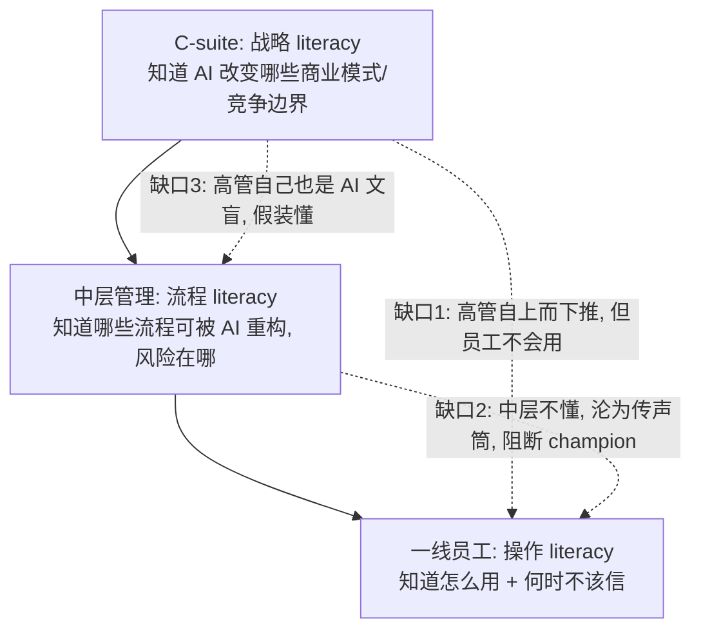

不建 AI literacy，技术选型再对，部署也会败在用户错误心智模型上——这是一个组织能力问题，不是培训预算问题。本节用「AI literacy 作为组织变革变量（而非 HR 培训科目）」这一框架，回答：为什么 78% 的企业部署了 AI、却只有 6% 拿到企业级财务回报，缺口里有多少是「人没装好正确的心智模型」造成的；以及一个 PM 该如何把 literacy 当成产品采纳曲线上的可设计杠杆，而不是甩给培训部门的合规动作。

## §0 为什么是「组织变革变量」框架，而不是「技能培训」框架

读到「AI literacy」四个字，多数人脑里弹出的默认框架是：**一门课、一套 onboarding 视频、一个 LMS（学习管理系统）里的必修模块**。这个框架不是错，是**抓错了因果链的位置**。

学界对 AI literacy 的奠基定义本身就比「技能」宽：Long & Magerko（2020，*ACM CHI*，《What is AI Literacy? Competencies and Design Considerations》）把它定义为「一组能力，使个人能够**批判性地评估** AI 技术、与 AI **有效协作**、并把 AI 作为工具使用」——核心词是「批判性评估」和「协作」，不是「会点哪个按钮」。Ng et al.（2021，*Computers & Education: AI*）进一步拆成六个构念：Recognize / Know & Understand / Use & Apply / **Evaluate** / Create / **Navigate Ethically**。注意末两项——评估能力与伦理导航——根本无法靠一段操作视频灌输。

所以本节坚持的框架是：**AI literacy 是组织采纳曲线（见 [A01 技术采纳与组织变革概念谱系](/kb/专题-商业组织与采纳/a01-技术采纳与组织变革概念谱系/)）上决定「能否跨越鸿沟」的一个变量，而不是 HR 的一个科目**。理由有三：

1. **它决定的是「用户心智模型」，心智模型决定误用率，误用率决定信任崩盘速度**。这是一条因果链，培训只是其中一个干预点。
2. **它是组织级而非个人级的属性**。一个员工会用不等于组织 literate——组织 literacy 还包括「谁该用什么层级的 AI」「错了找谁」「什么场景禁用」这些**分布式知识**。
3. **它是 change champion 网络的燃料**，而 champion 网络是 Rogers 扩散理论里跨越早期多数的关键机制（见 §4）。

把 literacy 降格成「培训」，等于把一个系统性组织变量塞进一个职能部门的 KPI 里——这正是 BCG「10-20-70 法则」想纠正的错位：AI 成功的决定因素中技术只占 10%、数据算法占 20%、**人/流程/文化变革占 70%**（BCG《Where's the Value in AI?》, 2024, n=1000 CxO, 59 国）。literacy 是那 70% 的核心承重墙。

## §1 心智模型校准：literacy 的真正标的物

literacy 建设的标的，从来不是「让员工知道 AI 存在」，而是**校准他们对 AI 能力边界的心智模型**。链 [A04 心智模型形成·概率系统 vs 确定系统](/kb/专题-人文社科透镜/a04-心智模型形成-概率系统-vs-确定系统/)（0426 认知科学专题）——那里讲信任/心智模型的认知机制，这里讲信任的前提：你得先有一个**正确的能力地图**，才谈得上把信任放在地图的正确位置。

错误心智模型有两个对称的失效方向，二者都致命：

| 失效方向 | 心智模型缺陷 | 行为后果 | 真实表现 |
|---|---|---|---|
| **过度信任（over-reliance）** | 把生成式 AI 当成「会查证的搜索引擎」 | 不核验直接交付，[幻觉](/kb/基础知识库/幻觉/)进入正式产物 | 律师引用 ChatGPT 编造的判例被法庭处罚（Mata v. Avianca, 2023，美国南区联邦法院 Castel 法官制裁令，已成判例） |
| **过度怀疑（under-reliance / 抵触）** | 把 AI 当成「会抢我饭碗的黑箱」或「玩具」 | 拒用、阳奉阴违、暗中抵制 | 45% 的 CEO 报告员工对 AI 采纳态度消极或敌对（Kyndryl 调查，2024，via 多渠道；〔样本设计待核实〕） |

这两个方向不是「培训不够」的程度问题，是**心智模型校准的方向问题**。一个只学了「怎么写 prompt」却没建立「AI 会自信地编造」这个心智模型的员工，literacy 评分可能很高，却恰恰是 over-reliance 的高危人群。

这就引出 literacy 评估最隐蔽的陷阱：**自评不可信**。Zhang et al.（2026, arXiv:2601.06101，《How to Assess AI Literacy: Misalignment Between Self-Reported and Objective-Based Measures》，作者 Shan Zhang、John Stamper、Kenneth R. Koedinger 等；已 WebFetch 核实）在教师群体中发现，**自评 AI 能力与客观测量能力之间相关度极低**，且存在系统性「高估型」画像。对 PM 的直接含义：用「你觉得自己会用 AI 吗」的问卷做 literacy 基线，测到的是**自信，不是能力**——而自信恰恰是 over-reliance 的前驱。

## §2 从个人到组织：literacy 的层级缺口

学界框架（Long & Magerko、Ng）大多面向**个人**（学生、技术人员）。组织 literacy 是另一个物种。2025 年《AI Literacy Development Canvas》（*Business Horizons* / ScienceDirect，2025）明确点出这个缺口：现有框架缺乏「针对不同职能岗位、能与组织战略对齐的**组织层级** AI literacy 评估工具」。

组织 literacy 的层级缺口长这样：

数字佐证这三个缺口都是真的：

- **缺口 1（高管推 vs 员工不会）**：仅 28% 的员工知道如何使用公司提供的 AI 工具（WalkMe, 2025，via 综合引用）；< 5% 的大型企业员工知晓内部可用的 AI 工具（Iternal.ai 综合引用，2026）。
- **缺口 3（高管自己也不 literate）**：仅 20% 的高管认为其员工真正具备 AI 就绪能力（Gartner CxO 调查, 2025 年底, n=197）——但「高管对员工能力的判断」本身依赖高管自己的 literacy，这是一个嵌套盲区。

这就是为什么本节坚持 literacy 是**组织属性**：把每个员工都训练成会用 ChatGPT，也不等于组织 literate，因为缺口 2、3 是**结构性的、分布在管理层级里的**，培训个人解不了。

## §3 判断主轴：literacy 建设中 90% 的人会搞错的四个点

> [!warning] 这一节是本节点的命门。每个点带「症状 → 为什么会错 → 正确做法 → 真实反例」。

### 错点一：把 literacy 等同于「会用工具」，忽略「知道何时不用」

- **症状**：培训内容 90% 是「怎么写好 prompt / 怎么调用 Copilot」，0% 是「什么场景禁用、AI 在哪会骗你」。
- **为什么会错**：「会用」是 Ng 框架里的 Use & Apply，是六个构念里最低阶的一个；真正防误用的是 Evaluate（评估输出可信度）和 Navigate Ethically（合规边界）。培训部门偏好教「会用」，因为它**可演示、可考核、显得有产出**。
- **正确做法**：把「校准能力地图」作为 literacy 的首要目标——明确教「AI 会自信地编造（[幻觉](/kb/基础知识库/幻觉/)）」「这些场景输出必须人工核验」「这些数据禁止喂给外部 AI」。
- **真实反例**：律师 over-reliance 引用编造判例（Mata v. Avianca, 2023）——当事人显然「会用」ChatGPT，缺的恰恰是「知道它会编」。

### 错点二：用自评/参与率衡量 literacy，把「自信」当「能力」

- **症状**：literacy 项目的成功指标是「培训完成率 95%」「满意度 4.5 分」「自评提升」。
- **为什么会错**：Zhang et al.（2026）证明自评与客观能力低相关；完成率只证明视频被播放，不证明心智模型被校准。McKinsey 观察到「7 成受训者忽视 onboarding 视频，更依赖实验性学习与社会学习」。
- **正确做法**：用**行为/客观指标**——核验率（员工是否核验 AI 输出）、误用事故率、在受控任务上的客观测评，而非问卷自评。
- **真实反例**：很多企业 literacy 项目「完成率高、误用照旧」——因为测的是参与，不是校准。

### 错点三：把 literacy 当一次性培训，无视它是「持续校准」

- **症状**：上岗时一次性培训，发个证，结束。
- **为什么会错**：AI 能力边界在快速移动（模型每几个月迭代一次），去年「AI 不会做」的事今年会了；一次性培训锁死的是一张**过期的能力地图**。这与 Lewin「Unfreeze-Change-Refreeze」模型的核心缺陷同源——AI 部署本质是「不断解冻」，永远无法真正「再冻结」。
- **正确做法**：literacy 作为持续过程，对应 ADKAR 模型的 **R（Reinforcement，强化）**——这恰是最常被砍掉的一步。
- **真实反例**：「AI 不会算数」是 2023 年的常识，到 2024 年带工具调用的模型已能可靠计算——抱着旧地图的员工要么误用（让裸模型算）要么误弃（明明能用却不用）。

### 错点四：只投 literacy（可见），不投 adoption（难测），错配资源

- **症状**：大笔预算砸培训，却没人负责「员工真的把 AI 嵌进工作流了吗」。
- **为什么会错**：McKinsey 直指此错位——多数公司**过度投入 literacy（可见、易测量）**，对 adoption（更复杂、需领导勇气、难量化）投入不足。literacy 是 adoption 的必要非充分条件：会用 ≠ 在用。
- **正确做法**：把 literacy 嵌进工作流重设计——AI 高绩效者进行「工作流根本重设计」的概率是其他企业的 **2.8 倍**（55% vs 20%，McKinsey State of AI, 2025）。literacy 必须和流程重设计捆绑。
- **真实反例**：MIT NANDA《GenAI Divide》（2025）发现失败核心是「学习机制缺失、系统集成不足、场景适配缺失」——不是员工不会用，是组织没把会用的人接进价值链。

## §4 Change Champion：literacy 扩散的真实机制

literacy 不靠「广播」扩散，靠**同伴网络**扩散。这是 Rogers 扩散理论的核心机制在组织内部的再现：早期采纳者（意见领袖）的背书，是早期多数愿意采纳的前提。

证据极强：**69% 的员工主要通过同伴（peer）学习 AI，而非正式培训**（Iternal.ai 综合引用，2026，部分引自 BCG/行业调查）。这意味着你 LMS 里的精美课程，影响力可能不如隔壁工位那个天天用 AI 的同事。

Change Champion 的有效设计有几条反直觉的原则：

1. **按行为信号识别，而非按职级指派**。真正的 champion 是那些主动实验、公开提问、无提示分享的人——不是被任命的「AI 大使」。指派的 champion 往往是组织噪音。
2. **多层次布局**。Iternal.ai 的 Champion Network Flywheel 强调同时在 IT/安全层、运营层、高管层布局倒数——单一层级的 champion 跨不过中层管理的「缺口 2」。
3. **心理安全是前提**。员工需感到可以实验、失败、提问而不被惩罚（Prosci; Centric Consulting）。没有心理安全，champion 的「公开提问」会变成「暴露无能」，扩散链断裂。

champion 机制对应经典变革模型的位置：Kotter 八步的第 4 步「招募变革志愿军（Enlist a volunteer army）」与第 2 步「组建引导联盟」；ADKAR 的 D（Desire，意愿）。但要注意——这些模型假设 champion「认同变革」，而 AI 时代 C-suite 自身的技术认知差距本身就是问题（缺口 3），所以 champion 网络不能只往下建，得**先校准高管的能力地图**。

## §5 产品 PM 视角补盲：literacy 不是培训部门的事，是产品设计的事

工程视角看 literacy 是「培训问题」；产品视角看，literacy 缺口是**产品设计可以部分内化的**——这是 PM 最容易看走眼的地方。

- **用户心理：抵触的根源是失控感，不是无知**。89% 员工对工作安全有顾虑，但仅 22% 表示领导层解释了 AI 将如何应用（2025 调查，via 综合）。抵触不是「不懂」，是「没人告诉我这对我意味着什么」。literacy 建设若只讲功能不讲「这不会取代你、会怎么改变你的工作」，就是在制造抵触。
- **产品可以把 literacy 内建进交互**：好的 AI 产品用 UI 校准心智模型——置信度可视化、来源引用、「此处建议人工核验」的提示，本质都是**把 literacy 焊进产品**，降低对外部培训的依赖。这与 [p307 - Copilot 到 Autopilot 光谱](/kb/产品设计与交互范式/p307-copilot-到-autopilot-光谱/) 的分层逻辑直接联动：L1-L2 的 Copilot 形态天然在交互中训练用户心智模型，而 L4 Autopilot 把决策藏进黑箱，反而剥夺了用户校准能力地图的机会——**自动化程度越高，对组织 literacy 的前置要求越高**，因为出错时用户更没有心智模型去兜底。
- **合规边界正在硬化**：EU AI Act 第 4 条（已生效 2025-02-02，via artificialintelligenceact.eu）要求 AI 系统的提供者和部署者「尽其所能确保员工具备足够水平的 AI 素养」，按系统复杂度、使用情境、人员角色差异化要求。这意味着 literacy 从「锦上添花」变成**法律义务**——PM 做面向欧盟市场的 AI 产品，literacy 支持（文档、培训材料、能力分层）是合规交付物，不是可选项。

## §6 对手框架回应：literacy 怀疑论

**接受 + 边界**，不是反驳。本节对 literacy 的强调，必须接住两个有力的反方立场。

**反方一：IBM「mindset > skillset」论。** IBM（2026-06, via Fortune 报道）负责再培训 3000 万人的高管表示，AI 技能固然重要，更关键的是**心态（mindset）而非技能集**；IBM 调研称 2030 年 67% 高管认为 mindset 将比 skillset 更重要。
> **接受**：完全同意——本节错点一、错点三本质都在说「校准心智模型/心态」比「会用工具」更重要，这与 IBM 立场一致。**边界**：但「mindset」不可测、难干预，容易沦为又一个甩锅借口（「员工心态不行」）。本节坚持 literacy 必须落到**可观测的心智模型校准**（如核验行为、对幻觉的认知）上——否则 mindset 是空话。我赌的是：可操作的能力地图校准，比抽象的「拥抱 AI 心态」更能降低误用率。

**反方二：培训无效论。** Frontiers in Education（2025）多篇研究显示，AI literacy 干预对短期认知提升显著，但**持续行为改变缺乏纵向证据**；Ma & Lei（2024）发现 literacy 影响行为意愿，而 Yao & Wang（2024）同类研究中该路径**不显著**——结论互相矛盾。
> **接受**：是的，「培训 → 行为改变」的因果链证据薄弱，这正是本节错点二、错点四的论据。**边界**：但这恰恰支持本节的核心主张——**问题不在「该不该建 literacy」，而在「literacy 该怎么建」**。把 literacy 等同于一次性培训当然无效；把它建成「持续校准 + champion 同伴网络 + 工作流嵌入」就是另一回事。失败的是「培训」这个实现方式，不是 literacy 这个目标。

> [!note] **Rick 未读的对手框架引入（破 echo chamber）**
> **Polanyi 默会知识（Tacit Knowledge）**：Michael Polanyi「我们知道的比我们能说出的多」（*The Tacit Dimension*, 1966）。对 literacy 的逼问是——「何时该信 AI」这种判断力，本质是**默会知识**，无法靠显性课程传递，只能在实践中、在同伴互动中习得。这从根本上解释了为什么 69% 的员工靠同伴而非正式培训学 AI（§4），也为「培训无效论」提供了更深的机制解释：可编码的 literacy（怎么写 prompt）能教，不可编码的 literacy（什么时候这个输出闻起来不对）只能养。PM 启示：literacy 建设的重心应从「内容生产」转向「创造同伴实践的场域」（参见 [Polanyi 默会知识与提示工程的认识论张力](/kb/基础知识库/polanyi-默会知识与提示工程的认识论张力/)）。

## §7 跨域呼应：心智模型校准的认识论根基

literacy 的标的是「心智模型」，而心智模型是一个**认识论概念**——它关乎主体如何表征一个它无法完全观察的系统。链入 0117社会学：组织 literacy 的分布式特性，本质是涂尔干意义上的「集体表征」问题——一个组织对 AI 的「正确认知」不存在于任何单个员工头脑里，而是分布在角色、流程、规范中。

更锋利的呼应在 STS（科学技术学，链 0117社会学 下的技术社会建构视角）：**「正确的 AI 心智模型」不是一个客观给定的事实，而是组织协商出来的社会建构**。当组织说「这个场景 AI 不可信」时，「不可信」的边界往往不是纯技术判定，而是夹杂了责任分配（谁来背锅）、权力结构（谁有权宣布 AI 可信）的协商结果。这解释了一个反常现象：技术上同样可靠的 AI 输出，在不同组织里被赋予截然不同的信任度——literacy 校准的不只是「员工对 AI 的认知」，更是「组织对『谁能宣布 AI 可信』的权力安排」。这把 literacy 从培训问题，升格成了**组织治理问题**。

## §8 PM 决策启示

- **面试怎么用**：当被问「怎么提升 AI 产品的采纳率」，不要答「多做培训」。答：「采纳失败的 70% 是组织问题（BCG 10-20-70），其中核心是用户心智模型没校准——over-reliance 导致信任崩盘、under-reliance 导致抵触。我会先用客观测评（不是自评，因为 Zhang 2026 证明自评不可信）测 literacy 基线，识别行为型 champion 而非指派，把信任校准焊进产品交互（置信度可视化），并把 literacy 当持续校准而非一次性培训。」——30 秒展示你把 literacy 当组织变量而非培训科目。
- **选型怎么用**：评估 AI 供应商时，把「这个产品在交互层面帮我校准用户心智模型吗（来源引用、置信度提示、人工核验触发）」列为选型维度——内建 literacy 支持的产品，部署后的组织 literacy 成本更低。
- **复现/落地怎么用**：设计 literacy 项目时套用诊断清单——(1) 测的是行为还是自评？(2) 教的是「会用」还是「何时不用」？(3) 是一次性还是持续校准（有没有 ADKAR 的 R）？(4) champion 是按行为识别还是按职级指派？(5) literacy 是否捆绑工作流重设计？五条全过，才算建到了 70% 那堵承重墙上。

## §9 与已有节点的关系

- 对照 [m207 - Agent 产品化：场景推演与失败模式](/kb/工程化与落地架构/m207-agent-产品化-场景推演与失败模式/)：m207 讲 Agent 的**技术失败模式**（规划失败、工具调用失败、雪崩效应）与 HITL 断点设计。本节做**组织层升级**——m207 的 HITL 断点假设「人能正确接管」，但若组织 literacy 不足、人的心智模型错误，HITL 反而会成为「错误的人在错误的时刻盲目批准」的橡皮图章。本节不复述 m207 的失败模式分类，而是补上：**技术兜底机制的有效性，前置依赖于组织 literacy**。
- 对照 [p307 - Copilot 到 Autopilot 光谱](/kb/产品设计与交互范式/p307-copilot-到-autopilot-光谱/)：p307 讲自动化分层与动态升降级。本节补缺——p307 的「按信任积累升级」假设用户信任是校准的，但若 literacy 不足，信任积累可能建立在错误心智模型上（用户因为「AI 没出过错」就升级，而没出错只是因为还没遇到边界）。**自动化光谱越往 Autopilot 走，对前置 literacy 的要求越高**，这是 p307 升降级逻辑的组织前提。
- 对照 [m208 - AI 基础设施与中间件选型](/kb/工程化与落地架构/m208-ai-基础设施与中间件选型/)：m208 是技术选型，本节是「选型对了之后为什么还会败」的组织答案——这正是本专题「技术选型对但部署失败」核心命题的 literacy 切片。

## §10 关联节点

**核心（必读）**
- [A01 技术采纳与组织变革概念谱系](/kb/专题-商业组织与采纳/a01-技术采纳与组织变革概念谱系/)——literacy 是跨越鸿沟的变量
- [A04 心智模型形成·概率系统 vs 确定系统](/kb/专题-人文社科透镜/a04-心智模型形成-概率系统-vs-确定系统/)（0426 认知科学专题）——literacy 的下游：信任/心智模型的认知机制
- [m207 - Agent 产品化：场景推演与失败模式](/kb/工程化与落地架构/m207-agent-产品化-场景推演与失败模式/)——技术兜底的组织前提
- [p307 - Copilot 到 Autopilot 光谱](/kb/产品设计与交互范式/p307-copilot-到-autopilot-光谱/)——自动化越高，literacy 要求越高
- [幻觉](/kb/基础知识库/幻觉/)——错误心智模型的核心攻击面
- [Polanyi 默会知识与提示工程的认识论张力](/kb/基础知识库/polanyi-默会知识与提示工程的认识论张力/)——为什么 literacy 难以显性传递

**延伸（可选）**
- [m208 - AI 基础设施与中间件选型](/kb/工程化与落地架构/m208-ai-基础设施与中间件选型/)——选型对、部署败的组织答案
- 0117社会学——集体表征与 STS 视角
- [Agent](/kb/基础知识库/agent/)——被部署对象的能力边界
- [AI PM 知识图谱·总索引](/kb/ai-pm-知识图谱/ai-pm-知识图谱-总索引/)——总入口

## 修订日志

- R1（2026-06-07）：首稿。建立「literacy 作为组织变革变量」框架；判断主轴四件套（错点一至四）；接入 IBM mindset 论、培训无效论两个对手立场（接受+边界）；引入 Polanyi 默会知识破 echo chamber；STS 视角把 literacy 升格为治理问题；显式升级对照 m207 / p307 / m208。grounding：Zhang et al. arXiv:2601.06101 已 WebFetch 核实（标题/作者/主题全部吻合）。剩余待核实项：Kyndryl 45% 样本设计。
