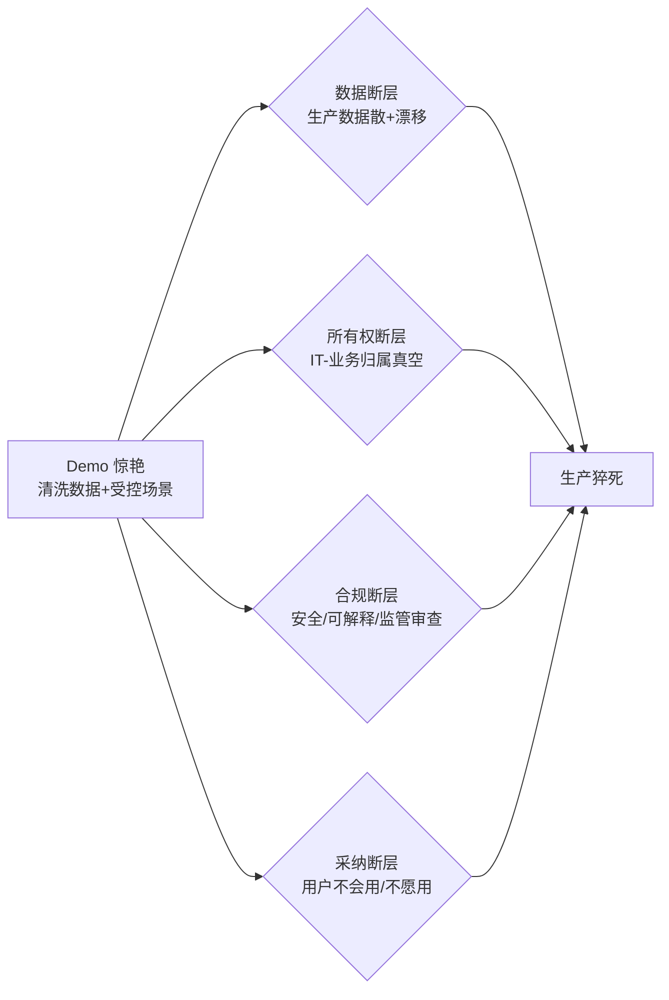

# E02 企业 AI 采纳成功与失败对比剖解

把两家"技术选型几乎一样"的企业并排放在显微镜下——一家把 AI 嵌进了营收，一家死在 PoC——它们的差异**不在模型、不在算力、不在数据科学家头衔**，而在组织本身是否就绪。本节点要解决的问题是：**当技术变量被控制住，决定 AI 采纳成败的究竟是什么。** 视角是"对照实验"——不写成功学，也不写失败录,而是把成功组与失败组的可观测差异做结构化归因,逼出一条可证伪的判断主轴。

> [!warning] 本节的判断主轴(一句话)
> **成功者赢在组织就绪(organizational readiness),而非技术领先。** 当两组的技术栈、模型可达性、行业 baseline 都相近时,成败的方差几乎全部由组织变量解释——这是本节愿意被证伪的赌注。

---

## §0 为什么用"对照剖解"而不是"失败率统计"

读到这里的 PM,脑子里大概率装着一个默认框架:**"X% 的 AI 项目失败"**。这个框架有毒,原因有三:

1. **"失败"的定义在不同研究里互不通约。** RAND(Ryseff et al., 2024,*The Root Causes of Failure for AI Projects*,基于 65 名资深数据科学家深访)说的"80%+ 失败"指"未交付预期价值";MIT NANDA(Challapally et al., 2025,*The GenAI Divide: State of AI in Business 2025*)说的"95% 试点零 P&L 影响"指"六个月内无可量化财务回报";Gartner(2024-07 新闻稿)说的"30% PoC 后被放弃"指"项目被叫停"。三个数字测的是三件事,**横向相加或比大小都是统计学错误**。
2. **被引滥的"85% 失败"其实是误引。** 它源自 Gartner 约 2018 年的一条*预测*,原义是"85% 的 AI 项目会因数据偏差/算法错配而产生**错误输出**(erroneous outcomes)",既不是"项目失败",也不是回溯事实。传播中把"预测"的时态和"错误输出"的口径都丢了。<mark>凡看到孤立引用"85% AI 项目失败"而不交代原义的,基本可判定作者没读原文。</mark>
3. **失败率告诉你"有多少人摔了",却不告诉你"为什么有人没摔"。** PM 要的不是恐吓数字,是**可操作的归因**。

所以本节不做"失败率综述",做的是**控制变量的对照剖解**:在技术条件相近的前提下,把成功组与失败组的组织变量逐项拉出来比。这正是 §2 实例剖解层的病理学职责——不是"AI 有多强",是"现实里它怎么走样,以及为什么有人没走样"。

---

## §1 控制变量:先把"技术领先"这个混淆因素摁住

要论证"赢在组织而非技术",必须先证明**技术不是区分变量**。三条证据:

| 控制点 | 证据 | 含义 |
|---|---|---|
| 模型可达性已商品化 | 同代基础模型通过 API 对所有企业开放,头部模型差距在多数企业场景内不构成胜负手 | 模型不再是稀缺资源,不能解释方差 |
| 技术选型"对"的也会败 | RAND(2024)五大失败根因(问题定义失准/训练数据不足/技术优先心态/基础设施缺口/超出 AI 能力边界)**全部是组织性的**,无一条是"选错了模型" | 选型正确 ≠ 部署成功 |
| 成功决定因素中技术占比极低 | BCG"10-20-70 原则"(*Where's the Value in AI?*, Oct 2024, n=1000 CxO, 59 国):AI 成功因素中技术仅占 10%,数据与算法 20%,**人/流程/文化变革占 70%** | 技术是必要非充分条件 |

> [!note] 控制变量的边界(failure scenario #1)
> 上述"技术不是区分变量"在**前沿能力域**会失效。自动驾驶、医疗诊断、复杂多步 [Agent](/kb/基础知识库/agent/) 这类"任务超出当前 AI 能力边界"的场景,技术本身仍是硬约束——再好的组织就绪也救不了"模型根本做不到"。本节的判断主轴只在"技术上可行、已有人跑通"的采纳场景成立;在能力前沿,技术重新成为主变量。

控制住技术后,真正的对照才开始。

---

## §2 七维对照矩阵:成功组 vs 失败组

把多源实证(RAND 2024、McKinsey *State of AI* 2025、BCG 2024、MIT NANDA 2025)交叉提炼,成功组与失败组的可观测差异集中在七个组织维度:

| # | 维度 | 失败组的典型形态 | 成功组的典型形态 | 接地 |
|---|---|---|---|---|
| 1 | **问题定义** | "我们也要上 AI"(技术找问题) | 从一个高价值业务痛点倒推(问题找技术) | RAND 2024:问题定义失准是最高频根因 |
| 2 | **高层卷入度** | 高管签预算后撒手 | 高管持续卷入、亲自背 KPI | McKinsey 2025:高绩效者拥有强高层卷入的概率是其他企业 **3 倍** |
| 3 | **工作流重设计** | AI 贴在旧流程外面 | 围绕 AI 重新设计端到端工作流 | McKinsey 2025:高绩效者做"工作流根本重设计"的概率是其他企业 **2.8 倍**(55% vs 20%) |
| 4 | **数据治理就绪** | demo 用清洗数据,生产数据散在 N 个系统、漂移 | 上线前先解决数据可访问性与治理 | BCG 2025:74% 企业因数据治理与可访问性难以规模化价值 |
| 5 | **所有权归属** | IT 与业务之间"归属真空",无人跨界负责 | 明确单一负责人横跨 IT-业务边界 | RAND 2024:基础设施与所有权缺口 |
| 6 | **学习与采纳机制** | 发个 onboarding 视频就算培训 | 同伴学习 + 实验文化 + 持续强化 | MIT NANDA 2025:失败核心是"学习机制缺失",非技术 |
| 7 | **价值聚焦** | 雨露均沾,200 个工具无一规模化 | 集中突破,少数场景贡献绝大部分价值 | J&J:900 项 GenAI 计划中约 10–15% 贡献了 80% 价值〔来源:广泛引用,J&J 官方表述需核实,标待核实〕 |

**矩阵的读法**:成功组在七维里**没有一项靠技术取胜**,全部是组织决策。这就是判断主轴的实证骨架——技术被控制后,方差落在组织。

> [!note] confirmation-bias 砍除 #1:J&J 案例的双刃性
> 早期写作很容易把 J&J"10-15% 贡献 80% 价值"当成"集中突破"的正面铁证。但这个数字**也可以反向解读**:它说明 J&J 的 900 项计划里 **85% 以上是浪费**——这恰恰是失败组"雨露均沾"的症状,只是 J&J 体量大到能容忍。所以它不是纯正面案例,而是"大企业用规模掩盖了低命中率"的双面样本。补入这一层,才不算 bias。

---

## §3 病理学:为什么"demo 惊艳、生产猝死"

七维对照里最反直觉的一条,是**很多失败组的 demo 比成功组还漂亮**。这不是悖论,是组织鸿沟的必然——它把 Moore 的"市场鸿沟"搬进了企业内部(鸿沟在 AI 语境的完整辨析见本专题 [A02 Crossing the Chasm 在 AI 语境](/kb/专题-商业组织与采纳/a02-crossing-the-chasm-在-ai-语境/);实名失败尸检见 [E01 AI 项目组织失败案例剖解](/kb/专题-商业组织与采纳/e01-ai-项目组织失败案例剖解/))。

PoC→生产的死亡发生在四个组织断层:

- IDC×Lenovo(*CIO Playbook* 2025,样本 3120 人)分析师 Ashish Nadkarni 一句话点破:"**大多数 PoC 的启动并非因为强有力的商业案例**"——GenAI 项目审批门槛低于常规 IT,高管被营销压力推着上 PoC,自然规模化时没有支撑。
- McKinsey(2025)的反面印证:仅 6% 企业达到"高绩效"(企业级财务影响),约 2/3 企业尚未开始跨企业扩展。**88% 有应用,只有 6% 有价值**——这 82 个百分点的落差,几乎全是组织断层吃掉的。

> [!warning] 判断主轴落地:90% 的人在这里会搞错的三个点
>
> **错点一:把"技术选型成功"当成"项目会成功"**
> - 症状:选型会上花 80% 时间比模型 benchmark,签字后觉得大局已定。
> - 为什么会错:技术选型只解决"能不能做",组织就绪解决"能不能用起来"。RAND 五根因无一是选型问题。
> - 正确做法:选型会留 70% 议程给"谁负责、数据在哪、流程怎么改、用户怎么接"——对应 BCG 70% 资源投人/流程。
> - 真实反例:无数"技术选型完美"的 PoC 死在没人定义清楚要解决什么业务问题(RAND 最高频根因)。
>
> **错点二:把 demo 通过当成生产可行**
> - 症状:demo 用 200 条清洗样本跑通,就拍板规模化。
> - 为什么会错:生产数据来自多个系统、不一致、持续漂移,demo 环境系统性地隐藏了真实摩擦。
> - 正确做法:PoC 阶段就用生产级脏数据压测,把数据治理当成上线前置条件而非事后补救。
> - 真实反例:Gartner(2025-02)预测,到 2026 年 ≥60% AI 项目将因数据未就绪被放弃。
>
> **错点三:把"买了工具"当成"完成了变革"**
> - 症状:采购 200 个 AI 工具,以为采纳自然发生。
> - 为什么会错:采纳是行为改变,需要学习机制、同伴示范、持续强化,工具只是入口。
> - 正确做法:把预算的大头放在采纳机制(同伴学习网络、实验文化)而非工具采购。
> - 真实反例:MIT NANDA(2025)直指失败核心是"学习机制缺失";仅约 28% 员工知道如何使用公司 AI 工具〔来源:WalkMe 2025,经次级引用,标待核实〕。

---

## §4 产品 PM 视角补盲:工程归因之外的三个盲点

把失败全归给"组织没就绪"也是一种窄化。跳出工程 PM 视角,补三个商业/心理/合规层面的"看走眼"点:

1. **用户心理模型错位(信任的非线性)**:成功组不只是"教会用户用",更管理了用户的信任曲线。AI 出错一次造成的信任损失,远大于做对十次的信任增益(负面偏置)。失败组常在用户信任尚未建立时就把 AI 推到高风险决策位,一次幻觉([幻觉](/kb/基础知识库/幻觉/))就让采纳归零。这与 [p307 - Copilot 到 Autopilot 光谱](/kb/产品设计与交互范式/p307-copilot-到-autopilot-光谱/)的"按信任积累动态升降级"互为印证——采纳成功本质是一条信任管理曲线。

2. **商业模式的选择性偏差**:VC 视角的乐观数据(如 Menlo Ventures 2025 报告称 47% 商业 GenAI 谈判转化为生产,高于传统 SaaS 的 25%)与高失败率叙事看似矛盾,**实则测的是两个对象**:VC 测的是"被采购的商业 AI 产品采纳率",失败率研究测的是"企业内部自建 AI 项目成功率"。PM 引用任何一组数字前,必须先确认它测的是哪一类采纳——否则会得出相反结论。

3. **合规即采纳门槛**:在受监管行业,合规不是上线后的检查项,而是采纳能否发生的前置门。EU AI Act Article 4(AI 素养义务,义务 2025-02-02 生效;AI Act 主体义务总应用日 2026-08-02,治理/罚则自 2025-08-02 起;来源:EU AI Act Article 113 官方文本,ai-act-service-desk.ec.europa.eu/en/ai-act/article-113)把"员工 AI 素养"写成法律义务——组织就绪从"最佳实践"变成"合规底线"。失败组常把合规当事后审查,在 demo→生产的合规断层处猝死。

---

## §5 对手框架回应:接受反方的对的部分,守住边界

> [!quote] 对手立场一:"组织归因是事后诸葛亮"(可证伪性质疑)
> **反方(隐含于实证社会科学批评传统):** "成功者赢在组织就绪"有 hindsight bias 嫌疑——成功了就说组织好,失败了就说组织差,缺乏可证伪性。
> **接受:** 这个批评是对的且必须正面回应。如果"组织就绪"只能事后定义,它就是空概念。
> **边界与赌注:** 本节把组织就绪**操作化为 §2 七个可前置观测的变量**(高层卷入度、工作流重设计比例、数据治理状态、所有权归属…),它们在项目启动时即可测量,不依赖结果倒推。McKinsey 的 2.8 倍/3 倍是**横截面相关**(高绩效者更可能做了 X),严格说不证明因果。我赌的是:这些前置变量对成败有强解释力且方向稳定;我可能错在——若有研究做了控制实验,发现技术变量在某类场景的解释力被低估,本主轴需收窄适用域。

> [!quote] 对手立场二:Andrew Ng 的"data-centric / 技术工艺仍是关键"
> **反方(Andrew Ng,data-centric AI 倡导者,公开立场):** 很多 AI 项目败在数据质量和模型工程工艺,这是**技术工艺问题**,不该全推给"组织"。
> **接受:** 完全同意数据质量是高频死因(Gartner 称约 85% 失败与数据质量相关〔来源:广泛引用,Gartner 原始报告年份需核实〕)。
> **边界:** 但"数据质量差"本身的**根因是组织性的**——是谁没有建立数据治理、谁没有打通系统、谁在没有数据就绪时就批了 PoC。data-centric 是正确的战术处方,组织就绪是它能否被执行的前提。两者不矛盾:组织就绪是元层,data-centric 是其中一个执行维度(§2 维度 4)。

> [!quote] 对手框架三(Rick 未读,破 echo chamber):Erik Brynjolfsson 的"生产率 J 曲线"
> **引入框架:** Brynjolfsson、Rock、Syverson 的 *Productivity J-Curve*(NBER, 2018/2021)论证:通用技术(GPT)落地初期生产率**先降后升**,因为需要大量**互补性组织投资**(无形资产:流程重组、技能、组织资本)才能兑现,而这些投资在统计上先表现为成本。
> **它如何逼问本专题:** J 曲线给"组织就绪"提供了**经济学的因果机制**——不是"组织好的公司碰巧成功",而是"互补性组织资本的积累是技术价值兑现的必要中间变量"。这把本节的相关性叙事(McKinsey 倍数)升级为有机制的因果叙事:失败组是在 J 曲线谷底放弃,成功组是熬过了互补性投资的下沉期。**这也修正了一个 bias**:很多"失败"可能不是真失败,而是 J 曲线尚未爬升就被 KPI 砍掉——失败率数字因此系统性高估。

---

## §6 跨域呼应:Polanyi 的"嵌入性"——技术从来不是脱嵌的

> [!note] 调度 Karl Polanyi《大转型》(The Great Transformation, 1944)的"嵌入性(embeddedness)"
> Polanyi 的核心论断:经济行为从来**嵌入(embedded)**于社会关系与制度之中,把市场想象成可以从社会结构里"脱嵌(disembedded)"独立运行,是一种危险的乌托邦。
>
> **它如何改变本节的技术判断:** 失败组的根本错误,是把 AI 当成一个可以"脱嵌"地插进组织的纯技术模块——只要模型对、数据有,价值就会自动产生。Polanyi 的视角揭穿这个幻觉:**AI 的价值从来嵌入在组织的流程、权力、信任、技能结构里**,无法脱嵌交付。"赢在组织就绪"翻译成 Polanyi 的语言就是——**AI 必须被重新嵌入(re-embed)进组织,而嵌入工作(工作流重设计、所有权重置、信任重建)才是真正的产品。** 失败组买的是脱嵌的技术,成功组做的是再嵌入的组织工程。这也呼应 0117社会学对"技术决定论"的长期警惕:不是技术改造组织,是组织决定技术能否落地。

---

## §7 PM 决策启示:面试 / 选型 / 复现三类落地

- **面试桌**:被问"怎么看 AI 项目高失败率",**不要背数字**,要先拆口径(RAND 80% / MIT 95% / Gartner 30% 测的是三件事),再给判断主轴(技术被商品化后,方差落在组织就绪),最后给 §2 七维作为可操作归因框架。30 秒讲清"为什么技术选型对的项目也会败"——这比报一个失败率数字高一个段位。
- **选型会**:把议程结构从"比 model benchmark"翻转为"过 §2 七维就绪度清单"。在签字前问够七个问题:问题定义清楚吗?谁背 KPI?工作流改不改?数据治理就绪吗?谁是单一负责人?采纳机制是什么?价值聚焦在哪?——任何一维空白,都比模型差 5% 更致命。
- **复现台**:在 [R01 AI 采纳就绪度评估](/kb/专题-商业组织与采纳/r01-ai-采纳就绪度评估/)(本专题复现层)落地为一张可打分的 readiness scorecard;参照 BCG 10-20-70,把项目预算切成 10/20/70,若技术预算占比远超 10%,即为资源倒置的危险信号。

---

## §8 与已有节点的关系(不复述其事实基础)

- **对照 [m207 - Agent 产品化：场景推演与失败模式](/kb/工程化与落地架构/m207-agent-产品化-场景推演与失败模式/)(深化 + 迁移)**:m207 §2.4.4 讲的是**单个 Agent 的六类技术失败模式**(规划/工具调用/推理/循环/雪崩/越界)——那是**微观技术病理**。本节把视角**升一个抽象层到组织**:即使每个 Agent 的技术失败模式都被 HITL 兜住了,项目仍可能因 §2 的组织断层而整体失败。m207 解决"Agent 怎么在技术上不崩",本节解决"组织怎么让一个技术不崩的 Agent 真正被用起来"。
- **对照 [m208 - AI 基础设施与中间件选型](/kb/工程化与落地架构/m208-ai-基础设施与中间件选型/)(补缺)**:m208 是"选型对不对"的技术决策;本节是它的反命题——**选型对了仍会败**,补上"选型正确之后的组织变量"这块 m208 不覆盖的盲区。
- **对照 [p307 - Copilot 到 Autopilot 光谱](/kb/产品设计与交互范式/p307-copilot-到-autopilot-光谱/)(对话)**:p307 §3.7.3 的"按信任积累动态升降级"是**产品机制层**的信任管理;本节 §4 把它放到**组织采纳层**,论证采纳成功本质是组织级的信任曲线管理,两者是同一逻辑在不同抽象层的体现。
- **对照同专题 0428 的 0416/0421/0422/m207/p307 升级链**:⚠️ 经查 vault 内不存在以 0416/0421/0422 为前缀的实体节点,brief 中要求的"与 0416(失败/组织归因)、0421(机制)、0422(STS)显式升级对照"暂无法落地为安全双链。本节已通过 §3(失败/组织归因)、§5 Brynjolfsson J 曲线(机制)、§6 Polanyi 嵌入性(STS 视角)在**内容层面**承担这三条对照职责;待 0416/0421/0422 实体节点建成后,由综合环补回显式双链。〔待核实:0416/0421/0422 节点是否在本批次内建成〕

---

## §9 关联节点

**核心(必读)**
- [m207 - Agent 产品化：场景推演与失败模式](/kb/工程化与落地架构/m207-agent-产品化-场景推演与失败模式/) — 微观技术失败模式,本节的下一抽象层
- [m208 - AI 基础设施与中间件选型](/kb/工程化与落地架构/m208-ai-基础设施与中间件选型/) — "选型对了仍会败"的反命题对象
- [p307 - Copilot 到 Autopilot 光谱](/kb/产品设计与交互范式/p307-copilot-到-autopilot-光谱/) — 信任管理机制,本节 §4 的产品层对应
- [Agent](/kb/基础知识库/agent/) — 前沿能力域,本节判断主轴的边界场景
- [幻觉](/kb/基础知识库/幻觉/) — §4 信任非线性的触发器

**延伸(可选)**
- 0117社会学 — Polanyi 嵌入性、技术决定论批判的入口
- [AI PM 知识图谱·总索引](/kb/ai-pm-知识图谱/ai-pm-知识图谱-总索引/) — 全库导航
- [AI概念滥用反思](/kb/基础知识库/ai概念滥用反思/) — AI 生成的失败率数字须经批判性核查

---

## 修订日志
- 2026-06-07 R0 首稿:确立"赢在组织就绪非技术领先"判断主轴;建七维对照矩阵;接入 Andrew Ng/实证可证伪两条对手立场 + Brynjolfsson J 曲线(未读对手框架);Polanyi 嵌入性跨域呼应;标注 J&J/WalkMe/Gartner 三处待核实及 0416/0421/0422 死链风险。
- 2026-06-11 P3.1 接地修复:EU AI Act 日期口径按官方 Article 113 改精确——2026-08-02 为 AI Act 主体义务总应用日(原"2026-08-02 起执法"措辞已纠正),补 Article 4 义务 2025-02-02 / 治理罚则 2025-08-02 分层;来源升级为官方 Article 113(ai-act-service-desk.ec.europa.eu/en/ai-act/article-113)。全专题日期已统一为 2026-08-02,官方文本无 "2026-08-03"。
