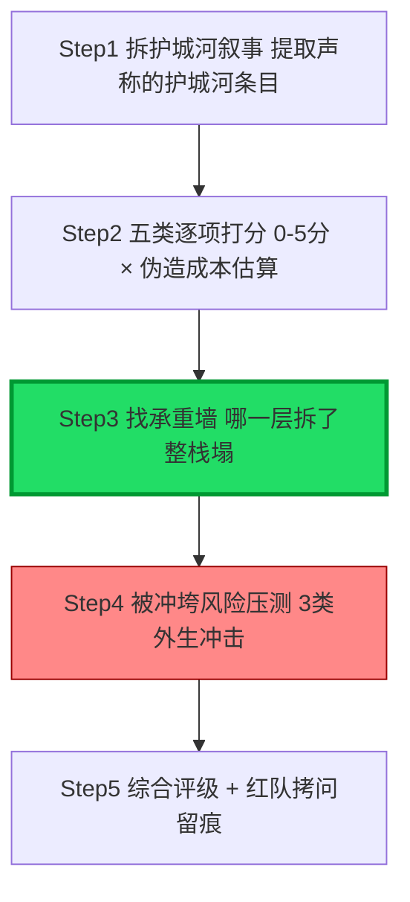

当你拿到一份 BP、一个竞品、或自家产品的护城河叙事，怎么不靠直觉、不被"数据飞轮+网络效应+成本优势"的清单话术忽悠，在 30 分钟内做出一份可证伪、可打分、能交给投委会/选型会的护城河审计？本节点是 [S02 五类护城河可替换栈·数据 工作流 网络 成本 品牌](/kb/专题-商业组织与采纳/s02-五类护城河可替换栈-数据-工作流-网络-成本-品牌/) 的**操作化落地**——把 S02 的"可替换栈"判断框架，拆成一套**逐项打分 + 被冲垮风险压力测试 + 红队拷问**的复现手册。核心方法论一句话:**护城河审计不是"数他有几种护城河"，而是"逐条估算对手伪造每一条的成本，再问哪一条一旦失守整栈会塌"。** 不会算"伪造成本"的护城河审计，都是营销文案的复读。

## §0 为什么用"伪造成本审计"框架，而不是"护城河清单打钩"

业界尽职调查最常见的做法是"护城河清单打钩"——VC 模板里列着 network effects / switching cost / data / brand / scale，逐项打个有/无/强/弱。这个框架对 AI 产品**系统性失效**，原因有三:

1. **它把护城河当可累加项**。打钩越多看起来越安全,但 S02 已论证五类护城河之间存在挤出效应——把资源全押在"用最好的模型"上就没资源做工作流。清单法奖励"样样都沾",而样样都沾恰恰是没有承重墙的征兆。
2. **它没有"抗模型更新冲击度"这一维**。传统 SaaS 护城河理论(波特五力、Helmer《7 Powers》——均为本专题 [S02 五类护城河可替换栈·数据 工作流 网络 成本 品牌](/kb/专题-商业组织与采纳/s02-五类护城河可替换栈-数据-工作流-网络-成本-品牌/) 标注的对手框架)假设技术演进是渐进的;AI 产品的底层能力每月迭代,一条在 2025 年成立的护城河可能在一次模型发布后归零。清单法看不见这个维度。
3. **它不区分"真信号"与"伪造成本低的噪声"**。S02 的跨域呼应已用 Spence 信号理论(见 0133信息经济学)证明:护城河的强度 ≈ 对手伪造它的成本。UI、prompt、价格差伪造成本接近零,在信号意义上根本不传递"我不可替代"的信息。

所以本 checklist 的承重设计是:**每一条护城河,不打"有/无",而是估"对手伪造它需要花多少钱、多少时间、绕过多少结构性障碍"——伪造成本越高,护城河越真。** 这一步框架级辨析,挡掉了读者脑中"打钩越多越安全"的默认错误框架。

> [!note] 与 [S02 五类护城河可替换栈·数据 工作流 网络 成本 品牌](/kb/专题-商业组织与采纳/s02-五类护城河可替换栈-数据-工作流-网络-成本-品牌/) 的分工:S02 是"框架与判断"(为什么能力/成本最弱、工作流/网络可承重);R02 是"工具与流程"(怎么给一个具体产品逐项打分、做压力测试)。R02 不复述 S02 的矩阵推导,只把它变成可执行的审计动作。

## §1 审计五步流程总览

每一步都有交付物:Step1 出"护城河声明清单",Step2 出"五维打分表",Step3 出"承重墙判定",Step4 出"冲垮风险矩阵",Step5 出"评级 + 三句话结论"。全程 30–45 分钟,不需要访谈,只需要 BP/官网/定价页/财报。

## §2 Step1—Step2:五类逐项打分表(可复制模板)

**Step1 动作**:把对象的护城河叙事逐句摘出来,翻译成"它声称在哪一类建了护城河"。警惕话术伪装——"行业最先进的模型微调"是能力层伪装成数据层;"和工作流深度集成"要追问到底是浏览器插件(浅)还是 System of Record(深)。

**Step2 评分卡**(每类 0–5 分,5 = 伪造成本极高/承重墙级):

| 护城河类型 | 评分问句(打分依据) | 0–1分(伪造成本≈0) | 4–5分(伪造成本极高) | 抗模型更新冲击 |
|---|---|---|---|---|
| **数据(飞轮)** | 用户每次交互是否产生与模型优化目标一致的接受/拒绝信号,并自动回流? | 静态历史数据集、弱信号(浏览/点赞)、人工才能接回 | 闭合反馈+任务特定信号+不可购买不可合成 | 中(条件满足才抗) |
| **工作流(嵌入)** | 是否成为客户业务的记录系统(System of Record),迁走会丢历史/断流程? | 浏览器插件、可一键卸载、无数据沉淀 | 客户把核心业务数据/流程迁入,切换=停业务 | **高** |
| **网络效应** | 第 N+1 个用户是否让前 N 个用户的体验**直接**变好? | "用户多→数据多→模型好"(这是规模效应不是网络) | 用户间直接产生价值(双边市场/内容生态) | 高(真网络罕见) |
| **成本** | 你的单位成本优势是否独立于全行业 API 降价? | "我们比对手便宜 X%"(下一波降价抹平) | 几乎不存在 4–5 分的情况 | **极低** |
| **品牌** | 在能力同质化时,品牌能否独立支撑默认选择心智? | "我们是第一个"(先发≠锁定) | C 端默认动词级心智(少数) | 高 |
| 〔对照〕**能力** | 你的模型/prompt 领先能维持多久? | 任何"用了最新 GPT/Claude"(6 个月窗口) | 不存在(能力是租来的) | **极低** |

**打分纪律**:
- **不给"潜力分"**。审计的是现状,不是 roadmap。"未来会建数据飞轮"= 数据层 0 分。
- **能力层默认封顶 1 分**。除非有 arXiv 可核实的、对手在 6 个月内无法复现的算法资产(对应用层产品几乎从不成立)。Andrew Chen 的观察是"最先进模型与开源版本差距约 6 个月"(来源:Andrew Chen, *Revenge of the GPT Wrappers*, andrewchen.substack.com)——这就是能力护城河的物理上限。
- **成本层默认封顶 2 分**。推理成本 2023→2025 下降约 80%(来源:techstartups.com, 2025/03);自 2023 年 3 月前沿 LLM 平均输出价格下降约 94.5%(来源:BenchLM, 2025)。成本差是外生变量主导,买时间不买壁垒。

## §3 Step3:找承重墙(整个 checklist 的命门)

打完分不是加总求和——**护城河审计反对"加权平均"**,因为承重墙逻辑是"取决于最关键那一层,而不是平均"。一个工作流 5 分但能力 0 分的产品,远比一个五项各 3 分的产品安全。

**承重墙判定规则**(对照 [S02 五类护城河可替换栈·数据 工作流 网络 成本 品牌](/kb/专题-商业组织与采纳/s02-五类护城河可替换栈-数据-工作流-网络-成本-品牌/) §2 的栈结构):

| 产品类型 | 合格的承重墙 | 危险信号(承重墙落错层) |
|---|---|---|
| B 端工具/Copilot | 工作流(System of Record) | 承重墙是"能力/成本" → 标红 |
| 双边市场/C 端社交 | 真网络效应 | "网络效应"经不起"第 N+1 用户问" → 标红 |
| 自动化 Agent | 工作流 + 咬合进飞轮的数据 | 一次性调用、无沉淀 → 重估商业模式 |
| C 端默认工具 | 品牌(默认选择心智) | 品牌无工作流支撑、能力同质 → 黄牌 |

**红线判定**:如果一个产品的最高分项落在**能力或成本层**,无论其他项多好,审计结论都是"无可承重护城河,处于 6 个月窗口期生存"。这是 brief 的核心判断主轴落地——这正是 Jasper 的死法:它把全部赌注押在能力护城河(更好的营销文案 prompt),2022 年 11 月 ChatGPT 发布后用户发现可免费拿到约 80% 等效输出,护城河一夜归零(来源:Quasa.io *The Thin Wrapper Trap: Jasper*;Turing Post)。Jasper 峰值 \$15 亿估值、\$1.25 亿融资(Series A, 2022/10,来源:Crunchbase/CNBC)都没救回——估值不是护城河。

## §4 Step4:被冲垮风险压测(三类外生冲击)

承重墙找到后,做压力测试——不是问"它现在强不强",而是问"哪种外部事件会让它塌"。AI 产品有三类传统 SaaS 没有的外生冲击:

**冲击一:模型平台追赶/自营(Platform Catch-Up)**
- 测试问句:OpenAI/Anthropic 下一次模型发布或开放新功能,会不会原生覆盖你的核心价值?
- 历史样本:GPT Store 2023 年 11 月上线,\$20/月即可自建 GPT,批量消灭专项 prompt 套壳应用。
- 高危征兆:你的产品能用一句话向 ChatGPT 描述清楚(说明它就是个 prompt 包装)。

**冲击二:能力商品化下沉(Commoditization)**
- 测试问句:开源模型(DeepSeek/Llama)追上你依赖的闭源能力后,用户还有付费理由吗?
- 历史样本:DeepSeek R1 输入价约为 Claude Opus 的约 1/27(来源:Menlo Ventures, 2025 mid-year LLM update);企业工作流中开源占比变化说明性价比缺口在关闭。
- 高危征兆:你的付费理由是"我们接入了最好的模型"——这正是被下沉冲垮的靶心。

**冲击三:云/平台垂直整合(Vertical Integration)**
- 测试问句:超大云商(AWS/Azure/GCP)会不会把你这层功能捆进基础服务?
- 历史样本:DataRobot 的 AutoML 被云商原生集成后边缘化(来源:ideaproof.io);Inflection AI 烧 \$15 亿做个人 AI 聊天,能力拉不开,2024 被微软 acqui-hire;Adept AI 的 Agent 能力被基础模型实验室内部复制,2024 被亚马逊吸收(来源:ideaproof.io)。
- 注:Inflection/Adept 更准确的死因是"被平台垂直整合"而非"薄 wrapper",但对审计的教训一致——单押能力层=把命交给房东。

**冲垮风险矩阵**(每类冲击 × 该产品承重墙的暴露度):

| 外生冲击 | 对"能力/成本承重"的产品 | 对"工作流/网络承重"的产品 |
|---|---|---|
| 平台追赶 | 致命(直接归零) | 低(切换成本/网络抵御) |
| 能力商品化 | 致命(付费理由消失) | 低(价值不在能力本身) |
| 垂直整合 | 高(被捆绑替代) | 中(看分发深度) |

矩阵读法:**承重墙落在能力/成本层的产品,三类冲击全是致命/高危——这就是"无护城河"的结构性表达。** 落在工作流/网络层的,才有抵御外生冲击的本钱。

## §5 Step5:综合评级 + 数据护城河的"信号纯度"专项审计

**为什么单设数据专项**:brief 要破除的核心迷思是"有数据就有护城河"——它在 JD 里反复出现却被反复证伪。数据层是五类里最容易给出"潜力分"的陷阱,所以审计要对它单独加一道闸:

**数据护城河三闸审计**(三闸全过才给 ≥3 分):
1. **闸一·可访问性**:这些数据是否受隐私/合同/监管约束而**不可用于训练**?多数企业运营数据卡在这一闸(来源:KModels: Unlocking AI for Business Applications, IBM Research, arXiv 2409.05919, 2024)。
2. **闸二·信号纯度**:数据是否与模型优化目标一致(接受/拒绝代码、解决/未解决工单),而非弱信号(浏览/点击)?
3. **闸三·不可复制性**:对手能否通过购买(Scale AI/Appen)、合成数据、迁移学习追平?能追平的就是 a16z 2019 说的"数据规模效应",不是"数据网络效应"(来源:a16z, *The Empty Promise of Data Moats*, Casado & Lauten, 2019)。

反例校准:Tesla 宣称数百亿英里数据是最大护城河,但绝大多数是 L2 辅助驾驶里程,与 Waymo 的 L4 纯自动里程在训练价值上不可同日而语(来源:Stratrix, 2025)——**数据量大 ≠ 信号纯**,这正是闸二要拦的。

**最终评级口径**(取承重墙等级,不取平均):
- **A 级(可承重)**:承重墙在工作流/真网络,三闸/三冲击压测通过。参照样本:Cursor 靠 IDE 深度整合 + 跨团队代码库上下文 + 多模型切换,从 wrapper 长成 AI-native,ARR 从 2025 年 1 月 \$1 亿到 2026 年 2 月 \$20 亿(来源:CNBC、SaaStr)。
- **B 级(半承重)**:有工作流/数据潜力但信号纯度或采纳深度未验证,处于建墙竞速中。
- **C 级(窗口期生存)**:承重墙落在能力/成本层,6 个月窗口,三类冲击全暴露。
- **D 级(无护城河)**:护城河叙事全部经不起伪造成本审计,本质是 thin wrapper。

## §6 判断主轴:90% 的人做护城河审计会搞错的四个点

| 错位 | 症状 | 为什么会错 | 正确做法 | 真实反例 |
|---|---|---|---|---|
| **加总求和而非取承重墙** | 五项打分相加,分高就算赢 | 护城河是"最关键那一层决定生死",平均会掩盖承重墙缺失 | 取承重墙等级,能力/成本承重一律降级 | 五项各 3 分的产品输给工作流 5 分能力 0 分的产品 |
| **给"潜力分"** | "未来会建飞轮"算进数据分 | 审计现状不是 roadmap;飞轮没转起来就是 0 | 只看已发生的真实生产用量与回流 | Lightspeed 调查 63% 公司发了 AI 功能仅 39% 在用(来源:Julie Kainz, medium.com, 2025) |
| **把估值/融资当护城河证据** | "它估值 \$15 亿,肯定有护城河" | 估值是资本对未来的押注,不是壁垒强度 | 估值与护城河分开审,只信伪造成本 | Jasper \$15 亿估值,能力护城河塌后被迫转型企业 Copilot |
| **漏掉采纳深度审计** | 只看技术壁垒不看有没有人真用 | 数据飞轮/工作流锁定都需要真实生产用量点火 | 把采纳深度当承重墙的"点火器"单独审 | AI-native 中位 NRR 约 48% vs 传统 SaaS 约 106%(来源:ChartMogul, 2025) |

## §7 产品 PM 视角补盲:审计要补的三个商业维度

工程视角的审计只查"哪层技术壁垒高",PM 做审计必须补三个商业盲点:

1. **护城河类型 ↔ 定价模式的一致性审计**。承重墙是工作流→定价应是 seat/平台费(切换成本兜底);承重墙是 Agent 自动完成的数据飞轮→应是 outcome-based(Intercom Fin \$0.99/解决对话、Zendesk \$1.50–2.00/自动解决,来源:WebSearch 公开定价)。**如果一个产品的承重墙和定价模式错配**(比如承重墙是工作流却按 token 卖),说明它自己都没想清护城河在哪——这是审计的红旗。

2. **采纳深度审计 = 护城河的点火检查**。这与 0428 组织采纳专题的"采纳决定 LTV"判断显式咬合:采纳不是护城河的可选项,而是数据/工作流两类承重墙的**点火器**。审计要追问"有多少是真实生产用量,多少是 AI 游客(实验性试用)"——AI 游客问题会让 NRR 虚高后暴跌。〔跨专题"0428 组织采纳系统化专题·总览"仍在 `99Archive/_ai_review/` 待归位,basename 未定,此处以普通文本引用,已登记 `_待建概念清单.md`,归位后补链。〕

3. **合规边界的"护城河的护城河"审计**。法律/医疗的垂直专有数据(Harvey、Nabla)之所以能承重,恰因监管让公开数据不足、让数据不可被合成替代——审计这类产品时,监管壁垒要单列为加分项;反之,纯水平能力产品没有这层加固。

## §8 对手框架回应(接受 + 边界)

**对手立场:NFX「用 data network effects 做尽调清单」(来源:nfx.com, *AI Defensibility*, 2024)。** 接受:NFX 提供了比传统五力更贴合 AI 的护城河语言,它对"模型本身不是护城河"的判断完全正确,本 checklist 的数据专项审计正是站在它肩上。边界:NFX 的清单化表达,会诱导审计者去"数有几种网络效应",而把单侧数据规模效应误记为网络效应。本 checklist 用"第 N+1 用户问"和"三闸审计"把这个混淆显式拦下——**接受 NFX 的词汇,拒绝 NFX 的清单打钩法。**

**failure scenario(本 checklist 何时失效):**
- **安装期 vs 部署期错配**:借用本专题 [S02 五类护城河可替换栈·数据 工作流 网络 成本 品牌](/kb/专题-商业组织与采纳/s02-五类护城河可替换栈-数据-工作流-网络-成本-品牌/) 引入的 Carlota Perez 技术革命周期论——当前 AI 处于"安装期"(基础设施资本狂热),此时用"部署期"的护城河逻辑给应用层产品打分,可能系统性偏严。本 checklist 的 C/D 评级在安装期可能误杀掉"窗口期足够长以建墙"的早期产品。审计者要标注:**这份评级的有效期假设是部署期逻辑;若赌的是安装期套利,结论需重写。**
- **垂直深 niche 误判**:借用 Geoffrey Moore 的"保龄球道"模型,一个在极窄 niche 里成为 whole product 的产品,可能五类护城河都打不高分,却因"在某细分里不可或缺"而事实上锁定——本 checklist 对这类"小而深"的锁定可能低估,需补一条"细分不可或缺性"的人工复核。

## §9 跨域呼应:把审计本身当一次 Spence 信号甄别

调度 0133信息经济学 的 Spence 信号理论。Spence 的洞察是:在信息不对称下,接收方要靠"伪造成本高的信号"来甄别真伪。**护城河审计本质上就是一次信号甄别**——被审计方(创业者/竞品)有动机把弱护城河包装成强护城河,审计者的任务是用"伪造成本"这把尺子,把伪造成本低的信号(UI/prompt/价格差)和伪造成本高的信号(工作流迁移/网络沉淀)区分开。

这把本 checklist 从"打分工具"升格为"信号甄别协议":**审计的每一个评分问句,本质都在问'对手伪造这条护城河要花多少钱'。** 这一框架还呼应 Rick 滴滴的一手经验——PAX-Premium实名徽章 之所以是有效的安全信号,正因为实名+审核让"伪装成可信乘客"的成本变高;护城河审计的逻辑与安全信号设计同构:**可信度 ≈ 伪造成本。** 这不是巧合,而是信息经济学在两个领域的同一推论。

## §10 PM 决策启示:三类落地

- **面试怎么用**:被问"你会怎么评估这个产品的护城河",不要列清单。回答:"我有一套五步审计——先把护城河叙事翻译成五类条目,逐类估对手伪造它的成本而不是打有无,再找承重墙,然后用平台追赶/能力商品化/垂直整合三类外生冲击做压力测试,最后取承重墙等级评级。承重墙落在能力或成本层的,我一律判 C 级:窗口期生存。" 这套话术展示的是方法论,不是记忆。
- **选型/投资怎么用**:把这份 checklist 做成一页 Excel 模板(五维打分 + 三闸 + 冲垮矩阵),拿到 BP 就跑。承重墙标红的项,直接进投委会的风险页。
- **建产品怎么用**:每季度给自家产品跑一次自审,重点看承重墙有没有从工作流/网络往能力/成本"滑落"(比如团队不知不觉把差异化叙事改成了"我们用了最新模型")——这种滑落是护城河腐蚀的早期信号。

## §11 结尾陷阱:护城河审计自身最容易踩的三个坑

审计是为了反忽悠,但审计本身也会被忽悠。三个最隐蔽的陷阱,放在结尾给审计者自己:

1. **"叙事一致性"陷阱**:BP 写得越流畅、护城河故事越自洽,越容易让审计者放松伪造成本估算。**自洽的叙事不是证据**——Jasper 的"AI 营销内容平台"叙事曾经无比流畅。对越流畅的叙事,越要硬核地问"对手伪造这条要花多少钱"。

2. **"用今天的模型边界审明天"陷阱**:审计时你心里的"模型能做什么"是当下版本。但模型每月迭代,一条今天看起来需要"复杂工程才能复制"的护城河,可能下个模型版本就被原生能力抹平。审计结论必须标注**模型能力假设的时间戳**,并对"承重墙是否依赖当前模型边界"单独标红——依赖当前模型边界的护城河,本质是能力护城河的伪装。

3. **"幸存者偏差"陷阱**:审计时容易拿 Cursor、GitHub Copilot 这些活下来的样本当模板,反推"有工作流就安全"。但 confirmation bias 在这里很危险——同样做工作流嵌入而死掉的产品没进入你的样本库。校准方法:每做一次正面评级,强迫自己找一个"同类承重墙但失败了"的反例(如同样想做 Agent 工作流的 Adept 被吸收),问"我审计的对象和这个失败样本的区别,真的在护城河上,还是只是还没轮到它?" **护城河审计的终极敌人,是审计者自己对'我已经看清了'的过度自信。**

## §12 与已有节点的关系

- 对照 [S02 五类护城河可替换栈·数据 工作流 网络 成本 品牌](/kb/专题-商业组织与采纳/s02-五类护城河可替换栈-数据-工作流-网络-成本-品牌/):S02 提供框架与判断(五类×三维矩阵、可替换栈、承重墙理论),R02 做**操作化深化**——把框架变成五步可执行审计流程 + 可复制打分模板 + 三类压力测试。不复述 S02 的矩阵推导,只调用其结论。
- 对照 [m209 - 推理成本控制手册](/kb/工程化与落地架构/m209-推理成本控制手册/):m209 停在"成本是可优化的工程对象"层;R02 在 Step2/Step4 把成本重新定位为"审计中默认封顶 2 分、抗冲击度极低的一类"——做**纠偏**,说明降本买时间不买壁垒。不复述 m209 的缓存/路由手段。
- 对照 [Perplexity](/kb/ai-公司与产品/perplexity/):Perplexity 是可拿来跑这套 checklist 的活体样本——RAG+LLM 双成本(成本层弱)、依赖底层模型能力(能力层弱)、被巨头免费答案引擎挤压,审计结论指向"承重墙必须是品牌/分发心智"。做**补缺**,为它补上审计栈位诊断。
- 对照 0413(成本/COGS)、0425(信号坍缩→平台价值命题)、0430(API policy 即护城河)、0428(采纳决定 LTV)四专题:R02 是它们在"如何审计一个具体产品"维度的汇聚工具,§5/§7/§9 显式咬合各专题判断,不复述其正文。〔四专题总览仍在 `_ai_review/` 待归位,正文以普通文本引用,已登记 `_待建概念清单.md`。〕

## §13 关联节点

**核心(必读):**
- [S02 五类护城河可替换栈·数据 工作流 网络 成本 品牌](/kb/专题-商业组织与采纳/s02-五类护城河可替换栈-数据-工作流-网络-成本-品牌/)
- [m209 - 推理成本控制手册](/kb/工程化与落地架构/m209-推理成本控制手册/)
- 0133信息经济学
- PAX-Premium实名徽章
- [Perplexity](/kb/ai-公司与产品/perplexity/)
- [Agent](/kb/基础知识库/agent/)
- [AI PM 知识图谱·总索引](/kb/ai-pm-知识图谱/ai-pm-知识图谱-总索引/)

**延伸(可选):**
- [ChatGPT](/kb/ai-公司与产品/chatgpt/) [OpenAI](/kb/ai-公司与产品/openai/) [Claude](/kb/ai-公司与产品/claude/) [幻觉](/kb/基础知识库/幻觉/) [Scaling Laws](/kb/基础知识库/scaling-laws/) 0117社会学
- 本专题同级节点(待建/同批):S01 产业链价值生态位地图、E 系列实例剖解(Jasper/Cursor/GitHub Copilot 病理)、A 系列概念辨析(套壳/AI-native/数据飞轮 语义滑变)、R01/R03 复现指南、`_0434 AI 产品护城河与商业模式系统化专题·总览`

> [!warning] 跨专题双链降级登记:0413 成本工程系统化专题·总览、0425 信号理论系统化专题·总览、0428 组织采纳系统化专题·总览、0430 AI 作为制度现象系统化专题·总览,四专题文件仍在 `99Archive/_ai_review/` 待归位、最终 basename 未定。本节点正文中一律以普通文本引用、不建 `` 双链,已登记 `_待建概念清单.md`,归位后由 synthesize 阶段统一补链。

## 修订日志
- 2026-06-07 R0 首稿:建立"伪造成本审计"框架、五步流程、五类逐项打分模板(含能力封顶1分/成本封顶2分纪律)、承重墙判定规则、三类外生冲击压测矩阵、数据护城河三闸专项、A/B/C/D 评级口径、判断主轴四件套、结尾三陷阱(叙事一致性/模型时间戳/幸存者偏差)、Spence 信号甄别跨域呼应、与 S02/m209/Perplexity 及 0413/0425/0428/0430 显式升级对照。链 [S02 五类护城河可替换栈·数据 工作流 网络 成本 品牌](/kb/专题-商业组织与采纳/s02-五类护城河可替换栈-数据-工作流-网络-成本-品牌/)。
- 2026-06-07 grounding pass:商业数字(Cursor ARR/Jasper 估值融资/推理成本降幅/DeepSeek 价格/NRR/采纳率/Intercom-Zendesk 定价)与 arXiv 2409.05919(KModels, IBM Research)均沿用 S02 经对抗验证的证据包(CNBC/SaaStr/Crunchbase/Menlo Ventures/ChartMogul/Stratrix/ideaproof/techstartups/BenchLM/公开定价);四个跨专题总览因待归位降级为普通文本,0 处死链。
