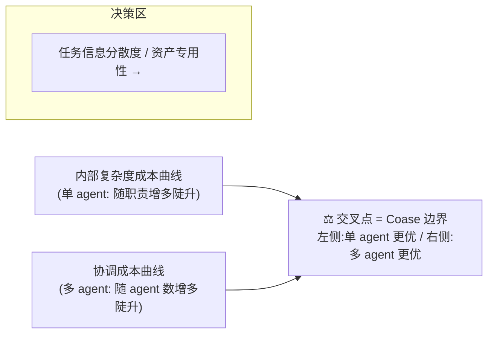

一个任务摆在你面前，你要决定让它跑在**一个 agent**里，还是**拆成多个 agent 协作**——这是 2026 年 AI PM 在选型会上被问得最多、也最容易凭"看起来很复杂就该拆"直觉拍脑袋的决策。本节点提供一个**可填表、可估算、可被反驳**的判据：把"拆不拆 agent"重铸为 Coase 1937 年那道老问题——**企业边界**。Coase 的回答是：当"在企业内部多组织一笔交易的成本 = 在市场上完成同等交易的成本"时，边界达到均衡。把"市场"换成"agent 之间的消息传递、context 同步、结果校验"，把"企业内部"换成"单个 agent 的上下文窗口与推理链"，你就有了一把比直觉硬十倍的尺子。本节点的视角名叫**交易成本判据（Transaction Cost Test）**。

> [!warning] 一句话反共识
> 拆 agent 的真正成本不是"多花的 token"，而是**协调成本（coordination cost）**——信息不对称、消息序列化/反序列化、跨 agent 校验、失败传播。90% 的 multi-agent 设计在这里栽：他们以为拆了能"分工提效"，实际是把一个连续推理链切断成几段，再花更多 token 把切口缝回去。

---

## §0 为什么是 Coase 边界，而不是"任务复杂度"框架

读者脑中默认的拆分框架通常是**"任务复杂度阈值论"**："任务越复杂，越该拆多 agent。" 这个框架是错的，必须先挡掉。

复杂度不是拆分的判据，**复杂度的归属位置**才是。一个高复杂度但**信息内聚**（所有所需上下文能同时装进一个推理链）的任务，单 agent 反而更优——因为拆开后每个子 agent 都得重新建立上下文，协调成本爆炸。反过来，一个低复杂度但**信息天然分散**（不同子任务依赖完全不同的知识源、工具权限、数据域）的任务，拆开反而省事。

Coase（1937，"The Nature of the Firm"，*Economica*，386–405；本节点关键引用经 WebFetch 核实）给的判据不是"复杂度"而是**比较成本**：

- **内部复杂度成本**（单 agent 路线）= 把所有职责塞进一个 agent 的上下文管理成本 + 推理负载 + 单点故障代价。Coase 称之为"组织内多组织一笔交易的递增成本"。
- **协调成本**（多 agent 路线）= agent 之间的搜寻、谈判（谁先做、谁有权调用工具）、执行监督、校验成本。这正是 Coase 所说的"利用价格机制的成本"，在 multi-agent 语境里就是 A2A 通信开销。

> [!note] 框架级辨析（挡掉默认错误）
> | 错误框架 | 判据 | 为什么误导 |
> |---|---|---|
> | 任务复杂度阈值论 | "复杂就拆" | 把"复杂度"和"信息分散度"混为一谈；高复杂度但内聚的任务拆了更糟 |
> | 拟人组织类比 | "像公司一样设角色分工" | 角色化≠自主性；给 agent 起名"研究员/审稿人"不改变协调成本结构 |
> | **Coase 边界（本节点）** | **内部复杂度成本 vs 协调成本，谁更低** | **唯一同时刻画两条路线代价、可被填表估算的判据** |

这把尺子和本专题 [R01 给 Multi-agent 加资源配额机制](/kb/专题-商业组织与采纳/r01-给-multi-agent-加资源配额机制/)（协议层"怎么拆"）正交：R01 解决"拆了之后通信怎么搭"，R02 解决"该不该拆"。**先用 R02 判断要不要拆，再用 R01 实现怎么拆。**

---

## §1 两条成本曲线：交易成本经济学的三大决定变量

Williamson（1932–2020，2009 年与 Elinor Ostrom 共获诺贝尔经济学奖；生卒与获奖年份经 WebFetch 核实 Wikipedia/UC Berkeley 新闻稿）把"何时内部化、何时外包"（make-or-buy）的判据具体化为**三个决定变量**。这三个变量直接映射到 agent 拆分决策：

| Williamson 变量 | 经济学原义 | Agent 决策映射 | 高值 → 倾向 |
|---|---|---|---|
| **资产专用性** (Asset Specificity) | 资产投入特定交易后在他处贬值的程度 | 子任务所需的专属上下文/工具权限/领域知识有多"不可共享" | 高 → **拆**（专用 agent 独占该资产，不污染主链） |
| **不确定性** (Uncertainty) | 未来情形不可预见，合约天然不完备 | 子任务输出的格式/质量是否可预先规约 | 高 → **不拆**（拆了校验成本爆炸，单链端到端更可控） |
| **频率** (Frequency) | 同类交易重复发生的次数 | 该子任务是否高频复用 | 高 → **拆**（一次性建专用 agent，多次摊销协调成本） |

> [!note] 致命耦合点
> 这三个变量**不能孤立看**。Williamson 的核心洞见是：**高资产专用性 + 高不确定性**同时出现时，会触发"套牢问题"（hold-up，Klein/Crawford/Alchian 1978，*Journal of Law & Economics*；年份与期刊经 WebSearch 核实）。映射到 agent：当一个子 agent 独占关键上下文（专用性高）且输出不可预先规约（不确定性高），主 agent 就被它"套牢"——主链无法绕过它、又无法验证它的输出对错，只能照单全收。这是 multi-agent 最隐蔽的失败模式。**遇到高专用性 + 高不确定性，宁可不拆，把它内部化进单 agent 的端到端推理链。**

把这三个变量画成两条曲线，就是 Coase 的均衡图（[示意]，非实测数据）：

---

## §2 交易成本估算框架：六项可填表的成本

抽象的"协调成本"必须可估算才有用。下面把它拆成**六项可观测、可打分的子成本**。每项按任务实际情况打 0–3 分（0=可忽略，3=极高），分别累加成"内部复杂度成本 I"与"协调成本 C"。

### 内部复杂度成本 I（单 agent 路线的代价）

| 子成本 | 含义 | 打分线索 |
|---|---|---|
| **I1 上下文压力** | 所有职责所需上下文是否撑爆窗口 | 接近/超过窗口 = 3；绰绰有余 = 0 |
| **I2 推理负载** | 单链是否要同时持有多个相互干扰的目标 | 目标互相打架（如"既要全面又要精简"）= 3 |
| **I3 单点故障代价** | 一步错是否会污染整条链且无法局部回滚 | 错误会级联且不可隔离 = 3 |

### 协调成本 C（多 agent 路线的代价）

| 子成本 | 含义 | 打分线索 | 接地 |
|---|---|---|---|
| **C1 通信开销** | 跨 agent 消息序列化/反序列化、context 重建 | 子任务需大量共享上下文 = 3 | RoundTable（arXiv:2411.07161，经 WebSearch 核实可解析）实测多 agent 通信退化：消息长度增加 84%，与前轮相似度升至 90% |
| **C2 信息不对称** | 各 agent 独立 context 窗口导致局部观察 | 子 agent 看不到全局必需信息 = 3 | "MAS Should be Treated as Principal-Agent Problems"（arXiv:2601.23211，经核实）：各 agent 独立上下文窗口是固有缺陷 |
| **C3 校验成本** | 主 agent 验证子 agent 输出对错的代价 | 输出对错难以快速判定 = 3 | MarketBench（arXiv:2604.23897，经核实）：LLM 对自身成功率严重误校准，自评是市场协调瓶颈 |
| **C4 仲裁/调度成本** | "谁先执行、谁有权调用昂贵工具"的决策开销 | 多 agent 争抢同一工具/配额 = 3 | 当前框架（AutoGen/CrewAI/LangGraph）均无跨 agent 配额与优先级仲裁原语（WebFetch 核实官方文档） |

**判据：** 若 **I 之和 > C 之和**，拆；若 **C ≥ I**，不拆。临界区（差值 ≤ 2）默认**不拆**——因为协调成本有大量隐性长尾（失败传播、调试难度），实践中系统性被低估。这与 0411 [A07 Multi-Agent Teams](/kb/专题-安全对齐与失败/a07-multi-agent-teams/) 的结论一致："必要性根本来源是上下文窗口装不下，而非单 agent 不够聪明"——即只有 **I1 上下文压力 = 3** 才是拆分的"硬"理由，其余多为"软"理由。

---

## §3 决策模板：一张能打印贴墙的表

把 §2 落成可直接用的工作表。下面是两个真实风格的填表样例（任务设定为示意，打分为框架演示，非实测）：

### 模板表

| | I1 上下文 | I2 推理 | I3 单点 | **I 合计** | C1 通信 | C2 信息不对称 | C3 校验 | C4 仲裁 | **C 合计** | 判据 |
|---|---|---|---|---|---|---|---|---|---|---|
| 任务 | 0–3 | 0–3 | 0–3 | Σ | 0–3 | 0–3 | 0–3 | 0–3 | Σ | I>C? |

### 样例 A：「读 50 个网页 → 综合成报告」

| | I1 | I2 | I3 | **I** | C1 | C2 | C3 | C4 | **C** | 判据 |
|---|---|---|---|---|---|---|---|---|---|---|
| 深度调研 | 3 | 2 | 2 | **7** | 1 | 1 | 1 | 1 | **4** | I>C → **拆** |

解读：50 个网页的原文塞不进单窗口（I1=3，硬理由），但各网页彼此独立、子 agent 各读一批无需共享上下文（C1/C2 低），综合阶段由主 agent 收口。这是**资产专用性低、信息天然分散**的典型，拆分（fan-out 子 agent）成立。对应 0411 [A06 Orchestrator 编排器](/kb/专题-安全对齐与失败/a06-orchestrator-编排器/) 的 map-reduce 模式。

### 样例 B：「根据用户模糊需求，写一个带状态的功能」

| | I1 | I2 | I3 | **I** | C1 | C2 | C3 | C4 | **C** | 判据 |
|---|---|---|---|---|---|---|---|---|---|---|
| 编码任务 | 1 | 2 | 2 | **5** | 3 | 3 | 3 | 1 | **10** | C>I → **不拆** |

解读：需求模糊（高不确定性）+ 代码各部分强耦合（拆给不同 agent 会丢上下文，C1=3、C2=3）+ 对错难快速判定（C3=3）。这正是 Williamson 的"高专用性 + 高不确定性 = 套牢"场景。结论与 0411 [E01 Coding Agent·Claude Code & Cursor](/kb/专题-安全对齐与失败/e01-coding-agent-claude-code-cursor/) 暗合，也呼应 2025 下半年业界"Claude Code 删除 default Task subagent"的收敛趋势（业界推测级证据，见 [E03 Multi-Agent 框架·AutoGen & CrewAI & DeerFlow](/kb/专题-安全对齐与失败/e03-multi-agent-框架-autogen-crewai-deerflow/)）。

> [!warning] 判断主轴：90% 的人在这里会搞错的 3 个点
>
> **错点 1：把"能拆"当成"该拆"。**
> 症状：看到任务有几个步骤，就给每步配一个 agent。为什么会错：步骤可分 ≠ 信息可分；连续推理链被切断后要花 C1+C2 把上下文缝回去。正确做法：只在 I1（上下文压力）=3 时才认真考虑拆。真实反例：RoundTable（arXiv:2411.07161）显示，多 agent 协作中通信退化使消息相似度升至 90%——agent 们在"重复缝合"而非"分工"。
>
> **错点 2：只算 token 账，不算协调账。**
> 症状：用"多 agent 总 token 更少"论证拆分合理。为什么会错：拆分省下的是 I（单链负载），但新增了 C1–C4，而 C3 校验成本和 C4 仲裁成本几乎从不被计入预算。正确做法：用 §2 六项表把 C 显式打分。真实反例：当前主流框架（AutoGen/CrewAI/LangGraph）连跨 agent token 预算原语都没有（WebFetch 核实），意味着 C4 在工程上根本无法被框架自动管控，全靠人工——这本身就是 C 极高的证据。
>
> **错点 3：忽视套牢问题，拆出一个不可验证的关键子 agent。**
> 症状：把核心判断（如"这段代码安全吗"）外包给一个专用 agent，主链照单全收。为什么会错：高专用性（只有它有该上下文）+ 高不确定性（输出对错难判）= 主链被套牢。正确做法：关键且不可验证的职责必须内部化进主链，或加 HITL 校验。真实反例：MarketBench（arXiv:2604.23897）证明 LLM 自评严重失准——子 agent 自报"我做对了"不可信，C3 校验成本被系统性低估。

---

## §4 产品 PM 视角补盲：拆 agent 不只是工程账

跳出工程 PM 视角，拆分决策还有三个"看走眼"点：

1. **用户心理模型成本（隐性 C5）。** 多 agent 系统对用户暴露的"延迟波动"与"中间态不可解释"会损伤信任。用户看到一个 agent 时有清晰的责任主体；看到多个 agent 互相甩锅时，归因困难。"Liability Issues in LLM Agentic Systems"（arXiv:2504.03255，经核实）专门论证了 agentic 系统的责任在委托链中"涌现"、难以归因——这是产品层的真实成本，不在 token 账里。

2. **商业模式与计价单位。** 若产品按"任务"计价而成本按"token"发生，多 agent 的协调开销会侵蚀毛利。Rick 在滴滴做 费用治理 时的核心经验可直接迁移：**成本发生方与计价方错配是治理的根源问题**。多 agent 的 C4 仲裁成本就是"昂贵工具的内部转移定价"问题——谁有权调用 GPT-class 模型、谁只能用小模型，本质是内部资源配额机制设计。

3. **合规与可审计性。** 单 agent 的决策链是一条可追溯的 trace；多 agent 的决策分散在多条 trace 里，监管/事故复盘时拼接困难。在受监管场景（金融、安全），这项成本可能直接否决拆分方案。

---

## §5 对手框架回应：交易成本判据自己会在哪失效

**接受 + 边界**，不做装饰性自我肯定。

**对手立场 1：Ghoshal & Moran（1996，"Bad for Practice: A Critique of the Transaction Cost Theory"，*Academy of Management Review*；标题与期刊经 WebSearch 核实）——交易成本理论是"同义反复"。**
他们的批评是：TCE 事后总能解释任何已观察到的组织形式（凡存在的都"节约了交易成本"，凡失败的都"算错了"），因而难以证伪。**接受**：本节点的六项打分表确实有事后合理化的风险——你可以调分数让结论符合你已有的偏好。**边界**：所以本框架的价值不在"算出唯一正确答案"，而在**强制你显式写下 C3 校验成本和 C4 仲裁成本**——这两项是直觉最容易漏掉的，把它们摆上桌就已经赢了一半。框架是"反偏见的检查清单"，不是"预言机"。

**对手立场 2：Granovetter（1985，"Economic Action and Social Structure: The Problem of Embeddedness"，*American Journal of Sociology*；经 WebSearch 核实）——交易成本框架忽略社会嵌入与信任。**
他批评 TCE 预设行为人只有机会主义，忽视信任与规范。**接受**：在 agent 语境里，这对应"同底模 agent 之间是否真有'机会主义'"的质疑——同一个 Claude 实例拆成多个 agent，它们不会"互相欺骗"，C2 信息不对称是技术性的（context 窗口隔离），不是博弈性的。**边界**：但这恰恰强化而非削弱本框架——既然 agent 间没有真实信任可依赖（不像人类组织能用关系降低协调成本），协调成本 C 就**更纯粹地是技术开销**，更应被冷静估算，而不能指望"团队默契"自动消化。

**对手立场 3（Rick 未读的对手框架）：「机制设计不够」(arXiv:2605.08426，"Mechanism Design Is Not Enough: Prosocial Agents for Cooperative AI"，Schölkopf 组，经核实）。**
该文基于**不完全合同理论**论证：当合同无法区分所有未来情境时，必然存在正的福利损失，任何现实机制都无法消除——解药是设计"亲社会"agent（把他人福利纳入自身效用）。**对本节点的逼问**：交易成本判据假设你能通过"设计好边界"消除协调损失，但不完全合同理论说**总有残余损失消不掉**。**回应边界**：这正是为什么 §2 临界区默认"不拆"——承认存在算不准的残余协调成本，于是在不确定时偏向保守（单 agent）。本框架不追求消除损失，只追求"别在明显该单 agent 时硬拆"。

> [!note] failure scenario 显式标注
> 本判据在以下场景失效：(a) **超长时程任务**（如运行数天的 agent），此时单 agent 的上下文压力 I1 会随时间累积，静态打分失真——需动态重估；(b) **异构工具权限硬隔离**场景，拆分是合规强制要求而非成本优化，判据被外部约束覆盖；(c) **同底模 vs 异底模**：判据隐含假设拆出的 agent 能力相近，若拆分是为了用"专用小模型省钱"，则要把 [m209 - 推理成本控制手册](/kb/工程化与落地架构/m209-推理成本控制手册/) 的分层成本账叠加进来，C 的估算逻辑要改。

---

## §6 跨域呼应：双边市场激励 ↔ agent 资源治理（Rick 一手经验迁移）

> [!note] 跨域调度：从滴滴双边市场到 agent 资源治理
> 本框架最容易被忽略的成本是 **C4 仲裁成本**——"谁先执行、谁有权调用昂贵工具"。这在经济学上不是"成本核算"问题，而是**机制设计**问题：如何设计规则，使每个 agent 的自利行为（都想抢占昂贵工具、都想优先执行）产出全局期望的结果。

Rick 在滴滴/99 做双边市场（司机-乘客撮合）的一手经验在此可直接迁移。双边市场的核心矛盾是：**司机想接高价单、平台想最大化整体成交**，两者激励不一致；解法不是命令式调度，而是**设计激励规则**（动态定价、派单权重）使司机的自利选择恰好逼近全局最优。这正是机制设计的"激励相容"（Incentive Compatibility，Hurwicz 1972 提出；经 WebFetch 核实）思想。

把这套迁移到 multi-agent：

| 滴滴双边市场 | Multi-Agent 资源治理 |
|---|---|
| 司机抢高价单（自利） | agent 抢占昂贵工具/大模型配额（自利） |
| 派单权重设计 | 工具调用优先级 / 配额分配机制 |
| 动态定价激励供给 | 边际成本定价（"边际效益=边际成本+延迟成本+风险成本"，arXiv:2605.01214 提出，经核实）抑制过度调用 |
| 激励相容 → 司机说真话报位置 | 激励相容 → agent 不虚报"我需要昂贵工具" |

这条迁移的尖锐推论：**当你在 §2 给 C4 打高分时，本质是在说"这个任务需要一套机制设计才能协调多 agent 对昂贵资源的争用"——而机制设计本身是一项重投入。** 如果一个任务的协调需要你下场设计配额机制，这强烈暗示**它不该拆**——直接用单 agent 把资源争用问题"内部化"消除掉，正是 Coase 企业边界理论的原意：企业之所以存在，就是为了用"权威"替代"市场议价"，省掉每笔交易都要重新谈判（设计机制）的成本。这与本专题 [R03 设计一个激励相容的 Agent 协作规则](/kb/专题-商业组织与采纳/r03-设计一个激励相容的-agent-协作规则/)（怎么设计机制）形成因果链：R02 告诉你"需要设计机制 = 信号该不拆"，只有当拆分不可避免时，才进入 R03 真正动手设计机制。

链入：0133博弈论、0133信息经济学、费用治理、0117社会学。

---

## §7 PM 决策启示：三类落地

- **面试怎么用：** 被问"什么时候用 multi-agent"，不要答"任务复杂时"——这是淘汰答案。答："我用交易成本判据：比较单 agent 的内部复杂度成本和多 agent 的协调成本（通信/信息不对称/校验/仲裁四项），只有上下文窗口装不下这个硬约束触发时才拆，临界区默认单 agent。" 再补一句套牢问题（高专用性+高不确定性=不拆），面试官会知道你读过 Williamson。
- **选型怎么用：** 选型会上拿出 §3 模板表当场填，把 C3 校验成本和 C4 仲裁成本逼到台面上——这两项是工程团队最爱忽略、产品最后买单的成本。用填表把"我觉得该拆"变成"分数显示 C>I，不该拆"。
- **复现怎么用：** 动手前先填表。若判据 = 拆，再去 [R01 给 Multi-agent 加资源配额机制](/kb/专题-商业组织与采纳/r01-给-multi-agent-加资源配额机制/) 搭通信、[R03 设计一个激励相容的 Agent 协作规则](/kb/专题-商业组织与采纳/r03-设计一个激励相容的-agent-协作规则/) 设机制；若判据 = 不拆，直接用单 agent + 长 reasoning + 工具集（2026 年 PM 选型默认，见 [E03 Multi-Agent 框架·AutoGen & CrewAI & DeerFlow](/kb/专题-安全对齐与失败/e03-multi-agent-框架-autogen-crewai-deerflow/)）。

---

## §8 与已有节点的关系（升级对照，不复述）

- **对 0411 [A07 Multi-Agent Teams](/kb/专题-安全对齐与失败/a07-multi-agent-teams/) 做"深化 + 操作化"**：A07 给出了"上下文窗口装不下才是拆分根本理由"这一概念判断，并提供三题判断真伪 multi-agent。本节点不复述这些结论，而是把"装不装得下"这个二元判断**升级为六项可打分的成本估算框架**，并补上 A07 未展开的"协调成本由哪几项构成、如何与内部复杂度成本权衡"。A07 回答"何时是真 multi-agent"，R02 回答"何时该拆"。
- **对 0420 控制论 VSM 做"对话"**：VSM（Viable System Model）从控制论角度论证"系统需要递归的自治子单元"——这看似支持拆分。本节点提供经济学的对冲视角：自治子单元的协调成本不是零，VSM 的"递归自治"在 agent 语境里要付 C1–C4 的代价。两者不矛盾：VSM 说"什么结构能存活"，TCE 说"这个结构值不值得这个协调成本"。
- **对 [m208 - AI 基础设施与中间件选型](/kb/工程化与落地架构/m208-ai-基础设施与中间件选型/) 做"判据前置"**：m208 §2.5.2 比较编排框架（怎么搭多 agent）。本节点是 m208 的**前置决策**：先用 R02 判断该不该上编排框架，再用 m208 选哪个框架。不复述 m208 的框架对比。
- **对 [m209 - 推理成本控制手册](/kb/工程化与落地架构/m209-推理成本控制手册/) 与 0413 成本专题做"显式升级对照"**：m209/0413 算的是**单 agent 内部的推理成本**（token、KV Cache、量化）。本节点把成本账**升一个抽象层**到"agent 间的协调成本"——这是 m209 完全没覆盖的维度。m209 帮你把单 agent 跑便宜；R02 帮你判断要不要为了"省单 agent 的钱"而拆出更贵的协调成本。两者叠加：拆分若为省钱，必须把 m209 的分层成本账（C 的失效边界 c）算进来。

---

## §9 关联节点

**核心（必读）：**
- [A07 Multi-Agent Teams](/kb/专题-安全对齐与失败/a07-multi-agent-teams/) — 本节点的概念上游（何时是真 multi-agent）
- [R01 给 Multi-agent 加资源配额机制](/kb/专题-商业组织与采纳/r01-给-multi-agent-加资源配额机制/) — 判据=拆之后的通信实现
- [R03 设计一个激励相容的 Agent 协作规则](/kb/专题-商业组织与采纳/r03-设计一个激励相容的-agent-协作规则/) — C4 仲裁成本的机制设计解
- [A06 Orchestrator 编排器](/kb/专题-安全对齐与失败/a06-orchestrator-编排器/) — map-reduce 拆分模式的实现
- 0133新制度经济学 — Coase/Williamson 的学科母体
- 费用治理 — Rick 一手经验：成本发生方与计价方错配

**延伸（可选）：**
- [E01 Coding Agent·Claude Code & Cursor](/kb/专题-安全对齐与失败/e01-coding-agent-claude-code-cursor/) — 样例 B（编码任务不拆）的实证
- [E03 Multi-Agent 框架·AutoGen & CrewAI & DeerFlow](/kb/专题-安全对齐与失败/e03-multi-agent-框架-autogen-crewai-deerflow/) — 2025 业界去化趋势
- [m208 - AI 基础设施与中间件选型](/kb/工程化与落地架构/m208-ai-基础设施与中间件选型/) — 拆之后的框架选型
- [m209 - 推理成本控制手册](/kb/工程化与落地架构/m209-推理成本控制手册/) — 单 agent 内部成本账
- 0133博弈论 — 机制设计与激励相容的数学基础
- 0133信息经济学 — 信息不对称（C2）的理论根
- 0117社会学 — Granovetter 嵌入性批评入口
- [Function Calling](/kb/基础知识库/function-calling/) — 工具调用（C4 仲裁的对象）
- [Agent](/kb/基础知识库/agent/) — 原子概念
- [AI PM 知识图谱·总索引](/kb/ai-pm-知识图谱/ai-pm-知识图谱-总索引/) — 全库总入口

---

## 修订日志

- **R1（2026-06-07）**：首稿。建立交易成本判据框架（Coase 边界 + Williamson 三变量 + 六项成本打分表 + 决策模板），落地判断主轴三错点、对手框架三回应（Ghoshal & Moran / Granovetter / 机制设计不够）、跨域呼应（滴滴双边市场→agent 资源治理）、与 A07/VSM/m208/m209/0413 的升级对照。待 R2 grounding pass 核验 arXiv 编号解析状态与 Coase/Williamson 关键事实。
