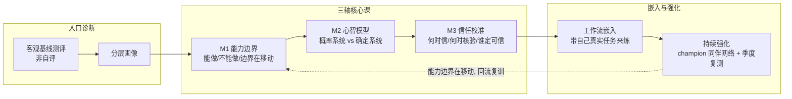

把 [A04 组织 AI Literacy 建设](/kb/专题-商业组织与采纳/a04-组织-ai-literacy-建设/) 里那套"literacy 是组织变革变量、不是 HR 科目"的判断，落成一份**今天就能开跑的课程设计**——这是本节要解决的问题。A04 论证了"为什么"，本节只管"怎么做、怎么验、在哪会翻车"：一个 PM（或 AI enablement lead）拿到这份设计，应该能在一周内拉出课程框架、两周内跑通第一个试点批次、并且**先验地知道这门课最可能死在哪**。本节的框架是「能力边界 → 心智模型 → 信任校准」三轴课程设计法，配可观测验收指标与一份反陷阱清单。⚠️本节是操作手册，不复述 A04 的概念论证（Long & Magerko / Ng / BCG 10-20-70 等事实基础以 A04 为准）。

## §0 为什么是「三轴课程」框架，而不是「分角色课表」框架

打开任何一份市面上的"企业 AI 培训方案"，默认结构几乎都是**按角色/职级切课**：高管课、管理者课、一线课、技术岗课。这个框架不是错，是**把次要维度当成了主轴**。角色差异确实存在（A04 §2 的三层缺口讲过），但它决定的是"教多深"，不决定"教什么"。

本节坚持的主轴是**三条能力轴，横切所有角色**：

| 轴 | 教什么 | 对应 Ng 六构念 | 防的失效 |
|---|---|---|---|
| **轴一 能力边界**（capability boundary） | AI 现在能做什么、不能做什么、边界在哪移动 | Recognize / Know & Understand | 误用（让 AI 做它做不了的）+ 误弃（不用它能做的）|
| **轴二 心智模型**（mental model） | AI 是个**概率系统**不是确定系统；它会自信地编造 | Use & Apply / Create | over-reliance：把生成当查证 |
| **轴三 信任校准**（trust calibration） | 何时该信、何时该核验、谁有权宣布"可信" | Evaluate / Navigate Ethically | 信任错配：该核验时盲信、该放手时抵触 |

为什么三轴优于分角色课表？因为**90% 的 literacy 灾难是轴的问题，不是角色的问题**。律师 over-reliance 引用编造判例（Mata v. Avianca, 2023，A04 §1）不是因为"律师课没上好"，是因为轴二（心智模型）和轴三（信任校准）全空。一个把三轴打透的一线员工，比一个只上过"高管 AI 战略课"却没建心智模型的 VP 更 literate。角色只是**给三轴调权重**：高管轴一权重高（战略边界），一线轴二/轴三权重高（日常误用面）。

> [!note] 这条选择本身就是判断：把"分角色"降为次维、把"三能力轴"升为主轴，是在赌——**误用率主要由心智模型缺陷驱动，而心智模型缺陷不分职级**。如果你的组织里误用集中在某一类岗位（如客服批量生成话术），那是轴的局部加权问题，不推翻三轴主干。

## §1 课程框架总图：三轴 × 三层 × 持续校准

三个结构性决定，每个都对应 A04 的一个判断主轴错点：

1. **入口必须是客观测评，不是自评**（对应 A04 错点二）。Zhang et al.（2026, arXiv:2601.06101，已 WebFetch 核实）证明自评与客观能力低相关、系统性高估。所以诊断用"给一段 AI 输出，让学员判断哪里不可信"这类**情境判断题**，测的是 Evaluate 能力，不是"你觉得你会不会用"。
2. **核心课顺序是边界→模型→校准，不可乱**。先建能力边界（知道地图轮廓），才谈得上心智模型（地图怎么画错），才谈得上信任校准（信任放在地图哪个位置）。跳过轴一直接教 prompt 技巧，是市面培训的通病——也是 A04 错点一"把 literacy 等同会用工具"的根源。
3. **结尾是回流，不是发证**（对应 A04 错点三"一次性培训"）。能力边界在快速移动（"AI 不会算数"2023 年成立、2024 年带工具调用就不成立），所以有一条回流箭头：季度复测 → 边界变了 → 回 M1 复训。这门课没有"毕业"。

## §2 模块逐一展开（含课时配比与产出物）

下表是可直接拷进项目计划的课程框架。课时是**示意配比**，按组织实际调整：

| 模块 | 核心内容 | 课时占比〔示意〕 | 教学法 | 学员产出物（可验收） |
|---|---|---|---|---|
| **M0 诊断** | 情境判断基线测评 + 误用风险自查 | 5% | 客观测评 | 个人/团队能力画像（弱轴定位）|
| **M1 能力边界** | 三类任务地图：AI 擅长/边界/不能；边界为何移动 | 20% | 案例对照 + 红队演示 | 一份"我岗位上的 AI 能/不能清单" |
| **M2 心智模型** | 概率系统 ≠ 确定系统；[幻觉](/kb/基础知识库/幻觉/)的不可消除性；为什么它会**自信地**错 | 25% | 翻车现场复盘 + 亲手触发幻觉 | 复述"AI 会在什么情况下骗我" |
| **M3 信任校准** | 信任分级：直接采用/抽检/逐条核验/禁用；谁有权宣布"可信" | 25% | 决策表演练 + 角色扮演 | 个人任务的信任分级表 |
| **M4 工作流嵌入** | 带自己**真实**任务来，现场把 AI 接进流程 | 20% | 工作坊（带真实任务）| 一条改造后的真实工作流 |
| **M5 强化** | champion 答疑机制 + 季度复测 + 误用案例库 | 5%（持续）| 同伴网络 | 加入 champion 网络/复测打卡 |

几个反直觉的设计要点：

- **M2 必须让学员亲手把模型搞坏**。读十页"AI 会幻觉"不如亲手让它一本正经编一个不存在的 API、引一篇不存在的论文。**体验过被骗，心智模型才校准**——这呼应 A04 §6 引入的 Polanyi 默会知识：「什么时候这个输出闻起来不对」是默会的，只能在实践中养，不能靠课件灌（见 [Polanyi 默会知识与提示工程的认识论张力](/kb/基础知识库/polanyi-默会知识与提示工程的认识论张力/)）。
- **M3 的信任分级是一张决策表，不是一句"要批判性思考"**。"批判性思考"是空话；可操作的是：

| 任务类型 | 错误后果 | 可自动验证？| 信任档位 |
|---|---|---|---|
| 头脑风暴/草稿 | 低（可逆）| 不需要 | 直接采用 |
| 代码/翻译 | 中 | 部分（测试/回译）| 抽检 + 自动验证 |
| 对外正式产物（合同/财报）| 高（不可逆）| 否 | 逐条人工核验 |
| 含机密数据的输入 | 合规风险 | —— | 禁用外部 AI |

  这张表与 [m207 - Agent 产品化：场景推演与失败模式](/kb/工程化与落地架构/m207-agent-产品化-场景推演与失败模式/) 的 HITL 断点三维度（可逆性/错误后果/置信度）和 [p307 - Copilot 到 Autopilot 光谱](/kb/产品设计与交互范式/p307-copilot-到-autopilot-光谱/) 的"按错误成本选自动化层级"是**同一套逻辑在三个不同抽象层的投影**：m207 是给 Agent 设断点，p307 是给产品选层级，本表是给**人**设信任档位。三者用同一组判据（可逆性/后果/可验证性），不复述，只标注这个同构关系本身就是给 PM 的杠杆——**学员学会的信任分级，正是他将来做产品 HITL 设计的直觉来源**。

- **M4 拒绝"演示任务"，只用学员自己的真实任务**。MIT NANDA《GenAI Divide》（2025，A04 §3）的核心发现是失败源于"学习机制缺失、系统集成不足、场景适配缺失"——用演示任务培训正是"场景适配缺失"的制度化。会用 ≠ 在用（A04 错点四），M4 就是强行把"会用"拽进"在用"。

## §3 判断主轴：培训设计中 90% 的人会搞错的四个点

> [!warning] 这一节是本节点的命门。每点带「症状 → 为什么会错 → 正确做法 → 真实反例」。注意这四点是**设计层**的错，区别于 A04 §3 的**认知层**错（A04 讲"literacy 是什么搞错了"，本节讲"课程怎么造搞错了"）。

### 错点一：先教 prompt 技巧，把最低阶的 Use & Apply 当课程开篇

- **症状**：第一节课就是"十个高效 prompt 模板""学会这些咒语效率翻倍"。
- **为什么会错**：prompt 技巧是 Ng 六构念里最低阶的 Use & Apply，且**半衰期最短**（模型一升级，去年的 prompt 技巧就过时）。把它放开篇，给学员植入的第一个心智模型是"AI 是个需要咒语的工具"——恰恰强化了 over-reliance（会念咒就以为能信结果）。
- **正确做法**：开篇是 M1 能力边界 + M2 心智模型。让学员**先知道这东西会骗人、边界在哪**，prompt 技巧放到 M4 工作流嵌入时按需补——那时它服务于真实任务，不是孤立的炫技。
- **真实反例**：大量企业 literacy 项目从"prompt engineering 工作坊"起步，结果学员热情高、误用率不降——因为教的是踩油门，没教刹车在哪。

### 错点二：用"覆盖率/完成率/满意度"当成功指标，测了参与没测校准

- **症状**：项目汇报 KPI 是"培训覆盖 95% 员工""完成率 90%""满意度 4.6"。
- **为什么会错**：这三个指标全是**参与度**指标，不是**校准度**指标。完成率只证明视频被播放（A04 错点二）；满意度甚至和有效性负相关——讲"AI 无所不能"的课满意度最高，却制造 over-reliance。McKinsey 观察"7 成受训者忽视 onboarding 视频"（A04 §3），完成率统计里这 7 成可能都计为"已完成"。
- **正确做法**：核心指标是**行为/客观指标**——见 §4。最硬的一条是 M0 基线 vs M5 复测的**客观情境判断分提升**，以及上线后的**误用事故率下降**。满意度只做辅助监测（防止难用到没人来）。
- **真实反例**：A04 §3 错点二的"完成率高、误用照旧"——这正是用错指标的直接产物。

### 错点三：指派"AI 大使"当 champion，按职级而非行为信号选人

- **症状**：每个部门"任命"一名 AI 大使，通常是经理或最闲的人。
- **为什么会错**：A04 §4 讲得很清楚——69% 员工靠同伴而非正式培训学 AI（Iternal.ai 综合引用，2026），但有效的 champion 是**按行为信号自然涌现**的（主动实验、公开提问、无提示分享），指派的 champion 往往是组织噪音。被任命的人若自己不是真用户，他的"答疑"会扩散错误心智模型。
- **正确做法**：champion 识别用**行为数据**——谁在内部社区高频提问/分享、谁的 AI 工具使用日志活跃、谁被同事自发求助。把这些人**轻度赋能**（给他们提前接触新工具、一个答疑荣誉），而不是给一线随便指一个。多层次布局（IT/安全层、运营层、高管层），单层 champion 跨不过中层"缺口 2"（A04 §2）。
- **真实反例**：很多"AI 大使计划"半年后名存实亡——因为大使是被分配的 KPI，不是被需求拉动的角色。

### 错点四：把课程当一次性交付，没有回流机制对冲能力边界漂移

- **症状**：上岗培训跑完、发证、归档，项目"结项"。
- **为什么会错**：这是 A04 错点三在设计层的对应——AI 能力边界每几个月移动一次，一次性培训锁死的是过期能力地图，对应 Lewin 模型"无法真正 refreeze"的缺陷（A03 讲过框架，本节不复述）。更隐蔽的是：**对边界漂移最危险的不是新手，是"老手"**——他们带着 2023 年的能力地图自信操作 2025 年的模型，最容易误用或误弃。
- **正确做法**：设计季度"边界更新简报"（5 分钟，只讲"上季度 AI 新会了什么、新出过什么事故")+ 半年客观复测。对应 ADKAR 的 R（Reinforcement）——最常被砍的一步（A04 §3）。复测分下滑触发回流复训。
- **真实反例**："AI 不会算数"型常识误判（A04 错点三）——抱旧地图的老员工要么让裸模型算账（误用）、要么明明能用却坚持手算（误弃）。

## §4 验收指标体系：怎么证明这门课真的有用

这是把 §3 错点二"测了参与没测校准"落地的解药。指标分三层，**禁止只汇报第一层**：

| 层级 | 指标 | 怎么测 | 警惕（Goodhart）|
|---|---|---|---|
| **参与层**（辅助）| 覆盖率、完成率、满意度 | LMS 日志 | 别当成功指标，只防"难用到没人来"|
| **校准层**（核心）| M0→M5 情境判断分提升、信任分级正确率 | 客观测评（情境题）| 题库要轮换，防背题 |
| **行为/结果层**（终极）| 误用事故率↓、AI 输出核验率↑、真实工作流嵌入数↑ | 事故台账、抽样审计、工作流盘点 | 核验率别冲太高（过度核验=under-reliance，见下）|

> [!warning] **指标自身的陷阱（Goodhart 防御）**：核验率不是越高越好。把核验率当 KPI 冲到 100%，等于训练出 under-reliance——员工对一切 AI 输出都逐条核验，AI 带来的效率全被吃掉，最终反弹成抵触。正确的目标是**校准的核验**：高风险任务核验率高、低风险任务敢放手。所以"信任分级正确率"才是比"核验率"更本质的指标——它测的是**该核验时核验、该放手时放手**的判断力，而不是单调的核验勤奋度。这与 [m207 - Agent 产品化：场景推演与失败模式](/kb/工程化与落地架构/m207-agent-产品化-场景推演与失败模式/) §2.4.5 评估体系对"人工介入率"的处理同源：介入率不是越低越好（那是 over-automation）、也不是越高越好（那是没自动化），而是要和任务风险匹配。

## §5 产品 PM 视角补盲：培训是兜底，产品内建才是上策

工程/HR 视角把 literacy 培训当终点；产品视角看，**最好的 literacy 培训是不需要培训**——把校准焊进产品交互（A04 §5）。PM 设计这门课时最容易看走眼的三点：

- **培训量 ∝ 产品的心智模型不友好程度**。如果你的 AI 产品没有置信度提示、没有来源引用、没有"建议人工核验"的触发，你就得用培训去补这个洞——培训预算其实是**产品债的利息**。PM 该问的是："这门课里有多少内容，是因为我们产品没把 literacy 内建？"那部分应该回流到产品 backlog，而不是无限扩课。
- **抵触的根源是失控感，不是无知**（A04 §5）。M3 信任校准课若只讲"怎么核验 AI"，不讲"AI 怎么改变你的工作、不会取代你"，会**制造而非缓解**抵触。课程要显式回应"这对我意味着什么"——这是 福格行为模型 的 Motivation 维度：没有动机，再多 Ability（会用）也不触发行为。培训设计常只投 Ability，不投 Motivation，是行为模型层面的设计缺陷。
- **合规正在把 literacy 变成交付物**。EU AI Act 第 4 条（已生效 2025-02-02，A04 §5）要求部署者确保员工具备"足够水平"的 AI 素养，按角色差异化。这意味着这门课的**课程档案、能力分层、复测记录**本身是合规审计材料——PM 做欧盟市场产品，得把培训设计成"可审计"的（留痕、分层、可证明），不是"办过就行"。

## §6 对手框架回应：培训本身的有效性质疑

**接受 + 边界**，不是反驳。本节给出一套培训设计，必须接住两个直击要害的反方。

**反方一：培训无效论（学界）。** Frontiers in Education（2025）多篇研究显示 AI literacy 干预对短期认知提升显著、但**持续行为改变缺乏纵向证据**；Ma & Lei（2024）发现 literacy 影响行为意愿，Yao & Wang（2024）同类研究该路径**不显著**——结论互相矛盾（A04 §6）。
> **接受**：是的，"上课→行为改变"的因果链证据薄弱。**边界**：但这恰恰是本节把"一次性课程"替换成"诊断+三轴+工作流嵌入+持续强化+回流"的理由——研究证伪的是"培训"这个单点干预，不是"持续校准系统"。本节的 M4（带真实任务）、M5（持续强化+复测）正是冲着"纵向行为改变"设计的。我赌的是：**带回流的校准系统**比"一次性课程"有显著更高的行为留存——这是个可被证伪的赌注（用 §4 的复测分纵向追踪就能验/证伪）。

**反方二：IBM「mindset > skillset」论。** IBM（2026-06, via Fortune）称 2030 年 67% 高管认为 mindset 比 skillset 更重要（A04 §6）。言下之意：与其设计技能课程，不如改造心态。
> **接受**：本节 M2/M3 本质就是改造心智模型/心态，不是堆技能，与 IBM 一致。**边界**：但"改造 mindset"若不落到**可观测的设计与指标**上，就是不可执行的鸡汤。本节的回应是：mindset 的可操作代理就是 §4 的"信任分级正确率"——它测的不是技能（会不会用工具），而是判断力（敢不敢放手、该不该核验），这正是 mindset 的可测投影。我拒绝用"我们在培养 AI 心态"这种不可证伪的话来汇报项目成效。

> [!note] **Rick 未读的对手框架引入（破 echo chamber）**
> **Argyris 单环/双环学习（Single-loop vs Double-loop Learning）**（Chris Argyris，《Teaching Smart People How to Learn》，*Harvard Business Review*, 1991-05；已 WebSearch 核实篇名/刊物/年份，HBR 原文 hbr.org/1991/05）。单环学习只在既定目标下改进行动（"怎么把 prompt 写得更好"），双环学习则质疑目标与假设本身（"我为什么觉得这个任务该交给 AI"）。对本课程的逼问是：市面 AI 培训 99% 是单环（教更好地用工具），而真正防误用的轴二/轴三是**双环**——它要学员质疑自己"AI 可信"这个底层假设。这从学习理论层面解释了为什么"prompt 工作坊"型培训（§3 错点一）无效：它停在单环，碰不到产生误用的双环假设。PM 启示：M2/M3 的教学法必须制造"假设被打脸"的体验（亲手触发幻觉、看自己的信任分级出错），这是双环学习的触发条件，光讲知识点触发不了。

## §7 跨域呼应：心智模型校准是一个认知科学问题

literacy 培训的核心标的——心智模型校准——本质不是 HR 问题，是**认知科学问题**。这是本节最重要的跨域接驳：直接调度 [_认知科学系统化专题·总览](/kb/专题-人文社科透镜/_认知科学系统化专题-总览/)（0426 认知科学专题）的成果。

- **概率系统 vs 确定系统的心智模型**（M2 的内核）正是 0426 专题 [A04 心智模型形成·概率系统 vs 确定系统](/kb/专题-人文社科透镜/a04-心智模型形成-概率系统-vs-确定系统/) 的主题。人脑默认用"确定系统"的心智模型去对待计算机（输入相同→输出相同），而 LLM 是概率系统（同输入可不同输出、会自信地错）。M2 课程要打破的，正是这个**根深蒂固的旧心智模型**——这不是"教新知识"，是"卸载旧直觉"，难度高一个量级。
- **自动化偏见与学习性无助**（[A06 自动化偏见与学习性无助](/kb/专题-人文社科透镜/a06-自动化偏见与学习性无助/)）解释了 over-reliance 的认知机制：人会系统性地过度信任自动化系统的输出（automation bias）。M3 信任校准课若不讲这个偏见，学员会以为"我只要保持警惕就行"——但 automation bias 是**无意识的认知默认**，靠意志力对抗不了，只能靠**结构化的信任分级表**（§2）外部化对冲。
- **锚定效应**（[A05 锚定效应与 AI 输出](/kb/专题-人文社科透镜/a05-锚定效应与-ai-输出/)）解释了为什么 AI 的初稿即使错也难纠正：第一个输出成了认知锚点。M4 工作流嵌入要显式提醒：让 AI 出多个版本、或先自己想再看 AI，对冲锚定。

更深一层，链 0117社会学 的 STS（科学技术学）视角（A04 §7 已展开）：信任分级表里"谁有权宣布 AI 可信"不是纯技术判定，而是组织权力的协商结果。所以 M3 的角色扮演要包含一个常被忽略的演练——**当一线员工和管理者对"这个输出可不可信"判断冲突时，按什么规则裁定**。literacy 培训若回避这个权力问题，教出来的"信任校准"在真实组织里会被层级压垮。

> [!note] 这就是本节点和 0426 认知科学专题的分工：0426 讲**认知机制为什么会失配**（描述性），本节讲**培训设计怎么对冲这些失配**（操作性）。读 M2/M3 卡在"为什么人会这样"，回 0426；读 0426 想"那我课该怎么设计"，回这里。

## §8 PM 决策启示

- **面试怎么用**：被问"怎么设计 AI 培训提升采纳"，别答"做几门课"。答："我不按角色切课，按三条能力轴——能力边界、心智模型、信任校准——横切设计，因为误用主要由心智模型缺陷驱动、不分职级。诊断用客观情境测评不用自评（自评不可信，Zhang 2026）；核心指标是'信任分级正确率'和'误用事故率'，不是完成率；champion 按行为信号识别不指派；课程带季度回流对冲能力边界漂移。最关键的判断是：培训量是产品 literacy 债的利息，能内建进产品交互的，不该靠开课补。"——30 秒展示你把培训当系统设计而非办活动。
- **选型怎么用**：评估外部 AI 培训供应商时，用 §3 四错点当反向尽调清单：(1) 开篇是 prompt 技巧还是能力边界？(2) 成功指标是完成率还是校准度？(3) champion 怎么选？(4) 有没有回流机制？四条全踩坑的供应商，卖的是"办过培训"的合规凭证，不是 literacy。
- **复现/落地怎么用**：直接拿 §2 的模块表起项目，用 §4 的三层指标建 dashboard。最小可行版本（MVP）：先只做 M0 诊断 + M2 心智模型 + M3 信任校准 三个模块跑一个高误用风险团队的试点，用 M0→复测的客观分提升验证设计，再规模化。别一上来铺全员——那是 §3 错点四"一次性大交付"的变体。

## §9 结尾陷阱：培训本身可能制造它要解决的问题

> [!danger] **本节最该警惕的陷阱：literacy 培训会系统性地制造它本要消除的 over-reliance。**

这是整份设计的反身性盲点，也是布置给读者的最后一道思考题：

**机制**：一门"教你用 AI"的课，传递的元信息（meta-message）是"公司认可、鼓励你用 AI"。学员上完课，对 AI 的信任会**整体上调**——而信任上调是**无差别的**，它同时调高了"该信的"和"不该信的"。除非课程的轴二/轴三足够硬，否则培训的净效应可能是**把 under-reliance（抵触、不用）的人推成 over-reliance（盲用）的人**，从一个失效方向滑到另一个对称的失效方向（A04 §1 的两个失效方向）。

**证据指向**：这正是为什么 §4 坚持"信任分级正确率"而非"使用率/采纳率"做核心指标——如果你用"采纳率上升"庆祝培训成功，你可能正在庆祝 over-reliance 的蔓延。采纳率和误用率可以同时上升。

**更深的反身性**：连这份课程设计本身也逃不过。它由 AI 协作生成（本专题工厂的产物），如果你不加批判地照搬，你就在对这份设计做 over-reliance——犯的正是它警告你别犯的错（呼应 [AI概念滥用反思](/kb/基础知识库/ai概念滥用反思/)：AI 生成内容须经批判性同行评议）。

**留给读者的陷阱题**：你怎么设计一门 literacy 课，使它在**整体上调信任**的同时，**优先上调高风险任务的核验意识**——也就是让信任的增量"长在该长的地方"？（提示：答案不在课程内容里，在 §4 的指标选择和 §2 的 M2"亲手触发幻觉"体验里——**先让人被骗一次，再给他工具，信任才会长成校准的形状，而不是膨胀的形状**。)

## §10 与已有节点的关系

- 对照 [A04 组织 AI Literacy 建设](/kb/专题-商业组织与采纳/a04-组织-ai-literacy-建设/)：A04 是本节的概念母体——它论证"literacy 是组织变革变量"（为什么），本节是它的**操作落地**（怎么做）。A04 §3 讲认知层四错点（literacy 是什么搞错了），本节 §3 讲设计层四错点（课程怎么造搞错了），两者一一映射但不复述。本节是 A04 在"05 复现指南"模块的实现。
- 对照 0426 认知科学专题（[A04 心智模型形成·概率系统 vs 确定系统](/kb/专题-人文社科透镜/a04-心智模型形成-概率系统-vs-确定系统/) / [A06 自动化偏见与学习性无助](/kb/专题-人文社科透镜/a06-自动化偏见与学习性无助/) / [A05 锚定效应与 AI 输出](/kb/专题-人文社科透镜/a05-锚定效应与-ai-输出/) / [R03 心智模型校准实验](/kb/专题-人文社科透镜/r03-心智模型校准实验/)）：0426 提供**认知机制的描述**，本节把这些机制翻译成**培训设计的对冲手段**——做的是"应用/迁移"而非复述。尤其 0426 的 R03 心智模型校准实验，可直接作为本节 M2 的实操教案来源。
- 对照 [m207 - Agent 产品化：场景推演与失败模式](/kb/工程化与落地架构/m207-agent-产品化-场景推演与失败模式/) / [p307 - Copilot 到 Autopilot 光谱](/kb/产品设计与交互范式/p307-copilot-到-autopilot-光谱/)：本节 §2 的信任分级表与二者的 HITL 断点/自动化分层是**同一套判据（可逆性/后果/可验证性）在"人"这一层的投影**。做的是把工程层的兜底逻辑迁移成人的信任训练——不复述断点设计，只标注同构关系是给 PM 的复用杠杆。

## §11 关联节点

**核心（必读）**
- [A04 组织 AI Literacy 建设](/kb/专题-商业组织与采纳/a04-组织-ai-literacy-建设/)——本节的概念母体（为什么）
- [A04 心智模型形成·概率系统 vs 确定系统](/kb/专题-人文社科透镜/a04-心智模型形成-概率系统-vs-确定系统/)——M2 的认知科学内核（0426 专题）
- [A06 自动化偏见与学习性无助](/kb/专题-人文社科透镜/a06-自动化偏见与学习性无助/)——over-reliance 的认知机制（0426 专题）
- [R03 心智模型校准实验](/kb/专题-人文社科透镜/r03-心智模型校准实验/)——可直接做 M2 教案（0426 专题）
- [m207 - Agent 产品化：场景推演与失败模式](/kb/工程化与落地架构/m207-agent-产品化-场景推演与失败模式/)——信任分级表的同构（HITL 断点）
- [p307 - Copilot 到 Autopilot 光谱](/kb/产品设计与交互范式/p307-copilot-到-autopilot-光谱/)——自动化越高、literacy 要求越高
- [幻觉](/kb/基础知识库/幻觉/)——M2 亲手触发的对象、心智模型核心攻击面

**延伸（可选）**
- [A05 锚定效应与 AI 输出](/kb/专题-人文社科透镜/a05-锚定效应与-ai-输出/)——M4 要对冲的偏差（0426 专题）
- [A06 Demo-to-Enterprise 鸿沟的组织维度](/kb/专题-商业组织与采纳/a06-demo-to-enterprise-鸿沟的组织维度/)——培训是跨鸿沟的人侧工程
- [Polanyi 默会知识与提示工程的认识论张力](/kb/基础知识库/polanyi-默会知识与提示工程的认识论张力/)——为什么 literacy 难显性传递
- 福格行为模型——培训缺的常是 Motivation 不是 Ability
- 0117社会学——信任分级背后的权力协商（STS）
- [AI概念滥用反思](/kb/基础知识库/ai概念滥用反思/)——§9 反身性陷阱的出处
- [AI PM 知识图谱·总索引](/kb/ai-pm-知识图谱/ai-pm-知识图谱-总索引/)——总入口

## 修订日志

- R1（2026-06-07）：首稿。建立「能力边界→心智模型→信任校准」三轴课程设计框架（区别于市面"分角色课表"）；给出可拷贝的模块表（M0–M5 + 课时配比 + 产出物）、信任分级决策表、三层验收指标体系（参与/校准/行为）；判断主轴设计层四错点（先教 prompt / 用完成率 / 指派 champion / 一次性交付），与 A04 认知层四错点一一映射不复述；接入培训无效论、IBM mindset 论两对手立场（接受+边界，含可证伪赌注）；引入 Argyris 单环/双环学习破 echo chamber；跨域呼应直接调度 0426 认知科学专题（概率系统心智模型/自动化偏见/锚定）+ STS 权力视角；§9 结尾陷阱写"培训反身性制造 over-reliance"含留给读者的设计题。链接已避开 A04 自身的死链（用真实名 [A01 技术采纳与组织变革概念谱系](/kb/专题-商业组织与采纳/a01-技术采纳与组织变革概念谱系/) 体系，未沿用 A04 起草期的 "A06 用户心智模型与 AI 信任校准" 误名）。grounding：Zhang et al. arXiv:2601.06101 沿用 A04 已核实结论；EU AI Act 第 4 条、BCG 10-20-70、MIT NANDA 等事实基础以 A04 为准（本节为操作层，不重复举证）。Argyris 1991 HBR《Teaching Smart People How to Learn》篇名/刊物/年份已 WebSearch 核实（HBR 1991-05，原文 hbr.org/1991/05）。剩余标注项：课时占比标〔示意〕非实证（设计建议，非数据）。
