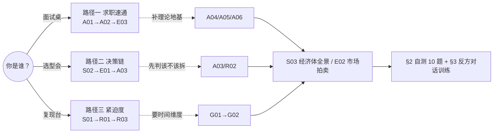

# README · 多视图阅读指南

> 这是 0421「机制设计系统化」专题的**操作台说明书**，不是又一页摘要。它解决一个问题：17 个互相双链的原子节点，**你这一次该从哪进、读到哪算够、读完怎么自证学会了**。专题主入口（含模块全景、升级对照、SABCD 自评）在 [_机制设计系统化专题·总览](/kb/专题-商业组织与采纳/_机制设计系统化专题-总览/)；本页只管「怎么读 + 怎么验收」。
>
> 一句话拿走：**不设机制的 multi-agent 不是协作，是公地悲剧的工程化复现。** 读完本专题，你在面试桌 / 选型会 / 复现台上能 30 秒说清「为什么我不把 multi-agent 当任务分配」。

---

## 0. 三个身份模式，三条路径（各标时长 + 前置 + 产出）

不要从 A01 线性读到 R03。按你**此刻的身份**选一条路径，每条都给「读多久 / 读之前要会什么 / 读完手里多出什么」。

### 路径一 · 求职速通（面试桌）—— 约 70 分钟

| 顺序 | 节点 | 时长 | 这一步拿到什么 |
|---|---|---|---|
| 1 | [A01 机制设计概念谱系与语义](/kb/专题-商业组织与采纳/a01-机制设计概念谱系与语义/) | 25 min | 机制设计 = 逆向博弈论（先定目标再反推规则）；Hurwicz/Maskin/Myerson「三道工序」答题模板（诊断激励→判可行性→求最优规则） |
| 2 | [A02 Multi-Agent 即机制设计问题](/kb/专题-商业组织与采纳/a02-multi-agent-即机制设计问题/) | 20 min | 反共识一句话：multi-agent 真问题不是「分工」是「激励」；公地悲剧框架 |
| 3 | ★[E03 滴滴双边市场与 Agent 资源治理类比剖解](/kb/专题-商业组织与采纳/e03-滴滴双边市场与-agent-资源治理类比剖解/) | 25 min | 「经济学 + 一手 + 边界」三合一答案：能迁移双边市场治理，但点破 agent 无真实效用函数这条裂缝 |

- **前置产出（读之前应已具备）**：知道什么是 [Agent](/kb/基础知识库/agent/)、[Function Calling](/kb/基础知识库/function-calling/)、orchestrator/worker 大致分工；最好已读过 0411 的 [A07 Multi-Agent Teams](/kb/专题-安全对齐与失败/a07-multi-agent-teams/)（本专题反复升级对照它）。
- **读完产出**：一段 60–90 秒、带一个经济学定理名 + 一个 arXiv 反例 + 一条自承边界的面试回答。试讲对象见下方 §3「反方对话训练」。
- **目标**：30 秒讲清「为什么我不把 multi-agent 当任务分配」。

### 路径二 · 决策链（选型会）—— 约 80 分钟

| 顺序 | 节点 | 时长 | 这一步拿到什么 |
|---|---|---|---|
| 1 | [S02 Agent 协作机制对照矩阵](/kb/专题-商业组织与采纳/s02-agent-协作机制对照矩阵/) | 30 min | 五机制（market/auction/voting/hierarchy/contract）× 四维（激励相容/通信成本/抗操纵/适用）矩阵 + 决策树，打印贴墙 |
| 2 | [E01 Multi-agent 框架的激励缺失剖解](/kb/专题-商业组织与采纳/e01-multi-agent-框架的激励缺失剖解/) | 25 min | AutoGen / CrewAI / LangGraph 的治理原语逐条核实（配额/调度/仲裁基本裸奔），把选型变成「我愿意手搓哪几层」 |
| 3 | [A03 交易成本与 Make-vs-Buy·何时拆 Agent](/kb/专题-商业组织与采纳/a03-交易成本与-make-vs-buy-何时拆-agent/) | 25 min | 拆不拆 agent 的 Williamson 不等式（协调成本 < 内部复杂度成本），两栏成本表否决「为拆而拆」 |

- **前置产出**：手上有一份待评估的 multi-agent 提案或框架；读过 [m208 - AI 基础设施与中间件选型](/kb/工程化与落地架构/m208-ai-基础设施与中间件选型/) 的框架工程维度（本专题在它之上加「治理原语完备度」这道隐藏验收项）。
- **读完产出**：一张能在会上用的「五机制 × 四维」对照表 + 一份「拆/不拆」两栏成本表，用机制层证据而非直觉否决「对等协作」提案。
- **目标**：把「画框框连箭头」的拓扑提案，逼回「先证明协调成本 < 复杂度成本」的成本题。

### 路径三 · 紧迫度（复现台）—— 约 90 分钟

| 顺序 | 节点 | 时长 | 这一步拿到什么 |
|---|---|---|---|
| 1 | ★[S01 Multi-Agent 激励结构分层剖面](/kb/专题-商业组织与采纳/s01-multi-agent-激励结构分层剖面/) | 35 min | 激励六层（目标对齐/配额/调度/仲裁/披露/责任）PM 清单 + 三条致命耦合（公地悲剧 / 不对称致仲裁失效 / 道德风险倒灌） |
| 2 | [R01 给 Multi-agent 加资源配额机制](/kb/专题-商业组织与采纳/r01-给-multi-agent-加资源配额机制/) | 30 min | 今晚能跑的配额 demo：全局 token 背压 + 分级降权，把超支从 100% 压到 0 |
| 3 | [R03 设计一个激励相容的 Agent 协作规则](/kb/专题-商业组织与采纳/r03-设计一个激励相容的-agent-协作规则/) | 25 min | 激励相容规则模板 + 钻空子测试（让「自利执行 = 全局期望」，再主动找漏洞） |

- **前置产出**：一个能跑起来的 multi-agent 雏形（哪怕 2 个 agent + 一个 orchestrator）；会读 trace / 看 token 账单。
- **读完产出**：先上线两条防线——「全局 token 背压」+「可追溯 trace」，它们防的是杀伤最大的两条耦合（配额×调度的公地悲剧、责任缺失×目标对齐的道德风险倒灌）。
- **目标**：今晚就把最致命的两条耦合堵上，而不是等烧穿预算后才补。

> [!note] 横切阅读（任何路径都可加挂）
> 想理解「为什么经典经济学定理在 LLM 上会失效、不能写成一代更比一代强的辉格史」，加读代际线 [G01 制度经济学到 Agent 经济学代际谱系](/kb/专题-商业组织与采纳/g01-制度经济学到-agent-经济学代际谱系/) → [G02 机制设计代际演化详解](/kb/专题-商业组织与采纳/g02-机制设计代际演化详解/)（约 40 min）。想把 MAS 整体当一个经济体（资源/激励/产权/仲裁/声誉五维）俯瞰，加读 [S03 Agent 经济体治理全景](/kb/专题-商业组织与采纳/s03-agent-经济体治理全景/)。想看拍卖/市场式分配为何多半是玩具，加读 [E02 Agent 市场与拍卖机制剖解](/kb/专题-商业组织与采纳/e02-agent-市场与拍卖机制剖解/)。概念地基补全：[A04 公共池塘资源治理·Agent 共享资源](/kb/专题-商业组织与采纳/a04-公共池塘资源治理-agent-共享资源/)、[A05 激励相容与规则设计](/kb/专题-商业组织与采纳/a05-激励相容与规则设计/)、[A06 信息不对称与委托代理](/kb/专题-商业组织与采纳/a06-信息不对称与委托代理/)、[R02 用交易成本判据决定拆不拆 Agent](/kb/专题-商业组织与采纳/r02-用交易成本判据决定拆不拆-agent/)。

---

## 1. 一张图：从哪进、往哪走

读完任意一条路径，**都到 §2、§3 做验收**——没自测过、没被反方追问过，不算读完。

---

## 2. 自测题（≥10 题，每题给「及格线 / 优秀线 / 反例」）

自测规则：先合上专题、自己答，再对照三档线。**「及格线」= 能复述框架；「优秀线」= 能带数字 / 定理 / 边界；「反例」= 你若这么答，说明还没读进去（直接返工对应节点）。**

### 第一组 · 概念辨析（A 模块）

**Q1. 机制设计和博弈论是什么关系？为什么这个区分对 multi-agent 是命门？**
- 及格线：说出「机制设计是博弈论的逆问题——博弈论给定规则求均衡，机制设计给定目标反推规则」。
- 优秀线：补「PM 的角色从『任务分配者/调度员』升级为『规则设计者』；分了工 ≠ 设了激励，单靠 prompt 喊话改不了均衡，得改 payoff 结构」。引出 2007 诺奖 Hurwicz/Maskin/Myerson。
- 反例：答「机制设计就是用博弈论分析 agent 互动」——方向反了，那是正向博弈论（描述失灵），不是设计预防失灵。见 [A01 机制设计概念谱系与语义](/kb/专题-商业组织与采纳/a01-机制设计概念谱系与语义/) §0。

**Q2. 「把任务分给 3 个 agent、画好 DAG、写完 prompt」做的是机制设计吗？**
- 及格线：不是；那是任务分配（task allocation），假设了「agent 听话」。
- 优秀线：指出 LLM agent 有独立上下文窗口（私有信息/「类型」）、会 scheming / hidden action，应被当作委托-代理问题处理（arXiv:2601.23211）。
- 反例：答「是，因为我设计了协作流程」——把「规定棋盘」误当「规定棋子为什么往你要的方向走」。见 [A02 Multi-Agent 即机制设计问题](/kb/专题-商业组织与采纳/a02-multi-agent-即机制设计问题/)、[A01 机制设计概念谱系与语义](/kb/专题-商业组织与采纳/a01-机制设计概念谱系与语义/) §4 错位一。

**Q3. 什么是激励相容（IC）？它在 multi-agent 里多了哪一层困难？**
- 及格线：IC = 每个参与者「如实/尽力」是其最优策略；让 agent「说真话」成为占优策略。
- 优秀线：区分 DSIC（无论别人怎么做说真话都最优）vs BIC；并指出 multi-agent 多一层——不只「让它没动机撒谎」，还得「让它有能力说真话」，因为 LLM 对自身成功率/token 消耗严重误校准（MarketBench，arXiv:2604.23897）。
- 反例：答「IC 就是让 agent 友好合作」——那是道德劝诫，不是机制。见 [A05 激励相容与规则设计](/kb/专题-商业组织与采纳/a05-激励相容与规则设计/)、[A01 机制设计概念谱系与语义](/kb/专题-商业组织与采纳/a01-机制设计概念谱系与语义/) §2.1。

### 第二组 · 架构与判断主轴（S 模块）

**Q4. 激励结构六层是哪六层？为什么是六层而不是更粗的分层？**
- 及格线：目标对齐 / 资源配额 / 优先级调度 / 冲突仲裁 / 信息披露 / 责任归属。
- 优秀线：说清「六件事可分别失效、分别设计、分别归因，是最小正交决策集」；粗分层会把耦合藏进同一层内部（最常见是把『配额』和『调度』混成『资源管理』，于是公地悲剧无从诊断）。
- 反例：把它当成 0411 [S01 Agent 六层架构剖面](/kb/专题-安全对齐与失败/s01-agent-六层架构剖面/)（模型/记忆/工具/规划/执行/反思）的 multi-agent 版——两者正交：那是「能力剖面」，本专题是「激励剖面」。见 [S01 Multi-Agent 激励结构分层剖面](/kb/专题-商业组织与采纳/s01-multi-agent-激励结构分层剖面/) §0。

**Q5. multi-agent 最杀人的失效不在节点而在「边」。说出至少一条致命耦合及其四件套。**
- 及格线：说出「配额层 × 调度层 = 公地悲剧」——per-agent 配额做了、调度没全局背压，每个 agent 各自理性、加总烧穿共享池。
- 优秀线：给「症状→为什么错→正确做法→真实反例」四件套（正确做法 = 全局背压 + Ostrom 分级制裁，把无管理公地变有治理公地；反例 = CrewAI 无限循环烧 token 是已知痛点）；并能再举一条（信息×仲裁致仲裁失效，或责任缺失×目标对齐致道德风险倒灌）。
- 反例：只会说「token 会超支，加个 max_tokens 就行」——那是单 agent LLM 层补丁，治不了跨 agent 的耦合边。见 [S01 Multi-Agent 激励结构分层剖面](/kb/专题-商业组织与采纳/s01-multi-agent-激励结构分层剖面/)「判断主轴」。

**Q6. 评估一个 multi-agent 框架的治理能力，你查哪几件事？**
- 及格线：查有没有跨 agent 全局预算、优先级调度、冲突仲裁。
- 优秀线：四件事——(1) 跨 agent 全局预算（不是单 agent token 截断）；(2) 配额是事前预扣（管家）还是事后熔断（裁判）；(3) 优先级调度防不防低优 agent 饿死安全检查；(4) self-report 还是客观信号做分配。结论：AutoGen/CrewAI/LangGraph 这四项基本缺失，治理须外挂。
- 反例：比 feature list（支持几种 agent、有没有可视化）——没比到激励层。见 [S02 Agent 协作机制对照矩阵](/kb/专题-商业组织与采纳/s02-agent-协作机制对照矩阵/)、[E01 Multi-agent 框架的激励缺失剖解](/kb/专题-商业组织与采纳/e01-multi-agent-框架的激励缺失剖解/)。

### 第三组 · 不可能性边界与代际（含 B/C 维）

**Q7. 为什么 PM 不该向上承诺「multi-agent 实现最优资源调度」？**
- 及格线：因为有不可能定理画了天花板——不是工程没做好，是信息结构的根本约束。
- 优秀线：点名 Myerson-Satterthwaite（1983）——双边私有估值下，效率/激励相容/个体理性/预算平衡四者不可兼得；薄市场（单供给/单任务委派）的效率损失是结构性的。正确承诺是「在约束下尽量好 + 已知失效边界」。
- 反例：答「调好参数就能最优」——反定理的 hype。见 [A01 机制设计概念谱系与语义](/kb/专题-商业组织与采纳/a01-机制设计概念谱系与语义/) §6、[S01 Multi-Agent 激励结构分层剖面](/kb/专题-商业组织与采纳/s01-multi-agent-激励结构分层剖面/) 披露层、[E03 滴滴双边市场与 Agent 资源治理类比剖解](/kb/专题-商业组织与采纳/e03-滴滴双边市场与-agent-资源治理类比剖解/) 坑 4。

**Q8. 代际演化为什么不能写成「一代更比一代强」？举一个被打脸的乐观叙事。**
- 及格线：因为那是辉格史；每代都有未被证伪的反例与遗留债务。
- 优秀线：举出至少一个——如「透明化 = 更好」直觉被 Diagon（arXiv:2604.06688）反例砍除（身份透明反而降低市场绩效），或「agent 是程序、可假设完全理性」被 LLM miscalibration（MarketBench）+ 通信退化（RoundTable，相似度升至 90%）证伪。
- 反例：答「从科斯到 LLM-agent 是机制设计不断完善的进步史」——正中辉格史陷阱。见 [G01 制度经济学到 Agent 经济学代际谱系](/kb/专题-商业组织与采纳/g01-制度经济学到-agent-经济学代际谱系/)、[G02 机制设计代际演化详解](/kb/专题-商业组织与采纳/g02-机制设计代际演化详解/)。

### 第四组 · 一手迁移与复现（E/R 模块）

**Q9. Rick 的双边市场治理经验，哪些能迁移到 agent、哪条边界会让一半直觉失效？**
- 及格线：派单≈任务分配、优先派单权≈昂贵工具准入、透明化≈context 治理可迁移；边界 = agent 没有真实效用函数。
- 优秀线：说清三个失效——补贴越多供给越积极 → 对 agent 是 reward hacking / Goodhart；司机因长期收益自约束 → agent 单次推理无折现/无声誉记忆；补贴博弈收敛到供需均衡 → agent 无真实偏好，可能收敛到退化解。正确姿势 = 迁移激励的「约束逻辑」，但效用锚换成可验证外生指标（orchestrator 侧客观账本），从「市场」退回「治理」。
- 反例：答「双边市场补贴可以照搬，给 agent 发奖励让它们竞价」——正踩 E03 坑 1 + 坑 3。见 [E03 滴滴双边市场与 Agent 资源治理类比剖解](/kb/专题-商业组织与采纳/e03-滴滴双边市场与-agent-资源治理类比剖解/) §4/§5。

**Q10. 「从裁判到管家」的治理哲学切换，落到 agent 资源治理是什么？**
- 及格线：裁判 = 事后判责/超支后熔断；管家 = 事前介入/调用前预算预扣。
- 优秀线：对应 降发生方法论（海恩法则：治隐患胜过治事故）；工程落地 = 事务性配额（token 须在 LLM 调用前记录，Stevens 2025 缺失原语第一条），别等烧爆再罚。
- 反例：答「加更严的事后告警」——还在裁判模式里打转。见 [E03 滴滴双边市场与 Agent 资源治理类比剖解](/kb/专题-商业组织与采纳/e03-滴滴双边市场与-agent-资源治理类比剖解/) §6、[R01 给 Multi-agent 加资源配额机制](/kb/专题-商业组织与采纳/r01-给-multi-agent-加资源配额机制/)。

**Q11.（拔高题）什么时候**不该**上这套六层机制设计？至少说两个 failure scenario。**
- 及格线：小规模/短任务（2–3 agent、几轮结束），治理开销 > 收益，退回单 agent。
- 优秀线：再举——同底模 agent（无真异质私有信息，「信息不对称」前提部分失效，披露层收益打折）；不完全合同区（arXiv:2605.08426，无论机制多好都有消不掉的福利损失，别承诺「治理到位就无损」）。
- 反例：答「机制设计永远值得做」——没读懂本专题最前面那条赌注与边界。见 [S01 Multi-Agent 激励结构分层剖面](/kb/专题-商业组织与采纳/s01-multi-agent-激励结构分层剖面/) failure 标注、[A03 交易成本与 Make-vs-Buy·何时拆 Agent](/kb/专题-商业组织与采纳/a03-交易成本与-make-vs-buy-何时拆-agent/) §5。

**Q12.（拔高题）拆不拆 agent，用什么不等式判？这个判据的已知软肋是什么？**
- 及格线：拆 multi-agent 当且仅当「协调成本 < 内部复杂度成本」（Williamson make-or-buy）。
- 优秀线：补三变量映射——有限理性（窗口装不下，是唯一无争议的「拆」理由）/ 机会主义（拆得越多监督税越重）/ 资产专用性（越高越该内化，记忆/核心推理别外包）；软肋 = TCE 的「测量难题」与「同义反复」批评，正确用法是事前写两栏成本表、用 token/延迟/返工率把不等式逼成可证伪的下注。
- 反例：答「拆得越细越模块化越好」——只算了复杂度下降，没算协调成本，正踩 A03 错位一。见 [A03 交易成本与 Make-vs-Buy·何时拆 Agent](/kb/专题-商业组织与采纳/a03-交易成本与-make-vs-buy-何时拆-agent/)、[R02 用交易成本判据决定拆不拆 Agent](/kb/专题-商业组织与采纳/r02-用交易成本判据决定拆不拆-agent/)。

> [!note] 自测评分
> 12 题里答到「及格线」≥9 题 = 读懂了框架，可以去面试；答到「优秀线」≥7 题（每题带得出定理名 / 数字 / 边界）= 达到本专题想要的「判断密度」，可以上选型会和复现台。任何一题落到「反例」档，回对应节点重读那一节，别囫囵过。

---

## 3. 反方对话训练（机制设计领域 6 追问）

面试官 / 选型会上的工程师 / 你自己心里的杠精，都会这么打你。**对每个追问，先「接受它对的部分」，再「标自己坚持的边界」**——这是本专题 E 维（对手拷问能力）的核心工艺，不是反驳，是用反对的声音建造。下面每条给「反方怎么打 / 弱答（会被继续追） / 强答（接受+边界+证据）」。

### 追问 1：「agent 又没有效用函数，谈什么机制设计？」

- **反方逻辑**：机制设计假设理性自利、有连续偏好的参与者；LLM 没有钱包、没有内生偏好，整套经济学用不上。
- **弱答**：「agent 也有目标啊，prompt 里写了。」——会被追：那是你写的，不是它内生的，它优化的是奖励信号字面（reward hacking）。
- **强答**：接受——这正是本专题反复刻的边界，agent 无真实效用函数会让拍卖/补贴这类靠参与者自利的机制系统性失效（MarketBench 证 self-report 失准）。但机制设计在这里的价值**不在直接套用某个机制，而在两件事**：(1) 提供**诊断语言**——「激励相容」仍是判断「我能不能信它的自报」的正确提问；(2) 提供**不可能性边界**——Myerson-Satterthwaite 告诉你哪些目标在当前信息结构下根本不可达。正确做法是把效用锚从「agent 自报」换成「orchestrator 侧可验证的外生指标」，从「市场」退回「治理」。（见 [E03 滴滴双边市场与 Agent 资源治理类比剖解](/kb/专题-商业组织与采纳/e03-滴滴双边市场与-agent-资源治理类比剖解/) §4、[A01 机制设计概念谱系与语义](/kb/专题-商业组织与采纳/a01-机制设计概念谱系与语义/) §6 对手一）

### 追问 2：「多 agent 加规则不就慢了、贵了吗？」

- **反方逻辑**：你这六层治理是额外开销——加配额、加仲裁、加 trace，每一层都是延迟和 token，得不偿失。
- **弱答**：「治理是必要的成本。」——空话，会被追：那到底什么时候值、什么时候不值？
- **强答**：接受——六层机制设计**本身有成本**，这正是本专题自承的最大盲点（Williamson 提醒：设计这六层的开销可能比不拆还贵）。所以本专题给的不是「永远要治理」，而是**判据**：小规模/短任务（2–3 agent、几轮结束）治理开销 > 收益，应退回单 agent；只有当「协调成本 < 内部复杂度成本」时才拆、才上治理。换句话说，「慢了贵了」恰恰是 A03 的 make-or-buy 两栏成本表要逼你算清的——把延迟/token 写进右栏，没有右栏的提案一律打回。（见 [A03 交易成本与 Make-vs-Buy·何时拆 Agent](/kb/专题-商业组织与采纳/a03-交易成本与-make-vs-buy-何时拆-agent/) §5、[S01 Multi-Agent 激励结构分层剖面](/kb/专题-商业组织与采纳/s01-multi-agent-激励结构分层剖面/) failure scenario）

### 追问 3：「Ostrom 是治人的，怎么治 agent？」

- **反方逻辑**：Ostrom 公共池塘自治八原则的前提是人——长期声誉、可重复博弈、社会嵌入；agent 单次推理啥都没有，硬套是空 invocation。
- **弱答**：「Ostrom 八原则可以映射过来。」——会被追：哪几条能映射、哪几条因为缺前提失效？
- **强答**：接受——Ostrom 自治的前提（长期声誉/重复博弈/社会嵌入）agent 确实大面积不满足，所以本专题**不把它当万能解，而是分条裁剪**：第 1 条「清晰界定边界」+ 第 5 条「分级制裁」可直接迁移为 per-agent token 边界 + 超额分级降权（这是工程可落地的）；但「自治治理」整体在 agent 上缺前提——agent 无折现、无声誉记忆，大规模 fleet 恰是大规模公地，连 Ostrom 自己都承认规模问题（Araral 2014）。而且公地悲剧本就只发生在「**无管理**的公地」（哈丁本人后来也承认这一限定），所以正确姿势是「有治理的公地」（全局背压 + 分级制裁），而不是指望 agent 自治。（见 [A04 公共池塘资源治理·Agent 共享资源](/kb/专题-商业组织与采纳/a04-公共池塘资源治理-agent-共享资源/)、[E03 滴滴双边市场与 Agent 资源治理类比剖解](/kb/专题-商业组织与采纳/e03-滴滴双边市场与-agent-资源治理类比剖解/) §7 对手二、[S01 Multi-Agent 激励结构分层剖面](/kb/专题-商业组织与采纳/s01-multi-agent-激励结构分层剖面/) §2 致命耦合 1）

### 追问 4：「拆不拆 agent，凭经验就行，要这套理论干嘛？」

- **反方逻辑**：老工程师凭手感就知道该不该拆，Williamson 不等式是事后包装。
- **弱答**：「理论更严谨。」——会被追：严谨在哪？能给个数吗？
- **强答**：接受——TCE 确实背着「同义反复」批评（Ghoshal & Moran 1996：存在的组织形式事后都能被说成「节约了交易成本」），凭经验在熟悉场景里也常对。但本专题坚持的用法是**事前预测**而非事后辩护：在拆分前就写两栏账（左栏=拆分省下的内部复杂度，右栏=新增的协调/监督/延迟/token 成本），并且 agent 世界的交易成本**比经济学原版好测得多**（token 消耗、轮次数、延迟毫秒、返工率都可直接计量）。这把「凭经验」逼成「可被运行数据证伪的下注」——经验在没见过的新任务、模型升级后边界移动时会失灵，不等式不会。（见 [A03 交易成本与 Make-vs-Buy·何时拆 Agent](/kb/专题-商业组织与采纳/a03-交易成本与-make-vs-buy-何时拆-agent/) §5 对手框架回应、§6 科斯定理「边界由相对成本决定，且是移动的」）

### 追问 5：「信息不对称？让所有 agent 共享 context 全透明不就解决了？」

- **反方逻辑**：你说 agent 各持私有上下文是问题，那全透明、互相可见，问题不就没了。
- **弱答**：「对，应该尽量共享。」——直接踩反例坑。
- **强答**：接受——透明提升信任与协调，这在双边市场（异质独立主体）被反复验证，也是 Rick 做乘客信息透明化的核心假设。但边界被业界实验直接证伪：Diagon（arXiv:2604.06688）显示身份透明等「改善」反而降低市场绩效；RoundTable（arXiv:2411.07161）显示通信退化（消息长度增 84%、轮次相似度升至 90%）。原因——乘客是真异质主体，透明化是约束机会主义；同底模 agent 本就高度同源，全透明只是加速共识坍缩、回声室化，损失纠错多样性。正确做法是**分层透明**：对客观资源消耗（token/调用次数）强透明，对 agent 的观点/中间推理有意隔离保留独立性。（见 [E03 滴滴双边市场与 Agent 资源治理类比剖解](/kb/专题-商业组织与采纳/e03-滴滴双边市场与-agent-资源治理类比剖解/) §3、[A06 信息不对称与委托代理](/kb/专题-商业组织与采纳/a06-信息不对称与委托代理/)）

### 追问 6：「这套机制治得了 agent 吗？过了某条线是不是只能靠 alignment？」（B. C. Smith 之问，最难的一问）

- **反方逻辑**：机制假设规则可替代判断；当情境超出设计者预见，需要的是判断而非计算——机制设计有能力上界，过线就是 alignment 的事，不是 mechanism 的事。
- **弱答**：「机制设计能解决所有协调问题。」——一票否决式的自信幻觉。
- **强答**：接受——这是本专题主动引入的 Rick 未读对手框架，且与不完全合同理论（arXiv:2605.08426《Mechanism Design Is Not Enough》）同向：合约写不尽所有未来情境，必有正的福利损失，纯机制有理论天花板，需「亲社会 agent」（把他人福利纳入自身效用）补充。本专题的立场不是「机制设计万能」，而是**「先把六层机制设计这个可工程化的下界压实，亲社会/alignment 作为长期对冲」**——机制治理可观测、可证伪的那部分（配额、优先级、责任 trace 的真实代价），过线后承认是信息结构与判断的根本约束，「不是你的锅」。这恰恰是 C 维（认识论自觉）和 B 维（边界含量）：知道自己治到哪条线，比假装无所不治值钱。（见 [G02 机制设计代际演化详解](/kb/专题-商业组织与采纳/g02-机制设计代际演化详解/) §9、[A05 激励相容与规则设计](/kb/专题-商业组织与采纳/a05-激励相容与规则设计/)、[_机制设计系统化专题·总览](/kb/专题-商业组织与采纳/_机制设计系统化专题-总览/) §6 末「Rick 未读框架」）

> [!warning] 反方训练的元规则
> 六个追问没有一个该用「反驳」回应。**全部走「接受它对的部分 → 标本专题坚持的边界 → 给可追溯证据」三段式**。如果你发现自己在「证明对方错」，停下来——那说明你在用赞同的声音装饰，而不是用反对的声音建造。面试官真正在测的，是你有没有「承担边界」的认识论诚实。

---

## 4. 读完之后：把它接回你的图谱

- 专题主入口 / 模块全景 / SABCD 自评 / 升级对照表：[_机制设计系统化专题·总览](/kb/专题-商业组织与采纳/_机制设计系统化专题-总览/)
- 它升级了哪些旧节点（读完该回头重看一遍，体会「升了什么」）：0411 的 [A07 Multi-Agent Teams](/kb/专题-安全对齐与失败/a07-multi-agent-teams/) / [A06 Orchestrator 编排器](/kb/专题-安全对齐与失败/a06-orchestrator-编排器/) / [E03 Multi-Agent 框架·AutoGen & CrewAI & DeerFlow](/kb/专题-安全对齐与失败/e03-multi-agent-框架-autogen-crewai-deerflow/)；0402 的 [m208 - AI 基础设施与中间件选型](/kb/工程化与落地架构/m208-ai-基础设施与中间件选型/) / [m209 - 推理成本控制手册](/kb/工程化与落地架构/m209-推理成本控制手册/)。
- 经济学地基（想往下挖根）：0133博弈论 · 0133信息经济学 · 0133新制度经济学 · 0134复杂经济学。
- Rick 一手迁移源（看「治理直觉从哪来」）：费用治理 · 纠纷治理从裁判到管家 · 降发生方法论 · 乘客信息透明化 · CPF实名验证 · PAX-Premium实名徽章 · 明镜系统。
- 批判性接收的总锚：[AI概念滥用反思](/kb/基础知识库/ai概念滥用反思/)（multi-agent「互相 review 提升完成率」式销售话术，请按本专题的机制视角拆穿）。
- 全库总入口：[AI PM 知识图谱·总索引](/kb/ai-pm-知识图谱/ai-pm-知识图谱-总索引/)。

---

## 5. 关联节点（双链密度 ≥20）

**本专题 17 节点（全图，按模块）**
- 概念辨析：[A01 机制设计概念谱系与语义](/kb/专题-商业组织与采纳/a01-机制设计概念谱系与语义/) · [A02 Multi-Agent 即机制设计问题](/kb/专题-商业组织与采纳/a02-multi-agent-即机制设计问题/) · [A03 交易成本与 Make-vs-Buy·何时拆 Agent](/kb/专题-商业组织与采纳/a03-交易成本与-make-vs-buy-何时拆-agent/) · [A04 公共池塘资源治理·Agent 共享资源](/kb/专题-商业组织与采纳/a04-公共池塘资源治理-agent-共享资源/) · [A05 激励相容与规则设计](/kb/专题-商业组织与采纳/a05-激励相容与规则设计/) · [A06 信息不对称与委托代理](/kb/专题-商业组织与采纳/a06-信息不对称与委托代理/)
- 代际演化：[G01 制度经济学到 Agent 经济学代际谱系](/kb/专题-商业组织与采纳/g01-制度经济学到-agent-经济学代际谱系/) · [G02 机制设计代际演化详解](/kb/专题-商业组织与采纳/g02-机制设计代际演化详解/)
- 架构剖面：[S01 Multi-Agent 激励结构分层剖面](/kb/专题-商业组织与采纳/s01-multi-agent-激励结构分层剖面/) · [S02 Agent 协作机制对照矩阵](/kb/专题-商业组织与采纳/s02-agent-协作机制对照矩阵/) · [S03 Agent 经济体治理全景](/kb/专题-商业组织与采纳/s03-agent-经济体治理全景/)
- 实例剖解：[E01 Multi-agent 框架的激励缺失剖解](/kb/专题-商业组织与采纳/e01-multi-agent-框架的激励缺失剖解/) · [E02 Agent 市场与拍卖机制剖解](/kb/专题-商业组织与采纳/e02-agent-市场与拍卖机制剖解/) · [E03 滴滴双边市场与 Agent 资源治理类比剖解](/kb/专题-商业组织与采纳/e03-滴滴双边市场与-agent-资源治理类比剖解/)
- 复现指南：[R01 给 Multi-agent 加资源配额机制](/kb/专题-商业组织与采纳/r01-给-multi-agent-加资源配额机制/) · [R02 用交易成本判据决定拆不拆 Agent](/kb/专题-商业组织与采纳/r02-用交易成本判据决定拆不拆-agent/) · [R03 设计一个激励相容的 Agent 协作规则](/kb/专题-商业组织与采纳/r03-设计一个激励相容的-agent-协作规则/)
- 阅读编织：[_机制设计系统化专题·总览](/kb/专题-商业组织与采纳/_机制设计系统化专题-总览/)

**跨专题升级对照（0411 / 0402）**
- [A07 Multi-Agent Teams](/kb/专题-安全对齐与失败/a07-multi-agent-teams/) · [A06 Orchestrator 编排器](/kb/专题-安全对齐与失败/a06-orchestrator-编排器/) · [E03 Multi-Agent 框架·AutoGen & CrewAI & DeerFlow](/kb/专题-安全对齐与失败/e03-multi-agent-框架-autogen-crewai-deerflow/) · [m208 - AI 基础设施与中间件选型](/kb/工程化与落地架构/m208-ai-基础设施与中间件选型/) · [m209 - 推理成本控制手册](/kb/工程化与落地架构/m209-推理成本控制手册/)

**经济学地基 + Rick 治理一手 + 原子/入口**
- 0133博弈论 · 0133信息经济学 · 0133新制度经济学 · 0134复杂经济学
- 费用治理 · 纠纷治理从裁判到管家 · 降发生方法论 · 乘客信息透明化 · CPF实名验证 · PAX-Premium实名徽章 · 明镜系统
- [Agent](/kb/基础知识库/agent/) · [Function Calling](/kb/基础知识库/function-calling/) · [强化学习](/kb/基础知识库/强化学习/) · [AI概念滥用反思](/kb/基础知识库/ai概念滥用反思/) · [AI PM 知识图谱·总索引](/kb/ai-pm-知识图谱/ai-pm-知识图谱-总索引/)

> [!note] 链接 resolve 纪律（QC 终轮已完成，2026-06-07）
> 与 [_机制设计系统化专题·总览](/kb/专题-商业组织与采纳/_机制设计系统化专题-总览/) §8 同步：[强化学习](/kb/基础知识库/强化学习/)、0134复杂经济学 已确认实体节点存在；无独立实体节点的 0133 子概念（交易成本 / 科斯定理 / 资产专用性 / 双边市场）统一**降级为行内术语**，经 0133新制度经济学 / 0133信息经济学 入口承载，全专题不向其直接双链——本页同此纪律。

---

## 修订日志

- **R1（2026-06-07，综合）**：基于 17 节点已落盘内容写成 README 多视图阅读指南。三条身份路径（求职速通 A01→A02→E03 / 决策链 S02→E01→A03 / 紧迫度 S01→R01→R03），各标时长 + 前置产出 + 读完产出；加 Mermaid 路径导航图与横切阅读挂载点。自测 12 题（超 ≥10 要求），每题给「及格线/优秀线/反例」三档 + 节点回指 + 评分标准。反方对话训练 6 追问（agent 无效用函数 / 多 agent 加规则慢 / Ostrom 治人怎么治 agent / 拆不拆凭经验 / 全透明解决信息不对称 / B. C. Smith 机制 vs 判断之问），每条给「反方逻辑 / 弱答 / 强答（接受+边界+证据）」并统一「三段式、不反驳」元规则。双链全部用真实 basename，密度 ≥20，与总览 §8 链接风险纪律同步。待终轮：`[强化学习](/kb/基础知识库/强化学习/)`/`0134复杂经济学`/0133 子概念链接存在性 resolve。
