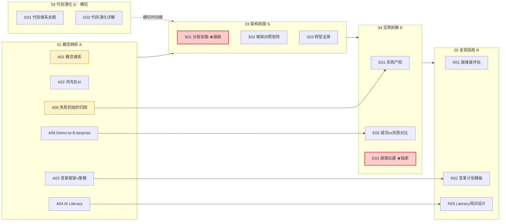

# README · 多视图阅读指南

> 这是 **0428 组织采纳系统化专题** 的入口与编织层。`[_组织采纳系统化专题·总览](/kb/专题-商业组织与采纳/_组织采纳系统化专题-总览/)`（MOC）回答"这个专题在讲什么、为什么配独立建库"；本 README 回答 **"以你现在的身份和时间，该从哪进、按什么顺序读、读完怎么自测、面试桌上会被怎么打"**。
>
> 一句话立场（也是整个专题的赌注）：**AI 落地的失败，80% 不发生在"某一层做得不够好"，而发生在"两层之间没有人负责接力"，以及"组织试图给一个不可问责的非人类执行者注入它无法承载的权威"。** 读完本专题，你应该能在面试桌 / 选型会 / 复现台上，30 秒说清"为什么技术选型对了，部署还是会死"。

专题共 **17 个原子节点 + 1 个总览 + 本 README**，分六模块：`01 概念辨析(A) / 02 代际演化(G) / 03 架构剖面(S) / 04 实例剖解(E) / 05 复现指南(R) / 06 阅读指南`。下面三条路径互不替代——选一条主线读完，再按需横跳。

---

## 一、三条阅读路径（各标时长 + 前置 + 产出）

不要从 A01 线性读到 R03。按身份选入口：

### 路径一：求职速通（≈ 90 分钟）——"面试桌上 30 秒证明我懂组织采纳"

**适合**：正在面 AI PM、要在行为面/案例面里展示"我不是只懂模型"的人（Rick 的首要场景）。
**前置**：无。**产出承诺**：读完能回答"AI 落地为什么难""你怎么推动 AI 在组织落地""技术对了为什么还会失败"三类高频题，且答得比 90% 候选人有判断密度。

| 顺序 | 节点 | 读它拿到什么 | 时长 |
|---|---|---|---|
| 1 | [S01 AI 组织采纳分层剖面](/kb/专题-商业组织与采纳/s01-ai-组织采纳分层剖面/) | ★旗舰。六层 + 三个层间致命耦合（战略↔所有权、能力↔所有权、合规↔扩张）——一张能贴墙的诊断刀 | 25 min |
| 2 | [E03 滴滴跨团队拉通经验迁移剖解](/kb/专题-商业组织与采纳/e03-滴滴跨团队拉通经验迁移剖解/) | ★独家。把你的滴滴 PDP 一手经验提纯成 M1–M4 可迁移机制，并标出"信任摩擦"这个 AI 新变量 | 25 min |
| 3 | [A05 AI 项目失败的组织归因](/kb/专题-商业组织与采纳/a05-ai-项目失败的组织归因/) | "归因错了就修错地方"——把失败从技术叙事抢回组织叙事的一句话框架 | 15 min |
| 4 | [A02 Crossing the Chasm 在 AI 语境](/kb/专题-商业组织与采纳/a02-crossing-the-chasm-在-ai-语境/) | 鸿沟在 AI 里"变深、变到组织内部"，且 Moore 药方大半失效——一个有反共识的概念锚 | 15 min |
| 5 | 跳读 [S02 采纳与变革框架对照矩阵](/kb/专题-商业组织与采纳/s02-采纳与变革框架对照矩阵/) §0 | "框架不是替代关系是分工关系"——挡住面试官"你只会背 Kotter"的追问 | 10 min |

> [!tip] 速通者的元技巧
> 把 S01 的"能不能说出那个 owner 的名字""哪两层没人接力"和 E03 的"先让 AI 以管家而非裁判姿态进入"背成两句话。这两句话本身就是判断密度的证据——它们都带反共识、都能立即落地。

### 路径二：决策链（≈ 4 小时）——"在岗，下周要牵头一个 AI 部署"

**适合**：被点名牵头 AI 转型 / 要做立项评审 / 要给 CEO 一份计划的在岗 PM。
**前置**：建议先扫一眼路径一的 S01（它是后续所有节点的坐标系）。**产出承诺**：读完手里有一张就绪度评分表、一份可签字的变革计划骨架、一套培训设计，且知道每个工具会在哪翻车。

按"概念 → 架构 → 病理 → 操作"的依赖链走：

1. **建坐标系**：[A01 技术采纳与组织变革概念谱系](/kb/专题-商业组织与采纳/a01-技术采纳与组织变革概念谱系/)（Rogers/Moore/变革管理三套语言的谱系）→ [S02 采纳与变革框架对照矩阵](/kb/专题-商业组织与采纳/s02-采纳与变革框架对照矩阵/)（什么阶段切哪个框架）。
2. **看全景**：[S03 组织 AI 转型全景](/kb/专题-商业组织与采纳/s03-组织-ai-转型全景/)（把"我们也要做 AI 转型"拆成战略/数据/能力/治理/文化五子系统的施工图）→ [S01 AI 组织采纳分层剖面](/kb/专题-商业组织与采纳/s01-ai-组织采纳分层剖面/)（六层耦合诊断，全景的承重梁）。
3. **学病理**：[A06 Demo-to-Enterprise 鸿沟的组织维度](/kb/专题-商业组织与采纳/a06-demo-to-enterprise-鸿沟的组织维度/)（合规/权限/审计/责任/流程嵌入五道闸门）→ [E01 AI 项目组织失败案例剖解](/kb/专题-商业组织与采纳/e01-ai-项目组织失败案例剖解/)（三个真实尸检）→ [E02 企业 AI 采纳成功与失败对比剖解](/kb/专题-商业组织与采纳/e02-企业-ai-采纳成功与失败对比剖解/)（控制技术变量后，成败由组织就绪解释）。
4. **动手**：[R01 AI 采纳就绪度评估](/kb/专题-商业组织与采纳/r01-ai-采纳就绪度评估/)（五维评分表，但"就绪度高 ≠ 会成功"）→ [R02 变革管理计划模板](/kb/专题-商业组织与采纳/r02-变革管理计划模板/)（Kotter 八步被 AI 三摩擦重写的填空模板）→ [R03 AI Literacy 培训设计](/kb/专题-商业组织与采纳/r03-ai-literacy-培训设计/)（能力边界/心智模型/信任校准三轴）。
5. **借经验**：[E03 滴滴跨团队拉通经验迁移剖解](/kb/专题-商业组织与采纳/e03-滴滴跨团队拉通经验迁移剖解/)（M1–M4 + 四个迁移坑，收尾时回看，把方法论接到自己的政治判断上）。

> [!note] 在岗者的最短动作
> 没空读全：只读 **S01 + R01 + R02**。S01 给你"该问哪两层接力"，R01 给你"打分门槛"，R02 给你"可签字的纸"。三件就够立项会用。

### 路径三：紧迫度（≈ 35 分钟）——"碎片时间，先看最反共识、最致命的判断"

**适合**：通勤/排队，只想拿到几把最锋利的刀，回头再补全。
**前置**：无。**产出承诺**：拿到本专题 5 个最高判断密度的命题，每个都能单独在对话里抛出。

只读这五段（每段都是节点里的"判断主轴/命门"小节，不读全文）：

| # | 去哪读 | 拿到的那把刀 |
|---|---|---|
| 1 | [S01 AI 组织采纳分层剖面](/kb/专题-商业组织与采纳/s01-ai-组织采纳分层剖面/) §2 | 失败不在"哪层最弱"，在"哪两层没人接力"——三个致命耦合 |
| 2 | [E03 滴滴跨团队拉通经验迁移剖解](/kb/专题-商业组织与采纳/e03-滴滴跨团队拉通经验迁移剖解/) §4 | 员工抵触 AI，不是抵触工具，是抵触"一个不可问责的权威替我做决定" |
| 3 | [A03 变革管理框架与 AI 部署摩擦](/kb/专题-商业组织与采纳/a03-变革管理框架与-ai-部署摩擦/) §0 | "当一个框架把所有失败都归因为你没正确执行我时，它已经不可证伪了" |
| 4 | [G02 企业采纳代际演化详解](/kb/专题-商业组织与采纳/g02-企业采纳代际演化详解/) 视角框 | 技术门槛在降，但**信任门槛在 AI 这代不降反升**——别用 SaaS playbook 打 AI 这仗 |
| 5 | [A04 组织 AI Literacy 建设](/kb/专题-商业组织与采纳/a04-组织-ai-literacy-建设/) §0 | AI literacy 是组织变革变量，不是 HR 培训科目——抓错因果链位置 |

> [!warning] 碎片读的风险
> 这五把刀单独锋利，但脱离了 S01 的六层坐标系容易变成"金句"。碎片读完，欠自己一次路径一的 90 分钟把它们串成体系——否则面试官一追"具体怎么做"就露馅。

---

## 二、专题地图（横切检索）

按"我现在关心哪个问题"反查节点。`G` 层横切所有路径（提供时间维度），随时可插读。

| 你的问题 | 直奔这些节点 |
|---|---|
| "AI 落地是技术问题还是组织问题？" | [A01 技术采纳与组织变革概念谱系](/kb/专题-商业组织与采纳/a01-技术采纳与组织变革概念谱系/) · [A05 AI 项目失败的组织归因](/kb/专题-商业组织与采纳/a05-ai-项目失败的组织归因/) |
| "为什么 demo 惊艳但部署死？" | [A06 Demo-to-Enterprise 鸿沟的组织维度](/kb/专题-商业组织与采纳/a06-demo-to-enterprise-鸿沟的组织维度/) · [A02 Crossing the Chasm 在 AI 语境](/kb/专题-商业组织与采纳/a02-crossing-the-chasm-在-ai-语境/) · [E01 AI 项目组织失败案例剖解](/kb/专题-商业组织与采纳/e01-ai-项目组织失败案例剖解/) |
| "该用 Kotter 还是 ADKAR 还是 Moore？" | [S02 采纳与变革框架对照矩阵](/kb/专题-商业组织与采纳/s02-采纳与变革框架对照矩阵/) · [A03 变革管理框架与 AI 部署摩擦](/kb/专题-商业组织与采纳/a03-变革管理框架与-ai-部署摩擦/) |
| "这次 AI 采纳和上云有什么不同？" | [G01 企业技术采纳代际谱系总图](/kb/专题-商业组织与采纳/g01-企业技术采纳代际谱系总图/) · [G02 企业采纳代际演化详解](/kb/专题-商业组织与采纳/g02-企业采纳代际演化详解/) |
| "组织里到底哪几层会断？" | [S01 AI 组织采纳分层剖面](/kb/专题-商业组织与采纳/s01-ai-组织采纳分层剖面/) · [S03 组织 AI 转型全景](/kb/专题-商业组织与采纳/s03-组织-ai-转型全景/) |
| "我们准备好了吗 / 怎么打分？" | [R01 AI 采纳就绪度评估](/kb/专题-商业组织与采纳/r01-ai-采纳就绪度评估/) |
| "给我一份能签字的计划 / 培训课" | [R02 变革管理计划模板](/kb/专题-商业组织与采纳/r02-变革管理计划模板/) · [R03 AI Literacy 培训设计](/kb/专题-商业组织与采纳/r03-ai-literacy-培训设计/) |
| "成功的组织到底赢在哪？" | [E02 企业 AI 采纳成功与失败对比剖解](/kb/专题-商业组织与采纳/e02-企业-ai-采纳成功与失败对比剖解/) |
| "我的滴滴经验能不能用？" | [E03 滴滴跨团队拉通经验迁移剖解](/kb/专题-商业组织与采纳/e03-滴滴跨团队拉通经验迁移剖解/) |

---

## 三、自测题（≥10，每题给"及格线 / 优秀线 / 反例"）

读完后自测。**及格线 = 综述转写都能答**；**优秀线 = 带反共识、数字或边界的判断**；**反例 = 一答出来就证明没读懂**。建议合上文档默写，再回去对。

**Q1. "AI 落地难"难在哪一层？**
- 及格：技术不够强 / 数据不够好 / 没培训。
- 优秀：难在"组织没准备好被改变"——失败 80% 不在某层不够好，而在两层之间没人接力（耦合 A 战略↔所有权、C 合规↔扩张）。技术（BCG 10-20-70 里的"10"）反而最可外包。
- 反例：把"换更强的模型 / 加算力"当解药——这正是 [A05 AI 项目失败的组织归因](/kb/专题-商业组织与采纳/a05-ai-项目失败的组织归因/) 说的"归因错了就修错地方"。

**Q2. Moore 的鸿沟迁到企业内部 AI 采纳，照搬还是改写？**
- 及格：鸿沟还成立，要跨过它。
- 优秀：鸿沟不仅成立而且**变深、变到组织内部**（从公司间市场断层变成一家公司内 pilot→production 的"试点地狱"）；但 Moore 的药方（聚焦细分、做参考客户）对内部多业务线同时转型**大半失效**。
- 反例：直接套 Moore"聚焦一个细分市场建标杆"去管内部跨部门采纳。

**Q3. 把 Kotter 八步原样搬到 AI 部署，为什么系统性失败？**
- 及格：AI 不一样，框架旧了。
- 优秀：Kotter 假设变革对象是可定义、可解冻、可**再冻结**的稳定目标；AI 是黑箱、概率性、持续漂移、且威胁员工技能存量——Lewin 的 Refreeze 在 AI 语境基本失效。更致命的是 Kotter 把所有失败都归因为"你没正确执行我"，**已不可证伪**。
- 反例：复盘说"我们紧迫感不够 / 培训不到位"——把框架本身豁免于审查。

**Q4. 列出 S01 的三个层间致命耦合，并说出诊断口诀。**
- 及格：记得"有六层"。
- 优秀：耦合 A 战略(L1)↔所有权(L4)=无 owner 之死；耦合 B 能力(L3)↔所有权(L4)=能力缺位让激励反向；耦合 C 合规(L5)↔扩张(L6)=逐案串行卡死飞轮。口诀：**不要问"哪层最弱"，要问"哪两层没人接力"**。
- 反例：背出一个"L1→L5 成熟度阶梯"——掩盖了层间耦合这个真正杀手。

**Q5. 为什么"高管赞助 = 成功"是个 bias？**
- 及格：赞助有用但不够。
- 优秀：有赞助商 ≠ 有 owner；赞助若停在口号，反而制造"看起来有人管"的假象，比公开无主更危险。真正的指标是"**能不能说出那个人的名字**"（single-threaded owner）。RAND 2024 把"问题定义失准"列为首要失败根因，本质是战略没被任何 owner 翻译成具体问题。
- 反例：立项时看到"CEO 站台"就放行。

**Q6. 一线员工抵触 AI，根因是什么？（E03 的核心判断）**
- 及格：怕被替代 / 不会用。
- 优秀：更深一层是"**怕被一个不可问责的系统替我背锅**"——是对"无根基的权威"的合理防御（韦伯透镜）。行动启示不是"说服员工信任 AI"，而是**降低 AI 的权威姿态**：让它先以管家(Copilot)而非裁判(Autopilot)姿态进入，保留 HITL 和台阶。
- 反例：靠行政命令"必须用 AI"——制造表面合规、地下抵触。

**Q7. AI literacy 该归谁管、是什么？**
- 及格：HR 的培训课 / onboarding 视频。
- 优秀：是**组织变革变量**，不是 HR 科目——抓错因果链位置。核心能力是"批判性评估 + 协作 + 伦理导航"（Long & Magerko 2020 / Ng 2021 六构念），无法靠操作视频灌输；它是采纳曲线上可设计的杠杆。EU AI Act Art.4 还把它从"提效手段"升级为**法律义务**。
- 反例：把 literacy 等同于"会点哪个按钮"，外包给 LMS 必修课。

**Q8. 这次 AI 采纳和历史上的上云/SaaS 有何结构性不同？**
- 及格：AI 更先进、更快。
- 优秀：**技术门槛在持续下降，但信任门槛在 AI 这代不降反升**——大型机时代不信任是因为"陌生"（靠时间消解），AI 时代不信任是因为它"会一本正经地错且无法事前预测"（[幻觉](/kb/基础知识库/幻觉/)，结构性新墙）。用 SaaS playbook 打 AI 这仗必败。
- 反例：把代际史写成"一代比一代采纳更顺"的线性进步史。

**Q9. 四个变革框架（Rogers/Moore/Kotter/ADKAR）怎么选？**
- 及格：选一个最好/最新的全程用。
- 优秀：**"哪个最好"是伪问题**——它们在层级（个体/市场/组织）、阶段、摩擦类型三个正交维度上根本不在同一坐标系。是分工不是替代：用 Kotter 管个体抵触、用 ADKAR 做市场细分都会失效。选错 = 把工具用在它失效的阶段。
- 反例：用 Kotter 八步去管一线员工的个体心理抵触。

**Q10. 就绪度评估打了高分，是不是就能上？**
- 及格：是，分高就上。
- 优秀：**就绪度高 ≠ 项目会成功**——R01 是诊断工具不是通行证。就绪度不是单调线性可累积的（反成熟度模型假设）；你可以同时有顶级数据基础设施(L2成熟)和形同虚设的所有权(L4崩塌)，高成熟度反而放大风险。
- 反例：拿咨询公司的"你在 Level 2，努力到 Level 4"当成功路线图。

**Q11. 滴滴 PDP 经验里，哪部分可迁移、哪部分会失效？**
- 及格：经验都有用 / 都没用。
- 优秀：组织直觉（M1 联盟先于方案、M2 利益翻译、M3 小胜做参考案例、M4 裁判→管家）高度可迁移；但 AI 引入新变量——**对会犯错、不可解释、持续漂移的非人类执行者的信任摩擦**。补丁：联盟要新增数据治理/合规角色；"小胜"要升级为"带可解释性证据的小胜"（因 AI 归因模糊 + 不可解释）。
- 反例：把"我拉通过人"当成"我能拉通 AI 采纳"——旧 SOP 默认所有参与方是"会被说服的人"。

**Q12. 合规为什么会卡死扩张飞轮？怎么破？**
- 及格：合规太慢。
- 优秀：扩张逻辑是飞轮/指数(想要 O(1) 边际合规成本)，传统合规是逐案串行(给的是 O(n))，速率不匹配。破法：按风险**分级**（低风险走快速通道）、建**可复用合规模板/责任矩阵**、在战略阶段就**先选合规友好的扩张路径**（内部提效先于对外决策）。
- 反例：拿 Menlo 47% 转化率说"合规没卡死"——那测的是"对外采购成熟产品"，不是"对内多场景扩张"，测的不是一回事。

---

## 四、反方对话训练（组织采纳领域 6 追问）

面试桌 / 选型会上，真正的对手不会反 hype，他们会用看似有理的主流立场打你。原则同宪章 §7：**接受它对的部分，再标注你坚持的边界与赌注**——不是反驳。每条给"对手要害 → 我的接受 → 我的边界 → 落点节点"。

**追问 1："AI 这么好用，用户自然会用吧？培训和变革管理是不是想多了？"**
- 要害：把消费级 ChatGPT 的自发扩散当成企业级采纳。
- 接受：消费端 ChatGPT 效应确实在快速降低个体陌生感，PLG/影子 AI 从下往上渗透是真的，部分 L2/L3 摩擦被技术红利冲掉。
- 边界：个体在**低风险场景**习惯 AI ≠ 组织在**高风险、高问责场景**信任 AI 替自己决策。"自然会用"的恰恰是个人生产力工具(L4/L5 不涉组织)；一旦进入跨部门、要担责的场景，所有权真空和信任摩擦不会自动消解。我的反打：与其压制影子 AI，不如把它**收编**为能力基线、反向倒逼战略。
- 落点：[S01 AI 组织采纳分层剖面](/kb/专题-商业组织与采纳/s01-ai-组织采纳分层剖面/) §5 对手一(McAfee) · [E03 滴滴跨团队拉通经验迁移剖解](/kb/专题-商业组织与采纳/e03-滴滴跨团队拉通经验迁移剖解/) §4。

**追问 2："变革管理是不是务虚？给我看技术指标就行。"**
- 要害：技术优先心态(technology-first)，把组织当软变量。
- 接受：技术指标必须看，模型能力是地基；技术-first 的人往往执行力强。
- 边界：BCG 10-20-70——算法/模型只占成功的 **10%**，人/流程/文化占 **70%**。控制住技术变量后（[E02 企业 AI 采纳成功与失败对比剖解](/kb/专题-商业组织与采纳/e02-企业-ai-采纳成功与失败对比剖解/)），成败方差几乎全部由组织变量解释。"务虚"的指控本身是 RAND 五大失败根因里"技术优先心态"的征兆。我会把"虚"的东西做成**可打分的硬指标**（R01 五维评分、R02 可签字计划）反将一军。
- 落点：[E02 企业 AI 采纳成功与失败对比剖解](/kb/专题-商业组织与采纳/e02-企业-ai-采纳成功与失败对比剖解/) · [R01 AI 采纳就绪度评估](/kb/专题-商业组织与采纳/r01-ai-采纳就绪度评估/) · [S03 组织 AI 转型全景](/kb/专题-商业组织与采纳/s03-组织-ai-转型全景/)。

**追问 3："采纳慢，说到底还是技术不够好——等模型再强一点就解决了。"**
- 要害：技术乐观派(McAfee 式)，赌组织阻力会被技术红利碾平。
- 接受：工具确实在变强，2023 年的很多"组织问题"（prompt 门槛、集成成本）已被更好的产品消解。
- 边界：L4(所有权)和 L5(责任)是**社会-法律建构**，不是技术能消解的——无论 agent 多强，"出错谁担责"不会因模型变好而消失，反而因自主性提高而更尖锐（[幻觉](/kb/基础知识库/幻觉/) 不可完全消除）。我赌组织层摩擦是**结构性、长期**的，不是过渡性的。唯一会推翻我的场景：出现能自主"定义问题→找 owner→过合规"的超强 agent——那时我的耦合诊断框架显式降级为过渡期工具（这个边界我承担）。
- 落点：[S01 AI 组织采纳分层剖面](/kb/专题-商业组织与采纳/s01-ai-组织采纳分层剖面/) §0 赌注 + §5 · [A03 变革管理框架与 AI 部署摩擦](/kb/专题-商业组织与采纳/a03-变革管理框架与-ai-部署摩擦/)。

**追问 4："培训不就是发个文档 / 录几段视频？"**
- 要害：把能力建设等同于显性知识传授。
- 接受：基础操作确实可以靠文档/视频覆盖，标准化内容该标准化。
- 边界：约七成受训者忽视 onboarding 视频、更依赖实验性与社会性学习（McKinsey 2024）；69% 员工主要通过**同伴**而非正式培训学 AI。更深的是 Polanyi 默会知识——员工信任 AI 的前提是 AI 输出能与他的默会判断对齐，这种对齐只能在**共同实践**中长出来，文档传不了。所以培训真正目标不是"教会规则"，是"在共同实践中迁移默会的信任校准"——靠 Change Champion 网络，不是 LMS。
- 落点：[A04 组织 AI Literacy 建设](/kb/专题-商业组织与采纳/a04-组织-ai-literacy-建设/) · [R03 AI Literacy 培训设计](/kb/专题-商业组织与采纳/r03-ai-literacy-培训设计/) · [S01 AI 组织采纳分层剖面](/kb/专题-商业组织与采纳/s01-ai-组织采纳分层剖面/) §6(Polanyi)。

**追问 5："我们有 C 级高管亲自挂帅赞助，采纳肯定没问题吧？"**
- 要害：把"高管站台"等同于"有人负责"。
- 接受：高层赞助确实是必要条件，BCG 称有强赞助商的变革成功率高 73%；缺它几乎必败。
- 边界：必要 ≠ 充分。有赞助商 ≠ 有 owner——赞助若停在口号，制造"看起来有人管"的假象，比公开无主更危险（confirmation-bias 砍除）。战略意图天然抽象跨职能，不会自动下沉为单一主体的所有权。真正的 gate 是"**能不能说出那个 single-threaded owner 的名字**、他的奖惩是否与结果绑定"。
- 落点：[S01 AI 组织采纳分层剖面](/kb/专题-商业组织与采纳/s01-ai-组织采纳分层剖面/) §2 耦合 A · [A05 AI 项目失败的组织归因](/kb/专题-商业组织与采纳/a05-ai-项目失败的组织归因/) · [E01 AI 项目组织失败案例剖解](/kb/专题-商业组织与采纳/e01-ai-项目组织失败案例剖解/)。

**追问 6："试点 KPI 涨了 30%，直接全公司铺开不就行了？"**
- 要害：把"脏的小胜"当"干净的小胜"复制。
- 接受：单点跑通再复制（M3）是对的逻辑——AI 高绩效者做"工作流根本重设计"的概率是别家的 2.8 倍。
- 边界：AI 的小胜常常是"脏"的：(a)**归因模糊**——是 AI 的功劳还是试点团队本就高配合的自选择偏差？(b)**可解释性缺口**——无法向"要解释才肯签字"的法务/风控交代。MIT NANDA 指出试点价值无法外推到全员。所以复制前要先证明"因果可信、错误边界已知、HITL 兜底在哪"——M3 升级为"**带可解释性证据的小胜**"。
- 落点：[E03 滴滴跨团队拉通经验迁移剖解](/kb/专题-商业组织与采纳/e03-滴滴跨团队拉通经验迁移剖解/) §3/§5 · [A05 AI 项目失败的组织归因](/kb/专题-商业组织与采纳/a05-ai-项目失败的组织归因/) · [E01 AI 项目组织失败案例剖解](/kb/专题-商业组织与采纳/e01-ai-项目组织失败案例剖解/)。

> [!tip] 反方训练的元规则
> 每次被打，先问自己三件事：(1) 对手说对的那一半是什么（不接受就是 hype 腔）？(2) 我坚持的边界用哪个**数字/真实立场/失效场景**撑住（光说"但是我觉得"不算）？(3) 我的判断在什么场景会被**真正推翻**（说不出推翻条件 = 不可证伪 = 输）。这三问就是宪章 B 维(边界含量)与 E 维(对手拷问)的现场版。

---

## 五、关联节点

**专题内核心（必读）**
- [_组织采纳系统化专题·总览](/kb/专题-商业组织与采纳/_组织采纳系统化专题-总览/) — 本专题 MOC，回到全局坐标与验收档案
- [S01 AI 组织采纳分层剖面](/kb/专题-商业组织与采纳/s01-ai-组织采纳分层剖面/) — 旗舰：六层耦合诊断
- [E03 滴滴跨团队拉通经验迁移剖解](/kb/专题-商业组织与采纳/e03-滴滴跨团队拉通经验迁移剖解/) — 独家：滴滴一手经验迁移
- [A05 AI 项目失败的组织归因](/kb/专题-商业组织与采纳/a05-ai-项目失败的组织归因/) — 归因诊断学，全专题的判断锚

**专题内全节点索引**
- 01 概念辨析：[A01 技术采纳与组织变革概念谱系](/kb/专题-商业组织与采纳/a01-技术采纳与组织变革概念谱系/) · [A02 Crossing the Chasm 在 AI 语境](/kb/专题-商业组织与采纳/a02-crossing-the-chasm-在-ai-语境/) · [A03 变革管理框架与 AI 部署摩擦](/kb/专题-商业组织与采纳/a03-变革管理框架与-ai-部署摩擦/) · [A04 组织 AI Literacy 建设](/kb/专题-商业组织与采纳/a04-组织-ai-literacy-建设/) · [A05 AI 项目失败的组织归因](/kb/专题-商业组织与采纳/a05-ai-项目失败的组织归因/) · [A06 Demo-to-Enterprise 鸿沟的组织维度](/kb/专题-商业组织与采纳/a06-demo-to-enterprise-鸿沟的组织维度/)
- 02 代际演化：[G01 企业技术采纳代际谱系总图](/kb/专题-商业组织与采纳/g01-企业技术采纳代际谱系总图/) · [G02 企业采纳代际演化详解](/kb/专题-商业组织与采纳/g02-企业采纳代际演化详解/)
- 03 架构剖面：[S01 AI 组织采纳分层剖面](/kb/专题-商业组织与采纳/s01-ai-组织采纳分层剖面/) · [S02 采纳与变革框架对照矩阵](/kb/专题-商业组织与采纳/s02-采纳与变革框架对照矩阵/) · [S03 组织 AI 转型全景](/kb/专题-商业组织与采纳/s03-组织-ai-转型全景/)
- 04 实例剖解：[E01 AI 项目组织失败案例剖解](/kb/专题-商业组织与采纳/e01-ai-项目组织失败案例剖解/) · [E02 企业 AI 采纳成功与失败对比剖解](/kb/专题-商业组织与采纳/e02-企业-ai-采纳成功与失败对比剖解/) · [E03 滴滴跨团队拉通经验迁移剖解](/kb/专题-商业组织与采纳/e03-滴滴跨团队拉通经验迁移剖解/)
- 05 复现指南：[R01 AI 采纳就绪度评估](/kb/专题-商业组织与采纳/r01-ai-采纳就绪度评估/) · [R02 变革管理计划模板](/kb/专题-商业组织与采纳/r02-变革管理计划模板/) · [R03 AI Literacy 培训设计](/kb/专题-商业组织与采纳/r03-ai-literacy-培训设计/)

**跨专题 / 既有节点（升级对照入口）**
- [m207 - Agent 产品化：场景推演与失败模式](/kb/工程化与落地架构/m207-agent-产品化-场景推演与失败模式/) — 产品内失败 ↔ 组织部署失败的升维对照
- [p307 - Copilot 到 Autopilot 光谱](/kb/产品设计与交互范式/p307-copilot-到-autopilot-光谱/) — 自主光谱首先是组织信任光谱（E03 §4 / S01 §8）
- [m208 - AI 基础设施与中间件选型](/kb/工程化与落地架构/m208-ai-基础设施与中间件选型/) — L2 技术就绪是组织六层里最可外包的"10%"
- [幻觉](/kb/基础知识库/幻觉/) — L5 责任层与"信任门槛上升"的技术根源
- [Polanyi 默会知识与提示工程的认识论张力](/kb/基础知识库/polanyi-默会知识与提示工程的认识论张力/) — 拉通能力 / 信任校准作为默会知识
- [AI概念滥用反思](/kb/基础知识库/ai概念滥用反思/) — AI 生成内容须经批判性同行评议（本专题方法论自指）
- [AI PM 知识图谱·总索引](/kb/ai-pm-知识图谱/ai-pm-知识图谱-总索引/) — 回到 AI PM 全局图谱

---

## 修订日志
- R1（2026-06-07）：首稿（综合 Agent）。基于已落稿的 17 个节点 + S01/E03 旗舰内容编织：三条阅读路径（求职速通 90min / 决策链 4h / 紧迫度 35min，各标前置+产出+时长）；专题地图 Mermaid + 问题反查表；12 道自测题（及格/优秀/反例三档）；组织采纳领域 6 条反方对话训练（含题目指定的四类追问："AI 这么好用户自然会用""变革管理务虚""采纳慢是技术不够好""培训不就是发文档"，各配接受+边界+落点）。所有专题内双链均用真实文件 basename（已对照 17 节点 frontmatter aliases 与文件名核验），跨专题双链已 find 核实存在。待办：`_组织采纳系统化专题·总览` 尚未落稿，其双链待总览入库后自动 resolve；R02 自测题"47%"等次级引用以各节点 grounding 为准。
