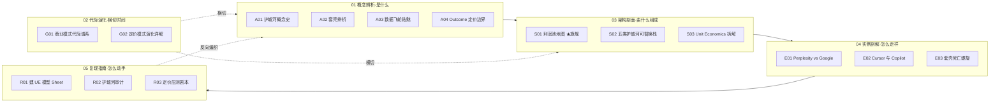

# README·多视图阅读指南（0434 AI 产品护城河与商业模式）

> 这是 **0434 专题**（[_AI 产品护城河与商业模式系统化专题·总览](/kb/专题-商业组织与采纳/_ai-产品护城河与商业模式系统化专题-总览/)）的"怎么读"层。`_总览` 回答"这套立方是什么、为什么配独立建库"；本 README 回答"以你现在的身份、你手上的时间，从哪一个节点切进去、读完怎么自检、上桌怎么不被问倒"。
>
> 本专题的反共识立场一句话：**在 AI 应用层，最像护城河的那个东西（"我用了最强的模型 / 我的 AI 能力最好"）恰恰最不是护城河，因为它被底层模型的月度迭代从下方冲垮；真正能算账的护城河，是把专有数据、工作流锁定、分发网络咬合进同一个反馈闭环、并且单位经济学结得平的复合结构。** 读完你应当能在面试桌、选型会、尽调台上 30 秒说清：**为什么这个 AI 产品不是套壳（或就是套壳）、它处在利润涨潮还是退潮的层、它的定价模式会在哪个冲击下先断裂。**

---

## §1 节点地图速查（15 节点 + 两层导航）



| 模块 | 节点 | 一句话钩子 |
|---|---|---|
| 01 概念辨析 | [A01 护城河概念史·从 Porter 到 AI-native](/kb/专题-商业组织与采纳/a01-护城河概念史-从-porter-到-ai-native/) | 能力是流量不是存量，会被基础设施化 |
| 01 概念辨析 | [A02 套壳辨析·Thin Wrapper 的真伪判据](/kb/专题-商业组织与采纳/a02-套壳辨析-thin-wrapper-的真伪判据/) | "套壳"不是属性（是/否），是一个三轴坐标 |
| 01 概念辨析 | [A03 数据飞轮的祛魅·哪种数据真能复用](/kb/专题-商业组织与采纳/a03-数据飞轮的祛魅-哪种数据真能复用/) | 多数公司有的只是"数据规模效应"，那从来不是护城河 |
| 01 概念辨析 | [A04 Outcome-based 定价的概念边界](/kb/专题-商业组织与采纳/a04-outcome-based-定价的概念边界/) | 性感和危险是同一枚硬币：风险从买方转给了卖方 |
| 02 代际演化 | [G01 商业模式代际谱系·SaaS 到 AI-native](/kb/专题-商业组织与采纳/g01-商业模式代际谱系-saas-到-ai-native/) | 四代计价不是一条越来越先进的直线 |
| 02 代际演化 | [G02 定价模式演化详解·Seat 到 Usage 到 Outcome](/kb/专题-商业组织与采纳/g02-定价模式演化详解-seat-到-usage-到-outcome/) | 计价单元选错，会反向掏空护城河 |
| 03 架构剖面 | [S01 AI 产业链价值生态位地图·利润池在哪](/kb/专题-商业组织与采纳/s01-ai-产业链价值生态位地图-利润池在哪/) ★ | 收税位还是被收税位？这一层 24 个月会不会塌 |
| 03 架构剖面 | [S02 五类护城河可替换栈·数据 工作流 网络 成本 品牌](/kb/专题-商业组织与采纳/s02-五类护城河可替换栈-数据-工作流-网络-成本-品牌/) | 五类不可累加，问"承重墙是哪一层" |
| 03 架构剖面 | [S03 Unit Economics 拆解·CAC vs COGS vs LTV](/kb/专题-商业组织与采纳/s03-unit-economics-拆解-cac-vs-cogs-vs-ltv/) | 用量越大毛利可能被拖向下，而非自动爬到 80% |
| 04 实例剖解 | [E01 Perplexity vs Google·搜索利润池争夺](/kb/专题-商业组织与采纳/e01-perplexity-vs-google-搜索利润池争夺/) | 做出更好的搜索，和夺走搜索的钱，几乎无关 |
| 04 实例剖解 | [E02 Cursor 与 Copilot·应用层能否守住](/kb/专题-商业组织与采纳/e02-cursor-与-copilot-应用层能否守住/) | 应用层守住靠工作流锁定与分发，不靠模型能力 |
| 04 实例剖解 | [E03 套壳死亡螺旋复盘](/kb/专题-商业组织与采纳/e03-套壳死亡螺旋复盘/) | 它不是被竞争对手杀死，是被自己依赖的供应商杀死 |
| 05 复现指南 | [R01 给一个 AI 产品建 UE 模型 Sheet](/kb/专题-商业组织与采纳/r01-给一个-ai-产品建-ue-模型-sheet/) | UE 不是一个数，是模型价格 × 使用规模的函数 |
| 05 复现指南 | [R02 护城河审计 Checklist](/kb/专题-商业组织与采纳/r02-护城河审计-checklist/) | 不是"数他有几种"，是"估算对手伪造每条的成本" |
| 05 复现指南 | [R03 定价模式压测剧本](/kb/专题-商业组织与采纳/r03-定价模式压测剧本/) | 不预测会不会发生，假设已经发生，量化损伤 |

---

## §2 三条阅读路径（各标时长 + 前置 + 产出）

挑你现在的身份，按对应路径读。每条都给了**预计时长、前置知识、读完的可交付产出**。

### 路径 A —— 求职速通（面向"商业 sense"面试）｜约 90 分钟

> **谁适合**：正在面 AI PM / 战略 / 投资岗，面试官会用"这产品有没有护城河 / 这是不是套壳 / 它怎么赚钱"这类**商业 sense 题**当场拉开候选人。
> **前置**：知道什么是 SaaS、毛利、API 调用即可，不需要财务建模基础。
> **产出**：四个面试高频陷阱的**标准答案 + 反例**，能在白板前 30 秒画出"利润池在哪一层"。

| 序 | 节点 | 时长 | 读完能答的面试题 |
|---|---|---|---|
| 1 | [A02 套壳辨析·Thin Wrapper 的真伪判据](/kb/专题-商业组织与采纳/a02-套壳辨析-thin-wrapper-的真伪判据/) | 20′ | "这不就是个套壳吗？"——用工作流深度 × 专有数据 × 切换成本三轴回答，而不是二元贴标签 |
| 2 | [S01 AI 产业链价值生态位地图·利润池在哪](/kb/专题-商业组织与采纳/s01-ai-产业链价值生态位地图-利润池在哪/) | 30′ | "这个产品的钱从哪来？"——画五层利润池，指出它是收税位还是被收税位 |
| 3 | [A03 数据飞轮的祛魅·哪种数据真能复用](/kb/专题-商业组织与采纳/a03-数据飞轮的祛魅-哪种数据真能复用/) | 20′ | "你们有海量数据，这是护城河吗？"——区分数据规模效应 vs 数据网络效应，九成叙事当场筛掉 |
| 4 | [E03 套壳死亡螺旋复盘](/kb/专题-商业组织与采纳/e03-套壳死亡螺旋复盘/) | 20′ | "这个 AI 产品最大的风险是什么？"——纵向供应商依赖 > 横向竞争，能力 delta 单调收敛到零 |

> [!tip] 面试桌上的"商业 sense"压缩包
> 把这三句背下来，足够应付 80% 的护城河追问：①「能力是流量不是存量，会被基础设施化」（A01/S02）；②「价值创造和利润捕获经常发生在不同环节」（Bain 利润池洞察，E01/S01）；③「计价单元 = 价值归因单元，选错就掏空护城河」（G01/A04）。

### 路径 B —— 决策链（选型 / 定位 / 估值全链路）｜约 4 小时

> **谁适合**：在岗 PM / 战略，要给一个 AI 产品（自家或拟采购的供应商）做定位、选型或内部估值。
> **前置**：建议先读 [m209 - 推理成本控制手册](/kb/工程化与落地架构/m209-推理成本控制手册/) 建立"推理成本是真实可变成本"的直觉。
> **产出**：一份从"产业定位"算到"财务报表"的完整判断链——这一层值不值得做、护城河承重墙在哪、UE 结不结得平。

```
S01 利润池地图（产业定位：这一层是收税位吗）
  → S02 五类护城河可替换栈（承重墙在哪、哪条失守整栈塌）
    → S03 Unit Economics 拆解（护城河翻译成损益表，结不结得平）
      → R02 护城河审计 Checklist（把 S02 落成可打分的尽调表）
        → R01 建 UE 模型 Sheet（把 S03 落成今晚就能填的 Sheet）
横切补课：G01/G02（该收什么钱）、A04（要不要碰 outcome 定价）
```

### 路径 C —— 紧迫度（手上有个产品 / BP 急着判断）｜约 75 分钟

> **谁适合**：尽调、复盘、选型会前夜，手上已经有一个具体对象，需要**立刻动手出判断**，没时间通读概念。
> **前置**：无。直接从操作手册切入，缺概念再回查。
> **产出**：一份可交给投委会 / 选型会的护城河审计打分 + 三情景压测结论。

| 序 | 节点 | 时长 | 动作 |
|---|---|---|---|
| 1 | [R02 护城河审计 Checklist](/kb/专题-商业组织与采纳/r02-护城河审计-checklist/) | 30′ | 对着对象逐条估算"对手伪造每条护城河的成本"，找承重墙 |
| 2 | [R03 定价模式压测剧本](/kb/专题-商业组织与采纳/r03-定价模式压测剧本/) | 25′ | 在"模型降价 / 竞品免费 / 用量激增"三情景下推演 UE 损伤 |
| 3 | 回查 [A02 套壳辨析·Thin Wrapper 的真伪判据](/kb/专题-商业组织与采纳/a02-套壳辨析-thin-wrapper-的真伪判据/) / [A04 Outcome-based 定价的概念边界](/kb/专题-商业组织与采纳/a04-outcome-based-定价的概念边界/) | 10′ | 校准"套壳""outcome"这两个最易被话术滑变的词 |
| 4 | 对标 [E01 Perplexity vs Google·搜索利润池争夺](/kb/专题-商业组织与采纳/e01-perplexity-vs-google-搜索利润池争夺/) / [E02 Cursor 与 Copilot·应用层能否守住](/kb/专题-商业组织与采纳/e02-cursor-与-copilot-应用层能否守住/) | 10′ | 给手上的对象找一个同结构的真实案例做参照 |

---

## §3 ≥10 道自测题（每题：及格线 / 优秀线 / 反例）

读完对应路径后自测。**及格线**= 复述出框架；**优秀线**= 能给数字、给边界、给反例；**反例**= 故意埋的错误答案，答出它说明你被话术滑变带跑了。

**Q1（A02）「这不就是个套壳吗？」该怎么回答？**
- 及格：套壳不是是/否的标签，要看工作流深度、专有数据、切换成本三轴。
- 优秀：三轴是**动态**判据——问"这三轴随平台迭代是收敛（变厚）还是发散（变薄）"。Cursor 起步就是 GPT-4/Claude 的 wrapper（来源：hatchworks.com，2025），用二元标签它 2023 年就该判死刑，但 2026 年 2 月做到 $20 亿 ARR（来源：CNBC、SaaStr，2026）。
- 反例 ✗：「他们做了 RAG / 接了 Agent / 多模型，所以不是套壳」——技术动作不等于壁垒，对手三周可复制。

**Q2（A03）一份 JD 写"我们有海量业务数据，构成天然护城河"，错在哪？**
- 及格：有数据不等于有护城河，多数业务数据无法转化为训练优势。
- 优秀：区分**数据规模效应**（更多数据→更好模型，但可被购买/合成/迁移学习追平，不是护城河）vs **数据网络效应**（用户→数据质量→产品→更多用户的自增强闭环，才是护城河，但触发条件苛刻）。a16z 关键反共识：「新增独特数据的成本可能上升，而增量数据的价值在下降」（来源：a16z，Casado & Lauten，《The Empty Promise of Data Moats》，2019）。
- 反例 ✗：「数据越多护城河越宽」——数据量框架在数学上是反的（边际价值递减）。

**Q3（A01）为什么"我们用了最强的模型 / AI 能力最好"不是护城河？**
- 及格：模型能力会被底层模型的月度迭代从下方冲垮。
- 优秀：护城河的"抽象层降级"——能力是**流量不是存量**，会被基础设施化。赌注边界：若 Scaling Laws 撞墙、前沿停滞 18 个月以上，这个判断的紧迫性会减弱（A01 文末 failure scenario）。
- 反例 ✗：「我们领先 6 个月，这 6 个月够建立优势」——AI 窗口比 Web 压缩，能力 delta 单调收敛（见 E03）。

**Q4（A04）outcome-based 定价是不是定价的"未来终点"？**
- 及格：不是进步阶梯的终点，它有明确的适用边界。
- 优秀：把四种定价看成"价格锚在价值链哪一层"——token 锚成本层（卖方风险≈0）、seat 锚接入层、outcome 锚价值层（卖方承担交付风险）。真正瓶颈不是计费技术，是**结果可归因性 + 风险归属**两个被销售话术掩盖的硬约束。它在结果可归因的少数品类（客服/法律）成立，在归因难的品类是会反噬卖方的陷阱。
- 反例 ✗：「seat 旧、token 过渡、outcome 是终点」——这个进步阶梯叙事会让你在错误品类强推 outcome 然后亏穿。

**Q5（S01）判断一个 AI 产品所在层"值不值得做"，第一步看什么？**
- 及格：看它处在产业链哪一层（芯片→云→基础模型→中间件→应用），是收税位还是被收税位。
- 优秀：用"价值生态位 + 利润池"框架而非"技术栈分层"——技术上高级的层商业上可能是利润荒漠（基础模型层：收入暴涨、利润为负）。再叠加"利润随底层能力商品化系统性下移"的动态。读结构性逻辑（为什么硬件层能维持高毛利而模型层做不到），不读会过期的具体数字。
- 反例 ✗：「这层技术最难，所以利润最厚」——价值创造与利润捕获经常在不同环节（Bain 利润池洞察）。

**Q6（S02）一个 BP 写"护城河 = 数据飞轮 + 工作流 + 网络 + 成本 + 品牌"，怎么拆？**
- 及格：五类护城河不可简单累加，要问哪一层是承重墙。
- 优秀：五类之间有**挤出效应**（资源全押"用最好模型"就没资源做工作流嵌入）。按三维度打分：基础强度 / 抗模型更新冲击度 / 难复制度。反直觉判断——最弱的是能力护城河，最被高估的是数据护城河，最持久的是咬合进同一反馈闭环的复合护城河。
- 反例 ✗：「护城河建得越多越安全」——样样都沾恰恰是没有承重墙的征兆。

**Q7（S03）"我们毛利 75%、LTV/CAC=4.2"这句话对 AI 产品哪里可疑？**
- 及格：AI 产品的 COGS（推理成本）随用量线性增长，毛利结构性落在 50–60% 而非 SaaS 的 80–90%（来源：BVP《AI Pricing and Monetization Playbook》，2025）。
- 优秀：高 LTV/CAC 可能掩盖**负的单位毛利**——重度用户用得越多、留得越久亏得越多（负向规模经济）。要先拆 COGS 再谈 LTV/CAC，5% 重度用户可能消耗 80% token。
- 反例 ✗：「规模上来边际成本趋零、毛利自动爬到 80%」——这是 SaaS 直觉，在 AI 产品上部分失效。

**Q8（E01）Perplexity 体验领先 Google，为什么撬不动搜索的钱？**
- 及格：搜索的护城河在分发与默认位，不在产品体验。
- 优秀：搜索是**利润池**不是产品——产品可被更好的产品取代，利润池不行。利润锁在用户不会感知的分发层（浏览器默认引擎、出厂预装、Google 付 Apple 的钱）。价值创造的环节（Perplexity 赢了）和利润捕获的环节是两件几乎无关的事。
- 反例 ✗：「体验更好者胜，Perplexity 会赢」——这正是被科技媒体铺天盖地传播、且从根上错的产品对比框架。

**Q9（E02）coding 工具为什么是检验"应用层护城河"最干净的实验场？**
- 及格：它的底层能力（代码生成）正是模型层迭代最快、商品化最猛的领域，能在这守住才说明应用层不只是套壳。
- 优秀：用"工作流锁定 vs 模型吞噬"这把尺，不是"谁补全更准"。Cursor 走切换成本路线（控制编辑器），Copilot 走分发庇护路线（仓库级集成 + GitHub 分发）。护城河建在"我们补全更聪明"上注定被下一次模型发布吞掉；建在非模型资产（上下文积累、编辑器控制、团队记忆、切换成本）上才守得住。
- 反例 ✗：「哪个工具接了最强模型哪个就赢」——2026 年底层模型已高度趋同，这个框架彻底失效。

**Q10（E03）套壳产品是怎么死的？**
- 及格：底层模型进步 + 供应商把高频用例原生复制并降价，把套壳的能力空白吃掉。
- 优秀：它是**螺旋**不是曲线——能力 delta 缩小→卖点变弱→提价能力下降→更激进获客→CAC↑ LTV↓→单位经济恶化→没钱建真护城河→更彻底暴露在下一次迭代中。判断主轴：不是被竞争对手杀死，是被自己依赖的供应商杀死。
- 反例 ✗：「它是竞争失败，做得更好卖得更狠就能救」——把结构性死亡误诊成竞争性失败，开错药方。

**Q11（G01/G02）四代定价（卖软件→卖座席→卖用量→卖结果）是一部进步史吗？**
- 及格：不是。每代有独特驱动力、瓶颈和反例，是钟摆不是直线。
- 优秀：框架是"计价单元 = 价值归因单元"。每代都在解决上一代的病、同时埋下自己的病：seat 价值脱钩（一个 AI 干五个人活只付一份座位费）、outcome 抽成翻车（卖方替客户承担控制不了的成本）。
- 反例 ✗：「outcome 定价最先进，大家迟早都该切过去」——线性进步史叙事，会在错误品类翻车。

**Q12（R01/R02/R03 操作题）拿到一个 AI 产品 BP，30 分钟内你做哪三件事？**
- 及格：建 UE 模型、做护城河审计、做定价压测。
- 优秀：R02 逐条估算"对手伪造每条护城河的成本"找承重墙 → R03 在"模型降价/竞品免费/用量激增"三情景压测 UE 损伤找最先断裂的弦 → R01 把毛利从一个点估计拆成一张分布表（哪个用户分位/模型价格/使用规模下开始亏）。
- 反例 ✗：「按 VC 模板逐项给护城河打钩（network effects / switching cost / data / brand）」——清单打钩对 AI 产品系统性失效，缺"抗模型更新冲击度"这一维。

> **自评口径**：12 题里答对优秀线 ≥9 题，你已经能在面试桌/选型会拉开判断力；优秀线 <6 题，回路径 A 重读 A01/A02/A03/S01 四节。

---

## §4 反方对话训练（护城河领域 6 个追问）

> **训练法**：宪章 §7「用反对的声音建造，而不是用赞同的声音装饰」。每个追问先**接受它对的部分**（不嘴硬），再**标注本专题坚持的边界与赌注**（不投降）。这 6 个是面试桌和选型会上最常砸过来的反方框架，请先自己回答，再对照。

**追问 1：「有用户数据不就是护城河吗？数据越多模型越好，这不是飞轮？」**
> 接受：在传统 SaaS 时代部分为真（更多客户→更多反馈→更好产品），且**条件苛刻的真飞轮确实存在**——数据网络效应是真护城河。
> 边界：你说的多半是**数据规模效应**（更多数据→更好模型），而它可被购买（Scale AI 这类标注市场）、合成、迁移学习追平，不是护城河。真飞轮要满足"用户增加→数据质量提升→产品变好→吸引更多用户"的闭合自增强环，且信号必须是任务特定、别人买不到/合成不出/迁移不来的。a16z 早在 2019 就证伪"数据护城河"，但它至今仍是 AI PM JD 高频要求——标准差极大正是本专题存在的理由。
> 一句话反杀：**"你的数据是别人买不到、合成不出、迁移不来的吗？如果不是，它是规模效应，会被追平。"**（详见 [A03 数据飞轮的祛魅·哪种数据真能复用](/kb/专题-商业组织与采纳/a03-数据飞轮的祛魅-哪种数据真能复用/)）

**追问 2：「套壳怎么了？能赚钱就行，何必纠结是不是套壳？」**
> 接受：Andrew Chen 的框架对——套壳像 90 年代 CRUD 应用的起跑线，谁都从套壳起步，能靠后续动作（网络效应/工作流）胜出就行（来源：andrewchen.substack.com《Revenge of the GPT Wrappers》，2024）；模型差距仅约 6 个月，起点是不是套壳确实不决定终局。Cursor、Perplexity 都以 API 起步却长出了壁垒——"凡接 API 皆套壳"是偷懒判断。
> 边界：能不能赚钱，取决于你的"能力 delta"（你提供的价值 − 用户能直接从模型供应商处获得的）是收敛还是发散。**无差异化套壳的能力 delta 随模型迭代单调收敛到零**，它的"赚钱"是借来的时间——AI 窗口比 Web 压缩，<2 年。问题不是"是不是套壳"，是"它的薄随平台迭代是自愈还是加剧"。
> 一句话反杀：**"它不是被竞争对手杀死，是被自己依赖的供应商杀死——你赚的钱是供应商还没下场的时间差。"**（详见 [A02 套壳辨析·Thin Wrapper 的真伪判据](/kb/专题-商业组织与采纳/a02-套壳辨析-thin-wrapper-的真伪判据/)、[E03 套壳死亡螺旋复盘](/kb/专题-商业组织与采纳/e03-套壳死亡螺旋复盘/)）

**追问 3：「outcome 定价是未来吧？按结果收钱最对齐客户价值，迟早都得切过去。」**
> 接受：它的"性感"是真的——把价格钉在客户结果上，消解了买方"花钱没效果"的恐惧（90% CIO 把成本预测列为 AI 部署首要难题，来源：Pilot Blog，2026）；在结果可清晰归因的品类（客服 Intercom Fin $0.99/已解决对话、Zendesk AI Agent 每次自动解决计费）它确实成立。
> 边界：它不是进步阶梯的终点，是"风险从买方向卖方转移"的连续谱上的一端。真正瓶颈不是计费技术，是**结果可归因性 + 风险归属**——很多自称 outcome 的产品收款事件其实停在 action/conversation 层（Salesforce Agentforce 最初按对话而非解决收费，被批评价值对齐不彻底，来源：concret.io，2024Q4），离真 outcome 隔着一道归因鸿沟。在归因难的品类，outcome 是会反噬卖方的陷阱。
> 一句话反杀：**"性感和危险是同一枚硬币——它把交付风险压给了卖方，卖方常没算清。先问'结果归谁、风险归谁'，再谈先不先进。"**（详见 [A04 Outcome-based 定价的概念边界](/kb/专题-商业组织与采纳/a04-outcome-based-定价的概念边界/)、[G02 定价模式演化详解·Seat 到 Usage 到 Outcome](/kb/专题-商业组织与采纳/g02-定价模式演化详解-seat-到-usage-到-outcome/)）

**追问 4：「模型公司迟早通吃应用层，应用层全是给 OpenAI/Anthropic 打工，做应用层有意义吗？」**
> 接受：方向上对一部分应用成立——OpenAI Codex、Anthropic Claude Code 已下场，模型公司确实会把高频、通用、易归因的用例垂直整合掉（GPT Store 2023-11 上线一夜消灭一批专项套壳）。纯能力套壳确实在给供应商打工。
> 边界：模型公司通吃的是**能力护城河**那一层，吃不动**工作流锁定 + 分发**那一层。Christensen 利润守恒定律——能力商品化后利润不蒸发，而是流向相邻层（控制工作流/分发的层）。Cursor 控制编辑器、Copilot 靠 GitHub 分发，守的都是非模型资产。模型公司的组织重心、分发渠道、企业关系不在每一个垂直工作流里，全线下场会拉垮自己的毛利与聚焦。
> 一句话反杀：**"模型公司能吞掉'更聪明的补全'，吞不掉'已经长进你工作流的 System of Record'——利润下移到控制分发和工作流的层，不是上移回模型层（除非 AGID 级模型出现，那是本专题 S01 标注的 failure scenario）。"**（详见 [S01 AI 产业链价值生态位地图·利润池在哪](/kb/专题-商业组织与采纳/s01-ai-产业链价值生态位地图-利润池在哪/)、[S02 五类护城河可替换栈·数据 工作流 网络 成本 品牌](/kb/专题-商业组织与采纳/s02-五类护城河可替换栈-数据-工作流-网络-成本-品牌/)、[E02 Cursor 与 Copilot·应用层能否守住](/kb/专题-商业组织与采纳/e02-cursor-与-copilot-应用层能否守住/)）

**追问 5：「这些都是 2026 年的判断，模型一变不就全过期了？你的框架半衰期多长？」**
> 接受：完全成立——本专题的具体数字（NVIDIA 毛利、推理价、应用层利润占比）截至 2026Q1，利润池分布是全专题最易随时间漂移的部分；S01 自己标了"这是一张会过期的地图"。
> 边界：会过期的是**数字**，不会过期的是**结构性耦合**（为什么硬件层能维持高毛利而模型层做不到、为什么 COGS 随用量线性增长）。本专题已显式标注主线的失效条件（AGI 级模型出现 → 价值上移回模型层；硬件范式重置 → 芯片层高毛利不再稳态；Scaling Laws 撞墙 → "能力非护城河"紧迫性减弱）。框架的半衰期问题本身值得独立成题（0432 时间性轴）。
> 一句话反杀：**"读结构不读数字——我赌的是'利润随底层能力商品化系统性下移'这条主线在 2026–2028 成立，且我把它的失效条件明写在 failure scenario 里，而不是假装它永真。"**

**追问 6：「你整套框架是不是只挑了 Cursor / Perplexity 这种合你叙事的案例？给我一个你的框架解释不了的反例。」**
> 接受：confirmation bias 的风险真实存在——本专题草稿早期反复引 Cursor 作"应用层夺回利润"的正面案例，这是 bias。
> 边界：所以专题做了显式砍除：补反例——Cursor 的 $20 亿 ARR 高度依赖单一品类、约 60% 来自企业（单一来源），飞轮在非编码场景未验证；把 Inflection/Adept 从"套壳致死"更正为"被平台垂直整合"（两种死法不同）；把 DeepSeek $557.6 万训练成本从"训练已白菜价"砍除，更正为单次训练边际成本的选择性披露。一个真正打不过的反例是：**如果应用层 51% 利润占比（单一分析师估算）实际远低于此**，S01 的"成果期"判断需大幅修正——这是本专题挂在明处的最大单点风险。
> 一句话反杀：**"框架的强度不在'举了多少正面案例'，在'我把自己的 confirmation bias 砍除清单和 failure scenario 写出来给你打'——这正是 [R02 护城河审计 Checklist](/kb/专题-商业组织与采纳/r02-护城河审计-checklist/) 里红队拷问那一步的作用。"**

---

## §5 关联节点

**本专题 15 节点（全名互链）：**
[A01 护城河概念史·从 Porter 到 AI-native](/kb/专题-商业组织与采纳/a01-护城河概念史-从-porter-到-ai-native/)、[A02 套壳辨析·Thin Wrapper 的真伪判据](/kb/专题-商业组织与采纳/a02-套壳辨析-thin-wrapper-的真伪判据/)、[A03 数据飞轮的祛魅·哪种数据真能复用](/kb/专题-商业组织与采纳/a03-数据飞轮的祛魅-哪种数据真能复用/)、[A04 Outcome-based 定价的概念边界](/kb/专题-商业组织与采纳/a04-outcome-based-定价的概念边界/)、[G01 商业模式代际谱系·SaaS 到 AI-native](/kb/专题-商业组织与采纳/g01-商业模式代际谱系-saas-到-ai-native/)、[G02 定价模式演化详解·Seat 到 Usage 到 Outcome](/kb/专题-商业组织与采纳/g02-定价模式演化详解-seat-到-usage-到-outcome/)、[S01 AI 产业链价值生态位地图·利润池在哪](/kb/专题-商业组织与采纳/s01-ai-产业链价值生态位地图-利润池在哪/)、[S02 五类护城河可替换栈·数据 工作流 网络 成本 品牌](/kb/专题-商业组织与采纳/s02-五类护城河可替换栈-数据-工作流-网络-成本-品牌/)、[S03 Unit Economics 拆解·CAC vs COGS vs LTV](/kb/专题-商业组织与采纳/s03-unit-economics-拆解-cac-vs-cogs-vs-ltv/)、[E01 Perplexity vs Google·搜索利润池争夺](/kb/专题-商业组织与采纳/e01-perplexity-vs-google-搜索利润池争夺/)、[E02 Cursor 与 Copilot·应用层能否守住](/kb/专题-商业组织与采纳/e02-cursor-与-copilot-应用层能否守住/)、[E03 套壳死亡螺旋复盘](/kb/专题-商业组织与采纳/e03-套壳死亡螺旋复盘/)、[R01 给一个 AI 产品建 UE 模型 Sheet](/kb/专题-商业组织与采纳/r01-给一个-ai-产品建-ue-模型-sheet/)、[R02 护城河审计 Checklist](/kb/专题-商业组织与采纳/r02-护城河审计-checklist/)、[R03 定价模式压测剧本](/kb/专题-商业组织与采纳/r03-定价模式压测剧本/)

**总览与索引入口：**
[_AI 产品护城河与商业模式系统化专题·总览](/kb/专题-商业组织与采纳/_ai-产品护城河与商业模式系统化专题-总览/)、[AI PM 知识图谱·总索引](/kb/ai-pm-知识图谱/ai-pm-知识图谱-总索引/)、概念词典

**升级对照的既有 AI 节点：**
[m209 - 推理成本控制手册](/kb/工程化与落地架构/m209-推理成本控制手册/)、[Perplexity](/kb/ai-公司与产品/perplexity/)、[Scaling Laws](/kb/基础知识库/scaling-laws/)、[p306 - 数据飞轮与反馈回路设计](/kb/产品设计与交互范式/p306-数据飞轮与反馈回路设计/)

**Rick 一手经验参照（双边市场 / 利润池差异）：**
费用治理、PDP现金支付纠纷治理、纠纷治理从裁判到管家

> [!warning] 死链防护
> 本 README 中的「数据规模效应 / 数据网络效应 / 利润池（profit pool）/ 双边市场 / 网络效应 / Unit Economics / 切换成本 / System of Record / 能力 delta / Bain 利润池框架 / Andrew Chen《Revenge of the GPT Wrappers》/ Christensen 利润守恒定律 / 0432 时间性轴」等概念在概念词典中**无独立节点**，全部以普通文本承载，已登记 `_待建概念清单.md`，**未在主库建任何 stub/概念卡/人物卡**。四个跨专题 `_总览`（0413/0425/0428/0430）仍在待归位区，本 README 未对其建链。

---

## §6 修订日志

- **2026-06-07 R0（综合阶段）：** 首稿 README。§1 节点地图（Mermaid 双层导航 + 15 节点钩子表）；§2 三路径（A 求职速通 90′ 面向"商业 sense"面试 / B 决策链 4h / C 紧迫度 75′，各标时长+前置+产出）；§3 共 12 道自测题（每题及格/优秀/反例，覆盖全部 15 节点）；§4 护城河领域 6 个反方追问对话训练（含 brief 指定的"有用户数据不就是护城河吗 / 套壳怎么了能赚钱就行 / outcome 定价是未来吧 / 模型公司迟早通吃应用层"四问，外加"框架会不会过期 / 是否只挑合叙事的案例"两问，每问"接受+边界+一句话反杀"）；§5 关联节点（本专题 15 全名 + 总览/索引 + 升级对照 + Rick 一手经验，双链全真实名）。所有双链经磁盘确认存在；死链概念全部降级普通文本并登记 `_待建概念清单.md`。
