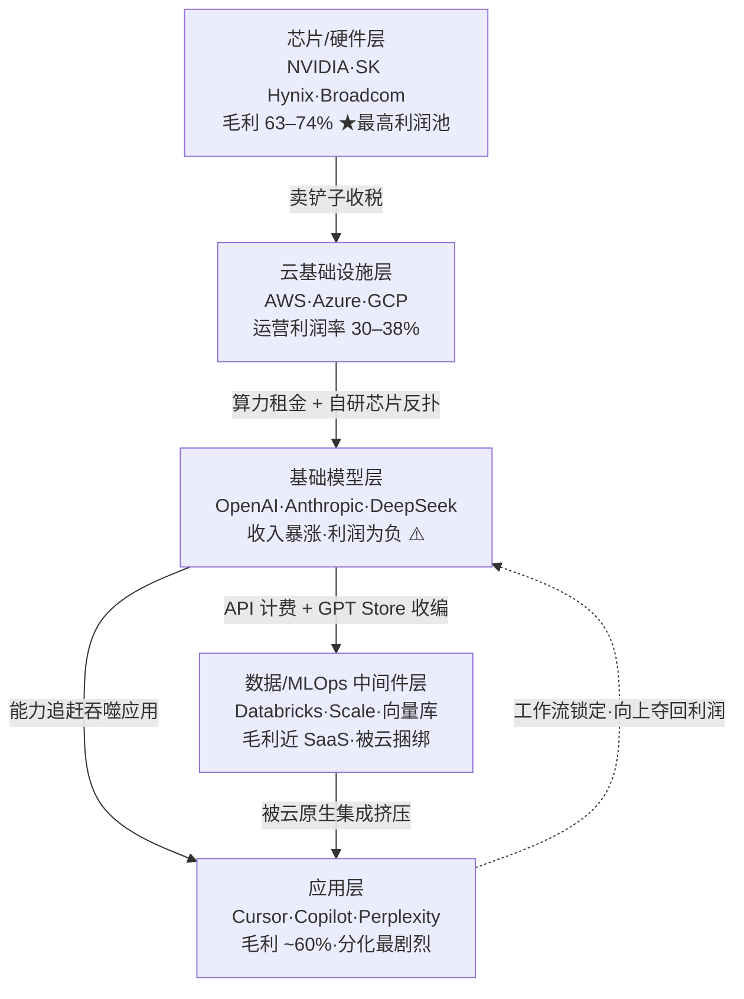

要回答"这个 AI 产品的钱从哪来、护城河在哪、能活多久"，第一步不是看产品本身，而是把它放进**整条产业链的价值生态位**里：芯片 → 云 → 基础模型 → 数据/MLOps 中间件 → 应用层，每一层有自己的利润池、议价权和被上下游吞噬的方式。本节点提供一张"利润池在哪、谁在向谁收税、利润随什么下移"的解剖图——它要解决的核心问题是：**当你为一个 AI 产品做选型或定位时，怎么判断它处在的那一层是"收税位"还是"被收税位"，以及这个位置在未来 24 个月会不会塌。**

> [!warning] 这是一张会过期的地图
> 本节点的所有商业数字截至 2026Q1。利润池分布是 0434 专题里**最易随时间漂移**的一节——推理价格每季度下台阶、巨头每季度向相邻层垂直整合。读者要学的不是"NVIDIA 毛利 73%"这个数字，而是"为什么硬件层能维持 73% 而模型层做不到"的结构性逻辑。数字会变，结构性耦合不会。

---

## §0 为什么用"价值生态位 + 利润池"框架，而不是"技术栈分层"

工程视角的"AI 技术栈分层"（硬件/框架/模型/应用）回答的是"由什么技术组成"。但 PM 要回答的是"钱在哪一层沉淀、谁能把价值锁住"——这是两个正交的问题。一个技术上很"高级"的层，商业上可能是利润荒漠（基础模型层就是典型：收入暴涨、利润为负）。

本节点借用 Michael Porter 的**价值链/议价权**框架（来源：Porter《Competitive Strategy》1980，框架本身确证），但做一个 AI 时代的关键改写：**传统价值链假设每层的相对议价权是慢变量；AI 产业链的议价权是按季度重排的快变量**，且**利润池会随底层能力商品化而系统性下移**。这就是为什么不能用一张静态的"分层图"打发——必须叠加"利润随时间往哪一层流"的动态。

> [!note] 框架选择的赌注
> 我赌"利润池随时间下移"这条主线在 2026–2028 仍成立（即应用层会逐步从基础设施手里拿回更大份额）。如果出现一个全新的硬件范式（如光子计算重置 GPU 优势）或 AGI 级模型让应用层无差异化空间，这条主线会失效——见本节点 §6 failure scenario。

---

## §1 五层利润池总览：谁在向谁收税

| 层 | 代表玩家 | 利润池特征 | 议价权来源 | 主要被谁威胁 |
|---|---|---|---|---|
| 芯片/硬件 | NVIDIA、SK Hynix、Broadcom | 毛利 63–74%，当前**最大利润池** | CUDA 生态锁定 + HBM 寡头 | 云商自研 ASIC（TPU/Trainium）、AMD |
| 云基础设施 | AWS、Azure、GCP | 运营利润率 30–38%，规模即护城河 | 资本强度 + 客户数据引力 | 互相挖角；AI 服务毛利被推理成本拉低 |
| 基础模型 | OpenAI、Anthropic、DeepSeek | 收入暴涨**但利润为负** | 前沿能力 + 分发绑定 | 开源追近 6 个月、推理价崩塌 |
| 数据/MLOps | Databricks、Scale、向量库 | 毛利接近 SaaS，增速高 | 数据管道粘性 | 超大云商原生捆绑（中间件陷阱） |
| 应用层 | Cursor、Copilot、Perplexity | 毛利约 60%，分化最剧烈 | 工作流嵌入 + 数据飞轮 | 被模型层能力追赶、被平台收编 |

**一句话读法：** 越靠下（硬件）利润越厚但增长趋缓且面临云商自研反扑；越靠上（应用）利润分化越剧烈、上限取决于能否把"用最好的模型"变成"被锁进我的工作流"。中间的基础模型层是**收入最高、利润最差**的"绞肉机"——这是整张地图最反直觉的地方。

---

## §2 逐层利润池解剖（带数字、带议价权来源）

### 2.1 芯片层——当前最厚的利润池，但已现下调信号

- NVIDIA FY2025（截至 2025 年 1 月）数据中心营收 **$1,152 亿**，同比 +142%；毛利率 **73.4–73.6%**（来源：NVIDIA SEC 8-K，2025，确证）。
- SK Hynix HBM 内存毛利率 **63–67%**，超过代工龙头 TSMC 的约 60%（来源：LongYield，2026，分析师数据）。
- Broadcom AI 营收 FY2025 约 **$120 亿**，YoY +170%+，控制约 60% 定制 ASIC 协同设计市场（来源：Silicon Analysts，2026）。

**议价权来源：** CUDA 软件生态的迁移成本 + HBM 的物理寡头格局。**威胁：** 云商自研芯片 TCO 优势约 40–65%（来源：Silicon Analysts，2026），意味着 NVIDIA 最大的客户正在变成它的竞争者；GPU 市场份额预估从 2024 年约 86% 降至 2026 年约 75%（来源：Silicon Analysts，2026，预估值〔待核实精确口径〕）。

### 2.2 云基础设施层——高毛利的"管道收费员"

- AWS 2025 年化营收约 $1,150 亿，运营利润率 34–38%；Google Cloud 年化约 $460 亿，运营利润率首破 30.1%（来源：Silicon Analysts，2026）。
- 超大规模云商 2026 年 CapEx 承诺合计**超 $6,000 亿**（来源：dcpulse.com，2025）。
- 关键裂缝：AI 服务毛利约 **50–60%**，显著低于传统云服务的 77%+（来源：LongYield，2026）——AI 不是在提升云的利润率，而是在稀释它。

### 2.3 基础模型层——收入最高、利润最差的绞肉机

- OpenAI 2025 年 ARR **$200 亿**（来源：TradingKey，2026），但 2024 年亏损约 **$50 亿**（来源：Amadeus Capital，2025），预计 2030 年前不盈利。
- 企业市场份额已重排：Anthropic **32%**、OpenAI **25%**（从 2023 年底约 50% 下滑）、Google 20%、Meta Llama 9%（来源：Menlo Ventures，2025 年中报告，确证）。
- **推理价格崩塌**（自 2023 年 3 月以来前沿 LLM 平均输出价格下降约 94.5%，来源：BenchLM，2025）：

| 时间 | GPT-4 级性能价格（每百万 token） | 相对降幅 |
|---|---|---|
| 2023 年 5 月（GPT-4 发布） | $30 输入 / $60 输出 | 基准 |
| 2024 年中（GPT-4o） | $2.50 输入 | -92% |
| 2025 年 | $0.40–$0.80 | 约 -97% |

> [!note] DeepSeek 成本数字的认识论纪律
> DeepSeek 官方称 V3 训练边际成本约 **$557.6 万**（来源：DeepSeek 技术报告，2025，确证）。但 SemiAnalysis 指其实际拥有约 5 万张 Hopper GPU，$557.6 万仅为单次训练边际成本，不含基础设施、研发、消融实验（来源：The Register，2025-09）。**数字是真的，但用来论证"训练已白菜价"是选择性披露的误读。** 这正是 §8 事实接地纪律要求的：可证伪的硬数字必须标注口径。

### 2.4 数据/MLOps 中间件层——增长快但被云捆绑

- MLOps 市场 2024 年约 $17 亿，预计 CAGR 37.4%，2034 年达 $390 亿（来源：landbase.com，2025〔待核实预测口径〕）。
- Databricks 营收约 $54 亿（截至 2026 年 2 月，来源：ainvest，2025）。
- **结构性风险：** AWS/Azure/GCP 都在把 MLOps 功能内化进原生服务，独立中间件的生存空间被压缩——这是后文 S02/E0x 会展开的"中间件陷阱"。

### 2.5 应用层——分化最剧烈、护城河待检验

- Cursor ARR 从 $1 亿（2025-01）→ $5 亿（2025-06）→ $10 亿（2025-11）→ **$20 亿（2026-02）**，史上最快 B2B SaaS 增速；Series D 估值 $293 亿（2025-11）（来源：CNBC、SaaStr，确证）。
- GitHub Copilot 2025 年 7 月累计 **2,000 万+ 用户**，护城河来自 GitHub 2 亿仓库 + 1 亿开发者的分发优势（来源：TechCrunch 引 Microsoft 财报，2025）。
- 应用/SaaS 毛利约 60%，低于传统 SaaS 的 80%（推理成本所致，来源：LongYield，2026）。
- 2025 年企业 AI（生成式 AI）市场约 $370 亿，**约 51% 流向应用层（约 $190 亿）**，约 49% 流向基础设施（约 $180 亿）——注意这是**支出/价值**口径，非严格利润口径（一手来源：Menlo Ventures《2025: The State of Generative AI in the Enterprise》，应用层 $19B vs 基础设施 $18B；LongYield 2026 转引同一数据。两源一致，已交叉验证）。

---

## §3 判断主轴：五个层间致命耦合 / 误判（四件套）

这是本节点的命门——90% 的人在判断 AI 产品价值生态位时，会在以下五处搞错。每点给**症状 → 为什么会错 → 正确做法 → 真实反例**。

### 误判一：把"在应用层"当作"安全位"，忽视被模型层吞噬

- **症状：** "我们做应用层，不碰昂贵的训练，离用户最近，最安全。"
- **为什么会错：** 模型实验室会系统性识别成功的 API 用例，原生复制并以更低价提供。2023 年 11 月 GPT Store 上线（$20/月即可建自定义 GPT，确证）一夜消灭一批专项套壳应用。应用层离用户近，但也最先暴露在模型层的"探照灯"下。
- **正确做法：** 判断应用层产品时，问"这个功能如果明天被模型原生支持，还剩什么？"——剩下的那部分（专有数据、工作流锁定、分发）才是真护城河。
- **真实反例：** Jasper AI（融资 $1.25 亿，峰值估值 $15 亿，确证）的价值主张是"更好的营销内容提示词"，2022 年 11 月 ChatGPT 发布后用户发现可免费获 80% 等效输出，护城河近乎归零，被迫转型企业 Copilot（来源：Sacra、quasa.io）。Cursor 同样起步于 GPT-4 wrapper，却因 IDE 深度整合 + 代码库上下文积累活成了 $20 亿 ARR——**同样在应用层，被吞噬还是夺回利润，取决于工作流锁定深度。**

### 误判二：把"基础模型层"当作价值链顶端，按收入而非利润定位

- **症状：** "模型层是 AI 的大脑，最有价值，应该重仓。"
- **为什么会错：** 模型层是**收入暴涨、利润为负**的绞肉机。推理价 2 年跌 94.5%，开源 6 个月追近，模型本身正在商品化。OpenAI ARR $200 亿但 2024 亏 $50 亿。把"收入规模"误读为"利润位置"是经典错位。
- **正确做法：** 区分"收入池"和"利润池"。模型层是最大收入池，但利润被两头挤——上游 NVIDIA 收走毛利 73%，下游应用层占走约 51% 的企业 AI 支出/价值（来源：Menlo Ventures 2025；此为价值占比，非利润占比，勿过度外推为"利润"）。模型公司真正能赚钱的是**分发绑定**（Azure/Office/Windows 之于 OpenAI），不是模型本身。
- **真实反例：** Anthropic 2026 年初取消捆绑 Token 的企业 Seat 套餐改纯用量计费，CEO 解释"用户增速超过产能扩张，旧定价单位经济学不成立"（来源：The Register，2026-04-16，确证）——连前沿模型公司都在为单位经济学挣扎，遑论模型 wrapper。

### 误判三：把"利润池位置"当静态变量，忽视它随商品化下移

- **症状：** "硬件层利润最厚，永远是最好的位置。"
- **为什么会错：** 利润池随底层能力商品化而**系统性下移**。建设期（2023–2025）利润在芯片；部署期（2025–2027）转向云 + 中间件；成果期（2027–2030）转向应用层 + 专有数据资产（来源：LongYield/Amadeus，2026，阶段划分为分析师框架）。在错的阶段押错的层，是最贵的错误。
- **正确做法：** 判断时叠加时间轴——问"这一层的利润是在涨潮还是退潮？" 芯片层已现"引导下调"信号（GPU 份额从 86%→75%）；应用层的企业 AI 支出占比已升至约 51%（价值口径，来源：Menlo Ventures 2025）。
- **真实反例：** DataRobot（融资 $10 亿+）的 AutoML 价值被云服务商原生集成后边缘化（来源：ideaproof.io）——它没看到"中间件利润被云下移/收编"的退潮。

### 误判四：把"被平台垂直整合"误诊为"套壳致死"

- **症状：** "Inflection、Adept 死了，因为它们是套壳。"
- **为什么会错：** Inflection（融资 $15 亿）和 Adept（$4.15 亿）都有较深研究背景，更准确的描述是**被平台垂直整合**（微软 acqui-hire、亚马逊吸收，2024，确证），而非薄 wrapper 结构致死。混淆这两种死法，会让你对"研究型创业是否安全"做出错误判断。
- **正确做法：** 区分两类死亡——(a) 套壳被模型能力追赶致死（Jasper 型）；(b) 有真实能力但被平台垂直整合吸收（Inflection/Adept 型）。前者死于护城河太薄，后者死于站在了巨头必经之路上。判断时要问"我的死法会是哪一种？"
- **真实反例：** GitHub Copilot 是"被平台保护"的反面——它本身就长在微软的分发平台里，所以不存在"被平台收编"风险，护城河来自 2 亿仓库的分发引力（确证）。**同样靠近平台，是被收编还是被庇护，取决于你和平台是竞争还是共生关系。**

### 误判五：把"有数据"当作"有护城河"（专题核心迷思）

- **症状：** "我们沉淀了大量业务数据，这就是 AI 护城河。"
- **为什么会错：** 静态数据集通常不构成护城河（来源：a16z《The Empty Promise of Data Moats》，Casado & Lauten，2019，至今广泛引用）。多数运营数据受隐私/合规约束无法用于训练，且格式不对、信号不纯。真正起作用的是**闭合反馈回路**（任务特定信号实时回流训练），不是数据体量。
- **正确做法：** 用"数据可访问性 × 任务特定信号强度"二维矩阵判断：只有"壁垒高 + 信号强"才是真护城河；"可复制 + 信号弱"是零护城河。问的不是"有多少数据"，而是"用户每次交互是否产生不可复制、可直接优化模型的信号"。
- **真实反例：** Cursor 的代码"接受/拒绝建议"是即时任务特定信号（真飞轮）；而一家 SaaS 公司声称的"客户数据护城河"多受合同/隐私约束、是静态历史数据，无法形成闭环（来源：Value Add VC，2024；a16z，2019）。本专题会在"数据飞轮的真伪"节点深入展开这一迷思。

> [!warning] 招聘 JD 里的僵尸迷思
> "有数据就有护城河"已被反复证伪，却仍是 AI PM JD 里的高频要求。面试时如果你能指出"大多数业务数据不可复用为训练优势，真正的飞轮需要闭合反馈 + 任务特定信号"，就是 30 秒内拉开判断力差距的位置。

---

## §4 产品 PM 视角补盲：利润池之外的三个看走眼点

工程视角只看技术分层，PM 必须补三个商业/用户/合规盲点：

1. **留存率的"AI 游客"陷阱（用户心理）：** AI 原生公司中位 NRR 仅 48%、GRR 仅 40%（来源：ChartMogul，2025，N=2,100），但高价位（>$250/月）NRR 可达 85%。大量早期用户是实验性"游客"而非生产用户，导致护城河虚高后暴跌。判断应用层产品时，留存曲线比 ARR 增速更诚实。
2. **定价模式即护城河信号（商业模式）：** 一个产品敢不敢做 outcome-based 定价（按结果收费，如 Intercom Fin $0.99/解决对话），暴露了它对自己价值锁定的信心。Seat 定价在 AI 时代正被侵蚀（占比从 21%→15%），因为一个用户借 AI 可干五个人的活，Seat 收费与价值脱钩。
3. **合规即利润池的隐形闸门（合规边界）：** 垂直专有数据护城河（Harvey 法律、Nabla 医疗）的真正壁垒不是数据量，而是**合规准入**——HIPAA/GDPR 限制了谁能碰这些数据。这既是护城河也是天花板。

---

## §5 对手框架回应：接受 + 边界

### 对手一：Andrew Chen——"套壳类比 90 年代 CRUD 应用，最终靠网络效应胜出"

- **接受：** 他对的部分是"最先进模型与开源差距仅约 6 个月"（来源：andrewchen.substack.com），所以纯技术差异确实不构成长期护城河，胜负要靠网络效应/分发——这与本节点"利润下移到工作流锁定"一致。
- **边界：** 但我坚持 AI 周期比 Web 压缩得多，留给应用层"在被吞噬前建起飞轮"的时间窗口更短。CRUD 应用有十年长跑空间，Jasper 只有不到一年。**赌注：** 我赌"窗口期 < 2 年"，若错（窗口其实有 3–5 年），则当前对套壳的悲观评估过严。

### 对手二（Rick 未读框架引入）：Clayton Christensen《The Innovator's Dilemma》的"价值链利润迁移"

- **引入理由：** Christensen 的"利润守恒定律"（Law of Conservation of Attractive Profits）精准预测：当一层被商品化，**相邻层会出现新的可锁定利润**。这正解释了为什么模型商品化后利润流向应用层和芯片层两端，而非凭空消失。
- **对本节点的逼问：** 它提醒我，不要假设"商品化 = 利润蒸发"。利润不灭，只是迁移。所以判断时不能只问"哪一层在商品化"，要问"商品化把利润推到了哪个相邻层"。

### 对手三（Rick 未读框架引入）：Hamilton Helmer《7 Powers》

- **引入理由：** Helmer 把护城河拆成 7 种 Power（规模经济、网络经济、反向定位、转换成本、品牌、垄断资源、流程能力）。它逼问本节点"工作流锁定"这个模糊词——到底是**转换成本（Switching Cost）**还是**网络经济（Network Economies）**？Cursor 的护城河主要是前者（团队代码库上下文沉淀），不是后者。
- **对本节点的修正：** 用 7 Powers 拆解，能避免把所有应用层护城河笼统归为"工作流嵌入"。这是后续 S02 节点要做的精细化工作。

---

## §6 failure scenario：本节点结论在哪些场景失效

1. **AGI 级模型出现：** 若模型层能力强到让所有应用层无差异化空间（"模型即应用"），则"利润下移到应用层"主线失效，价值重新上移到模型层。〔目前无证据，但需监控〕
2. **硬件范式重置：** 若光子/存算一体计算重置 GPU 的 CUDA 优势，芯片层利润格局推倒重来，NVIDIA 73% 毛利不再是稳态。
3. **垂直整合赢家通吃：** 若超大云商（Google 从 TPU→Gemini→Workspace AI 全栈）的垂直整合成功到压垮所有独立玩家，则"分层利润池"框架本身失效，退化为"巨头通吃"。
4. **企业 AI 市场应用层 51% 是"支出/价值"占比而非"利润"占比：** 这个支撑"利润下移"的关键数字现已多源核实（Menlo Ventures 一手 + LongYield 转引一致），但它度量的是企业 AI **支出流向**（应用层 $19B / 总 $37B），不直接等于利润分布。若把"价值占比 51%"等同于"利润占比 51%"，则成果期判断会高估应用层盈利能力，需以毛利数据（应用层毛利约 60%，低于传统 SaaS）二次校正。
5. **推理价格触底反弹：** 若电力/冷却成本（Vertiv+Schneider 寡头）成为硬下限，推理价不再下跌，则"模型商品化挤压应用层成本"的动力减弱。

> [!note] confirmation-bias 砍除
> 本节点早期反复引 Cursor 作为"应用层夺回利润"的正面案例——这是 bias。补入反例：Cursor 的 $20 亿 ARR 高度依赖单一品类（AI 编码）的爆发，且 60% ARR 来自企业（单一来源数据），其飞轮在非编码场景能否复制**未经验证**。不能用一个 outlier 论证整个应用层的护城河可持续性。

---

## §7 PM 决策启示

- **面试桌：** 被问"你怎么看 AI 应用层创业的前景"——别说"前景广阔"。说"先看它处在利润涨潮还是退潮的层，再看它的功能被模型原生支持后还剩什么；如果剩下的是闭合飞轮 + 工作流转换成本，看多，否则它在赌一个 <2 年的时间窗口。"
- **选型会：** 评估一个 AI 中间件/平台供应商，问"这个能力会不会被你依赖的云商在 12 个月内原生捆绑？"（中间件陷阱）。
- **做自己的产品定位：** 用 §3 五个误判逐条自检——我在应用层是被吞噬位还是锁定位？我的"数据护城河"是真飞轮还是静态数据集（误判五）？我的死法会是套壳致死还是被平台收编（误判四）？

---

## §8 与已有节点的关系（升级对照，不复述）

- **对 [m209 - 推理成本控制手册](/kb/工程化与落地架构/m209-推理成本控制手册/) 的升级：** m209 停在"工程降本手段"层（缓存/路由/压缩）。本节点把"推理价 2 年跌 94.5%"从"我该如何省钱"升级为"它如何重排整条产业链的利润池、把利润从模型层挤向两端"——同一事实，从工程成本视角升到产业结构视角。
- **对 0413 成本工程专题的升级对照：** 0413 在"成本即商业模式"层做 unit economics（COGS/CAC/LTV/毛利）。本节点是它的**空间维度**：0413 回答"单个产品的成本结构怎么算"，本节点回答"这个成本结构把产品摆在了产业链的哪个议价位"。两者互为经纬。
- **对 0425 信号专题的升级对照：** 0425 讲信号坍缩 → 平台价值命题（当能力信号被 AI 抹平，平台成为新的可信信号源）。本节点提供其**产业落点**：信号坍缩的最终受益者是控制分发/工作流的应用层与平台层，这正解释了利润为何下移到这两处。
- **对 0430 API policy 专题的升级对照：** 0430 论证"API policy 即护城河"（平台准立法权）。本节点给出它的**利润含义**：GPT Store / Anthropic 改计费 / 出版商分成，都是模型层用 API policy 把中间件和应用层的利润重新定价——政策即护城河，在利润池地图上就是"收税权"。
- **对 0428 组织采纳专题的升级对照：** 0428 讲采纳决定 LTV（技术对了也可能死于组织不采纳）。本节点的"AI 游客留存陷阱"（NRR 48%）是它的**宏观证据**：应用层利润占比再高，若组织采纳不实，留存崩塌会让利润池估值虚高。
- **对 [Perplexity](/kb/ai-公司与产品/perplexity/) 的升级对照：** Perplexity 是"产品形态领先 + 单位经济亏损"的应用层 pessimistic case。本节点把它定位为"在退潮的搜索利润池里、用 RAG+LLM 双成本结构、与 [OpenAI](/kb/ai-公司与产品/openai/)、[ChatGPT](/kb/ai-公司与产品/chatgpt/)、Google 三方夹击中求生"——补足了 Perplexity 节点缺失的产业链议价位视角。

Rick 一手经验的接地：滴滴双边市场 + 网络效应 + 国际化（不同市场利润池）的经验，恰是判断 AI 产业链利润池的现成参照系。费用治理（平台双边纠纷的成本分摊）类比 AI 产品的 per-query 成本归因；PDP现金支付纠纷治理 里"不同市场利润池差异巨大"的实战，正是本节点"利润池随生态位/地域漂移"的活样本。

---

## §9 关联节点

**核心（必读）：**
- [m209 - 推理成本控制手册](/kb/工程化与落地架构/m209-推理成本控制手册/)——本节点"推理价崩塌重排利润池"的工程底座
- [Perplexity](/kb/ai-公司与产品/perplexity/)——应用层 pessimistic case 的活标本
- [AI PM 知识图谱·总索引](/kb/ai-pm-知识图谱/ai-pm-知识图谱-总索引/)——回到全局地图
- [OpenAI](/kb/ai-公司与产品/openai/) / [Anthropic](/kb/ai-公司与产品/anthropic/) / [ChatGPT](/kb/ai-公司与产品/chatgpt/) / [Claude](/kb/ai-公司与产品/claude/) / [DeepSeek](/kb/ai-公司与产品/deepseek/)——基础模型层主要玩家
- [Scaling Laws](/kb/基础知识库/scaling-laws/)——理解模型层能力商品化的底层动力

**延伸（可选）：**
- [Agent](/kb/基础知识库/agent/)——Agent 形态如何改变应用层定价与利润捕获
- [幻觉](/kb/基础知识库/幻觉/)——可靠性约束如何成为应用层合规护城河的隐形天花板
- 0133新制度经济学——平台"收税权"的制度经济学解释
- 0133信息经济学——信息不对称与议价权分配
- 费用治理 / PDP现金支付纠纷治理——Rick 双边市场利润池一手经验

---

## 修订日志
- 2026-06-07 R0：首稿。建立五层利润池地图框架（Porter 价值链 + 利润下移改写）；五个层间致命耦合误判（四件套）；引入 Andrew Chen / Christensen 利润守恒 / Helmer 7 Powers 三个对手框架；与 0413/0425/0428/0430/m209/Perplexity 升级对照；接地全部商业数字至来源，DeepSeek 成本与 GPU 份额预估标注口径争议。
- 2026-06-11 P3.1 接地修复：原"应用层占 51%（来源 LongYield，分析师估算〔有争议〕）"为单一来源，经多源核验升级——补一手来源 Menlo Ventures《2025: The State of Generative AI in the Enterprise》（应用层 $19B / 总 $37B = 51%，基础设施 $18B = 49%），与 LongYield 转引一致，去除"有争议"标注；同时全文将该数字从"利润占比"改正为"支出/价值占比"口径，避免把价值占比误读为利润占比（来源：https://menlovc.com/perspective/2025-the-state-of-generative-ai-in-the-enterprise/ ）。
