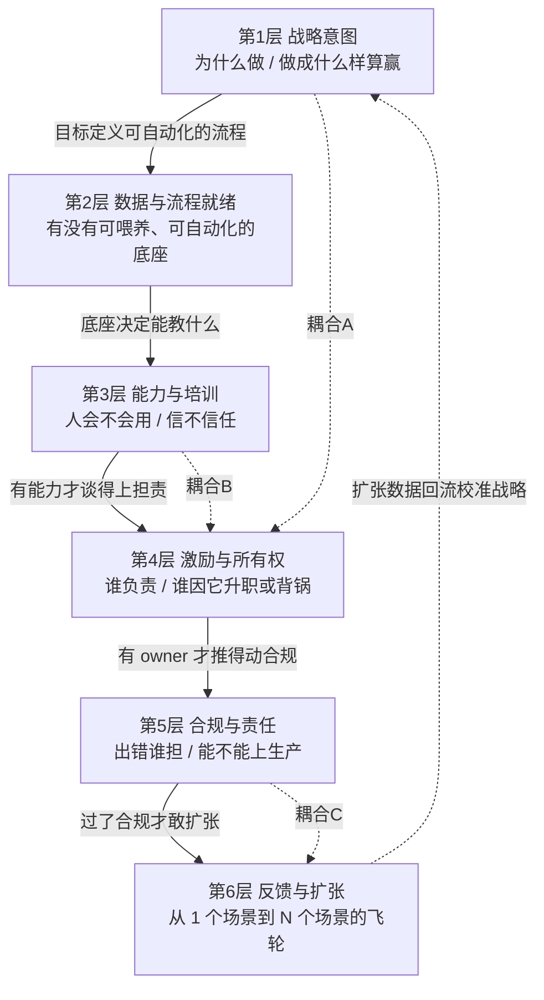

# S01 AI 组织采纳分层剖面

一个企业把对的模型选对了、demo 在董事会上惊艳了，半年后项目却死在"没人愿意用、没人对它负责、合规过不了关"——本节点要解决的问题是：**AI 从 demo 到 enterprise adoption 的鸿沟，到底由组织的哪几层组成，层与层之间在哪里会致命地脱钩**。它不是又一张"AI 成熟度雷达图",而是一张**带耦合箭头的分层解剖图**:把组织采纳拆成战略意图 / 数据与流程就绪 / 能力与培训 / 激励与所有权 / 合规与责任 / 反馈与扩张 六层,逐层给摩擦点与 PM 清单,再用"层间致命耦合"这把刀,解释为什么单独修任何一层都不解决问题。本节的视角框架名:**采纳分层 + 耦合诊断（Stratified Adoption with Coupling Diagnosis）**。

---

## §0 为什么是"六层耦合"而不是"成熟度阶梯"或"Crossing the Chasm"

读者脑中至少有三个默认框架会抢占这个位置,先逐一挡掉。

**默认框架一:成熟度阶梯(maturity ladder)。** Gartner、各大咨询都有"AI 成熟度 L1→L5"的爬梯图。它的隐含假设是:采纳是**单调上升、可线性打分**的——把每一层修好,自然爬到顶。但企业 AI 失败的真相恰恰是**非单调、非线性**的:你可以同时拥有顶级的数据基础设施(第 4 层成熟)和形同虚设的所有权(第 4 层崩塌),结果是高成熟度的数据喂养着一个**没人对结果负责**的系统,反而放大风险。成熟度阶梯把"层"画成台阶,掩盖了"层间耦合"这个真正的杀手。我们要的不是台阶,是**带横向耦合箭头的剖面**。

**默认框架二:Crossing the Chasm 的市场鸿沟。** Geoffrey Moore(*Crossing the Chasm*, 1991/2014)的鸿沟,描述的是**市场层面**早期采纳者与早期多数之间的断裂带。它极有解释力——Jakob Nielsen(UX Tigers, 2025)就把它映射到企业 AI:代码辅助、聊天机器人已跨越鸿沟,AI agent、自动驾驶仍在早期采纳区。但 Moore 的鸿沟是**公司与公司之间**(谁买、谁不买)的市场断层;本节点关心的是**一家公司内部**从 pilot 到 production 的组织断层——"试点地狱(pilot purgatory)"。两者结构相似(都是断裂带),但治理对象完全不同:Moore 的处方是"聚焦细分市场建标杆参考",对企业内部多业务线同时要 AI 转型几乎不可操作(详见本专题 G 层代际节点对 Moore 适用性的讨论)。我们借用"鸿沟即结构性断层"的直觉,但把它**内化为组织六层之间的耦合断裂**。

**默认框架三:纯变革管理模型(Kotter/ADKAR/Lewin)。** 这些是组织行为学的经典,本专题的 E 层节点会专门拆解它们与 AI 部署摩擦点的对照。但它们有一个共同盲区:**几乎不处理技术基础设施与数据就绪**。Kotter 八步里没有"先把流程梳理到可被自动化"这一步;ADKAR 的 K(知识)和 A(能力)假设要学的东西是稳定的,而 AI 部署是"持续解冻"——模型迭代、数据漂移意味着永远无法"再冻结"(Lewin 的 Refreeze 在 AI 语境基本失效)。所以本剖面不是"又一个变革模型",而是**把技术就绪层与组织变革层强行并置在同一张剖面上**,专看它们的耦合处。

> [!note] 本节点的赌注
> 我赌的是:**AI 企业采纳的失败,80% 不发生在"某一层做得不够好",而发生在"两层之间没有人负责接力"**。如果未来三年出现一类工具/方法论,能在不改变组织结构的前提下自动弥合层间断裂(例如足够强的 agent 能自己定义问题、自己找 owner、自己过合规),那么本"耦合诊断"框架就会从"核心诊断工具"降级为"过渡期权宜"。这个边界我显式承担。

---

## §1 六层是什么:分层定义与每层的摩擦点

先给出剖面全图,再逐层展开。注意箭头不是"流程先后",而是**依赖与耦合**:上层为下层提供前提,下层向上层回流证据。

| 层 | 它回答的问题 | 主摩擦点 | 失败信号 |
|---|---|---|---|
| **L1 战略意图** | 为什么做这个 AI?成功长什么样? | 目标只到"提效率",无量化 KPI;C-suite 受 AI 营销压力驱动而非商业案例 | 仅 22% 员工表示领导层解释了 AI 将如何应用(行业调查,见下文〔来源待核〕);PoC 审批门槛低于常规 IT |
| **L2 数据与流程就绪** | 有没有可喂养、可被自动化的底座? | 数据散在多系统、不一致、有漂移;流程本身混乱却要 AI 自动化 | Gartner(2025-02):63% 组织没有或不确定是否有 AI-ready 的数据管理实践 |
| **L3 能力与培训** | 人会不会用、信不信任? | 培训停在"看 onboarding 视频";自评能力≠真实能力 | 仅约 28% 员工知道如何使用公司 AI 工具(WalkMe, 2025〔次级引用待核〕);自评与客观测量低相关 |
| **L4 激励与所有权** | 谁负责?它让谁升职或背锅? | 跨 IT–业务边界的"归属真空";KPI 不奖励用 AI | BCG(2024):有强赞助商的变革成功率高 73% ←反证多数项目缺赞助 |
| **L5 合规与责任** | 出错谁担?能不能上生产? | 从沙盒到生产的安全审查、可解释性、监管合规;责任主体不清 | EU AI Act Art.4(2025-02-02 生效)要求"足够 AI 素养";高风险场景部署被合规卡死 |
| **L6 反馈与扩张** | 怎么从 1 个场景扩到 N 个? | 缺学习机制、缺端到端集成;200 个 AI 工具但互不连通 | MIT NANDA(2025):仅约 5% pilot 转化为运营/财务影响;J&J 900 项 GenAI 仅 10–15% 贡献 80% 价值 |

每一层单独看都"有解":数据可治理、人可培训、合规可流程化。**但这正是陷阱**——把六个"有解"的子问题叠在一起,不等于整体有解,因为价值在层间传递时会断裂。下一节是本节点的命门。

---

## §2 判断主轴:三个层间致命耦合(90% 的组织死在这里)

⭐ 这一节是本节点区别于"AI 成熟度模板"的命门。不讲"每层怎么做好",而讲"哪两层之间最常断裂、为什么断、断了什么样、怎么修"。每个耦合给**症状 → 为什么会错 → 正确做法 → 真实反例**四件套。

### 耦合 A:战略层(L1)与所有权层(L4)脱节 → 无 owner 之死

**症状。** CEO 在全员信里宣布"我们要 AI-first",成立了 AI 委员会,采购了平台。一年后问"那个客服 AI 现在谁负责",得到的回答是:IT 说"我们只管把它跑起来",业务说"那是 IT 的项目",数据团队说"我们只供数据"。系统还在运行,但**没有任何一个人的 KPI 里写着它的成败**。这就是"归属真空(ownership vacuum)"。

**为什么会错。** L1 的战略意图天然是**抽象、跨职能**的("提升客户体验"),而 L4 的所有权必须是**具体、单一主体**的(某个有名有姓的人,他的奖金与晋升和这件事挂钩)。战略宣示**不会自动下沉为所有权**——除非有人显式地做"战略→owner"的映射。Rogers(*Diffusion of Innovations*, 1962/2003)区分组织采纳的"权威指令式"与"集体共识式":自上而下的权威推动若不指定 champion 落地,就会悬在空中。多数组织犯的错是默认"高管推了=有人负责了"。

**正确做法。** 战略层每定义一个 AI 目标,必须强制配一个 **single-threaded owner**(借 Amazon 的单线程负责人概念):一个人、一个可量化结果、奖惩与之绑定。PM 在这里的杠杆是:**拒绝接手任何没有指定 business owner 的 AI 项目**——这比任何技术评审都重要。BCG 的 10-20-70 原则(技术 10% / 数据算法 20% / 人流程文化 70%,BCG 广泛引用)在这一层的含义就是:owner 是那 70% 里的承重柱。

**真实反例(也是 confirmation-bias 砍除)。** 我一度想用"高管赞助 = 成功"来说明 L1→L4 通畅。反例:RAND(*Root Causes of Failure for AI Projects*, RRA2680-1, Ryseff et al., 2024-08, 基于 65 名资深从业者深访)列出的五大根因,**第一位是"问题定义失准"**,而非缺技术——本质上是 L1 的战略意图没有被任何 owner 翻译成"要解决的具体问题"。高管赞助若停在口号,反而制造了"看起来有人管"的假象,比公开无主更危险。所以正面案例要补反例:有赞助商≠有 owner;真正的指标是"能不能说出那个人的名字"。

### 耦合 B:能力层(L3)缺失 → 所有权层(L4)的抵触与反向激励

**症状。** 公司指定了 owner,owner 也有 KPI,但一线员工**消极抵抗**:要么绕开 AI 用老办法,要么表面用、暗地不信任输出。owner 越是被 KPI 倒逼推广,一线越是抵触,形成"上级压、下级躲"的对抗。

**为什么会错。** L4 的激励假设"只要给了责任和奖惩,人就会去做"。但责任落到一个**不具备能力、也不信任工具**的群体身上,激励就会**反向**:它不是激发使用,而是激发"应付/规避"。能力(L3)是所有权(L4)能真正生效的**前置条件**——没有 ability,desire 和 accountability 都会扭曲(这正是 ADKAR 模型 A-D-K-**A**-R 的洞察:Ability 缺位,前面的 Awareness/Desire 全部空转)。更隐蔽的是**自评陷阱**:组织常用员工自报告"我会用 AI"作为能力基线,但 Zhang et al.(*How to Assess AI Literacy: Misalignment Between Self-Reported and Objective-Based Measures*, arXiv:2601.06101, LAK2026, 2026-01;已 WebFetch 核实)发现教师群体自评与客观测量**低相关**,普遍系统性高估——基于高估的能力基线去设激励,等于在沙地上盖楼。

**正确做法。** 三件事:(1)能力基线用**客观测量**而非自报告;(2)培训从"看视频"转向"在真实工作流里 peer-to-peer 学习"——McKinsey 指出约七成受训者忽视 onboarding 视频、更依赖实验性与社会性学习(McKinsey, *Reconfiguring Work*, QuantumBlack, 2024);(3)激励设计要**先建能力、再压责任**,顺序不能反。Change Champion(变革倡导者)网络是这里的关键机制:69% 员工主要通过同伴而非正式培训学 AI(Iternal.ai 综合引用,2026〔次级〕)——把激励嫁接到同伴网络上,而非单点压给 owner。

**真实反例 / failure scenario。** 本耦合的诊断在一种场景下失效:**高技能、自驱型团队**(如算法工程师内部用 copilot)。这类人群能力天然到位、信任度高,激励一压就动,L3→L4 几乎不断裂。所以"先能力后责任"这条结论的边界是:**面向广泛、异质、非技术员工时成立;面向同质高技能小团队时可放松。** 把对工程师有效的"直接压 KPI"复制到全员,就是把特例当通则——这是我要砍除的一种 bias。

### 耦合 C:合规层(L5)卡死 → 扩张层(L6)的飞轮启动不了

**症状。** 单个场景的 pilot 跑通了、有 owner、员工也会用、价值也证明了。要扩张到第二、第三个场景时,每一个新场景都要**从零重过一遍**安全审查、数据合规、责任界定。合规成了**单点串行瓶颈**,扩张速度被钉死在"法务/合规团队的吞吐量"上,飞轮转不起来。

**为什么会错。** L6 的扩张逻辑是**指数/飞轮**的(一个成功案例降低下一个的边际成本);L5 的合规逻辑默认是**线性逐案审查**的(每个用例独立评估风险)。两种逻辑的速率不匹配:扩张想要 O(1) 的边际合规成本,合规给的是 O(n)。更深的错位在于**责任主体**:扩张要求"可复用的责任框架",而传统合规给的是"逐案的责任认定"。EU AI Act Art.4 的 AI 素养义务(义务 2025-02-02 生效;AI Act 主体义务总应用日 2026-08-02,治理/罚则自 2025-08-02 起;来源:EU AI Act Article 113 官方文本,ai-act-service-desk.ec.europa.eu/en/ai-act/article-113)恰恰要求按系统复杂度、使用情境、人员角色**差异化**——这既是约束,也暗示了出路:把合规分级模板化。

**正确做法。** 把合规从"扩张的串行门"改造成"扩张的并行护栏":(1)按风险**分级**(低风险用例走快速通道,高风险才逐案审);(2)建**可复用的合规模板/责任矩阵**,让第 N 个场景复用第 1 个的合规资产;(3)PM 在 L1 战略阶段就预判 L5 的合规边界——**先选合规友好的扩张路径**(如内部提效场景先于对外决策场景),而不是等撞墙再回头。这也呼应本专题 P 层(p307 光谱)的判断:在错误成本极低、可自动验证的域才往 Autopilot 推。

**真实反例。** Menlo Ventures(*State of GenAI in the Enterprise*, 2025)报告 47% 的商业 AI 谈判转化为生产部署,**高于**传统 SaaS 的 25%——表面看合规并没卡死扩张。但这是 VC 视角的选择性样本(测的是"商业化 AI 产品的外部采纳",而非"企业内部跨场景扩张的成功率"),与 RAND/MIT 的高失败率叙事**测的不是一回事**。这恰恰说明:耦合 C 的失效边界是**"对内多场景扩张"**——对外采购成熟产品时,供应商已替你做了大部分合规分级,飞轮约束弱;对内自建多场景扩张时,合规串行瓶颈才致命。引用数字前必须先问"它测的是哪个 L6"。

> [!note] 三个耦合的统一刀法
> A、B、C 三处断裂的共同结构是:**相邻两层遵循不同的逻辑速率/责任形态,而没有人显式负责"接力棒"的交接**。诊断任何一个失败的 AI 项目,不要问"哪一层最弱",要问"哪两层之间没有人接力"。这是本节点要让 PM 在选型会上 30 秒说清的判断。

---

## §3 每层的 PM 清单(可打印贴墙)

把诊断转成可操作的检查项。每层 3–4 条,问号式,答不上来就是红灯。

| 层 | PM 上线前必答清单 |
|---|---|
| **L1 战略意图** | ① 成功的量化 KPI 是什么(不是"提效率")?② 不做会损失什么(机会成本)?③ 这个目标能映射到具体可自动化的流程吗? |
| **L2 数据与流程就绪** | ① 喂养它的数据来自几个系统、一致吗、会漂移吗?② 要被自动化的流程本身稳定可测试吗?③ 数据治理的 owner 是谁? |
| **L3 能力与培训** | ① 能力基线是客观测的还是自报告的?② 培训是"看视频"还是"在工作流里学"?③ 有没有 peer champion 网络? |
| **L4 激励与所有权** | ① 能说出那个 single-threaded owner 的名字吗?② 用 AI 让谁升职、不用让谁吃亏?③ owner 的能力(L3)到位了吗(否则激励反向)? |
| **L5 合规与责任** | ① 出错的责任主体是谁?② 合规是逐案串行还是分级并行?③ EU AI Act / 本地监管对这个用例有 AI 素养或可解释性要求吗? |
| **L6 反馈与扩张** | ① 第 2 个场景能复用第 1 个的哪些资产(合规/数据/培训)?② 有端到端学习机制还是孤立工具?③ 扩张路径是否优先选了合规友好场景? |

PM 的元判断:**这六张清单里,最该先答的永远是 L4 的"说得出名字吗"和层间接力问题**——技术清单(L2)可以外包给工程,但所有权与耦合不能。

---

## §4 产品 PM 视角补盲(跳出工程视角)

工程 PM 容易把采纳当"技术集成 + 培训"问题。补三个非工程盲点。

**盲点一:用户心理模型——"AI 焦虑"不是抗拒变化,是抗拒"被替代的叙事"。** 一线员工抵触 AI,表层是 L3 能力不足,深层是 L1 战略沟通把 AI 框定成了"提效率/降成本"——在员工耳朵里等于"裁员前奏"。同一个工具,框定为"帮你卸掉重复劳动、让你做更高价值的事",采纳曲线完全不同。IBM(2026, via Fortune)负责再培训 3000 万人的高管强调:比 skillset 更重要的是 **mindset**;IBM 调研称 2030 年 67% 高管认为 mindset 将超越 skillset。这是 L1↔L3 的隐性耦合:**战略叙事直接决定能力层的心理阻力**。

**盲点二:商业模式——PLG 路径绕过了你的六层。** 传统企业软件采纳是自上而下(L1 战略→采购→部署)。但 GenAI 通过个人信用卡、ChatGPT 效应**从下往上渗透**:员工自己先用上了,组织才后知后觉。这意味着六层的**实际启动顺序可能是倒的**(能力 L3 自发先于战略 L1)。PM 的机会:与其压制影子 AI(shadow AI),不如把自发使用**收编**为 L3 能力基线、反向倒逼 L1 制定战略。这是 Moore 的"whole product/参考客户"路径在 AI 时代被 PLG 打破后的新玩法。

**盲点三:合规边界的 GTM 含义——合规分级就是你的扩张地图。** L5 不只是法务的事。对一个 to-B 的 AI 产品 PM 而言,客户的合规层就是你的 GTM 顺序:先攻"内部提效、低风险、易自动验证"的用例建标杆(对应 Moore 的细分突破),再用这个参考案例帮客户过下一个用例的合规——把客户的耦合 C 变成你的销售飞轮。

---

## §5 对手框架回应(接受 + 边界,不是反驳)

**对手一:Andrew McAfee / "技术乐观派"——"采纳慢只是早期摩擦,工具变强会自动碾平组织阻力"。** 接受:工具确实在变强,很多 2023 年的"组织问题"(如 prompt 门槛、集成成本)已被更好的产品消解,这是真的;部分 L2/L3 摩擦会被技术红利冲掉。边界:但 L4(所有权)和 L5(责任)是**社会-法律建构**,不是技术能消解的——无论 agent 多强,"出错谁担责"这个问题不会因为模型变好而消失,反而因为自主性提高而更尖锐。我赌组织层(L4/L5)的摩擦是**结构性的、长期的**,不是过渡性的。

**对手二:Brynjolfsson 的"生产率 J 曲线"——"现在看不到价值是因为互补性投资(组织重构)的滞后,假以时日会兑现"。** 接受:这个框架极有力,它正面解释了为什么 88% 企业用了 AI 却只有约 6% 实现企业级财务影响(McKinsey, 2025)——价值滞后于投资是历史规律(电力、IT 都经历过)。边界:J 曲线是**事后**解释框架,对**正在**烧钱的 PM 不可操作(你不能跟董事会说"再等五年")。本节点的耦合诊断恰恰是把"互补性投资"具体化为"修哪两层的接力",让滞后期可被主动缩短,而不是被动等待。

**对手三(Rick 未读,破 echo chamber):Wanda Orlikowski 的"技术的实践镜头(technology-in-practice)"。** Orlikowski(MIT, 结构化理论传统)主张技术的意义不在设计时被决定,而在**使用中被持续地、涌现地建构**——同一个 AI 工具在不同团队的实践中会长成完全不同的东西。这逼问本节点的盲点:我的六层剖面隐含了一个**自上而下、可设计**的采纳观,而 Orlikowski 提示采纳是**自下而上、不可完全设计**的涌现过程。回应:我接受 L6 反馈层的本质是涌现的(这也是为什么飞轮不可强行设计),但坚持 L1/L4/L5 仍需显式设计——**涌现需要被设计出来的护栏框住**,纯涌现会变成影子 AI 的失控。

**对手四(Rick 未读):Burnes 的"涌现变革(emergent change)"对计划变革的批判。** Burnes(2004/2020)批评 Lewin/Kotter 式**计划变革**模型不适合复杂适应系统,主张持续涌现的变革范式。这与本节点用"分层剖面"(看起来很计划)有张力。回应:接受 Lewin 的 Refreeze 在 AI 语境失效(持续解冻),所以本剖面**不假设终态**;但分层不等于计划僵化——它是诊断网格,不是施工蓝图。

> [!warning] failure scenario 显式标注
> 本"六层耦合"框架在以下场景会失效或需大改:(1)**纯个人生产力工具**(员工自用 copilot),L4/L5 几乎不涉及组织,六层退化为一两层;(2)**强监管前置行业**(医疗诊断、金融授信),L5 合规不是"耦合断点"而是**第一道门**,顺序要前置;(3)**高度自驱的技术团队**,耦合 B(能力→所有权)几乎不存在;(4)若出现能自主完成"问题定义→找 owner→过合规"的超强 agent,整个耦合诊断框架降级为过渡期工具(见 §0 赌注)。

---

## §6 跨域呼应:Polanyi 的默会知识 × 采纳的真正阻力

调度一个跨域资源:Michael Polanyi 的**默会知识(tacit knowledge)**——"我们知道的比我们能说出来的多(we know more than we can tell)"(*The Tacit Dimension*, 1966)。

它如何改变本节点的技术判断:六层剖面里,L3(能力)和 L6(扩张)最难的部分,**不是显性知识的传授,而是默会知识的迁移**。一个老员工"知道这个客诉该怎么处理"的判断力,大量是默会的——他自己都说不清规则。AI 采纳的深层摩擦在于:(a)要把默会知识**显性化**喂给 AI(L2 数据层最难的不是数据量,是把"老师傅的手感"编码成可训练信号);(b)员工**信任 AI** 的前提,是 AI 的输出能与他的默会判断对齐,而这种对齐无法靠培训文档传递,只能在**共同实践**中长出来(呼应 §5 Orlikowski)。

这把跨域刀直接改写了 L3 的 PM 清单:培训的真正目标不是"教会规则",而是"在共同实践中迁移默会的信任校准"。这也解释了为什么"看 onboarding 视频"无效(显性知识)、而 peer champion 的"手把手"有效(默会知识只能在实践共同体里传)。本节点链入 0117社会学 的实践共同体(community of practice)脉络,以及 Rick 已有的默会知识思考。

---

## §7 PM 决策启示(三类落地)

**面试桌上怎么用。** 当被问"你怎么看 AI 落地难",不要答"要重视数据/培训"(人人都这么说)。答:"AI 落地的失败 80% 不在某一层不够好,而在层间没有接力——最典型的是战略喊了 AI-first 却没有 single-threaded owner(耦合 A),和合规逐案串行卡死扩张飞轮(耦合 C)。我会先问能不能说出那个负责人的名字。"——30 秒展示判断密度,而非综述。

**选型/立项会上怎么用。** 把 §3 的六张清单当 gate:任何 AI 项目立项,先过 L4("说得出 owner 名字吗")和层间接力检查,过不了直接打回——比评估模型能力更优先。这是 RAND 五大根因(问题定义、数据、技术优先心态、基础设施、能力边界)的组织化译法。

**复现/推进时怎么用。** 推进顺序遵循耦合逻辑而非层序号:**先锁 L4 owner → 校 L3 能力基线(客观测) → 选 L5 合规友好的 L6 扩张路径 → 再谈 L2 技术集成**。技术(L2)反而最后,因为它最可外包、最不是瓶颈(BCG 10-20-70 的"10")。

---

## §8 与已有节点的关系(升级对照,不复述)

- **对照 [m207 - Agent 产品化：场景推演与失败模式](/kb/工程化与落地架构/m207-agent-产品化-场景推演与失败模式/)**:m207 §2.4.4 讲的是**单个 agent 内部**的六类失败模式(规划失败/工具调用失败/雪崩效应…)和 HITL 断点。本节点做的是**升维**——把"产品内部的失败模式"升到"组织部署的失败模式",并指出:m207 的技术失败模式,在组织层会被耦合断裂**放大**(一个会雪崩的 agent,落到无 owner 的耦合 A 里,没人会去设兜底)。补缺关系:m207 解决"产品怎么不崩",本节点解决"组织怎么不让对的产品死掉"。

- **对照 [p307 - Copilot 到 Autopilot 光谱](/kb/产品设计与交互范式/p307-copilot-到-autopilot-光谱/)**:p307 §3.7.1 的 L0–L4 自主光谱,与本节点的 L5 合规层、L6 扩张层**正交互锁**——自主度越高(往 Autopilot),L5 责任归属越尖锐、L6 合规飞轮越难转。对话关系:p307 给"该选哪个自主层",本节点给"在这个自主层下,组织六层能不能撑住"。p307 的"错误成本极低 + 可自动验证才往 L4 推",正是本节点耦合 C(合规↔扩张)的产品侧判据。

- **对照 [m208 - AI 基础设施与中间件选型](/kb/工程化与落地架构/m208-ai-基础设施与中间件选型/)**:m208 是 L2(数据与流程就绪)的技术深化。纠偏关系:m208 容易让人以为"选对中间件 = 就绪",本节点提醒——L2 技术就绪只是六层之一,且是最可外包的"10%",真正的就绪是流程稳定可测试(组织问题),不是中间件选型(技术问题)。

- **对照 [幻觉](/kb/基础知识库/幻觉/)**:幻觉是 L5(合规与责任)的技术根源之一——正因为 [幻觉](/kb/基础知识库/幻觉/) 不可完全消除,L5 的"出错谁担责"才不可回避,不能靠"等模型不犯错"来绕过。深化关系:本节点把"幻觉的不可消除性"翻译成"组织必须显式承担责任主体"的治理要求。

- **不复述**:以上节点的技术事实基础(失败模式细节、自主层定义、中间件参数、幻觉机制)均在原节点,本节点只取其与组织六层的**耦合关系**。

---

## §9 关联节点

**核心(必读)**
- [m207 - Agent 产品化：场景推演与失败模式](/kb/工程化与落地架构/m207-agent-产品化-场景推演与失败模式/)——产品内失败 ↔ 组织部署失败的升维对照
- [p307 - Copilot 到 Autopilot 光谱](/kb/产品设计与交互范式/p307-copilot-到-autopilot-光谱/)——自主光谱与合规/扩张层的正交互锁
- [m208 - AI 基础设施与中间件选型](/kb/工程化与落地架构/m208-ai-基础设施与中间件选型/)——L2 数据与流程就绪的技术深化
- [AI PM 知识图谱·总索引](/kb/ai-pm-知识图谱/ai-pm-知识图谱-总索引/)——回到全局坐标

**延伸(可选)**
- [幻觉](/kb/基础知识库/幻觉/)——L5 责任层的技术根源
- [Agent](/kb/基础知识库/agent/)——L6 扩张层的自主性前提
- 0117社会学——默会知识 / 实践共同体的跨域入口
- 本专题同级:[G01 企业技术采纳代际谱系总图](/kb/专题-商业组织与采纳/g01-企业技术采纳代际谱系总图/)(Moore 鸿沟在 AI 语境的代际定位)、[A03 变革管理框架与 AI 部署摩擦](/kb/专题-商业组织与采纳/a03-变革管理框架与-ai-部署摩擦/)(Kotter/ADKAR vs AI 部署摩擦点)、[A04 组织 AI Literacy 建设](/kb/专题-商业组织与采纳/a04-组织-ai-literacy-建设/)(组织 AI literacy)、[A05 AI 项目失败的组织归因](/kb/专题-商业组织与采纳/a05-ai-项目失败的组织归因/)(AI 失败的组织归因)

---

## 修订日志
- R1(2026-06-07):首稿。建立六层剖面 + 三个层间致命耦合(A 战略↔所有权、B 能力↔所有权、C 合规↔扩张)的判断主轴;接入四个对手框架(McAfee/Brynjolfsson/Orlikowski/Burnes,后两个为 Rick 未读破 echo chamber);Polanyi 默会知识跨域呼应;与 m207/p307/m208/幻觉 建立升级对照。已 WebFetch 核实 arXiv:2601.06101(Zhang et al., LAK2026)与 EU AI Act Art.4 生效/执法日期(2025-02-02 / 2026-08-02, EC + artificialintelligenceact.eu)。待办:核实 WalkMe 28%、Iternal.ai 69%、Menlo 47% 等次级引用;_总览 登记后补同专题双链。
- 2026-06-11 P3.1 接地修复:EU AI Act 日期口径按官方 Article 113 改精确——2026-08-02 为 AI Act 主体义务总应用日(原"2026-08-02 起执法"措辞已纠正),补 Article 4 义务 2025-02-02 / 治理罚则 2025-08-02 分层;来源升级为官方 Article 113(ai-act-service-desk.ec.europa.eu/en/ai-act/article-113)。全专题日期已统一为 2026-08-02,官方文本无 "2026-08-03"。
- 2026-06-11 P3.4 校链:§9 延伸节点的"同专题节点全名待 _总览 统一登记后补双链"staging 注解已删,四个同专题节点(G01/A03/A04/A05)已入库,补上真实双链。
