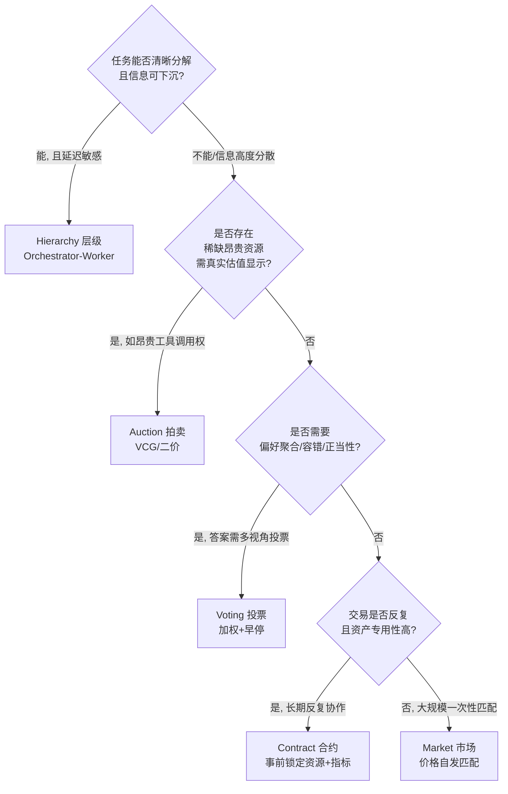

# S02 Agent 协作机制对照矩阵

当你有 N 个 agent 要共同完成一件事——谁先执行、谁有权调那个一次 0.3 美元的搜索工具、当 A 的上下文窗口看不到 B 看到的东西时怎么裁决——你面对的**不是工程调度问题，而是一个机制设计问题**：你在为一群"局部理性、信息不对称、各有 token 预算"的参与者设计游戏规则。本节点把五种协作机制（market / auction / voting / hierarchy / contract）放进同一张对照矩阵，用四个维度（激励相容 / 通信成本 / 抗操纵 / 适用场景）逼出一棵"多 agent 用哪种机制"的决策树。视角不是"哪种最先进"，而是机制设计的核心追问：**给定你的目标，哪套规则能让自利 agent 的均衡行为产出你想要的全局结果。**

## §0 为什么是"机制选择"而不是"框架选择"

读这一节最容易带的错误框架，是把"多 agent 怎么协作"等同于"用 AutoGen 还是 LangGraph"。框架是 API 层的事；机制是规则层的事。同一个框架（比如 LangGraph 的 StateGraph）既能实现层级（一个 supervisor 节点裁决一切），也能实现投票（多个节点产出候选、一个聚合节点多数表决）。**机制决定均衡，框架只决定语法。** 0411 专题的 `[E03 Multi-Agent 框架·AutoGen & CrewAI & DeerFlow](/kb/专题-安全对齐与失败/e03-multi-agent-框架-autogen-crewai-deerflow/)` 已经把框架层对照透了；本节点是它的上一抽象层——不管你用哪个框架，你都得先回答"这群 agent 之间用什么规则分配任务、分配权力、分配昂贵资源"。

第二个要挡掉的错误框架：把这五种机制看成"平行的五选一"。它们其实有**抽象层级差**。Williamson（2009 年与 Ostrom 同获诺奖，获奖理由"对经济治理、尤其是企业边界的分析"，来源：UC Berkeley News 2009-10-12）的交易成本经济学给了一根主轴——治理结构从松到紧是一根**连续谱**：现货市场 → 短期合约 → 长期合约 → 层级内部化。Market 和 hierarchy 是这根谱的两端，contract 是中间态，auction 和 voting 是 market 谱段上的两种具体定价/聚合机制。看清这根谱，决策树才有骨架。

## §1 五种机制的本质定义（先对齐语义）

| 机制 | 一句话本质 | 经济学原型 | Multi-Agent 落地形态 |
|---|---|---|---|
| **Market（市场）** | 价格信号自发匹配供需，无中心调度 | 科斯《企业的性质》中"市场"协调（1937，*Economica*）✅ | agent 按 token 价/能力声誉自由接发任务（如 Diagon 实验平台）|
| **Auction（拍卖）** | 用竞价显示私有估值，规则决定谁得+付多少 | Vickrey 第二价格拍卖（1961，DSIC）✅ | 任务分配竞标、昂贵工具调用权竞拍 |
| **Voting（投票）** | 多 agent 偏好聚合成单一集体选择 | Arrow 不可能定理约束（1951）✅ | 多 agent 产出候选、多数/加权表决（如 RoundTable）|
| **Hierarchy（层级）** | 权威指挥取代价格，supervisor 单点裁决 | 科斯的"企业" / Williamson 内部化 ✅ | Orchestrator → worker 编排（见 `[A06 Orchestrator 编排器](/kb/专题-安全对齐与失败/a06-orchestrator-编排器/)`）|
| **Contract（合约）** | 事前约定资源/时限/成功指标，事后履约 | Contract Net Protocol（1980）+ 委托代理理论 | Principal-Agent RL、Agent Contracts 框架 |

注意：这里的"市场"在 Rick 的概念词典中**无独立实体节点**（唯一出现是面试草稿里的行内链接「双边市场」，尚未实体化），所以本节点不向「双边市场」双链，改以经济学原型节点 0133信息经济学 作为入口；这是事实接地纪律的要求，不造死链。

## §2 四维对照矩阵（核心交付物）

| 维度 ↓ / 机制 → | Market | Auction | Voting | Hierarchy | Contract |
|---|---|---|---|---|---|
| **激励相容（IC）** | 弱~中：价格自发显示，但无说真话保证 | **强**（VCG/二价拍卖 DSIC，说真话是主导策略）✅ | 弱（Gibbard-Satterthwaite：可操纵不可避免）✅ | 不适用（无私有信息显示需求，靠权威）| 中~强（合约可设计为 IC，依赖可验证性）|
| **通信成本** | 中（需持续价格发现）| 中~高（一轮竞价 O(N) 报价，组合拍卖更高）| **高**（候选交换 + 多轮收敛，易退化）| **低**（单点指挥，O(N) 单向）| 低~中（事前一次性协商，事后只验收）|
| **抗操纵** | 低（可串谋、可囤积）| **高**（DSIC 下虚报无益）但组合场景可串谋 | **低**（策略性投票、议程操纵）| 高（无操纵空间，但有权威滥用风险）| 中（取决于合约完备性，不完全合约留漏洞）|
| **适用场景** | 大规模、同质任务、估值分散、可重复博弈 | 稀缺资源/工具权、估值私有且需真实显示 | 偏好异质、需正当性/容错、候选可枚举 | 任务可分解、信息可下沉、低延迟刚需 | 资产专用性高、关系反复、需事前锁定 |

**矩阵怎么读**：没有一行全是"强"。这正是机制设计的根本约束——**Myerson-Satterthwaite 不可能定理**（1983，*Journal of Economic Theory*，"Efficient Mechanisms for Bilateral Trading"）证明，双边私有信息下，效率、激励相容、个体理性、预算平衡四者不可兼得 ✅。映射到 agent：你不可能同时拿到"分配最优 + agent 不说谎 + 自愿参与 + 不烧外部补贴"。**选机制 = 选你愿意在哪一维让步。**

## §3 决策树：多 agent 用哪种协作机制

**这棵树的判断主轴**（区分顶刊与博客的命门——90% 的人会在这四个分叉口搞错）：

| # | 错误分叉 | 症状 | 为什么会错 | 正确做法 | 真实反例 |
|---|---|---|---|---|---|
| 1 | 默认上 market/对等协作显"先进" | PoC 里搞 N 个 agent 自由协商，token 烧光、结果发散 | 把"去中心化"当成目的，忽略 market 的前提是**可重复博弈 + 估值分散 + 大规模** | 任务可分解就先上 hierarchy；market 留给真有大规模匹配需求时 | `[A07 Multi-Agent Teams](/kb/专题-安全对齐与失败/a07-multi-agent-teams/)` 的反共识："三种架构里只有层级式真能落地，对等式是 PM 选型陷阱" |
| 2 | 用 voting 提升"质量/可信" | 让多 agent 投票期望抵消幻觉，反而更慢更差 | 误以为多数票=更准；忽略 G-S 定理（投票可操纵）+ 通信退化 | 投票只在偏好真异质、需容错/正当性时用，且必须加早停 | RoundTable（arXiv:2411.07161）：全票通过比最优方法初始绩效低 **87%**，消息长度增 84%，与前轮相似度升至 90%（通信退化）✅ |
| 3 | 给 agent 拍卖却信它的自报 | 让 agent 竞标任务，按它自报的"我能行/我要 X token"分配 | 误以为 LLM 能准确自评；拍卖 IC 的前提是估值可信 | 拍卖前先校准能力，或用历史数据替代自报 | MarketBench（arXiv:2604.23897）：LLM 对自身成功率和 token 消耗严重**误校准**，基于自报的拍卖偏离最优分配，加历史数据仅小幅改善 ✅ |
| 4 | 把 contract 当万能锁 | 写死一份"完美合约"以为能杜绝偷懒/谋划 | 忽略不完全合约的本质——合约写不尽所有未来情境 | 合约用于高资产专用性的反复协作；接受残余福利损失 | "Mechanism Design Is Not Enough"（arXiv:2605.08426）：不完全合约下必有正的福利损失，任何机制都消不掉 ✅ |

## §4 显式升级对照（不复述旧节点）

本节点是以下既有节点的**机制层抽象升级**，只标差异、不重述事实：

- 对照 `[A07 Multi-Agent Teams](/kb/专题-安全对齐与失败/a07-multi-agent-teams/)`（A06/A07/E03）：A07 在 PM 选型层下结论"层级式唯一可落地、对等式是陷阱、市场式是玩具"。本节点**补它的为什么**——用机制设计语言解释：层级式可落地是因为它绕过了 IC 与抗操纵两大难题（无私有信息显示需求）；对等/市场式难落地正因为它们撞上 Myerson-Satterthwaite 与 G-S 不可能定理。A07 是经验判断，S02 是其理论地基。
- 对照 `[A06 Orchestrator 编排器](/kb/专题-安全对齐与失败/a06-orchestrator-编排器/)`：A06 讲编排器"怎么实现";本节点把 Orchestrator 定位为五机制中 **hierarchy 的工程实例**，并说明它的代价——单点裁决省了通信与操纵成本，但 supervisor 挂了全队停摆（这正是 A07"Manager 挂了能否继续"判据的机制根源）。
- 对照 `[_控制论系统化专题·总览](/kb/专题-人文社科透镜/_控制论系统化专题-总览/)` 的 VSM（Viable System Model）：Beer 的 VSM 把组织分成 System 1–5 的递归可生存层级，其 System 3 的"资源议价"与 System 5 的"政策裁决"本质就是 hierarchy + contract 的混合。本节点与 VSM 的差异：VSM 假设各子系统**目标一致**（自愈性内生），机制设计**不假设目标一致**——恰恰为"目标不一致的自利 agent"设计规则。把 VSM 当 multi-agent 蓝图的人,会漏掉激励对齐这一整层。
- 对照 `[m208 - AI 基础设施与中间件选型](/kb/工程化与落地架构/m208-ai-基础设施与中间件选型/)` §2.5.2：m208 把编排框架当中间件选型（LangGraph/CrewAI/...）。本节点升一层——**框架是机制的容器，不是机制本身**;选完框架仍要选机制，m208 没覆盖这层。
- 对照 `[_成本工程系统化专题·总览](/kb/专题-工程与成本/_成本工程系统化专题-总览/)` / `[m209 - 推理成本控制手册](/kb/工程化与落地架构/m209-推理成本控制手册/)`：m209 讲单 agent 推理成本控制（量化/缓存/分层）。本节点把成本从"单 agent 优化"升到"**多 agent 资源治理**"——昂贵工具调用权该用拍卖分配、token 预算该用 contract 锁定、跨 agent 背压该用 hierarchy 仲裁。这是 m209 的多体扩展。

## §5 对手框架回应（接受 + 边界）

**业界反方一：Stuart Russell 等——"机制设计不够，要内在亲社会 agent"。** Schölkopf 组的"Mechanism Design Is Not Enough"（arXiv:2605.08426）基于不完全合约理论主张：再精巧的机制也有福利缺口，应设计把他人福利纳入自身效用的 prosocial agent。**接受**：不完全合约的福利损失确实存在，纯机制有上限——这正是本节点决策树第 4 个分叉口标出的边界。**坚持的边界**：prosocial agent 的可扩展性实证基础薄弱（小规模实验有效，大规模能否被激励复制〔待核实〕），PM 决策无法等待；现阶段仍应"先用机制兜底,再叠加 prosocial 倾向",而非二选一。

**业界反方二（Rick 未读对手框架）：Elinor Ostrom 的公共池塘自治治理**（*Governing the Commons*, 1990；2009 诺奖，首位女性经济学奖得主，来源：NobelPrize.org ✅）。Ostrom 反对"市场 vs 国家"二元——证明社区可用 8 条设计原则（清晰边界、规则由使用者定、分级制裁、低成本冲突解决、嵌套式治理…）自治管理共享资源，既不靠完全私有化也不靠中央强制。**这对本矩阵是个第六选项**：在五机制之外，存在"agent 共享 context/tool/quota 的**自治治理**"——不预设拍卖或层级,而是让 agent 群体自定使用规则 + 分级制裁。**接受其洞见**：Ostrom 的边界界定原则直接映射 multi-agent 的资源边界问题（哪些 agent 有权用哪个工具池）。**标注边界**：Ostrom 案例参与者是几十到几千人的小社群（Araral 2014 指出其结论在大规模/全球公地未必成立，*Environmental Science & Policy*）✅;agent 数百万级的"数字公地"能否照搬,是开放问题。本节点把自治治理列为决策树的**实验性扩展分支**,而非默认推荐。

## §6 跨域呼应：双边市场激励 ↔ agent 资源治理（Rick 的一手迁移）

> [!note] 独特资产调度
> Rick 在滴滴/99 做过双边市场（司机—乘客撮合）、费用治理与博弈论实战。这一手经验在这里**不是装饰,而是直接迁移的机制原型**。

双边市场治理的核心难题，与 agent 资源治理是**同构**的：

- **信息不对称 → 实名/透明化机制**。滴滴的 `CPF实名验证`、`PAX-Premium实名徽章`、`乘客信息透明化` 本质是机制设计里的"类型显示"——通过强制信息披露降低逆向选择。映射到 multi-agent：MarketBench 揭示的 agent 自评失准，就是"类型不可信"问题;解法同构——用可验证的能力凭证（历史数据、声誉评分）替代自报。**但要警惕反直觉**：Diagon 实验（arXiv:2604.06688）发现身份透明竟**降低**市场绩效——这与滴滴"透明=更好"的直觉相反,提示 agent 市场与人类双边市场不能简单照搬,透明度有最优区间〔实验需更大规模复现〕。
- **机会主义 → 降发生 + 分级制裁**。滴滴 `降发生方法论`（海恩法则：治理事前隐患而非事后纠纷）与 Ostrom 的分级制裁同源。映射到 agent：与其事后检测"谋划/隐藏行动"（委托代理的 hidden action，见 arXiv:2601.23211），不如事前用 contract 设资源上界 + 失控循环检测,把机会主义的发生概率降下来。
- **双边激励 → 机制设计本职**。滴滴双边市场要同时让司机和乘客的自利行为产出平台想要的撮合效率——这正是机制设计"设计规则使自利行为产出全局期望"的定义。Rick 做 `费用治理`、`纠纷治理从裁判到管家`（从中心化裁判转向用户自治）的经验,恰好对应本节点决策树"hierarchy → 自治治理"的迁移路径:当裁判（中央 supervisor）成本过高、信息过载时,机制重心从"权威裁决"转向"规则 + 自治"。这是 Rick 已在真实业务里走过一遍的路。

链入经济学地基：`0133博弈论`、`0133信息经济学`、`0133新制度经济学`。

## §7 PM 决策启示（三类落地）

- **面试桌**：被问"你会怎么设计多 agent 协作"，别答"我用 CrewAI 配几个角色"。答："先判断任务能否分解、是否有稀缺资源需真实估值、是否需偏好聚合——分别对应层级/拍卖/投票。默认从层级起步,因为它绕开了激励相容这道最难的坎。" 再补一句机制设计的不可能定理（M-S）作为边界,立刻显出比"框架选型"高一层的判断密度。
- **选型会**：把 §2 矩阵打出来贴墙上。否决"对等协作"提案时,不要说"太复杂",要说"它撞上 Gibbard-Satterthwaite——投票必可操纵;且 RoundTable 实测全票通过比最优低 87%"。用机制层证据,不用直觉。
- **复现台**：动手时按决策树落地——可分解任务用 `[A06 Orchestrator 编排器](/kb/专题-安全对齐与失败/a06-orchestrator-编排器/)`（hierarchy）;昂贵工具用简单二价拍卖给调用权定优先级;需要资源硬约束就上 Agent Contracts 式的事前 token 预算（arXiv:2601.08815 称迭代工作流 token 减 90%、方差降 525 倍,〔实验室数据,独立复现待核实〕）。

## §8 与已有节点的关系

本节点对 `[A07 Multi-Agent Teams](/kb/专题-安全对齐与失败/a07-multi-agent-teams/)` 做**理论纠偏式深化**（给经验判断补机制设计地基）;对 `[A06 Orchestrator 编排器](/kb/专题-安全对齐与失败/a06-orchestrator-编排器/)` 做**定位升级**（编排器=hierarchy 的工程实例);对 `[m208 - AI 基础设施与中间件选型](/kb/工程化与落地架构/m208-ai-基础设施与中间件选型/)` 做**抽象升层**（框架是机制的容器);对 `[m209 - 推理成本控制手册](/kb/工程化与落地架构/m209-推理成本控制手册/)` 与 `[_成本工程系统化专题·总览](/kb/专题-工程与成本/_成本工程系统化专题-总览/)` 做**多体扩展**（单 agent 成本→多 agent 资源治理);对 `[_控制论系统化专题·总览](/kb/专题-人文社科透镜/_控制论系统化专题-总览/)` VSM 做**前提对话**（VSM 假设目标一致,机制设计不假设)。均不复述旧节点事实基础。

## §9 关联节点

**核心（必读）**
- `[A07 Multi-Agent Teams](/kb/专题-安全对齐与失败/a07-multi-agent-teams/)` — 本节点的经验判断来源,S02 是其机制地基
- `[A06 Orchestrator 编排器](/kb/专题-安全对齐与失败/a06-orchestrator-编排器/)` — hierarchy 的工程实例
- `[E03 Multi-Agent 框架·AutoGen & CrewAI & DeerFlow](/kb/专题-安全对齐与失败/e03-multi-agent-框架-autogen-crewai-deerflow/)` — 框架层(机制的容器)
- `0133博弈论` — 机制设计=逆向博弈论
- `0133信息经济学` — 信息不对称/逆向选择/道德风险地基
- `0133新制度经济学` — 交易成本/治理结构连续谱

**延伸（可选）**
- `[m208 - AI 基础设施与中间件选型](/kb/工程化与落地架构/m208-ai-基础设施与中间件选型/)` / `[m209 - 推理成本控制手册](/kb/工程化与落地架构/m209-推理成本控制手册/)` — 工程与成本对照
- `0134复杂经济学` — 涌现型 agent 经济的视角
- `费用治理` / `降发生方法论` / `纠纷治理从裁判到管家` / `CPF实名验证` / `乘客信息透明化` — Rick 双边市场治理一手原型
- `[Function Calling](/kb/基础知识库/function-calling/)` — 昂贵工具调用权的拍卖对象
- `[强化学习](/kb/基础知识库/强化学习/)` — Principal-Agent RL 合约机制
- `[Agent](/kb/基础知识库/agent/)` — 基础概念卡
- `[AI PM 知识图谱·总索引](/kb/ai-pm-知识图谱/ai-pm-知识图谱-总索引/)` — 总入口

## 修订日志
- R1（2026-06-07）：首稿。建立五机制×四维矩阵 + 决策树 + 判断主轴四件套;接入 Ostrom 自治治理(未读对手框架)与 Russell prosocial(对手立场);跨域呼应落地 Rick 双边市场治理一手迁移;显式升级对照 A07/A06/VSM/m208/m209/0413。待核实项:Diagon 透明度反直觉结果的复现、Agent Contracts 90% 节省的独立复现、prosocial agent 大规模可扩展性。
- 2026-06-11 P3.4 校链:§1 注脚里"双边市场"占位示意去双链改纯文本(全 vault 无此节点),`0133信息经济学` 入口链保留。
