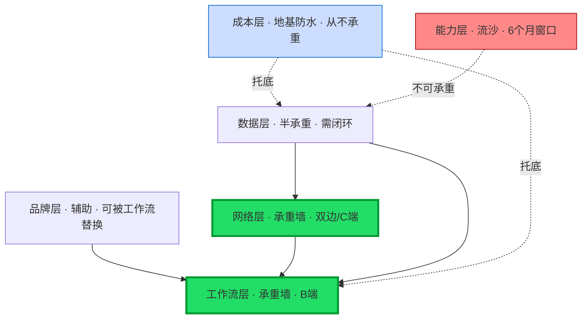
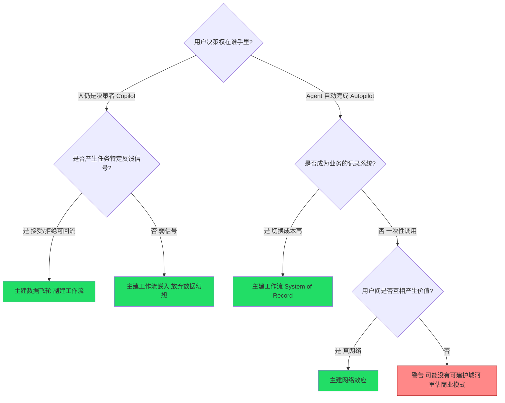

当一个 AI 产品在 BP 里写"我们的护城河是数据飞轮 + 工作流 + 网络效应 + 成本优势 + 品牌"时，它实际上什么护城河都没有——因为这五样不是可以叠加的"五选五"，而是**强度、抗模型更新冲击度、可复制性各不相同的五种相互竞争的资源分配方向**。本节点把五类护城河放在同一张坐标上做"可替换栈"对照（哪一层可以被另一层替换掉，哪一层一旦失守整栈崩塌），给出"该建哪种护城河"的决策树，并提出一个反直觉的核心判断：**在底层模型每月迭代的世界里，最弱的护城河是"能力护城河"（模型能力/算法领先），最被高估的是"数据护城河"，真正可持久的是把前几类咬合进同一个反馈闭环的"复合护城河"。**

## §0 为什么用"可替换栈"框架，而不是"护城河清单"

业界主流写法是"护城河清单"（NFX 的 data network effects、Greylock 的 new new moats、a16z 的 walled gardens），把护城河当成可以勾选的菜单。这个框架对 PM 有害，因为它暗示"建得越多越安全"。真实世界恰恰相反：创业公司资源有限，**五类护城河之间存在替换关系和挤出效应**——把工程资源全押在"用最好的模型"上，就没有资源去做工作流嵌入；把钱烧在补贴网络规模上，单位经济学就崩了。

"可替换栈"框架借用系统架构里的"可替换层"概念：每一层都可以被上/下层部分替换，但有一层是"承重墙"（拆了整栈塌）。判断主轴因此不是"建几种"，而是"**哪一层是你这个产品类型的承重墙，哪些层只是可以妥协掉的装饰**"。这一步框架级辨析挡掉了读者脑中的默认错误框架——"护城河可以累加"。

> [!note] 与 [_成本工程系统化专题·总览](/kb/专题-工程与成本/_成本工程系统化专题-总览/)（0413，待归位，链接见文末降级登记）的抽象层差异：0413 把"成本"当作工程降本 + 单位经济学问题来解；本节点把"成本"降格为五类护城河中**最容易被对手用同一波 API 降价同步追平**的一类，论证它单独不能承重。这是显式升级对照，不复述 0413 的 unit economics 公式。

## §1 五类护城河 × 三维度对照矩阵

把五类护城河（数据、工作流、网络、成本、品牌）放在三个维度上打分。维度定义：
- **基础强度**：理论上能形成多深的切换壁垒（满分越高越强）。
- **抗模型更新冲击度**：底层模型每月迭代时，这层护城河被冲垮的概率（越高越抗冲）。这是 AI 时代相对传统 SaaS 护城河理论新增的关键维度。
- **可复制性（反向计分）**：对手复制它的难度（越高越难复制越好）。

| 护城河类型 | 机制一句话 | 基础强度 | 抗模型更新冲击 | 难复制度 | 承重资格 |
|---|---|---|---|---|---|
| **数据（飞轮）** | 用户交互→专有信号→模型改进→更强产品 | 中-高（有条件） | 中 | 中 | 仅当闭合反馈+任务特定信号 |
| **工作流（嵌入）** | 成为业务的 System of Record，切换成本极高 | 高 | **高** | 高 | ✅ 多数 B 端的承重墙 |
| **网络效应** | 用户越多产品对每个用户越有价值 | 高（真网络罕见） | 高 | 高 | ✅ 但 AI 产品多数是伪网络 |
| **成本** | 推理成本/单位经济学优于对手 | 低 | **极低** | 低 | ❌ 几乎从不承重 |
| **品牌** | 信任/默认选择/分发心智 | 中 | 高 | 中-高 | 辅助层，少数 C 端可承重 |
| 〔对照〕**能力（模型/算法领先）** | 用最强的模型/最妙的 prompt | 低 | **极低** | 极低 | ❌ 最弱，brief 判断主轴 |

**核心反共识判断（可证伪）：** 能力护城河（"我们用了最好的模型 / 我们的 prompt engineering 最强"）在抗模型更新冲击度上得分最低——因为模型每月迭代，今天的能力领先就是 Andrew Chen 说的"最先进模型与开源版本的差距仅约 6 个月"（来源：Andrew Chen, *Revenge of the GPT Wrappers*, andrewchen.substack.com）的那 6 个月窗口。Jasper 的死法就是把全部赌注押在能力护城河上：它的价值主张是"更好的营销文案 prompt"，2022 年 11 月 ChatGPT 发布后用户发现可免费拿到约 80% 等效输出，护城河一夜归零（来源：Quasa.io *The Thin Wrapper Trap: Jasper*；Turing Post）。

**成本护城河为何抗冲击度"极低"：** 推理成本 2023→2025 下降约 80%（来源：techstartups.com, 2025/03），自 2023 年 3 月以来前沿 LLM 平均输出价格下降约 94.5%（来源：BenchLM, 2025）。这意味着任何"我比对手便宜"的成本差，会被下一波全行业同步的 API 降价抹平——成本是被**外生变量**（模型提供商定价）主导的，不在产品控制之内。它能帮你活得久一点（见 [m209 - 推理成本控制手册](/kb/工程化与落地架构/m209-推理成本控制手册/)），但它从不是壁垒。

## §2 "可替换栈"：哪一层是承重墙

把五类按"被谁替换/替换谁"画成栈：

读法：
- **工作流 / 网络是承重墙**——拆了整栈塌。Cursor 不是靠"用了 GPT-4/Claude API"（能力层流沙），而是靠 IDE 深度整合（控制编辑器=控制开发者工作流）+ 跨团队代码库上下文积累（数据层咬合进工作流）+ 多模型切换（主动放弃能力护城河，规避平台风险）。所以它从一个"wrapper"长成了 AI-native（来源：hatchworks.com）。其 ARR 从 2025 年 1 月 \$1 亿一路到 2026 年 2 月 \$20 亿（来源：CNBC、SaaStr）。
- **数据层是"半承重"**——只有当它咬合进工作流或网络（产生闭合反馈+任务特定信号）才承重，否则就是静态数据集，a16z 早在 2019 年就证伪了"静态数据=护城河"（来源：a16z, *The Empty Promise of Data Moats*, Casado & Lauten, 2019）。这正是 brief 要破除的"有数据就有护城河"迷思的栈位置：**数据不能单独承重，它必须被工作流/网络"吊"起来**。
- **能力层是流沙**——不可承重，只能给你 6 个月领先窗口。
- **成本层是地基防水**——它决定你能不能在墙建好之前不被淹死（单位经济学），但它本身不是墙。

## §3 "该建哪种护城河"决策树（brief 判断主轴落地）

决策树的三条硬规则（每条带反例）：
1. **不要把能力当护城河来建**。症状：BP 第一页写"我们用了最新的 GPT-5/Claude"。为什么会错：能力是租来的，房东（OpenAI/Anthropic）随时涨租或自营。正确做法：把能力当"可替换组件"，主动设计多模型切换。反例：Inflection AI 烧 \$15 亿做个人 AI 聊天机器人，能力无法与 ChatGPT 拉开，2024 年被微软 acqui-hire（来源：ideaproof.io）。
2. **数据护城河要先验证"信号纯度"再投**。症状："我们有客户数据，所以有 AI 护城河"。为什么会错：多数运营数据受隐私/合同约束不可训练，且格式不对、信号噪声高（来源：KModels: Unlocking AI for Business Applications, IBM Research, arXiv 2409.05919, 2024）。正确做法：先问"用户每次交互是否产生与模型优化目标一致的接受/拒绝信号"。反例：Tesla 宣称数百亿英里数据是最大护城河，但绝大多数是 L2 辅助驾驶里程，与 Waymo 的 L4 纯自动里程在训练价值上不可同日而语（来源：Stratrix, 2025）。
3. **网络效应要区分"真网络"与"数据规模效应"**。症状：把"用户多→数据多→模型好"当网络效应。为什么会错：a16z 区分框架指出这只是单侧数据规模效应，对手可买可合成可迁移学习追上，不是护城河；真网络效应是"用户间直接产生价值"。正确做法：问"第 N+1 个用户是否让前 N 个用户的体验直接变好"。反例：多数 AI SaaS 的"网络效应"经不起这一问。

## §4 判断主轴：90% 的人在这五类护城河上会搞错的四个点

| 错位 | 症状 | 为什么会错 | 正确做法 | 真实反例 |
|---|---|---|---|---|
| **把成本当护城河** | "我们单位成本比对手低 30%" | 成本由外生的 API 降价主导，全行业同步下降约 94.5% | 把成本当"活命地基"而非墙；它买时间不买壁垒 | 价格套利型 wrapper 在 GPT Store（2023/11 上线，\$20/月自建 GPT）面前批量消亡 |
| **把数据当万能墙** | "有数据就有飞轮" | 静态数据边际价值递减、边际成本递增（a16z 2019）；合成数据/微调降价侵蚀 | 验证闭合反馈+任务特定信号+不可复制性三条件 | DataRobot 的 AutoML 数据/能力被云商原生集成后边缘化（来源：ideaproof.io） |
| **把品牌当承重墙** | "我们是行业第一个，有品牌" | 品牌在能力同质化时只是辅助层，先发≠锁定 | C 端默认选择心智可承重，B 端品牌须由工作流锁定支撑 | Jasper 有品牌有 \$15 亿估值，能力护城河塌后品牌也救不回增长，被迫转型企业 Copilot |
| **把"能力"当长期资产** | "我们 prompt/微调最强" | 6 个月窗口，开源持续追近 | 用窗口期换工作流/网络的承重墙 | Adept AI 的 Agent 能力被基础模型实验室内部复制，2024 被亚马逊吸收 |

注：Inflection / Adept 更准确的死因是"被平台垂直整合"而非"薄 wrapper"，但对 PM 的教训一致——**单押能力层=把命交给房东**。

## §5 产品 PM 视角补盲：商业模式与采纳的护城河

工程视角只看"哪层技术壁垒高"，PM 必须补三个商业盲点：

1. **护城河类型决定定价模式**。承重墙是工作流→适合 seat/平台费（切换成本兜底）；承重墙是数据飞轮且 Agent 自动完成→适合 outcome-based（Intercom Fin \$0.99/解决对话、Zendesk \$1.50–2.00/自动解决，来源：WebSearch 公开定价）。把"成本护城河"当卖点的产品往往陷入价格战，因为它没有别的差异化锚点。
2. **采纳决定护城河能否"启动"**。数据飞轮需要先有规模化的真实生产用量才能转起来——Lightspeed 调查显示 63% 公司发布了 AI 功能但只有 39% 实际在用（来源：Julie Kainz, medium.com, 2025）。"AI 游客问题"导致 AI-native 产品留存虚高后暴跌（AI-native 中位 NRR 约 48% vs 传统 SaaS 约 106%，来源：ChartMogul, 2025）。**没有采纳深度，数据护城河就是空转的飞轮。** 这与 [_组织采纳系统化专题·总览](/kb/专题-商业组织与采纳/_组织采纳系统化专题-总览/)（0428，待归位，见文末）的"采纳决定 LTV"判断显式咬合：采纳不是护城河的前置条件之一，而是数据/工作流两类承重墙的**点火器**。这是升级对照，不复述 0428 的采纳框架。
3. **合规边界会反向锁死或解锁护城河**。法律/医疗的垂直专有数据（Harvey、Nabla）之所以能承重，恰恰因为监管让公开数据不足、让数据不可被合成替代——监管是这类数据护城河的"护城河的护城河"。

## §6 对手框架回应（接受 + 边界）

**对手立场一：NFX「AI 时代护城河是数据网络效应」（来源：nfx.com, *AI Defensibility*, 2024）。** 接受：NFX 正确指出模型本身不是护城河、数据网络效应可以承重。边界：NFX 低估了"数据网络效应"的苛刻条件——它在文中把它与单侧数据规模效应混在一起谈，给了创业者"我有数据就有网络效应"的错觉。本节点坚持：真数据网络效应在 AI 产品里极罕见（Meta、Waymo 级别），多数所谓飞轮是规模效应。

**对手立场二：Greylock「新护城河就是旧护城河」(GTM/分发/PMF)（来源：greylock.com, *The New New Moats*）。** 接受：分发与 GTM 执行力在 2025 年确实可能已超越数据成为第一护城河（GitHub Copilot 靠 GitHub 2 亿仓库的分发优势承重，2000 万+用户，来源：Microsoft 财报 via TechCrunch, 2025）。边界：Greylock 的"旧护城河"说会让 PM 忽略 AI 特有的"抗模型更新冲击度"这一新维度——分发能承重，但前提是产品别把能力层当承重墙，否则分发只是把一个会塌的东西送到更多人手里。

**Rick 未读对手框架引入（破 echo chamber）：**
- **Carlota Perez 的技术革命与金融资本周期论**（*Technological Revolutions and Financial Capital*）：她的"安装期 vs 部署期"框架提示——当前 AI 护城河之争发生在"安装期"（基础设施/资本狂热），此时谈应用层护城河本身可能为时过早，多数护城河判断会在"转折点"后被重写。这逼问本节点的盲点：我们是否在用部署期的护城河逻辑评价安装期的产品？
- **Geoffrey Moore 的「鸿沟」与「保龄球道」模型**（*Crossing the Chasm*）：他的"在单一细分市场建立 whole product 锁定"恰好解释了为什么垂直工作流护城河（Harvey 之于法律）比水平能力护城河更可承重——护城河不是技术属性，是"在某个细分里成为不可或缺的完整方案"。这是对"能力护城河最弱"判断的非 AI 来源佐证。

## §7 跨域呼应：Spence 信号理论与"护城河作为可置信信号"

调度 0133信息经济学 中的 Spence 信号理论（market signaling）。Spence 的核心是：可置信的信号必须是"伪造成本高"的——文凭之所以是能力信号，因为没能力的人考下来成本极高。把这套框架搬到护城河上，得到一个判断的重写：

**为什么成本/能力护城河"不可置信"，工作流/网络护城河"可置信"——因为前者伪造成本低，后者伪造成本高。** 任何对手都能在几天内复制你的 UI、几周内追上你的 prompt、下一波降价同步你的成本——这些"护城河"伪造成本接近零，所以在信号意义上它们根本不传递"我不可被替代"的信息。而工作流嵌入（让客户把业务记录系统迁过来）、真网络（积累用户间关系）的伪造成本极高，对手即使有更强的模型也无法瞬间复制客户的迁移成本和已沉淀的网络。

这把 brief 的"能力护城河最弱"从经验观察升格为信号理论的必然推论：**护城河的强度 ≈ 对手伪造它的成本。** 这一框架还呼应 Rick 滴滴的一手经验——PAX-Premium实名徽章 之所以是有效的安全信号，正因为实名+审核让"伪装成可信乘客"的成本变高；护城河的逻辑与之同构。

## §8 PM 决策启示

- **面试怎么用**：被问"你怎么评估一个 AI 产品的护城河"，不要背"数据飞轮+网络效应"清单。回答："我先问哪一层是这个产品类型的承重墙，再用'对手伪造它的成本'给五类排序——能力和成本伪造成本最低所以最弱，工作流和真网络伪造成本最高所以可承重，数据只有咬合进前两者才承重。" 30 秒说清。
- **选型/投资怎么用**：拿到一份 BP，把它的"护城河"逐条扔进 §1 矩阵和 §3 决策树。凡是承重墙落在能力/成本层的，标红。
- **建产品怎么用**：把工程资源从"追最好的模型"重新分配到"加深工作流嵌入 + 设计任务特定反馈信号"。主动放弃能力护城河（做多模型切换），用省下的窗口期建承重墙。

## §9 与已有节点的关系

- 对照 [m209 - 推理成本控制手册](/kb/工程化与落地架构/m209-推理成本控制手册/)：m209 停在"成本是可优化的工程对象"层；本节点对它做**纠偏**——把成本从"可优化对象"重新定位为"五类护城河中最不能承重的一类"，说明降本买的是时间不是壁垒。不复述 m209 的缓存/路由/压缩手段。
- 对照 [Perplexity](/kb/ai-公司与产品/perplexity/)：Perplexity 是"产品形态领先但成本护城河+能力护城河双弱"的活体样本（RAG+LLM 双成本、被巨头免费答案引擎挤压）。本节点为它补上护城河栈位诊断——它的承重墙必须是品牌/分发心智，而非能力。做**补缺**。
- 对照 0413（成本/COGS）、0425（信号坍缩→平台价值命题）、0430（API policy 即护城河）、0428（采纳决定 LTV）四专题：均为显式升级对照（见 §0/§5/§6 及文末），本节点是它们在"护城河可替换栈"上的**汇聚剖面**，不复述各自正文。

## §10 关联节点

**核心（必读）：**
- [m209 - 推理成本控制手册](/kb/工程化与落地架构/m209-推理成本控制手册/)
- [Perplexity](/kb/ai-公司与产品/perplexity/)
- 0133信息经济学
- PAX-Premium实名徽章
- [Scaling Laws](/kb/基础知识库/scaling-laws/)
- [Agent](/kb/基础知识库/agent/)
- [AI PM 知识图谱·总索引](/kb/ai-pm-知识图谱/ai-pm-知识图谱-总索引/)

**延伸（可选）：**
- [ChatGPT](/kb/ai-公司与产品/chatgpt/) [OpenAI](/kb/ai-公司与产品/openai/) [Claude](/kb/ai-公司与产品/claude/) [幻觉](/kb/基础知识库/幻觉/) 0117社会学
- 本专题同级节点（待建/同批）：S01（架构剖面其一）、E 系列实例剖解（Jasper / Cursor / GitHub Copilot 病理）、A 系列概念辨析（套壳/AI-native/数据飞轮 语义滑变）、`_0434 AI 产品护城河与商业模式系统化专题·总览`

> [!warning] 跨专题双链降级登记：以下四专题文件仍在 `99Archive/_ai_review/` 待归位，其最终 basename 未定，为防死链本节点正文中以普通文本引用、不建 `` 双链，并登记到 `_待建概念清单.md`：0413 成本工程系统化专题·总览、0425 信号理论系统化专题·总览、0428 组织采纳系统化专题·总览、0430 AI 作为制度现象系统化专题·总览。归位后由 synthesize 阶段统一补链。

## 修订日志
- 2026-06-07 R0 首稿：建立"可替换栈"框架、五类×三维矩阵、决策树、判断主轴四件套、Spence 信号理论跨域呼应、与 0413/0425/0428/0430 显式升级对照。
- 2026-06-07 grounding pass：WebFetch 核实 arXiv 2409.05919 = "KModels: Unlocking AI for Business Applications"（IBM Research），ID 与主题确证，移除〔待核实〕标记。Cursor/Jasper/Copilot/Intercom/Zendesk 商业数字与推理成本降幅均沿用 brief 经对抗验证的证据包（CNBC/SaaStr/Microsoft 财报/公开定价/techstartups/BenchLM）。四个跨专题总览因待归位、basename 未定，正文一律降级为普通文本并登记，0 处死链。
