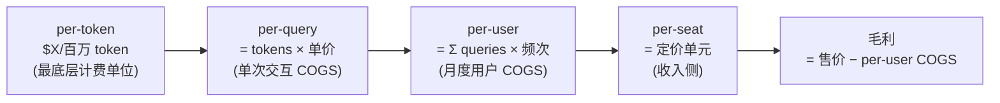

护城河决定"能不能锁住价值"，单位经济学（Unit Economics）决定"锁住的价值够不够付得起服务这单生意的成本"。一个产品可以工作流锁定极深却仍然亏到死——因为每多服务一次查询、每多一个活跃用户，它的可变成本不是趋近于零，而是线性往上爬。本节点要解决的核心问题是：**AI 产品的单位经济学和传统 SaaS 差在哪一个结构性变量上，以及这个差异如何改写 CAC / COGS / LTV / 毛利 / 盈亏平衡这五个 PM 必须算清的数。** 视角是把"护城河"翻译成一张能逐行核算的损益表——护城河深不深，最终要在毛利率和 LTV/CAC 比上结账。

> [!warning] 一个反直觉的结账
> 传统 SaaS 的财务直觉是"先用补贴换增长，规模上来后边际成本趋零、毛利自动爬到 80%+"。这个直觉在 AI 产品上**部分失效**：用量越大，推理 COGS 越高，毛利不是自动向上而是可能被用量本身拖向下。本节点的全部判断都围绕这一个结构差异展开。

---

## §0 为什么用"COGS 线性增长"做主轴，而不是直接套 SaaS 的 LTV/CAC 模板

PM 的财务工具箱里默认躺着一套 SaaS Unit Economics 模板：CAC（获客成本）、LTV（客户生命周期价值）、Magic Number、Rule of 40，核心假设是**软件的边际成本近似为零**（多卖一份拷贝几乎不增加可变成本，所以毛利 80–90%，规模化后利润自动放大）。这套模板被无数 AI 创业团队和 JD 直接套用——这是错的。

AI 产品的可变成本里多了一项传统软件没有的硬支出：**每一次推理调用都要烧真实的算力（GPU 时间 / token 费用）**。这项成本随用量**线性增长**（更准确说是随 token 吞吐量增长），不随规模摊薄。结果是 AI 产品的毛利结构性地落在 50–60% 区间，而非 SaaS 的 80–90%（来源：BVP《AI Pricing and Monetization Playbook》，2025，确证；LongYield，2026）。

> [!note] 框架选择的赌注
> 我赌"推理 COGS 是 AI Unit Economics 的主导变量"这条主线在 2026–2028 成立。它的失效条件有二：(a) 推理价继续崩塌到 token 成本相对售价可忽略（回到近零边际成本的 SaaS 世界）；(b) 模型小型化 + 端侧推理把 COGS 转嫁给用户硬件。两者都在发生，但都还没到能让这条主线翻转的程度——见 §6 failure scenario。

**为什么不能只算 LTV/CAC 这个比值就完事**：传统 SaaS 里 LTV/CAC ≥ 3 被当成健康线，因为 LTV 几乎全是毛利。但 AI 产品的 LTV 要先扣掉随使用量增长的 COGS，**一个高 LTV/CAC 比可能掩盖着负的单位毛利**——重度用户用得越多、留得越久，亏得越多。所以本节点坚持先把 COGS 拆清楚，再谈 LTV/CAC。

---

## §1 五个数的定义与 AI 化改写

| 指标 | 传统 SaaS 定义 | AI 产品的关键改写 | 为什么改写 |
|---|---|---|---|
| **COGS**（销货成本） | 托管/带宽/支持，边际近零，毛利 80–90% | **+推理算力（token/GPU 时间），随用量线性增** | 每次调用烧真实算力，毛利压到 50–60% |
| **CAC**（获客成本） | 销售 + 市场费用 / 新客数 | 大体不变，但免费额度本身是"获客补贴"且会持续放血 | 免费层的推理成本是隐性 CAC |
| **LTV**（生命周期价值） | ≈ ARPU × 生命周期 × 毛利率 | 必须**逐用户净 COGS** 计算，重度用户可能负贡献 | LTV 不再≈收入，要先扣可变推理成本 |
| **毛利率** | 80–90% 是健康线 | 50–60% 是 AI 常态，<40% 是危险区 | 结构性更低，是定价/护城河的硬约束 |
| **盈亏平衡** | 一次性，规模化后稳定盈利 | **每个用量层级要分别算**，可能"越大越亏" | 边际成本不降，规模不自动带来利润 |

**一句话读法：** SaaS 的财务故事是"先亏后赚、规模摊薄成本"；AI 产品的财务故事是"成本跟着用量跑，护城河不够深、定价不够准，规模化会放大亏损"。这是 §3 所有误判的根源。

---

## §2 COGS 的成本对象分层：per-query → per-user 的核算链

要把 COGS 算对，先要确定"成本对象"是谁。AI 产品的成本可以挂在五个不同粒度上，混用会算出错误的盈亏平衡（这一点是 0413 成本专题的核心辨析，本节点借其框架做财务落地）：

- **per-token：** 最底层计费单位。关键非对称：output token 通常比 input 贵 2–5×（如 Anthropic Sonnet 4.6：$3/$15 per MTok 输入/输出；Opus 4.8：$5/$25 per MTok，来源：finout.io，2026〔以官方价目为准〕）。
- **per-query：** 单次交互 COGS = 输入 token×单价 + 输出 token×单价 + (RAG/检索/工具调用附加)。RAG 产品的 per-query 是**双成本**（检索 + 生成），这是 [Perplexity](/kb/ai-公司与产品/perplexity/) 毛利低的结构原因。
- **per-user：** 月度用户 COGS = per-query × 该用户月查询频次。**这一层是 AI 产品最危险的地方**——用户用量分布极度长尾，重度用户的 per-user COGS 可能是轻度用户的几十倍，而 Seat 定价对两者收一样的钱。
- **per-seat：** 收入侧的定价单元。当 per-user COGS 的方差远大于 per-seat 售价的方差，固定定价就会在重度用户身上亏钱。
- **毛利：** 售价减 per-user COGS。AI 产品的毛利不是一个数，而是一条**随用户用量倾斜的分布**。

> [!warning] Anthropic 改计费的财务真相
> 2026 年初 Anthropic 取消捆绑 token 的企业 Seat 套餐，改 $20/员工/月基础费 + 全量按 token 计费（来源：The Register，2026-04-16，确证）。官方解释"用户增速超过产能扩张，旧定价单位经济学不成立"。翻译成本节点语言：**当 per-user COGS 的长尾把固定 Seat 定价的毛利吃穿，唯一的修复是把定价单元从 per-seat 切回 per-token**——让收入曲线重新贴住成本曲线。连前沿模型公司都被迫这么做，下游应用层更没有侥幸空间。

---

## §3 判断主轴：五个 Unit Economics 致命误判（四件套）

这是本节点的命门——90% 的人在算 AI 产品单位经济学时会在以下五处搞错。每点给**症状 → 为什么会错 → 正确做法 → 真实反例**。

### 误判一：把 SaaS 的"边际成本近零"假设直接搬到 AI 产品

- **症状：** "我们是软件，毛利早晚到 80%，现在亏是因为还没规模化。"
- **为什么会错：** AI 产品的边际成本不是零，是随 token 吞吐线性增的真实算力费。规模化**不会**自动把毛利推上去——它把 COGS 也同比例放大。AI/SaaS 毛利差是结构性的 50–60% vs 80–90%（来源：BVP，2025；LongYield，2026），不是"还没成熟"。
- **正确做法：** 做财务模型时把推理 COGS 显式建成"随月活×人均查询线性增长"的一项，而不是固定托管成本。算盈亏平衡要算"增长是否把毛利稀释得比规模带来的收入更快"。
- **真实反例：** AI 原生公司中位 NRR 仅 48%、GRR 40%（来源：ChartMogul，2025，N=2,100）——大量用户是用免费/低价额度烧着公司推理成本的"游客"，规模越大、烧得越多、留存却崩。这正是"边际成本近零"假设失效的活证据。

### 误判二：用 LTV/CAC 比值掩盖负的单位毛利

- **症状：** "我们 LTV/CAC = 4，远超健康线 3，单位经济学很健康。"
- **为什么会错：** 传统 LTV 几乎全是毛利，但 AI 的 LTV 要先扣随用量增长的净 COGS。**重度用户 LTV 高（用得多、留得久），但其净 COGS 也最高，单位毛利可能为负。** 一个看起来漂亮的 LTV/CAC 比，可能是把负毛利的重度用户和正毛利的轻度用户混在一起平均出来的幻觉。
- **正确做法：** 按用量分层算 LTV/CAC，至少分轻/中/重三档。问"我最有价值（最黏）的那批用户，单位毛利是正还是负？" 如果最黏的用户在亏钱，留存越高死得越快。
- **真实反例：** ChartMogul 数据显示高价位（>$250/月）AI 产品 NRR 可达 85%、低价位（<$50/月）仅 32%（来源：ChartMogul，2025）。低价位产品恰恰是"重度用户净毛利为负 + 低 ARPU 撑不住 COGS"的双杀区——LTV/CAC 算出来再好看也救不了。

### 误判三：忽视用量分布的长尾，用平均 COGS 定价

- **症状：** "人均每月 100 次查询，per-query COGS $0.02，所以人均 COGS $2，定价 $20 毛利 90%。"
- **为什么会错：** "人均"是被长尾严重拉偏的均值。AI 产品用量分布通常是幂律——少数重度用户贡献绝大多数 token 消耗。用平均 COGS 定价，等于让重度用户的亏损吃掉轻度用户的利润，且重度用户最不愿流失（最黏），亏损被锁定。
- **正确做法：** 看用量分布的 P90/P99，不只看均值。设计定价时要么按用量计费（让成本曲线贴住收入），要么设额度上限/降级机制把长尾的 COGS 封顶（这正是免费额度/rate limit 的财务本质——不是产品体验决策，是 Unit Economics 防御）。
- **真实反例：** Cursor 2026 年 6 月起改 Credit 池体系——"Auto"模式不限量、高级模型（Claude/GPT-5）消耗 Credits（来源：WebSearch 核实，Cursor 官方）。这是用 Credit 机制给长尾 COGS 封顶的典型：不限量的是便宜模型，烧钱的高级模型必须计量。

### 误判四：把免费额度当"市场费用"，不算进 CAC 和持续 COGS

- **症状：** "免费层是获客手段，成本算在 marketing 里，不影响单位经济学。"
- **为什么会错：** 免费用户的推理成本是**真实算力支出 + 持续放血**（不像 SaaS 免费层边际成本近零）。它既是隐性 CAC（每个免费转付费用户摊了多少免费期推理成本），又是付费后仍要扣的 COGS。把它藏进 marketing 科目，会系统性低估真实 CAC 和盈亏平衡点。
- **正确做法：** 把免费层推理成本显式拆成两块：转化前算进 CAC，转化后算进 COGS。算 CAC 回收期时要包含免费期烧掉的算力。
- **真实反例：** 巨头免费战（把能力推成基础设施）正是用免费额度压垮独立应用层的 Unit Economics——当 OpenAI/Google 能用云利润补贴免费 AI 功能，独立产品的免费层是纯失血，而巨头的是交叉补贴。同样发免费额度，巨头算得起、套壳算不起。

### 误判五：把"推理价在跌"当成"COGS 问题会自己解决"（Jevons 悖论）

- **症状：** "推理价每年跌 90%+，再等等 COGS 就不是问题了。"
- **为什么会错：** 这是 Jevons 悖论——成本下降会刺激用量上升，单位成本降了但总用量涨得更多，**总 COGS 不一定下降，毛利问题不会自动解决**。同时降价会被竞争对手同步吃掉（推理价崩塌是全行业的，不是你的独家优势），售价也被迫下调，毛利两头被夹。
- **正确做法：** 不要把"等推理变便宜"当作 Unit Economics 战略。降价红利会被用量增长和价格竞争同时抵消。真正的 UE 护城河来自**用更便宜的模型做出更贵的工作流锁定**（Cursor 在便宜模型上构建高价工具），而不是被动等待 token 降价。
- **真实反例：** 自 2023 年 3 月以来前沿 LLM 平均输出价格降约 94.5%（来源：BenchLM，2025），但同期模型 API 总支出从 2025 上半年 $35 亿涨到 $84 亿、6 个月翻倍（来源：Menlo Ventures，2025）——单价崩塌，总盘子反而翻倍。Jevons 悖论的活证据：便宜没有让总成本消失，只是把它放大了。

> [!warning] 招聘 JD 里的 Unit Economics 盲区
> 多数 AI PM JD 写"懂 SaaS Unit Economics"，默认套用近零边际成本模板。面试时若你能指出"AI 产品 COGS 随用量线性增、LTV 要逐用户扣净推理成本、最黏的重度用户可能单位毛利为负"，就是 30 秒拉开判断力差距的位置。

---

## §4 产品 PM 视角补盲：损益表之外的三个看走眼点

工程/财务视角只算成本和毛利，PM 必须补三个用户/商业/合规盲点：

1. **定价单元即护城河信心的暴露（商业模式）：** 一个产品敢做 outcome-based 定价（按结果收费，如 Intercom Fin $0.99/解决对话、Zendesk $1.50–$2.00/自动解决工单，来源：WebSearch 核实公开定价），说明它对"价值锁定 + 成本可控"双双有信心——因为只有当 per-outcome COGS 稳定低于 per-outcome 售价，outcome 定价才不会亏。反之死守 Seat 定价，往往是不敢让收入贴住用量（怕暴露重度用户在亏钱）。**定价模式是 Unit Economics 健康度的外显信号。**
2. **"AI 游客"留存陷阱扭曲所有 LTV 估算（用户心理）：** 早期大量实验性用户不是真实需求，他们的留存会在新鲜感过后断崖（AI 原生中位 NRR 48% vs SaaS 106%，来源：ChartMogul，2025）。用早期留存曲线外推 LTV，会系统性高估，进而把负毛利的增长误判为健康。判断 AI 产品时，留存曲线的形状（是否在 3–6 个月后稳住）比 ARR 增速更诚实。
3. **合规/数据驻留推高特定行业 COGS（合规边界）：** 受 HIPAA/GDPR 约束的垂直产品（医疗、法律、金融）往往不能用最便宜的共享 API，要用私有部署/专用实例，per-query COGS 显著更高。这既抬高了 COGS（压毛利），又构成了进入壁垒（护城河）——合规是 Unit Economics 的双刃。

---

## §5 对手框架回应：接受 + 边界

### 对手一：a16z / David Cahn——"推理成本会跌到无关紧要，AI 终将回归零边际成本的软件经济学"

- **接受：** 推理价确实在崩塌（2 年跌 94.5%，确证），且模型小型化 + 端侧推理在把部分 COGS 转嫁出去。在足够长的时间尺度上，token 成本相对售价的占比会下降，这点我接受。
- **边界：** 但我坚持在 2026–2028 的 PM 决策窗口里，COGS 仍是主导变量——因为 Jevons 悖论（误判五）让用量吃掉降价红利，且前沿能力的需求总是跑在最贵的模型上。**赌注：** 我赌"未来 24 个月推理 COGS 仍压毛利到 50–60%"；若错（COGS 占比快速降到 SaaS 水平），则本节点对毛利的悲观估计过严，应放宽。

### 对手二（Rick 未读框架引入）：David Skok《SaaS Metrics 2.0》的 CAC 回收期与 LTV/CAC 框架

- **引入理由：** Skok 的 SaaS 经典框架（CAC payback < 12 个月、LTV/CAC > 3）是行业默认尺子。引入它正是为了**显式标注它在哪失效**：Skok 的 LTV 假设客户贡献几乎全是毛利，这个假设在 AI 产品上不成立。
- **对本节点的逼问与修正：** Skok 框架逼我承认——不能废掉 LTV/CAC，而要给它打补丁：把 LTV 重定义为"逐用户扣净推理 COGS 后的贡献"，并按用量分层而非取均值。这是对 SaaS 正统的"接受+改写"，不是推翻。

### 对手三（Rick 未读框架引入）：Clayton Christensen 的"利润守恒定律"（Law of Conservation of Attractive Profits）

- **引入理由：** 它预测当一层（推理）被商品化、利润蒸发，相邻层（应用工作流）会出现新的可锁定利润。这给本节点的悲观调一个出口：COGS 压毛利不等于 AI 应用没钱赚，而是钱从"卖 token"迁移到"卖被锁定的工作流结果"。
- **对本节点的修正：** 它提醒我别把"毛利结构性偏低"等同于"商业模式不成立"。低毛利层（模型 token）旁边，正长出高毛利的 outcome 定价层。判断时要问"商品化把利润推到了哪个相邻的、我能占据的位置"。

---

## §6 failure scenario：本节点结论在哪些场景失效

1. **推理成本占比塌到可忽略：** 若模型小型化 + 硬件进步让 per-query COGS 相对售价降到个位数百分比，AI 产品回归近零边际成本的 SaaS 经济学，本节点"COGS 主导"主线失效。〔正在发生，但未到临界〕
2. **端侧推理普及：** 若主流推理迁移到用户设备（手机 NPU/本地模型），COGS 转嫁给用户硬件，毛利结构重回 SaaS——则本节点对云端 COGS 的核算框架需大改。
3. **outcome 定价的归因失败：** 本节点把 outcome 定价当作"贴住成本"的解药，但若 per-outcome 难以干净归因（Goodhart 问题——AI 优化指标而非真实价值），outcome 定价反而制造新的 UE 黑洞。
4. **毛利数字依赖单一/分析师来源：** "AI 毛利 50–60%"来自 BVP/LongYield 等分析师汇总，非逐公司审计数据。若实际分布远宽于此区间，按此做的盈亏平衡判断需修正。
5. **巨头交叉补贴重定义"正常毛利"：** 若巨头长期用云利润补贴 AI 功能至负毛利当作获客，独立玩家的"健康毛利"标准本身失去意义——竞争不在 UE 维度而在资本耐力维度。

> [!note] confirmation-bias 砍除
> 本节点反复用 Cursor 作为"在便宜模型上做高价锁定"的正面 UE 案例——这是 bias。补入反例与边界：Cursor 自身也在 2026 年因 token 成本压力改 Credit 计费、给长尾封顶（误判三反例），说明即便是 UE 最被看好的应用层赢家，也没真正逃出 COGS 引力，只是管理得更好。不能用一个管理得好的 outlier 论证"应用层 UE 已经解决"。另外，本节点早期把"毛利 50–60%"当作铁律——补边界：这是 2026Q1 的横截面，随推理降价会缓慢上移，是会过期的数字。

---

## §7 PM 决策启示

- **面试桌：** 被问"AI 产品和 SaaS 的财务模型有什么不同"——别说"都看 LTV/CAC"。说"核心差在 COGS：SaaS 边际成本近零、毛利 80–90%，AI 推理成本随用量线性增、毛利 50–60%；所以 AI 的 LTV 要逐用户扣净推理成本，最黏的重度用户可能单位毛利为负，用平均 COGS 定价会被长尾吃穿。"
- **选型会：** 评估要不要自建 vs 调 API——把决策建成"per-query COGS × 预期用量分布 × 售价"的盈亏平衡模型，而不是只比 API 单价。重点看 P99 重度用户在哪个用量会翻成负毛利。
- **做自己的产品定价：** 用 §3 五个误判逐条自检——我的毛利是不是被"SaaS 80% 幻觉"高估了（误判一）？我最黏的用户单位毛利是正是负（误判二）？我用均值还是 P90 定价（误判三）？免费额度算进 CAC 了吗（误判四）？我是不是在赌推理降价救我（误判五）？

---

## §8 与已有节点的关系（升级对照，不复述）

- **对 [m209 - 推理成本控制手册](/kb/工程化与落地架构/m209-推理成本控制手册/) 的升级：** m209 停在"工程降本手段"层（缓存/路由/压缩/截断），算的是"我该如何把单次调用的成本压下去"。本节点把这些手段的**财务后果**接进损益表：缓存/路由不只是省钱技巧，而是把 per-user COGS 的长尾压平、让毛利分布收窄的 Unit Economics 杠杆。同一组技术，从工程优化升到财务建模。
- **对 0413 成本工程专题 R3 的升级对照（brief 指定）：** 0413 R3 在"成本即商业模式"层做 per-token→per-query→per-task→per-user→per-seat 五层成本对象辨析与 Jevons 悖论。本节点是它的**财务收口**：0413 回答"成本对象怎么分层、为什么降价不消除成本问题"，本节点把这套成本对象框架**接到 CAC/LTV/毛利/盈亏平衡的完整损益表上**，算出"这套成本结构最终能不能赚钱"。0413 给成本的解剖学，本节点给它的财务病理学——不复述五层辨析本身，只用它的结论做核算输入。
- **对 S01 利润池地图（本专题）的升级对照：** S01 回答"这个产品处在产业链哪个利润池/议价位"（宏观空间），本节点回答"在这个生态位上，单个产品的损益表逐行算下来是正是负"（微观财务）。S01 说应用层毛利约 60%，本节点拆解这 60% 是怎么被推理 COGS 从 80% 压下来的、以及它在用量长尾上如何分布。
- **对 0425 信号专题的升级对照：** 0425 讲信号坍缩 → 平台价值命题。本节点提供其**财务投影**：outcome-based 定价之所以重要，是因为它把"产品价值"做成可计费的可信信号（按结果收费 = 用价格结构发出"我对价值有信心"的信号），这正是信号理论在 Unit Economics 上的落点。
- **对 0428 采纳决定 LTV 的升级对照（brief 指定）：** 0428 论证"采纳决定 LTV"（技术对了也可能死于组织不采纳）。本节点给出其**财务机制**：组织不真正采纳 → "AI 游客"留存断崖（NRR 48%）→ LTV 估算被高估 → 负毛利增长被误判为健康。0428 讲采纳为何决定 LTV，本节点算清采纳失败如何在损益表上具体兑现成亏损。
- **对 [Perplexity](/kb/ai-公司与产品/perplexity/) 的升级对照：** Perplexity 是 RAG+LLM 双成本的应用层 pessimistic case。本节点把它的"毛利低"从定性描述升级为定量机制：per-query 是检索 + 生成双 COGS，叠加搜索利润池退潮（S01）和巨头免费夹击（[OpenAI](/kb/ai-公司与产品/openai/) [ChatGPT](/kb/ai-公司与产品/chatgpt/) Google），其 Unit Economics 在重度用户长尾上尤其脆弱。

Rick 一手经验的接地：滴滴双边市场的成本分摊与补贴经验，是判断 AI Unit Economics 的现成参照系。费用治理（平台双边纠纷的成本归因与分摊）正是 per-query COGS 归因问题的同构——谁产生的成本、由谁承担、如何避免重度用户/重度场景把整体毛利吃穿；PDP现金支付纠纷治理 里"不同市场利润池/补贴强度差异巨大"的国际化实战，恰是本节点"用量长尾 + 分层定价"的活样本（不同市场的用户用量分布和支付意愿差异，直接对应 per-user COGS 的方差管理）。

---

## §9 关联节点

**核心（必读）：**
- [m209 - 推理成本控制手册](/kb/工程化与落地架构/m209-推理成本控制手册/)——本节点 COGS 核算的工程底座
- [Perplexity](/kb/ai-公司与产品/perplexity/)——RAG 双成本应用层 UE 的活标本
- [AI PM 知识图谱·总索引](/kb/ai-pm-知识图谱/ai-pm-知识图谱-总索引/)——回到全局地图
- [OpenAI](/kb/ai-公司与产品/openai/) / [Anthropic](/kb/ai-公司与产品/anthropic/) / [ChatGPT](/kb/ai-公司与产品/chatgpt/) / [Claude](/kb/ai-公司与产品/claude/) / [DeepSeek](/kb/ai-公司与产品/deepseek/)——推理定价的来源方
- [Scaling Laws](/kb/基础知识库/scaling-laws/)——理解推理成本与模型规模关系的底层动力

**延伸（可选）：**
- [Agent](/kb/基础知识库/agent/)——Agent 多步调用如何放大 per-task COGS、改写 UE
- [幻觉](/kb/基础知识库/幻觉/)——可靠性约束如何抬高合规场景的 per-query COGS
- 0133信息经济学——定价信号与信息不对称（outcome 定价的信号本质）
- 0133新制度经济学——平台交叉补贴与"收税权"的制度经济学
- 费用治理 / PDP现金支付纠纷治理——Rick 双边市场成本分摊一手经验

---

## 修订日志
- 2026-06-07 R0：首稿。确立"AI 产品 COGS 随用量线性增、UE 模型不同于近零边际成本 SaaS"判断主轴；建立五个数（COGS/CAC/LTV/毛利/盈亏平衡）的 AI 化改写表 + per-token→per-user 成本对象核算链（Mermaid）；五个 Unit Economics 致命误判（四件套，含 Jevons 悖论）；引入 a16z 推理零成本论 / David Skok SaaS Metrics 2.0 / Christensen 利润守恒三个对手框架；与 0413 R3 / S01 / 0425 / 0428 / m209 / Perplexity 升级对照；商业数字（毛利 50–60%、NRR 48%、推理降价 94.5%、API 支出 6 月翻倍、Anthropic 改计费、Cursor Credit）全部接地至来源，价目与分析师数字标注口径。
