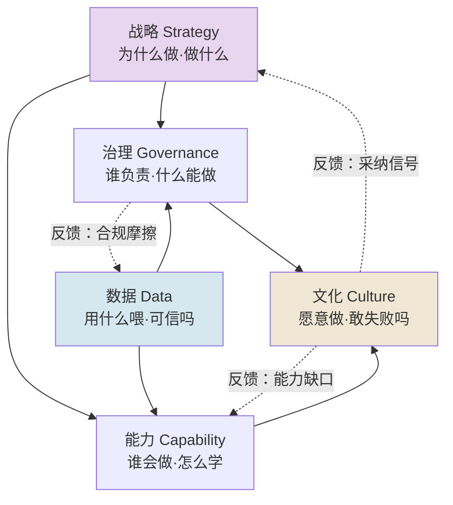

把 AI 转型当一项**系统工程**来解剖：它不是某个部门买一套工具、跑几个 PoC，而是战略、数据、能力、治理、文化五个子系统同时被重新布线。本节点要解决的问题是——当一个 PM（或被 CEO 点名"牵头 AI 转型"的人）面对"我们也要做 AI 转型"这句空话时，**如何把它拆成一张可施工、可验收、有依赖关系的系统图，而不是一份采购清单**。视角是**社会技术系统（STS）+ 组织能力建设**的双重镜头：AI 转型的真正变量不在技术栈，而在"组织能不能长出新的能力"。

判断主轴一句话：**AI 转型是组织能力建设，不是买工具。** 买工具是一次性资本支出，能力建设是持续的组织学习；前者有终点（合同签了就完事），后者没有终点（模型迭代、数据漂移意味着永远在"解冻"）。把转型当采购的组织，几乎注定停在 PoC 地狱里——这是本节点要反复砸实的反共识立场。

---

## §0 为什么是"系统工程剖面"而不是"成熟度模型"

市面上最流行的组织 AI 转型框架是**成熟度模型（maturity model）**：Level 1 探索 → Level 2 试点 → Level 3 规模化 → Level 4 转型 → Level 5 原生。Gartner、德勤、各大咨询都有自己的版本。它好用在"让 CEO 在 PPT 上有个箭头往右画"，但作为施工图它有两个致命缺陷：

1. **线性单阶段假设**。成熟度模型把转型画成一条单调上升的台阶，暗示"做完上一级才能做下一级"。但真实组织里五个子系统**严重异步**——一家公司可能数据治理还在 Level 1，文化已经被 ChatGPT 自下而上推到了 Level 3。把异步系统强行排成线性台阶，会让 PM 误判"我们整体在 Level 2",从而错配资源。
2. **隐藏了耦合**。成熟度模型把"数据、能力、治理"列成并列的评估维度，却不画它们之间的**依赖箭头**。而 AI 转型最大的坑恰恰是耦合点：没有数据治理，能力建设就是空中楼阁；没有治理框架，规模化就会撞合规墙。

所以本节点选**系统工程剖面**：把转型拆成五个**子系统 + 它们之间的依赖与反馈回路**，而不是五个并列的成熟度刻度。这个选择本身是判断——我赌"耦合关系比阶段位置更能预测转型成败"。这个赌注在 §4 会被一个反例检验（见 failure scenario）。

> [!note] 与 0422 STS 的升级对照
> 0422 STS（社会技术系统）专题确立了一个底层命题：技术子系统与社会子系统**必须联合优化（joint optimization）**，单独优化任一方会让整体劣化。本节点是把这个抽象命题**落到 AI 转型的具体五子系统上**——"战略+治理"是社会子系统，"数据+技术"是技术子系统，"能力+文化"是连接二者的界面。0422 告诉你"为什么不能只优化技术"，本节点告诉你"在 AI 转型里这五个子系统具体怎么联合优化、谁依赖谁"。不复述 STS 的理论推导，只取其"联合优化"这一把手。

---

## §1 五子系统全景：一张依赖图

把"组织 AI 转型"拆成五个子系统，并画出它们的依赖与反馈关系：

| 子系统 | 核心问题 | 失败征兆 | 接地证据 |
|---|---|---|---|
| **战略** | 为什么做 AI、解决哪个真问题 | "我们也要有 AI"式 me-too 立项 | IDC×Lenovo（CIO Playbook 2025）：分析师 Ashish Nadkarni 直言"大多数 PoC 的启动并非因为强有力的商业案例" |
| **数据** | 数据是否 AI-ready、可治理 | Demo 用清洗数据，生产环境数据来自十几个不一致系统 | Gartner（2025-02）：≥60% AI 项目将因数据未就绪在 2026 年前被放弃；63% 组织没有或不确定有 AI-ready 数据实践 |
| **能力** | 员工/组织是否长出新能力 | 高管推 AI 但员工不会用 | Gartner（2025-10，n=506 CIO）：仅 20% 高管认为员工真正 AI-ready；仅约 28% 员工知道如何使用公司 AI 工具（WalkMe 引用） |
| **治理** | 谁担责、什么能自动化、合规边界 | PoC 到生产撞安全审查与合规墙 | EU AI Act Article 4（2025-02-02 生效）：提供者与部署者须确保员工有"足够水平"的 AI 素养 |
| **文化** | 是否敢实验、敢失败、愿采纳 | 45% CEO 称员工对 AI 态度消极或敌对（Kyndryl，〔样本未公开，待核实〕） | 89% 员工对工作安全有顾虑、仅 22% 表示领导层解释过 AI 将如何应用（2025 调查，〔原始样本待核实〕） |

读图要点：**战略和数据是两个"源头"**（无入边），文化是"汇"（接收能力与治理的输出，再反馈回战略）。三条虚线反馈回路是这张图区别于成熟度模型的关键——它们解释了为什么转型是**持续的**而非一次性的：文化层的采纳信号会修正战略，能力缺口会触发新一轮培训，合规摩擦会倒逼数据治理。

---

## §2 判断主轴：90% 的人在这五个耦合点搞错

这一节是命门——五个子系统之间的耦合点，是转型翻车的高发地。每点四件套（症状 → 为什么错 → 正确做法 → 真实反例）。

### 耦合点 1：把"能力建设"等同于"买培训课"
- **症状**：HR 采购一批 Prompt 课，发个全员通知，KPI 设成"培训覆盖率 100%"。
- **为什么错**：能力是行为改变，不是知识灌输。McKinsey 观察到"七成受训者忽视 onboarding 视频，更依赖实验性学习与社会学习"。覆盖率高 ≠ 能力高。
- **正确做法**：能力建设 = Literacy（可见、易测）+ Adoption（难测、需领导勇气）的组合，且把 Adoption 当主战场。配套 BCG 的**$1 模型开发 : $3 变革管理**投入比（McKinsey QuantumBlack《Reconfiguring Work》，2024，为规范性建议非实证）。
- **真实反例**：Zhang et al.（2026）《How to Assess AI Literacy: Misalignment Between Self-Reported and Objective-Based Measures》（arXiv: 2601.06101，已核实）发现教师群体自评 AI 能力与客观测量**低相关**，系统性高估普遍——意味着"培训完了大家说会了"完全不能作为能力基线。

### 耦合点 2：先上 AI，再治理数据（顺序倒置）
- **症状**：模型选好了、PoC 跑通了，才发现生产数据脏、分散、无权限治理。
- **为什么错**：违反依赖图——数据是能力与治理的**上游源头**。在脏数据上建的能力是空中楼阁。
- **正确做法**：数据治理与战略立项**并行启动**，把"AI-ready data"作为立项的准入条件，而非交付后的补丁。
- **真实反例**：Gartner（2025）预测 ≥60% AI 项目因数据未就绪被放弃；RAND（RRA2680-1, Ryseff et al., 2024，65 名资深从业者深访）将"训练数据不足"和"基础设施缺口"列为五大根因中的两条。

### 耦合点 3：把治理当"事后合规审查"而非"嵌入式设计"
- **症状**：转型规划里没有治理子系统，等 PoC 要上生产时法务才介入，一票否决。
- **为什么错**：治理在依赖图里是数据与战略的下游、文化的上游——它是承重墙不是装修。事后介入只能制造摩擦回路（图中虚线），拖死项目。
- **正确做法**：治理前置。EU AI Act Article 4 把"AI 素养"从软性建议变成**法律义务**（义务 2025-02-02 生效，AI Act 主体义务总应用日 2026-08-02，治理/罚则自 2025-08-02 起，最高罚 750 万欧元或全球营业额 1.5%；来源：EU AI Act Article 113 官方文本，ai-act-service-desk.ec.europa.eu/en/ai-act/article-113）——治理已经不是"要不要"而是"合规底线"。
- **真实反例**：J&J 的 900 项 GenAI 计划中仅 10–15% 贡献了 80% 的价值（〔来源为行业引用，待核实原始报告〕）——没有治理层做组合管理与裁撤，资源会被均摊到 800 多个无价值项目上。

### 耦合点 4：用"权威式采纳"替代"能力扩散"
- **症状**：CEO 自上而下下令"全员用 AI",但员工不具备使用能力、也没有动机。
- **为什么错**：Rogers《创新扩散》区分组织采纳的"权威式 vs 共识式"——权威式能强推决策，但**无法替代个体的实施与确认阶段**。指令到不了"会用"和"愿用"。
- **正确做法**：权威式启动 + 共识式扩散。利用 change champion 网络做 peer-to-peer 扩散（69% 员工主要通过同伴学 AI，〔Iternal.ai 综合引用，待核实〕）。这正是 Rick 在滴滴跨团队拉通 PDP/实名验证项目时验证过的路径——见 §6。
- **真实反例**：拥有 AI 倡导型高管的组织，推进 AI 议程的概率是其他组织的 3 倍（McKinsey），说明高层"参与"远胜高层"下令"。

### 耦合点 5：把文化当"软指标"忽略，只盯技术 ROI
- **症状**：转型 dashboard 全是技术指标（模型精度、API 调用量），没有文化/采纳指标。
- **为什么错**：BCG 的 **10-20-70 原则**（《Where's the Value in AI?》, 2024, n=1000 CxO, 59 国）说得最直白——AI 成功的决定因素中技术仅占 10%，数据算法占 20%，**人、流程、文化变革占 70%**。只盯 10% 的指标，必然误判转型健康度。
- **正确做法**：把文化层指标（实验率、心理安全感、采纳深度、纠错回路活跃度）纳入转型记分卡，与技术指标同权。
- **真实反例**：74% 企业无法从 AI 中规模化价值（BCG, 2024），主因不是技术不行，而是 70% 的"人与流程"侧投入不足或倒置。

---

## §3 产品 PM 视角补盲：转型不是 IT 项目

跳出"工程/IT PM"视角，补三个最容易看走眼的点：

1. **用户心理模型错配**：员工面对 AI 的首要情绪不是兴奋而是**工作安全焦虑**（89% 有顾虑）。任何转型沟通如果只讲"提效"不讲"你的岗位会怎样",会直接触发文化层的防御性抵触。Kotter 框架在这里有个内在矛盾——它要求把"现状"塑造成必须打倒的敌人（《Vilifying the Status Quo》, Tandfonline 2022, DOI: 10.1080/14697017.2022.2137835），但在 AI 转型里，"现状"就是员工本身，把现状妖魔化等于把员工推向对立面。
2. **商业模式的隐藏前提**：转型记分卡若只看"成本节约",会系统性低估 AI 的价值创造维度。MIT NANDA 的 95% 失败率数字之所以被质疑（Marketing AI Institute, 2025-08），正是因为它把"成功"窄化为"六个月内可衡量 KPI",忽略了效率与能力沉淀——PM 设计转型 KPI 时不能犯同样的窄化错误。
3. **合规即产品边界**：EU AI Act 把 AI 素养写进法律，意味着"组织能力建设"不再是 HR 的可选项，而是**部署 AI 系统的法律前置条件**。对做国际化产品的 PM（如 Rick 的 99/DiDi 国际化场景），这是必须纳入转型 roadmap 的硬约束，不是"以后再说"。

---

## §4 对手框架回应：接受 + 边界

**对手一：Geoffrey Moore 式"聚焦单一细分市场突破鸿沟"。**
接受：在外部市场，"集中突破一个利基场景建立压倒性参考案例"确实是跨越鸿沟的有效处方。边界与赌注：**这套创业公司打法对大型组织内部转型指导力有限**——企业内部多条业务线同时需要 AI，无法像创业公司那样 all-in 单点。本节点的系统工程剖面正是对 Moore 单点论的补充：内部转型要的是"五子系统协同推进"而非"单点 all-in"。（见 [A02 Crossing the Chasm 在 AI 语境](/kb/专题-商业组织与采纳/a02-crossing-the-chasm-在-ai-语境/) 对鸿沟理论的完整辨析。）

**对手二：Burnes 的"涌现式变革（emergent change）"范式。**这是 Rick 未读的对手框架，特意引入破 echo chamber。接受：Burnes（2020）主张 AI 时代的变革是持续涌现而非计划性的，Lewin/Kotter 那套"解冻-改变-再冻结"的计划变革模型在持续迭代的 AI 环境里"再冻结"根本不成立。边界：但完全放弃计划性会让组织失去施工图——我赌"计划框架（系统工程剖面）+ 涌现执行（持续反馈回路）"的混合体优于纯涌现。本节点的三条反馈虚线就是向涌现范式让出的空间。

**对手三：成熟度模型阵营（Gartner/德勤）。**接受：成熟度模型在"对齐高管认知、做粗粒度自评"上不可替代。边界：它不能作为施工图，理由见 §0。

> [!warning] failure scenario：本节点判断会在哪失效
> 1. **超小型组织**（<50 人）。五子系统剖面对小团队是过度工程化——它们的"治理"就是创始人一句话，"文化"就是几个人的默契。系统图在这里失真。
> 2. **纯技术驱动的窄场景**（如单一模型替换某个后台分类任务）。这类"AI 应用"不是"AI 转型",用转型框架会杀鸡用牛刀。本节点的范围边界是"跨多业务线、需要组织能力重构的转型",不是单点应用。
> 3. **§0 的核心赌注若被推翻**：如果未来出现"开箱即用、零数据治理、零能力门槛"的 AI（agentic 系统自带数据清洗与自学习），那么"耦合关系比阶段更重要"的判断会失效，转型会退化为采购。我赌 2–3 年内不会发生，但这是明确的赌注。

> [!note] confirmation-bias 砍除
> 本节点早期论证反复引用 BCG 10-20-70 作为"组织 >技术"的正面铁证。这是 bias——BCG 是咨询机构，其方法论与"70%"的精确归因从未经独立同行评审复现，且咨询业有商业动机鼓吹"变革管理"（他们卖的就是这个）。补入反例视角：失败率数字高度分散（55%–95%），"失败"定义各异，部分来自服务提供商。本节点对 BCG 数字的使用应降级为"方向性证据"而非"精确基准"，并优先采用大样本、跨国的 74% 而非孤立的极端值。

---

## §5 跨域呼应：把"转型"放回社会学的镜头

调度一个跨域资源——**Karl Polanyi 的"嵌入性（embeddedness）"**（链入 0117社会学）。Polanyi 在《大转型》里论证：经济行为不是悬浮在真空里的技术理性，而是**嵌入**在社会关系、制度、习俗之中；试图把市场从社会中"脱嵌"出来单独优化，会引发社会的反向保护运动。

这个框架如何改变对 AI 转型的技术判断？大多数转型方案的隐含假设是"AI 是一项可以脱嵌植入的技术——选好模型、接好数据、它就该自动产生价值"。Polanyi 的镜头告诉我们：**AI 能力是嵌入在组织的能力网络、信任关系、权力结构里的，无法脱嵌植入**。这正是为什么 §1 的依赖图里"文化"是汇点、且有反馈回路——技术子系统的价值释放，取决于它在多大程度上被社会子系统所"嵌入"。员工的抵触（89% 工作安全焦虑）不是非理性噪音，而是 Polanyi 意义上的**反向保护运动**——组织对脱嵌式技术植入的自我保护。把抵触当作要被"变革管理"压制的阻力（Kotter 式"打倒现状"），还是当作要被理解和嵌入的信号（Polanyi 式），是两种根本不同的转型哲学。本节点站后者。

（这条呼应不是装饰：它直接改变了 §2 耦合点 5 的指标设计——把文化从"待克服的阻力"重新定义为"待嵌入的关系网络"，从而要求记分卡测量"嵌入深度"而非"抵触压制率"。）

---

## §6 Rick 的组织资产：滴滴跨团队拉通的理论化迁移

本专题的独特资产是 Rick 真实的滴滴跨团队拉通经验。把它从"我做过"升格为"可迁移的理论框架"：

Rick 在滴滴推进 **PDP 分层补偿框架**（02.1 PDP 分层补偿框架）、**PAX-Premium 实名徽章**（PAX-Premium实名徽章）、**CPF 实名验证**（CPF实名验证）等项目时，本质上都在做"权威式启动 + 共识式扩散"的组织能力拉通——这正是 §2 耦合点 4 的实战版本。映射到本节点五子系统：

| Rick 的滴滴拉通动作 | 对应五子系统 | 可迁移到 AI 转型的原理 |
|---|---|---|
| PDP 司乘协商 V1→V3 前置（02.2 司乘协商 V1-V3 协商前置） | 流程/治理 | 把规则前置到冲突发生前，而非事后裁判——对应 AI 治理前置（耦合点 3） |
| 跨垂类平台通用能力设计（15_国际化产品组织JD与架构） | 战略/能力 | 在多业务线间抽取通用能力底座，而非各自重造——对应转型的"能力建设非买工具" |
| 协作者花名册式的关系网络运营（06 协作者花名册） | 文化 | 靠 champion 网络做 peer 扩散——对应耦合点 4 的共识式采纳 |
| 纠纷治理"从裁判到管家"的角色转换（纠纷治理从裁判到管家） | 治理/文化 | 治理者从"事后审判"转向"事前赋能"——对应 AI 治理的嵌入式而非审查式 |

关键迁移洞察：Rick 在费用治理里做的"**降发生**"方法论（降发生方法论）——把资源从"事后处理纠纷"前移到"事前减少纠纷发生"——结构上同构于 AI 转型里"把投入从事后救火（撞合规墙、补数据债）前移到事前系统设计"。这是 Rick 可以在 AI PM 面试桌上直接复用的、有真实战功背书的判断框架。

---

## §7 PM 决策启示：三类落地

- **面试怎么用**：被问"如何评估一个组织的 AI 转型成熟度",不要背成熟度模型台阶（那是人人会的）。画 §1 的五子系统依赖图，指出"我先看耦合点而非阶段——数据治理是不是战略立项的准入条件、治理是前置还是事后、文化指标在不在记分卡里"。再用 §6 的滴滴经验做 30 秒实战背书。这是把"了解框架"升级为"有判断 + 有战功"。
- **选型/规划怎么用**：把转型 roadmap 强制拆成五子系统，每个子系统标"当前在哪、上游依赖是否就绪、谁负责"。立项准入加一条硬门槛：数据 AI-ready 评估未过的项目不批 PoC（直接掐掉 Gartner 60% 的失败源头）。记分卡技术指标与文化指标同权（落地 10-20-70）。
- **复现/执行怎么用**：转型不是一次性立项，是建立 §1 三条反馈回路的常态机制——采纳信号回流战略、能力缺口触发培训、合规摩擦倒逼数据治理。把"持续解冻"当默认状态，不追求"再冻结"。

---

## §8 与已有节点的关系（升级对照，不复述）

- **对照 [STS 系统化专题](/kb/专题-人文社科透镜/_sts-系统化专题-总览/)**：本节点是 STS"联合优化"命题在 AI 转型场景的**具体化落地**——把抽象的"社会子系统/技术子系统"映射成可施工的五子系统依赖图。属"深化"。
- **对照 [机制设计系统化专题](/kb/专题-商业组织与采纳/_机制设计系统化专题-总览/)**：0421 讲 AI 系统内部的运作机制；本节点讲 AI **被组织采纳**的机制。前者是"机器怎么转",后者是"组织怎么转"，互为镜像。属"对话"。
- **对照 [失败考古学系统化专题](/kb/专题-安全对齐与失败/_失败考古学系统化专题-总览/)**：0416 确立"AI 项目失败主因是组织而非技术"；本节点把这个诊断**正向翻转成处方**——既然失败是组织性的，转型就必须是组织能力建设。属"纠偏 + 深化"。
- **对照 [m207 - Agent 产品化：场景推演与失败模式](/kb/工程化与落地架构/m207-agent-产品化-场景推演与失败模式/)**：m207 讲单个 Agent 产品的失败模式（规划失败/工具调用失败/HITL 断点）；本节点把视角从"产品级失败"升格到"组织级转型失败"。m207 的 HITL"上线初期全设断点、按通过率>95% 逐步取消"在结构上同构于本节点"治理前置、随能力成熟逐步放权"。属"抽象层升高"。
- **对照 [p307 - Copilot 到 Autopilot 光谱](/kb/产品设计与交互范式/p307-copilot-到-autopilot-光谱/)**：p307 的 L0→L4 自治光谱是"单产品的放权曲线";本节点的"治理随能力成熟逐步放权"是"组织级的放权曲线"。p307 给单点，本节点给全景。属"补缺"。

---

## §9 关联节点

**核心（必读）**
- [A02 Crossing the Chasm 在 AI 语境](/kb/专题-商业组织与采纳/a02-crossing-the-chasm-在-ai-语境/) — 鸿沟理论的完整辨析，本节点 §4 对手一的展开
- [A03 变革管理框架与 AI 部署摩擦](/kb/专题-商业组织与采纳/a03-变革管理框架与-ai-部署摩擦/) — Lewin/Kotter/ADKAR 与 AI 摩擦点的对照
- [A04 组织 AI Literacy 建设](/kb/专题-商业组织与采纳/a04-组织-ai-literacy-建设/) — 能力子系统的深度展开
- [A05 AI 项目失败的组织归因](/kb/专题-商业组织与采纳/a05-ai-项目失败的组织归因/) — 本节点处方所对应的诊断
- [A06 Demo-to-Enterprise 鸿沟的组织维度](/kb/专题-商业组织与采纳/a06-demo-to-enterprise-鸿沟的组织维度/) — PoC 地狱的组织解剖
- [G01 企业技术采纳代际谱系总图](/kb/专题-商业组织与采纳/g01-企业技术采纳代际谱系总图/) — 时间维度的横切
- [m207 - Agent 产品化：场景推演与失败模式](/kb/工程化与落地架构/m207-agent-产品化-场景推演与失败模式/)
- [p307 - Copilot 到 Autopilot 光谱](/kb/产品设计与交互范式/p307-copilot-到-autopilot-光谱/)

**延伸（可选）**
- [A01 技术采纳与组织变革概念谱系](/kb/专题-商业组织与采纳/a01-技术采纳与组织变革概念谱系/)
- [m208 - AI 基础设施与中间件选型](/kb/工程化与落地架构/m208-ai-基础设施与中间件选型/) — 数据/技术子系统的选型底座
- [幻觉](/kb/基础知识库/幻觉/) — 治理子系统须管控的核心风险源
- 0117社会学 — Polanyi 嵌入性的入口
- [AI PM 知识图谱·总索引](/kb/ai-pm-知识图谱/ai-pm-知识图谱-总索引/)
- 15_国际化产品组织JD与架构 — Rick 国际化组织架构资产
- 降发生方法论 — 前置治理的同构方法论
- 纠纷治理从裁判到管家 — 治理角色转换的实战范式
- 02.1 PDP 分层补偿框架 · PAX-Premium实名徽章 · 06 协作者花名册

---

## 修订日志
- R1（2026-06-07）：首稿。建立五子系统依赖图 + 五耦合点判断主轴 + Polanyi 嵌入性跨域呼应 + Rick 滴滴拉通理论化迁移 + 三对手框架回应（含未读框架 Burnes 涌现变革）+ failure/bias 双清单 + 升级对照（0416/0421/0422/m207/p307）。grounding pass 已核验：arXiv:2601.06101 标题/作者/年份与主题全部属实（已去〔待核实〕）；EU AI Act Article 4 生效 2025-02-02、执法 2026-08-02 经 EC/artificialintelligenceact.eu 核实。仍标〔待核实〕：J&J 10-15% 数字、Kyndryl 45%、89%/22% 员工调查、Iternal.ai 69% peer 学习——共 4 项。
- 2026-06-11 P3.1 接地修复：EU AI Act 日期口径按官方 Article 113 改精确——2026-08-02 为 AI Act 主体义务总应用日（原"2026-08-02 起执法"措辞已纠正），补 Article 4 义务 2025-02-02 / 治理罚则 2025-08-02 分层；来源升级为官方 Article 113（ai-act-service-desk.ec.europa.eu/en/ai-act/article-113）。全专题日期已统一为 2026-08-02，官方文本无 "2026-08-03"。
- 2026-06-11 P3.4 校链：0416/0421/0422 三专题已确认入库，删除 §8 的 staging 占位注解，将三条降级文字引用恢复为真双链 [_失败考古学系统化专题·总览](/kb/专题-安全对齐与失败/_失败考古学系统化专题-总览/) / [_机制设计系统化专题·总览](/kb/专题-商业组织与采纳/_机制设计系统化专题-总览/) / [_STS 系统化专题·总览](/kb/专题-人文社科透镜/_sts-系统化专题-总览/)（经别名 find 核实）。
- 2026-06-12 内审修复：修断链——上一条日志正文与 §对照中残留的 `0416 总览/0421 总览/0422 总览` 数字式链（共 4 处）实为死链（库内真实文件名为 `_失败考古学系统化专题·总览` 等），统一改为真实 basename。
