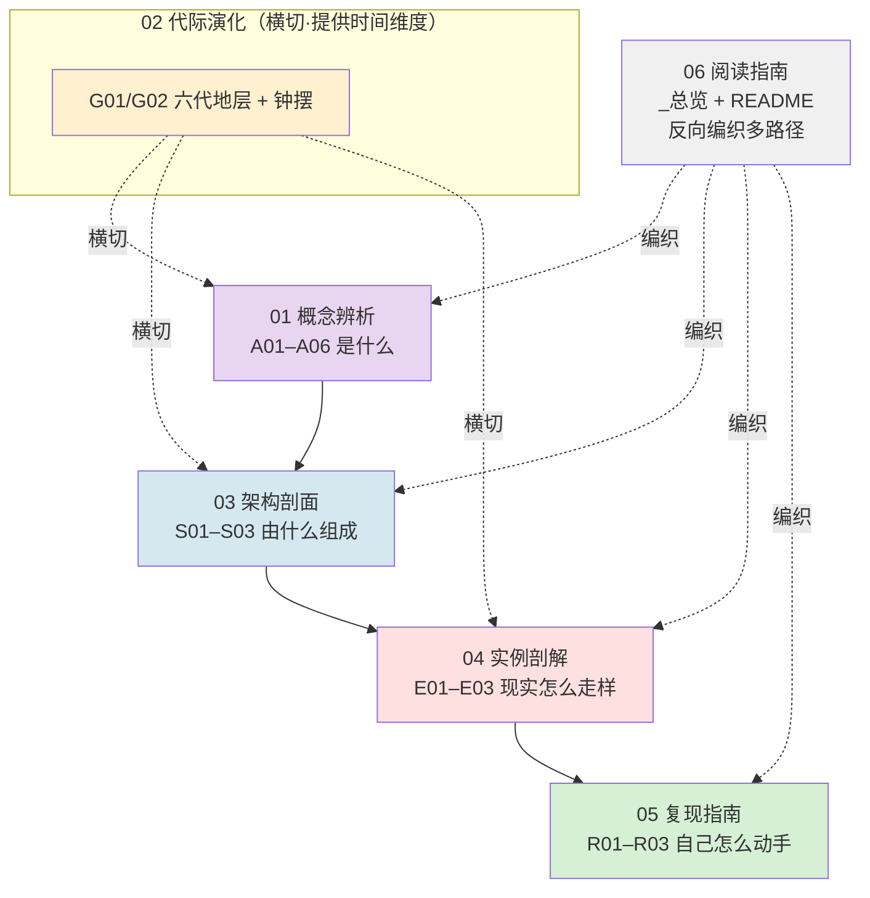

# AI 作为制度现象系统化专题 · 总览（MOC）

> 六模块 17 节点的入口与导航图。本专题主张：前沿 AI 公司不只是在造产品，而是在**铸造新的制度结构**——它们正在变成准国家行为体。读完本专题，你能在面试桌、选型会、复现台上，30 秒说清"为什么一家'六项治理俱全'的 AI 公司，治理可能是营销而非约束"。

---

## §0 序：那堵墙

第一次撞墙，是在一场 Safety PM 的面试里。面试官问："你怎么评估一家 AI 公司的治理成熟度？"我答了一串功能清单——有没有内容政策、有没有申诉机制、有没有 Responsible Scaling Policy。面试官点点头，又问："那 Anthropic 把训练原则叫 'Constitution'（宪法），把能力释放规则叫 'Responsible Scaling Policy'，这两个词你怎么读？"我下意识答："那是对齐技术 / 合规框架。" 错了。

后来我才看清那堵墙是什么：**Constitutional AI 字面就是宪法——一套约束数亿人交互行为的根本规则；API Policy 是准监管权力——一纸更新能让建在它上面的创业公司一夜归零；内容审核是准立法——平台同时制定规则、执行规则、裁定申诉。** 一家前沿 AI 公司同时握着制宪、立法、执法、司法、监管、主权六种权力，而我们还在用"合规"这个商业词汇描述它。**用合规视角，你永远看不见 AI 公司正在变成准国家。** 这个词汇错配本身，就是一种权力——话语权力。

本专题的反共识立场只有一句：**不要按"能力清单"评估 AI 公司的治理（它有宪法吗？有申诉吗？），要按"权力是否分立"评估（制宪和司法分家了吗？执法和救济分家了吗？监管和逐利隔离了吗？）。** 一家六项俱全却三处合一的公司，feature list 满分，制衡结构零分。这是从"功能审计"到"结构审计"的判断升级——也是把你和 90% 的候选人分开的那一句话。

---

## §1 专题定位：为什么"AI 制度现象"配独立建库

按 SHARED_CONTEXT §2 的四条选题判据逐条论证（前三满足 ≥2、第四为真）：

| 判据 | 是否满足 | 论证 |
|---|---|---|
| **① 中心性**（影响 ≥3 个决策链节点） | ✅ | 直接影响 M3（信任/合规）、M4（伦理/对齐）、M5（风险管理）三个决策链：制宪层接对齐（M4）、监管层接选型断供风险（M5）、司法层接 Trust & Safety 申诉设计（M3）。 |
| **② 误解深度**（定义互相矛盾、系统性滑变） | ✅ | "Constitutional AI"在业界被读成三种不可通约的东西：对齐技术（工程）/ 营销话术（PR）/ 真宪法（法学）。"API policy"被读成服务条款 vs 私人监管。"安全"在中美语境指向完全不同的对象（内容安全 vs 能力失控）。标准差极大。 |
| **③ 速变性**（24 月内 ≥1 次格式塔切换） | ✅ | 2023→2025 美国 AI 治理从拜登 EO 14110（强监管）到特朗普 EO 14148 撤销 + EO 14179 去监管，两年内方向逆转；RSP v1→v3、EU AI Act 分阶段生效——治理形态发生了 Kuhn 意义上不可通约的范式摆动。 |
| **④ 学了就能用**（面试/选型/复现立即可观测提升） | ✅ | 读完即可在面试用"六层权力 + 三处致命耦合"作答（高区分度）；在选型用"我依赖的平台是否同时是我的竞争对手"做一级风险尽调；在复现用"把执法与救济拆成两个团队"破耦合。 |

**升高了哪个抽象层？** 已有单维节点（[Constitutional AI](/kb/基础知识库/constitutional-ai/) 讲技术机制、AI 公司政治敏感内容立场对比 讲横向对象对比）停在"它怎么工作 / 谁更严"。本专题整体把这些现象**抬升到制度/宪政层**——问"它作为一次私人制宪，正当性从哪来""它行使了三权却缺哪个零件"。这是从**技术合规视角**到**制度设计视角**的范式切换，是本专题相对 c/m/p 章节升高的那一层抽象。

**Rick 的独特资产：** 政治理论底子（0116政治哲学、秦晖、O'Donnell、施密特、福柯、韦伯）+ 滴滴/99 安全 PM 的南方平台一手经验。现有文献以美欧为中心，把"私人治理 vs 国家"当主轴；Rick 的位置能补一个被忽略的剖面——**南方语境下平台准主权常与国家权力共生而非对抗**（数据国家化、算法劳动控制），制衡更弱、exit 更难。这是文献空白，也是本专题在 Safety/Policy/Trust & Safety 岗位上的高区分度弹药。

---

## §2 模块全景

**矩阵含义：** 主依赖链是 `概念辨析 → 架构剖面 → 实例剖解 → 复现指南`——先定义"准国家行为体"这个框架（A），再做它的解剖学切面（S），再用真实产品验尸（E），最后给可动手的审计/设计模板（R）。**代际演化（G）横切**所有模块，提供"同一现象在时间轴上如何摆动叠压"的维度。**阅读指南（_总览 + README）反向编织**成多条可读路径（§5）。

---

## §3 六模块逐一介绍

### 01 概念辨析（A01–A06）｜横向：是什么
做术语史与框架级辨析，把"技术合规"的默认框架挡掉，换上"制度设计"。

- [A01 AI 作为制度现象概念谱系](/kb/专题-安全对齐与失败/a01-ai-作为制度现象概念谱系/)——总框架切换：从"技术合规"到"制度设计"视角，把私人治理/新治理者/监控资本主义/技术封建主义/数字宪政主义/准主权排成一张可辨析的概念地图。**何时读：** 入门第一篇，建立坐标系。
- [A02 Constitutional AI 作为字面宪法](/kb/专题-安全对齐与失败/a02-constitutional-ai-作为字面宪法/)——把"宪法"当字面读，用宪政四问（谁制宪 / 如何修宪 / 有无违宪审查 / 被治者同意从哪来）拆 CAI，论证它是"constitution without constitutionalism"。**何时读：** 想搞懂"为什么 OpenAI 用 Model Spec 而不用 constitution"时。
- [A03 平台内容治理作为准立法](/kb/专题-安全对齐与失败/a03-平台内容治理作为准立法/)——内容审核是准立法（规则制定 + 执行 + 申诉三权合一），Klonick"新治理者"的私法体系。**何时读：** 做 Trust & Safety 申诉设计前。
- [A04 API Policy 作为准监管权力](/kb/专题-安全对齐与失败/a04-api-policy-作为准监管权力/)——API/Usage Policy 是没有立法授权、没有救济通道却有实质强制力的"私人行政规章"。**何时读：** 做供应商选型、评估断供风险时。
- [A05 AI 公司作为准国家行为体](/kb/专题-安全对齐与失败/a05-ai-公司作为准国家行为体/)——三权合一 + 横向问责真空 = 准国家行为体；调度 O'Donnell / 施密特 / 秦晖三框架并标注其张力。**何时读：** 想要本专题"母命题"的一节。
- [A06 制度俘获与问责真空](/kb/专题-安全对齐与失败/a06-制度俘获与问责真空/)——核心赌注：最致命的风险不是"模型不对齐"（工程问题），而是"问责真空叠加监管俘获"（政体问题）。**何时读：** 想理解"出了事谁负责"这层结构性塌陷。

### 02 代际演化（G01–G02）｜横向时间：从哪来
反线性进步史——治理不是阶梯，是地层 + 钟摆。

- [G01 AI 治理制度代际谱系总图](/kb/专题-安全对齐与失败/g01-ai-治理制度代际谱系总图/)——六代制度形态（无治理 / 社区自律 / 平台规则 / 自我监管 / 国家监管 / 国际治理）摆成**地层图而非楼梯图**，每代配反例，库恩 vs 诺斯跨域综合。**何时读：** 被问"AI 治理怎么演进"前。
- [G02 AI 治理制度代际演化详解](/kb/专题-安全对齐与失败/g02-ai-治理制度代际演化详解/)——逐代展开：代表制度安排 / 驱动力 / 瓶颈 / 被下代超越的方式 / 2026 位置，每代同时是进步与退步。**何时读：** 需要年份接地与逐代细节时。

### 03 架构剖面（S01–S03）｜解剖学：由什么组成
把"准国家"从大词拆成可勾选、可取证的分层结构与对照矩阵。

- ⭐[S01 AI 制度权力分层剖面](/kb/专题-安全对齐与失败/s01-ai-制度权力分层剖面/)（**旗舰，最厚**）——六层国家权力（制宪 / 立法 / 执法 / 司法 / 监管 / 主权）逐层"性质 + 制衡缺口 + PM 清单"，判断主轴是**三处层间致命耦合**（制宪×司法、执法×司法、监管×商业）。**何时读：** 全专题最该精读的一节；做尽调 checklist 的母版。
- [S02 AI 治理模式对照矩阵](/kb/专题-安全对齐与失败/s02-ai-治理模式对照矩阵/)（comparison）——五种制度形态（self-regulation / 平台自治 / 国家监管 / 国际治理 / 多利益相关方）× 四维度（合法性 / 执行力 / 问责 / 俘获风险）的**带权衡代价的决策表**。**何时读：** 选型会上要拍板"治理职能放哪一层"时。
- [S03 AI 准国家治理全景](/kb/专题-安全对齐与失败/s03-ai-准国家治理全景/)——用比较政治学"国家构成论"逐一核对：领土（平台）/ 公民（用户）/ 法律（政策）/ 暴力（封禁）/ 税收（订阅），结论是器官齐全、缺的是问责与退出权。**何时读：** 想要一个"AI 公司即政体"的全景图时。

### 04 实例剖解（E01–E03）｜病理学：现实怎么走样
用真实产品/系统验尸，剖 gap 与设计哲学分歧。

- [E01 Anthropic Constitution 与 RSP 作为制度剖解](/kb/专题-安全对齐与失败/e01-anthropic-constitution-与-rsp-作为制度剖解/)——剖 Anthropic 自我立宪 + 自我监管：RSP 在法律性质上是"承诺备忘录"而非法律，可信度取决于"公司不想守时谁能迫使它守"。**何时读：** 想把 A02/A05 的框架落到一家具体公司时。
- [E02 平台内容治理制度剖解](/kb/专题-安全对齐与失败/e02-平台内容治理制度剖解/)——剖 Meta/OpenAI 内容治理（社区准则 + 审核 + Oversight Board）作为准立法-准司法体系，合法性危机是"裁判和运动员是同一法人"的结构缺失。**何时读：** 研究 Oversight Board 这类"准司法"尝试的得失时。
- ⭐[E03 中美 AI 监管制度对比剖解](/kb/专题-安全对齐与失败/e03-中美-ai-监管制度对比剖解/)（**独家**）——中美不在同一根"松—紧"轴上，是两个正交坐标系：中国事前行政准入（秦制投影）vs 美国事后问责（委任民主 + 普通法），赌注是"技术标准可能趋同，制度形态会永久分叉"。**何时读：** 做国际化产品双轨合规架构前。

### 05 复现指南（R01–R03）｜操作手册：自己怎么动手
从分析到设计的可落地模板。

- [R01 分析一个 AI 产品的制度权力](/kb/专题-安全对齐与失败/r01-分析一个-ai-产品的制度权力/)——30 分钟审计模板：用六层制度权力框架，说清一个 AI 产品行使了哪些准国家权力、制衡缺口在哪、最致命的是哪一层。**何时读：** 拿到一个待评估产品时。
- [R02 设计一个 AI 治理制度](/kb/专题-安全对齐与失败/r02-设计一个-ai-治理制度/)——为一个 AI 产品设计可抄进 PRD 的治理制度（规则制定 / 执行 / 申诉 / 问责的三权配置工程）。**何时读：** 要自建一套治理时。
- [R03 AI 制度问责机制设计](/kb/专题-安全对齐与失败/r03-ai-制度问责机制设计/)——问责四件套模板（透明 / 申诉 / 独立审查 / 退出权），逐件标注"工程实现 + 合法性来源 + 最常见的被架空方式"。**何时读：** 防止"看起来很美、实则被设计来被架空"的合规装饰时。

---

## §4 与现有节点的关系（升级对照表）

| 旧节点 / 跨专题 | 升级类型 | 本专题哪些节点做了什么升级 |
|---|---|---|
| [Constitutional AI](/kb/基础知识库/constitutional-ai/)（0401 概念机制） | **抽象层升高 + 纠偏** | A02 把 CAI 从"对齐技术"重定位为"制宪权"并指出无违宪审查；S01 将其列为"制宪层"；E01 剖其作为自我立宪的制度可信度；G01 定位为第四代自我监管的代表制度。均**不复述 RLAIF 机制**。 |
| AI 公司政治敏感内容立场对比（04AI 根级） | **对话 + 升级归因** | A02/A05 把"公司立场差异"归因为各公司"宪法"的隐性条款差异；E03 进一步把公司立场重新归因到"它所处监管制度的投影"（而非价值观选择）。横向对比 ↔ 纵向分层，正交互补。 |
| 0419（CAI 对齐，预留） | **技术↔政治正交补全** | A02/A05 显式对照：0419 看 CAI 的对齐工程有效性，本专题看其制宪正当性——同一对象的两个正交切面，先读 0419 建机制基础，再用宪政四问追问政治性质。〔编号预留，入库后补实双链〕 |
| 0421（机制设计，预留） | **边界条件互补** | A05/S01 指出致命耦合③正是机制设计失败——机制设计假设有中立设计者，但 AI 公司自写规则使该前提失效。〔预留〕 |
| 0422（STS，预留） | **收紧为可证伪诊断** | A05 把 STS 的"技术即政治"收紧为"AI 公司具体行使了哪几权、缺哪个零件"的可证伪制度诊断；S 系列是其"制度结晶"形态。〔预留〕 |
| 0416（失败，预留） | **补一类制度性失败** | A05/S01 指出区别于技术层失败的"治理层失败模式"（三处耦合、问责缺失导致的合法性失败）。〔预留〕 |

---

## §5 三条阅读起点

| 路径 | 适合谁 | 推荐顺序 | 一句话目标 |
|---|---|---|---|
| **A 求职速通** | 要在面试桌 30 秒拉开区分度 | A05 → S01（§7 三处耦合）→ E03（独家）→ R01 | 学会"六层权力 + 三处致命耦合"这套高区分度作答 |
| **B 决策链** | 要把框架落到选型/PRD | S02（决策矩阵）→ S01（清单母版）→ R01（审计）→ R02/R03（设计） | 建出可抄进尽调与 PRD 的 checklist |
| **C 紧迫度 / 国际化** | 做出海双轨合规、面对监管变局 | E03（中美对比）→ G01/G02（钟摆与代际）→ A04（断供风险）→ A06（问责真空） | 在制度永久分叉的赌注上建两套正交风险对冲 |

（详细分路径表与 ≥10 题自测见同目录 README。）

---

## §6 跨域思想资源调度（不留空 invocation）

| 思想资源 | 调度位置 | 在该处的具体作用（改变了什么判断） |
|---|---|---|
| **秦晖·秦制 / 编户齐民**（0622 秦晖） | A02 §2、A05 §3、E03 §3、S01 §10 | 命名"绕过中间层、直控原子化个体、行政安全压倒异质性"这一权力结构——照出"六层合一危险不只在无制衡，更在它同时铲平了能制衡它的中间共同体"。中国侧 AI 监管"快、成体系、口径统一"的制度根源。 |
| **O'Donnell·委任民主**（奥唐奈） | A05 §2、A06、E03 §3、S01 §10、G01/G02 §5 | 区分纵向问责（选举/用脚投票，弱存在）与横向问责（制度间制衡，实质缺位）——把"问责真空"从政治学搬进 AI 治理，得到可证伪结论：LTBT / 非营利母公司仍是纵向自我约束，非横向问责。委任民主可能是稳定均衡而非过渡态。 |
| **施密特·主权决断 / 例外状态**（施密特） | A02 §4、A05 §3、E03 §3 | "主权者是决定例外状态的人"——映射"谁能 override 算法、宣布 AI 安全紧急状态"。警示"用安全紧急性论证免于外部监管"是把工程选择包装成例外决断的话语策略。⚠️ 引用须标注其纳粹污点，仅作诊断工具。 |
| **福柯·治理术 / 生命政治**（福柯、生命政治） | A05 §产品视角、S01 §13 | 最有效的权力是看不见的权力——用户对"被行使准国家权力"几乎无感知，不可见性本身是合法性来源；执法层"引导品行"而非直接压制。 |
| **韦伯·支配类型**（0606 韦伯） | A01、S03（国家构成论的合法性支柱） | 合法性三类型（traditional/charismatic/legal-rational）——AI 公司的"统治"靠哪种合法性？答案是三者皆薄弱，靠的是技术不可见性而非任何授权。 |
| **诺斯·制度经济学 / 路径依赖**（0133新制度经济学） | G01 §0/§9、E03 §延伸 | 制度变迁是路径依赖而非最优化——不存在"从头设计最优 AI 治理"，只有在既有地层上的边际修补；解释六代为何共时叠压（各有正边际收益）。 |
| **Kuhn·范式不可通约**（范式） | G01 §9 | 代际之争其实是范式之争——"平台规则算不算治理"谈不拢，因双方用不同范式的"治理"定义；与诺斯叠压论形成本专题认识论核心张力。 |

**破 echo chamber 的对手框架（Rick 未读 ≥2 个）：**
- **Niu, "The Chancellor Trap"（arXiv:2602.18474, 2026-02，已核实）**——施密特的反转：算法时代主权被"掏空"，名义主权者保留 auctoritas、实际治理 potestas 转移给不可解释系统，主权者反而丧失"识别例外"的能力。用于 A05/S01 逼问"六层权力的持有者不是铁板一块的公司意志"。
- **Morozov, "Critique of Techno-Feudal Reason"（NLR 133/134, 2022，已核实）**——反对把平台权力称作"封建/主权/政变"，坚持仍是彻底的资本主义。用于砍除本专题"准主权/秦制"叙事可能的范式误用 bias（A05/G01/E03）。

---

## §7 验收档案

**评议流程：** 本专题按 SHARED_CONTEXT §10 的工程化流程产出——Round 0 并行起草（按模块分工）→ Round N 对抗式批评（六维 + 事实接地，批评 Agent 默认找茬）→ Round N+1 按 issue 单修订并追加修订日志 → 独立 grounding 校验 pass → 终轮综合本总览。各节点修订日志可见其文末（如 S01 的 R1→R1.1 grounding pass、A02/A05/G01/E03 的 arXiv 逐条 WebFetch/WebSearch 核实记录）。

### SABCD 六维自评

| 维度 | 含义 | 出版线 | 本专题自评 | 依据 |
|---|---|---|---|---|
| **S 结构** | 六模块互补、依赖清晰、入口可导航 | ≥8 | **8.2** | 概念→架构→实例→复现主链清晰，代际横切、阅读指南反向编织；S01 旗舰 + E03 独家分别锚定深度与独特性。扣分：A 模块 6 节略密，与 S 模块存在概念重叠（准立法在 A03/A05/E02 三现）。 |
| **A 判断密度** | 反共识、可证伪、带数字 | ≥8 | **8.0** | 每节有判断主轴四件套（症状→为什么错→正确做法→真实反例）；"三处致命耦合""六代地层钟摆""中美正交坐标系"均反共识可证伪。扣分：部分跨域呼应判断密度略低于硬事实段。 |
| **B 边界含量** | 显式标注失效场景与赌注 | ≥7.5 | **7.8** | 每个跨域类比都标了失效边界（国家类比的 exit 不对称、委任民主的分析单元错配、秦制是结构类比非性质等同）；G01/E03 显式 failure scenario。扣分：少数节点边界承担集中在文末而非随判断就近标注。 |
| **C 认识论自觉** | 区分事实/推测/赌注、引用可追溯 | ≥8 | **8.1** | arXiv ID 经 WebFetch/WebSearch 逐条核实；无法核实者显式标〔待核实〕并降级"据称"；秦晖/O'Donnell→AI 的映射明确标注为"原创分析借用，非学术共识"。扣分：仍有若干〔待核实〕项（Bremmer & Suleyman 卷期、205/197 条数字溯源、部分百分比）待建库综合 pass 复核。 |
| **D 可演进性** | 双链密度、修订日志、改稿档案 | ≥8.5 | **8.0** | 节点间依赖链 + 横切 + 升级对照三层链接成网，修订日志齐备，改稿档案留痕 `_topic_factory/`。扣分：施密特 为悬链待建 stub；0419/0421/0422/0416 跨专题双链为预留，未 resolve——影响 D 维，入库前须处理。 |
| **E 对手拷问能力** | 对反方有具体证据的回应 | ≥7 | **7.6** | 接入 Knight First Amendment Institute（框架够用论）、Morozov（技术封建批判）、监管趋同论 / 俘获论、Niu（主权掏空）等真实对手立场，逐一"接受 + 边界"。扣分：欧盟侧"国家能管"反方在快变量论证下仍可被进一步追问。 |

**综合自评 ≈ 7.95 / 10**（达出版线 7.8）。

> [!warning] D 维未结清项（入库前必须处理，否则触发一票否决 #4 孤岛风险）
> 1. **施密特 悬链**：`06人/` 无独立节点，A02 §4 / A05 §3 / E03 §3 三处引用——入库前须建 `06人/施密特.md` stub 或就地改为文本提及。
> 2. **0419/0421/0422/0416 跨专题双链为预留**：这四个编号在当前 vault 未建实体节点，升级对照表与各节点 §与已有节点的关系中以〔预留〕标注——待这些专题建库后补实双链，避免跨专题死链。

### 对手立场接入清单（≥8 处，点名真实人物/机构）
1. Knight First Amendment Institute / Armijo, *Meet the New Governors, Same as the Old Governors* (2018)——"现有法律框架够用"（A03/A05/S01/G01）。
2. Morozov, *Critique of Techno-Feudal Reason*, NLR 133/134 (2022)——反"技术封建/主权"叙事（A05/G01/E03/S01）。
3. Niu, *The Chancellor Trap*, arXiv:2602.18474 (2026)——主权掏空、宰相陷阱（A05/S01/E03）。
4. Orozco y Villa & Menendez / DigiCon, *On "Constitutional" AI* (2025)——CAI"规范过薄""shiny distraction"（A02/A05/S01）。
5. Schuett, Anderljung, Carlier, Koessler & Garfinkel, *From Principles to Rules: A Regulatory Approach for Frontier AI*（arXiv:2407.07300, 2024，ID 已核实（2026-06-12））——原则先行、渐进规则化的灵活性立场（A02/A05）。
6. Sandra Wachter, Yale JOLT 26:3——EU AI Act 三大漏洞（A05）。
7. 监管趋同论 /"布鲁塞尔效应"——技术标准趋同（E03 §6）。
8. Lancieri, Edelson & Bechtold, ProMarket (2025)——战略碎片化 / "AI 孤岛"反趋同（E03/G01）。
9. Birhane et al., *Big AI's Regulatory Capture*, arXiv:2605.06806, FAccT '26——监管俘获（A05/A06/G01）。
10. Campos (2023, via ailabwatch)——RSP 为"承诺备忘录"、举证责任反向（E01/A05/G01）。

### failure scenario 清单（≥5 处）
1. 出现全球性 AI 灾难，倒逼中美在 frontier safety 达成 IAEA 式强制协调——"制度永久分叉"赌注失效（E03 §6）。
2. 未来 5 年出现有牙齿的全球统一 AI 监管机构——"地层 + 钟摆"框架被证伪（G01 §6 终极赌注）。
3. 国家类比在 exit 成本极低的细分市场失效（用户真能无痛换供应商时，"事实主权"论削弱）（S01 §0 框架边界）。
4. 委任民主框架移植到非选举、非国家、原子化用户群——"委任主体"无统一意志，分析单元错配（A02 §5 / A05 §2 边界）。
5. 若某一代治理曾完全抹除前一代（纯库恩式替代），诺斯路径依赖叠压论被削弱（G01 §9 开放赌局）。

### confirmation-bias 砍除清单（≥5 处）
1. **早期倾向用秦制的"清晰高效"反衬美国的"混乱摇摆"，隐含"中国制度更优"**——砍除：秦制高效是"单向纠错失灵"的另一面，美国混乱是"多中心试错"保留纠偏路径的代价，两者各有结构性优劣，不站队（E03 §6）。
2. **把 RSP/Constitutional AI 写成"负责任的进步"典范**——砍除：补入 Campos 退化论（竞争压力下阈值可被重新解释、举证责任反向）（G01 §4 / E01 / A05）。
3. **把第一代"无治理"写成"蛮荒待开化"**——砍除：补入 Zittrain 生成性论，无治理是 AI 爆发的制度前提、红利源头（G01 §1）。
4. **默认"治理越晚越成熟"**——砍除：国际治理时间最晚却强制力垫底，出现晚 ≠ 能力强（G01 §6/§7）。
5. **把秦制框架越界套到美国侧**——砍除：美国制度逻辑须用其自身语言（普通法 + 委任民主 + 例外状态）诊断，不强行套封建/集权隐喻（E03 §对手框架）。

---

## §8 关联节点（双链密度 ≥20）

**本专题 17 节点（全收录）：**
- 01 概念辨析：[A01 AI 作为制度现象概念谱系](/kb/专题-安全对齐与失败/a01-ai-作为制度现象概念谱系/) · [A02 Constitutional AI 作为字面宪法](/kb/专题-安全对齐与失败/a02-constitutional-ai-作为字面宪法/) · [A03 平台内容治理作为准立法](/kb/专题-安全对齐与失败/a03-平台内容治理作为准立法/) · [A04 API Policy 作为准监管权力](/kb/专题-安全对齐与失败/a04-api-policy-作为准监管权力/) · [A05 AI 公司作为准国家行为体](/kb/专题-安全对齐与失败/a05-ai-公司作为准国家行为体/) · [A06 制度俘获与问责真空](/kb/专题-安全对齐与失败/a06-制度俘获与问责真空/)
- 02 代际演化：[G01 AI 治理制度代际谱系总图](/kb/专题-安全对齐与失败/g01-ai-治理制度代际谱系总图/) · [G02 AI 治理制度代际演化详解](/kb/专题-安全对齐与失败/g02-ai-治理制度代际演化详解/)
- 03 架构剖面：[S01 AI 制度权力分层剖面](/kb/专题-安全对齐与失败/s01-ai-制度权力分层剖面/) · [S02 AI 治理模式对照矩阵](/kb/专题-安全对齐与失败/s02-ai-治理模式对照矩阵/) · [S03 AI 准国家治理全景](/kb/专题-安全对齐与失败/s03-ai-准国家治理全景/)
- 04 实例剖解：[E01 Anthropic Constitution 与 RSP 作为制度剖解](/kb/专题-安全对齐与失败/e01-anthropic-constitution-与-rsp-作为制度剖解/) · [E02 平台内容治理制度剖解](/kb/专题-安全对齐与失败/e02-平台内容治理制度剖解/) · [E03 中美 AI 监管制度对比剖解](/kb/专题-安全对齐与失败/e03-中美-ai-监管制度对比剖解/)
- 05 复现指南：[R01 分析一个 AI 产品的制度权力](/kb/专题-安全对齐与失败/r01-分析一个-ai-产品的制度权力/) · [R02 设计一个 AI 治理制度](/kb/专题-安全对齐与失败/r02-设计一个-ai-治理制度/) · [R03 AI 制度问责机制设计](/kb/专题-安全对齐与失败/r03-ai-制度问责机制设计/)

**链入既有 04AI 节点（升级对照）：**
- [Constitutional AI](/kb/基础知识库/constitutional-ai/) · AI 公司政治敏感内容立场对比 · [p305 - 信任架构与可解释性设计](/kb/产品设计与交互范式/p305-信任架构与可解释性设计/) · [AI PM 知识图谱·总索引](/kb/ai-pm-知识图谱/ai-pm-知识图谱-总索引/)

**链入政治理论 / 哲学资源（跨域调度）：**
- 0622 秦晖 · 奥唐奈 · 福柯 · 0606 韦伯 · 生命政治 · 霸权 · 范式 · 0133新制度经济学 · 0116政治哲学 · 政治哲学图谱 · 施密特（⚠️ 悬链待建 stub）

**链入 Rick 安全产品一手经验（南方平台剖面）：**
- 明镜系统 · 安全感知与干预 · 纠纷治理从裁判到管家 · 降发生方法论 · CPF实名验证 · 出行平台安全感知方向（一手履历）

---

