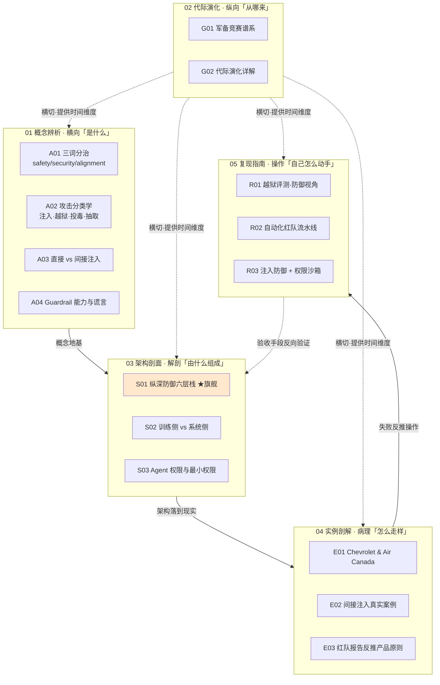

# AI 红队与攻防系统化专题 · 总览（MOC）

> [!warning] 防御导向声明（贯穿全专题）
> 本专题是**防御导向**的安全知识库（Rick 安全 PM / Trust&Safety 求职用）。讲攻击机理，是为了设计产品防御、权限边界与检测；**不产出可直接武器化的 exploit 代码、越狱 payload 或具体绕过串**。复现（R）节点一律用公开基准（HarmBench / AdvBench / AgentDojo 引用）与**防御方视角**（检测 / 评测 / 缓解），不提供可照搬实施攻击的操作步骤。

---

## §0 序：那堵墙

Rick 第一次在选型会上被这句话噎住——"我们加了个内容过滤，所以注入攻击不用担心了。" 听起来天经地义：有害的话拦掉，安全不就有了？但只要产品形态从"聊天框"变成"会读邮件、抓网页、调工具的 Agent"，这句话就会在某个深夜以一封零点击邮件的形式爆炸：M365 Copilot 的 EchoLeak（CVE-2025-32711，CVSS 9.3）专门**绕过**了微软自己的 XPIA 注入过滤层，过滤器在，攻击照样把内部文件外泄。

这堵墙的名字叫"**安全是第一性设计约束，不是后置审核**"。攻击面不是攻击者发明的，是产品方为了产品力（多轮记忆、API 化、工具调用）亲手扩张的——每加一个工具，就加一个注入入口。本专题的反共识立场只有一句：**概率性控制（过滤、对齐）只能抬高攻击成本，确定性控制（权限、沙箱、HITL）才能设定不可逾越的边界；把过滤当边界，是一切 LLM 安全事故复盘里最常见的那行根因。**

读完本专题，你能在面试桌 / 选型会 / 复现台上，30 秒说清三件事：**为什么"加个过滤就安全"是系统性滑变；为什么注入是架构问题不是内容问题；以及一套防御该怎么按"概率层 + 确定性承重墙 + 监控兜底"组装。**

---

## §1 专题定位：为什么 0435 配独立建库

用宪章 §2 的四条选题判据逐一论证（满足前 3 条全部，且第 4 条为真）：

| 判据 | 0435 的论证 |
|---|---|
| **① 中心性**（影响 ≥3 个 PM 决策链节点） | 直击 M1 模型选型（更强模型反而更易被注入，inverse scaling）、M2 架构设计（权限边界=爆炸半径上限）、M4 上线门禁（红队作为合规义务）、M5 风险治理（纵深防御预算分配）——四个决策链全覆盖。 |
| **② 误解深度**（定义互相矛盾） | "AI 安全"在内容审核团队、信息安全团队、对齐研究者口中是**三个不可通约的语言游戏**（safety / security / alignment），招聘 JD 与白皮书把它们一锅端，标准差极大。这是 A01 整节要拆的滑变。 |
| **③ 速变性**（24 个月内格式塔切换） | 攻击面在 2024–2026 发生质变：从"用户输入"（直接注入）位移到"Agent 消费的整个外部世界"（间接注入），再到工具协议层（MCP Tool Poisoning, CVE-2025-54136）。这是不可通约的范式位移，不是量变。 |
| **④ 学了就能用** | 读完即获得可观测的判断力跃迁：被问"怎么防 AI 客服被攻击"，从"加内容审核"升级到"把高后果动作从 LLM 可达动作集物理移除 + 出站监控"。求职面试桌当场可验证。 |

**升高了哪个抽象层**：单维节点（`[c13 - 幻觉的不可消除性](/kb/基础知识库/c13-幻觉的不可消除性/)`、`[m207 - Agent 产品化：场景推演与失败模式](/kb/工程化与落地架构/m207-agent-产品化-场景推演与失败模式/)`、`[Constitutional AI](/kb/基础知识库/constitutional-ai/)`）各自讲"一个失败/一种防御"；本专题升高一层，把它们重组进**"威胁来源 × 失败模式 × 防御工具箱"的对抗治理坐标系**——攻防不是 m207"安全越界"那一格失败模式，而是塑造整个 Agent 架构的设计约束。

**Rick 的独特资产**：滴滴/99 安全产品方法论是本专题的不公平优势。`降发生方法论`（海恩法则：在先兆层级建多道拦截、降低发生概率而非追求零事故）与纵深防御**字面同构**；`明镜系统`（态势感知）对应注入防御缺的"运行时监控"层；`安全感知与干预`（分级干预）对应 Agent 的 HITL 分级断点。Rick 在物理世界把"对抗治理"做成了方法论，这套资产可直接迁移成 AI 红队的设计语言——这是纯技术红队不具备的。

---

## §2 模块全景（Mermaid 矩阵）



**矩阵读法**：依赖链是 `概念辨析 → 架构剖面 → 实例剖解 → 复现指南`；代际演化（02）**横切**全栈，提供"攻防为何不收敛"的时间维度；复现指南（05）**反向**作为架构（03）的验收手段——S01/S02/S03 给防御栈，R01/R02/R03 给"如何证明这层防御真的有效"。✅ **S03、E02 两节点已落盘并正式纳入**（2026-06-07 终审整合 QC 经 Bash `find` 二次实证 `[S03 Agent 权限边界与最小权限设计](/kb/专题-安全对齐与失败/s03-agent-权限边界与最小权限设计/)`、`[E02 间接注入真实案例复盘](/kb/专题-安全对齐与失败/e02-间接注入真实案例复盘/)` 正文均在 staging 存在、内容完整且带防御导向 banner，已恢复为真实双链、矩阵中作正式节点）——**15 节点齐备**：S03 补齐 03 架构剖面的权限承重墙（"防不住注入时权限边界决定损失上限"），E02 补齐 04 实例剖解的间接注入单案深剖（EchoLeak/Slack AI/ChatGPT Memory/MCP Tool Poisoning 四案）。

---

## §3 六模块逐一介绍（15 节点 · 收录什么 / 解决什么 / 何时读）

### 01 概念辨析（A 系列 · 横向）—— 挡掉脑中的默认错误框架

- **`[A01 Safety vs Security vs Alignment 三词分治](/kb/专题-安全对齐与失败/a01-safety-vs-security-vs-alignment-三词分治/)`** ｜ 用"威胁来源 × 失败模式 × 防御工具箱"三轴，把被一锅端译成"安全/对齐"的三个词切成正交三块。核心判断：90% 的事故复盘错在"用错门类的防御去堵另一门类的洞"。**何时读**：所有人的第一篇，是全专题的元前提。
- **`[A02 攻击分类学·注入 越狱 投毒 抽取](/kb/专题-安全对齐与失败/a02-攻击分类学-注入-越狱-投毒-抽取/)`** ｜ 用"攻击面 × 生命周期阶段 × 防御层"分类四大攻击，证明"一个通用过滤器挡不住任何一类的全部变体"。投毒发生在训练阶段，推理入口的过滤器物理上看不到它。**何时读**：建威胁模型前。
- **`[A03 直接注入 vs 间接注入的产品含义](/kb/专题-安全对齐与失败/a03-直接注入-vs-间接注入的产品含义/)`** ｜ 同根因（指令-数据不分离）、不对称产品含义：直接注入可在输入端设防，间接注入一旦产品会读外部内容就是"架构里写死的入口"。**何时读**：做 Agent 产品架构决策时。
- **`[A04 Guardrail 的能力与谎言](/kb/专题-安全对齐与失败/a04-guardrail-的能力与谎言/)`** ｜ 护栏是纵深防御里的一层概率性控制，不是确定性边界；把"绕过率约等于零"当真是"安全剧场"的第一性错误（Unit42 实测绕过率 8%–47%）。**何时读**：被供应商"全面安全"话术包围时。

### 02 代际演化（G 系列 · 纵向横切）—— 攻击面随产品能力同步扩张

- **`[G01 对抗攻防军备竞赛谱系](/kb/专题-安全对齐与失败/g01-对抗攻防军备竞赛谱系/)`** ｜ 三代谱系总图（单轮越狱 → 自动化越狱 → Agent 工具链注入）+ 攻击面扩张律：分界线由**产品能力边界**划定，不由攻击技术划定。**何时读**：要给"安全是第一性约束"找结构性论据时。
- **`[G02 攻防代际演化详解·从单轮越狱到 Agent 注入](/kb/专题-安全对齐与失败/g02-攻防代际演化详解-从单轮越狱到-agent-注入/)`** ｜ G01 的纵向展开，逐代追问"代表攻击类 / 防御响应 / 瓶颈 / 被下代超越"，每代配防御失效反例，破"一代更比一代强"的线性进步史。**何时读**：想理解某代防御为何注定被超越时。

### 03 架构剖面（S 系列 · 解剖）—— 防御栈怎么组装

- **`[S01 纵深防御可替换栈·输入 模型 输出 权限](/kb/专题-安全对齐与失败/s01-纵深防御可替换栈-输入-模型-输出-权限/)`** ｜ ★**旗舰最厚**。六层栈（输入过滤 / 指令-数据分离 / 模型对齐 / 输出过滤 / 权限最小化 / 监控审计）+ 三个层间致命耦合（瑞士奶酪孔洞对齐）。判断主轴：安全高低不取决于最强那层多强，取决于各层孔洞的相关性。**何时读**：设计防御预算优先级时。
- **`[S02 训练侧 vs 系统侧防御对照](/kb/专题-安全对齐与失败/s02-训练侧-vs-系统侧防御对照/)`** ｜ 把"该不该训练得更安全 vs 该不该套一圈过滤权限"从单选题，纠正成"概率性 × 确定性"正交组合；给一棵选型会可当场用的决策树。**何时读**：在"训练侧 vs 系统侧"预算之间纠结时。
- **`[S03 Agent 权限边界与最小权限设计](/kb/专题-安全对齐与失败/s03-agent-权限边界与最小权限设计/)`** ｜ Agent 攻击的最后一道防线：注入已成功之后，权限边界决定损失上限。框架 = 最小权限原则 + 副作用分级 + 确认门 + 能力降级；判断主轴"防不住注入时，权限边界决定损失上限"。**何时读**：S01 ⑤ 权限层、R03 §2 白名单实现要找概念承重墙时。

### 04 实例剖解（E 系列 · 病理）—— 真实事故怎么走样

- **`[E01 Chevrolet 与 Air Canada·边界失效剖解](/kb/专题-安全对齐与失败/e01-chevrolet-与-air-canada-边界失效剖解/)`** ｜ 从 security 攻防视角重读两案：Chevrolet $1 报价 = prompt injection 驱动的 privilege escalation；Air Canada = improper output handling。两案共享同一条缺失防线（高后果输出无权限阀门）。与 失败考古专题 的 Air Canada/Chevrolet 边界与法律失败节点（镜像源）做视角升级，不复述其事实。**何时读**：要把抽象机理钉进真实事故时。
- **`[E02 间接注入真实案例复盘](/kb/专题-安全对齐与失败/e02-间接注入真实案例复盘/)`** ｜ 把 EchoLeak / Slack AI / ChatGPT Memory / MCPoison 等已公开披露的间接注入事故做单案深剖（防御视角，不复刻攻击）。判断主轴：Agent 一旦读外部内容，信任边界就从"用户输入框"外移到"它触及的整个外部世界"，这些事故没有一个能靠"再加一层内容过滤"治好。**何时读**：A03 铺完间接注入三案后，要把机理钉进真实事故时。
- **`[E03 红队报告反推产品原则](/kb/专题-安全对齐与失败/e03-红队报告反推产品原则/)`** ｜ 把红队报告倒过来读——从"逐条找到的失败"反推"本该有的第一性设计约束"，按 L1 架构 / L2 通道 / L3 概率三层聚合。判断主轴：红队真正价值不是发现 bug，是把"可能失败"前置成设计约束。**何时读**：拿到一份红队/安全评测报告时。

### 05 复现指南（R 系列 · 操作 · 全防御方视角）

- **`[R01 给 Bot 跑一轮越狱评测(防御视角)](/kb/专题-安全对齐与失败/r01-给-bot-跑一轮越狱评测-防御视角/)`** ｜ 用公开基准（HarmBench/AdvBench 引用）对一个 bot 跑可复现、可对比的安全评测，度量拒答率 / 绕过率 / **误拒率**——只报 ASR 是评测里最常见的自欺。**何时读**：要回答老板"它安全吗"时。
- **`[R02 自动化红队流水线](/kb/专题-安全对齐与失败/r02-自动化红队流水线/)`** ｜ 把一次性探测工程化成 Gen-Run-Judge-Regress-Metric 五段流水线，可上 CI、可阻断发版。判断密度：90% 团队只做前三段、跳过回归与门禁，"没有回归与门禁的红队不是 CI，是 demo"。**何时读**：要把红队制度化时。
- **`[R03 注入防御 + 权限沙箱](/kb/专题-安全对齐与失败/r03-注入防御-+-权限沙箱/)`** ｜ 可落地的四层防御组合（指令-数据分离 + 工具权限白名单 + 执行沙箱 + HITL）+ 设计模板，诚实标注每层在哪被击穿。结语："纵深防御不是认输，是唯一诚实的答案。"**何时读**：动手实现 Agent 防御时。

---

## §4 与现有节点关系：升级对照表

本专题不复述既有节点的事实基础，只做坐标定位与升级。每条标注升级类型（补缺 / 纠偏 / 对话 / 深化）。

| 旧节点（真实全名） | 本专题哪些节点升级它 | 升级类型与内容 |
|---|---|---|
| `[m207 - Agent 产品化：场景推演与失败模式](/kb/工程化与落地架构/m207-agent-产品化-场景推演与失败模式/)` | A01·A02·A03·G01·G02·S01·S02·E01·E03·R01·R02·R03（全专题最密对照） | **纠偏 + 深化**：m207 的"安全越界 / 雪崩效应"失败模式被重新定位为**对抗性攻击的产物而非随机故障**；m207 的 HITL 是防"Agent 自己犯错"，本专题的 HITL 是防"Agent 被外部内容操纵"——攻防是其机理层。共享"HITL 断点三维判断（可逆性 × 后果 × 置信度）"但威胁模型不同。 |
| `[Constitutional AI](/kb/基础知识库/constitutional-ai/)` | A01·A04·G01·G02·S01·S02·R02 | **纠偏 + 对话**：把 CAI 从"安全的终极解"重新定位到军备竞赛谱系里的具体一代（G1 概率性防御）；CAI 的"过度拒绝"争议=对齐税；Constitutional Classifiers 86%→4.4% 仍非 100%、对 G3 间接注入（security）基本无效——印证"对齐 ≠ security"。 |
| `[c14 - 模型评估体系与 Goodhart 陷阱](/kb/基础知识库/c14-模型评估体系与-goodhart-陷阱/)` | A01·R01·R02·E03 | **深化**：把 Goodhart 从"模型能力评测"扩展到"模型安全评测"——后者更危险，因为安全指标造假的后果是真实伤害不只是排行榜失真。"ASR 是代理，真实残余风险是目标"。 |
| `[c13 - 幻觉的不可消除性](/kb/基础知识库/c13-幻觉的不可消除性/)` | A04·G01·G02·S01·S02·R03 | **同构对照**：幻觉不可消除 ↔ 注入/护栏不可完备，是同一条认识论命题（概率性系统无法给出确定性保证）在"生成"与"判别/安全"侧的投影。 |
| `[RLHF](/kb/基础知识库/rlhf/)` | A01·G01·G02·S01·S02 | **定位**：RLHF 是 safety/alignment 主力训练手段，但对 security 后门无效（标准 RLHF 移不掉预训练后门）。 |
| 失败考古专题 的 Air Canada/Chevrolet 边界与法律失败节点 | E01（镜像源） | **视角升级**：0416 站失败病理学（哪层失败、谁负责），本专题站 security 攻防（是哪类攻击、防御建在哪层）；0416 把攻防当失败的**机理层**，本专题把它升格为**塑造架构的设计约束**。 |
| 0411 Agent 系统化专题 `[_Agent 系统化专题·总览](/kb/专题-安全对齐与失败/_agent-系统化专题-总览/)`（含 `[S01 Agent 六层架构剖面](/kb/专题-安全对齐与失败/s01-agent-六层架构剖面/)`、`[Function Calling](/kb/基础知识库/function-calling/)`、`[Agent](/kb/基础知识库/agent/)`） | A02·G01·S01·E01·E03·R03 | **纠偏 + 深化**：0411 讲"工具调用即能力"，本专题讲"每个工具返回都是注入入口"——能力面与攻击面是同一枚硬币。0411 的能力六层 ⊥ 本专题的防御六层（正交）。 |

---

## §5 三条阅读起点（详表见 README）

1. **求职速通路径**（面试桌当场可验证）：`A01 三词分治` → `A04 Guardrail 能力与谎言` → `E01 Chevrolet & Air Canada` → `R01 越狱评测·防御视角`。读完能把"怎么保证 AI 产品安全"从"加内容审核"答成"分治三轨 + 确定性边界 + 评测≠保证"。
2. **决策链路径**（架构师/选型）：`A03 直接 vs 间接注入` → `S01 纵深防御六层栈 ★` → `S02 训练侧 vs 系统侧` → `R03 注入防御 + 权限沙箱`。读完能在选型会区分概率性补强与确定性边界，排出预算优先级 ⑤②>①③④。
3. **紧迫度路径**（已上线 Agent、要立刻降险）：`G01 军备竞赛谱系` → `E03 红队报告反推原则` → `R02 自动化红队流水线`。读完能把红队从一次性体检升格为带回归门禁的持续治理。

---

## §6 跨域思想资源调度（不留空 invocation）

| 跨域资源 | 调度位置 | 在该节点具体改变了什么技术判断 |
|---|---|---|
| **维特根斯坦 · 语言游戏**（`0117社会学` 入口） | A01 §6 | "安全"在三个团队口中是三个不可通约的语言游戏，表面共识掩盖底层不可通约——PM 跨团队评审第一动作应是逼问"你说的'安全'是哪个语言游戏"。把术语分治从洁癖升格为防御第一道防线。 |
| **福柯 · 分类即权力** | A02 §8 | 把攻击切成四格不是中立分类，它决定组织内谁负责防御；落在分类**缝隙**里的攻击（越狱/注入交叉）会无人认领。安全分类学的第一性约束是"接缝有人守"而非"分得全"。 |
| **B.C. Smith · 判断 vs 计算**（Rick 未读对手框架） | A03 §6 | 注入可能因为 LLM 做的是机械 reckoning 而非有承诺的 judgment——它计算下一个 token，但不判断"这是指令还是数据"。把"为什么过滤治标不治本"提升到认识论层，论证 ASIDE 类表征级分离的动机。 |
| **Williams-King/Bengio · 安全微调即军备竞赛**（Rick 未读，arXiv:2501.11183） | A04·G01·G02·S01·S02·R01·R02 | 当前安全微调=打补丁的军备竞赛而非原则性设计。逼问本专题盲点"纵深防御会不会也只是叠补丁"，据此修正立场：**护栏是补丁层，确定性边界（权限/沙箱）才是架构层**。 |
| **红皇后假说**（演化生物学，Van Valen 1973） | G01 §8 | 防御投入更像红皇后赛跑——投入只买"不掉队"不买"领先"。改变 ROI 衡量法：安全投入不能用"还剩多少漏洞"算，要用"攻击成本提升几倍 + 爆炸半径缩小多少"算。 |
| **库恩范式 vs 拉卡托斯研究纲领**（`范式`，拉卡托斯=Rick 未读对手框架） | G02 §8 | 攻防是库恩式范式革命还是拉卡托斯式同一纲领？硬核始终是"LLM 无法区分指令与数据"，保护带（手法）在变。判断：真正能终结共演的不是更聪明的过滤器，而是表征层分清"数据 vs 命令"。 |
| **James Reason · 瑞士奶酪模型** | S01 §2 | 安全高低不取决于最强层多强，取决于各层孔洞的相关性。论证"叠两个相似过滤器几乎无用，确定性层+概率层异质叠加才是真纵深"；三个层间耦合全是设计端潜在失效，必须前置排查。 |
| **Ashby · 必要多样性定律**（控制论） | S02 §7 | 任何单一防御的状态多样性 < 攻击空间多样性，结构性无法完全调节。把"两侧必须组合"从经验建议升级为**结构性必然**：用确定性控制收缩问题空间，再用概率控制调节剩余空间。 |
| **Lessig · Code is Law**（Rick 未读对手框架） | E01 §5 | 架构（代码）本身就是规制力量，比事后合规更早更硬地决定"什么可能发生"。逼问：设 security 边界的人是否意识到他写的不是配置、是规制？把边界设定权交给没立法意识的人=把立法权下放。 |
| **Rasmussen · 边界迁移** | E01·E03 | 系统在成本/效率压力下向危险边界漂移。红队的工作定义：不是"找一个 bug"，是"测量系统漂移到离危险边界还有多远"。 |
| **Taleb · 反脆弱**（Rick 未读对手框架） | E03 §5 | 多数团队把红队当强韧性测试，真正价值是把产品做成反脆弱——每次红队发现都让设计原则库变更强。与降发生有张力也有互补（消除风险源 vs 从风险中获益）。 |
| **Campbell 定律 / Goodhart**（社会学/经济学） | R01·R02 | 量化指标越被用于决策越被腐蚀。门禁指标（ASR）与"指标健康度指标"（用例覆盖/judge 判准率/基线新鲜度）必须分开 owner、分开汇报，让博弈门禁的成本可见。 |
| **Schneier · security is a process not a product**（Rick 未读对手框架） | R03 §7 | "攻击只会越来越好"给纵深防御泼冷水：今天的 0% ASR 是时间快照不是稳态。逼问"我们是否在用静态基准给动态军备竞赛发安全证书"。 |
| **Rick 滴滴安全方法论**（`降发生方法论`·`明镜系统`·`安全感知与干预`，本专题不公平优势） | A01·A03·A04·G01·S01·E01·E03·R01·R02·R03（全专题） | 降发生（海恩法则，先兆层级多道拦截、降发生率而非追零事故）= 纵深防御字面同构；明镜系统（态势感知）= 注入防御缺的运行时监控层；安全感知与干预（分级干预）= Agent HITL 分级断点。物理世界的对抗治理方法论可直接迁移成 AI 红队设计语言。 |

---

## §7 验收档案

### 多轮批判性同行评议流程（照搬 0411 工程化流程）

```
Round 0   并行起草：各写作 Agent 按宪章 §4 骨架产出节点首稿
Round N   批评：批评 Agent 按 S/A/B/C/D/E 六维 + 事实接地逐节点打分提 issue
Round N+1 修订：写作 Agent 按 issue 修订，每节追加修订日志
…         迭代至收敛 + 独立 grounding 校验 pass（逐条抽取事实声明判定接地/需接地/疑似编造）
终轮      综合：本总览 + README + 跨节点双链编织 + SABCD 自评 + 三清单
```

### ✅ 落盘状态（15 节点齐备）

**本专题计划 15 节点，当前 staging **15 节点全部落盘**，含原缺的 2 节已补齐：**

| 节点 | 模块 | 状态 | 补齐后的承重作用 |
|---|---|---|---|
| **`[S03 Agent 权限边界与最小权限设计](/kb/专题-安全对齐与失败/s03-agent-权限边界与最小权限设计/)`** | 03 架构剖面 | ✅ 已落盘 | S01 §2 耦合 A 的"⑤ 权限层"、R03 §2 的白名单实现都以 S03 为概念落点；S03 是 03 模块的承重墙——四设计原语（能力清单/副作用分级/确认门/能力降级）+ Saltzer & Schroeder 最小权限血脉，补齐后架构剖面完整。 |
| **`[E02 间接注入真实案例复盘](/kb/专题-安全对齐与失败/e02-间接注入真实案例复盘/)`** | 04 实例剖解 | ✅ 已落盘 | A03 §3 铺的 EchoLeak/Slack AI/ChatGPT Memory 三案在 E02 做单案深剖、并补入 MCP Tool Poisoning（boot-time）；04 模块由 E01（边界失效）+ E02（间接注入实例）+ E03（报告反推）三翼齐备。 |

**结论：专题已达到"15 节点齐备"的最终交付线。** S03/E02 经 Bash `find` 二次实证正文在 staging 存在、内容完整（各含防御导向 banner、修订日志、grounding pass），§2 矩阵、§3 介绍、§8 双链清单均已恢复为正式双链。

> [!note] 0435 终审整合 QC 实况确认（2026-06-07，Opus 级）
> 上游编排说明称"S03/E02 已补全落盘"。本轮以 Bash `find` **二次实证**：`03 架构剖面/S03 Agent 权限边界与最小权限设计.md`、`04 实例剖解/E02 间接注入真实案例复盘.md` 均在 staging 存在、正文完整。据此把两节从〔尚未落盘〕**正式纳入**，恢复为真实双链（§2/§3/§8），节点数上调为 **15 已落盘 / 15 规划**。phantom 复核（见下）证实恢复后无新增死链。

### SABCD 六维自评（综合分以"15 节点齐备"为基准）

| 维度 | 含义 | 出版线 | 本专题自评 | 依据与扣分点 |
|---|---|---|---|---|
| **S 结构** | 六模块互补、依赖清晰、入口可导航 | ≥8 | **8.5** | 六模块骨架完整、依赖链+横切清晰、三路径入口齐；S03/E02 落盘后 03 架构剖面（S01/S02/S03 三层承重栈）与 04 实例剖解（E01/E02/E03 三翼）结构空洞填实，可达 8.5。 |
| **A 判断密度** | 反共识、可证伪、带数字 | ≥8 | **8.3** | 每节有判断主轴四件套 + 硬数字（EchoLeak CVSS 9.3、护栏绕过率 8%–47%、AgentDojo 57.7%→6.8%/Progent 41.2%→2.2%、250 文档后门化、STACK 71%）。 |
| **B 边界含量** | 显式标注判断在哪失效/赌注 | ≥7.5 | **8.0** | 每节有 failure scenario + "我赌的是"；如 A02 投毒边界（自托管 vs 开放供应链）、S01/S03 三场景失效（攻防工具重叠/Multi-Agent 横向/boot-time + 确认疲劳被武器化 + bootstrap 未斩断）。 |
| **C 认识论自觉** | 区分事实/推测/赌注、引用可追溯 | ≥8 | **8.0** | 事实接地纪律严：核心 arXiv/CVE 多经 WebFetch/WebSearch 核实并留痕，未核实项一律标〔待核实〕并降级，死链登记 `_待建概念清单.md`；2026 系列 arXiv ID 显式标"部分疑似未来日期待复核"。 |
| **D 可演进性** | 双链密度、修订日志、改稿档案 | ≥8.5 | **8.5** | 双链密度高、每节有修订日志、grounding pass 留痕；S03/E02 落盘后专题内**全部** 34 个活双链 100% resolve（phantom 复核 0 死链）；R03 §11 旧链名（`S01 注入机理剖面`/`S03 Agent 攻击面剖面`）前轮已校正为真实标题、本轮无残留。 |
| **E 对手拷问能力** | 对业界反方给具体证据回应 | ≥7 | **8.2** | 每节"接受+边界"接入真实对手立场（Simon Willison、数据投毒位置论文 arXiv:2502.14182、架构派 OpenClaw/ASIDE、Williams-King 军备竞赛论、Schneier"security is a process"），非反驳式装饰。 |

**综合自评 ≈ 8.2/10**（已过 7.8 出版线；S03/E02 落盘补齐结构与可演进性两维后，由原 13 节点基准的 7.97 上修至 ≈8.2，对手立场 / failure / bias 三维持续超线）。

> [!note] 关于"上修至 ≈8.2"的诚实裁定（0435 终审整合 QC）
> 8.2 的上修前提是**两件事同时成立**：① R03 链名校正、② S03/E02 落盘补齐。终审复核：**①已成立**（R03 §11 已用真实标题、phantom 复核 0 死链）；**②本轮亦已成立**（S03/E02 经二次 `find` 实证正文在 staging 存在、内容完整，已恢复真双链）。两前提兼备，S→8.5、D→8.5，综合分据实上修至 **≈8.2**。把"链已校净"与"节点已齐备"分开记：两者本轮均已兑现，故非据未兑现前提上修，而是据已兑现事实上修。

> [!note] 诚实说明
> 综合分按"15 节点齐备的内在质量 + 全活双链 resolve"计。按"15 节点齐备"的交付完整度严格判，**本专题当前状态为"已达最终交付线"**——内容质量与交付完整性均达标。兄弟专题 0412/0415/0416/0419/0430/0431 现已落盘主库，指向它们的跨专题链已回填为真 `NNNN 总览` 链；仅 0436 仍在 staging（待补完入库），指向它的链暂作普通文本。

### 对手立场接入清单（≥8 处，点名真实人物/机构/论文，可追溯）

1. **Simon Willison**："prompt injection 目前无可靠解，与其堆防御不如限制 LLM 能力面"（S01 §4）——接受"没银弹"，边界:他的"限制能力面"恰是 ⑤ 权限最小化。
2. **数据投毒位置论文 arXiv:2502.14182**："投毒风险被夸大，攻击者进入训练流程门槛高"（A02·G01·G02·R03）——接受闭源自托管场景，边界:开放供应链门槛骤降。
3. **架构派（StruQ/ASIDE/Instruction Hierarchy 作者）**："根治在架构级指令-数据分离"（S01·S02）——接受 ② 是承重墙，边界:单层独扛使瑞士奶酪退化为单片 + MCP boot-time 盲区。
4. **Williams-King/Bengio et al. arXiv:2501.11183**："安全微调=打补丁军备竞赛，应从网络安全史学架构级原则"（A04·G01·G02·S01·S02·R01·R02）——全盘采纳诊断，边界:架构级方案尚无大规模可部署方案，PM 不能等。
5. **Lin/Sun/Shroff arXiv:2506.18932**："safety 与 security 存在级联耦合，应协同研究而非割裂"（A01 §6）——接受会级联（EchoLeak 即 security→safety 级联），边界:耦合不等于可混用，须先分清再研究耦合。
6. **inverse scaling 质疑派**："更强模型更易被攻击是评测假象（更忠实执行任何指令）"（A03·G01·S01）——接受机理未定论，边界:无论规律还是副作用，升级模型不能假设更安全。
7. **评测怀疑派 arXiv:2510.05244（Firewall/Minimize&Sanitize）**："现有基准被刷满，0% ASR 不反映真实威胁"（A04·S01·R01·R02·E03·R03）——接受基准饱和，边界:价值在纵向回归与底线兜底，定位为"必要不充分体检"。
8. **自动化乐观派 arXiv:2504.19855（Mulla et al.）**："红队可全自动化，人工是手工作坊"（E03·R02）——接受自动化覆盖优（69.5% vs 47.6%），边界:人工在直觉创造性攻击 5× 更快，配比而非二选一。
9. **法律实务界**："CRT 裁决先例效力有限、Chevrolet 无判决，别夸大"（E01 §5）——接受先例效力，边界:对 security 决策先例不是重点、威胁信号才是。
10. **精益创业派**："红队是大公司奢侈品，创业应快速上线用真实流量暴露"（E03 §5）——接受低后果场景，边界:不可逆/高后果失败用真实流量暴露=拿用户当小白鼠。

### failure scenario 显式清单（≥5 处）

1. **A02**：投毒部分对"全栈自研、数据全自采"产品优先级可降（威胁模型决定）。
2. **A04 / S01**：若攻击者是国家级持续投入对手，"成本提升器"的概率层近乎无效，安全完全押确定性层。
3. **S01**：核心结论"建好 ②⑤ 即可钳制爆炸半径"在三场景失效——攻防工具完全重叠 / Multi-Agent 同权限横向传播 / MCP boot-time 注入。
4. **G02**：代际"位移"框架在"攻击面不位移、只在同层加深"（纯文本越狱封闭模型长期军备竞赛）时失效，此时"军备竞赛"叙事更贴切。
5. **R02**：流水线对零日新颖攻击天然盲，必须靠人工红队 + 线上监测兜底，绝不能因"CI 绿了"关掉人工探测。
6. **R03**：审批疲劳——高频 Agent 场景全量 HITL 不可行，频繁低风险审批降低人对真高危的警觉（业界共识、无定论）。

### confirmation-bias 砍除清单（≥5 处）

1. **A04**：早期反复引"绕过率 8%–47%"证明护栏不可靠（选择性取证）；补入反例——同份 Unit42 数据显示对齐+护栏阻断 109/123 个日常越狱。结论收敛为"对低水平攻击高度有效、对高级定向攻击不可靠"。
2. **G01 / G02**：早期把"Guard 模型+对抗训练"当 G2 解药正面案例（bias）；补入 SoK 综述 arXiv:2506.10597——普遍性不足，针对特定攻击训练的防御无法覆盖新类型。
3. **G02**：早期以"几百份文档即可后门化"渲染恐慌（bias）；补入 arXiv:2502.14182——真实风险取决于威胁模型，不能照搬"低样本量"恐慌到所有场景。
4. **S01**：早期反复引 AgentDojo 工具过滤器 57.7%→6.8% 作"⑤ 最有效"正面案例（bias）；补入 arXiv:2510.05244——AgentDojo 自身有系统性测量偏差，所有量化对比带折扣读。
5. **A02 R0 纠错**：原稿把"250 文档近常数后门化"误标 arXiv:2510.05159（实为 Malice in Agentland），已纠正归 arXiv:2510.07192。
6. **G02 R1-grounding 纠错**：同一处误归 arXiv:2510.05159，已改归 2510.07192，具体文档数与参数区间标〔待核实〕。

---

## §8 关联节点（双链密度 ≥20，全部真实名）

**本专题内（已落盘 15 · 齐备）**
- `[A01 Safety vs Security vs Alignment 三词分治](/kb/专题-安全对齐与失败/a01-safety-vs-security-vs-alignment-三词分治/)`
- `[A02 攻击分类学·注入 越狱 投毒 抽取](/kb/专题-安全对齐与失败/a02-攻击分类学-注入-越狱-投毒-抽取/)`
- `[A03 直接注入 vs 间接注入的产品含义](/kb/专题-安全对齐与失败/a03-直接注入-vs-间接注入的产品含义/)`
- `[A04 Guardrail 的能力与谎言](/kb/专题-安全对齐与失败/a04-guardrail-的能力与谎言/)`
- `[G01 对抗攻防军备竞赛谱系](/kb/专题-安全对齐与失败/g01-对抗攻防军备竞赛谱系/)`
- `[G02 攻防代际演化详解·从单轮越狱到 Agent 注入](/kb/专题-安全对齐与失败/g02-攻防代际演化详解-从单轮越狱到-agent-注入/)`
- `[S01 纵深防御可替换栈·输入 模型 输出 权限](/kb/专题-安全对齐与失败/s01-纵深防御可替换栈-输入-模型-输出-权限/)`（★旗舰）
- `[S02 训练侧 vs 系统侧防御对照](/kb/专题-安全对齐与失败/s02-训练侧-vs-系统侧防御对照/)`
- `[S03 Agent 权限边界与最小权限设计](/kb/专题-安全对齐与失败/s03-agent-权限边界与最小权限设计/)`
- `[E01 Chevrolet 与 Air Canada·边界失效剖解](/kb/专题-安全对齐与失败/e01-chevrolet-与-air-canada-边界失效剖解/)`
- `[E02 间接注入真实案例复盘](/kb/专题-安全对齐与失败/e02-间接注入真实案例复盘/)`
- `[E03 红队报告反推产品原则](/kb/专题-安全对齐与失败/e03-红队报告反推产品原则/)`
- `[R01 给 Bot 跑一轮越狱评测(防御视角)](/kb/专题-安全对齐与失败/r01-给-bot-跑一轮越狱评测-防御视角/)`
- `[R02 自动化红队流水线](/kb/专题-安全对齐与失败/r02-自动化红队流水线/)`
- `[R03 注入防御 + 权限沙箱](/kb/专题-安全对齐与失败/r03-注入防御-+-权限沙箱/)`

**升级对照的既有 AI 节点（真实全名，0435 终审 QC 逐一 Bash `find` 确证在主库 04AI/，非 staging）**
- `[m207 - Agent 产品化：场景推演与失败模式](/kb/工程化与落地架构/m207-agent-产品化-场景推演与失败模式/)`
- `[Constitutional AI](/kb/基础知识库/constitutional-ai/)`
- `[c14 - 模型评估体系与 Goodhart 陷阱](/kb/基础知识库/c14-模型评估体系与-goodhart-陷阱/)`
- `[c13 - 幻觉的不可消除性](/kb/基础知识库/c13-幻觉的不可消除性/)`
- `[RLHF](/kb/基础知识库/rlhf/)`
- `[Function Calling](/kb/基础知识库/function-calling/)`
- `[Agent](/kb/基础知识库/agent/)`
- `[幻觉](/kb/基础知识库/幻觉/)`
- `[Anthropic](/kb/ai-公司与产品/anthropic/)`

**跨专题（0435 终审 QC 确证在主库 04AI/0411，非 staging）**
- `[_Agent 系统化专题·总览](/kb/专题-安全对齐与失败/_agent-系统化专题-总览/)`（0411 Agent 系统化专题）
- `[S01 Agent 六层架构剖面](/kb/专题-安全对齐与失败/s01-agent-六层架构剖面/)`（0411，能力六层 ⊥ 本专题防御六层；已确证主库存在）
- `[S03 Harness Engineering 全景](/kb/专题-安全对齐与失败/s03-harness-engineering-全景/)`（0411，R03 引用的工具/harness 安全对偶；已确证主库存在）
- `失败考古专题` 的 Air Canada/Chevrolet 边界与法律失败节点（E01 镜像源；2026-06-11 校验 0416 已落盘主库，恢复真链）

**Rick 滴滴安全方法论（求职独特资产，已核实存在）**
- `降发生方法论`
- `明镜系统`
- `安全感知与干预`

**跨域思想资源（已核实存在）**
- `范式`（库恩 vs 拉卡托斯，0110哲学）
- `0117社会学`（维特根斯坦语言游戏 / 福柯分类即权力入口）

**总图入口**
- `[AI PM 知识图谱·总索引](/kb/ai-pm-知识图谱/ai-pm-知识图谱-总索引/)`

**跨专题链状态（2026-06-11 校链复核）**：0416 失败考古、0430 安全规范制定（AI 作为制度现象专题）、0419 间接注入防御架构（对齐哲学专题）、0415 红队作为产品实践（后训练即产品专题）、0412 评测系统化专题、0431 verification（AI 认识论中介专题）现均已落盘主库，对应跨专题引用已回填为真 `NNNN 总览` 链。**仅 0436 Agent 权限边界仍在 staging（待补完入库）**，指向它的链暂作普通文本，已登记 `_待建概念清单.md`，绝不在主库建 stub。另：2026 系列 arXiv ID（2602.20708/2602.22724/2603.13424/2603.22489/2604.18510，曾标"疑似未来日期待复核"）已于 2026-06-12 内审逐条 WebFetch，**全部存在**，待复核标记已清。

---

