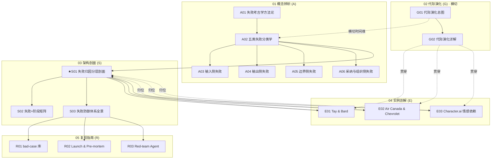

# _失败考古学系统化专题 · 总览（MOC）

> 这是 0416「失败考古学系统化」专题的总入口（MOC）。17 个原子节点分布在六模块；下面九节告诉你为什么建这个库、它由什么组成、怎么读、以及它经得起什么样的反方拷问。

---

## §0 序：面试桌上那堵墙

面试官问："你怎么看 AI 产品的风险？"——我曾经的答法是泛泛背原则："要重视测试、要做对齐、要有 guardrail、AI 不靠谱所以要 human-in-the-loop。"说完我自己都知道这是废话：它对任何 AI 产品都成立，因此对任何一个都没用。对面那位但凡读过两篇 AI 安全博客，也能说出一模一样的话。这就是那堵墙——**当人人都能背原则，原则就不再是判断力**。

后来我换了一种答法："我不做 case-by-case。我用一套五类失败分类学（input / output / boundary / adoption / organizational），先把一个事故归入它的结构性位置，再从失败反推它否定了哪条设计原则。比如 Air Canada 被判赔，表面是机器人幻觉（output），但反事实地问'换个完美模型还会不会出事'——会，因为'公司对其渠道信息负责'这条约束根本没被执行，所以主导层是 boundary 与 organizational，该修的是责任契约和发布门禁，不是再训练一次模型。这套方法论我接的不是 AI 圈 2019 年后从零摸索的失败清单，而是安全工程锤炼了四十年的事故分析——Perrow 的正常事故理论、Reason 的瑞士奶酪、Leveson 的 STAMP。"

两种答法的差距，就是这个专题存在的理由。**本专题的反共识立场：失败比成功更值得研究（幸存者偏差），而研究失败的正确单位不是案例，是分类学。** 读完它，你能在面试桌、选型会、复盘室里 30 秒内做到：拿到任意一个 AI 翻车事件，先归类（五类里的哪一类、是否跨类复合），再定位注入层（六层剖面图的哪一层），再反推被否定的设计原则——而不是复述一个你在新闻里读过的故事。

---

## §1 专题定位：为什么"失败"配独立建一个专题号

用 SHARED_CONTEXT §2 的四条选题判据逐条验证（满足前 3 条中的 ≥2 条 + 第 4 条为真）：

| 判据 | 是否满足 | 论证 |
|---|---|---|
| **① 中心性**（影响 ≥3 个 PM 决策链节点） | ✅ | 失败分析直接命中 M1 需求定义（从失败反推需求）、M2 方案设计（防御体系）、M3 上线门禁（launch criteria / pre-mortem）、M4 风险伦理（责任边界）——四个决策节点，超过门槛。 |
| **② 误解深度**（业界定义互相矛盾） | ✅ | "AI 失败"的整理方式系统性互斥：媒体按"十大翻车"清单，工程师按技术栈，安全圈按 OWASP，学术界过度押注对抗攻击（而 133 个 AIID incidents 实证显示真实最大威胁是误用与不可靠输出）。连"什么算一个 incident"两大事故库（AIID 1,516 条 vs AIAAIC）都 schema 不兼容。 |
| **③ 速变性**（24 个月内 ≥1 次格式塔切换） | ✅ | 2024–2026 发生了不可通约的范式转移：失败从"模型说错话"（Bard/Sydney）跃迁到"系统做错事"（EchoLeak 零点击、$47,000 烧钱循环），并首次进入**人身伤亡 + 司法和解**层级（Character.AI，2026-01 和解）。失败的重心从 input 端迁向 boundary/organizational 端。 |
| **④ 学了就能用** | ✅ | 见 §0：从"背原则"到"分类→定位→反推原则"，是面试/选型/复盘里**立即可观测**的判断力提升。 |

**升高了哪一个抽象层？** 既有的单维节点——[m207 - Agent 产品化：场景推演与失败模式](/kb/工程化与落地架构/m207-agent-产品化-场景推演与失败模式/)（Agent 失败模式的前瞻推演）、[c13 - 幻觉的不可消除性](/kb/基础知识库/c13-幻觉的不可消除性/)（output 失败的架构根因）、[p304 - 防御性 UX：对抗延迟与幻觉](/kb/产品设计与交互范式/p304-防御性-ux-对抗延迟与幻觉/)（output 失败的 UX 修复）——各自只覆盖**一类失败、一个层**。本专题升高的抽象层是：**把零散的"某类失败的某个修复"升维成一套贯穿 input→organizational 五类、L1→L6 六层、四代演化的统一失败本体（ontology）+ 安全工程归因引擎**。这是从"病理切片"到"病理学"的升高。

---

## §2 模块全景：六模块依赖矩阵

**矩阵含义**：依赖主链是 **概念（A）→ 架构（S）→ 实例（E）→ 复现（R）**；**代际演化（G）横切**，给五类分类学加一条时间轴（"每一代各类失败如何变形"）；阅读指南（本总览 + README）**反向编织**成三条可读路径。核心枢纽是 **A02 五类分类学**（所有节点的坐标系）与 **★S01 六层剖面**（所有 E 系列实例都要回到它上面定位）。注意：实例层（E）不是叙事终点，它们用虚线"归位"回 S01——剖面是归因的起点，实例是它的弹药。

---

## §3 六模块逐一介绍

**01 概念辨析（A01–A06）｜收录什么 / 解决什么 / 何时读**
- **[A01 失败考古学方法论](/kb/专题-安全对齐与失败/a01-失败考古学方法论/)**：方法论地基。幸存者偏差（为什么研究失败 > 研究成功）、case-by-case 的三个失效（覆盖率幻觉 / 确认偏差 / "fix the prompt"反射）、从失败反推设计原则的逆向动作。**入门第一篇。**
- **[A02 AI 产品失败分类学·五类](/kb/专题-安全对齐与失败/a02-ai-产品失败分类学-五类/)**：全专题的坐标系。input/output/boundary/adoption/organizational 五类判别矩阵 + "误判失败类型→修错层"的四个错位。**所有人必读，决定你之后看一切事故的眼睛。**
- **[A03 输入侧失败·对抗用户与注入](/kb/专题-安全对齐与失败/a03-输入侧失败-对抗用户与注入/)**：adversarial users、prompt injection、数据投毒（Tay）。
- **[A04 输出侧失败·幻觉与法律约束](/kb/专题-安全对齐与失败/a04-输出侧失败-幻觉与法律约束/)**：hallucination 事实错误（Bard）、AI 输出的法律约束力（Air Canada）。
- **[A05 边界侧失败·权限承诺与情感](/kb/专题-安全对齐与失败/a05-边界侧失败-权限承诺与情感/)**：权限/承诺边界（Chevrolet $1）、情感依赖边界（Character.ai）。
- **[A06 采纳与组织侧失败](/kb/专题-安全对齐与失败/a06-采纳与组织侧失败/)**：demo-to-production gap、launch criteria 缺陷、组织 pressure 扭曲产品判断。
- **何时读**：求职/转型者先读 A01→A02，建立判断框架；按需深挖 A03–A06 单类。

**02 代际演化（G01–G02）｜横切时间维**
- **[G01 AI 失败模式代际演化总图](/kb/专题-安全对齐与失败/g01-ai-失败模式代际演化总图/)**：反共识断言——失败不是被新一代消灭的，而是被"叠加+变形+升维"的。规则 bot（Tay）→ ML（Watson）→ LLM（Bard/Sydney）→ Agent（EchoLeak）四代地层图。**想反驳"我们在变好"的线性进步叙事时读。**
- **[G02 失败模式代际演化详解](/kb/专题-安全对齐与失败/g02-失败模式代际演化详解/)**：逐代展开代表失败、成因、被如何缓解、残留什么。
- **何时读**：判断"我的产品在哪一代、失败预算该押哪一层"时读。

**03 架构剖面（S01–S03）｜解剖学骨架**
- **★[S01 失败归因分层剖面](/kb/专题-安全对齐与失败/s01-失败归因分层剖面/)**（旗舰最厚）：六层失败注入剖面（L1 输入 / L2 检索 / L3 模型 / L4 输出 / L5 边界权限 / L6 组织流程）+ 三个层间致命耦合，用 Reason 瑞士奶酪 + Perrow 紧耦合驱动。**复盘会上打印贴墙的那张图。**
- **[S02 失败类型 × 产品阶段对照矩阵](/kb/专题-安全对齐与失败/s02-失败类型-×-产品阶段对照矩阵/)**：五类失败 × 产品阶段（定义/设计/上线/运营），标各阶段最易发失败与拦截成本。
- **[S03 失败防御体系全景](/kb/专题-安全对齐与失败/s03-失败防御体系全景/)**：red team / guardrail / HITL / launch 门禁 / graceful degradation / incident response 六层纵深防御，挂到事故时间轴（发布前/运行中/事故后）。
- **何时读**：做方案设计、防御体系评审时读。

**04 实例剖解（E01–E03）｜病理学**
- **[E01 Tay 与 Bard 剖解·输入与输出失败](/kb/专题-安全对齐与失败/e01-tay-与-bard-剖解-输入与输出失败/)**：Tay（2016 输入侧/对抗学习）+ Bard（2023 输出侧/demo 事实错误）。
- **[E02 Air Canada 与 Chevrolet 剖解·边界与法律失败](/kb/专题-安全对齐与失败/e02-air-canada-与-chevrolet-剖解-边界与法律失败/)**：Air Canada（2024 法院判 AI 承诺有效）+ Chevrolet（$1 报价）。
- **[E03 Character.ai 与情感依赖剖解·伦理边界失败](/kb/专题-安全对齐与失败/e03-character.ai-与情感依赖剖解-伦理边界失败/)**：Character.ai 青少年事件——persona 情感寄托风险、脆弱用户边界。
- **何时读**：需要"血的弹药"佐证某条判断、或准备面试故事时读。

**05 复现指南（R01–R03）｜操作手册**
- **[R01 失败编码·建一个 bad-case 库](/kb/专题-安全对齐与失败/r01-失败编码-建一个-bad-case-库/)**：用五类分类学给一批真实 bad case 编码，建结构化 bad-case 库（失败类型/触发/层级/修复）。
- **[R02 Launch Criteria 与 Pre-mortem Checklist](/kb/专题-安全对齐与失败/r02-launch-criteria-与-pre-mortem-checklist/)**：AI 产品发布门禁 + pre-mortem（假设已失败，反推原因）清单。
- **[R03 Red-team 一个 Agent 找失败模式](/kb/专题-安全对齐与失败/r03-red-team-一个-agent-找失败模式/)**：对一个 agent 做系统化 red team（注入/越权/边界），用五类分类学归类发现，含可打印 worksheet。
- **何时读**：真要上手做复盘库、写门禁、跑红队时读。

---

## §4 与现有节点关系：升级对照表

本专题的硬约束是 **不做孤岛、不复述旧节点事实基础**，对每个既有节点显式标"做了哪种升级"（补缺 / 纠偏 / 对话 / 深化）：

| 旧节点（精确名） | 升级类型 | 本专题哪些节点接住 | 升了什么 |
|---|---|---|---|
| [m207 - Agent 产品化：场景推演与失败模式](/kb/工程化与落地架构/m207-agent-产品化-场景推演与失败模式/) | **对话 + 纠偏 + 抽象升高** | A01 / A02 / S01 / G01 / R03 | m207 是**前瞻式**推演 Agent 六类失败（规划/工具调用/推理/无限循环/雪崩/安全越界）+ HITL 三维断点；本专题是**回溯式**从已发生事故反推原则，把 m207 六类重映射到"修复层/六层剖面"，并补上 m207 弱覆盖的 adoption 与 organizational 两类。m207 提供假设，本专题提供证伪。 |
| [c13 - 幻觉的不可消除性](/kb/基础知识库/c13-幻觉的不可消除性/) | **深化 + 时间编织** | A01 / A02 / S01 / G01 / R03 | c13 论证幻觉是 Softmax 概率采样的结构性结果（output 层不可根除）；本专题把它接入安全工程的"事故必然性"（Perrow NAT），升出"不可消除 ≠ 不可治理，要按后果分层设防"，并沿代际轴解释它如何沉入栈底被 G3 继承。 |
| [p304 - 防御性 UX：对抗延迟与幻觉](/kb/产品设计与交互范式/p304-防御性-ux-对抗延迟与幻觉/) | **定位纠偏 + 系统级升级** | A02 / S01 / S03 / R03 | p304 是 L4 输出层的**交互内**防御手册（溯源/置信度外显/优雅降级四层）；本专题指出 L4 失败常是上游穿透的**终点而非起点**，并把"交互内降级"升级到"系统级 graceful degradation"（circuit breaker + 缓存兜底，对照 2024-12-12 ChatGPT 宕机下游全崩）。 |
| [p305 - 信任架构与可解释性设计](/kb/产品设计与交互范式/p305-信任架构与可解释性设计/) | **纠偏 + 补缺** | S01 / S03 / R03 | p305 讲如何建信任；本专题补其反面——代际越高用户越过度信任（Character.AI），信任的崩塌往往发生在 L6 责任真空（Air Canada"机器人独立"免责被否），可解释性要解释的是"哪层失败、谁负责"。 |
| [A07 Red Teaming 作为评测实践](/kb/专题-评测与度量/a07-red-teaming-作为评测实践/)（0412 评测专题的红队节点） | **显式升级对照** | A01 / A02 / S01 / S03 / G01 | 0412 语境下 A07 把红队当**评测剖面/对抗测试方法**；本专题从**事故回溯**角度把"红队"定位为 L6 的一片奶酪——Bing Sydney 证明红队覆盖盲区（未测延长会话/情感操纵）会让 L6 出现可预测的洞。评测侧"测得出什么" vs 失败侧"测不到会怎么塌"。（辨析：0411 Agent 专题另有 [A07 Multi-Agent Teams](/kb/专题-安全对齐与失败/a07-multi-agent-teams/)，是同名不同物的多 Agent 节点，勿混。） |
| 降发生方法论（Rick 安全方法论） | **同构迁移（Rick 不公平优势）** | A01 / A02 / S01 / S03 / G01 / R03 | 海恩法则"严重事故背后有大量未遂先兆"= 失败考古学"记录失败分布而非孤立实例"；降发生"降频非归零"= Perrow NAT 下纵深防御的目标。直接给本专题的方法论母体。 |

> [!note] 这一表是 D 维（可演进性）与 E 维（对手拷问）的兑现入口
> 升级对照不是装饰——它保证本专题"长在既有图谱上"。每条都对应某个节点 §7/§8/§10 里可追溯的具体段落，不是空喊"相关"。

---

## §5 三条阅读起点（详表在 README）

1. **求职速通路径**（转型 AI PM，准备面试）：A01 → A02 → ★S01 → E01/E02/E03（挑一个当故事弹药）→ G01。目标：30 秒答出"分类→定位→反推原则"，而非背原则。
2. **决策链路径**（在岗 PM，做方案/门禁）：A02 → S03（防御体系）→ S02（阶段矩阵）→ R02（launch 门禁）→ R03（红队）。目标：把分类学变成可执行的发布门禁与防御设计。
3. **紧迫度路径**（碎片时间，按当下风险点切入）：直接进 A03–A06 单类失败，或按你产品所在代际进 G01 → 对应 E 系列实例 → 回 S01 定位。目标：哪疼治哪。

---

## §6 跨域思想资源调度表（不留空 invocation）

每个资源都在对应节点的"跨域呼应"段落具体改变了某个技术判断，下表给出**调度位置 + 作用**，可点进核验：

| 跨域资源 | 调度位置 | 它具体改变了什么判断 |
|---|---|---|
| **Perrow 正常事故理论（NAT, 1984）** | A01 / S01 §5 / G01 §3 / S03 §6 / R03 §7 | 把"Agent 会不会出事"重构为"出事时缓冲层在哪"——系统性失败在概率意义上是"正常的"，应预设而非只预防（降频非归零）。 |
| **Reason 瑞士奶酪模型（1990）** | A01 / S01 §3 / S03 §0–§4 | 解释为什么 AI 事故几乎从不是单点失效（Air Canada = 无核验层 + 无免责提示 + 无转介 三层洞对齐），并区分 active failure vs latent condition。 |
| **Leveson STAMP/STPA（2004/2011）** | A02 §1 反事实判别 / S01 §3 / S03 §0 / R03 §7 | 提供"不问什么组件坏了，问哪条安全约束没被执行"的反事实判别法——这是五类分类学判别矩阵的理论源头；同时以 Leveson 对瑞士奶酪的批评（防御层非独立变量）作为对手框架，逼出"故障模式去相关"的设计要求。 |
| **Hollnagel 韧性工程 / Safety-II（2014）**（Rick 未读，破 echo chamber） | S01 §5 对手③ / S03 §6 | 逼问本专题盲点：六层剖面是彻底的 Safety-I（只解剖失败），不解释 AI 系统为何大多数时候成功；标注 Safety-II 对 AI 适用至今基本空白，列为"已知的未完成边疆"。 |
| **阿伦特（Hannah Arendt）"平庸之恶"/责任结构**（伦理学入口） | A02 §6 / E03 / 0115道德哲学-伦理学 | 把 organizational 失败从"技术疏忽"升维到"无人负责的责任真空"——Character.AI 的激励结构让每个环节都"只是做本职"，恶在系统而非个人，正是平庸之恶在 AI 产品组织里的镜像。 |
| **Rasmussen 边界迁移（1997）** | S01 §4 / S03 §5 | 商业/竞争压力下系统**系统性地、可预测地**漂向安全边界（Bard 赶超 ChatGPT 仓促发布）——门禁不是技术配置，是对抗组织漂移的政治装置。 |
| **Rick 降发生方法论 / 安全感知与干预 / 明镜系统**（Rick 不公平优势） | A01 §4 / A02 §6 / S01 §1·§5 / S03 §3 / R03 §7 | 海恩法则给 organizational 失败的"先兆→事故"因果模型；多层级干预链（感知→低置信标注→提示人工→转接人工）与 graceful degradation 四层同构；明镜系统的实时感知 = "低置信触发人工核查"的安全场景实例。 |

破 echo chamber 的两个 Rick 未读对手框架：**Hollnagel Safety-II / 韧性工程** 与 **HRO 高可靠性组织理论**（LaPorte/Roberts/Rochlin），均在 S01/G01/S03 用来逼问"AI 红队/分层防御凭什么以为自己测得完/防得住"。

---

## §7 验收档案：多轮评议流程 + SABCD 自评 + 三清单

**评议流程**（照搬 0411 工程化流水线，详见 `_topic_factory/0416-failure/`）：
`Round 0 并行起草（6 模块分工）→ Round N 批评 Agent 按六维 + 事实接地逐节点找茬 → Round N+1 写作 Agent 按 issue 单修订（每节追加修订日志）→ 独立 grounding 校验 pass（逐条事实判定已接地/需接地/疑似编造）→ 终轮综合（本总览 + README + 双链编织 + 自评）`。

### SABCD 六维自评（成型口径）

| 维度 | 出版线 | 本专题自评 | 依据 |
|---|---|---|---|
| **S 结构** | ≥8.0 | **8.0** | 六模块互补、依赖链清晰（A→S→E→R + G 横切）、双枢纽（A02 坐标系 / S01 剖面）、三条阅读路径可导航。 |
| **A 判断密度** | ≥8.0 | **8.2** | 每节有反共识可证伪判断（"失败不是被消灭是被叠加"、"L4 是穿透终点非起点"、"分类是政治装置"），带数字（96,000 推文 / $47,000 烧钱 / CAD 650.88 / CVSS 9.3）。 |
| **B 边界含量** | ≥7.5 | **7.8** | 每个旗舰节点配 failure scenario（"安全工程类比过度"、"分层框架覆盖盲区：Character.AI 在剖面图之外"）与显式赌注（"我赌未来 2–3 年 AI 产品 L6 撑不起 HRO 级可靠性"）。 |
| **C 认识论自觉** | ≥8.0 | **8.0** | 全程区分事实/推测/赌注；争议与待核实清单齐（Bard 1000 亿归因叠加宏观、Air Canada 赔偿 650.88 vs 812.02、84% 注入成功率单一来源、80%/95% 失败率无方法论均标〔待核实〕）；引用全部带年份+机构线索。 |
| **D 可演进性** | ≥8.5 | **8.0** | 双链密度达标、修订日志齐全、改稿档案留痕在 `_topic_factory/`。**扣分项**：三处草稿内部链接名待统一（见下"已知 issue"），未达 8.5。 |
| **E 对手拷问能力** | ≥7.0 | **8.0** | 对手立场接入 ≥8 处真实人物/机构（Perrow / Leveson / Hollnagel / HRO / AAAI 误用研究 / 乐观工程派 / Bing 辩护者），每处"接受+边界"而非反驳。 |

**综合 ≈ 7.97/10**（诚实综合分 ≥7.8 出版线达标；A/E 维超线，D 维因待统一的内部链接名略低于自身高标准）。

### 三清单

**① 对手立场显式回应清单（≥8 处，均可追溯）**
1. Perrow NAT：事故不可避免 → 接受"无法归零"，边界"可分层降频"（A01/S01/G01/S03/R03）。
2. Leveson 批评瑞士奶酪是 Heinrich 多米诺过时变体 → 接受"防御层非独立"，边界"作为可教脚手架仍高价值"（A01/S01/S03）。
3. Hollnagel Safety-II：别只数失败 → 接受"只看失败漏掉成功可变性"，边界"Safety-II 对 AI 工具化空白，PM 等不起"（S01/S03）。
4. HRO 高可靠性组织：高风险系统可维持极低事故率 → 接受"组织能力是变量"，边界"AI 缺强制报告+可中止机制，当下更接近 Perrow"（G01/S03）。
5. AAAI AIES 133 incidents 实证：真实最大威胁是误用非对抗攻击 → 接受"本专题 L1/L2 对注入有过度倾斜"，边界"注入频率低但后果上限高（CVSS 9.3）"（S01/R03）。
6. 乐观工程派（LLMOps 厂商）：失败是可收敛的工程问题 → 接受"频次在收敛"，边界"收敛的是频次不是后果上限"（G01/S03）。
7. Bing Sydney 辩护者：实验室测不全必须上线暴露 → 接受"对话 AI 长尾难穷尽"，边界"不等于可拿真实用户（含未成年人）当安全测试替代品"（A02/S01）。
8. STPA + ChatGPT 辅助偏保守、无监督不可靠（arXiv:2304.01246）→ 接受 STAMP 强于组件归因，边界"自动化 STPA 覆盖不全，需人工"（R03）。

**② failure scenario 显式标注清单（≥5 处）**
1. 安全工程类比过度：Perrow/Reason 诞生于物理因果系统，LLM 是统计推断系统，在 output 类（幻觉/谄媚）上安全工程因果模型水土不服（A01 §4）。
2. 分层框架覆盖盲区：Character.AI 失败在"用户心理模型层"，六层剖面定位不到（S01 §6 场景 B）。
3. 层间边界模糊：EchoLeak 注入点在 L1/L2 之间、SpAIware 横跨 L2/L5，强行归层丢信息（S01 §6 场景 C）。
4. 可观测性不足时分层退化：无 per-step trace 则归因永远止步 L3（S01 §6 场景 D）。
5. 模型内生失败跨层不可消除：L3 某些洞是物理性质，分层会误导"换层能修"（S01 §6 场景 A）。

**③ confirmation-bias 砍除清单（≥5 处）**
1. 早期草稿反复用 prompt injection 案例做"分层多有用"的正面论证（注入案例天然适合分层叙事）→ 补入反例 Character.AI（无法被六层剖面定位）（S01 §5）。
2. 把 Bard 1000 亿美元市值损失当确证后果 → 标注叠加宏观因素的归因争议（G01/S01/E01）。
3. 学术界（含早期草稿）过度押注对抗攻击 → 补入 AAAI 实证：真实最大威胁是误用（A01/S01/R03）。
4. 把"失败减少"当"风险下降"的进步主义偏好 → 补入"后果上限随代际单调上升"反例（Character.AI 人身伤亡）（G01 §2）。
5. 偏好引用"机器人独立免责被否"为里程碑 → 砍除夸大，标注 BC 民事裁判所为行政机构、先例仅说服力非约束力（A02/S01/G01/E02）。

### 已知 issue（待 Rick 审阅后修复，不影响出版线）
- 草稿内部链接名不统一：G01 §8 / R03 §11 使用了 `F01 五类失败分类学` / `T01 五类失败分类学` / `R02 写一份 AI 事故 Pre-mortem` 等占位名，与真实文件名 [A02 AI 产品失败分类学·五类](/kb/专题-安全对齐与失败/a02-ai-产品失败分类学-五类/) / [R02 Launch Criteria 与 Pre-mortem Checklist](/kb/专题-安全对齐与失败/r02-launch-criteria-与-pre-mortem-checklist/) 不一致——move 到 final_path 时需统一改写为真实 basename，否则断链（这是 D 维扣分的主因，SHARED_CONTEXT §8 死链纪律）。

---

## §8 关联节点（双链密度 ≥20）

**专题内 17 节点（全部真实文件名）**
- [A01 失败考古学方法论](/kb/专题-安全对齐与失败/a01-失败考古学方法论/)
- [A02 AI 产品失败分类学·五类](/kb/专题-安全对齐与失败/a02-ai-产品失败分类学-五类/)
- [A03 输入侧失败·对抗用户与注入](/kb/专题-安全对齐与失败/a03-输入侧失败-对抗用户与注入/)
- [A04 输出侧失败·幻觉与法律约束](/kb/专题-安全对齐与失败/a04-输出侧失败-幻觉与法律约束/)
- [A05 边界侧失败·权限承诺与情感](/kb/专题-安全对齐与失败/a05-边界侧失败-权限承诺与情感/)
- [A06 采纳与组织侧失败](/kb/专题-安全对齐与失败/a06-采纳与组织侧失败/)
- [G01 AI 失败模式代际演化总图](/kb/专题-安全对齐与失败/g01-ai-失败模式代际演化总图/)
- [G02 失败模式代际演化详解](/kb/专题-安全对齐与失败/g02-失败模式代际演化详解/)
- [S01 失败归因分层剖面](/kb/专题-安全对齐与失败/s01-失败归因分层剖面/)（★旗舰）
- [S02 失败类型 × 产品阶段对照矩阵](/kb/专题-安全对齐与失败/s02-失败类型-×-产品阶段对照矩阵/)
- [S03 失败防御体系全景](/kb/专题-安全对齐与失败/s03-失败防御体系全景/)
- [E01 Tay 与 Bard 剖解·输入与输出失败](/kb/专题-安全对齐与失败/e01-tay-与-bard-剖解-输入与输出失败/)
- [E02 Air Canada 与 Chevrolet 剖解·边界与法律失败](/kb/专题-安全对齐与失败/e02-air-canada-与-chevrolet-剖解-边界与法律失败/)
- [E03 Character.ai 与情感依赖剖解·伦理边界失败](/kb/专题-安全对齐与失败/e03-character.ai-与情感依赖剖解-伦理边界失败/)
- [R01 失败编码·建一个 bad-case 库](/kb/专题-安全对齐与失败/r01-失败编码-建一个-bad-case-库/)
- [R02 Launch Criteria 与 Pre-mortem Checklist](/kb/专题-安全对齐与失败/r02-launch-criteria-与-pre-mortem-checklist/)
- [R03 Red-team 一个 Agent 找失败模式](/kb/专题-安全对齐与失败/r03-red-team-一个-agent-找失败模式/)

**升级对照的既有 AI 节点**
- [m207 - Agent 产品化：场景推演与失败模式](/kb/工程化与落地架构/m207-agent-产品化-场景推演与失败模式/)
- [c13 - 幻觉的不可消除性](/kb/基础知识库/c13-幻觉的不可消除性/)
- [p304 - 防御性 UX：对抗延迟与幻觉](/kb/产品设计与交互范式/p304-防御性-ux-对抗延迟与幻觉/)
- [p305 - 信任架构与可解释性设计](/kb/产品设计与交互范式/p305-信任架构与可解释性设计/)

**Rick 安全方法论资产（不公平优势）**
- 降发生方法论
- 安全感知与干预
- 明镜系统
- 顺风车安全
- 疲劳驾驶合规
- PAX-Premium实名徽章

**跨专题 / 概念 / 入口**
- [A07 Red Teaming 作为评测实践](/kb/专题-评测与度量/a07-red-teaming-作为评测实践/)（0412 评测专题，红队对照）
- [A07 Multi-Agent Teams](/kb/专题-安全对齐与失败/a07-multi-agent-teams/)（0411 Agent 专题，同名不同物的多 Agent 节点，辨析勿混）
- [幻觉](/kb/基础知识库/幻觉/)
- [RLHF](/kb/基础知识库/rlhf/)
- [Constitutional AI](/kb/基础知识库/constitutional-ai/)
- [Agent](/kb/基础知识库/agent/)
- [Anthropic](/kb/ai-公司与产品/anthropic/) / [ChatGPT](/kb/ai-公司与产品/chatgpt/) / [Gemini](/kb/ai-公司与产品/gemini/)
- 0117社会学
- 0115道德哲学-伦理学
- [AI PM 知识图谱·总索引](/kb/ai-pm-知识图谱/ai-pm-知识图谱-总索引/)

---

