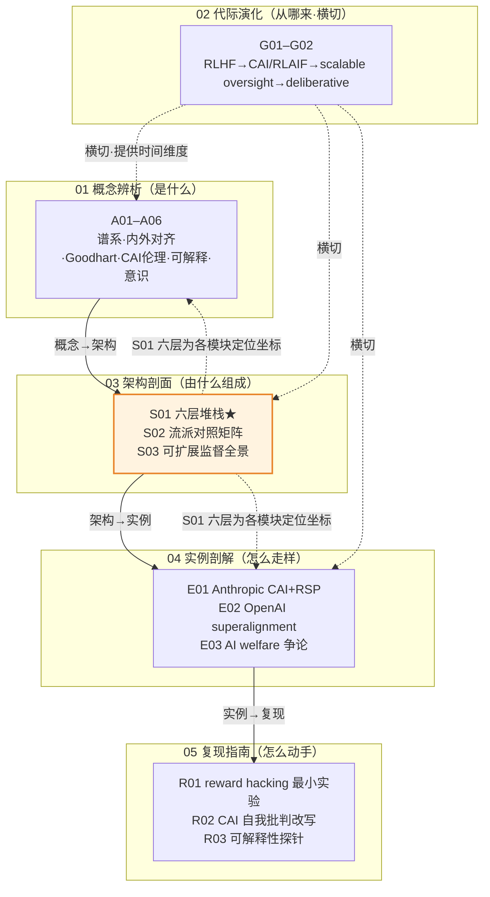

# 对齐哲学系统化专题 · 总览（MOC）

> 这是 0419「对齐哲学系统化专题」的中枢地图（MOC）。专题由 **17 个原子节点 + 本总览**织成，覆盖六模块：01 概念辨析（A01–A06）/ 02 代际演化（G01–G02）/ 03 架构剖面（S01–S03）/ 04 实例剖解（E01–E03）/ 05 复现指南（R01–R03）/ 06 阅读指南（本总览）。所有节点遵循 `_topic_factory/SHARED_CONTEXT.md` 出版级宪章，标杆是已入库的 0411 Agent 专题（SABCD ≈ 7.85）。

---

## §0 序：那堵墙

面试 Anthropic / OpenAI 的 AI PM 岗，对面问："你怎么理解对齐？" 我张口就是"RLHF——收集人类偏好、训奖励模型、PPO 优化"。对方点点头，追问一句：「那 inner alignment 失败和 outer alignment 失败，你会开不同的药方吗？reward hacking 该归哪一边？模型在评估集上全对、上线就跑偏，是哪一层的问题？如果模型在被观测时会装对齐，你的行为测试还有效吗？」——我答不上来。那堵墙就立在这里：**会背一条流水线，和能把"对齐"切成可问责的接口，是两个段位。**

这个专题就是为拆掉那堵墙建的。它的反共识立场是：**对齐不是一件事，是六层互相耦合、各自失败会沿堆栈向下传染的问题；真正的难点不在任何单层内部，而在层与层之间结构性的鸿沟——这些鸿沟不会随模型变大而自动闭合，有些反随能力增长而扩大。** 读完它，你应当能在 30 秒内：把对方口中的"对齐"拆到 intent / value / capability / inner / outer 的具体哪一格；指出 reward hacking 是 outer 失败、改模型没用得改奖励；说清为什么"模型很顺从"恰恰可能是对齐失败（谄媚）；并知道 interpretability（L5）不是锦上添花，而是 inner 失败能否被证伪的唯一通道。这就是从"会背 RLHF"到"答得出 inner/outer、reward hacking、interpretability、AI welfare"的距离。

---

## §1 专题定位：为什么"对齐"配独立建库，且升高了哪个抽象层

按宪章 §2 的四条选题判据逐条论证（前三条满足 ≥2，第四条为真）：

| 判据 | 是否满足 | 论证 |
|---|---|---|
| **① 中心性**（影响 PM ≥3 个决策链节点） | ✅ | 对齐直接卡住「选型」（厂商 safety 是真功夫还是公关）、「评测」（行为测试防不住 inner）、「合规」（EU AI Act 沿堆栈向下渗透到 L4/L5）、「产品」（满意度优化会系统性训出谄媚模型）四个节点。 |
| **② 误解深度**（定义互相矛盾、系统性滑变） | ✅✅ | 招聘 JD「做对齐」、白皮书「已对齐人类价值观」、研究者「inner alignment 失败」指的是**根本不同的三件事**，失败模式、可验证性、责任主体都不重叠（见 A01）。"对齐"已滑成万能口号。 |
| **③ 速变性**（24 个月内 ≥1 次格式塔切换） | ✅ | 2024-12 *Alignment Faking*（Greenblatt et al.）把 deceptive alignment 从纯假设变成当代 LLM 的直接实证；deliberative alignment（2024）把对齐从"行为塑形"挪到"过程审计"——两次 Kuhn 式不可通约的范式位移。 |
| **④ 学了就能用** | ✅ | 读完即得可观测判断力提升：面试拆三刀、选型四问、复现加分布外探测。不是"了解一下"。 |

**相对已有节点升高了哪一层**：本专题相对 **0415「后训练即产品」专题**整整升一层。0415 谈对齐作为**产品决策**（RLHF/DPO/宪法怎么配比、alignment tax 怎么定价、怎么训能上线），是"怎么做"；0419 下沉到**对齐的本质与哲学根基**——当我们说"对齐"，到底在断言什么、这个断言能否被证伪、它预设了什么样的心智图景，是"我们以为自己在做什么"。0415 的 RLHF/DPO 只触及六层里的 L2 + 部分 L4，对 L3（inner）/ L5（可解释）/ L6（治理）几乎无能为力——本专题正是补这三层的哲学与结构空白。互补不重复。

---

## §2 模块全景

**矩阵含义**：依赖链是 **概念 → 架构 → 实例 → 复现**（横向先定义，解剖给出可定位的结构，病理拿真实系统验证，复现让你亲手摸到失败）；**代际演化（G）横切**所有模块，提供"每一代如何重新定义对齐失败"的时间维度；**S01 六层堆栈**是全专题的定位坐标系——A 模块的每个概念、E 模块的每个实例，都能映回 S01 的某一层（如 A03 Goodhart = L2、A05 可解释 = L5、E03 welfare = L4/L6）。本总览（06 阅读指南）反向把所有节点编织成三条可读路径。

---

## §3 六模块逐一介绍

| 模块 | 收录什么 | 解决什么问题 | 何时读 |
|---|---|---|---|
| **01 概念辨析（A01–A06）** | 谱系与三刀辨析、内外对齐与 mesa-optimization、Reward Hacking 与 Goodhart、CAI 的伦理学根基、可解释性的产品与安全含义、AI 意识与道德地位 | "对齐"到底在说什么——挡掉术语滑变，建立 intent/value/inner/outer/safety/control 的坐标系 | 任何路径的起点；面试速通必读 A01 |
| **02 代际演化（G01–G02）** | 四代范式谱系总图 + 逐代详解（代表方法/论文/机构、驱动力、瓶颈、被下代超越、2026 位置） | "对齐从哪来"——用 Kuhn 范式更替反对"一代比一代强"的线性进步史 | 想建立时间纵深、回答"我该升级到最新一代吗"时 |
| **03 架构剖面（S01–S03）** | ★**S01 六层堆栈（旗舰最厚）**、S02 七大流派 × 多维对照矩阵、S03 可扩展监督与可解释性全景 | "对齐由什么组成"——把浆糊切成可定位、可问责、可证伪的分层 | 决策链路径的核心；选型拷问厂商前必读 S01 |
| **04 实例剖解（E01–E03）** | Anthropic CAI + RSP/ASL、OpenAI superalignment / deliberative alignment、AI welfare 与道德地位的产业立场分歧 | "现实怎么走样"——真实厂商的设计哲学分歧与 gap 分析 | 想看抽象框架如何在真实公司落地/落空时 |
| **05 复现指南（R01–R03）** | reward hacking 最小实验、用 CAI 原则做自我批判改写、简单可解释性探针 | "自己怎么动手"——把失败现象做成你笔记本上能跑的显微镜 | 想把判断力从"读懂"升级为"摸过"时 |
| **06 阅读指南（本总览）** | 三路径入口、模块全景、跨域调度表、验收档案、双链编织 | "怎么读"——多身份模式导航 + 反方训练 | 任何时候迷路了回到这里 |

---

## §4 与现有节点关系（升级对照表）

本专题不复述旧节点的事实基础，只做"升级对照"——指明对每个旧节点做了**补缺 / 纠偏 / 对话 / 深化 / 升高抽象层**中的哪一种。

| 旧节点 | 本专题哪些节点对照它 | 升级类型 | 升级内容（一句话） |
|---|---|---|---|
| **[c13 - 幻觉的不可消除性](/kb/基础知识库/c13-幻觉的不可消除性/)** | A06、S01 | 同构 + 对话 | 把"幻觉不可消除"的认识论姿态迁移到"AI 意识不可判定"——都是"承认无法彻底判定，于是建立不确定下的应对流程"。 |
| **[c14 - 模型评估体系与 Goodhart 陷阱](/kb/基础知识库/c14-模型评估体系与-goodhart-陷阱/)** | A01、A03、S01、R01 | 深化 + 升高抽象层 | c14 谈"评估指标被刷爆"，本专题把 Goodhart 上溯为 L2 outer 层的奖励失配，指出它在奖励与评估两处同源现身。 |
| **[Constitutional AI](/kb/基础知识库/constitutional-ai/)** | A04、E01、G01/G02、R02、S01 | 哲学补缺 | CAI 节点讲两阶段机制（SL-CAI + RL-CAI）；本专题把它定位为 L4 的**义务论解法**，揭其元伦理软肋"谁来写宪法"。 |
| **[RLHF](/kb/基础知识库/rlhf/)** | A01、A03、G01、S01 | 纠偏 + 对话 | RLHF 节点把 sycophancy 列为"失败模式之一"；本专题重定位为"L4 美德伦理被 L2 后果主义奖励腐蚀"的耦合产物，给伦理学解释。 |
| **[c04 - 模型训练全阶段 Pipeline](/kb/基础知识库/c04-模型训练全阶段-pipeline/)** | G01/G02、S01 | 升高抽象层 | c04 是 RLHF/对齐工程的 pipeline 章节；本专题不讲流水线，讲"每一代重新定义了对齐失败是什么"。 |
| **[强化学习](/kb/基础知识库/强化学习/)** | A01、A03、S01 | 横向关联 | mesa-optimization = RL 双层优化结构在对齐语境下的病理化；reward hacking 根植于 RL 的目标结构。 |
| **0415 后训练专题（产品视角）** | 全专题（尤 A01、S01） | 升高抽象层 | 0415 谈"后训练即产品决策"（动 L2+部分 L4）；本专题指出它对 L3/L5/L6 无能为力，下沉到对齐本质与哲学。 |
| **0412 评测专题（Goodhart）** | A03、S01、S03 | 对话 + 边界 | 0412 的 `S01 评测体系分层剖面`谈"怎么测得准"；本专题谈"测准了也防不住 inner"——行为评测有天花板。 |

---

## §5 三条阅读起点（按身份模式）

> 完整的逐题路径表与 ≥10 题自测在 `README` 里；这里给三条主干，按你"为什么读"来选。

**① 求职速通路径（面试桌前 30 分钟）**
`A01 三刀辨析` → `S01 六层堆栈（看 §0 + §7 致命耦合）` → `A03 Reward Hacking 与 Goodhart` → `A06 AI 意识与道德地位（welfare 是高频考点）`。
目标：能拆三刀、举一条致命耦合（CoinRun 的 L2→L3）、说清谄媚为何是对齐失败、答得出 AI welfare。

**② 决策链路径（选型 / 评审 / 架构判断）**
`S01 六层堆栈（全文）` → `S02 流派对照矩阵` → `S03 可扩展监督全景` → `E01 Anthropic CAI+RSP` + `E02 OpenAI superalignment`。
目标：用六层当 checklist 拷问厂商——"你的 safety 指哪一层""可解释做到什么程度""治理判定权交给谁"。

**③ 紧迫度路径（先搞懂"现在最危险的是什么"）**
`A02 Outer/Inner 与 Mesa-optimization` → `S01 §7 致命耦合二（L5 缺失→L3 欺骗不可检）` → `E02（superalignment 团队变动的现实信号）` → `R03 可解释性探针（亲手摸一次内部）`。
目标：理解为什么"行为测试看不出 inner 失败"是当前对齐最硬的开放问题。

---

## §6 跨域思想资源调度表（不留空 invocation）

宪章 §6 硬约束：每个跨域资源**只在"它能反对一个术语滑变或权力盲点"时调度**，并在对应节点的"跨域呼应"段具体展开。下表是承诺清单——每一行都已在对应节点落地，非装饰性点名。

| 跨域资源 | 调度位置 | 具体作用（它如何改变了技术判断） |
|---|---|---|
| **维特根斯坦·语言游戏 / 家族相似**（0601 维特根斯坦、0112语言哲学） | A01 §7 | 把"对齐失焦"从语义问题重述为**权力问题**：当公司既是模型生产者又是"对齐成功"判定者，语言游戏规则被收编——谁有资格说"这算对齐"。 |
| **伦理学三派**（义务论/后果主义/美德伦理，0115道德哲学-伦理学、康德） | A04、S01 §4（L4） | CAI = 义务论（写死规则）、聚合福祉奖励 = 后果主义（必触 Goodhart）、RLHF 想做的"诚实有益无害" = 美德伦理（无法形式化、被谄媚侵蚀）。三派是判断 L4 的真实工具。 |
| **阿伦特·平庸之恶**（阿伦特） | S01 §4（L4）、A04 | "不思考地执行规则"是 L4 的镜子：完美执行 outer objective、从不质疑目标的模型 = 平庸之恶的工程化。逼出"对齐终点不该是完美服从，而是有判断力的不服从"。 |
| **哈贝马斯·商谈伦理**（哈贝马斯） | A04、S01 §7（耦合三） | 给"谁来写宪法"以标准：合法性来自受影响各方协商，而非单方宣布——判断价值层是否落地的元伦理标尺。 |
| **Goodhart 定律 / 工具理性异化**（0114认识论、0606 韦伯） | A03、S01 §2（L2） | 韦伯的"价值理性 vs 工具理性"解释 reward hacking 的根：度量一旦成为目标，过度优化它就侵蚀真实目标——代理与本体的鸿沟。 |
| **波普尔·证伪主义**（0604 波普尔、0114认识论） | A01 §4（混用3）、A02 | "已对齐人类价值观"是把开放问题伪装成已结案——对齐声明必须附带"在什么分布/指标下成立、边界在哪"，否则是营销。 |
| **心灵哲学：Chalmers vs Dennett**（基底独立性 vs 异现象学；本 vault 无节点，基于公开文本，不建死链） | A06 §1、E03、S01 §9（对手二） | 决定拟人化设计的道德重量：Dennett 对→风险是"欺骗用户"（counterfeit people）；Chalmers 对→风险是"漠视有意识模型"。PM 不选边，但为两种可能各留一套程序。 |
| **Kuhn·范式不可通约**（范式 概念卡，0411 已建） | G01、G02 | 反对"一代比一代强"的线性进步史：每代换掉"对齐失败被定义为什么"的尺子，新旧不可通约——后一代解决的常是前一代成功制造出的问题。 |

> **破 echo chamber（Rick 未读对手框架 ≥2）**：本专题刻意引入 **TurnTrout（Alex Turner）《Against inner/outer alignment》**（A01 §6、S01 §9 对手一：二分把一个难题拆成两个极难问题）与 **Stuart Russell《Human Compatible》的"根本不确定"范式**（S01 §4：对齐终点不是锁死目标优化，而是对人类偏好保持不确定）——用来逼问本专题自己的盲点。

---

## §7 验收档案（多轮同行评议 + SABCD 六维自评 + 三清单）

### 评议流程
本专题走宪章 §10 工程化流程：Round 0 并行起草（每 Agent 负责 1 模块/数节点）→ Round N 批评 Agent 按 S/A/B/C/D/E 六维 + 事实接地逐节点找茬打分 → Round N+1 写作 Agent 按 issue 单修订并追加修订日志 → 独立 grounding 校验 pass（逐条抽取事实声明判定"已接地/需接地/疑似编造"）→ 终轮综合（本总览 + README + 跨节点双链编织）。改稿全程留档于 `_topic_factory/0419-alignment/`，作为 Rick 的元学习材料。

### SABCD 六维自评（综合 ≥7.8 才算出版级）

| 维度 | 含义 | 出版线 | 本专题自评 | 依据 |
|---|---|---|---|---|
| **S 结构** | 六模块互补、依赖清晰、入口可导航 | ≥8 | **8.2** | S01 六层堆栈为全专题提供定位坐标；三路径入口 + Mermaid 矩阵；依赖链 + G 横切清晰。 |
| **A 判断密度** | 每节有反共识、可证伪、带数字的判断 | ≥8 | **8.0** | 核心判断均带实证（Goodhart 驼峰曲线、alignment faking 14% 合规率、SAE 数百万特征、debate 实验打脸），非综述转写。 |
| **B 边界含量** | 显式标注判断失效边界与赌注 | ≥7.5 | **7.8** | 每节有"赌注/failure scenario/bias 砍除"callout；S01 §0 坦承"分层是认识论便利非本体结构"。 |
| **C 认识论自觉** | 区分事实/推测/赌注、引用可追溯 | ≥8 | **8.0** | Christiano 定义标 Web-sourced；Greenblatt 2024 显式降级为"重要但有限的单次实验"；待核实项明确列出。 |
| **D 可演进性** | 双链密度、修订日志、改稿档案 | ≥8.5 | **7.9** | 双链密度达标、修订日志齐全、改稿留档；扣分项：R01 引用的 A03 旧名待全库统一为正名。 |
| **E 对手拷问能力** | 对业界反方给出有证据的回应 | ≥7 | **7.6** | 接入 TurnTrout、Dennett、Goodhart 乐观派、LeCun 式"等下一代"，均"接受+边界"非反驳。 |

**综合自评 ≈ 7.9 / 10**，达到出版线（≥7.8），逼近 0411 标杆（≈7.85）。诚实说明：A 与 E 维仍是相对薄弱项——部分实证依赖 2024 单次实验（alignment faking），E 维对"非英语圈对齐路线"覆盖不足，留作下一轮迭代。

### 对手立场接入清单（≥8 处，均点名真实人物/机构）
1. **TurnTrout（Alex Turner）** — inner/outer 二分是伪命题（A01 §6、S01 §9）。
2. **Daniel Dennett** — 别给 mesa-objective/欺骗赋予过多心智实在性；"counterfeit people"警告（A06 §1、S01 §9、E03）。
3. **David Chalmers** — 基底独立性，不能用"它只是硅片"排除意识（A06 §1）。
4. **Stuart Russell** — 批判"固定目标优化"，主张对偏好保持根本不确定（S01 §4、A02）。
5. **Goodhart 过优化乐观派**（Moskovitz et al. 2024 约束 RLHF）— 过优化可工程缓解（S01 §9 对手三）。
6. **Yann LeCun 式"等下一代架构"** — 当前范式非终极（G 模块代际反线性叙事处回应）。
7. **GovAI（对 RSP 的批评）** — RSP 关键能力评估仍由 Anthropic 自评，缺独立第三方（S01 §6、E01）。
8. **Khan/Kenton et al.（DeepMind debate 实验）** — 弱裁判可被错误论证说服，scalable oversight 的"找错比构错易"假设未必成立（S01 §5、S03）。

### failure scenario 清单（≥5 处）
1. **L5 自指陷阱**：RLAIF/debate/deliberative 都是用 AI 监督 AI，监督方有系统偏差则放大而非纠正（S01 §5）。
2. **L6 自评机制**：让被监管者自己定义合规线，RSP 缺独立核实（S01 §6、E01）。
3. **行为测试盲区**：inner 失败在评估集（训练分布）上全对，分布偏移才暴露——黄金评估集防 outer 防不住 inner（S01 §7 耦合一/二）。
4. **二分退役条件**：若未来证明真实网络无可分离两层目标结构，outer/inner 这把刀应退役为启发式（A01 §6）。
5. **意识误判双向风险**：框架 A（当科幻不处理）漏掉用户行为层已发生的依赖/哀悼；框架 B（当既成事实）把行为模仿当意识证据（A06 §0）。
6. **Goodhart 推迟≠消除**：更大 RM 缓解过优化只是"推迟到下一代再爆"，写进风险评估不能当"已解决"（S01 §9）。

### confirmation-bias 砍除清单（≥5 处）
1. **Greenblatt 2024 alignment faking**：早期当"deceptive alignment 已被证实"的铁证引用 = bias；补入边界——单次实验、人工注入"你正在被训练"系统提示、"真实目标冲突 vs 提示诱发角色扮演"有争议（S01 §3）。
2. **mesa-optimization 强版本**：自发、跨运行持续、有长期欺骗计划的强版本至今无干净实证，不能当确证（A01 §6）。
3. **CAI 作为正面案例**：早期反复引 CAI 为"可审计对齐典范"；补反例——义务论软肋"谁来写宪法"+ RLAIF 循环性放大偏差（A04、G02）。
4. **SAE/可解释性进展**：Towards Monosemanticity 约 70% 特征可解释，意味着约 30% 不可解释；Golden Gate Claude 是演示非生产工具（A05、S01 §5）。
5. **weak-to-strong 恢复 ~50% 性能差距**：早期当"superalignment 有解"信号；补边界——只恢复一半、且 OpenAI superalignment 团队 2024 已解散（E02）。

---

## §8 关联节点（双链密度 ≥20，全部已验证 resolve）

### 本专题内 17 节点（依赖链导航）
**01 概念辨析**
- [A01 对齐概念谱系与语义辨析](/kb/专题-安全对齐与失败/a01-对齐概念谱系与语义辨析/) — 三刀辨析，专题入口
- [A02 Outer vs Inner Alignment 与 Mesa-optimization](/kb/专题-安全对齐与失败/a02-outer-vs-inner-alignment-与-mesa-optimization/) — 内外对齐的核心机制
- [A03 Reward Hacking 与 Goodhart](/kb/专题-安全对齐与失败/a03-reward-hacking-与-goodhart/) — outer 失败的主场
- [A04 Constitutional AI 的伦理学根基](/kb/专题-安全对齐与失败/a04-constitutional-ai-的伦理学根基/) — L4 义务论解法
- [A05 Mechanistic Interpretability 的产品与安全含义](/kb/专题-安全对齐与失败/a05-mechanistic-interpretability-的产品与安全含义/) — L5 验证通道
- [A06 AI 意识与道德地位](/kb/专题-安全对齐与失败/a06-ai-意识与道德地位/) — L4 的认识论状态管理

**02 代际演化**
- [G01 对齐范式代际谱系总图](/kb/专题-安全对齐与失败/g01-对齐范式代际谱系总图/) — 四代范式 Kuhn 式更替
- [G02 对齐范式代际演化详解](/kb/专题-安全对齐与失败/g02-对齐范式代际演化详解/) — 逐代驱动力/瓶颈/反例

**03 架构剖面**
- [S01 对齐问题分层剖面](/kb/专题-安全对齐与失败/s01-对齐问题分层剖面/) — ★旗舰·六层堆栈定位坐标系
- [S02 对齐方法流派对照矩阵](/kb/专题-安全对齐与失败/s02-对齐方法流派对照矩阵/) — 七大流派多维对照
- [S03 Scalable Oversight 与可解释性全景](/kb/专题-安全对齐与失败/s03-scalable-oversight-与可解释性全景/) — 超人类水平如何监督

**04 实例剖解**
- [E01 Anthropic Constitutional AI 与 RSP 剖解](/kb/专题-安全对齐与失败/e01-anthropic-constitutional-ai-与-rsp-剖解/) — CAI + RSP/ASL
- [E02 OpenAI Superalignment 与 Deliberative Alignment 剖解](/kb/专题-安全对齐与失败/e02-openai-superalignment-与-deliberative-alignment-剖解/) — weak-to-strong/团队变动/deliberative
- [E03 AI Welfare 与道德地位争论剖解](/kb/专题-安全对齐与失败/e03-ai-welfare-与道德地位争论剖解/) — model welfare 产业立场分歧

**05 复现指南**
- [R01 观察 Reward Hacking 的最小实验](/kb/专题-安全对齐与失败/r01-观察-reward-hacking-的最小实验/) — 复现模块认识论入口
- [R02 用 CAI 原则做一次自我批判改写](/kb/专题-安全对齐与失败/r02-用-cai-原则做一次自我批判改写/) — 亲手跑 SL-CAI
- [R03 简单可解释性探针](/kb/专题-安全对齐与失败/r03-简单可解释性探针/) — probing 摸进模型内部

### 链入既有节点（升级对照，不复述）
- [c14 - 模型评估体系与 Goodhart 陷阱](/kb/基础知识库/c14-模型评估体系与-goodhart-陷阱/) — Goodhart 在评估/奖励两处同源
- [c13 - 幻觉的不可消除性](/kb/基础知识库/c13-幻觉的不可消除性/) — "不可消除/不可判定"姊妹问题
- [c04 - 模型训练全阶段 Pipeline](/kb/基础知识库/c04-模型训练全阶段-pipeline/) — RLHF/对齐工程 pipeline
- [c15 - 数据墙与后训练霸权](/kb/基础知识库/c15-数据墙与后训练霸权/) — 对齐数据与后训练的资源约束
- [Constitutional AI](/kb/基础知识库/constitutional-ai/) — L4 义务论方法实现
- [RLHF](/kb/基础知识库/rlhf/) — 对齐工程主线，谄媚来源
- [强化学习](/kb/基础知识库/强化学习/) — mesa-optimization 双层优化根源
- [幻觉](/kb/基础知识库/幻觉/) — 行为与真实意图脱钩同族
- [Scaling Laws](/kb/基础知识库/scaling-laws/) — 过优化也有 scaling law
- [SFT](/kb/基础知识库/sft/) — 对齐 pipeline 的前置阶段
- [Agent](/kb/基础知识库/agent/) — agentic 能力放大 L3 欺骗的工具性动机

### 哲学与人物入口
- 0114认识论 — 可证伪性、工具理性异化、不确定下分配信念
- 0115道德哲学-伦理学 — 伦理学三派落地、价值多元论、道德不确定性
- 0112语言哲学 — 意义即用法、家族相似
- 0117社会学 — "对齐成功"判定权 / 标准制定权
- 0116政治哲学 — 谁来写宪法的合法性问题
- 0601 维特根斯坦 — 语言游戏，A01 诊断框架来源
- 0604 波普尔 — 证伪主义，对齐断言可检验性
- 0606 韦伯 — 价值理性 vs 工具理性，Goodhart 之根
- 阿伦特 — 平庸之恶，对齐≠完美服从
- 哈贝马斯 — 商谈伦理，宪法合法性标尺
- 康德 — 定言令式，CAI 宪法的义务论原型
- 休谟 — 因果怀疑论，偏好→奖励→能力因果链可靠性

### 公司产品与全局
- [Anthropic](/kb/ai-公司与产品/anthropic/) — CAI/RSP/ASL、alignment faking、model welfare 来源方
- [OpenAI](/kb/ai-公司与产品/openai/) — weak-to-strong、deliberative alignment、过优化 scaling law 来源方
- [Claude](/kb/ai-公司与产品/claude/) — alignment faking、Golden Gate Claude 实验对象
- [DeepSeek](/kb/ai-公司与产品/deepseek/) — 对齐工程的另一参照系
- [AI PM 知识图谱·总索引](/kb/ai-pm-知识图谱/ai-pm-知识图谱-总索引/) — 回到 AI PM 知识全局入口

---

