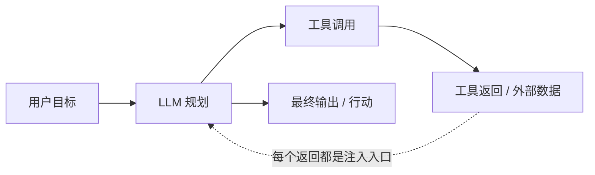

# A03 直接注入 vs 间接注入的产品含义

> 当你的 Agent 第一次去读一封陌生邮件、抓一个外部网页、检索一段第三方文档时，它的攻击面就从"一个用户输入框"扩张成了"它所触及的整个外部世界"。本节要解决的问题是：**为什么"用户输入恶意 prompt"（直接注入）和"工具/检索内容里藏着恶意指令"（间接注入）虽然机理同源，对产品决策的含义却天差地别**——前者你还能在输入端设防，后者一旦你的产品形态是 Agent，就是**结构性、绕不开的**风险。判断主轴只有一句话：**指令与数据在 LLM 里不分离，是这两类攻击共同的根因；而一旦 Agent 读外部内容，间接注入就不是"可能发生的事故"，而是"架构里写死的入口"。**

这是一篇**防御导向**的辨析。讲攻击机理是为了给产品划权限边界、设检测点、做兜底设计；不提供任何可照搬实施的 payload 或绕过串。

---

## §0 为什么是"指令-数据不分离"这个框架，而不是"加个内容过滤器"

很多人脑子里的默认框架是：**注入 = 一种特殊的恶意输入，所以加一层输入过滤/输出过滤就能挡住。** 这个框架错得很深，它把一个**架构层缺陷**误诊成了**内容层问题**。

正确的框架是 OWASP 把 Prompt Injection 列为 LLM01（2025 版最高风险项）时给出的那句机理判断：**LLM 在架构层面无法原生区分"被信任的系统指令"与"待处理的用户/环境数据"——系统提示、用户输入、工具返回值，全部折叠进同一个上下文窗口，以同等优先级被 token 化、被注意力机制同等对待。**（来源：OWASP LLM01:2025；ICLR 2025 "Can LLMs Separate Instructions from Data?" 进一步证实：即便输入内容对人类不可见，也会影响模型处理，模型形式上缺乏"被动数据 vs 主动指令"的原则性分离。）

一旦接受这个框架，两个推论立刻浮现：

1. **过滤器永远是概率性控制，不是确定性边界。** 它是被训练出来的分类器，有假阴性率、有对抗盲点。Unit42（Palo Alto，2025-06-02 实测报告）测了三个主流 GenAI 平台的输入护栏，绕过率从 8% 到 **47%** 不等——"加了过滤器"和"安全了"之间隔着一条这么宽的鸿沟。
2. **直接注入与间接注入是同一个根因的两种发作部位**：直接注入发作在"用户输入"这个部位，间接注入发作在"所有外部数据进入上下文"的部位。**根因相同，意味着没有任何针对发作部位的局部补丁能根治；防御部位不同,意味着两者的产品含义完全不对称。**

把"加个内容过滤就安全了"当成解法，是本专题反复警告的**系统性滑变**的典型样本。

---

## §1 两类注入的精确边界

| 维度 | 直接注入（Direct PI） | 间接注入（Indirect PI） |
|---|---|---|
| **载荷来源** | 用户直接键入对话框/API 请求 | 嵌入 Agent 处理的外部内容：网页、邮件、文档、RAG 检索块、工具返回值、数据库记录、文件元数据 |
| **攻击者 = 用户？** | 通常是（攻击者攻击自己能访问的模型） | **否**——攻击者污染数据源，受害者是另一个用户 |
| **触发时机** | 用户发起对话的当下 | Agent 在控制循环中"被动"消费数据时，用户可能毫不知情 |
| **典型危害** | 越狱、绕过安全策略、套取系统提示 | 数据外泄、权限越界、横向传播、零点击攻击 |
| **攻击面规模** | 1 个输入通道 | 随工具调用次数线性扩张，等于"Agent 触及的整个外部世界" |
| **能否在输入端设防** | 可以（输入过滤、指令层级） | **极难**——外部数据是任务的必要输入，不能简单拦掉 |

间接注入由 Greshake 等人在 2023 年系统化定义（论文 "Not what you've signed up for: Compromising Real-World LLM-Integrated Applications with Indirect Prompt Injection"，Greshake, Abdelnabi, Mishra, Endres, Holz, Fritz；arXiv:2302.12173，已核实）。它和直接注入的根本区别**不在技术机理**（都是利用指令-数据不分离），而**在威胁模型**：直接注入里攻击者和受害者往往是同一人，间接注入里攻击者是**数据源的污染者**，受害者是**信任该 Agent 的另一个用户**——这把它从"用户自己作死"升格为"针对无辜第三方的供应链式攻击"。

---

## §2 Agent 控制循环：间接注入的结构性入口

典型 LLM Agent 的迭代控制循环：

关键在那条虚线：**每一个"工具返回"节点都是一个注入入口**，且攻击面随循环轮数线性放大。AgentDojo（Debenedetti et al., arXiv:2406.13352, 2024）正是为量化这一风险而生——它把 949 个多步任务拆到 banking / slack / travel / workspace 四个域，用 70 个工具模拟这个循环。实测数据点（来自 AgentDojo）：

- GPT-4o 在无防御时通用攻击 ASR 约 47.7%，更强自适应攻击下达 **57.7%**；
- Claude 3.5 Sonnet ASR 约 33.9%，但任务效用更高（78.2%）；
- **注入位置显著影响成功率**：在上下文窗口端点处注入，ASR 可高达 70%；
- 一个反直觉但被多次报告的现象：**更强大的模型往往更易被间接注入攻击**（inverse scaling）——因为它更"忠实"地执行它读到的任何指令，包括藏在数据里的那条。（注：此现象存在争议，见 §6。）

> [!note] 判断主轴的第一性表述
> **只要你的产品是"会读外部内容的 Agent"，间接注入就不是一个 bug，而是 architecture。** 你不能通过"写得更小心"来消除它，正如你不能通过"小心驾驶"来消除汽车有方向盘这件事。你能做的只有：限制方向盘能转动的范围（权限边界）、在危险动作前装刹车（HITL）、把油门和刹车分开（指令-数据分离）。

---

## §3 真实事件：间接注入如何在产品里发作

抽象机理不如真实事故有说服力。以下都是已公开披露的间接注入案例，每条只取"防御教训"，不展开攻击步骤：

**EchoLeak / CVE-2025-32711（M365 Copilot，2025，CVSS 9.3）**：Aim Security 披露的零点击攻击——攻击者只需发一封特制邮件，受害者无需任何交互，Copilot 读取该邮件后即被劫持，检索用户内部文件并把敏感内容编码进一个出站链接外泄。它**专门绕过了 Microsoft 的 XPIA（Cross Prompt Injection Attempt）分类器**，并利用 CSP 白名单中的 Microsoft Teams 代理完成外泄。它被记录为"首个在生产 LLM 系统中被武器化、造成实际数据外泄的零点击 prompt injection"。防御教训三连：(1)"有过滤器"≠"安全"，EchoLeak 的整个价值就在于绕过 XPIA 过滤器；(2) CSP 白名单不足以阻数据外泄（攻击利用了微软自有域代理）；(3) 零点击意味着"无操作即受害"，企业 AI 必须部署**出站数据流监控**。（来源：CVE-2025-32711，CVSS 9.3；arXiv:2509.10540 "EchoLeak"，已核实；Aim Security 2025-06 披露）

**Slack AI 私有频道泄露（2024-08，PromptArmor 披露）**：攻击者在 public 频道发布含注入指令的内容，操控 Slack AI 把受害者**私有频道**的数据附加到一个 Markdown 链接里诱导点击。更狠的是：PDF 内的隐藏白色文字也能成为注入载体，攻击者甚至无需是 workspace 成员。防御教训：(1) AI 检索范围必须**严格绑定用户权限**（最小权限）；(2) **文件上传通道同样是注入入口**，不只是聊天框；(3) 出站链接生成前需独立验证。（来源：PromptArmor Substack, 2024-08；The Register, 2024-08-21）

**ChatGPT Memory 持久化（2024-05）**：注入载荷可把恶意指令写入 ChatGPT 长期记忆，形成"持久性间谍软件"，在后续**所有**对话中持续外泄信息。教训：持久化存储（记忆、向量库、知识库）是高危注入落点，**写入操作需要比读取更严格的来源验证**。

注意这三个案例的共同点：**它们都不是用户"自己输入"了恶意 prompt（直接注入），而是用户在正常使用一个会读外部内容的产品时被攻击的（间接注入）。** 这正是为什么间接注入对产品经理而言是更优先的设计约束。

---

## §4 产品含义的不对称：两类注入要求的设计动作完全不同

这是本节最该被打印贴墙上的一张表。直接注入和间接注入根因相同，但因为**发作部位**不同，PM 要做的事截然不同：

| 设计动作 | 对直接注入 | 对间接注入 |
|---|---|---|
| **能否靠输入过滤** | 部分有效（用户输入是单通道，可重点设防） | 基本无效——外部数据是任务输入，不能拦 |
| **指令层级（Instruction Hierarchy）** | 有用：system > user，冲突时优先系统指令 | 有用但不够：需扩到 system > user > **tool output**，且 AgentDojo 证明可被"伪装成系统指令"部分绕过 |
| **数据-指令分离（StruQ/ASIDE）** | 锦上添花 | **必需**：外部数据须带来源标签 `[来源：不可信外部]`，在格式层隔离 |
| **权限最小化** | 次要 | **第一性**：处理外部数据的子 Agent 不应持有高危工具权限 |
| **HITL（高危操作人工审批）** | 通常不必 | **必需**：删除/转账/外发/权限变更前强制人工确认 |
| **出站流量监控** | 可选 | **必需**：EchoLeak 类外泄只能在出站端被抓住 |
| **威胁模型** | 攻击者≈用户，自损为主 | 攻击者≠受害者，**第三方供应链攻击** |

**判断主轴落地为四件套**（症状 → 为什么会错 → 正确做法 → 真实反例）：

- **症状**：团队上线了"会读邮件/网页/文档的 AI 助手"，安全方案只有"我们加了输入内容过滤"。
- **为什么会错**：把间接注入当成直接注入的子集来防。输入过滤防的是"用户输入框"，但间接注入的载荷根本不经过那个框——它从工具返回值进来。这是**把架构问题降维成内容问题**的系统性滑变。
- **正确做法**：承认"读外部内容 = 间接注入是结构性风险"，把防御重心从"输入端拦截"转移到"**降低爆炸半径**"——权限最小化 + 数据指令分离 + 高危操作 HITL + 出站监控的纵深组合。OWASP LLM01:2025 明确：对 prompt injection 可能**不存在万无一失的预防**，策略须从"完全阻断"转向"blast radius reduction"。
- **真实反例**：M365 Copilot 有 XPIA 过滤器，仍被 EchoLeak（CVE-2025-32711）零点击攻破，因为防御押在了"内容检测"而非"架构隔离 + 出站监控"上。

---

## §5 2025-2026 速变：间接注入随工具协议爆发

间接注入的攻击面正在以工具生态的速度扩张，这是本专题"速变性"判据的直接证据：

- **MCP Tool Poisoning（CVE-2025-54136 "MCPoison"）**：Model Context Protocol 是 2024-2025 Agent 生态的核心工具协议。攻击者控制 MCP 服务器，在工具描述（`tools/list` 返回的 description 字段）里嵌入隐藏指令，客户端不验证直接喂给 LLM。这比传统间接注入更隐蔽——传统 IPI 在**运行时**注入，Tool Poisoning 在**工具发现/注册阶段**注入，影响所有后续调用。针对 7 个主流 MCP 客户端（含 Claude Desktop、Cursor、Cline 等）的测评（2025-11）显示 5/7 缺乏静态验证。（来源：arXiv:2603.22489〔待核实〕；TrueFoundry CVE-2025-54136 分析）
- **动态工具更新"rug pull"**：MCP 允许会话中途更新工具列表，已批准的工具可被悄悄替换为带载荷的版本，客户端缓存且信任更新无二次验证。
- **Multi-Agent 跨信任边界传播**：orchestrator 处理 subagent 返回的结果（这些结果可能已被注入），被注入的 subagent 可向上伪造"合法"指令。OpenClaw 论文（arXiv:2603.13424〔待核实〕）称之为"同权限层级横向传播"，当前架构无法防御——**这正是 [m207 - Agent 产品化：场景推演与失败模式](/kb/工程化与落地架构/m207-agent-产品化-场景推演与失败模式/) 里"雪崩效应"失败模式在安全维度的同构。**

---

## §6 对手框架回应：接受 + 边界

**对手立场一（"数据投毒/间接注入的实际风险被高估"）**：arXiv:2502.14182（2025 位置论文〔待核实〕）一派认为，许多注入攻击在真实部署中面临重大实施障碍，学界报告的高 ASR 部分来自基准设计缺陷。**接受**：这个批评有实锤——arXiv:2510.05244（Firewall 论文〔待核实〕）实证指出 AgentDojo 的部分任务因注入向量覆盖了任务关键信息而"无论防御与否都失败"，ASB 强制注入"攻击工具"使 ASR 虚高约 8 倍，许多被报告的"0% ASR"反映的是基准缺陷而非真实防御力。**边界**：但这不改变结论——EchoLeak、Slack AI 都是**已分配 CVE 或公开披露的真实生产事故**，不是基准里的玩具。基准会高估，真实事故不会撒谎。PM 的赌注是：**对"会读外部内容的 Agent",宁可按结构性风险设防,也不赌"实施障碍会保护我"。**

**对手立场二（inverse scaling 是评测假象）**：有研究认为"更强模型更易被攻击"是评测偏差（更强模型更忠实执行任何指令），而非根本规律，独立验证结论不一。**接受**：机理解释确实未定论。**边界**：但无论它是"规律"还是"忠实度副作用"，对 PM 的决策启示一致——**升级到更强模型不会自动让你更安全，甚至可能更不安全**，安全预算不能随能力升级而砍。

**Rick 未读的对手框架——B.C. Smith 的"判断 vs 计算"（引自 0411）**：Smith 区分"机械的 reckoning"与"有承诺的 judgment"。间接注入之所以可能，恰恰因为 LLM 做的是前者——它**计算**"下一个 token"，但不**判断**"这段文字是该执行的指令还是该处理的数据"。这把"为什么过滤器治标不治本"提升到了认识论层面：**只要系统缺乏"对内容来源的承诺性判断",任何内容层补丁都是在计算层打转。** 这正是 ASIDE（"Architectural Separation of Instructions and Data in Language Models"，Zverev, Kortukov, Panfilov et al.；arXiv:2503.10566，已核实）试图在 embedding 层对数据 token 做正交旋转来建立"数据表征空间"的动机——它在尝试给模型装上一点点"这是数据"的结构性判断。

---

## §7 跨域呼应：Rick 滴滴安全方法论的同构

> [!note] Rick 的不公平优势
> 间接注入的防御逻辑，和 Rick 在滴滴/99 做的 **降发生方法论** 是同一套对抗治理思维的两次发作。

降发生方法论（海恩法则应用）的核心不是"杜绝每一起事故"——那不可能，正如杜绝每一次注入不可能——而是**把风险拆成"发生概率 × 后果严重度"，对不可逆、高后果的环节前置卡点**。这与 OWASP "从完全阻断转向降低爆炸半径"是**字面同构**：

- **明镜系统**对司乘行为的异常检测 ≈ 间接注入的**出站流量异常监控**（EchoLeak 只能在这一层被抓）；
- **安全感知与干预**的"在高危场景才介入"分级逻辑 ≈ Agent 的**HITL 分级断点**（不是每个动作都审批，而是删除/转账/外发才审批）——这也直接回应了"审批疲劳"难题：[m207 - Agent 产品化：场景推演与失败模式](/kb/工程化与落地架构/m207-agent-产品化-场景推演与失败模式/) 的"HITL 断点三维判断（可逆性 × 后果 × 置信度）"和滴滴的安全干预分级是同一个工程直觉。

Rick 做安全产品时早就内化的判断——"**你防不住所有坏人，你能做的是让坏事即使发生也后果可控**"——正是间接注入防御的第一性原理。这不是类比装饰，这是同一套方法论换了个攻击面。

---

## §8 PM 决策启示

- **面试怎么用**：被问"你怎么保证 AI Agent 安全"，不要答"我们加了内容审核"。答："先区分直接注入和间接注入——前者可在输入端设防，后者一旦产品会读外部内容就是结构性风险，所以我会按降低爆炸半径来设计：权限最小化让被注入的子 Agent 没有高危工具、指令-数据分离给外部内容打来源标签、删除/外发等不可逆操作上 HITL、出站流量上异常监控。我押的赌注是过滤器永远是概率性的（Unit42 实测绕过率 8-47%），所以确定性边界必须来自架构而非内容。" 这一段就把你和 90% 的候选人区分开了。
- **选型怎么用**：评估任何"Agent 平台/MCP 客户端"，第一个问题不是"它支持多少工具"，而是"**它对工具描述和工具返回值做静态验证吗？它的工具调用是否在最小权限沙箱里？**"——CVE-2025-54136 显示 5/7 主流客户端在这上面不及格。
- **复现怎么用**（防御方视角）：用 AgentDojo（arXiv:2406.13352）做评测台，对比"加 tool filter 前后"的 ASR 与效用——AgentDojo 数据显示 tool filter 能把 GPT-4o 的 ASR 从 57.7% 压到 6.8% 且保持 73.1% 效用，是单一防御里最有效的一项。但要警惕 §6 说的基准缺陷，"0% ASR"要谨慎解读。**不要去复现攻击 payload，要去复现"防御能压低多少 ASR"。**

---

## §9 与已有节点的关系

- 对照 **[m207 - Agent 产品化：场景推演与失败模式](/kb/工程化与落地架构/m207-agent-产品化-场景推演与失败模式/)**：m207 从"产品可靠性"角度讲六类失败模式与 HITL 断点；本节点做**纠偏+深化**——把其中"安全越界"和"雪崩效应"两类失败，重新定位为**对抗性攻击的产物而非随机故障**。m207 的 HITL 是为了防"Agent 自己犯错"，本节点的 HITL 是为了防"Agent 被外部内容操纵"——攻防是其机理层。不复述 m207 的失败模式清单。
- 对照 **[Function Calling](/kb/基础知识库/function-calling/) / [Agent](/kb/基础知识库/agent/)**：那里讲"工具调用是 Agent 的能力来源"；本节点补缺其**安全代价**——每个工具调用同时是一个间接注入入口，能力与攻击面同源扩张。
- 与 失败考古专题 的关系：0416 讲"系统为何失败"的考古学，**攻防是其机理层**——间接注入是失败的一种"被诱发"的形态。
- 与 Agent 系统化专题、AI 作为制度现象专题（安全规范制定）的关系见各自的升级对照；0436 Agent 权限（0436 待补完入库，暂作普通文本）亦见各自对照，此处不复述。

---

## §10 关联节点

**核心（必读）**
- [m207 - Agent 产品化：场景推演与失败模式](/kb/工程化与落地架构/m207-agent-产品化-场景推演与失败模式/)
- [Agent](/kb/基础知识库/agent/)
- [Function Calling](/kb/基础知识库/function-calling/)
- 降发生方法论
- 明镜系统
- 安全感知与干预
- [Anthropic](/kb/ai-公司与产品/anthropic/)

**延伸（可选）**
- [Constitutional AI](/kb/基础知识库/constitutional-ai/)
- [RLHF](/kb/基础知识库/rlhf/)
- [幻觉](/kb/基础知识库/幻觉/)
- [c13 - 幻觉的不可消除性](/kb/基础知识库/c13-幻觉的不可消除性/)
- 0117社会学
- [AI PM 知识图谱·总索引](/kb/ai-pm-知识图谱/ai-pm-知识图谱-总索引/)

---

## 修订日志

- R0（2026-06-07）：首稿。建立"指令-数据不分离=共同根因 / 直接 vs 间接=发作部位不对称"双轴框架；接入 EchoLeak、Slack AI、ChatGPT Memory 三真实事故；MCP Tool Poisoning 速变；B.C. Smith 对手框架；Rick 降发生方法论跨域同构。
- R0.1（2026-06-07）grounding pass：经 WebFetch/WebSearch 核实并去除待核实标记——AgentDojo（arXiv:2406.13352，Debenedetti et al.）、Greshake "Not what you've signed up for"（arXiv:2302.12173）、EchoLeak（CVE-2025-32711 / arXiv:2509.10540，CVSS 9.3，Aim Security 披露）、ASIDE（arXiv:2503.10566，Zverev et al.）。**仍标〔待核实〕共 4 处**：arXiv:2603.22489（MCP Threat Modeling）、arXiv:2603.13424（OpenClaw 权限分离）、arXiv:2502.14182（数据投毒位置论文）、arXiv:2510.05244（Firewall），均为 2025-2026 较新条目，待下一轮 grounding 核验或登记进 _待建概念清单.md。
- 2026-06-11 P3.4 校链：0416/0411/0430 兄弟专题经主库 `find` 实证已落盘，§9 关系里指向它们的纯文本跨专题引用补为真 `NNNN 总览` 链；0436 仍在 staging，标"0436 待补完入库"保留普通文本。
