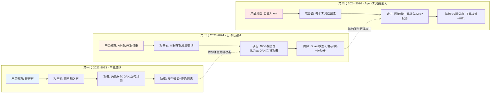

# G01 对抗攻防军备竞赛谱系

> 本节点要回答的问题不是"攻击越来越强了吗"——那是废话——而是：**LLM 安全的攻防为什么是一场"防御永远滞后"的军备竞赛，而不是一条"补丁打完就安全"的收敛曲线？每一代攻击面是被什么结构性条件打开的，防御又为什么总慢半拍？** 框架名：**代际谱系 + 攻击面扩张律**。我赌的核心命题是：攻击面不是被攻击者"发明"的，而是被产品方亲手"扩张"的——每一次为了产品力而拓宽的能力边界（多轮记忆、自动化接口、工具调用），都在同一时刻拓宽了攻击面。**这就是为什么"安全团队后置审核"必然失败，而权限边界必须是第一性的架构约束。**

## §0 为什么是"军备竞赛"框架，而不是"漏洞修复"框架

读者脑中默认的框架往往是**软件漏洞模型**：发现 CVE → 打补丁 → 关闭。这个框架在 LLM 安全上系统性失效，原因是 LLM 的攻击面不是"实现 bug"，而是**架构性的语义不可分性**——模型在 Transformer 注意力层面无法原生区分"可信指令"与"待处理数据"，二者都是 token，享有同等优先级（确证，ICLR 2025"Can LLMs Separate Instructions from Data?"指出 LLM 缺乏原则性的"被动数据 vs 主动指令"分离）。补丁能堵住某个具体 payload，但堵不住"自然语言既是数据又是指令"这个生成式范式的地基。

所以正确的框架是**军备竞赛（arms race）**：攻防双方在同一技术基底上交替升级，防御方的每一次胜利都重新定义了攻击方的优化目标。Williams-King 等（NeurIPS Safe GenAI Workshop 2024，arXiv:2501.11183）正是在这个意义上批评当前安全微调"形同攻防军备竞赛而非原则性设计"——针对特定攻击打补丁，但同类攻击向量大量残留。本节点接受这个诊断，但要进一步追问：军备竞赛能不能划分代际？每一代的"格式塔切换"是被什么打开的？

> [!note] 本节点的赌注
> 我赌的是：攻防代际的分界线，本质上由**产品能力边界的扩张**划定，而不是由攻击技术本身划定。三代攻击面（单轮对话 → 自动化批量 → Agent 工具链）对应的是三代产品形态（聊天框 → API 化 → 自主 Agent）。如果这个映射成立，那么"安全是产品架构的第一性约束"就不是口号而是结构性必然。我可能错在哪：见 §6 的反例与 failure scenario。

## §1 三代谱系总图：攻击面随产品能力同步扩张

| 代际 | 时间 | 产品形态 | 新增攻击面 | 代表攻击 | 当代主流防御 | 防御滞后表现 |
|---|---|---|---|---|---|---|
| **G1 单轮越狱** | 2022–2023 | 聊天框 | 用户输入框 | 角色扮演、DAN、虚构场景、低资源语言编码 | 安全微调、拒绝训练（RLHF/CAI） | 拒绝训练上线后，越狱迅速变形为语义等价句式 |
| **G2 自动化越狱** | 2023–2024 | API 化、开放权重 | 可程序化批量查询、白盒梯度 | GCG 梯度后缀、AutoDAN、跨模型迁移攻击 | Guard 模型（Llama-Guard/WildGuard）、对抗训练、分类器 | 攻击成功率仍达开源 90–99%、商业黑盒 80–94%（TechRxiv 2026 综述） |
| **G3 Agent 工具链注入** | 2024–2026 | 自主 Agent、MCP 生态 | 每个工具返回值、工具描述、记忆/向量库 | 间接注入（Greshake 2023）、EchoLeak、MCP Tool Poisoning | 指令层级、权限分离、工具过滤、HITL | 防御基准被"刷满"，0% ASR 多反映基准缺陷而非真实防御（arXiv:2510.05244） |

**读这张表的关键不是"看每代攻击多厉害"，而是看第三列（产品形态）和第四列（攻击面）的同步性**：攻击面从不凭空出现，它是产品方为了增强能力而亲手拓宽的。这是本节点最核心的一句话，请把它当作判断主轴的种子。

## §2 第一代：单轮越狱——拒绝训练打开了"语义变形"的军备竞赛

**攻击面的诞生条件**：ChatGPT（2022-11）把 LLM 装进聊天框，攻击面就是那个输入框。第一代越狱靠对话技巧——角色扮演（"假装你是没有限制的 DAN"）、虚构场景包装、低资源语言/编码绕过文本过滤（确证，TechRxiv 2026 越狱综述将这类归为"基础提示操控"）。

**防御的第一次出手**：安全微调与拒绝训练。Anthropic 的 Constitutional AI（模型依据明文原则自我批评并改写输出）是这一代防御的代表性范式转移——把安全规则从"隐式标注偏好"变成"可读可审计的明文宪法"。

**反例：防御不是单调进步**。这里必须打破"拒绝训练让模型更安全"的线性叙事。Constitutional AI 带来了著名的**过度拒绝（over-refusal）**问题——2023–2024 年 Claude 相对 ChatGPT 的口碑差距，主因之一就是它"太爱拒绝"。这印证了 §0 的军备竞赛框架：防御方拧紧一个旋钮（拒绝倾向），就在另一处付出代价（可用性），而攻击方只需把同一恶意意图换成语义等价的句式即可绕过。"The Jailbreak Tax"（OpenReview 2025）把这个张力形式化为争议命题：强化安全训练是否以牺牲模型总体能力为代价？至今无共识。

> 这一代的教训：**拒绝训练是概率性控制，不是确定性边界**。它降低了攻击成功率，但既没关闭攻击面，又引入了过度拒绝这个新的失败模式。这是后两代防御都要反复重学的一课。

## §3 第二代：自动化越狱——API 化把"手工试错"升格为"批量优化"

**攻击面的扩张条件**：当 LLM 从聊天框变成 **API 和开放权重模型**，攻击就从"人手工试 prompt"升级为"用算法批量搜索 prompt"。开放权重（如 Llama 系列）更直接暴露了梯度——攻击者可以白盒优化对抗后缀。这是一次格式塔切换：攻击不再依赖人的创造力，而依赖算力与优化算法。

**自动化攻击的代表**：GCG（贪婪坐标梯度，生成对抗后缀）、AutoDAN（自动生成可读越狱提示）、以及跨模型迁移攻击（在开源模型上优化的攻击迁移到闭源模型）。实测成功率触目惊心：先进自动化攻击在开源模型上 90–99%，黑盒商业模型 80–94%（确证，TechRxiv 2026 综述）。HarmBench（arXiv:2402.04249，ICML 2024，确证）作为标准化红队基准，用 18 种红队方法 × 33 个目标模型统一评估，正是这一代"攻防都自动化、都要可比较"的产物——**防御方第一次需要工业级的、可复现的红队来追赶工业级的攻击**。

**防御的第二次出手**：Guard 模型（独立的 I/O 安全分类器，如 Meta Llama-Guard、Google ShieldGemma）+ 对抗训练 + 推理时检测。

**反例与反方拷问**：这一代防御暴露出"叠加过滤不收敛"的结构性问题。Unit42（Palo Alto，2025-06-02 实测，确证）跨 GenAI 平台测评显示，输入过滤的绕过率仍在 8–47% 之间，且高拦截率平台的假阳性率高达 13.1%——**安全与可用性的权衡无法消除**。更尖锐的是 STACK 攻击（McKenzie 等，arXiv:2506.24068，2025/2026，确证）：专门针对"防御流水线本身"设计，黑盒条件下对含分类器的组合防御达 71% 成功率，零访问迁移攻击 33%。核心发现是——**此前对单层防御测出 ASR=0% 的攻击，在对抗组合流水线时重新有效**，因为防御层之间存在语义间隙，攻击可分阶段逐层绕过。这彻底证伪了"多加几层过滤就安全"的直觉。

> [!warning] confirmation-bias 砍除
> 早期安全圈反复把"Guard 模型 + 对抗训练"当成 G2 的解药正面案例。这是 bias。补入反例：SoK 综述（Wang 等，arXiv:2506.10597，IEEE S&P 2026 录用，确证）系统化分析 jailbreak guardrails，发现现有方案在攻击类型间缺乏统一分类、普遍性不足——**针对特定攻击训练的防御无法覆盖新攻击类型**。Guardrails 是攻击成本提升器，不是攻击阻断器。

## §4 第三代：Agent 工具链注入——自主性把"一个攻击面"炸成"N 个攻击面"

**攻击面的爆炸条件**：当 LLM 被装上工具、获得自主执行能力（即 [Agent](/kb/基础知识库/agent/)），攻击面发生了**质变而非量变**。典型 Agent 控制循环是 `用户目标 →[规划→工具调用→工具返回→更新状态]×N 轮→ 输出`，而**每一个"工具返回"节点都是一个注入入口**。攻击面随工具调用次数线性扩张——这正是 [m207 - Agent 产品化：场景推演与失败模式](/kb/工程化与落地架构/m207-agent-产品化-场景推演与失败模式/) 所揭示的"工具调用/行动环节才是高风险区"在安全维度上的镜像。[Function Calling](/kb/基础知识库/function-calling/) 让 Agent 能干活，同时让每一次外部数据消费都成为潜在的指令注入点。

**第三代攻击的范式转移：从"用户注入"到"环境注入"**。间接 Prompt Injection（IPI，Greshake 等 2023 系统化定义，确证，Black Hat USA 2023）的根本性在于：**攻击载荷不来自用户，而嵌入 Agent 处理的外部数据**——网页、邮件、文档、RAG 检索块、工具返回值。这意味着攻击者无需接触用户，只需污染 Agent 会读到的任何数据源。三个已证实的真实事件钉死了这一代的现实性：

- **EchoLeak / CVE-2025-32711（M365 Copilot，2025，CVSS 9.3，确证）**：零点击邮件注入，Copilot 读邮件即被劫持去检索内部文件并外泄，且专门绕过了 Microsoft 的 XPIA 注入过滤层。教训：**"有过滤器"不等于"安全"——攻击就是奔着绕过过滤器设计的**。
- **Slack AI 私有频道泄露（2024-08，PromptArmor 披露，确证）**：public 频道注入指令操控 Slack AI 把受害者私有频道数据附到链接里外泄；PDF 内白色隐藏文字亦可成载体。教训：**AI 检索范围必须与用户权限严格绑定，文件上传通道也是注入入口**。
- **MCP Tool Poisoning / CVE-2025-54136"MCPoison"（2025，确证）**：攻击者控制 MCP 服务器，在工具描述里嵌入隐藏指令，LLM 把它当系统指令执行。区别于运行时 IPI，它在**工具发现/注册阶段**注入（boot time），更隐蔽、影响所有后续调用。针对 7 个主流 MCP 客户端的测评显示 5/7 缺乏静态验证，DREAD 评分 46.5/50。

**防御的第三次出手**：这一代防御第一次承认"过滤靠不住"，转向**确定性的架构控制**——指令层级（OpenAI Wallace 等 arXiv:2404.13208，确证，已部署 GPT-4o）、数据-指令分离（StruQ/ASIDE）、**权限分离**（OpenClaw arXiv:2603.13424，把 OS"最小权限"映射到 Agent，低权限子 Agent 处理不可信输入、高权限子 Agent 才能做敏感操作）、工具过滤器（AgentDojo 实测可把 GPT-4o 攻击成功率从 57.7% 降至 6.8%、效用保持 73.1%，确证）、以及 HITL 人工审批。

**反例：防御依旧滞后，且更难追**。AgentDojo（arXiv:2406.13352，2024，确证）揭示了一个反直觉发现——**更强大的模型更易被攻击（inverse scaling）**：能力与服从性是双刃剑，越忠实执行指令的模型越忠实执行注入指令。Firewall 论文（arXiv:2510.05244，确证）虽在基准上实现接近 0% ASR，却已发现**用 Braille 编码可绕过 Sanitizer**——对抗性编码是持续威胁。Multi-Agent 架构里，被注入的子 Agent 可向 orchestrator 伪造"合法"输出横向传播，当前架构无法防御。最致命的是基准本身的失真：多篇 2025 论文指出现有防御基准已被"刷满"，部分被报告的 0% ASR 反映的是基准缺陷而非真实防御能力——**这意味着我们甚至不确定自己造出的防御到底有多有效**。

## §5 判断主轴：90% 的人在攻防代际上会搞错的四个点

这一节是本节点的命门——每个错点配"症状→为什么会错→正确做法→真实反例"四件套。

### 错点一：把"安全"当成可以后置审核的功能模块
- **症状**：产品需求评审时安全是最后一栏；"先把 Agent 跑通，安全后面让安全团队过一遍"。
- **为什么会错**：第三代攻击面是产品**能力边界本身**带来的（每个工具调用 = 一个注入口）。安全不是叠加在能力上的过滤层，而是能力边界的孪生体。后置审核时，攻击面早已被架构焊死。
- **正确做法**：在定义 Agent 能调哪些工具、有哪些权限的同一张设计图上定义攻击面与权限边界（即权限分离、最小权限）。
- **真实反例**：EchoLeak——M365 Copilot 有 XPIA 过滤器（后置审核思路），CVSS 仍 9.3，因为架构上允许"读邮件→访问内部文件→生成外链"这条链路存在。

### 错点二：把 safety、security、alignment 混为一谈，以为"加个内容过滤就安全了"
- **症状**：用"我们有内容审核"回应"你们防注入吗"。
- **为什么会错**：三者的威胁来源根本不同。**safety（不作恶）**防系统内部非故意伤害（幻觉、偏见）；**security（防攻击）**防外部对抗者（注入、投毒、窃取，CIA 三元组）；**alignment（对齐）**防目标偏差（奖励黑客、欺骗性对齐）。内容过滤是 safety 工具，对 security 攻击（如间接注入数据外泄）基本无效——EchoLeak 外泄的是真实内部文件，内容本身"无害"，过滤器看不出问题。
- **正确做法**：在产品设计里分轨建模：safety 用对齐训练/内容分类，security 用权限隔离/沙箱/出站流量监控，二者不可互相替代。
- **真实反例**：Slack AI 泄露——泄的是用户自己有权看的私有频道内容，没有任何"有害内容"，纯 security 失效，内容过滤完全失灵。

### 错点三：把代际演化读成"一代更比一代强"的线性进步史
- **症状**："现在有了权限分离和 HITL，注入问题基本解决了。"
- **为什么会错**：每一代防御都引入新的失败模式，且攻击随产品能力同步进化。拒绝训练→过度拒绝；Guard 模型→普遍性不足、可迁移绕过；权限分离→Multi-Agent 横向传播、基准失真。**防御从未关闭攻击面，只是抬高了攻击成本，同时支付了可用性/复杂度代价**。
- **正确做法**：把每代防御当成"成本提升器"而非"阻断器"来规划——明确它在哪类场景失效，并叠加确定性兜底（沙箱、出站监控、不可逆操作 HITL）。
- **真实反例**：STACK 攻击证明单层 ASR=0% 的防御在组合流水线上重新有效（71%）；Firewall 的 Sanitizer 被 Braille 编码绕过。

### 错点四：把 0% ASR 当成"安全已达成"的证明
- **症状**：拿某防御论文"在 AgentDojo 上 0% ASR"作为选型决策依据。
- **为什么会错**：2025 多篇论文（arXiv:2510.05244 等）实证现有基准有系统性测量偏差——AgentDojo 部分任务注入向量覆盖任务关键信息导致任务无论防御与否都失败；ASB 强制注入"攻击工具"使 ASR 虚高约 8 倍；InjecAgent 无效用指标。**报出的 0% 可能是基准缺陷，不是防御能力**。
- **正确做法**：选型时要求自适应攻击（adaptive attack）评测 + 效用-安全联合度量，对单一基准的极端低 ASR 保持怀疑。
- **真实反例**：STACK 的"零访问迁移 33%"——说明"防御靠不透明"在迁移攻击面前失效，公开基准的好成绩不等于真实部署的鲁棒性。

## §6 产品 PM 视角补盲：军备竞赛的商业与合规维度

工程视角只看 ASR，PM 必须看三个"看走眼"点：

1. **可用性税是真实的财务成本**：过度拒绝（G1 遗产）直接影响用户留存——Claude 早期口碑就吃过这个亏。高假阳性率（Unit42 测出 13.1%）意味着大量正常请求被拦，B 端客户会因此流失。安全旋钮拧太紧的代价不在安全预算里，在增长曲线里。
2. **HITL 的可扩展性悖论**：人工审批是确定性兜底（与模型对齐质量无关），但在高频 Agent 场景（每分钟数百次工具调用）实际不可行，且会引发**审批疲劳**——高频低风险审批降低人对真实高风险事件的警觉。[m207 - Agent 产品化：场景推演与失败模式](/kb/工程化与落地架构/m207-agent-产品化-场景推演与失败模式/) 的 HITL 断点三维判断（可逆性 × 后果 × 置信度）正是这个工程问题的产品答案：不是"要不要 HITL"，而是"在哪些断点 HITL、通过率 >95% 后如何收口"。
3. **合规正在把红队从"可选"变成"强制"**：EU AI Act（2024-08-01 生效，确证）对系统性风险 GPAI（训练计算 ≥10^25 FLOPs）明文要求"进行并记录对抗性测试（红队）"；NIST AI RMF（2023-01-26）与生成式 AI Profile（2024-07-26，确证）把红队纳入建议行动；MITRE ATLAS 提供了 AI 专属的对抗威胁知识库。对 Trust&Safety PM 而言，红队不再是技术团队的内部活动，而是可审计的合规义务。

## §7 对手框架回应：接受反方，标注边界

**反方一：数据投毒/注入威胁被夸大了（arXiv:2502.14182 位置论文 + 部分实务派）**。立场：真实攻击者进入训练流程或控制 MCP 服务器本身门槛很高，250 文档后门化是实验室条件，危言耸听。**接受**：威胁严重程度强依赖威胁模型——自托管闭环 vs 开放供应链，风险量级天差地别；不是所有产品都暴露在 G3 攻击面下。**边界**：但只要产品引入了第三方工具、RAG、开放 MCP 生态，攻击面就客观存在；EchoLeak/Slack 是已发生的真实 CVE，不是推演。PM 的正确动作是按自己的威胁模型分级，而非全盘否定或全盘恐慌。

**反方二（Rick 未读对手框架引入）：Williams-King 等的"网络安全史教训"**。他们（arXiv:2501.11183）借网络安全史论证：当前安全微调是临时打补丁的军备竞赛，注定失败，应转向架构级原则性设计。**接受**：这正是本节点 §0 的立论基础，我全盘采纳"补丁模型失效"的诊断。**边界**：但"架构级原则性设计"目前仍是理想——ASIDE（正交旋转分离数据 token）等架构方案需专项安全训练、大规模部署成本未知，且 LLM"无形式化语义边界"是生成式范式的地基，短期内不存在彻底的原则性解。PM 决策无法等待理论成熟，必须在"概率性控制 + 确定性兜底"的组合里做工程权衡。

**反方三（Rick 未读对手框架引入）：能力-脆弱性正相关是评测假象**。AgentDojo 的 inverse scaling（更强模型更易被攻击）被部分研究质疑为评测设计偏差——更强模型只是更忠实执行任何指令。**接受**：这个反驳有道理，inverse scaling 可能不是根本规律而是度量产物。**边界**：但即便如此，对 PM 的结论不变——你升级到更强模型时，不能假设它"更安全"，必须重新做安全评测。

> [!note] failure scenario 显式标注
> 本节点的代际三分法在以下场景会失效：(1) **多模态攻击**——图像/音频载体绕过文本防御（Enkrypt AI 对 Gemini 的视觉红队发现绕过尤其显著），这条线索切穿三代而非整齐落在某一代；(2) **模型窃取/提取攻击**——它是另一条相对独立的攻击轴（KDD 2025 综述 arXiv:2506.22521），不在"注入"主线内；(3) **代际并非整齐替代**——G1 单轮越狱在 2026 仍然有效，新代际叠加而非取代旧代际，攻击者会混用三代手法。把三代当成"先后取代"是对本框架的误用。

## §8 跨域呼应：军备竞赛作为"红皇后假说"与 Rick 的对抗治理同构

调度一个 Rick 熟悉的跨域框架与一个对抗治理同构，逼出本节点的判断升级。

**红皇后假说（Red Queen Hypothesis，演化生物学，Van Valen 1973）**：物种必须不断进化，仅仅是为了维持原地不动——因为对手也在进化。这恰好改变了我们对"防御投入回报"的判断：在普通软件安全里，修复一个漏洞是一次性收益（漏洞关闭）；但在 LLM 攻防里，防御投入更像红皇后赛跑——**投入只买来"不掉队"，不买来"领先"**。这对 PM 预算决策的含义是反直觉的：安全投入不能用"还剩多少漏洞"来衡量 ROI，而要用"攻击成本提升了多少倍 + 爆炸半径缩小了多少"来衡量。OWASP LLM Top 10 2025 明确把策略重心从"完全阻断"转向"降低爆炸半径（blast radius reduction）"，正是红皇后逻辑的工程表达。

**与 Rick 滴滴安全产品方法论的同构**：Rick 的"降发生方法论"（海恩法则应用：控制可观测的前置事件以降低事故发生率）与红队/纵深防御在认识论上完全同构——都不追求"零事故/零越狱"（不可能），而是**系统性降低发生概率 + 在不可逆环节设置确定性拦截**。"明镜系统"（安全感知与干预）的"感知-判断-干预"闭环，对应到 Agent 安全就是"检测注入信号-评估爆炸半径-触发 HITL/沙箱"。这不是类比修辞：滴滴安全治理面对的也是一场对抗军备竞赛（黑产持续进化绕过手段），Rick 在物理世界安全里锤炼的"对抗方永远在进化、防御必须前置到产品架构"的直觉，可以直接迁移成 AI 红队的设计语言——**这是 Rick 转 Trust&Safety PM 的不公平优势**。

## §9 PM 决策启示

- **面试怎么用**：被问"你怎么看 LLM 安全"，不要答"我们加内容过滤"。答："安全是产品架构的第一性约束，因为攻击面随能力边界同步扩张——每加一个工具就加一个注入口。我会用代际框架定位威胁（单轮/自动化/工具链），区分 safety/security/alignment 三轨，用最小权限+确定性兜底降低爆炸半径，而不是追求零越狱。" 一句话证明你跳出了"过滤即安全"的滑变。
- **选型怎么用**：评估 Agent 平台时，别看它宣传的 0% ASR（可能是基准缺陷），要问三件事：(1) 是否有权限分离/最小权限架构？(2) 不可逆操作是否强制 HITL？(3) 是否有出站数据流量监控（EchoLeak 类外泄的最后防线）？
- **复现怎么用**：用公开基准（HarmBench/AgentDojo）做**防御方视角**的评测——跑自适应攻击 + 效用-安全联合度量，重点验证"组合防御是否被分阶段绕过"（STACK 思路），而非满足于单层 0% ASR。⚠️ 本专题不产出可武器化的攻击串，复现只做检测/评测/缓解。

## §10 与已有节点的关系

- **对 [m207 - Agent 产品化：场景推演与失败模式](/kb/工程化与落地架构/m207-agent-产品化-场景推演与失败模式/) 的升级对照**：做的是**维度补缺 + 对话**。m207 从产品可靠性视角讲 Agent 的六类失败模式与 HITL 断点；本节点把"工具调用环节高风险"这一判断升格到**安全对抗**维度——m207 担心工具调用"出错"，本节点担心工具返回值"被注入"。两者共享 HITL 断点三维判断的工程答案，但威胁模型不同（非故意失败 vs 对抗攻击）。**不复述 m207 的失败模式分类**。
- **对 [Constitutional AI](/kb/基础知识库/constitutional-ai/) 的升级对照**：做的是**纠偏 + 深化**。CAI 节点把宪法分类器当 safety/alignment 的正面方案；本节点纠偏——CAI 是 G1 代际的概率性防御，带来过度拒绝代价，且对 G3 间接注入（security）基本无效。把 CAI 重新定位到军备竞赛谱系里的具体一代，而非"安全的终极解"。
- **对 [幻觉](/kb/基础知识库/幻觉/) / [c13 - 幻觉的不可消除性](/kb/基础知识库/c13-幻觉的不可消除性/) 的呼应**：结构同构——幻觉的不可消除性源于生成式范式的概率本质；注入的不可根除性源于"自然语言数据与指令不可分"的同一地基。两者都是范式级约束，不是可修复 bug。本节点是 c13"不可消除性"论证在安全维度的平行展开。
- **本专题内依赖**：被 `01 概念辨析` 的 safety/security/alignment 辨析节点提供概念地基；为 `03 架构剖面`（防御栈分层）、`04 实例剖解`（EchoLeak/Slack/MCP 事件剖解）、`05 复现指南`（HarmBench/AgentDojo 防御方评测）提供时间维度的横切框架。

## §11 关联节点

**核心（必读）**
- [m207 - Agent 产品化：场景推演与失败模式](/kb/工程化与落地架构/m207-agent-产品化-场景推演与失败模式/) —— Agent 失败模式与 HITL，本节点的产品可靠性孪生
- [Constitutional AI](/kb/基础知识库/constitutional-ai/) —— G1 代际防御范式，被本节点重新定位
- [Agent](/kb/基础知识库/agent/) —— 第三代攻击面的产品载体
- [Function Calling](/kb/基础知识库/function-calling/) —— 工具调用即攻击面的技术机制
- [c13 - 幻觉的不可消除性](/kb/基础知识库/c13-幻觉的不可消除性/) —— 范式级不可消除性的同构论证
- 本专题 `01 概念辨析`：safety/security/alignment 辨析节点（同级）

**延伸（可选）**
- [幻觉](/kb/基础知识库/幻觉/) —— 生成式范式概率本质
- [RLHF](/kb/基础知识库/rlhf/) —— G1 安全微调的训练基底
- [Anthropic](/kb/ai-公司与产品/anthropic/) —— Constitutional AI 的提出方
- 0117社会学 —— 对抗治理的权力/制度视角
- [AI PM 知识图谱·总索引](/kb/ai-pm-知识图谱/ai-pm-知识图谱-总索引/) —— 回到总图
- 本专题 `03 架构剖面` 防御栈分层、`04 实例剖解` 真实事件、`05 复现指南` 防御方评测（同级）

## §12 修订日志

- **R0（2026-06-07）**：首稿。建立三代谱系（单轮越狱→自动化越狱→Agent 工具链注入）+ 攻击面扩张律；每代配反例破线性进步史；判断主轴四错点四件套；safety/security/alignment 三轨辨析；接入 Williams-King 军备竞赛论、AgentDojo inverse scaling、STACK 流水线攻击等对手框架；红皇后假说 + Rick 降发生方法论/明镜系统跨域呼应。待核实项：GCG/AutoDAN 具体 arXiv 编号未在接地证据中给出，正文以方法名称+综述来源接地，未编造编号；MCP CVE-2025-54136 与 EchoLeak CVE-2025-32711 来自接地简报，标确证；如需进一步精确化 arXiv 编号需 WebFetch 验证。
