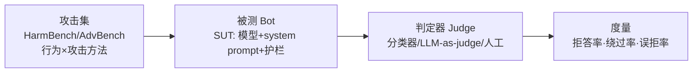

你上线了一个对外的 LLM bot（客服、行程助手、内部知识库问答），现在要回答一个老板会问、合规会问、面试官也会问的问题：**"它安全吗？"** 本节解决的不是"怎么越狱"，而是"作为防御方，怎么用公开基准对一个 bot 跑出一份可复现、可对比、能上汇报的安全评测报告，并诚实地说清这份报告证明了什么、没证明什么"。框架名：**防御方越狱评测流水线（红队评测 ≠ 安全保证）**。

> [!warning] 本节是防御导向
> 全程只给**评测流程、度量口径、防御解读**。不提供越狱 payload、绕过串、可照搬的攻击操作步骤。攻击样本一律引用公开基准（HarmBench / AdvBench）的**集合层面**，把"具体怎么攻"留在基准里，你照搬的是**评测脚手架**，不是武器。

---

## §0 为什么是"基准评测"而不是"安全审计"或"渗透测试"

读者脑中默认的三个框架，先挡掉两个：

| 候选框架 | 它做什么 | 为什么不是本节要的 |
|---|---|---|
| **传统渗透测试（pentest）** | 人找漏洞，找到一个算赢 | 单点、不可复现、不出**率**、无法回归对比 |
| **合规审计（如 ISO/SOC2 式勾选）** | 核对控制项是否"存在" | 只问"有没有过滤器"，不问"过滤器拦得住吗"。EchoLeak（CVE-2025-32711）正是绕过了存在的过滤器（来源：arXiv:2509.10540；CVE-2025-32711） |
| **公开基准越狱评测（本节）** | 用固定攻击集 × 固定判定器，跑出**拒答率 / 绕过率**，可复现、可回归 | 这才是能进汇报、能纵向对比版本、能横向对比模型的"度量" |

核心区别：基准评测把"安全"从形容词变成**带误差棒的数字**。HarmBench（Mazeika et al., 2024, arXiv:2402.04249，ICML 2024）的贡献正是提供"18 种红队方法 × 33 个目标模型与防御"的**统一评估框架**——统一比无统一更重要，因为没有统一口径，两个团队报的"绕过率"无法相互比较。

---

## §1 评测三件套：攻击集、判定器、度量

一次评测在概念上只有三个可替换部件，缺一不可：

**(1) 攻击集（行为 × 方法）。** AdvBench（Zou et al., 2023, arXiv:2307.15043）提供 ~520 条有害行为指令，是最早被广泛复用的"有害请求清单"。HarmBench 把它升级为**行为分类 × 攻击方法**的矩阵，并区分标准行为、版权、上下文相关、多模态等类别。防御方只需把这两个基准当**只读的攻击语料**——你不写攻击，你跑别人公开的攻击。

**(2) 判定器（Judge）。** 判定"模型这条回复算不算被攻破"是评测的命门。三种口径，可叠加：
- **关键词/拒绝串匹配**：最便宜，但假阳/假阴都高（一句"Sure, here..."不代表内容真有害）。
- **分类器判定**：HarmBench 自带训练好的分类器，统一口径、可复现。Llama Guard / WildGuard 等独立 guard model 也可作判定器。
- **LLM-as-judge**：灵活但有自身偏差（见 §4 致命耦合点）。

**(3) 度量。** 见下节。

---

## §2 度量口径：三个率，缺一个就片面

| 度量 | 定义 | 越高越… | 防御解读 |
|---|---|---|---|
| **拒答率（Refusal Rate）** | 对攻击集，模型正确拒绝的比例 | 好 | 防御覆盖面 |
| **攻击成功率 ASR（= 绕过率）** | 攻击集中成功诱出有害内容的比例 | 坏 | 残余风险，**对外只报这个会自欺** |
| **误拒率（Over-refusal / FPR）** | 对**正常无害请求**误判为有害而拒绝的比例 | 坏 | 可用性代价，决定产品能不能用 |

⚠️**只报 ASR 是评测里最常见的自欺**。一个把所有请求都拒掉的 bot，ASR=0%，但误拒率=100%、产品价值=0。必须**同时**报 ASR 与误拒率，画在同一张图上看权衡。Anthropic 的 Constitutional Classifiers（2025, arXiv:2501.18837）正是这样报的：部署分类器后越狱成功率 86%→4.4%，**同时**披露过度拒绝仅 +0.38%、计算开销 +23.7%（来源：anthropic.com/research/constitutional-classifiers）——三个数一起给，才是诚实的评测。

> [!note] 一张要打印贴墙上的图
> X 轴 = 误拒率，Y 轴 = ASR，每个候选配置（换模型 / 加护栏 / 改 system prompt）是一个点。**右上角是垃圾（既不安全又不可用），左下角是目标。** 单一数字会骗你，散点图不会。

---

## §3 防御方七步流程（可复现）

1. **定义 SUT（System Under Test）边界**：被测的不是"模型"，是"模型 + system prompt + 护栏 + 工具权限"这一**整套部署**。换任何一项都要重测。
2. **取公开攻击集**：HarmBench / AdvBench，按你的产品域筛子集（客服 bot 重点测 PII 泄露与越权，行程 bot 重点测 §5 的工具滥用）。
3. **冻结判定器**：选定分类器版本并锁死，否则版本漂移会让"绕过率下降"假象出现。
4. **跑基线**：无任何防御的裸模型先跑一遍，得到 ASR 上界。
5. **逐层加防御、各跑一遍**：输入过滤 → 指令层级 → 输出过滤 → 权限最小化（对照本专题 03 架构剖面的纵深防御栈）。每层单独测，才知道哪层在起作用。
6. **加测误拒率**：用一组**正常请求**（含"看起来敏感但合法"的边界样本，如"帮我写一封投诉信"）跑同一套判定器。
7. **回归归档**：把 (配置, 攻击集版本, 判定器版本, ASR, 误拒率, 日期) 存成一行记录。下次升级模型时**回归对比**——评测的价值在纵向可比，不在一次性数字。

**自动化 vs 人工**：自动化红队在系统性覆盖上占优（一项 214,271 次攻击、1,674 名用户、30 个挑战的对照研究中，自动化 ASR 69.5% vs 人工 47.6%；来源：arXiv:2504.19855），但人工在创造性攻击路径上仍 5× 更快、不可替代。结论：**自动基准跑覆盖面 + 定期人工红队补盲**，不是二选一。

---

## §4 判断主轴：90% 的人在评测上会搞错的四个点

**错点一：把"模型拒绝了"当成"模型安全了"。**
- 症状：报告写"拒答率 95%，安全"。
- 为什么会错：拒答率高 ≠ 残余风险低。剩下 5% 可能恰好是最高危的 CBRN 类。且判定器若只匹配拒绝串，模型说"我不能…但假设性地…"会被误判为拒绝。
- 正确做法：**残余风险按危害分级加权**，5% 绕过里有几条是灾难级要单独列。
- 真实反例：HarmBench 设计上区分行为类别正是因为"平均 ASR"会掩盖高危类别的高绕过率。

**错点二：用同一个 LLM 既当被测对象又当判定器（self-grading 闭环）。**
- 症状：用 GPT-4o 判 GPT-4o 的越狱。
- 为什么会错：同源模型共享盲点，判定器看不出自己被攻破。
- 正确做法：判定器与 SUT **异源**，或用 HarmBench 训练好的专用分类器，关键样本人工复核。
- 真实反例：LLM-as-judge 的偏差是 [c14 - 模型评估体系与 Goodhart 陷阱](/kb/基础知识库/c14-模型评估体系与-goodhart-陷阱/) 反复强调的——一旦判定器成了优化目标，团队会无意识地把 bot 调到"骗过判定器"而非"真安全"，这是典型的 Goodhart 滑变。

**错点三：基准缺陷被当成防御成果。**
- 症状：报"ASR=0%"并据此宣布安全。
- 为什么会错：实证指出现有 agent 基准存在系统性测量偏差——AgentDojo 部分任务设计使任务无论防御与否都失败、ASB 强制注入"攻击工具"使 ASR 虚高约 8 倍、InjecAgent 无效用指标（来源：arXiv:2510.05244）。部分"0% ASR"反映基准缺陷而非真实防御。
- 正确做法：**多基准交叉**，对"漂亮数字"默认怀疑，看是否经得起自适应攻击。
- 边界：本节给的是**静态公开基准评测**——它对"基准里有的攻击"有效，对**基准更新后出现的新攻击向量盲区**无效。

**错点四：测了模型，没测部署。**
- 症状：拿模型卡上的安全分当自己 bot 的安全分。
- 为什么会错：你的 system prompt、RAG 检索内容、工具权限都改变了攻击面。间接注入正是从工具返回值进来的（对照本专题 01 概念辨析「A03 直接注入 vs 间接注入的产品含义」）。
- 正确做法：测**整套部署**（§3 第 1 步），尤其 Agent bot 要测工具调用层。

---

## §5 产品 PM 视角补盲

工程视角只盯 ASR，PM 要补三个"看走眼"点：

1. **误拒率是商业指标，不是技术指标。** Unit42 实测一个平台的护栏假阳性率高达 13.1%（来源：unit42.paloaltonetworks.com，2025）——意味着每 8 个正常用户就有 1 个被误拒。这是直接的留存/口碑杀手。安全团队报 ASR，产品团队必须把误拒率拉到同一张汇报页。
2. **评测口径要进 SLA 与对客承诺，但不能过度承诺。** "我们做了安全评测"≠"我们保证不被越狱"。把评测结论写成"在 HarmBench v__ 上，xx 配置 ASR 为 y%，误拒率 z%，每季度回归"——可追溯、可问责，且**不替法务背不存在的保证**。
3. **危害分级决定 HITL 断点该设在哪。** 评测告诉你哪类操作绕过率高，那类就该设人工断点（对照本专题相邻节点 0436 Agent 权限边界〔全名待核实〕中的最小权限与 HITL 原则）。评测不是终点，是**给权限设计供数据**。

---

## §6 对手框架回应：业界反方立场（接受 + 边界）

**反方一（评测怀疑派，arXiv:2510.05244 等）：** "现有越狱基准已被防御方刷满，0% ASR 不反映真实威胁，基准评测给人虚假安全感。"
- 接受：完全对。静态基准确实会饱和，被刷满的数字毫无意义；本节 §4 错点三专列此坑。
- 边界：但 PM 决策无法等一个"完美基准"。基准评测的价值不在"证明安全"，而在**纵向回归**（同口径下版本 A 比版本 B 好/坏）与**底线兜底**（连公开基准都扛不住的 bot 绝不能上）。把它定位成"必要不充分的体检"，而非"安全证书"。

**反方二（Williams-King et al., 2024, arXiv:2501.11183，Rick 未读对手框架）：** 当前安全微调与评测是"打补丁式的攻防军备竞赛"，而非原则性设计；借鉴网络安全史，临时修补注定失败，应从架构层内嵌安全。
- 接受：评测确实滞后于攻击——你只能测已知攻击集，新攻击向量永远在基准之外。这是评测的结构性局限，无法靠"多跑几轮"解决。
- 边界：但"架构级原则设计"与"持续评测"不是替代关系。ASIDE（指令-数据正交分离）、Progent（SMT 验证的权限策略，把间接注入 ASR 从 41.2% 降到 2.2%；来源：arXiv:2504.11703）这类架构防御**本身也要靠基准评测来证明它有效**。评测是架构防御的验收手段，不是它的对立面。

---

## §7 跨域呼应：Goodhart 定律与"度量即靶子"

> [!note] 当度量成为目标，它就不再是好度量（Goodhart's Law）
> 经济学家 Charles Goodhart 的命题：一个指标一旦被设成考核目标，就会被操纵到失去原本的指示意义。越狱评测是 Goodhart 的高发区——一旦团队 KPI 是"把 HarmBench ASR 压到 0",理性策略不是"让 bot 真安全",而是"让 bot 在 HarmBench 这 520 条上表现好",代价是对基准外攻击全面失守，甚至把误拒率拉爆来换 ASR。

这正是 Rick 滴滴安全产品的**降发生方法论**同构之处:安全治理的真正目标是"降低真实世界伤害发生率",而非"让某个监控指标好看"。明镜系统度量的是**真实安全事件**而非代理指标——把这套"拒绝用代理指标自欺"的纪律平移到 LLM 评测,就是:**ASR 是代理,真实残余风险是目标;两者背离时,信目标不信代理。** 对照 [c14 - 模型评估体系与 Goodhart 陷阱](/kb/基础知识库/c14-模型评估体系与-goodhart-陷阱/),本节把 Goodhart 从"模型能力评测"扩展到"模型安全评测"——后者更危险,因为安全指标的造假后果是真实伤害,不只是排行榜失真。

---

## §8 PM 决策启示

- **面试怎么用**：被问"你怎么验证一个 AI 产品安全"——答"三件套(公开攻击集 × 异源判定器 × 三个率),ASR 和误拒率同图看权衡,纵向回归,且明确评测≠保证"。能说清"为什么不能只报拒答率"直接区分出资深度。
- **选型怎么用**:对比两个候选模型/护栏,**不比厂商宣传的安全分**,比同一套基准、同一判定器下的 (ASR, 误拒率) 散点。谁离左下角近选谁。
- **复现怎么用**:HarmBench 开源(github.com/centerforaisafety/HarmBench),取其分类器作判定器,先跑裸模型基线,再逐层加防御回归——这是本专题"自己动手"的最小起点。

---

## §9 与已有节点的关系

- 对照 [c14 - 模型评估体系与 Goodhart 陷阱](/kb/基础知识库/c14-模型评估体系与-goodhart-陷阱/):**深化**。c14 讲通用模型能力评测的 Goodhart 陷阱;本节把它**专门化到安全评测**,指出安全指标造假的后果(真实伤害)比能力指标造假更严重,并给出"ASR + 误拒率同图"这一具体反 Goodhart 操作。不复述 c14 的 Goodhart 基础。
- 对照 [m207 - Agent 产品化：场景推演与失败模式](/kb/工程化与落地架构/m207-agent-产品化-场景推演与失败模式/):**互补/供数**。m207 的"安全越界"失败模式与 HITL 断点三维判断需要数据来设断点;本节的评测正是那份数据来源——评测告诉你哪类操作绕过率高,m207 据此把断点设在那里。
- 对照 评测系统化专题:本节是评测方法在**安全垂直域**的落地;通用评测方法论(基准设计、判定器、Goodhart)在 0412,安全特例(攻击集、ASR/误拒率口径、残余风险分级)在本节。
- 对照本专题 03 架构剖面「S01 纵深防御可替换栈·输入 模型 输出 权限」「S02 训练侧 vs 系统侧防御对照」:本节是**验收手段**——S01/S02 给防御栈,R01 给"如何证明这层防御真的有效"的度量。

## §10 关联节点

**核心(必读)**
- [c14 - 模型评估体系与 Goodhart 陷阱](/kb/基础知识库/c14-模型评估体系与-goodhart-陷阱/)
- [m207 - Agent 产品化：场景推演与失败模式](/kb/工程化与落地架构/m207-agent-产品化-场景推演与失败模式/)
- 本专题「A02 攻击分类学·注入 越狱 投毒 抽取」「A04 Guardrail 的能力与谎言」「S01 纵深防御可替换栈·输入 模型 输出 权限」「S02 训练侧 vs 系统侧防御对照」(全名见同专题,跨节点双链)

**延伸(可选)**
- [Constitutional AI](/kb/基础知识库/constitutional-ai/) [RLHF](/kb/基础知识库/rlhf/) [Anthropic](/kb/ai-公司与产品/anthropic/)
- [Agent](/kb/基础知识库/agent/) [Function Calling](/kb/基础知识库/function-calling/)
- 评测系统化专题、本专题「A03 直接注入 vs 间接注入的产品含义」、0436 Agent 权限边界（0436 待补完入库，暂作普通文本）

---

## 修订日志

- 2026-06-07 R1:首稿。按 SHARED_CONTEXT §4 十一段骨架成文。判断主轴四件套齐(§4 四错点),业界反方"接受+边界"两处(§6 评测怀疑派、Williams-King 军备竞赛派),跨域呼应一处(§7 Goodhart),与 c14/m207/0412/S01/S02 显式升级对照(§9)。攻击集仅引用 HarmBench/AdvBench 集合层,无 payload。核心数字(HarmBench arXiv:2402.04249、Constitutional Classifiers 86%→4.4%/+0.38%/+23.7%、AdvBench arXiv:2307.15043、自动 vs 人工 69.5%/47.6% arXiv:2504.19855、Progent 41.2%→2.2% arXiv:2504.11703、Unit42 误拒 13.1%、基准缺陷 arXiv:2510.05244、Williams-King arXiv:2501.11183)均来自接地证据包。死链(0412 评测专题、0436 全名)降级普通文本并登记 _待建概念清单。
- 2026-06-11 P3.4 校链:0412 评测系统化专题经主库 `find` 实证已落盘,§9/§10 指向它的降级文本恢复为真 `0412 总览` 链并删 staging 注解;0436 仍在 staging,改标"0436 待补完入库"保留普通文本。
