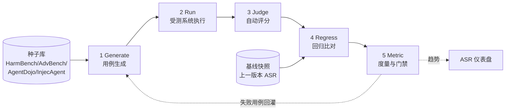

R01 解决了「人工给一个 Bot 跑一轮越狱评测」——但红队的真正价值不在「跑过一次」，而在「每次发版自动跑、跑出回归、跑出趋势」。本节点要回答的问题是：**怎么把一次性的对抗探测，工程化成一条可重复、可回归、可上 CI 的自动化红队流水线**——并且全程是防御方视角，产出的是「我的产品在哪条防线上漏了多少」而非「我能怎么打别人」。框架名：**生成—执行—评分—回归—度量五段流水线（Gen-Run-Judge-Regress-Metric Pipeline）**。

> [!warning] 防御边界（继承本专题宪章）
> 本节给的是**评测基础设施**模板，不是攻击工具。所有「攻击用例」一律引自公开基准（HarmBench / AdvBench / AgentDojo / InjecAgent）的**已发布条目**，流水线的输出是**ASR 仪表盘与回归报告**，不输出新的越狱串、可武器化 payload 或具体绕过步骤。`generate` 段产出的是「从公开基准采样 + 模板化变形的测试用例 ID」，落盘的是哈希与标签，不是明文攻击载荷。

## §0 为什么是「流水线」而不是「benchmark 跑分」

PM 脑子里最容易装错的框架，是把红队等同于「拿 HarmBench 跑一个分数贴在发版说明里」。这是把**评测当成一次性体检**，而红队的工程本质是**持续集成下的回归测试**。三个判据决定了它必须是流水线、不是跑分：

1. **攻击会迁移、会变异**。STACK（McKenzie et al., 2025/2026，arXiv:2506.24068〔arXiv ID 待核实〕）证明：对单层防御 ASR=0% 的攻击，在组合防御流水线上分阶段重新有效；零访问迁移攻击仍有 33% 成功率。这意味着「上次跑过=0%」对「这次安全」毫无保证——必须每次发版重跑。
2. **防御会回退（regression）**。改一个 system prompt、升一次基座、加一条 RAG 数据源，都可能悄悄打开一个旧洞。没有回归基线，你永远是事后从线上事故里学。
3. **能力与脆弱性正相关**。AgentDojo（Debenedetti et al., 2024，arXiv:2406.13352）观察到「更强模型反而更易被注入」(inverse scaling)。这意味着每次模型升级**都要假设安全姿态可能变差**，把红队挂进升级门禁。

所以流水线的设计目标不是「测一个数」，而是**把对抗探测变成版本之间可比、可阻断发版（gating）的连续信号**。这正是 Rick 在滴滴做安全的同构经验:「降发生方法论」(海恩法则:每起重大事故背后有大量未遂)的核心不是「事后裁判」,而是把隐患探测前置成**常态化、可回归的监测流**——红队流水线就是 AI 系统的「未遂事件捕捞网」。

## §1 五段流水线总览

| 段 | 输入 | 产物 | 关键工程决策 |
|---|---|---|---|
| **1 Generate** | 公开基准种子 + 变形策略 | 测试用例集（带标签、哈希、来源溯源） | 静态集 vs 自适应生成的配比 |
| **2 Run** | 用例集 + 受测系统端点 | 原始响应 + 工具调用轨迹 | 是否在沙箱/隔离环境跑 Agent |
| **3 Judge** | 响应 + 评分 rubric | per-case 判定（成功/拒绝/部分） | LLM-judge vs 分类器 vs 规则 |
| **4 Regress** | 本次判定 + 基线快照 | 回归 diff（新增漏洞/修复/抖动） | 阈值与抖动容忍带 |
| **5 Metric** | 回归 diff | ASR、拒答率、误拒率、门禁结论 | gating 红线与 owner |

判断密度的第一处：**这五段里，90% 团队只做了 1-2-3，跳过 4-5**。没有第 4 段，红队就退化成「每次重新发现同一批洞」；没有第 5 段，分数无法转成「能不能发版」的决策。**没有回归与门禁的红队，不是 CI，是 demo。**

## §2 Generate 段——测试用例从哪来（防御方的用例治理）

用例不是凭空生成，而是**三类来源的分层治理**：

| 类别 | 来源 | 角色 | 防御视角的意义 |
|---|---|---|---|
| **基准锚定集** | HarmBench（18 方法 × 33 目标，arXiv:2402.04249，ICML 2024）、AdvBench（520 harmful behaviors，Zou et al., arXiv:2307.15043, 2023）、AgentDojo（949 任务/70 工具，arXiv:2406.13352）、InjecAgent | 跨版本可比的**固定标尺** | 与业界可对齐，回归基线稳定 |
| **场景定制集** | 把自家产品的真实工具/权限/数据流注入基准模板 | 测**你的产品**而非通用模型 | 通用 benchmark 测不出你的 RAG 检索越权 |
| **自适应生成集** | 由失败用例回灌 + 变形（编码/角色化/多轮）派生 | 防「刷满基准」 | 应对攻击变异，对抗 benchmark 饱和 |

> [!note] 一处关键的接地与边界
> arXiv:2510.05244 的 Firewall 工作〔arXiv ID 待核实〕实证指出：**现有基准存在系统性测量偏差**——AgentDojo 部分任务的注入向量覆盖了任务关键信息，导致「无论防御与否任务都失败」，修正后效用提升 >18%；ASB 强制注入「攻击工具」使 ASR 虚高约 8 倍。**含义**：你 Generate 段照搬基准跑出的 0% ASR，可能是基准缺陷而非真防御。所以「自适应生成集」不是锦上添花，是**对冲基准饱和**的必需层。这也是 §2 的 failure scenario：**只用静态基准的流水线，会把测量偏差当成安全感**。

防御方的用例治理纪律（与攻击者用例库的根本区别）：
- 用例**只存 ID + 哈希 + 标签 + 来源 URL**，不存明文 payload 进版本库；明文从公开基准运行时拉取。
- 每条用例标 `attack_class`（注入/越狱/投毒触发/越权）、`channel`(直接/间接/工具返回/RAG)、`severity`，让第 5 段能按维度切分 ASR。
- 自适应生成的「变形」限定在**公开已披露的策略类目**（编码、角色扮演、多轮累积），产出登记可追溯，不研发新攻击。

## §3 Run 段——受测系统执行（Agent 场景的隔离纪律）

对单模型 Bot，Run 段就是批量打 API。但一旦受测对象是 **Agent**（有工具调用），Run 段就从「问答」变成「在隔离环境里让它真的去执行」——这正是与本专题 Agent 注入节点的耦合点。

致命工程决策：**Agent 红队必须在沙箱/影子环境跑，且工具是 mock 的高保真副本**。原因——间接注入的成功判定往往是「Agent 是否真的发出了外泄请求 / 真的改了权限」，你必须让它「以为」自己在真环境、但实际操作落在隔离层。AgentDojo 之所以用 70 个 mock 工具模拟 banking/slack/travel/workspace，正是为此。

> [!warning] 这里有一条产品红线
> Run 段的 Agent 轨迹日志会记录工具调用参数，可能含注入载荷的执行痕迹。这些日志本身就是敏感资产：**轨迹库要按机密数据管控**（最小权限、加密、不外发），否则你的红队基础设施反而成了攻击知识的泄漏源。这同构于 Rick 在滴滴「明镜系统」的治理逻辑——监测系统采集的恰恰是最敏感的安全数据，监测平台自身的权限边界必须比业务系统更严。

## §4 Judge 段——自动评分（LLM-as-judge 的陷阱）

判定「这次攻击成功了吗」有三条路，各有命门：

| 评分器 | 机理 | 优势 | 命门 |
|---|---|---|---|
| **规则/正则** | 匹配「拒绝模板」或「外泄标记」 | 快、确定、零成本 | 语义变形即逃逸；只能测窄场景 |
| **守卫分类器** | LlamaGuard / WildGuard 类判有害 | 可独立部署、批量 | 对新攻击迁移性差，有假阴性 |
| **LLM-as-judge** | 用强模型按 rubric 判 | 覆盖语义、可解释 | judge 本身会误判、可被注入、成本高 |

判断密度第二处:**Judge 是流水线里最容易被自己骗的一环**。LLM-judge 判「攻击是否成功」时,本身也在读攻击内容——一个精心构造的用例可能同时越狱受测模型**和** judge(judge 注入)。防御做法:judge 与受测模型**异构**(不同基座/不同厂商),judge 只接收受测模型的**输出**而非完整对话,并对 judge 自身跑一个小 meta-eval(已知成功/失败样本上的判准率)。这直接对照 [c14 - 模型评估体系与 Goodhart 陷阱](/kb/基础知识库/c14-模型评估体系与-goodhart-陷阱/):**一旦 ASR 成为发版门禁指标,团队就有动力让 judge「看起来更宽容」来通过门禁,指标即被博弈。** Judge 的判准率本身必须被独立监控,否则 Goodhart 在安全评测里同样成立——而且后果更重。

## §5 Regress 段——回归比对（红队作为 CI 的核心）

这是把红队从「跑分」升格为「流水线」的那一段,也是 §1 说的「90% 团队跳过」的部分。

回归的最小数据结构：每次运行产出 `{case_id → verdict}` 的判定向量，与上一版基线快照做 diff，分三类：

| diff 类别 | 含义 | 动作 |
|---|---|---|
| **新增漏洞 (newly broken)** | 旧版拒绝、新版被攻破 | **阻断发版**，定位是哪次改动引入 |
| **修复 (newly fixed)** | 旧版被攻破、新版拒绝 | 记入修复台账，转成永久回归用例 |
| **抖动 (flaky)** | 同用例多次结果不一致 | 进抖动容忍带，不计入门禁但记录 |

工程要点：
- **基线要带版本指纹**（模型版本 + system prompt 哈希 + 防御组件版本 + 用例集版本），四者任一变更都要重算基线,否则在比较两个不同标尺。
- **抖动是真问题不是噪声**。LLM 采样温度 >0 时同一攻击会概率性成功,所以 ASR 是分布不是点值。回归判定要用「N 次重采样的成功率」与置信区间,而非单次 0/1。这是 §5 的 failure scenario:**用单次运行做回归门禁,会被温度抖动反复误报/漏报。**
- **每个新增漏洞回灌 Generate 段**成为永久用例——这是流水线的闭环,确保「修过的洞不会悄悄回来」。

## §6 Metric 段——度量与门禁（把 ASR 变成发版决策）

最终产出不是一个数,是一张**按维度切分的 ASR 仪表盘 + 一条门禁结论**。

核心指标四件套(防御方关心的全是「漏多少」与「误伤多少」):

| 指标 | 定义 | 防御方读法 |
|---|---|---|
| **ASR(攻击成功率)** | 成功攻击 / 总用例,按 attack_class × channel 切分 | 主信号,但要看分布不看总均值 |
| **拒答率 (refusal rate)** | 正确拒绝有害请求的比例 | 安全侧的「召回」 |
| **误拒率 (over-refusal)** | 拒绝了正常请求的比例 | 安全的**代价**,直接伤产品可用性 |
| **效用保持 (utility)** | 装防御后正常任务完成率 | 防御不能把产品做废 |

门禁红线示例(按你的风险等级定,非通用值):`新增漏洞数 == 0` 为硬门禁;`高危 channel 的 ASR < 阈值` 且 `误拒率上升 < 容忍带`。

> [!note] 跨域呼应:测量的悖论(Campbell 定律的安全版)
> 社会学的 **Campbell 定律**——「任何量化社会指标越被用于决策,就越会被腐蚀,也越会腐蚀它本要测量的过程」——在红队流水线里是活的。一旦「ASR 必须 < X 才能发版」成为硬门禁,组织的优化压力不会全用在「真的更安全」上,一部分会流向「让流水线显示更安全」:缩窄用例集、放宽 judge、调高抖动容忍带。**这不是道德问题,是结构性激励问题。** 防御设计的应对:门禁指标(ASR)与「指标健康度指标」(用例集覆盖、judge 判准率、基线新鲜度)要**分开 owner、分开汇报**,让博弈门禁的成本可见。这同构于 Rick 在滴滴的体会:安全 KPI 一旦只考「事故数」,一线就有动力把事故「定义」成非事故——所以「降发生」必须同时监测「上报率」这个元指标。

## §7 判断主轴:自动化红队流水线最容易搞错的四个点

| # | 症状 | 为什么会错 | 正确做法 | 真实反例 |
|---|---|---|---|---|
| 1 | 跑一次基准 0% ASR 就宣布安全 | 把体检当 CI;忽视攻击迁移与变异 | 每发版重跑 + 回归门禁 + 自适应集 | STACK:单层 0% 的攻击在组合流水线上重新有效(arXiv:2506.24068〔ID 待核实〕) |
| 2 | 只用静态公开基准 | 基准有测量偏差且会被刷满 | 基准锚定 + 场景定制 + 自适应三层 | Firewall 工作:AgentDojo/ASB 系统性偏差,ASR 虚高约 8 倍(arXiv:2510.05244〔ID 待核实〕) |
| 3 | judge 与受测同模型/同厂商 | judge 可被同一攻击注入;指标可被博弈 | judge 异构 + 只看输出 + meta-eval 判准率 | LLM-judge 注入是公开已知风险类(对照 [c14 - 模型评估体系与 Goodhart 陷阱](/kb/基础知识库/c14-模型评估体系与-goodhart-陷阱/)) |
| 4 | 单次运行做 0/1 门禁 | LLM 采样有温度抖动,ASR 是分布 | N 次重采样 + 置信区间 + 抖动容忍带 | 温度>0 时同一越狱概率性成功,单次判定必误报 |

## §8 产品 PM 视角补盲(跳出工程 PM)

工程 PM 会把这条流水线当 CI 任务;产品/安全 PM 还要看三件工程视角看不见的事:

1. **误拒率是产品体验账,不是安全账**。Anthropic Constitutional Classifiers(arXiv:2501.18837)报告越狱率 86%→4.4%、过度拒绝仅增 0.38%——这个「过度拒绝增量」才是产品能不能上的真红线。一条把 ASR 压到 0 但误拒率飙到 13%(Unit42 实测某平台数据)的防御,产品会被投诉到下线。流水线必须把误拒当一等公民指标。
2. **门禁会变成发版政治**。「红队挂了能不能强行发」是组织权力问题:谁有 override 权、override 要不要留痕、安全 owner 和业务 owner 谁拍板。这对照 AI 作为制度现象专题 的安全规范制定——门禁的**治理设计**比门禁的技术实现更决定它有没有用。
3. **红队基础设施本身是攻击面**。用例库、轨迹日志、judge 提示,集中存放了「如何攻破本产品」的知识。这套系统的权限边界要按最高密级管,否则你建了一个「攻击知识中心」。

## §9 对手框架回应:自动化红队会不会「测出假安全」

**接受**:Inie/Stray/Derczynski 的扎根理论研究(PLoS One 2025,DOI:10.1371/journal.pone.0314658)指出,人工红队的核心是「炼金师思维」——探索性的、不可预测的直觉攻击,这恰恰是自动化最难复制的。「自动化优势」研究(Mulla et al., 2025,arXiv:2504.19855〔ID 待核实〕)也佐证:自动化 ASR 69.5% 高于人工 47.6%,但人工在直觉型挑战上快 5 倍。**所以自动化流水线确实存在「覆盖偏差」:它擅长系统性重放已知攻击模式,会系统性遗漏人类才想得到的新颖向量。**

**边界(我赌的是什么)**:我不赌「自动化能取代人工红队」。我赌的是——**对一条防御 CI 而言,「可重复、可回归、可阻断发版」的价值 > 「发现最新颖攻击」的价值**。新颖攻击发现交给人工红队与漏洞赏金(Anthropic Bug Bounty 阶段 30 万次交互后才出现 1 个通用越狱,正说明新颖攻击是稀缺的、人力密集的);流水线负责的是「别让修过的洞回来、别让升级悄悄变差」。两者是分工不是替代。**这条流水线的 failure scenario 是明确的:它对零日新颖攻击天然盲,必须靠人工红队 + 线上监测兜底,绝不能因为「CI 绿了」就关掉人工探测。**

## §10 与既有节点 / 升级对照(不复述)

- **对照 R01(本专题 05 复现指南同级,给 Bot 跑一轮越狱评测·防御视角)**:R01 是「手工跑一次」,本节点把它**工程化升格**为「自动重跑 + 回归 + 门禁」——R01 是流水线的 Run+Judge 两段的单次实例,本节点补上 Generate 治理、Regress 闭环、Metric 门禁。
- **对照 评测系统化专题(跨专题母方法论)**:本节点是 0412 通用评测方法论在**安全对抗**子域的特化——0412 的「评测即回归测试」「Goodhart 陷阱」是母框架,本节点把它落到 ASR 门禁与 judge 博弈这个具体战场。安全可链锚点用确认存在的 [c14 - 模型评估体系与 Goodhart 陷阱](/kb/基础知识库/c14-模型评估体系与-goodhart-陷阱/)。
- **对照 G01 对抗攻防军备竞赛谱系(本专题 02 代际演化同级)**:G01 讲「攻防为何是军备竞赛」,本节点是这条军备竞赛的**防御方工程响应**——流水线的「自适应集 + 每版重跑」正是对「攻击会变异」这条谱系规律的对策。
- **对照 [m207 - Agent 产品化：场景推演与失败模式](/kb/工程化与落地架构/m207-agent-产品化-场景推演与失败模式/)**:m207 的「六类失败模式 + HITL 断点三维判断 + 评估 7 维度」是 Agent **产品化**的失败治理;本节点是把其中「安全越界」这一类失败,做成**专门的对抗回归基础设施**。m207 问「上线前哪些环节要兜底」,本节点问「怎么自动化验证这些兜底没退化」。
- **对照 [Constitutional AI](/kb/基础知识库/constitutional-ai/)**:CAI 是**训练侧**把安全内建进模型;本节点是**系统侧**持续验证「训练侧 + 系统侧防御组合」在每个版本是否真的守住。CAI 给你一个更安全的基座,流水线告诉你「这个更安全的基座,这次升级后还安全吗」。
- 跨专题相邻节点:失败考古专题(攻防为其机理层)、Agent 系统化专题(工具调用即攻击面)、AI 作为制度现象专题安全规范制定均已落盘主库;0436 Agent 权限边界仍在 staging(待补完入库),暂作普通文本并登记 `_待建概念清单.md`,不建死链。

## §11 PM 决策启示(三类落地)

- **面试**:被问「你怎么保证 AI 产品安全」,不要答「加内容过滤」(这是本专题反复打的系统性滑变)。答:「我会把红队建成一条带回归门禁的 CI——基准锚定 + 场景定制 + 自适应三层用例,judge 异构防自欺,ASR 与误拒率双指标门禁,每个修过的洞回灌成永久回归用例。安全不是一次审核,是持续集成。」30 秒展示「测量—回归—门禁」的工程心智。
- **选型**:评估第三方安全/护栏方案时,问对方三个流水线问题——(a) 能不能接我自己的场景用例还是只跑通用基准?(b) 给不给回归 diff 还是只给一个总分?(c) judge 是不是和我的基座同源(同源即有自欺风险)?三个问题筛掉 80% 的「跑分即安全」型供应商。
- **复现**:照本节点五段搭最小流水线——Generate 从 HarmBench/AdvBench 公开集采样 + 打标签;Run 批量打 API(Agent 走 mock 沙箱);Judge 用异构强模型 + rubric;Regress 存判定向量做 diff;Metric 出 ASR×channel 仪表盘 + `新增漏洞==0` 硬门禁。先跑通单模型 Bot,再扩到 Agent。

## §12 关联节点

**核心(必读)**
- [c14 - 模型评估体系与 Goodhart 陷阱](/kb/基础知识库/c14-模型评估体系与-goodhart-陷阱/) — judge 博弈与门禁指标腐蚀的母框架
- [m207 - Agent 产品化：场景推演与失败模式](/kb/工程化与落地架构/m207-agent-产品化-场景推演与失败模式/) — 安全越界失败模式 + HITL + 评估 7 维度
- [Constitutional AI](/kb/基础知识库/constitutional-ai/) — 训练侧防御,与本节点系统侧验证互补
- [Agent](/kb/基础知识库/agent/) — Agent 场景是 Run 段隔离纪律的来源
- [Function Calling](/kb/基础知识库/function-calling/) — 工具调用即 Run 段要 mock 的执行面
- G01 对抗攻防军备竞赛谱系(本专题同级,02 代际演化)
- R01 给 Bot 跑一轮越狱评测·防御视角(本专题同级,05 复现指南;全名以落盘为准)

**延伸(可选)**
- [幻觉](/kb/基础知识库/幻觉/) / [c13 - 幻觉的不可消除性](/kb/基础知识库/c13-幻觉的不可消除性/) — Misinformation 类用例与「不可消除」的认识论对照
- [Anthropic](/kb/ai-公司与产品/anthropic/) — Constitutional Classifiers 的 86%→4.4% 与误拒率数据来源
- [RLHF](/kb/基础知识库/rlhf/) — 安全微调与对抗训练的训练侧背景
- [AI PM 知识图谱·总索引](/kb/ai-pm-知识图谱/ai-pm-知识图谱-总索引/) — 回到知识图谱总入口
- S01 纵深防御可替换栈(本专题同级,03 架构剖面)— 流水线测的就是这个栈
- 评测系统化专题(跨专题母方法论)

## §13 修订日志

- R1(2026-06-07):首稿。建立 Gen-Run-Judge-Regress-Metric 五段框架;判断主轴四件套;Campbell 定律跨域呼应;对手框架回应(自动化 vs 人工红队覆盖偏差,接受+边界);与 R01/0412/G01/m207/CAI 升级对照;结尾陷阱(§9 零日盲区 + §6 指标博弈 + §10 死链降级)。待核实项:STACK arXiv:2506.24068、Firewall arXiv:2510.05244、自动化优势 arXiv:2504.19855 的 arXiv ID;0430/0436/0416/0411 相邻节点主库全名;R01 落盘全名。
- 2026-06-11 P3.4 校链:0412/0430/0416/0411 兄弟专题经主库 `find` 实证已落盘,§8/§10/§12 指向它们的降级文本恢复为真 `NNNN 总览` 链并删 staging 注解;仅 0436 仍在 staging,改标"0436 待补完入库"保留普通文本。
