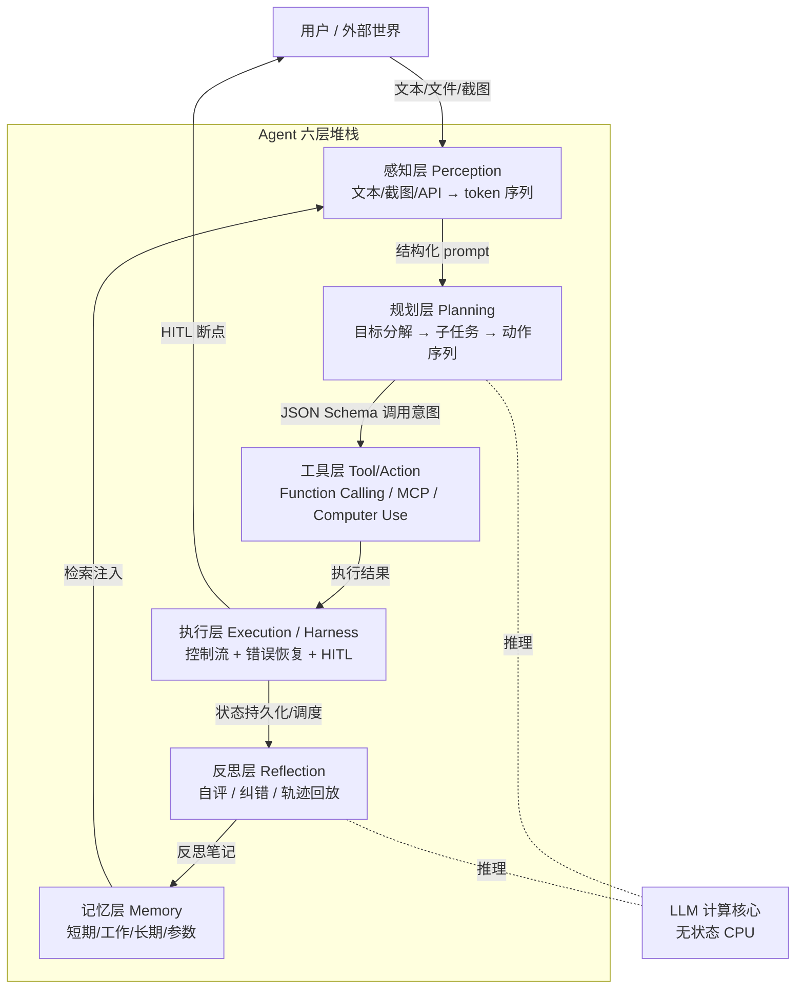

# S01 Agent 六层架构剖面

一句话定义：把 Agent 工程拆成可独立评估、可独立替换的六层堆栈——感知 / 规划 / 记忆 / 工具 / 执行 / 反思——任何一个 Agent 产品都能被映射到这六层上做 gap 分析，这就是 PM 的"解剖图"。

## 0. 为什么是"六层"而不是 PPAF 四阶段

[c10 - Agent 技术栈与工具调用](/kb/基础知识库/c10-agent-技术栈与工具调用/) 把 Agent 概括成 ReAct 循环（thought-action-observation），m206 单独抽出"记忆"，m207 单独抽出"失败模式"，[Harness 词义辨析](/kb/专题-安全对齐与失败/harness-词义辨析/) 又把 harness 作为外围运行时拎出来。这些视角各自正确，但都不是同一切面。

一类常见的描述方式是 **PPAF 式四阶段**(Perception / Planning / Action / Feedback)框架(精确同名的"PPAF"在英文学界并非主流术语,与之相邻的写法包括 Sense-Plan-Act 与 Perception-Cognition-Action;此处用 PPAF 作为这一类四阶段范式的统称)。四阶段视角对**讲清楚"一次迭代里发生什么"**很好用,但有三个 PM 视角的盲区:

1. **把"记忆"折叠进 Perception** → 记忆决策（记什么、衰减、冲突、隐私）被淹没，而这恰是产品差异化的主战场（m206 已论证）。
2. **把"工具"折叠进 Action** → 看不出 Function Calling / MCP / Computer Use 三种行动接口的成本与可靠性差异，无法做选型。
3. **把"执行"折叠进 Action** → harness 本体（控制流、HITL、错误恢复）作为产品壁垒被遮蔽，而 Claude Code vs Cursor 的核心区别就在这里。

把循环阶段（动态）和系统组件（静态）分开看，得到**六层堆栈**：感知、规划、记忆、工具、执行、反思。这是组件视角，不是流程视角——每一层都是一个**可替换的工程位点**，PM 在面试、选型、复现时按这六层逐层拆问，永远不会漏。

> **与 PPAF 的关系**：PPAF 是六层在时间维度上的运行轨迹；六层是 PPAF 背后的物质基础。一次 PPAF 循环要穿过感知 → 规划 → 工具 → 执行（→ 反思），而记忆贯穿全程。

---

## 1. 架构图

**接口约定**（每层之间必须有契约，否则不可替换）：

| 上层 → 下层 | 接口形式 | 失败时的契约 |
|---|---|---|
| 感知 → 规划 | 结构化 prompt + 上下文 token 包 | token 超预算时按"规约规则"压缩 |
| 规划 → 工具 | 函数签名 JSON Schema | 反序列化失败回退到自然语言指令 |
| 工具 → 执行 | 结构化 observation（结果/错误码）| 超时/异常包装成可读错误回灌 |
| 执行 → 反思 | trace + token cost + 步骤产物 | 触发"自评"或"重规划"信号 |
| 反思 → 记忆 | 反思笔记 / episodic memory | 与既有记忆冲突时按 m206 § ③ 策略合并 |
| 记忆 → 感知 | 检索结果 + 用户偏好 | 召回失败时优雅降级到"无记忆模式" |

把上面这张表打印出来贴在墙上——选型 / 复现 / 面试的全部问题都在这张表里。

---

## 2. 感知层（Perception）

**定义**：把外部世界翻译成 LLM 能理解的 token 序列。

**核心组件 / 技术实现**：
- 文本输入解析（用户消息、文件、API 返回）
- RAG 检索结果注入（[c09 - RAG 架构](/kb/基础知识库/c09-rag-架构/)）
- 多模态编码：[Claude](/kb/ai-公司与产品/claude/) Sonnet 4.6 / GPT-5 / [Gemini](/kb/ai-公司与产品/gemini/) 3 的 vision encoder 把屏幕截图转为 visual token（CLIP / SigLIP 家族），一张 1080p 截图约 1100-1500 tokens
- Computer Use 的截图捕获 + 坐标系归一化（[Anthropic](/kb/ai-公司与产品/anthropic/) computer-use beta / Manus / OpenAI Operator 三家方案不同）
- 传感器流（具身 Agent，李飞飞《多模态交互前沿调查》论文方向）

**典型失败模式**（链入 [m207 - Agent 产品化：场景推演与失败模式](/kb/工程化与落地架构/m207-agent-产品化-场景推演与失败模式/) 六类失败）：
- **OCR / 截图理解错误**：复杂表格、动态 DOM、低对比度元素被忽略，与 m207 "推理错误"同源但更上游
- **跨模态对齐失败**：截图里写"提交"，模型读成"取消"——属于"安全越界"前置失败
- **输入预算爆炸**：截图 × 步骤数 → token 成本超单任务预算（m209 计算公式）

**PM 关注点**：
1. 一次任务的截图次数 × 单图 token 成本 × 单步上下文累积，能不能装进预算？算给我看。
2. 当 OCR 错读时，下游兜底链是什么？回退到 API？回退到"求助用户"？还是直接 fail-fast？
3. 跨模态对齐失败的检测信号是什么？置信度阈值由谁定？

**与下一层接口**：感知层输出 = 「结构化 prompt」+「token 包」。规划层假设感知层已经做完压缩与重排序——感知层不交付结构化 prompt，规划层就退化为"无脑续写"。

---

## 3. 规划层（Planning）

**定义**：把用户目标分解为可执行的子目标和动作序列，决定"下一步做什么"。

**核心组件 / 技术实现**：
- **隐式规划**：[A03 ReAct](/kb/专题-安全对齐与失败/a03-react/) 风格，thought → action → observation 滚动续写，没有显式 plan 对象
- **显式规划**：[A05 Plan-and-Execute](/kb/专题-安全对齐与失败/a05-plan-and-execute/)，先生成完整 plan tree，再逐步执行；DeerFlow / BabyAGI / LangGraph 用这种
- **搜索式规划**：LATS（Language Agent Tree Search），把 plan 视为可回溯的树，每个节点用反思打分；成本最高、效果最好
- **DAG 编排**：把固定流程写死成有向无环图（CrewAI 的 sequential / hierarchical process、AutoGen 的 GroupChat、Dify 的工作流）
- **多 Agent 规划**：Orchestrator 把规划权委托给"Planner Agent"，与"Executor Agent"职责分离

**典型失败模式**：
- **规划失败**（m207 表 1）：步骤遗漏、顺序错乱、目标不收敛
- **过度规划**：把简单任务拆成 20 步，触发 [c10 - Agent 技术栈与工具调用](/kb/基础知识库/c10-agent-技术栈与工具调用/) § 10.3 的复合错误数学
- **重规划不及时**：环境变化后 plan 已 stale，仍按旧 plan 走（典型场景：网页 DOM 改了，Computer Use Agent 还在按旧坐标点击）

**PM 关注点**：
1. 默认走 ReAct 还是 Plan-and-Execute？决策依据是"任务步数分布 + 单步错误率"，不是直觉。步数 ≤ 5 用 ReAct，> 10 用 Plan-and-Execute，5-10 看场景。
2. 何时触发重规划？是"每步都判一次"还是"出错才重判"？前者贵 50% token，后者可能错过早期信号。
3. 规划结果是否需要人工审核（HITL）？参考 m207 表 2 的三维度判断。

**与上一层接口**：规划层从感知层接收**完整上下文**+**可用工具清单（JSON Schema 列表）**。工具清单是 LLM 理解"能力边界"的唯一来源——感知层漏给工具，规划层就会"幻觉一个不存在的工具"。

**与下一层接口**：规划层输出**带参数的函数调用意图**或**自然语言指令**。

---

## 4. 记忆层（Memory）

**定义**：跨步骤、跨会话保存 Agent 的状态与知识，让"无状态 CPU"（LLM）能在长任务中表现得像有状态。

完整设计决策详见 [m206 - Agent 产品化：记忆机制与技术进展](/kb/工程化与落地架构/m206-agent-产品化-记忆机制与技术进展/)。这里只做层级定位。

**四种记忆类型**（与 c10 § 10.1 一致，但补"工作记忆"的运行时位置）：

| 类型 | 物理位置 | 生命周期 | 谁负责写入 |
|---|---|---|---|
| **短期记忆** | LLM 上下文窗口 | 单次对话 | 执行层逐轮追加 |
| **工作记忆** | harness 内的 state store（Redis / SQLite / 内存）| 单次任务 | 执行层 + 反思层 |
| **长期记忆** | 向量库 / 图库 / 关系库 | 跨会话 | 反思层 / 记忆提取器 |
| **参数记忆** | 模型权重 | 跨任务 | 训练时一次性写入 |

**典型失败模式**：
- **记忆漂移**：摘要压缩丢失关键事实（m206 ④ 隐私边界外的另一种"主动遗忘"，但有害）
- **记忆冲突**：用户"上周说不要 A，今天又要 A"，没有冲突解决策略
- **跨会话污染**：A 用户的偏好被错误注入 B 用户的会话（多租户场景的安全事故）
- **检索召回失败**：向量库找不到本应记得的事，转化为"AI 失忆"投诉

**PM 关注点**：
1. 哪些信息**必须**进长期记忆？哪些**禁止**？记忆准入规则要写进 PRD，不是事后补。
2. 记忆冲突时给用户什么信号？是"沉默地用最新"还是"主动提醒"？关系到信任曲线。
3. 跨租户隔离的实现层级——是 prompt 层"提醒"还是数据层物理隔离？前者会被 prompt injection 突破。

**与上下层接口**：记忆层**不在主调用路径上**，而是横切关注点——它被感知层（注入检索结果）和反思层（写入新事实）双向调用。这是它在六层图里"竖着摆"而非"卡在中间"的原因。

---

## 5. 工具层（Tool / Action）

**定义**：定义并暴露 Agent 可执行的所有外部动作，把 LLM 输出的"调用意图"翻译为对真实系统的副作用。

**核心组件 / 技术实现**：
- **[Function Calling](/kb/基础知识库/function-calling/)**：OpenAI / Anthropic / Gemini 都已支持 native FC，受约束解码保证输出符合 JSON Schema
- **MCP（Model Context Protocol）**：[Anthropic](/kb/ai-公司与产品/anthropic/) 2024 年提出、2025-2026 年成为事实标准，定义了"工具/资源/采样"三类原语；详见 c10 § 10.4
- **A2A（Agent-to-Agent）**：Google 2025 年发布，定义 Agent 之间的协作协议（不是工具协议，但同处"行动接口"层）；详见 m206
- **Computer Use API**：Anthropic computer-use beta、OpenAI Operator、Manus 的 GUI 操作接口；本质是"屏幕动作"作为一种特殊工具
- **代码沙盒**：把"写代码 + 执行"作为通用工具（Open Interpreter / Code Interpreter / E2B），详见 [c11 - System 2 思维与 Test-Time Compute](/kb/基础知识库/c11-system-2-思维与-test-time-compute/) 中 inference-time 计算扩展

**工具设计三原则**（c10 § 10.2 已述，这里强调与执行层的耦合）：原子化 / 错误信息可机读 / 副作用分级。

**典型失败模式**：
- **Schema 错配**：LLM 生成的 JSON 不符合 Schema（FC 失败的最常见原因，约 5-15%）
- **同名歧义**：两个工具语义重叠，模型选错（如 `search_company` vs `search_contact`）
- **副作用未声明**：标记为"只读"的工具其实有写副作用 → 安全越界
- **MCP server 信任问题**：第三方 MCP server 返回恶意 payload → prompt injection 通道

**PM 关注点**：
1. 工具列表的 token 成本——每多挂一个工具，每次调用 prompt 都多花几十 token。10 个工具还是 50 个工具？
2. MCP 自建还是用社区 server？自建可控但费人力；社区现成但有供应链安全风险。
3. Computer Use 是不是必须？API 能解决的就别走截图——成本差 10-100 倍（[m209 - 推理成本控制手册](/kb/工程化与落地架构/m209-推理成本控制手册/)）。

**与上一层接口**：工具层向规划层暴露**JSON Schema 列表**——这是 LLM 理解能力边界的唯一文档。

**与下一层接口**：工具层向执行层提交**调用请求**，由执行层做超时、配额、沙盒、审计。**工具层本身不应该实现重试和错误恢复**——那是执行层的职责，混在工具里会让每个工具都重复造轮子。

---

## 6. 执行层（Execution / Harness）

**定义**：harness 本体——主控制循环、错误恢复、HITL 断点、调度策略、可观测性。这一层最容易被忽略，恰恰是 PM 选型时最大的差异化来源。

> 词源与边界详见 [Harness 词义辨析](/kb/专题-安全对齐与失败/harness-词义辨析/)。简言之：执行层 = harness，工具层 = harness 内的可插拔组件之一。

**核心组件 / 技术实现**：
- **主控制循环**：while-loop 包着 LLM 调用 + 工具执行 + 上下文更新；典型产品形态——[Claude Code](/kb/ai-公司与产品/claude-code/) 的 main loop、Cursor 的 Composer engine、aider 的 chat loop
- **错误恢复策略**：超时、重试退避、熔断、降级（"无 API 模式" → "草稿模式"）
- **HITL 断点**：m207 表 2 的三维度判断；典型实现——Claude Code 的工具确认对话框、Cursor 的 diff 视图
- **调度与并发**：Multi-Agent 场景下的消息总线（AutoGen 的 GroupChatManager、CrewAI 的 process executor）
- **沙盒**：进程级 / 容器级 / micro-VM（Firecracker）/ 完整 VM；Cubox 那篇 Harness 万字干货分了四级
- **状态机 / 工作流引擎**：LangGraph 的 StateGraph、Temporal 等通用工作流引擎被越来越多 Agent 系统借用以处理长任务
- **可观测性**：trace / cost / step audit（详见 [m208 - AI 基础设施与中间件选型](/kb/工程化与落地架构/m208-ai-基础设施与中间件选型/) Observability 段）

**典型失败模式**：
- **无限循环**：m207 表 1，没有最大步数 / token 上限
- **HITL 断点漏设**：高风险动作没拦住，造成不可逆损失（m207 "雪崩效应"）
- **状态丢失**：crash 后无法 resume，用户被迫从头来过
- **trace 缺失**：出问题查不到根因，迭代靠玄学

**PM 关注点**：
1. 最大步数 / 最大 token / 最大墙钟时间——这三个上限是不是写在配置文件里、能被用户感知？
2. 长任务的 resume 体验——是"从断点接着跑"还是"全部重来"？前者是产品壁垒。
3. trace 视图给不给用户看？面向工程客户给，面向 C 端通常折叠——这本身就是一个产品决策。

**与上一层接口**：执行层从工具层接收**调用请求**，返回**结构化 observation**（成功数据 + 错误码 + 耗时 + token 计数）。

**与下一层接口**：执行层把**完整 trace** 交给反思层，反思层据此做自评和写记忆。

---

## 7. 反思层（Reflection）

**定义**：对刚刚走过的轨迹做自我评价，决定是否纠错、重规划、写入长期记忆。

**核心组件 / 技术实现**：
- **自评（Self-Critique）**：让 LLM 评分自己的输出（"上一步是否完成了子目标？"）
- **轨迹分析**：[A04 Reflexion](/kb/专题-安全对齐与失败/a04-reflexion/) 风格——把失败原因抽成"反思笔记"，存入长期记忆下次复用
- **Tree Search 中的 backprop**：LATS 把反思打分作为搜索树节点的 value 估计，回传影响下一步选择
- **外部 verifier**：用规则、单元测试、另一个 LLM 做 judge（[c14 - 模型评估体系与 Goodhart 陷阱](/kb/基础知识库/c14-模型评估体系与-goodhart-陷阱/) 的 LLM-as-judge 警告也适用）
- **离线 trace 复盘**：把生产 trace 做事后聚类，发现失败模式（这一段通常进入"评测体系"而非运行时）

**典型失败模式**：
- **盲目自信**：LLM 给自己的输出打高分，但实际错了——LLM-as-judge 的[幻觉](/kb/基础知识库/幻觉/)
- **反思发散**：反思笔记越攒越多，反而稀释当前任务上下文
- **反思与规划职责模糊**：反思层提出新计划但执行层没接住，循环 stuck
- **无反思**：[A03 ReAct](/kb/专题-安全对齐与失败/a03-react/) 的最简形态就没有显式反思层——这本身不是 bug，而是一种"轻反思层"的设计选择

**PM 关注点**：
1. 反思频率——每步反思（贵）还是任务结束反思（便宜但晚）？或者按"失败信号触发"？
2. 反思结果写不写长期记忆？写多少？太少没用、太多噪声。
3. 反思层用同一个 LLM 还是另一个更便宜的小模型？后者是常见的成本优化手段（用 Haiku 反思 Opus 的输出）。

**与上一层接口**：反思层从执行层拿**完整 trace**——所以 trace 质量决定反思质量。

**与下一层接口**：反思层把**反思笔记 / 修正后的 plan / 更新的偏好**写入记忆层；同时可触发执行层的"重规划"信号。

---

## 8. 六层 vs PPAF：何时用哪个视角

| 场景 | 用 PPAF 四阶段 | 用六层堆栈 |
|---|---|---|
| 向新人解释 Agent 怎么运行 | 优先 | 太重 |
| 画一次任务的 trace 图 | 优先 | 太重 |
| 做产品 gap 分析 / 选型 | 不够 | 优先 |
| 面试时拆解一个 Agent 产品 | 不够 | 优先 |
| 写 PRD 划分工程团队职责 | 不够 | 优先 |

两个视角不是替代关系——PPAF 描述时间，六层描述空间。

---

## 9. 六层之间的三个致命耦合点（R3 新增主轴）

> **判断先行**：把六层一层一层描述清楚是综述写法——剖面不是切片，是看刀口处的肌理。**真正能区分 PM 主编 vs 技术博客作者的是看出"哪些层间耦合一旦设计错就让相邻层全部失效"**。下面是 90% 的 PM 在写第一份 Agent PRD 时会搞错的三个耦合点。

### 耦合点 1：工具层和执行层的"谁负责重试"边界

**症状**：每个工具内部都写了一份 retry 逻辑，执行层又包了一层 retry——结果失败时重试 6-9 次（每层 3 次），token 烧穿，用户等待时间爆炸。

**为什么这是 90% PM 第一次会搞错的点**：直觉上"工具层最懂自己什么时候该重试"——所以让工具层重试看似合理。但工具层的视野只有"本工具失败"，不知道"整体上下文是否值得继续付出 token 重试"。**重试本质是经济决策，不是技术决策**——必须在执行层统一调度。

**正确做法**：
- 工具层只负责"失败时返回结构化错误码 + 错误是否可恢复"，**绝对不允许工具内部 retry**。
- 执行层根据 (1) 当前 token 预算余额 (2) 任务已耗时 (3) 错误码类型 (4) 用户 SLA 容忍度，统一决定重试策略。
- 这个边界写进工程规范，code review 必查。

**反例**：Claude Code 早期版本（2024-Q2）某些 MCP server 内部自带 retry，结果 Claude Code 执行层也 retry，单次工具调用爆栈到 9 次——后来强制 MCP server 移除内部 retry。

### 耦合点 2：反思层和记忆层的"反思笔记写入策略"

**症状**：反思层每次失败都把反思笔记写入长期记忆，结果几周后长期记忆里 90% 是"我又卡在 X 步了"的重复笔记——检索时把这些噪声召回，污染新任务上下文。

**为什么这是企业级 Agent 的真正护城河**：反思笔记 = 企业级 Agent 的"经验资产"。这个资产是会变质的（同一个错误反思 50 次没有信息增益、反而是噪声），所以"反思笔记的去重、压缩、过期、优先级"是一个完整的子系统——而大多数早期 Agent 项目把它当成"call vector_store.append()"的一行代码。

**正确做法**：
- 反思层写记忆必须经过 (1) 与历史反思的语义去重 (2) 频率阈值（同类反思 N 次后才升级为长期记忆）(3) 时效衰减（M 个月未被检索到自动归档）。
- 反思笔记应该有结构化字段（失败类型 / 触发条件 / 修复策略），而不是裸文本——结构化才能被后续 agent 精确检索。
- 企业级场景下，反思笔记需要 review 流程（避免错误反思被持久化为"伪经验"）——这是 [m207 - Agent 产品化：场景推演与失败模式](/kb/工程化与落地架构/m207-agent-产品化-场景推演与失败模式/) HITL 三维度的延伸。

**反例**：早期 Generative Agents（Park 2023）的 Smallville NPC 因反思笔记爆炸式增长，3 天内长期记忆膨胀到不可用——这就是反思-记忆接口没设计好。

### 耦合点 3：感知层和规划层的"token 预算瓜分"

**症状**：感知层贪婪地塞入所有截图 + 所有 RAG 召回结果 + 所有历史上下文 → 规划层拿到 80K token 的 prompt，输出能力被稀释，规划质量下降 40%——但工程师以为是"模型不够聪明"。

**为什么这直接决定单任务成本**：感知层和规划层共享一个 LLM 上下文窗口。感知层吃掉的每个 token 都是从规划层口里抢走的。如果感知层吃 60%、规划层只剩 30%（10% 给反思），规划层的"思考空间"被压缩到不够用——但成本却按 100% 算。

**正确做法**：
- 显式分配 token 预算：感知层 ≤ 30%，规划层 ≥ 50%，反思 + 记忆 ≤ 20%（典型分配，按任务调整）。
- 感知层必须做"信息密度压缩"——RAG 召回结果 rerank 后只保留 top-K（K 由预算反推），截图必须按区域裁剪（不要全屏）。
- 这个预算写进 PRD 与配置文件，是产品级决策不是工程级决策。

**反例**：早期 Computer Use Agent 默认全屏截图（每张 1500 tokens），10 步任务感知层吃 15K tokens 中的 10K——规划层只能在 5K 里思考，完成率断崖式下降。Anthropic 后续版本默认改为裁剪截图。

### 这三个耦合点的元规则

**层间耦合错误的代价 = 相邻层的成本累乘**。单层错误可以被"换一个组件"修掉，层间错误必须"重写两层接口"——这是 PM 在产品设计阶段比工程后期介入便宜 10 倍的核心理由。

### 9.4 产品 PM 视角的"看走眼" —— 工程 PM 之外的盲区(R4 新增)

> **R4 反 confirmation bias**:本节点 § 9 的三个耦合点都是**工程视角**的看走眼 —— 重试边界、反思笔记策略、token 预算瓜分。**真正的 PM 看走眼概率最高的耦合点其实在产品/用户研究/商业模式/合规层面**,本节点早期把"PM" 狭义化为"工程 PM"。R4 必须补足产品 PM 视角的"看走眼"。

**耦合点 4:用户对 Agent 的心理模型 vs 实际能力的错位**(最高发的产品 PM 看走眼):
- **症状**:用户认为 Agent 像人一样"能学新东西",实际 LLM 只能在训练分布内 generalize。当用户给 Agent 一个训练分布外的任务,Agent 给出听起来合理但实际错误的回答(幻觉);用户不知道是"分布外问题",误以为"模型变笨了"——DAU 衰减、留存崩。
- **为什么 PM 容易看走眼**:工程视角看,这是模型能力问题(可以加 RAG、加微调);产品视角看,**这是用户教育问题(用户对 Agent 能力的心理模型不对)**——两个视角的解决方案完全不同。
- **正确做法**:在产品 UI 中显式提示"Agent 能力边界"(如"Agent 对 2024 年之前的事件了解较深,对最新信息可能不准");在 onboarding 中做"能力 demo + 失败 demo" 让用户建立准确预期;不要把 Agent 包装成"无所不能的助手"——Weizenbaum 1976 年警告的"拟人化危险"(详见 [A01 Agent 概念史与语义流变](/kb/专题-安全对齐与失败/a01-agent-概念史与语义流变/) § 8.2 R4 新增)在此具体落地。

**耦合点 5:Agent 的商业模式 vs 用户付费意愿的错位**(第二高发):
- **症状**:Agent 按 token 计费,但用户期望按"任务结果"计费;Agent 提供 80% 自动化,但用户期望"全自动";Agent 偶尔失败,但用户的"信任曲线"对失败的容忍度极低(一次重大失败 = 永久流失)。
- **为什么 PM 容易看走眼**:工程视角看,token 计费是合理的(成本结构透明);产品视角看,**用户不关心 token,只关心"解决问题"**——计费模式必须与用户心理模型对齐。
- **正确做法**:在 to C 产品中,**用"任务包"或"订阅"代替 token 计费**(用户对前两者有心理模型,对后者没有);在 to B 产品中,**提供"按结果分成"的尝试**(Agent 帮节省 X 小时,客户支付 X% 节省额);**主动设计"信任曲线管理"** —— Agent 失败后的 graceful degradation 比"努力让 Agent 不失败"重要 10 倍。

**耦合点 6:Agent 的合规边界 vs 业务流程的耦合**(第三高发,to B 场景):
- **症状**:Agent 在 to C 场景下良好运行,搬到 to B 企业客户后被"合规审查"卡住——客户要求"agent 决策可追溯"、"agent 行为可审计"、"agent 失败有责任归属",这些在 to C 场景下不是问题。
- **为什么 PM 容易看走眼**:工程视角看,合规是后期补丁(加 trace、加 audit log);产品视角看,**合规边界决定了 Agent 的产品形态**——一个不能在 to B 通过合规的 Agent,80% 的市场都进不去。
- **正确做法**:在产品设计早期,**主动调研目标行业的合规要求**(GDPR / HIPAA / SOC 2 / 国内等保 2.0);**把合规作为产品能力而非工程能力来设计**;to B 产品的 trace / audit 不是 nice-to-have,是 must-have。

### 9.5 这三个产品视角耦合点的元规则

**工程视角的看走眼可以被"换组件"修复;产品视角的看走眼必须被"换产品形态"修复**——成本差 100 倍。这是 PM 在产品设计阶段比工程后期介入便宜 100 倍的核心理由。

**这一节是对本节点早期"PM 狭义化为工程 PM"的显式承担**:本节点不假装能完整覆盖产品 PM 视角(那需要专门的产品 PM 知识专题),但至少在 § 9.4 / § 9.5 提供了三个最高发的产品视角耦合点,让 Rick 在面试遇到"你是 AI PM,你的用户研究 / GTM / 商业模式 / 合规计划在哪"时有可回答的入口。

---

## 与已有节点的关系

本节点对已有节点的关系是**整合视图 + 显式补缺**：

- **对 [c10 - Agent 技术栈与工具调用](/kb/基础知识库/c10-agent-技术栈与工具调用/)**：c10 主要讲记忆 + 工具 + 复合错误数学，没有把"执行层"和"反思层"作为独立组件拎出来。本节点把六层全部拉平、给每层独立的接口约定和 PM 问题清单。
- **对 [m206 - Agent 产品化：记忆机制与技术进展](/kb/工程化与落地架构/m206-agent-产品化-记忆机制与技术进展/)**：m206 是记忆层的深度展开。本节点定位记忆层在堆栈中的横切位置，并把 m206 的四决策映射到层间接口。
- **对 [m207 - Agent 产品化：场景推演与失败模式](/kb/工程化与落地架构/m207-agent-产品化-场景推演与失败模式/)**：m207 的六类失败模式可以全部映射到六层堆栈的某一层（或层间接口）——本节点提供了这个映射框架。
- **对 [m208 - AI 基础设施与中间件选型](/kb/工程化与落地架构/m208-ai-基础设施与中间件选型/)**：m208 主要讨论编排框架、向量库、可观测性，多数属于"执行层"和"记忆层"的具体选型。本节点是 m208 选型的"骨架图"——选型前先确定每层职责，再去匹配具体产品。
- **对 [Harness 词义辨析](/kb/专题-安全对齐与失败/harness-词义辨析/)**：辨析说"harness 是 agent 运行时通称"，本节点更精确地定位：**harness ≈ 执行层 + 工具层调度 + 部分记忆调度**，不等于全部六层。

---

## PM 决策启示

**面试时**：被问"你怎么理解一个 Agent 产品"，把这六层画出来——感知 / 规划 / 记忆 / 工具 / 执行 / 反思。然后被追问任何一层都能展开成 5 分钟。这是从转型者到 AI PM 的"压舱石回答"。

**选型时**：拿一个候选 Agent 产品（Claude Code / Cursor / Manus / Devin / Dify），在表格里逐层填写：
1. 这一层用了什么技术？
2. 这一层暴露了哪些可配置项给用户/管理员？
3. 这一层是开源/闭源/可扩展？
4. 失败时降级到哪一层？

填完之后选型答案自然就出来了——别比 feature list，比六层的可控性。

**做 PRD 时**：六层是天然的工作分解。前端组负责感知层（输入解析）+ 执行层 UI（HITL 断点设计），算法组负责规划/反思，后端组负责工具/执行/记忆。每个组的接口契约就是上面那张接口表。

**做 cost 控制时**：六层堆栈对应六个成本来源——感知层（截图 token）、规划层（plan 生成 token）、工具层（工具描述 token + 工具调用次数）、执行层（重试次数 × 单次成本）、记忆层（embedding 检索调用）、反思层（自评 LLM 调用）。按层做 cost 拆分比按"功能模块"拆分更容易找到瓶颈。详见 [m209 - 推理成本控制手册](/kb/工程化与落地架构/m209-推理成本控制手册/)。

---

## 关联节点

**核心关联（必读）**：
- [c10 - Agent 技术栈与工具调用](/kb/基础知识库/c10-agent-技术栈与工具调用/)——本节点是 c10 的组件维度展开
- [m206 - Agent 产品化：记忆机制与技术进展](/kb/工程化与落地架构/m206-agent-产品化-记忆机制与技术进展/)——记忆层深度，对应本节点 § 4 + § 9 耦合点 2
- [m207 - Agent 产品化：场景推演与失败模式](/kb/工程化与落地架构/m207-agent-产品化-场景推演与失败模式/)——六类失败模式映射到本节点六层
- [m208 - AI 基础设施与中间件选型](/kb/工程化与落地架构/m208-ai-基础设施与中间件选型/)——按本节点六层做选型骨架
- [S02 流派架构对照表](/kb/专题-安全对齐与失败/s02-流派架构对照表/)——六层 × 六范式的矩阵
- [S03 Harness Engineering 全景](/kb/专题-安全对齐与失败/s03-harness-engineering-全景/)——执行层（harness）的深度展开
- [Harness 词义辨析](/kb/专题-安全对齐与失败/harness-词义辨析/)——harness 在六层中的位置定义

**延伸关联（可选）**：
- 概念卡：[Agent](/kb/基础知识库/agent/)、[Function Calling](/kb/基础知识库/function-calling/)、[RAG](/kb/基础知识库/rag/)、[Tokenization](/kb/基础知识库/tokenization/)、[幻觉](/kb/基础知识库/幻觉/)、[Attention](/kb/基础知识库/attention/)、[Test-Time Compute](/kb/基础知识库/test-time-compute/)、[KV Cache](/kb/基础知识库/kv-cache/)
- 章节：[c11 - System 2 思维与 Test-Time Compute](/kb/基础知识库/c11-system-2-思维与-test-time-compute/)、[c13 - 幻觉的不可消除性](/kb/基础知识库/c13-幻觉的不可消除性/)、[c14 - 模型评估体系与 Goodhart 陷阱](/kb/基础知识库/c14-模型评估体系与-goodhart-陷阱/)、[m209 - 推理成本控制手册](/kb/工程化与落地架构/m209-推理成本控制手册/)、[m201 - Prompt Engineering 实战体系](/kb/工程化与落地架构/m201-prompt-engineering-实战体系/)、[m202 - 工程选型决策矩阵](/kb/工程化与落地架构/m202-工程选型决策矩阵/)
- 公司/产品：[Anthropic](/kb/ai-公司与产品/anthropic/)、[OpenAI](/kb/ai-公司与产品/openai/)、[Claude](/kb/ai-公司与产品/claude/)、[Claude Code](/kb/ai-公司与产品/claude-code/)、[Manus](/kb/ai-公司与产品/manus/)、[Gemini](/kb/ai-公司与产品/gemini/)
- 同专题：[A03 ReAct](/kb/专题-安全对齐与失败/a03-react/)、[A04 Reflexion](/kb/专题-安全对齐与失败/a04-reflexion/)、[A05 Plan-and-Execute](/kb/专题-安全对齐与失败/a05-plan-and-execute/)、[A06 Orchestrator 编排器](/kb/专题-安全对齐与失败/a06-orchestrator-编排器/)、[A07 Multi-Agent Teams](/kb/专题-安全对齐与失败/a07-multi-agent-teams/)、[A08 MCP 与 A2A 协议族](/kb/专题-安全对齐与失败/a08-mcp-与-a2a-协议族/)、[G01 Agent 代际谱系总图](/kb/专题-安全对齐与失败/g01-agent-代际谱系总图/)
- 跨域：[Skill 系统的本质](/kb/ai-协作方法论/skill-系统的本质/)、[AI概念滥用反思](/kb/基础知识库/ai概念滥用反思/)、[Polanyi 默会知识与提示工程的认识论张力](/kb/基础知识库/polanyi-默会知识与提示工程的认识论张力/)
- 总索引：[AI PM 知识图谱·总索引](/kb/ai-pm-知识图谱/ai-pm-知识图谱-总索引/)

## 修订日志

- **R3 → R4（2026-05-18）**：本轮聚焦反方对话训练 + 产品 PM 视角补足。修订要点:
  1. § 9 新增 § 9.4 "产品 PM 视角的'看走眼' —— 工程 PM 之外的盲区" —— 显式承认本节点早期把 PM 狭义化为工程 PM;新增三个产品视角耦合点(用户心理模型 / 商业模式 / 合规边界)
  2. § 9 新增 § 9.5 元规则 —— 工程视角看走眼可以"换组件"修,产品视角看走眼必须"换产品形态"修,成本差 100 倍
  3. 引入的对手立场:产品 PM 视角的高发盲区 (对本节点工程 PM 偏向的反驳)、Weizenbaum 拟人化警告在 S01 耦合点 4 的具体落地
- **R2 → R3（2026-05-18）**：聚焦判断密度提升。本轮重大新增：
  1. 新增 § 9 "六层之间的三个致命耦合点"作为新主轴——回应 Round 2 [失血-5]
  2. § 9 三个耦合点：工具层和执行层"谁负责重试"、反思层和记忆层"反思笔记写入策略"、感知层和规划层"token 预算瓜分"，每个 300 字带反例
  3. § 9 提出"层间耦合错误的代价 = 相邻层的成本累乘"元规则
  4. 关联节点分两档
- **R1 → R2（2026-05-18）**：PPAF 表述明确"非英文学界主流术语，此处作为统称"。
