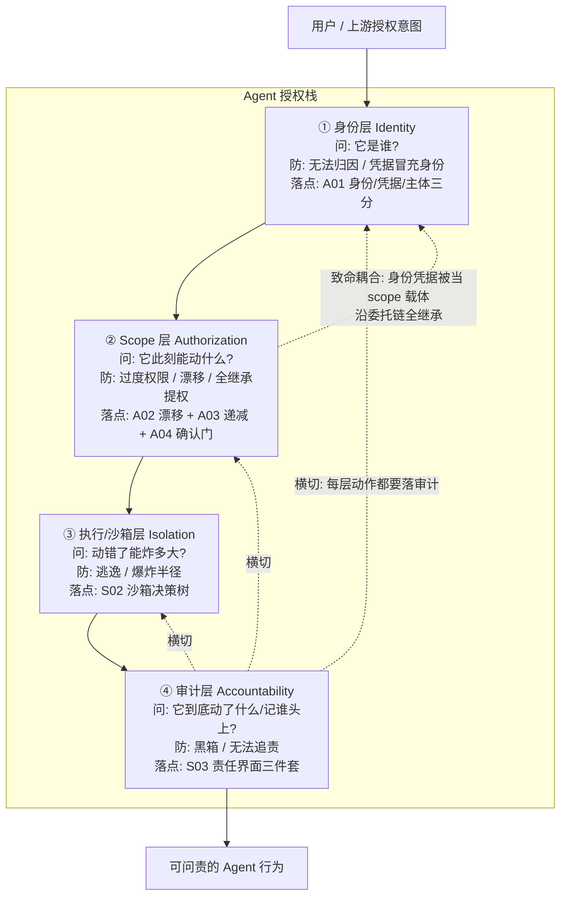

# S01 Agent 授权栈·身份 scope 审计

当一个 Agent 能自主调工具、花钱、spawn 子 agent，"给它的安全到底由什么组成"这个问题，散落在本专题十来个节点里——A01 讲身份、A02 讲漂移、A04 讲确认门、S02 讲沙箱、S03 讲审计——但**始终缺一张把它们拼起来的总图**。本节解决的就是这件事：给 Agent 的授权不是一个开关，而是一个**分层栈（authorization stack）**——身份层（它是谁）→ scope 层（它此刻能动什么）→ 执行/沙箱层（动错了能炸多大）→ 审计层（它到底动了什么、记谁头上）。本节的判断主轴只有一句：**这四层各防一类失败、彼此正交，缺哪层就在哪段塌；而其中最隐蔽、最容易被跨层击穿的，是 scope 层与子 agent 继承的耦合**。视角是安全架构总览 + PM 选型脊柱，框架名是"四层授权栈 × 每层可替换实现 × 致命跨层耦合"。

## §0 为什么是"分层栈"框架，而不是"一个权限系统"

读到"Agent 权限"，多数团队脑中弹出的是**一个东西**：一套 RBAC、一份 IAM 策略、一个"权限中心"。这个框架在传统系统里够用——人的身份长期稳定、权限静态分配、行为可预测，于是"身份"和"授权"可以糊在同一个系统里。但 Agent 把这三条假设全打破（A01 §0 已论证：身份可能只活几秒、行为非确定、还会自我再委托），于是"一个权限系统"这个框架会在三处误导。

第一，它把**正交的关注点压成一维**。"它是谁"（认证 / authentication）、"它能动什么"（授权 / authorization）、"动了会炸多大"（隔离 / isolation）、"动了什么记谁头上"（问责 / accountability）是四个独立的失败模式，各有各的攻击面和补救手段。把它们当一个系统，等于假设"解决了身份就解决了权限"——这正是 A01 §2 错点四点名的典型误判（"上了 Entra Agent ID 就以为闭环"）。

第二，它**看不见跨层耦合**。真正的事故往往不是单层失守，而是某两层在设计时被偷偷绑在了一起：最典型的就是 scope 层"借"了身份层的凭据往子 agent 传（全继承），于是一次身份泄露直接变成全栈越权（§3 致命耦合点）。一个"扁平的权限系统"视角根本画不出这条耦合线。

第三，正确的拆法是按**失败后果**而非按产品边界分层。所以本节用四层栈：身份层 → scope 层 → 执行/沙箱层 → 审计层，每层"防什么、可替换的实现有哪些、缺了塌哪段"。下面先建全景栈，再逐层给可替换实现，最后收口跨层耦合。

> [!note] 本节与 S02 / S03 的分工
> 本节是 **03 架构剖面的总图**，只画栈、定层、点耦合。**执行/沙箱层的隔离技术对照与决策树在 [S02 沙箱与最小权限架构对照](/kb/专题-安全对齐与失败/s02-沙箱与最小权限架构对照/)，审计层的责任界面三件套在 [S03 审计日志即责任界面](/kb/专题-安全对齐与失败/s03-审计日志即责任界面/)**——本节不复述它们的细节，只把它们安放进栈里、讲清层间依赖。读本节是为了知道"该有哪几层、缺哪层塌哪段"；读 S02/S03 是为了知道"某一层具体怎么做"。

## §1 四层授权栈：全景图

把本专题散落的判断拼成一张栈。每层回答一个独立的问题，对应一个独立的失败模式，落到一组可替换的实现。

读这张图的三个要点：

1. **四层是 AND 不是 OR。** 身份对了但 scope 给太宽 = 合法身份合法越权（A02 漂移）；scope 收窄了但没隔离 = 一次注入炸穿宿主（S02 逃逸）；隔离够强但没审计 = 出了事是黑箱，连"发生了什么"都不知道（S03）。任意一层缺位，整栈的安全等于那层的下限。
2. **审计层是横切的，不是末端的。** 图里 ④ 用虚线回连每一层——身份签发、scope 授予、沙箱逃逸尝试都必须落审计。把审计画成"流程最后一步"是常见错误：它是一个横切所有层的观测面（S03 §6 福柯全景敞视即此意）。
3. **致命耦合那条虚线（SC↔ID）是本节的命门**——scope 层本该独立决定"此刻给多少权限"，却在工程上偷懒地复用了身份层的凭据当作权限载体，于是子 agent 全继承父凭据时，scope 层被身份层"短路"了。§3 专门收口。

| 层 | 它回答 | 它防的失败 | 缺位后果 | 本专题落点 |
|---|---|---|---|---|
| ① 身份层 | 它是谁 | 无法归因、凭据冒充身份、人类凭证假归因 | 出事追不到主体；key 泄露无法区分合法 agent 与攻击者 | A01 |
| ② Scope 层 | 此刻能动什么 | 过度权限、Privilege Drift、子 agent 全继承提权 | 合法身份在授权范围内合法作恶；爆炸半径=全集权限 | A02 / A03 / A04 |
| ③ 执行/沙箱层 | 动错了能炸多大 | 沙箱逃逸、爆炸半径外溢到宿主 | 一次注入从单工具放大到整台宿主/整个租户 | S02 |
| ④ 审计层 | 到底动了什么、记谁头上 | 黑箱、无法追责、监督者悖论 | 无法合规、无法定责、无法回放因果 | S03 |

## §2 逐层的可替换实现：每层不止一种做法，且各有失效边界

授权栈的价值在于**每层都可以独立选型替换**，而不必押注单一厂商的全家桶。下面给每层 2–3 个真实可替换实现 + 它们各自"赌的是什么、在哪失效"。事实底座沿用本专题已接地数字，不重新发明。

### ① 身份层：从"持有即权限"到"加密绑定运行时"

可替换实现（详细对照见 A01 §1 四类候选表，此处只给选型轴）：

- **静态 API key / service account token**——本质是 bearer credential，"持有即证明"。赌注：凭据不泄露。失效边界：泄露即完全暴露、无法区分合法 agent 与重放；2025 年 agentic AI 相关 CVE 同比 **+255%**，主因即凭据权限过大、生命周期过长（来源：WorkOS Blog）。**结论：不该作为有外部副作用 agent 的身份层。**
- **Workload Identity / SPIFFE SVID**——X.509 证书加密绑定运行时、短效自动轮转（Google Cloud Agent Identity 基于 SPIFFE，access token 加密绑定防重放，文档 2026-06-05 更新）。赌注：运行时特征不可伪造。失效边界：为微服务设计，agent 多跳委托非原生；实施门槛高。
- **无凭证 agent 身份（FIC 模型）**——微软 Entra Agent ID 用联邦身份凭证(FIC)、由 agent identity blueprint 签发子身份（Microsoft Learn 2026-04-14 更新；Agent 365 GA 2026-05-01）。赌注：厂商身份平面可信。失效边界：绑死厂商生态（需 M365 E5 或 Entra ID P1/P2），异构多云吃亏——选型须把厂商锁定明确计价。

**标准层诚实状态**：NIST/NCCoE 概念文件《Accelerating the Adoption of Software and AI Agent Identity and Authorization》（2026-02 发布，意见征集 2026-04-02 截止）**直接提问"现有 OAuth/SPIFFE/OIDC 是否足够，还是需要全新标准"并明确无定论**（已 WebSearch 核实文件名与日期）。身份层目前没有"标准答案"，只有"按副作用计价的折中"。

### ② Scope 层：从"绑系统"到"绑任务/绑调用"

这是栈的中段，也是攻击者最爱的层（合法身份做合法越权）。可替换实现按"权限绑定到什么"排开：

- **绑系统 / 绑 operator 的 OAuth scope**——`允许访问 CRM`。赌注：系统级粒度够细。失效边界：表达不了"此刻这个任务需要什么"，必然往大里给（A01 §2 错点二）。
- **绑任务的最小授权（task-level）**——授权服务器对请求做语义检查、只签完成本任务所需的最小 scope。失效边界硬核：基于 LLM 的"任务→scope"匹配在多 scope 任务下准确率明显下降（arXiv:2510.26702，El Helou 等，ASTRA 数据集，2025-10-30，已接地）——**把安全关键决策交给概率模型本身是风险**。
- **绑调用的能力令牌（invocation-bound）+ 可编程权限**——AIP 协议的 IBCT（Invocation-Bound Capability Token，arXiv:2603.24775）用 Biscuit token + Datalog 把身份/递减权限/溯源合进一条 token 链；Progent（arXiv:2504.11703，Dawn Song 等）把权限表示为对工具名与参数的符号规则，用 SMT solver 对策略变更分类——**"收窄"自动批准、"扩展"需人工审批**（原文 "significantly reduces" 攻击成功率，非"降至 0%"，沿用 S02 R0.2 纠正后说法）。这是 scope 层目前最可靠的形态：**可靠的不是"让 LLM 现算权限"，而是"用确定性规则守住权限只能收窄不能扩张"。**

scope 层还要叠一个正交旋钮——**自主度（agency）**：OWASP Agentic Top 10（2025-12-09）的 **least privilege ≠ least agency**——即使有权访问，它能"无需回确认"自主连做多少步是另一回事。这把 A04 的 confirmation-gated 语义接进 scope 层：高副作用（A04 的 L3/L4 分级）操作必须落确认门，而非全自动。

> [!warning] scope 层的失效边界
> 两类场景 scope 层会退化：(a) 任务本质就需要宽权限（如合法的"全库迁移" agent），最小权限退化为全权限，**隔离层（③）成为唯一防线**；(b) 委托链跨信任域时，递减原则缺协议级强制——RFC 8693 自认嵌套 `act` claim "仅供参考，不得用于访问控制决策"，**多跳委托标准层根本无法强制传递**（IETF Datatracker 核实）。这条标准空白是全专题的核心制度性缺口，也直接通向 §3 的致命耦合。

### ③ 执行/沙箱层：动错了能炸多大

本节不展开（**全部对照与决策树在 [S02 沙箱与最小权限架构对照](/kb/专题-安全对齐与失败/s02-沙箱与最小权限架构对照/)**），只标它在栈里的位置与可替换梯度：进程级（seccomp/AppArmor 加固）→ 容器级（Docker/gVisor）→ microVM 级（Firecracker ~125ms 冷启、内存 <5MiB/VM）→ 能力安全级（WASM+WASI，引用即权限）。选型判据是"代码可信度 × 副作用等级 × 多租户强度 × 合规要求"。**栈视角的唯一补充**：隔离层是 scope 层失效时的兜底（见上方 (a) 场景），所以"scope 给得越宽，隔离就必须越强"——两层是负相关的预算分配，不是各自为政。

### ④ 审计层：动了什么、记谁头上

同样不展开（**三件套与监督者悖论在 [S03 审计日志即责任界面](/kb/专题-安全对齐与失败/s03-审计日志即责任界面/)**），只标位置：可追溯 / 不可篡改 / 可归因三件套，且必须与 Observability 的 trace 解耦（trace 可采样可丢，audit 不可丢）。**栈视角的唯一补充**：审计层是横切的——它要记的不只是③执行层的动作，还要记①身份签发、②scope 授予/变更、子 agent 委托链。一个只记"工具调用"却不记"是谁、带着谁的授权、第几跳"的审计，无法回放授权链，等于审计层缺位（S03 §1 双身份 + 委托父链 id）。

## §3 判断主轴：致命耦合点——scope 层与子 agent 继承的耦合

> [!warning] 这是本节的命门。四层栈最容易被击穿的不是某一层单独失守，而是**两层在工程上被偷偷绑死**。最致命的一处：scope 层"借用"身份层的凭据当权限载体，于是子 agent 全继承时，scope 层被身份层短路。按 症状 → 为什么会错 → 正确做法 → 真实反例 拆解。

**耦合一：身份凭据被当成 scope 载体，沿委托链全继承（核心命门）。**
- 症状：orchestrator 持有"读写库 + 发邮件 + 调支付"的全集 token，spawn"网页总结"子 agent 时直接 `token = parent.token` 传下去。
- 为什么会错：这把本该正交的两层焊死了——**身份层回答"它是谁"，scope 层回答"它此刻能动什么"**，但全继承让"子 agent 的能动范围"由"父的身份凭据"决定，scope 层形同虚设。后果是 A03 点名的"反最小权限"：每个子 agent 暂时拥有全栈最高权限，一次间接 prompt injection（污染的网页）就把"网页总结器"变成"能调支付"。confused deputy 在多 agent 架构里的标准形态。
- 正确做法：**scope 层必须独立于身份层做"每跳 scope 递减（attenuation）"**——子 agent 权限严格 ⊆ 父权限，且权限载体不是"复制父凭据"而是"签发一个新的、绑本次子任务的能力令牌"（AIP 的 IBCT 即此意）。身份用来归因（双身份日志记"父委托子、子代表用户 X"），scope 用来限权，两者解耦。
- 真实反例：2025-09 记录的 Cross-Agent Privilege Escalation 正是利用下游 agent 对上游传入权限的无条件接受（WorkOS Blog 汇总）；而 RFC 8693 自认 `act` claim 不可用于访问控制——意味着递减原则**目前主要靠应用层自律，协议层不保证**（IETF Datatracker 核实）。

**耦合二：身份层"解决了"被当成 scope 层也解决了。**
- 症状：上了 Entra Agent ID / SPIFFE，团队认为"权限闭环"。
- 为什么会错：身份层只锚定"它是谁"，完全不约束"它此刻该动什么"。Karl McGuinness 的尖锐立场就在这——**"Agent 不需要身份护照，需要的是授权授予"**（Resilient Cyber 引述）。把身份当终点，scope 层就被默认放空。
- 正确做法：身份是 scope 的**前提而非替代**——有了可信身份才谈得上"给这个身份此刻授什么权"，但授权是独立工程（A01 §2 错点四的栈级表述）。
- 真实反例：约 **2000 个**野外 MCP server 被实测全部缺认证〔待核实数字〕——连身份层都没有，scope 更无从谈起；反过来即便补了身份，A02 的 Privilege Drift 仍会让"曾经合理的 scope"随任务漂移成越权。

**耦合三：scope 层与隔离层互相甩锅，导致两层都偷工。**
- 症状："我们有沙箱，权限给宽点没关系" 与 "我们权限很细，沙箱用 Docker 就行" 同时存在于同一系统不同团队。
- 为什么会错：scope 与隔离是**负相关预算**而非互替——scope 越宽，一次合法越权的后果越大，隔离就必须越强；隔离越弱，越依赖 scope 收窄来限制爆炸半径。两边各自假设"对方会兜底"，结果两层都给了中等强度，乘积反而最弱。
- 正确做法：按副作用分级**联动**配置——L0/L1 读操作可"窄 scope + 轻量容器池"，L3/L4 写/付费/不可逆操作必须"最小 scope + 一次性 microVM + 确认门"（S02 §4 决策树的横切 K 列即此）。
- 真实反例：2025-09 Postmark MCP 投毒在 `send_email` 静默加 BCC——隔离再强也没用，因为工具在"授权范围内"作恶，这是 scope 层（过度功能：发邮件工具不该能任意改收件人）的问题，不是隔离层的问题。误判成"加强沙箱"会完全打偏。

**耦合四：审计层与被审计的 scope/执行层共用信任根。**
- 症状：审计日志写在 agent 自己有写权限的库里，或与执行层同一个被攻破的凭证服务。
- 为什么会错：能被被监督方修改的日志不是证据（S03 §2 监督者悖论）；更隐蔽的是——**当四层共享同一根信任（同一被攻破的凭证服务 / 同一 deployer 单方掌控审计），纵深防御退化为单层**（S02 §6 对手立场三埋的伏笔，本节正式收口）。
- 正确做法：审计层的写入权与产生主体、被审计主体**物理分离**（write-only sink、外部不可变存储），且四层的信任根要尽量独立——避免"一处沦陷、全栈失守"。
- 真实反例：若投毒的 Postmark MCP server 同时能写自己的审计日志，它可以把加 BCC 那次记成正常发送（S03 §2 错位三）。

一句话立场：**授权栈的安全不等于四层强度之和，而取决于层间是否真正解耦——身份归因、scope 限权、隔离兜底、审计追责必须各管各的失败模式；任何把两层焊死（尤其 scope 借身份凭据全继承）的工程偷懒，都会让纵深防御退化为单层。**

## §4 产品 PM 视角补盲

工程视角容易把授权栈当成"四个技术组件清单"，PM 要补三个看走眼的点。

- **用户的心理授权是"任务级"，不是"系统级"。** 用户授权的是"帮我订一张机票"，不是"允许这个 agent 及其所有子 agent 在我账户里读写一切"。全继承（耦合一）把"任务级心理授权"偷换成"系统级技术授权"——产品上不把这层差异显式化，用户的"同意"在法律和体验上都是无效同意。scope 层不只是技术层，它是**把用户意图翻译成机器权限的产品界面**。
- **确认疲劳让"逐操作同意"失效，重心被迫前移到 scope 默认值。** Anthropic 共享责任模型数据：开发者在 **93%** 的权限弹窗中未经有效审查即点批准（Backslash Security，2026-04-29）。这意味着不能靠"每跳都问用户"治理 scope，必须靠**计划级治理**（一次批一个有边界的执行计划）+ 默认最小化——把确认预算只留给 A04 的 L3/L4 高副作用动作。
- **授权栈的责任归属是产品边界。** Anthropic 把 Model 划给模型商，Harness/Tools/Environment 三层划给**部署组织**（Backslash Security 转述）。映射到本栈：scope 层、执行层、审计层全是 deployer 的责任——"卖 agent 给受监管客户 = 卖一套可证明的、四层都不缺的授权栈"。缺哪层，SLA 就在哪层裸奔。

## §5 对手框架回应：接受 + 边界

**对手立场一（业界务实派）：四层栈是过度工程，多数 agent 一个 IAM + 日志就够。**
接受：对纯本地、单机、无外部副作用的脚本式 agent，发独立身份 + 上 microVM + 不可篡改审计确实是过度工程（A01 §3 failure scenario 已标）。授权栈的成本只在"有外部副作用 + 多跳委托 + 跨信任域"时才值得全付。
边界：但**分层本身是零成本的认知工具**——即使某层用最轻实现（身份用环境变量、隔离用进程级），把四个失败模式分开想，也比"一个权限系统"少踩耦合坑。我赌的是：**栈可以按场景裁剪层的强度，但不能裁剪层的数目**——你可以给身份层一个最弱实现，但不能假装不需要回答"它是谁"。

**对手立场二（Rick 未读·能力安全派 / OCap）：分层"事后拒绝"思路本身就错，该"事前不授予"。**
接受：对象能力模型（OCap，Mark Miller）洞见极深——"默认零权限、引用即权限"从根上消除了"权限提升"这个攻击类别，把身份层和 scope 层合并成"你手里有哪些 capability 引用"。WASM+WASI 把它搬到运行时。这对耦合一是釜底抽薪：没有 ambient authority 可被 confused deputy 利用。
边界：但 OCap 生产成熟度存疑，独立审计稀少（S02 §6 已标），且现有 MCP/工具生态大量建在 ambient authority 假设上，迁移成本高。我赌的是：**OCap 是 3–5 年的正确方向，2026 的务实选择是"四层栈 + Progent 式可编程权限"逼近 OCap 效果**，而非全栈 WASM。

**对手立场三（Rick 未读·Schneier 式悲观派）：每层都会被绕过，分层栈是安全剧场。**
接受：单层必然失效——93% 无效审批就是审计/确认层失效的铁证。
边界：但"每层都会失效"恰恰是做纵深防御的理由。我赌的是：**多层独立失效概率的乘积远低于单层**。关键前提是 §3 收口的那条——**四层信任根必须独立**；一旦共享信任根（耦合四），乘积优势消失，栈退化为单层。所以本节的判断主轴不是"层越多越安全"，而是"层必须解耦才安全"。

## §6 跨域呼应：科层制的"分权制衡"与授权栈的权力分立

调度一个 Rick 熟悉的制度框架——韦伯式科层制里的**职能分立与制衡**（呼应 0117社会学 / 生命政治 的权力技术脉络）。一个治理良好的组织从不让同一个人"定身份、批权限、执行、又自己记账"——这正是会计/审计领域"职责分离"（segregation of duties）的铁律：**授权、执行、记录三权必须分立**，否则任何一人即可独自完成舞弊并抹掉痕迹。

把这个框架搬到 Agent 授权栈，会改变一个技术判断：很多团队把四层交给同一个"权限中心"统一实现（图省事、好运维），却没意识到这等于让同一主体同时掌握授权（scope 层）、执行（沙箱层）、记录（审计层）——制度上这是最经典的舞弊温床。这给本节的致命耦合点补了一条**制度性诊断**：耦合四（审计与被审计层共用信任根）不是工程 bug，而是违反了三权分立这条三百年的治理铁律。真正的授权栈需要的不只是技术上的解耦，而是**制度上的权力分立**——授权服务、执行环境、审计存储分属不同信任域、不同密钥、最好不同运维主体。墙挡不住的，靠"分权"来兜：没有任何单一沦陷点能独自完成"越权 + 执行 + 抹账"的全链。这也呼应 S03 的福柯式拷问"谁监督监督者"——分权制衡正是那个问题的制度答案。

## §7 PM 决策启示：面试 / 选型 / 复现

- **面试怎么用**：被问"你怎么设计 Agent 的权限系统"，别答"配一套 RBAC + 加日志"。答框架——"不是一个系统，是四层正交的栈：身份层归因、scope 层限权、沙箱层兜底、审计层追责；每层各防一类失败、可独立选型。最致命的不是某层弱，而是层间耦合——尤其 scope 借身份凭据沿子 agent 全继承，会让 scope 层被短路、纵深防御退化为单层。" 再补一句边界——"栈可按场景裁剪每层强度，但不能裁剪层数；且四层信任根必须独立，否则乘积优势消失。" 能说出 RFC 8693 多跳不可强制、scope 与隔离是负相关预算、三权分立类比这几点，立刻区分于背稿子的人。
- **选型怎么用**：拿四层栈对每个候选 agent 平台/编排框架做分层四问——(1) **身份层**：ephemeral 短效凭据还是长期 key？能否双身份日志？(2) **scope 层**：支持任务级/调用级最小授权且 token 只能收窄不能扩张吗？还是只能传一份全局凭证给所有子 agent？(3) **执行层**：工具执行落哪级隔离、能否按副作用分级路由？（接 S02 选型四问）(4) **审计层**：追加式不可篡改、写入权与被审计主体分离、保留期 ≥6 个月吗？（接 S03 选型四问）。**任意一层答"用静态 key / 全局凭证 / 可被运维删改的日志"，在高合规场景直接扣分。** 这是 [m208 - AI 基础设施与中间件选型](/kb/工程化与落地架构/m208-ai-基础设施与中间件选型/) 安全维度的脊柱化整合。
- **复现怎么用**：自建最小 agent，按栈逐层搭——身份层起一个 SPIFFE/SPIRE（开源）发短效 SVID；scope 层叠 Progent（已兼容 LangChain/OpenAI Agents SDK）做"只能收窄"的可编程白名单；执行层接 gVisor 或 E2B/Northflank 的 Firecracker 沙箱；审计层写一张 append-only 事件表（每条带 SHA-256 链 + 双身份字段 + 委托父链 id）。然后**刻意构造耦合一**——让"网页总结子 agent"全继承父凭据，注入恶意网页看它能不能调到支付。亲手看到 scope 层被身份层短路，比读十篇论文都印象深。

## §8 与已有节点的关系

- 对本专题 [A01 Agent 身份辨析·Identity vs API Key vs Human Credential](/kb/专题-安全对齐与失败/a01-agent-身份辨析-identity-vs-api-key-vs-human-credential/)：**总图收口**。A01 详解身份层（三分框架、四类候选），本节把它安放为栈的①层，并点出"身份≠scope"的层间解耦。不复述三分框架。
- 对本专题 A02 授权范围与 Privilege Drift（同级 staging，降级文本）、A03 子 agent 权限继承（同级 staging，降级文本）、A04 Confirmation-gated 权限语义（同级 staging，降级文本）：**栈位安放 + 耦合提级**。三者是 scope 层②的三个病理切片，本节把 A03 的"全继承"提级为全栈最致命的跨层耦合（§3 耦合一）。
- 对 [S02 沙箱与最小权限架构对照](/kb/专题-安全对齐与失败/s02-沙箱与最小权限架构对照/)：**上位总图**。S02 是执行层③的细节（隔离梯度 + 决策树），本节只画它在栈里的位置与"scope 越宽隔离越强"的层间负相关。不复述四层隔离对照。
- 对 [S03 审计日志即责任界面](/kb/专题-安全对齐与失败/s03-审计日志即责任界面/)：**上位总图**。S03 是审计层④的细节（三件套 + 监督者悖论），本节把它画成横切所有层的观测面，并正式收口"四层共享信任根则退化为单层"这条 S02/S03 都埋了伏笔的耦合。
- 对 0411 主库 [A06 Orchestrator 编排器](/kb/专题-安全对齐与失败/a06-orchestrator-编排器/)：**深化**。A06 把 orchestrator 定位为授权下发点，本节给出它下发时该遵循的四层栈结构。

## §9 关联节点

**核心（必读）**
- [A01 Agent 身份辨析·Identity vs API Key vs Human Credential](/kb/专题-安全对齐与失败/a01-agent-身份辨析-identity-vs-api-key-vs-human-credential/) — 栈①身份层的详解
- [S02 沙箱与最小权限架构对照](/kb/专题-安全对齐与失败/s02-沙箱与最小权限架构对照/) — 栈③执行层的详解
- [S03 审计日志即责任界面](/kb/专题-安全对齐与失败/s03-审计日志即责任界面/) — 栈④审计层的详解
- [A08 MCP 与 A2A 协议族](/kb/专题-安全对齐与失败/a08-mcp-与-a2a-协议族/) — 工具调用是 scope 层要约束的协议载体
- [A06 Orchestrator 编排器](/kb/专题-安全对齐与失败/a06-orchestrator-编排器/) — 授权下发点，本栈的运行时落点
- [m208 - AI 基础设施与中间件选型](/kb/工程化与落地架构/m208-ai-基础设施与中间件选型/) — 本栈是其安全选型维度的脊柱
- [Agent](/kb/基础知识库/agent/) — 本专题的根概念

**延伸（可选）**
- [Function Calling](/kb/基础知识库/function-calling/) — scope 层约束的最小动作单元
- [m207 - Agent 产品化：场景推演与失败模式](/kb/工程化与落地架构/m207-agent-产品化-场景推演与失败模式/) — 各层缺位对应的失败模式
- [A07 Multi-Agent Teams](/kb/专题-安全对齐与失败/a07-multi-agent-teams/) — 多 agent 委托链的栈级表现
- [c10 - Agent 技术栈与工具调用](/kb/基础知识库/c10-agent-技术栈与工具调用/) — 工具调用技术栈基础
- [Constitutional AI](/kb/基础知识库/constitutional-ai/) — 用机制约束行为的训练侧对应
- [幻觉](/kb/基础知识库/幻觉/) — 非确定性使审计成为不可消除不确定性下的补偿机制
- 生命政治 — 福柯权力技术，分权制衡的跨域锚点
- 0117社会学 — 韦伯科层制、三权分立的来源
- 安全感知与干预 — Rick 滴滴风控"账户安全≠行为安全"经验迁移
- [AI概念滥用反思](/kb/基础知识库/ai概念滥用反思/) — "上了身份就闭环"是典型概念滥用
- [AI PM 知识图谱·总索引](/kb/ai-pm-知识图谱/ai-pm-知识图谱-总索引/) — 总入口

> [!note] 跨专题 / staging 引用降级说明
> 本专题（0436）同级节点 A02 / A03 / A04 / G01 / G02 / E02 / E03 目前在 staging，文中以普通文本引用"本专题 A02/A03/A04"等，不建主库双链；落盘入库后回填。0435 红队专题 S03（Agent 权限边界与最小权限设计，"权限是最后防线" + L0–L4 副作用分级源头）在 staging，降级文本，不建双链。0421 机制设计（共享资源治理）、0430 制度（agent 准法律主体）、0432 时间性（changelog）均在 staging，降级文本。可建双链的仅为已入主库的真实节点（A01/S02/S03 本专题已落盘节点，及 0411 的 A08/A06、m208 等）。

## §10 修订日志

- **R0（2026-06-19）**：首稿。建立"四层授权栈"框架（身份/scope/执行/审计正交分层）+ Mermaid 全景图 + 栈层对照表；逐层给可替换实现与失效边界（身份层三选项、scope 层三选项含 AAuth task-level 失效边界、执行/审计层指向 S02/S03 不复述）；判断主轴四致命耦合点（核心：scope 借身份凭据全继承 → scope 层被短路；及身份冒充 scope、scope 与隔离互相甩锅、审计与被审计共用信任根）；三权分立跨域呼应（韦伯科层制 + 会计职责分离，收口"四层信任根必须独立"）；三对手框架（务实派/OCap 派/Schneier 派）；面试/选型/复现三落地（选型四层四问整合 S02/S03）。事实接地沿用本专题已核实底座：255% CVE、SPIFFE 24h、Entra Agent ID FIC、RFC 8693 多跳不可强制、NIST/NCCoE 无定论、arXiv 2510.26702/2603.24775/2504.11703、93% 无效审批、Postmark MCP、Cross-Agent Privilege Escalation 2025-09 均附来源；"约 2000 个 MCP server 无认证"标〔待核实〕。未新编任何 arXiv 编号。
