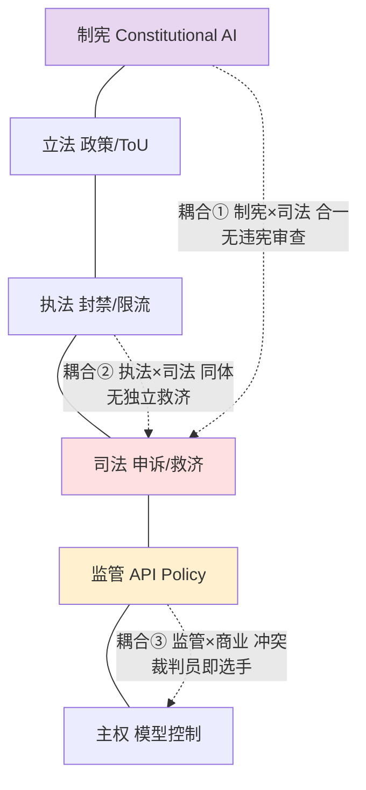

# S01 AI 制度权力分层剖面

一家前沿 AI 公司同时在做六件事：写一部约束模型行为的"宪法"（[Constitutional AI](/kb/基础知识库/constitutional-ai/)）、制定使用条款与内容政策、执行封禁与限流、受理申诉、用 API 准入和定价把第三方应用纳入自己的秩序、并最终握有"训练/不训练、上线/下架"这把总开关。问题不是"它有没有权力"——有。问题是：**当我们把国家的六种权力（制宪 / 立法 / 执法 / 司法 / 监管 / 主权）当作一把尺子去量这家公司时，哪几层权力在它内部是"合一"的、因而缺了违宪审查、缺了独立救济、缺了利益隔离？** 本节点的框架不是"AI 公司很强大"这种 hype，而是一张**分权制衡的体检表**：六层权力各自的性质、各自的制衡缺口、以及作为 PM 你在每一层该核对的清单。区分顶刊与技术博客的，是后面那一节"层间致命耦合"——三处把不同权力捆在同一只手里的结构性短路。

## §0 为什么是"六层国家权力"框架，而不是"平台治理"或"AI 伦理"框架

读者脑中默认有两个框架，都会把这件事看小。

**默认框架一：平台治理（platform governance）。** Klonick 的"新治理者"（The New Governors, *Harvard Law Review* 131, 2018）、Gillespie 的《互联网的守门人》（*Custodians of the Internet*, Yale UP, 2018）已经把 Facebook/YouTube 的内容审核论证为一套"私法体系"。这个框架很强，但它的解剖刀停在"内容"层——它问的是"平台怎么管言论"。AI 公司的权力远不止内容审核：Constitutional AI 是写在模型权重里的行为规范，API policy 是对整个下游生态的准入管制，模型的训练与下架是连内容都谈不上的"基础设施总开关"。用"平台治理"量 AI 公司，会漏掉**制宪层和主权层**——而那恰恰是 AI 区别于社交平台的地方。

**默认框架二：AI 伦理 / 合规（AI ethics & compliance）。** 这个框架问"模型有没有偏见、符不符合 EU AI Act"。它把 AI 公司当成一个**被监管对象**。但本专题的反共识立场是：AI 公司同时是**监管者本身**——它用 API policy 监管下游开发者，用 Model Spec / Constitution 给整个行业立行为标杆。只把它当合规对象，就看不见它的**准立法权和准监管权**。

**所以本节点选"六层国家权力"框架。** 不是说 AI 公司"是"国家——它没有领土、没有暴力垄断、没有选举授权。而是说：**国家权力的分立（separation of powers）是人类几百年试错出来的、防止权力滥用的最成熟的诊断语言。** 把它当作一面镜子照向 AI 公司，最锋利的发现不是"它有六种权力"，而是"它把本该分立的几种权力合在了一只手里"。孟德斯鸠的核心命题不是"权力要分成三份"，而是"行政权、立法权、司法权若集于一身，自由便不复存在"。本框架的判断主轴（§7）正是在找这种"集于一身"。

> [!note] 框架的边界
> 国家类比有一个致命的不对称：国家公民**不能退出**（exit 成本极高），而 AI 产品的用户**可以换一家**（理论上）。Hirschman 的 exit/voice 框架在此提醒我们：AI 公司缺少国家的强制力，却也因此被认为"不需要"国家级的制衡。这正是反方（见 §8）最有力的一击。本节点不回避它，而是用"事实主权"（de facto sovereignty）回应：当三家公司控制了前沿模型的绝大部分供给时，exit 已经从"换一家"退化为"在三个王国之间换一个臣籍"。

## §1 第一层 制宪权：Constitutional AI 与价值观的写入

**权力性质：** 决定"模型把什么当作善、什么当作不可逾越"——这是最根本的规范设定权。Anthropic 的 Constitutional AI（Bai et al., "Constitutional AI: Harmlessness from AI Feedback", arXiv:2212.08073, 2022年12月15日，已核实）用一份明文"宪法"（原则列表，含取自《世界人权宣言》、Apple ToS、DeepMind 原则等的条款）替代大量人工标注，让模型通过 RLAIF 自我批评、自我修正。OpenAI 的 Model Spec、Google DeepMind 的 AI Principles 是同类物。这是**字面意义的"制宪"**——给一个将影响数亿人的系统写根本规范。

**制衡缺口：无违宪审查。** 一部真正的宪法之上有违宪审查机制（宪法法院 / 司法审查）。Constitutional AI 没有：宪法由公司起草、由公司用算法实施、由公司自己评估是否被遵守。Orozco y Villa & Menendez（2025, DigiCon〔来源待核实〕）批评该类比"规范上过于单薄"（normatively too thin），三点理由——高层原则与工程实现之间存在不可弥合的翻译鸿沟；以 AI 自我批评替代人工监督违背"human-in-the-loop"原则；公平/偏见判断需要情境道德推理，算法无法独立完成。Abiri（Gilad Abiri, "Public Constitutional AI", arXiv:2406.16696, 2024年6月24日，已核实）进一步提出"Public Constitutional AI"：即便宪法原则来自公民协商，**训练与执行仍不可审计**——无外部机构能核实模型行为是否真的符合宪法目标（Priyanshu, Maurya & Hong, "AI Governance and Accountability: An Analysis of Anthropic's Claude", arXiv:2407.01557, 2024年5月，已核实——该文以 NIST AI RMF 与 EU AI Act 为镜分析 Claude 治理）。

**PM 清单（制宪层）：**
- 这份"宪法"是公开全文还是只公开摘要？条款数是多少（学术拆解称 Anthropic 约 205 条、OpenAI 约 197 条〔来源待核实〕）？能否被外部逐条审计？
- 原则冲突时（"有帮助" vs "无害"）由谁、用什么程序裁决？裁决记录是否可追溯？
- 修宪程序是什么？一次模型迭代就能悄悄改写价值观吗？有没有变更日志？

## §2 第二层 立法权：使用政策与社区准则

**权力性质：** 把宪法层的抽象原则转化为可执行的具体规则——使用条款（ToU）、可接受使用政策（AUP）、内容政策。这是**准立法（private legislation）**。Klonick 论证平台内容政策"在功能上构成私法体系，影响全球言论标准却几乎没有对用户的直接问责"。Bloch-Wehba（"Global Platform Governance", *SMU Law Review* 72, 2019）指出平台同时执行规则制定与裁定，而行政法的基本原则（透明度、参与、说理、复审）严重缺失。

**制衡缺口：无代议、无立法辩论。** 国家立法有议会、有公开辩论、有利益相关方听证。AI 公司的政策更新通常是**单方公告**：一封邮件、一次政策页 diff。用户无投票权，开发者无否决权。规则可以溯及既往（昨天合规的用法今天违规）。Meta 2025年1月废除美国第三方事实核查、改用 Community Notes，被其自己的监督委员会批评"仓促宣布、偏离常规程序"（来源：Oversight Board / Platformer, 2025），就是"立法权无程序约束"的活样本。

**PM 清单（立法层）：** 政策变更有无提前通知期与过渡期？有无变更日志与版本号？高影响条款变更前是否征询用户/开发者意见？规则是否可溯及既往？

## §3 第三层 执法权：封禁、限流、内容拦截

**权力性质：** 对违规行为施加制裁——封号、降权、拒绝服务、内容拦截。这是**准行政执法**，且高度自动化。Douek（"Content Moderation as Administration", *Harvard Law Review* 136, 2022）的关键洞见：内容审核不是逐条"司法判决"，而是**大规模言论行政**（mass speech administration）——关键决策发生在事前的制度设计层（规则、阈值、模型），而非事后个案纠错。

**制衡缺口：执法即时、不透明、可规模化误伤。** 国家执法受令状、比例原则、正当程序约束。算法执法没有：封禁在毫秒内完成，依据是不可解释的 ML 模型，规模化误伤无人对单个个体负责。Pasquale 的"黑箱社会"（*The Black Box Society*, Harvard UP, 2015）正是此处——用户无法理解、质疑影响自己的规则。

**PM 清单（执法层）：** 处罚是否分级（警告 vs 永久封禁）还是一刀切？处罚是否说明具体理由与可追溯依据？自动化决策的准确率/误报率是否公开（EU DSA 要求 VLOP 公开此项）？有无"人在回路"复核高影响处罚？

## §4 第四层 司法权：申诉与救济

**权力性质：** 受理被处罚者的申诉、裁定争议、提供救济。Meta 的 Oversight Board（2020年5月成立测试版，2021年1月起正式决定）是迄今最像"司法机关"的尝试：外部成员、公开裁决书、被法律数据库（Westlaw、Lexis+）收录、被联合国人权高专办与以色列最高法院引用为正当程序参考。

**制衡缺口：救济者依附于被诉者。** 真正的司法独立要求法院在人事、财政、终审权上独立于行政。Oversight Board 三者皆缺：Meta 出资（且 2026年通知可能 2028年后停止资助、已削减预算——来源：TechBrew, 2026）、Meta 保留对政策的最终解释权、Board 只能裁个案不能改政策（19 条政策建议中 Meta 完全执行 15 条、约 79%，拒绝 1 条；Klonick 给 Board 综合评 C）。Trump 停权案中 Board 维持停权但裁定 Meta"施加了无限期且无标准的处罚"，迫使其改为两年——这是 Board 最高光的一次，却也暴露了它只能"建议"不能"判令"。

**PM 清单（司法层）：** 申诉机构是否在财政/人事/终审上独立于执法部门？裁决是否对公司有约束力（binding）还是仅"建议"？裁决书是否公开、可形成判例？申诉是否有时限、是否需付费、是否对所有用户可及？

## §5 第五层 监管权：API Policy 作为准监管

**权力性质：** 通过 API 准入、速率限制、定价、用例审批，管制整个下游开发者生态。这是 AI 公司**对外**的权力——它不监管自己，而像一个监管机构那样监管成千上万依附其上的应用。批准谁能接入、谁的用例"违规"、给谁更低延迟/更高配额，本质是**准监管**（quasi-regulation）。一纸 policy 更新可以一夜之间让一个建在 API 之上的创业公司归零。

**制衡缺口：监管权与商业利益直接冲突。** 公共监管机构（理论上）独立于市场利益。AI 公司既是基础设施提供方、又是上层应用竞争方（自营 first-party app 与第三方争夺同一市场），还是裁定第三方"是否违规"的监管者——**裁判员同时是参赛选手**。这正是反垄断法警惕的自我优待（self-preferencing）。Tim Wu 的"过大诅咒"（*The Curse of Bigness*, 2018）与 Zittrain 的"生成性"被"应用化"侵蚀（*The Future of the Internet*, 2008）在此汇合：平台准入权的集中威胁无需许可的创新。

**PM 清单（监管层）：** API 准入/封禁标准是否公开、可预期？平台自营应用与第三方是否同规则、同配额、同延迟？政策变更对依附开发者有无缓冲期？是否存在自我优待的结构性激励？

## §6 第六层 主权：模型控制这把总开关

**权力性质：** 决定一个模型是否训练、是否上线、是否下架、谁能用、在何地域可用、权重是否开放。这是**事实主权**（de facto sovereignty）——Srivastava & Bullock（"AI, Global Governance, and Digital Sovereignty", arXiv:2410.17481, 2024年10月，已核实）提出 AI 系统嵌入全球治理、在工具性/结构性/话语性三类权力上重塑国家与企业关系；Bremmer & Suleyman（2023, *Foreign Affairs*〔具体卷期待核实〕）更直接称大型科技公司"已事实上成为其所创建数字领域中的独立主权行动者"。Anthropic 的 Long-Term Benefit Trust、OpenAI 曾倡议的 IAEA 式国际监管机构，都是这一层"准外交/准公益托管"的表现。模型的训练数据选择、安全等级（ASL）划定、地域可用性，是连内容都谈不上的最底层控制。

**制衡缺口：无授权来源、无退出选项、无问责对象。** 国家主权（在民主理论里）来自被治理者的同意（consent of the governed）。模型主权没有：用户从未授权、无法弹劾、模型下架时无人对依赖它的应用与个人负责。Zuboff 的"来自上层的政变"（coup from above, *The Age of Surveillance Capitalism*, 2019）描述的正是这种未经同意的权力获取——尽管 Morozov（"Critique of Techno-Feudal Reason", *NLR* 133/134, 2022）反驳说这仍是彻底的资本主义而非"封建"或"政变"，把异常资本主义理想化为常态本身就是意识形态（见 §8）。

**PM 清单（主权层）：** 模型下架/弃用是否有提前通知与迁移期（deprecation policy）？关键能力是否单一供应商锁定（vendor lock-in）？权重/数据的控制权是否有任何外部托管或制衡（如 benefit trust 的实际权限）？

---

## §7 判断主轴：三处层间致命耦合（90% 的人会看走眼的地方）

把六层画成一张表还不够——**真正的危险不在任何单层，而在两层被同一只手握住时短路出的"无制衡区"。** 孟德斯鸠说过：危险的从来不是权力本身，而是权力的合并。以下三处耦合，是本节点最锋利的判断。

### 致命耦合①：制宪权与司法权合一 —— 没有违宪审查

- **症状：** 公司写了"宪法"（§1），又是唯一裁定"模型是否违宪"的机构（§4）。当用户主张"这条处罚违背了你们自己宪法第 X 条"，没有任何第三方能裁决——立宪者即终审者。
- **为什么会错：** PM/外行容易被"Constitutional AI"这个名字唬住，以为"有宪法 = 有法治"。但法治的要件不是"有一部宪法"，而是"有一个独立机构能宣布违宪并令其无效"。马伯里诉麦迪逊确立的司法审查，才是宪法有牙齿的原因。Constitutional AI 有宪法文本、没有违宪审查——它是 constitution without constitutionalism。
- **正确做法：** 评估时把"宪法文本"与"违宪审查机制"分开打分。前者满分、后者零分的系统，其"宪法"是营销资产而非约束资产。要求：宪法变更日志公开 + 至少一个能否决具体决策的外部机构。
- **真实反例：** Priyanshu et al.（2024, arXiv:2407.01557，已核实）以 NIST/EU AI Act 框架分析 Claude 治理，指向"无外部机构独立核实模型行为是否符合宪法目标、无独立审计接触训练过程"的问责缺口。即制宪与（准）司法在同一主体内闭环。

### 致命耦合②：执法权与司法权同体 —— 没有独立救济

- **症状：** 封你号的（§3）和受理你申诉的（§4），在大多数 AI 产品里是**同一个团队、同一套系统**。"申诉"本质是让执法者复核自己——相当于让开罚单的警察当法官审自己的罚单。
- **为什么会错：** 产品视角下"申诉入口"常被当成一个客服功能（"我们有申诉啊"）来勾选，忽略了**救济的价值完全取决于救济者的独立性**。Meta 之所以要费力搭一个外部 Oversight Board，正是因为内部申诉的独立性约等于零。Bloch-Wehba（2019）点名：平台同时执行规则制定与裁定，行政法的复审原则缺失。
- **正确做法：** 把"有没有申诉"升级为"申诉的独立性有几级"——(0) 同团队复核 →(1) 跨团队复核 →(2) 内部独立委员会 →(3) 外部约束性裁决。Oversight Board 做到了 (2.5)：外部但裁决不全 binding、且财政依附。绝大多数 AI 产品停在 (0)。
- **真实反例：** Trump 停权案中，是外部 Board 而非 Meta 内部流程才裁出"无限期+无标准的处罚不当"。若靠 Meta 自己的执法-申诉同体系统，这个纠错大概率不会发生。这证明同体救济的纠错能力近乎失效。

### 致命耦合③：监管权与商业利益冲突 —— 裁判员即选手

- **症状：** AI 公司用 API policy 监管下游开发者（§5），同时自己下场做与这些开发者竞争的 first-party 应用。它有权判定竞争对手的用例"违规"，也有权给自家应用更低延迟/更高配额。
- **为什么会错：** PM 容易把 API policy 当成"中立的技术规则"，看不见它是**带商业利益的监管权**。公共监管之所以要求监管者独立于市场，正因为"监管 + 逐利"会系统性自我优待。Wu 的反垄断框架、欧盟对 self-preferencing 的执法（DMA 守门人条款）都指向这一点。
- **正确做法：** 选型时把"我依赖的平台是否同时是我的竞争对手"列为一级风险。要求平台公开：first-party 与第三方是否同规则、同配额、同价。存在结构性冲突时，做多供应商对冲（multi-vendor），不把命脉押在单一既当监管者又当对手的平台上。
- **真实反例：** 应用商店时代已反复上演（开发者抗议平台抄袭其功能并下架原应用）。AI API 层把同样的结构搬到了更底层——一纸 policy 更新可让建在 API 上的公司归零，而平台同时在做竞品。

> [!warning] 三处耦合的共同根：缺少"权力来源"的外部性
> 三处短路指向同一个空洞：AI 公司的所有权力都**内生**（自己授予自己），没有任何一层的合法性来自被治理者的同意或外部授权。这是国家类比照出的最深的缺口——也是 §8 反方与 §9 政治理论呼应共同围攻的靶心。

## §8 产品 PM 视角补盲：三个非工程的看走眼点

1. **用户心理：用户在用"国家直觉"理解 AI 公司，但 AI 公司在用"私企直觉"对待用户。** 用户被封号时的愤怒、要求"说理"和"上诉"的本能，是把平台当国家（期待正当程序）；而公司法务把 ToU 当合同（"你同意了条款，我有权终止服务"）。这个错位是 Trust & Safety 最大的体验雷区——救济设计若只满足合同义务、不回应"国家直觉"，用户会感到被一个不受约束的权力碾过。
2. **商业模式：制度合法性正在成为护城河，也正在成为成本。** EU AI Act（2024年8月生效，GPAI 义务 2025年8月生效）的 Code of Practice 提供"合规推定"安全港；DSA 强制 VLOP 公开内容审核透明度报告。这意味着"看起来像有制度"（透明度报告、申诉机制、外部委员会）从公关姿态变成准入门槛——也变成实打实的合规成本。PM 要把"制度建设"放进 roadmap 和预算，而非当成 nice-to-have。
3. **合规边界：南方语境下的准主权更赤裸。** 现有文献以美欧为中心。但作者 Rick 的滴滴/99 经验提供了一个被忽略的剖面：平台在发展中国家的算法劳动控制、数据国家化压力下的准主权行为，制衡更弱、exit 更难、与本国监管的耦合更深。把六层框架套到南方平台，会发现司法层（申诉）和监管层（API/规则）的缺口比美欧样本更宽——这是一个文献空白，也是 Rick 的独特资产（见 §10 跨域呼应）。

## §9 对手框架回应：接受 + 边界

**反方一（Knight First Amendment Institute, "Meet the New Governors, Same as the Old Governors", 2018）：现有法律框架仍然适用且足够，平台调节不是新型权威，更多是可及性与透明度问题；EU AI Act / DSA 的强制执行证明国家仍能有效约束平台。**
- 接受：这一击命中了国家类比的软肋——AI 公司确实没有暴力垄断，且 2024–2025 的 DSA/AI Act 执法证明国家边界真实存在，尤其在欧盟。把 AI 公司描述成"新主权"有过度阐释的风险。
- 边界：但本节点坚持的是**de facto（事实上）而非 de jure（法律上）**的权力分析。当前沿模型供给高度集中于少数公司、当 API policy 一夜归零下游、当模型下架无人负责时，"国家能管"是慢变量，"权力已合一"是快变量——PM 的决策不能等监管追上。且 DSA 主要管"内容"层（§3），对制宪层（§1）和主权层（§6）几乎无抓手。

**反方二（Morozov, "Critique of Techno-Feudal Reason", *NLR* 133/134, 2022）：把平台权力称作"封建/主权/政变"是范式误用；这仍是彻底的资本主义，Alphabet 年均 R&D 投入数百亿美元、Amazon 雇员数超全美住宅建筑业，是在"生产"而非"食租"。**
- 接受：这是对所有"准主权/技术封建"叙事最有力的方法论纪律。本节点用"国家六权"框架，确实有把描述性类比当解释性结论的风险——封禁不等于刑罚，API policy 不等于行政法。
- 边界：本节点把国家类比明确定位为**诊断工具（一面镜子）而非本体论断言（"AI 公司是国家"）**。镜子的价值在于照出"权力合一"这个结构事实，而这个事实不依赖"是否封建"的争论成立。Morozov 反对的是把现象误命名，本节点同意现象需精确命名，但坚持"六层中三处合一、皆无外部授权"这一结构判断是经得起他的方法论拷问的。

**反方三（引入 Rick 未读框架 / 破 echo chamber）：Schmitt 主权论的逆转——Xuechen Niu, "The Chancellor Trap: Administrative Mediation and the Hollowing of Sovereignty in the Algorithmic Age", arXiv:2602.18474, 2026年2月，已核实。** Schmitt 说"主权者是决定例外状态的人"；Niu 借帝制中国"宰相陷阱"与 auctoritas/potestas 之分（论文用此对拉丁概念但未直接引 Schmitt，本节点的 Schmitt 嫁接为作者引申）论证：名义主权者（CEO/国家）保留 auctoritas，实际治理能力（potestas）转移到不可解释的中间层系统——主权者不再能"决定例外"，因为算法把失败/例外自动处理成了低可见度的常规（其"能力悖论"：国家数字化越高，AI 失败的公共可见度越低）。
- 这对本节点是一记反向逼问：我把六层权力归给"公司"，但真正的 §6 主权也许已从 CEO 手中流失到 ML 系统手中——连公司自己都在"override 算法"上力不从心（这正解释了为何 §3 执法的不可解释性如此顽固）。本节点接受这一修正：六层权力的"持有者"不是铁板一块的公司意志，而是公司与其不可解释系统的混合体——这让"问责对象缺失"（§6 缺口）比国家类比所暗示的更深。

## §10 跨域呼应：分权制衡 × 秦制 × 委任民主

**主调度：孟德斯鸠 / 麦迪逊的分权制衡（separation of powers / checks and balances）。** 本节点整张框架就是这一思想资源的应用：它改变的技术判断是——**不要按"能力清单"评估 AI 公司的治理（它有宪法吗？有申诉吗？），而要按"权力是否分立"评估（制宪和司法分家了吗？执法和救济分家了吗？监管和逐利隔离了吗？）。** 一个有宪法、有政策、有申诉、有 API policy 的公司，可能六项俱全却三处合一——feature list 满分，制衡结构零分。这是从"功能审计"到"结构审计"的判断升级。

**接到 0622 秦晖 的秦制框架：** 秦制的核心不是"暴政"，而是**大共同体（国家）穿透并消灭小共同体（宗族/行会/自治体）的中间层**，让个体"编户齐民"般直接暴露于唯一权力之下，无任何中间缓冲。AI 公司的准主权与此同构：平台直接触达每个用户与开发者，绕过并消解行业自律组织、开源社区、本地规范等中间层——API 经济让平台逻辑渗透进每个第三方应用，正如官僚制穿透每一户。秦制框架照出的盲点是：六层权力合一之所以危险，不只因为"无制衡"，更因为**它同时铲平了能制衡它的中间共同体**。这是 Rick 的政治理论底子（0116政治哲学）对纯法学"分权"框架的增益。

**接到 O'Donnell 委任民主（奥唐奈，"Delegative Democracy", *Journal of Democracy* 5:1, 1994）：** O'Donnell 区分纵向问责（选举）与横向问责（制度间相互制衡）。AI 公司的处境是**纵向有、横向无的极端版**：用户"用脚投票"（纵向，约等于 App 评分/流失）勉强存在，但监管机构、法院、同行的横向问责实质缺位。委任民主的洞见是——这不是通往成熟制度的过渡态，而可能是一个**稳定均衡**：用户在"AI 安全紧急状态"话语下主动把全权委托给公司，换取"被保护"，正如选民在危机中委任强人。这解释了为何 §1–§6 的制衡缺口能长期稳定存在而非自我修正。

## §11 PM 决策启示：面试 / 选型 / 复现

- **面试（Safety PM / Policy PM / Trust & Safety 高区分度）：** 当被问"如何评估一家 AI 公司的治理成熟度"，平庸答案列功能（"看它有没有内容政策、申诉机制"）。高区分答案给**结构**："我会画六层权力表，重点查三处耦合——制宪是否有违宪审查、执法与救济是否同体、监管是否与商业利益隔离。一家六项俱全却三处合一的公司，治理是营销而非约束。" 这一句话把你和 90% 的候选人分开。
- **选型：** 把本节点 §1–§6 的 PM 清单做成供应商尽调 checklist。一级风险项：致命耦合③（你依赖的平台是否同时是你的竞争对手）。对策：多供应商对冲 + 要求 deprecation policy（主权层迁移期）。
- **复现 / 自建：** 若你在公司内部搭 AI 治理（如内部模型的使用政策 + 申诉），照六层自检，至少把**执法与救济拆成两个团队**（破耦合②）——这是成本最低、收益最高的一处分权。

## §12 与已有节点的关系（升级对照，不复述）

- 对照 [Constitutional AI](/kb/基础知识库/constitutional-ai/)（0401，概念机制+争议）：该节点把 CAI 当**技术对齐方案**讲透；本节点**纠偏+升高抽象层**——把"Constitutional AI"重新定位为"制宪权"这一**制度层级**，并指出其与司法权合一（缺违宪审查）的结构缺口。不复述 RLAIF 机制，只接其"宪法"隐喻做制度分析。
- 对照本专题 [A01 AI 作为制度现象概念谱系](/kb/专题-安全对齐与失败/a01-ai-作为制度现象概念谱系/) 与 [G01 AI 治理制度代际谱系总图](/kb/专题-安全对齐与失败/g01-ai-治理制度代际谱系总图/)：A01 提供"准主权/准国家"术语史，本节点提供其**解剖学切面**；G01 提供时间维度，本节点提供同一时刻的**空间分层**。
- 对照 AI 公司政治敏感内容立场对比（04AI 根级）：那篇做**横向对象对比**（comparison），本节点做**纵向权力分层**（synthesis），二者正交互补——前者答"谁更严"，后者答"严在哪一层、缺哪一层制衡"。
- 与 0419（CAI 对齐）、0421（机制设计）、0422（STS）、0416（失败）的**显式升级对照**：0419 把 CAI 当对齐工程，本节点升级为"对齐即制宪，制宪需配违宪审查"；0421 用机制设计谈激励相容，本节点指出致命耦合③正是**机制设计失败**（监管者激励不相容）；0422 用 STS 谈技术的社会建构，本节点是其**制度结晶**形态（技术沉淀为准国家结构）；0416 谈 AI 失败模式，本节点的三处耦合是**治理层的失败模式**，与 0416 的技术层失败互补。〔上述四专题编号为预留，建库后补实双链〕

## §13 关联节点

**核心（必读）：**
- [Constitutional AI](/kb/基础知识库/constitutional-ai/) — 制宪层的技术底座
- 0622 秦晖 — 秦制：大共同体穿透中间层，准主权的政治理论原型
- 奥唐奈 — 委任民主：纵向有、横向无的问责结构
- 0116政治哲学 — 分权制衡的思想入口
- AI 公司政治敏感内容立场对比 — 横向对比的姊妹节点
- [AI PM 知识图谱·总索引](/kb/ai-pm-知识图谱/ai-pm-知识图谱-总索引/) — 回主图谱

**延伸（可选）：**
- 福柯 — 治理术：权力如何"引导品行"而非直接压制（执法层的隐性面）
- 霸权 — 葛兰西：话语层的"同意制造"（§10 委任民主的文化机制）
- 生命政治 — 对人口/行为的治理（主权层的延伸）
- [Anthropic](/kb/ai-公司与产品/anthropic/) — 制宪/主权层的主要实践者
- [OpenAI](/kb/ai-公司与产品/openai/) — Model Spec / 准外交倡议
- [幻觉](/kb/基础知识库/幻觉/) — 执法层"不可解释性"的技术根源之一
- 政治哲学图谱 — 政治理论 MOC

## 修订日志
- R1（2026-06-07）：首稿。建立六层权力框架（制宪/立法/执法/司法/监管/主权），每层"性质+制衡缺口+PM清单"；判断主轴三处致命耦合（制宪×司法、执法×司法、监管×商业）四件套；跨域调度孟德斯鸠分权 + 秦晖秦制 + O'Donnell 委任民主 + Schmitt/Niu 逆转（破 echo chamber）；对手回应 Knight Institute / Morozov / Niu 三处；与 0419/0421/0422/0416 显式升级对照。
- R1.1（2026-06-07）：grounding pass。WebFetch 核实 5 个 arXiv ID 全部真实且对题——2212.08073（Bai et al., Constitutional AI, 2022-12-15）✅；2406.16696（Abiri, Public Constitutional AI, 2024-06-24）✅；2407.01557（Priyanshu/Maurya/Hong, AI Governance and Accountability: An Analysis of Anthropic's Claude, 2024-05）✅纠正标题；2410.17481（Srivastava & Bullock, AI Global Governance and Digital Sovereignty, 2024-10）✅纠正作者归属（原误并入 Bremmer & Suleyman）；2602.18474（Niu, The Chancellor Trap, 2026-02）✅并标注 Schmitt 嫁接为作者引申、补"能力悖论"。剩余〔待核实〕：Bremmer & Suleyman 2023 Foreign Affairs 具体卷期、Orozco y Villa & Menendez 2025 DigiCon 来源、Anthropic/OpenAI 条款数（205/197）、Meta Oversight Board 各项数字（建库综合 grounding pass 时统一复核）。
