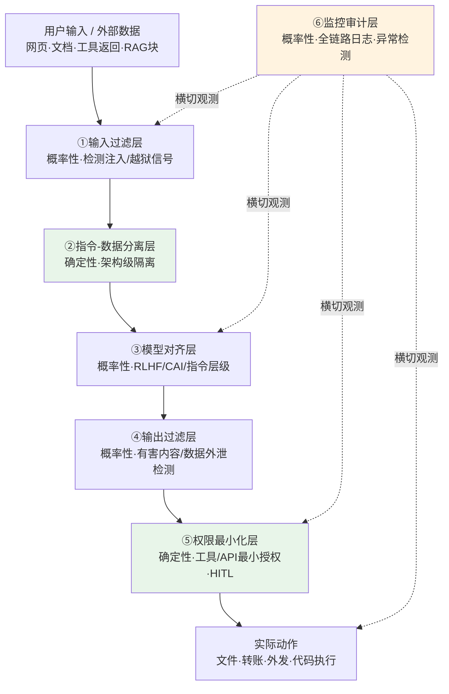

一个 LLM 产品的安全，不是"挑一种最强的防御装上去"，而是"把六层强弱不同、失效模式不同的控制叠成一个**爆炸半径可控**的栈"——问题是：这六层之间存在致命耦合，叠错了不是 1+1>2，而是层间的孔洞对齐成一条直通的隧道。本节点用**纵深防御（Defense in Depth）+ 瑞士奶酪模型**做框架，回答"安全栈由哪几层组成、每层能力与局限在哪、以及哪些层间耦合会让整栈塌陷"。

> [!warning] 防御导向声明
> 本节点是**防御方视角**的架构剖面：讲攻击机理是为了设计权限边界、检测与缓解。文中所有"绕过率/ASR"均引自公开基准与漏洞披露报告，用于论证防御的能力边界，**不提供可照搬的攻击 payload 或绕过串**。

## §0 为什么是"可替换六层栈"而不是"加个内容过滤"

先挡掉读者脑中两个默认错误框架。

**错误框架一："加个内容过滤就安全了"。** 这是本专题反复点名的系统性滑变：把 security（防攻击）误当成一道可加装的 feature。Palo Alto Unit42 在 2025-06-02 的实测中（《Comparing LLM Guardrails Across GenAI Platforms》），三个主流 GenAI 平台的输入护栏拦截率分别只有 53%、91%、92%——意味着**单层输入过滤的绕过率在 8%–47% 之间**，且拦截率最高的平台假阳性率高达 13.1%（来源：Unit42 Palo Alto，2025，WebFetch 核实）。一道概率性过滤器永远有假阴性，"加上它"只是抬高攻击成本，不是关闭攻击面。

**错误框架二："分层 = 串联多个过滤器"。** 把纵深防御理解成"输入过滤 + 输出过滤 + 再加个分类器"，是把六层全押在**同一种控制类型**（概率性检测）上。这正是瑞士奶酪模型警告的"孔洞对齐"：多片奶酪如果孔洞位置相同，叠起来仍是一个通孔。STACK 攻击（McKenzie et al., arXiv:2506.24068，2025/2026）正是冲着"防御流水线本身"设计的——在黑盒条件下对含 few-shot 分类器的组合防御流水线达到 **71% 成功率**，零访问迁移攻击仍有 33%（来源：arXiv:2506.24068，WebFetch 核实）。它的核心发现刺眼：此前对单层测出 ASR=0% 的攻击，在对抗组合流水线时重新有效——因为每层看到的上下文不完整，攻击可分阶段逐层穿过语义间隙。

正确框架：**六层不是同质过滤器的串联，而是「概率性控制」与「确定性控制」两类异质防御的交织**。

| 控制类型 | 本栈中的层 | 失效特性 |
|---|---|---|
| 概率性控制 | ①输入过滤 ③模型对齐 ④输出过滤 ⑥监控审计 | 有假阴性、有对抗盲点，只能降低概率 |
| 确定性控制 | ②指令-数据分离（架构级）⑤权限最小化 | 提供与模型行为无关的硬边界 |

把这张表记牢：**确定性控制是栈的承重墙，概率性控制是补强；如果一个产品的全部安全押在概率性层上，它没有真正的下限。** OWASP LLM Top 10 2025 对 prompt injection 的官方表述就是——可能不存在万无一失的预防方案，策略重心须从"完全阻断"转向"降低爆炸半径（blast radius reduction）"（来源：OWASP LLM01:2025）。

## §1 六层全景：能力 - 局限 - PM 清单

下图是本节点的主结构。请注意箭头不仅是数据流，更是**信任边界**：每跨一层，数据可信度的假设必须被重新声明。

下面逐层给出**机理 → 能力 → 局限（带数字）→ PM 清单**。绿色（②⑤）是确定性承重墙，必须先建。

### ①输入过滤层（概率性）
- **机理**：在提示进入模型前，用规则/分类器检测注入标志、越狱模式、敏感关键词、编码混淆。
- **能力**：覆盖已知攻击类别，可黑盒部署，不依赖基础模型。代表：Llama Guard、ShieldGemma、WildGuard。
- **局限（带数字）**：绕过率 8%–47%（Unit42 2025）；角色扮演/虚构场景逃逸——某平台未检测的 51 个恶意提示中 42 个来自虚构场景包装；编码混淆（Base64、小语种、Braille）可绕过分类器；多轮累积绕过单轮检测。EchoLeak（CVE-2025-32711，Microsoft 评 CVSS 9.3 Critical，NIST 评 7.5 High——评分本身有分歧，反映"系统作用域/完整性影响"判定不一）专门绕过了 Microsoft 的 XPIA 注入过滤层（来源：CVE-2025-32711 NVD 条目，WebFetch 核实；arXiv:2509.10540）。
- **PM 清单**：① 它是"攻击成本提升器"，不是"攻击阻断器"——验收指标用"绕过率"而非"拦截率"；② 假阳性率必须列入产品 KPI（13.1% 的误拦会摧毁可用性）；③ 永远不要把它当作唯一防线对外宣称"已安全"。

### ②指令-数据分离层（确定性，架构级）
- **机理**：LLM 在架构上无法原生区分"可信指令"与"待处理数据"——二者都是同等优先级的 token。本层用结构化格式（StruQ）、指令层级（OpenAI Wallace et al., arXiv:2404.13208）、或 embedding 层正交旋转（ASIDE, arXiv:2503.10566, ICLR 2026）强制建立"被动数据 vs 主动指令"的表征分离。
- **能力**：指令层级已部署于 GPT-4o、Gemini 2.5 Flash，冲突时优先高权限指令；ASIDE 零额外参数提升鲁棒性不降基线；架构级权限分离（OpenClaw, arXiv:2603.13424）在 RAG 场景可大幅阻断注入。
- **局限**：纯训练实现无法完全解决——AgentDojo 显示攻击者可让注入内容"看起来像系统指令"部分绕过指令层级；ASIDE 最优效果依赖专项安全训练，对多跳注入未充分验证。ICLR 2025《Can LLMs Separate Instructions from Data?》确认：即便内容对人类不可见也会影响处理，缺乏原则性分离（来源：ICLR 2025 proceedings）。
- **PM 清单**：① 任何进入上下文的外部数据必须打来源标签 `[来源：不可信外部/工具返回]`；② 这是必要但非充分条件——别因为部署了指令层级就撤掉权限层；③ 选型时区分"训练级分离"（可迁移性差）与"架构级分离"（部署成本高但下限硬）。

### ③模型对齐层（概率性）
- **机理**：通过 RLHF、Constitutional AI（[Constitutional AI](/kb/基础知识库/constitutional-ai/)）等让模型内化安全策略，在生成时倾向拒绝有害请求。
- **能力**：Anthropic Constitutional Classifiers（arXiv:2501.18837，2025）报告无分类器基线越狱成功率 86%，部署分类器后大幅下降（论文给出 4.4%，对应拦截 >95%）；3000+ 小时人工红队中无人找到通用越狱（这两点已 WebSearch 核实，4.4% 与 +23.7% 开销引自论文正文〔以论文数值为准〕）。Unit42 数据中模型对齐在 109/123 个越狱提示上成功阻断。
- **局限**：对齐不是安全机制，只是降低概率；高级对抗攻击可绕过 RLHF；先进自动化攻击在开源模型 ASR 90–99%，黑盒商业模型 80–94%（TechRxiv 2026 综述）。更尖锐的是 AgentDojo 的"inverse scaling"：**更强的模型更易被注入攻击**（GPT-4o ASR 47.7%–57.7% vs Claude 3.5 Sonnet 33.9%），能力与服从性是双刃剑。
- **PM 清单**：① 对齐质量决定"日常有害输出"的下限，但不决定"对抗攻击"的下限；② 不要把模型升级（更强模型）等同于更安全；③ 对齐的"拒绝率"与产品的"有用性"是直接权衡（对齐税，见 §3 争议）。

### ④输出过滤层（概率性）
- **机理**：在响应发给用户/下游系统前，检测有害内容、PII 泄露、可执行注入（防 XSS）。
- **能力**：拦截已生成的有害内容，是 ③ 的兜底；对"数据外泄"类攻击是关键关卡。
- **局限**：Unit42 实测输出过滤有效率仅约 0%–1.6%（即大部分有害输出没被输出层拦住，靠的是对齐层在前面挡）；与 ③ 高度功能重叠却各有盲区；对编码外泄（把敏感数据编码进出站链接）检测困难——EchoLeak 正是把内部文件编码进出站链接绕过链接脱敏。
- **PM 清单**：① 输出过滤对"内容有害"有用，对"数据外泄"几乎无用——后者必须靠 ⑤ 权限层 + 出站流量监控；② OWASP LLM05（Improper Output Handling）要求上下文感知编码、参数化查询，把 LLM 输出当不可信输入对待；③ 别让 ④ 与 ③ 重复建设却以为覆盖更全（见 §2 耦合 B）。

### ⑤权限最小化层（确定性，承重墙）
- **机理**：零信任原则映射到 Agent——每个 Agent/工具只获得完成当前任务所需的最小权限，权限空间单调收缩，扩权需人工批准。对应 OWASP LLM06（Excessive Agency）。
- **能力（带数字）**：这是单层效果最显著的防御。AgentDojo 工具过滤器把 GPT-4o 攻击成功率从 57.7% 降至 6.8%，保持效用 73.1%。Progent（arXiv:2504.11703）用 SMT solver 确定性验证工具调用策略，间接注入 ASR 从 41.2% 降至 2.2%，自主 Agent 安全基准从 70.3% 降至 7.3%（来源：arXiv:2504.11703，WebFetch 核实）。
- **局限**：对"攻防工具重叠"场景无效（"读邮件"既是任务需求又是攻击路径时，过滤器失灵）；策略生成本身可能被注入（bootstrap 问题）；权限粒度越细，系统复杂度越高。HITL（人在回路）作为权限层的硬闸，受"审批疲劳"困扰——高频低风险审批会降低人对真实高风险事件的判断力。
- **PM 清单**：① **这是注入后果的总开关**——注入能否造成实际损害，取决于被注入的 Agent 手里有没有高危工具；② 处理外部数据的子 Agent 绝不授予高危工具权限（职责分离）；③ HITL 断点用"操作可逆性 × 错误后果 × 置信度"三维判断（同构 [m207 - Agent 产品化：场景推演与失败模式](/kb/工程化与落地架构/m207-agent-产品化-场景推演与失败模式/) 的断点设计），上线初期全设、通过率 >95% 后逐步取消。

### ⑥监控审计层（概率性，横切）
- **机理**：全链路日志、异常查询模式检测、出站流量监控、攻击溯源。"假设已被攻破（assume breach）"，目标是缩短发现-响应时间。
- **能力**：检测模型提取（高频系统性探测）、数据外泄（异常出站流量）、提供审计溯源；是发现"沉默权限升级"的唯一手段。
- **局限**：合法高频用户的误报；检测到时损害可能已发生（事后性）；纯 API 部署无法访问模型内部信号（AgentSentry/ICON 等白盒推理时检测不适用）。
- **PM 清单**：① 出站数据流量监控是 EchoLeak 类零点击外泄的最后防线；② 监控是横切层，必须覆盖 ①③⑤ 与实际动作节点；③ 日志即合规资产（NIST AI RMF 的 Manage 功能、EU AI Act 的记录义务都依赖它）。

## §2 判断主轴——三个层间致命耦合（90% 的人会在这里搞错）

这是本节点的命门：**单看每层都"装了"，但层与层之间的耦合会让整栈出现直通隧道。** 跨域呼应在此处接入瑞士奶酪模型（详见 §3 与 失败考古学专题 的攻防机理层）：纵深防御之所以可能失败，不是因为某层不存在，而是因为多层的孔洞对齐成线。每个耦合给出**症状 → 为什么会错 → 正确做法 → 真实反例**四件套。

### 耦合 A：权限层缺失会放大注入后果——⑤ 是 ① 的"损害上限"，不是冗余
- **症状**：团队把全部预算砸在输入过滤（①）和对齐（③）上，认为"挡住注入就行"，权限层（⑤）形同虚设——Agent 默认拥有读写文件、发邮件、改权限的全套工具。
- **为什么会错**：① 和 ③ 都是概率性的，必有假阴性（绕过率 8%–47%）。一旦一条注入穿过，**实际损害 = 注入内容 × 被注入 Agent 的权限**。权限层缺失时，这个乘积没有上限：一次成功注入就能删库、转账、外泄。这正是瑞士奶酪——①③ 的孔洞对齐后，如果 ⑤ 这片奶酪根本不存在（不是有孔，是缺片），通道直达灾难。
- **正确做法**：把 ⑤ 当承重墙先建。数学上：即使 ①③ 绕过率高达 40%，只要 ⑤ 把被注入 Agent 的可达高危动作清零，爆炸半径就被钳制。AgentDojo 数据印证——工具过滤器单层就把 ASR 从 57.7% 压到 6.8%，远超任何单一概率层的边际贡献。
- **真实反例**：ChatGPT 插件"Chat with Code"（2023）——网页注入载荷操控插件把 GitHub 私有仓库改为公开，**无需用户确认**。①③ 是否拦住都不重要，因为插件被授予了"改仓库可见性"的权限且无 HITL（⑤ 缺失）。Slack AI 私有频道泄露（2024-08，PromptArmor 披露）同理：注入成功的根因是"AI 检索范围未与用户权限严格绑定"——⑤ 的最小权限原则缺位。

### 耦合 B：输出过滤与对齐既重复又矛盾——④ 和 ③ 押同一种盲点
- **症状**：产品同时上线输出过滤（④）和对齐（③），团队以为"双保险，覆盖更全"，安心了。
- **为什么会错**：两层都是概率性控制，且常常**共享同一套有害性判定逻辑**（甚至同一个 guard model）。瑞士奶酪的孔洞高度相关——能骗过 ③ 的对抗样本，往往也骗得过 ④（因为它们对"什么是有害"的表征相似）。STACK 攻击证明：组合两个相似的概率层，攻击者可分阶段绕过，ASR 不降反而在某些设置下回升到 71%。更矛盾的是：当 ③ 已经很强（如 Constitutional Classifiers 拦 95%），④ 的边际有效率趋近 0%（Unit42 实测输出层有效率约 0%–1.6%），却仍在消耗延迟与算力——**重复建设的同时制造性能损耗与虚假安全感**。
- **正确做法**：让 ④ 与 ③ **押不同的失效模式**。④ 不该重复"内容有害性判定"，而该专攻 ③ 管不到的领域——**结构化输出验证（防注入下游系统）、出站数据外泄检测（编码/链接外泄）、PII 模式匹配**。即 ④ 与 ③ 之间应是"正交补盲"而非"同类叠加"。
- **真实反例**：EchoLeak（CVE-2025-32711）——M365 Copilot 的对齐 + XPIA 过滤 + 链接脱敏三层都在，但攻击把敏感内容编码进指向攻击者服务器的出站链接，利用 CSP 白名单中的微软自有域完成外泄。内容层面"无害"，所有"内容有害性"导向的层（含 ④）全部失明——这正是 ④ 没有专攻"数据外泄"这一独立失效模式的代价。

### 耦合 C：单层依赖 = 瑞士奶酪退化为单片——指令-数据分离（②）不能独扛
- **症状**：团队读了 ASIDE/StruQ/指令层级的论文，认为"架构级分离才是根治 prompt injection 的银弹"，于是只建 ②，松懈了 ①④⑤。
- **为什么会错**：纵深防御的全部价值在于"多片孔洞不相关的奶酪"。把希望全押在任何**一层**（哪怕是确定性的 ②），瑞士奶酪就退化成单片——这片再厚，它自己的孔洞（②对多跳注入、语义等价变形的盲区）就是整栈的通孔。指令层级被 AgentDojo 证明可被"伪装成系统指令"部分绕过；ASIDE 对 multi-hop injection 未验证。单层依赖违背了纵深防御的第一性原理。
- **正确做法**：② 是承重墙之一，但承重墙也需要其他层补强。栈的鲁棒性来自**异质性**——②（确定性架构隔离）+ ⑤（确定性权限钳制）+ ①③④（概率性补强）+ ⑥（横切观测），孔洞分布在不同维度上，攻击者要同时穿过四种不同失效模式的层，成本指数上升。
- **真实反例**：STACK 攻击的迁移性结论（零访问 33% 成功）说明"防御靠不透明 / 靠单一强层"行不通；MCP Tool Poisoning（CVE-2025-54136）则展示了一个 ② 完全管不到的新孔洞——攻击在**工具发现/注册阶段**（boot time）注入，把恶意指令藏进工具描述，绕过所有运行时的指令-数据分离（来源：arXiv:2603.22489 / TrueFoundry 分析）。单靠 ② 时，这个 boot-time 孔洞就是直通隧道；只有叠加 ⑤（工具来源验证 + 描述形状校验 + RBAC）才能补上。

> [!note] 跨域呼应：瑞士奶酪模型（James Reason）与"系统性事故"
> 詹姆斯·里森（James Reason）的瑞士奶酪模型最初用于航空/医疗的系统性事故分析：每道防线都有孔洞（latent failures），事故发生于"孔洞瞬间对齐成一条贯穿轨迹"。把它移植到 LLM 安全栈，得到一个反直觉但严格的判断：**安全的高低不取决于最强那层有多强，而取决于各层孔洞的"相关性"**——孔洞越不相关（异质控制），整栈越安全。这正是为什么"叠两个相似的内容过滤器"（耦合 B）几乎无用，而"确定性权限层 + 概率性检测层"（异质叠加）才是真正的纵深。里森还区分了"主动失误（active failures，操作端）"与"潜在失效（latent conditions，设计端）"——本节点的三个耦合全部属于**设计端潜在失效**：它们在没被攻击时完全隐形，正是 PM 在架构阶段必须排查、而非交给安全团队后置审核的原因。详见 失败考古学专题（攻防是其机理层）。

## §3 产品 PM 视角补盲

跳出"工程 PM"视角，补三个容易看走眼的非技术耦合。

1. **用户心理模型：安全感 ≠ 安全。** 用户（和高管）看到"有内容过滤"就产生安全感，这种安全感本身是攻击面——它降低了对 ⑤⑥ 投入的意愿。Rick 在滴滴安全产品中处理的正是同构问题：**明镜系统** 与 **安全感知与干预** 的核心不是"挂个安全标识让乘客安心"，而是真实降低伤害发生概率与后果。把"安全感运营"误当"安全治理"，是 C 端安全产品的经典滑变，在 LLM 产品里换皮重演。

2. **商业模式耦合：对齐税与转化率。** ③ 对齐越强，过度拒绝越多，付费转化越低（"对齐税"争议，The Jailbreak Tax, OpenReview 2025，尚无定论）。但若为转化率削弱 ③，又把压力推给 ⑤——而 ⑤ 的 HITL 会增加延迟、伤害 Agent 自动化卖点。这是一个三方权衡（安全/可用/自动化），PM 必须显式定价，不能甩给安全团队。

3. **合规边界：栈的设计要倒推自治理框架。** EU AI Act 对系统性风险 GPAI（训练算力 ≥10^25 FLOPs）强制要求部署前对抗性测试（红队）并记录；NIST AI RMF 的 Manage 功能与 MITRE ATLAS 的缓解映射都假设 ⑥ 监控审计层存在且可溯源。**合规不是事后审核，而是从一开始就规定了栈必须包含哪些层**——这与本专题"安全是第一性架构约束"的立场一致，详见 AI 作为制度现象专题（安全规范制定）。

## §4 对手框架回应（接受 + 边界）

- **对手立场一：Simon Willison —"prompt injection 目前无可靠解，与其堆防御不如限制 LLM 的能力面"。** 接受：他对"没有银弹"的判断完全正确，本节点 §0 也引 OWASP 承认可能不存在万无一失方案。边界：他的"限制能力面"恰恰就是本栈的 ⑤ 权限最小化——这不是放弃防御，而是把赌注押在确定性控制上。我们的分歧只在措辞：他说"别指望防住注入"，我说"防不住注入，所以要钳死注入的后果"，两者是同一枚硬币。

- **对手立场二:架构派（StruQ/ASIDE/指令层级作者）—"根治之道在架构级指令-数据分离"。** 接受：② 确实是承重墙，纯概率层永远不够。边界：耦合 C 已论证——任何单层(含 ②)独扛都使瑞士奶酪退化为单片；且 MCP Tool Poisoning 的 boot-time 孔洞证明 ② 有运行时管不到的盲区。架构级分离是必要条件，不是充分条件。

- **对手立场三（Rick 未读的对手框架）：Williams-King, Bengio et al.（NeurIPS 2024 Workshop, arXiv:2501.11183）—"当前安全微调是打补丁式军备竞赛，不是原则性设计，应从网络安全史吸取教训。"** 接受：他们对 ③ 的批评精准——RLHF 式对齐确实在跟对抗样本军备竞赛。这个框架逼问本节点的盲点：我把六层当"可工程化的栈"，但若整个范式是军备竞赛，那"叠层"本身可能只是把竞赛分摊到更多战线。边界：我的回应是——**正因为是军备竞赛，才更要押确定性控制（②⑤）**，因为确定性边界不参与军备竞赛（权限钳制与模型能否被越狱无关）。这恰恰是从网络安全史学到的：最可靠的不是更好的入侵检测，而是最小权限 + 沙箱隔离。

> [!note] failure scenario 显式标注
> 本节点的核心结论"建好确定性承重墙（②⑤）即可钳制爆炸半径"在以下场景失效：① **攻防工具完全重叠**时（如纯邮件助手，"读+发邮件"既是任务也是攻击路径），⑤ 无法区分合法与恶意调用，权限钳制退化；② **Multi-Agent 横向传播**——被注入的 subagent 在同权限层级伪造合法输出向上污染 orchestrator，OpenClaw 论文明言当前架构无法防御（arXiv:2603.13424）；③ **boot-time 注入**（MCP Tool Poisoning）绕开所有运行时层。这三种场景下，本节点的六层框架需要追加"信任边界重验"机制，单纯叠层不够。

> [!note] confirmation-bias 砍除
> 本节点早期反复引 AgentDojo 工具过滤器（57.7%→6.8%）作为"⑤ 权限层最有效"的正面案例——这是 bias。补入反例：AgentDojo 自身被 arXiv:2510.05244 实证有系统性测量偏差（注入向量覆盖任务关键信息致任务无论防御与否均失败，修正后效用提升 >18%），ASB 强制注入攻击工具使 ASR 虚高约 8 倍。**多个被报告的"0% ASR / 单层巨幅下降"可能反映基准缺陷而非真实防御能力**——所有量化对比都应带这个折扣读。

## §5 PM 决策启示

- **面试怎么用**：被问"你怎么保证 LLM 产品安全"，30 秒答法——"不是加内容过滤，是建六层栈，先建确定性承重墙（指令-数据分离 + 权限最小化），再用概率层补强；关键看三个层间耦合：权限层缺失会放大注入后果、输出过滤与对齐别押同一盲点、任何单层独扛都退化成单片奶酪。" 这是判断密度，不是术语堆砌。
- **选型怎么用**：评估安全方案/Guard 产品时，先问它属于"概率性补强"还是"确定性边界"。一个只卖输入/输出过滤的供应商，无论拦截率宣称多高，都没碰你的爆炸半径。把预算优先级排成 ⑤②>①③④，⑥ 横切兜底。
- **复现怎么用**：评测用公开基准（HarmBench arXiv:2402.04249 / AgentDojo arXiv:2406.13352）做防御方视角的能力边界测量，但读数时套用 §4 的基准缺陷折扣；HITL 断点设计直接复用 [m207 - Agent 产品化：场景推演与失败模式](/kb/工程化与落地架构/m207-agent-产品化-场景推演与失败模式/) 的"可逆性 × 后果 × 置信度"三维表。

## §6 与已有节点的关系（升级对照，不复述）

- 对照 **[m207 - Agent 产品化：场景推演与失败模式](/kb/工程化与落地架构/m207-agent-产品化-场景推演与失败模式/)**：m207 从"产品可用性"角度讲 Agent 六类失败模式与 HITL 断点；本节点做**纠偏 + 深化**——把同一个 HITL 断点重新定位为"安全栈第⑤层的确定性硬闸"，并指出 m207 的"安全越界"失败模式，机理上正是本节点耦合 A（权限层缺失放大注入后果）。m207 问"自主性边界在哪"，本节点问"边界被对抗性攻破时后果上限在哪"。
- 对照 **[Constitutional AI](/kb/基础知识库/constitutional-ai/)**：CAI 是本栈第③层的具体实现；本节点做**对话**——CAI 的"过度拒绝"争议正是 §3 商业模式补盲里的"对齐税"，而 CAI 的高拦截率（86%→4.4%）也不能替代 ⑤，因为它仍是概率层（耦合 C）。
- 对照本专题 **0411 Agent 系统化专题** 的 `[S01 Agent 六层架构剖面](/kb/专题-安全对齐与失败/s01-agent-六层架构剖面/)`：那是"能力架构"的六层（感知/规划/工具/记忆/执行/编排）；本节点是"防御架构"的六层。两者**正交**——0411 的每一层都是本节点要保护的攻击面，尤其其工具调用层（[Function Calling](/kb/基础知识库/function-calling/) / [Agent](/kb/基础知识库/agent/)）即本专题反复强调的"工具调用即攻击面"。
- 对照跨专题 **0436 Agent 权限节点**（0436 待补完入库，暂作普通文本）、**AI 作为制度现象专题**：本节点的 ⑤ 权限层是 0436 的架构落点，⑥ 审计层与合规倒推是 0430（安全规范制定）的产品落点。
- 对照 **失败考古学专题**：本节点的三个层间耦合是"潜在失效"的活体样本，攻防是其机理层。

## §7 关联节点

**核心（必读）**
- [m207 - Agent 产品化：场景推演与失败模式](/kb/工程化与落地架构/m207-agent-产品化-场景推演与失败模式/)
- [Constitutional AI](/kb/基础知识库/constitutional-ai/)
- [RLHF](/kb/基础知识库/rlhf/)
- [Agent](/kb/基础知识库/agent/)
- [Function Calling](/kb/基础知识库/function-calling/)
- [Anthropic](/kb/ai-公司与产品/anthropic/)
- 本专题 `S02`（流派架构对照）、`S03`（工程全景）
- 本专题 `A0x`（safety/security/alignment 概念辨析节点）
- 本专题 `E0x`（EchoLeak / Slack AI / MCP Tool Poisoning 实例剖解节点）

**延伸（可选）**
- [幻觉](/kb/基础知识库/幻觉/) / [c13 - 幻觉的不可消除性](/kb/基础知识库/c13-幻觉的不可消除性/)（OWASP LLM09 Misinformation 与对齐层的交叉）
- [AI PM 知识图谱·总索引](/kb/ai-pm-知识图谱/ai-pm-知识图谱-总索引/)
- 0117社会学（安全感运营 vs 安全治理的社会建构）
- 明镜系统 / 安全感知与干预 / 降发生方法论（Rick 滴滴安全方法论与红队对抗治理的同构）
- 本专题 `R0x` 复现指南（HarmBench / AgentDojo 防御方评测）

## 修订日志
- 2026-06-07 R0 首稿：建立"概率性/确定性"二分框架、六层能力-局限-PM清单、三个层间致命耦合（四件套）、瑞士奶酪跨域呼应、三类对手立场回应 + failure/bias 清单。
- 2026-06-07 R0.1 grounding pass：WebFetch/WebSearch 核实 arXiv:2504.11703（Progent: Securing AI Agents with Privilege Control，确证最小权限+确定性策略）、arXiv:2506.24068（STACK，确证 71% ASR / 33% 迁移）、arXiv:2501.18837（Constitutional Classifiers，确证 86% 基线 + 3000h 红队无通用越狱）、CVE-2025-32711（确证 EchoLeak，**修正 CVSS：Microsoft 9.3 vs NIST 7.5 有分歧**）。仍依赖原始简报 WebFetch 的待复核 arXiv ID：2503.10566 / 2603.22489 / 2406.13352 / 2402.04249 / 2404.13208 / 2509.10540 / 2501.11183 / 2510.05244 与 CVE-2025-54136。
- 2026-06-11 P3.4 校链：0416 失败考古、0430 AI 作为制度现象专题经主库 `find` 实证已落盘，§3/§6 原 `〔待建链接〕` 降级文本恢复为真 `NNNN 总览` 链；0436 仍在 staging（待补完入库），暂作普通文本。
