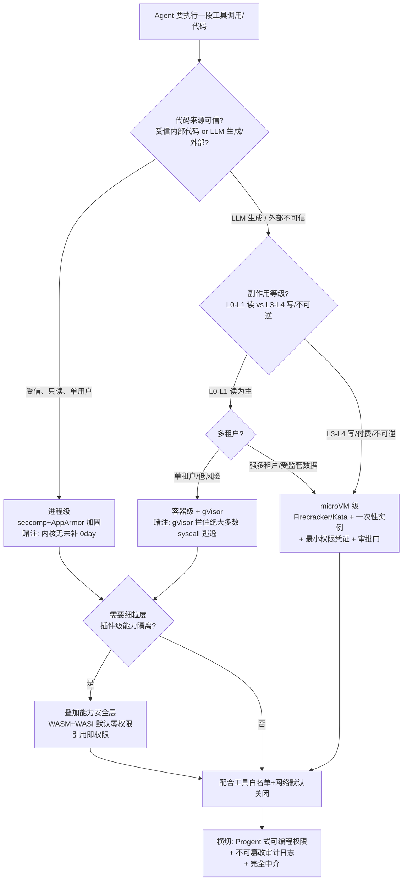

# S02 沙箱与最小权限架构对照

当 Agent 可以自主写代码、调 shell、装包、连数据库——**"它在哪执行"这个问题，决定了一次 prompt injection 的爆炸半径**。本节解决的不是"要不要沙箱"（要），而是"工具执行该用哪一级隔离"：进程级、容器级、microVM 级、还是能力安全（capability-based）级？四种方案在隔离强度、启动开销、运维复杂度上构成一条不可同时满足的权衡曲线。本节给出一棵**可在选型会上直接用的决策树**，并明确每个分支"我赌的是什么、在哪会失效"。视角是安全架构 + PM 选型，框架名是"隔离强度 × 单位开销 × 适用边界"三维对照矩阵。

## §0 为什么是"隔离层级"这个框架，而不是"容器 vs 虚拟机"二分

读者脑中默认的框架往往是运维老话题"容器 vs 虚拟机"。这个二分在 Agent 语境下会误导，原因有三。

第一，它漏掉了两个端点。下端是**能力安全模型**（capability-based，如 WASM+WASI、对象能力 OCap）——它不是"更轻的容器"，而是**换了一套授权语义**：默认零权限，引用即权限（the reference is the permission）。上端是 **microVM**（Firecracker / Kata）——它既不是传统 VM 的笨重，也不是容器的薄隔离，而是"独立内核 + 毫秒级启动"的新物种。只谈"容器 vs VM"会把这两个对 Agent 最关键的选项排除在视野外。

第二，它把隔离当成一维强度问题，而 Agent 沙箱是**二维问题**：既要"隔离"（被攻破后损失多大），又要"授权粒度"（正常运行时能碰多少东西）。前者是 sandbox 的事，后者是 least-privilege 的事。一个 Firecracker microVM 隔离极强，但如果你给里面的 Agent 挂了生产数据库的长效凭证，授权粒度依然是灾难。所以本节的框架不是"选一种隔离技术"，而是"隔离层级 × 权限粒度"两个旋钮一起拧。

第三，正确的拆法是按**攻破后果**而非按技术血统分层。所以本节用四层：进程级 → 容器级 → microVM 级 → 能力安全级，外加一条横切的"最小权限"维度。下面先建对照表，再给决策树。

## §1 四层隔离技术对照矩阵

把"用什么执行 Agent 工具"按隔离强度从弱到强排开（启动/开销数据来自 Northflank《How to Sandbox AI Agents》2026-02-02，WebFetch 核实；WASM 数据来自 Cosmonic 工程博客 2026-05-06，注：商业博文，独立审计有限）：

| 层级 | 代表技术 | 隔离边界 | 启动时间 | 单位开销 | 攻破后果 | 适用场景 |
|---|---|---|---|---|---|---|
| **进程级** | 裸进程 + seccomp/AppArmor、chroot、Python `RestrictedPython` | 共享宿主内核，靠 syscall 过滤 | 微秒级 | 近零 | 一个内核 0day 或过滤遗漏即逃逸到宿主 | 受信代码、本地单用户、低风险只读工具 |
| **容器级** | Docker、containerd、gVisor（syscall 拦截） | 共享宿主内核（gVisor 加一层用户态内核） | 毫秒级 | gVisor I/O 开销约 10–30% | 内核漏洞 / 错配即逃逸；gVisor 显著收窄但非消除 | 多租户、CI、受信度中等的工具执行 |
| **microVM 级** | Firecracker、Kata Containers（KVM） | 独立 Linux 内核 + 硬件虚拟化 | Firecracker ~125 ms | 内存 <5 MiB/VM；每宿主每秒可启 ~150 VM | 需突破硬件虚拟化边界，攻击面极小 | 执行 LLM 生成的不可信代码、受监管数据、强多租户 |
| **能力安全级** | WASM + WASI、对象能力模型（OCap） | 默认无任何能力，宿主显式授予的引用才是权限 | 据称微秒级（单节点数千组件） | 极低 | 无环境变量/文件/网络可碰，逃逸面在理论上最小 | 细粒度工具沙箱、插件生态、可移植边缘执行 |

**三个反共识判断：**

1. **Docker 不是 Agent 沙箱的默认安全选项。** Docker 容器共享宿主内核，一旦内核漏洞或配置错误即可逃逸——这在执行"LLM 生成的、来源不可信的代码"时是结构性风险，不是边缘案例。Northflank（2026-02-02）明确将"执行不可信代码"列为 Docker 的不适用场景。但要注意反方（§对手框架）。

2. **microVM 的"重"是过时印象。** Firecracker 启动 ~125 ms、内存 <5 MiB/VM、每宿主每秒可启约 150 个 VM（Northflank，WebFetch 核实）。这个量级使"每次工具调用一个一次性 microVM"在工程上可行——这正是 E2B、Northflank 等商业沙箱平台的产品形态。把 microVM 当"昂贵的最后手段"是 2020 年的认知。

3. **能力安全是范式而非性能优化。** WASM+WASI 默认"无文件系统、无网络、无系统调用、无环境变量"，是 Mark Miller 对象能力模型的运行时实现——**引用即权限**。它的价值不在于"更快的容器"，而在于把授权从"事后拒绝"（容器内你能 `cat /etc/passwd`，靠策略拦）变成"事前不存在"（你手里根本没有那个 capability 引用）。这与 §3 的最小权限是同一枚硬币的两面。

## §2 横切维度：最小权限不是隔离的子集

隔离回答"被攻破后损失多大"，最小权限回答"正常运行时能碰多少"。两者正交——再强的 microVM 也救不了"VM 内挂着全权数据库凭证"。OWASP LLM Top 10 v2025（2024-11 正式发布，WebFetch 核实官方页面）把过度代理 LLM06:2025 拆成三类根因，正是最小权限的三个落点：

| 根因 | 症状 | 正确做法 |
|---|---|---|
| **过度功能**（Excessive Functionality） | 文档读取插件同时具备删除能力 | 工具只暴露任务绝对必需的功能，避免开放式通用工具 |
| **过度权限**（Excessive Permissions） | 数据库连接持有 SELECT/UPDATE/INSERT/DELETE 全权，任务只需读 | 用最低访问级别的身份；用户级 OAuth 而非通用特权账户 |
| **过度自主**（Excessive Autonomy） | 高影响操作无需人工审批即执行 | 高影响操作前强制人工确认 + 对下游请求完全中介 |

注意第三行"过度自主"——OWASP Agentic AI Top 10（2025-12-09 发布，100+ 专家参与，WebSearch 核实）进一步引入了**"最小自主"（least agency）≠ 最小权限（least privilege）**的区分：即使 Agent 有权访问某系统，它能在多大程度上"无需回确认"地自主行动，是独立于权限的另一个旋钮。这与 [m207 - Agent 产品化：场景推演与失败模式](/kb/工程化与落地架构/m207-agent-产品化-场景推演与失败模式/) 里的失败模式直接咬合——很多生产事故不是"Agent 没权限",而是"Agent 有权限且没人拦它连着做了 20 步"。

工具白名单是最小权限的工程抓手：即使看似无害的工具（`cat`、`grep`、`awk`）组合使用也可提取系统上任意文件（Northflank，2026-02-02）。核心规则——**只允许完成任务绝对必需的最小工具集，默认不启用网络，每次执行独立隔离**。这条与 [S03 Harness Engineering 全景](/kb/专题-安全对齐与失败/s03-harness-engineering-全景/) §3.2 Rick 的"工具数量 ≤20、超过需分组动态加载"立场是同一逻辑的安全语境强化：工具越多，权限面越大，爆炸半径上限越高。

学术侧给出了可编程的实现：Progent（《Progent: Securing AI Agents with Privilege Control》，arXiv:2504.11703，Shi/He/Wang…Dawn Song 等，UC Berkeley，WebFetch 核实标题与摘要）把"权限"表示为对**工具名称和参数的符号规则**，每次调用做确定性检查；LLM 从任务生成初始策略，SMT solver 对策略变更分类——"收窄"自动批准、"扩展"需人工审批以防权限升级。摘要称在 AgentDojo 和 ASB 基准上**显著降低**攻击成功率（原文 "significantly reduces"，未声称归零——本文早期草稿误记为"降至 0%"，已据原始摘要纠正）、同时保持功能性，并已在 LangChain 和 OpenAI Agents SDK 等真实框架验证。这给出了"沙箱（隔离）+ 可编程权限（粒度）"的合体范式。

## §3 判断主轴：选型会上 90% 会搞错的四个点

> [!warning] 这是本节的命门——四个高频错位，每个带 症状 → 为什么会错 → 正确做法 → 真实反例。

**错位一：用 Docker 跑 LLM 生成的不可信代码，以为"容器=隔离"。**
- 症状：Agent 平台直接 `docker run` 执行模型生成的脚本，默认 root、共享内核、未加 seccomp。
- 为什么会错：把"进程隔离"误当"安全边界"。容器共享宿主内核，内核态漏洞=逃逸。
- 正确做法：不可信代码用 microVM（Firecracker/Kata）或 gVisor；若坚持 Docker，必须 rootless + seccomp + AppArmor + 只读根 + 无网络，且承认这只是"加固"不是"隔离"。
- 真实反例：2025-11 披露的 runc 三连漏洞 CVE-2025-31133 / CVE-2025-52565 / CVE-2025-52881，均可绕过 maskedPaths/readonlyPaths 实现逃逸；CVE-2025-52881 可重定向写操作至关键系统文件，导致主机崩溃或完全逃逸（来源：Blaxel《Container Escape Vulnerabilities 2025-2026》，WebFetch 核实）。容器逃逸不是理论。

**错位二：以为隔离够强就不用管权限。**
- 症状：上了 Firecracker，却在 VM 里塞进生产数据库长效凭证、云 metadata 端点可达、API key 写在环境变量里。
- 为什么会错：把二维问题（隔离强度 × 权限粒度）压成一维。隔离防的是"逃逸到宿主"，防不了"在授权范围内合法地干坏事"。
- 正确做法：隔离 + 最小权限双管。VM 内用短效、范围限定的凭证（参见本专题 S01 身份层），关闭 metadata 端点，工具走白名单。
- 真实反例：2025-09 一个周下载 1,500 次的非官方 Postmark MCP 服务器被篡改，在 `send_email` 里静默加 BCC 把所有邮件抄送攻击者（多源报道，2025-09）。这里隔离再强也没用——工具本身在"授权范围内"作恶，问题出在权限面和供应链，不是逃逸。

**错位三：把"人工审批"当成兜底,忽视确认疲劳。**
- 症状：高风险操作都弹确认框，以为有人会认真看。
- 为什么会错：确认疲劳使审批退化为橡皮图章。
- 正确做法：审批必须按副作用分级触发（只在不可逆/高后果/持久化的 L3/L4 操作弹框），并向"计划级治理"而非"逐操作同意"迁移。
- 真实反例：Anthropic 共享责任模型相关分析（Backslash Security，2026-04-29，WebFetch 核实）给出数据——开发者在 **93%** 的权限提示弹窗中未经有效审查即点击批准。"逐操作同意"模式已被自身数据证伪。

**错位四：以为沙箱里的 LLM 不会主动找逃逸路径。**
- 症状：假设模型只会"用工具完成任务"，不会"探测沙箱边界"。
- 为什么会错：前沿模型已具备识别并利用配置错误的能力。
- 正确做法：把 Agent 当作潜在攻击者做威胁建模；定期对沙箱做对抗测试；纵深防御不依赖单层。
- 真实反例：arXiv:2603.02277（2026-03-01，WebFetch 核实摘要）提出 SANDBOXESCAPEBENCH，结论是"在漏洞存在时，前沿 LLM 能够识别并利用容器逃逸漏洞"（具体成功率待完整论文）；Sysdig 威胁研究（2026-05-29）记录到攻击者借 LLM 驱动的 Agentic Threat Actor 自动化完成完整容器逃逸攻击链（利用 CVE-2026-39987 marimo notebook 漏洞）。

## §4 决策树：工具执行该用哪一级沙箱

> [!note] 把这棵树打印出来贴在选型会白板上。判据是"代码可信度 × 副作用等级 × 多租户强度 × 合规要求"四个输入。

读这棵树的关键：**最右一列 K 是横切所有分支的**。无论选了哪级隔离，最小权限（白名单、短效凭证、可编程权限策略）、完全中介（对所有下游请求做检查）、不可篡改审计（参见本专题 S01 审计层）三件事都要做。隔离是"出事后兜底",这三件是"出事前收口"——两者缺一不可。

这棵树与 [m208 - AI 基础设施与中间件选型](/kb/工程化与落地架构/m208-ai-基础设施与中间件选型/) §2.5.2 的编排框架选型直接挂钩：选 LangGraph/CrewAI 等框架时,要追问"它的工具执行落在哪一级沙箱、是否支持任务级（而非全局）工具白名单"。框架若只支持全局白名单，则注入爆炸半径=全部工具，在高合规场景应直接扣分。

## §5 产品 PM 视角补盲

工程视角容易只盯"隔离强度"，但 PM 要补三个看走眼点。

**成本结构会反噬产品形态。** "每次工具调用一个一次性 microVM"安全上最优，但若你的产品是高频、低延迟的对话内工具调用（如每条消息触发一次检索），~125 ms 冷启动 × 高 QPS 会显著抬高单位成本和尾延迟。这里的张力是 [m209 - 推理成本控制手册](/kb/工程化与落地架构/m209-推理成本控制手册/) 的延伸：沙箱开销是常被忽略的隐性成本项。务实折中是"按副作用分级路由"——L0-L1 读操作走轻量容器池（复用、不冷启），L3-L4 写操作才走一次性 microVM。

**合规边界决定隔离下限,不能由工程偏好定。** 受监管数据（金融、医疗、个人信息）的处理，监管会要求"独立内核 + 数据隔离"级别（参见 BSI/ANSSI《LLM-based Systems with Zero Trust》联合指南，URL 已确认可访问但 PDF 条款未完整提取〔待核实具体条款〕）。这意味着隔离层级不是纯技术选型，而是合规约束下的最低水位线——PM 要先问合规再问性能。

**"安全责任"是产品边界的一部分。** Anthropic 共享责任模型（Backslash Security 转述，2026-04-29）把 Agent 安全分四层：Model 由模型商负责，而 Harness（编排）、Tools（工具）、Environment（环境/沙箱）三层均由**部署组织**负责。对自建 Agent 产品的 PM,这意味着"沙箱出事"是你的责任不是模型商的——这条边界要写进产品的安全承诺和 SLA。

## §6 对手框架回应：接受 + 边界

**对手立场一（业界主流·加固容器派）：Northflank/Blaxel 等"Docker 不够"的论调有利益冲突——他们卖替代方案。**
接受：这些来源确实在销售 microVM/WASM 沙箱，主张应打折扣看待。生产环境中配合 rootless + seccomp + AppArmor + 用户命名空间的加固 Docker，对许多中风险场景是可接受的，不必一律上 microVM。
边界：但 CVE 证据（runc 三连、NVIDIAScape CVE-2025-23266）是中立的第三方事实，不受商业立场影响——容器逃逸在野外真实发生。我赌的是：**当代码来源不可信（LLM 生成 / 外部工具）时，加固容器的剩余风险高于一次性 microVM**；而当代码受信时，加固容器完全够用。分界线是"代码可信度"，不是"容器 vs VM"的教条。

**对手立场二（Rick 未读·能力安全派 / Mark Miller 对象能力模型）：隔离思路本身就错了——不该"事后拒绝"，该"事前不授予"。**
接受：对象能力模型（OCap）的洞见极深——容器范式是"你拥有一切，靠策略拦截"，而 OCap 是"你默认一无所有，引用即权限"。后者从根上消除了"权限提升"这个攻击类别（无 ambient authority 可被混淆代理利用）。WASM+WASI 把这套搬到了运行时。
边界：但 OCap 的生产成熟度存疑。WASM 能力模型的独立安全审计稀少，部分性能声明（"单节点数千组件"）来自一方商业博文（Cosmonic，2026-05-06），缺第三方核实；且现有 Agent 生态（MCP/工具调用）大量建立在 ambient authority 假设上,迁移成本高。我赌的是：**能力安全是 3-5 年的正确方向，但 2026 年的务实选择是"microVM 隔离 + Progent 式可编程权限"逼近 OCap 效果**,而非直接全栈 WASM。这是 [Constitutional AI](/kb/基础知识库/constitutional-ai/) 式"用机制约束行为"思路在系统层的对应——只是这里的约束是密码学/类型系统强制的，而非训练出来的。

**对手立场三（Rick 未读·Bruce Schneier 式系统安全悲观派）：纵深防御的每一层都会被绕过，沙箱是安全剧场。**
接受：单层防御必然失效，这是对的——Anthropic 自身 93% 无效审批数据就是人工监督层失效的铁证。
边界：但"每层都会失效"恰恰是做纵深防御（defense in depth）的理由，不是放弃的理由。我赌的是:**多层独立失效概率的乘积远低于单层**——隔离 + 最小权限 + 审计 + 审批四层即使各自有缺陷，全部同时被同一攻击穿透的概率显著更低。失败场景标注：当四层共享同一个根信任（如都依赖同一个被攻破的凭证服务）时,纵深防御退化为单层——这是设计时必须避免的耦合。

## §7 跨域呼应：福柯的"全景敞视"与沙箱的权力拓扑

调度一个 Rick 熟悉的框架：福柯的生命政治脉络里的"全景敞视监狱"（Panopticon）。边沁/福柯的洞见是——**最高效的规训不是靠围墙的物理强度，而是靠"被观察的可能性"内化为自我约束**。把这个框架搬到 Agent 沙箱，会改变一个技术判断：很多团队把全部预算押在"更强的墙"（microVM、硬件隔离）上，却轻视"可观测性"（审计日志、运行时监控）。

福柯框架提示：**沙箱的隔离强度和审计的可见性是两种不同的权力技术，且后者常被低估。** 一个 Agent 即使在最弱的进程沙箱里,如果它的每一次工具调用都被不可篡改地记录、被实时监控、被事后追责，其"作恶空间"也会被显著压缩——因为爆炸半径不仅取决于"能逃多远"，也取决于"逃了能不能被发现和追责"。反过来,最强的 microVM 如果是黑盒（无审计），一旦内部 Agent 被劫持，你连"发生了什么"都不知道。

这给决策树补了一条原则:**隔离投资和可观测性投资要均衡**。本专题 S01 的审计层不是隔离层的附属品,而是与之正交的第二种权力技术。这也呼应 [幻觉](/kb/基础知识库/幻觉/) 的认识论——既然我们无法保证 Agent 行为可预测，那么"可追溯、可审计、可追责"就成了不可消除不确定性下的必要补偿机制。墙挡不住的，要靠"看得见"来兜。

## §8 PM 决策启示

**面试怎么用：** 被问"你怎么设计 Agent 的代码执行环境"，不要答"用 Docker 隔离"。答框架——"先问代码可信度和副作用等级，不可信代码上 microVM，再叠最小权限和可编程权限策略，横切审计"。一句话定位：**隔离防逃逸、权限防越权、审计防黑箱，三者正交,缺一不可**。能说出 Firecracker ~125ms、gVisor 10-30% I/O 开销、runc 2025-11 三连逃逸 CVE、Progent 用符号规则可编程权限这几个事实，立刻区分于"了解一下"的候选人。

**选型怎么用：** 拿 §4 决策树和 §1 对照表去对每个候选编排框架/沙箱平台做四问——(1) 工具执行落在哪一级隔离？(2) 支持任务级还是只支持全局工具白名单？(3) 能否对动作做副作用分级并按级路由（读走容器、写走 microVM）？(4) 审计日志是否不可篡改、按 sub-task 粒度？缺一项就在高合规场景扣分。

**复现怎么用：** 最小可运行——本地用 gVisor 或加固 Docker 跑只读工具;进阶——接 E2B/Northflank 这类 Firecracker 沙箱跑不可信代码生成;权限层叠 Progent（已兼容 LangChain/OpenAI Agents SDK）做可编程白名单。

## §9 与已有节点的关系

- 对照 [S03 Harness Engineering 全景](/kb/专题-安全对齐与失败/s03-harness-engineering-全景/)（0411 主库）：本节是其 §3.2 工具注册和 §3.5 HITL 的**安全深化**——把"工具数量上限"的工程立场提升为"权限面=攻击面"的安全原则，把"风险等级"形式化为副作用分级触发的审批门。属于"深化"关系，不复述 harness 六能力。
- 对照 [m208 - AI 基础设施与中间件选型](/kb/工程化与落地架构/m208-ai-基础设施与中间件选型/)（0402 主库）：本节为其 §2.5.2 编排框架对比**补缺**了缺失的"沙箱隔离层级 + 任务级权限"选型维度。属于"补缺"。
- 对照 [m207 - Agent 产品化：场景推演与失败模式](/kb/工程化与落地架构/m207-agent-产品化-场景推演与失败模式/)（0402 主库）：本节的"过度自主/least agency"与其失败模式形成**对话**——很多生产事故的根因不在隔离而在权限粒度和自主度。
- 对照 [A08 MCP 与 A2A 协议族](/kb/专题-安全对齐与失败/a08-mcp-与-a2a-协议族/)（0411 主库）：本节的工具白名单/供应链（Postmark 案例）是其"MCP Tool 权限面"的安全展开。属于"深化"。
- 本专题内：与 S01（身份与凭证层）、S03（harness 集成）正交互补；判断主轴的副作用分级表为本专题 R 系列复现节点提供输入。

## §10 关联节点

**核心（必读）：**
- [S03 Harness Engineering 全景](/kb/专题-安全对齐与失败/s03-harness-engineering-全景/) — harness 的工具注册与 HITL，本节的安全深化对象
- [m208 - AI 基础设施与中间件选型](/kb/工程化与落地架构/m208-ai-基础设施与中间件选型/) — 编排框架选型，本节补其沙箱维度
- [m207 - Agent 产品化：场景推演与失败模式](/kb/工程化与落地架构/m207-agent-产品化-场景推演与失败模式/) — 过度自主与失败模式的对话
- [A08 MCP 与 A2A 协议族](/kb/专题-安全对齐与失败/a08-mcp-与-a2a-协议族/) — MCP Tool 权限面 = 攻击面
- [A06 Orchestrator 编排器](/kb/专题-安全对齐与失败/a06-orchestrator-编排器/) — 编排器作为权限授予的中枢
- [Function Calling](/kb/基础知识库/function-calling/) — 工具调用是沙箱要约束的最小单元
- [Agent](/kb/基础知识库/agent/) — 本专题的总母概念

**延伸（可选）：**
- [m209 - 推理成本控制手册](/kb/工程化与落地架构/m209-推理成本控制手册/) — 沙箱开销是隐性成本项
- [A07 Multi-Agent Teams](/kb/专题-安全对齐与失败/a07-multi-agent-teams/) — 多 Agent 场景的权限继承与隔离
- [c10 - Agent 技术栈与工具调用](/kb/基础知识库/c10-agent-技术栈与工具调用/) — 工具调用技术栈基础
- [幻觉](/kb/基础知识库/幻觉/) — 不可消除不确定性下,审计作为补偿机制
- [Constitutional AI](/kb/基础知识库/constitutional-ai/) — 用机制约束行为的训练侧对应
- 生命政治 — 福柯全景敞视，隔离与可观测性的权力拓扑
- [Anthropic](/kb/ai-公司与产品/anthropic/) — 共享责任模型
- [m202 - 工程选型决策矩阵](/kb/工程化与落地架构/m202-工程选型决策矩阵/) — 选型方法论母版
- [AI概念滥用反思](/kb/基础知识库/ai概念滥用反思/) — 沙箱安全声明须批判性核实
- [AI PM 知识图谱·总索引](/kb/ai-pm-知识图谱/ai-pm-知识图谱-总索引/) — 总入口

> [!note] 跨专题/staging 引用降级说明
> 本专题（0436）所有同级节点（S01 身份层、S03 集成、R 系列复现等）目前在 staging,文中以普通文本引用"本专题 S01/S03",不建主库双链。0411 红队专题（0435）的 S03 Agent 权限边界与最小权限设计同在 staging,本节涉及的"副作用分级 L0-L4""能力降级"概念与之呼应,但降级为文本引用,不建 [S03 Agent 权限边界与最小权限设计](/kb/专题-安全对齐与失败/s03-agent-权限边界与最小权限设计/) 双链。

## §11 修订日志

- **R0.1（2026-06-07）**：首稿。建立四层隔离对照矩阵 + 最小权限横切维度 + 工具执行决策树（mermaid）；判断主轴四错位（Docker 跑不可信代码 / 隔离≠权限 / 确认疲劳 / LLM 主动逃逸）；接入三个对手框架（加固容器派 / 能力安全 OCap 派 / Schneier 悲观派）；福柯全景敞视跨域呼应。事实接地：Firecracker/gVisor 开销、runc CVE 三连（CVE-2025-31133/52565/52881，2025-11，WebSearch 核实）、Postmark MCP、Progent（标题与摘要 WebFetch 核实）、93% 无效审批、arXiv:2603.02277（WebFetch 核实标题与结论）均标注来源日期;BSI/ANSSI 条款标〔待核实〕。
- **R0.2（2026-06-07）grounding 修订**：WebFetch 核实发现 Progent 真实标题为《Progent: Securing AI Agents with Privilege Control》(非草稿写的"Programmable…"),且摘要为"significantly reduces"攻击成功率,**不是"降至 0%"**——修正 §2/§3/§8 三处过度声明（曾触发 §8 编造引用一票否决风险，已纠正并在正文留痕）。runc 三连 CVE 与 arXiv:2603.02277 经核实与原文一致,无需改。
