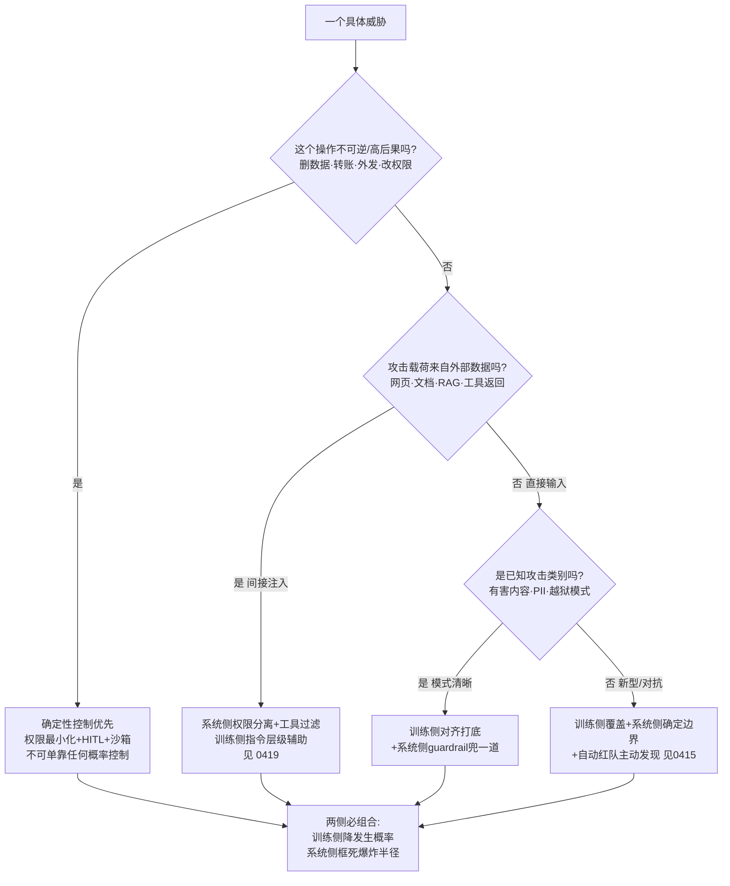

# S02 训练侧 vs 系统侧防御对照

一个 PM 在选型会上最常踩的坑，不是"该不该防 prompt injection"，而是误以为防御是一道单选题——要么"把模型训得更安全"（训练侧：对齐、Constitutional AI、对抗训练），要么"在模型外面套一圈过滤和权限"（系统侧：guardrail、权限最小化、沙箱、HITL）。本节点要解决的问题是：**这两侧分别能防住什么、各自在哪里必然失效、一个具体的攻击面到底该落到哪一层**——并给出一棵可在选型会上当场用的决策树。本节的核心立场是：训练侧与系统侧不是替代关系，而是**概率性控制 × 确定性控制**的正交组合；任何只押一侧的架构，都在系统层面犯了"加个内容过滤就安全了"的滑变错误。

## §0 为什么是"训练侧 vs 系统侧"这个切法，而不是"输入侧 vs 输出侧"

业界谈防御常用的默认框架是"输入过滤 / 输出过滤"（OWASP LLM01 的缓解清单就是这么列的），或者"七层防御栈"那种从上到下的分层图。这两种切法对 PM 决策有害，因为它们**把防御能力的根本差异藏起来了**。

真正决定一个防御"能不能信"的，不是它装在管道的哪个位置，而是它属于哪一类控制：

- **概率性控制（probabilistic）**：本质是一个被训练出来的模型或分类器——对齐微调、Constitutional AI、对抗训练、guardrail 分类器、prompt injection detector。它们降低攻击成功率，但**有不可消除的假阴性率和对抗盲点**，永远在和攻击者打军备竞赛。
- **确定性控制（deterministic）**：本质是与模型行为无关的硬边界——权限最小化、工具白名单、沙箱、输出硬阻断、高危操作 HITL。它们不"理解"攻击，但能保证"即使模型被完全攻陷，爆炸半径也被框死"。

"训练侧 vs 系统侧"这个切法，恰好让概率/确定的分界线浮出水面：训练侧几乎全是概率性的，系统侧则横跨两者（guardrail 是概率性的，沙箱和权限是确定性的）。这正是本节点要逼 PM 看清的事——你以为加了 guardrail 就有了"系统侧防御"，其实你只是在模型外面又叠了一个概率性控制，**确定性的硬边界一个都没有**。OWASP Top 10 for LLM Applications 2025 自己也承认，对 prompt injection 可能不存在万无一失的预防方案，策略重心须从"完全阻断"转向"降低爆炸半径"（来源：OWASP Top 10 for LLM Applications 2025，via toxsec.com "LLM Defense in Depth: Assume Breach"）——这句话翻译过来就是：别指望任何概率性控制兜底，确定性控制才是地板。

## §1 训练侧防御：覆盖广、可绕过、难维护

训练侧防御把安全"烧进"模型权重，代表方案与实测数据：

| 方案 | 机制 | 实测效果 | 来源 |
|---|---|---|---|
| RLHF / 安全微调 | 用人类偏好把有害输出概率压低 | Unit42 实测对齐在 109/123 个 jailbreak 提示上成功阻断 | Unit42 Palo Alto, 2025 |
| Constitutional AI | 模型按明文原则自我批评+改写，再 RLAIF | 见 [Constitutional AI](/kb/基础知识库/constitutional-ai/) | Anthropic |
| Constitutional Classifiers | 训练专用分类器守在 I/O 两端 | 越狱成功率 86% → 4.4%，过度拒绝仅 +0.38%，算力 +23.7% | Anthropic, arXiv:2501.18837 |
| 对抗训练 / 潜空间对抗训练 | 把对抗样本喂进训练分布 | 提升鲁棒性，但与攻击者军备竞赛 | 潜空间对抗训练 LAT，Yi et al., arXiv:2501.10639，已核实(2026-06-12) |
| 指令层级 Instruction Hierarchy | 训练模型按 system>user>tool 优先级服从 | 已部署 GPT-4o；AgentDojo 显示可被部分绕过 | Wallace et al., arXiv:2404.13208 |
| 数据-指令分离 StruQ / ASIDE | 结构化角色分离 / 数据 token 正交旋转 | ASIDE 在注入基准上显著提升鲁棒性、不降基线 | arXiv:2503.10566 (ICLR 2026) |

训练侧的**四维画像**：

- **覆盖（广）**：一次训练改变模型在所有输入分布上的默认倾向，无需为每个下游应用单独配置。这是它最大的优势——它是模型"出厂自带"的安全底座。
- **成本（高且前置）**：需要标注数据、算力、训练流水线。Constitutional Classifiers 推理算力 +23.7% 是持续成本；而对抗训练每加一类攻击就要重训。最隐蔽的成本是"对齐税"——见下文争议。
- **可绕过（结构性可绕过）**：这是训练侧的命门。ICLR 2025 论文 "Can LLMs Separate Instructions from Data?" 给出能力边界的硬结论——LLM 在架构层面**缺乏"被动数据 vs 主动指令"的原则性分离**，Transformer attention 同等对待所有 token（来源：ICLR 2025 proceedings）。这意味着指令层级、StruQ 这类训练侧方案是在"教"模型一个它架构上不天然具备的区分，必然有泄漏。Unit42 实测里，平台1未检测的 51 个恶意提示中 42 个来自角色扮演/虚构场景——这正是训练侧分布外泛化失败的典型。
- **可维护（差）**：模型一旦训完，发现新攻击类型只能等下一轮重训；攻击者的提示有效期是天级，模型重训周期是周到月级。这个时间差结构性地让训练侧永远慢一拍。

## §2 系统侧防御：边界硬、覆盖窄、可维护

系统侧把安全做在模型**外面**，代表方案与实测数据：

| 方案 | 类型 | 机制 | 实测效果 | 来源 |
|---|---|---|---|---|
| Guardrail 分类器 | 概率性 | LlamaGuard / ShieldGemma 等独立审核 I/O | 主流平台输入拦截 53%–92%，绕过率 8%–47% | Unit42, 2025 |
| 工具过滤 Tool Filter | 确定性 | 只给当前任务所需工具 | GPT-4o ASR 57.7%→6.8%，效用保 73.1% | AgentDojo, arXiv:2406.13352 |
| 权限最小化 Progent | 确定性 | SMT solver 校验工具调用策略，扩权需人批 | 间接注入 ASR 41.2%→2.2%，自主 agent 70.3%→7.3% | arXiv:2504.11703 |
| 权限分离 OpenClaw | 确定性 | 低权限 agent 处理外部输入，高权限 agent 不接触不可信数据 | 双 agent 隔离+JSON 格式化全流水线 0% ASR；隔离单用 0.31%（323× 优于基线） | arXiv:2603.13424 |
| 沙箱执行 | 确定性 | 工具/代码在最小权限环境运行 | 纵深防御，限制实际操作范围 | OWASP LLM06 |
| HITL 高危审批 | 确定性 | 不可逆操作前强制人工确认 | 对灾难性错误的最后防线 | OWASP LLM01:2025 |
| 推理时检测 SecInfer/ICON | 概率性 | 推理阶段额外算检测信号 | ICON 检测注意力坍缩、推理时矫正，需白盒 | SecInfer arXiv:2509.24967; ICON arXiv:2602.20708 |

系统侧的**四维画像**：

- **覆盖（窄但精准）**：每个 guardrail、每条权限策略只管它配置到的那个面。工具过滤只在"任务工具≠攻击工具"的场景有效——AgentDojo 明说，对于"读邮件既是任务也是攻击路径"的工具重叠场景，过滤器无效。系统侧不会"出厂自带"，每个应用都要重新配。
- **成本（中且分散）**：guardrail 部署成本低（黑盒可挂任意模型），但权限粒度越细、维护成本越高（Okta 关于 AI agent 最小权限的工程文章明确指出粒度与复杂度的正相关）。HITL 的隐性成本是"审批疲劳"——高频低风险审批降低人类对真实高危事件的警觉。
- **可绕过（确定性部分不可绕过，概率性部分可绕过）**：这是系统侧最关键的内部分化。沙箱、权限边界是**确定性的**——攻击者即使完全控制了模型，也调不出没被授权的工具。但 guardrail 是个模型不是形式化验证，仍有对抗盲点：Unit42 实测输入层绕过率高达 47%，STACK 攻击（McKenzie et al., arXiv:2506.24068, UK AISI）更证明针对**防御流水线本身**设计的分阶段攻击，能让此前单层测出 ASR=0% 的攻击重新有效（ClearHarm 数据集黑盒 71% 成功率，零访问迁移 33%）。
- **可维护（好）**：发现新攻击改一条权限策略、加一个白名单条目即可，不用重训模型；与攻击者的响应速度匹配。

## §3 决策树：这个攻击面到底该落哪一层

把上面两节合成一棵可当场用的树。**输入是一个具体威胁，输出是该用哪侧、用哪层。**

三条决策铁律（树的落地版）：

1. **凡高后果/不可逆操作，确定性控制是地板，概率控制不许兜底。** 这是 EchoLeak（CVE-2025-32711）和 Slack AI 泄露事件的共同教训——它们都绕过了概率性过滤（EchoLeak 专门绕过 Microsoft 的 XPIA 注入过滤器），唯一能挡住的是"AI 检索范围与用户权限严格绑定 + 出站数据流审批"这类确定性边界。
2. **覆盖靠训练侧，边界靠系统侧——两条腿缺一不可。** 训练侧给你一个在所有输入上都"默认更安全"的模型（覆盖广），系统侧给你"即使模型失守也炸不大"的硬边界（边界硬）。只押训练侧 = 赌模型永不被绕过（已被证伪）；只押系统侧 = 每个新面都要手工配，且 guardrail 那半截仍可绕。
3. **可维护性决定响应速度的分工。** 把"需要快速响应新攻击"的职责交给系统侧（改策略快），把"提升默认安全基线"的职责交给训练侧（重训慢但根本）。

## §4 判断主轴：90% 的人在这里会搞错的四个点

**① 把"加 guardrail"当成"有了系统侧防御"。**
- 症状：选型会上有人说"我们挂了 LlamaGuard，系统侧搞定了"。
- 为什么会错：guardrail 是概率性控制，和对齐训练同属"可绕过"那一类。挂 guardrail 只是又叠了一层过滤，**确定性硬边界（权限/沙箱/HITL）一个没加**。
- 正确做法：区分系统侧内部的概率/确定两半，确认你真正部署了至少一项确定性控制。
- 真实反例：EchoLeak 攻击专门绕过了 Microsoft XPIA 注入过滤器和 Copilot 链接脱敏机制——纯概率防御被零点击攻破，CVSS 9.3。

**② 用"对齐做得好"替代"权限做得严"。**
- 症状："我们用的是 Claude，对齐很强，agent 给全权限没事"。
- 为什么会错：对齐降低的是有害**生成**概率，管不住有害**操作**。OWASP LLM06 Excessive Agency 正是这个坑——过度权限让被注入的模型执行真实破坏。
- 正确做法：对齐再强也按最小权限分配工具，处理外部数据的子 agent 不授予高危工具。
- 真实反例：ChatGPT 插件 "Chat with Code" 案例中，网页注入可让插件把私有 GitHub 仓库改为公开，无需用户确认——"权限过宽+无审批"组合，对齐救不了。

**③ 以为 0% ASR 的防御就是安全的。**
- 症状：拿着论文里"ASR=0%"的防御方案就敢上线。
- 为什么会错：很多 0% ASR 是单层、静态基准下测的；STACK 证明针对组合防御流水线的分阶段攻击能让这些防御重新失效，且攻击可零访问迁移（33%）——"防御靠不透明"行不通。
- 正确做法：用自适应攻击和自动红队（见 后训练即产品专题 的红队作为产品实践）持续重测，把 0% 当"当前未被攻破"而非"不可被攻破"。
- 真实反例：STACK 论文（arXiv:2506.24068）黑盒 71% 攻破含 few-shot 分类器的防御流水线——Anthropic/OpenAI 正用此类流水线守护 Opus 4 / GPT-5。

**④ 把训练侧和系统侧当成"二选一的成本权衡"。**
- 症状："训练侧太贵，我们先只做系统侧 guardrail" 或反之。
- 为什么会错：两者覆盖的失效模式正交——训练侧管"默认倾向"，系统侧管"越界后果"。省掉任一侧都留下整类无人防守的攻击面。
- 正确做法：把它当"必须组合"的两层，争论的不是"用哪个"而是"各投多少"。
- 真实反例：Progent（确定性权限）把间接注入 ASR 压到 2.2%，但论文自承"策略生成依赖 LLM，存在策略生成本身被注入的 bootstrap 问题"——确定性控制也需训练侧把生成策略的模型先做可靠，反之亦然。

## §5 产品 PM 视角补盲

工程视角只盯 ASR，但 PM 要看三个工程师常漏的点：

- **用户心理模型 × 假阳性**：Unit42 实测某平台假阳性率高达 13.1%。对 to C 产品，过度拒绝直接伤口碑——2023–2024 年 Claude 相对 ChatGPT 的口碑差距，主因就是过度拒绝（见 [Constitutional AI](/kb/基础知识库/constitutional-ai/)）。系统侧 guardrail 调严一档，留存可能掉一截。这是训练侧"对齐税"在产品层的现金账单。
- **HITL 的商业可扩展性**：HITL 是确定性防御共识，但在每分钟数百次工具调用的高频 agent 场景里，全审批不可行。PM 要设计"分级 HITL"——只在不可逆/高后果操作上断点，且参照 [m207 - Agent 产品化：场景推演与失败模式](/kb/工程化与落地架构/m207-agent-产品化-场景推演与失败模式/) 的"上线初期全设断点、通过率>95% 后逐步取消"。审批疲劳本身是产品风险。
- **合规驱动的最低配置**：EU AI Act 第 55 条对 GPAI 系统性风险模型（训练算力 ≥10^25 FLOP）强制要求"进行并记录对抗性测试（红队）"，已自 2025 年 8 月 2 日适用，2026 年 8 月起全面执法（罚款至 1500 万欧元或营业额 3%）（来源：EU AI Act Article 55；European Commission GPAI Code of Practice）。这意味着系统侧的红队/审计不只是技术选项，对足够大的模型是法律义务（见 AI 作为制度现象专题 的安全规范制定）。

## §6 对手框架回应

**接受 + 边界，不是反驳。**

- **回应"对齐就够了"派（部分主流实验室立场）**：接受——Unit42 数据显示对齐在 109/123 个 jailbreak 上成功阻断，对齐确实是高性价比的覆盖层，日常有害输出大多被它挡住。但坚持边界——对齐是概率控制，高级对抗攻击可绕过 RLHF，且 ICLR 2025 证明 LLM 架构层面无法原则性区分指令与数据。**对齐降低发生概率，但不能作为不可逆操作的唯一防线。** 这与 Rick 滴滴安全的"降发生方法论"同构：降发生是必要的概率治理，但安全干预（确定性兜底）不能省。
- **引入 Rick 未读的对手框架——Williams-King、Bengio 等（NeurIPS Safe GenAI Workshop 2024, arXiv:2501.11183）的"安全微调即军备竞赛"批判**：他们引用网络安全史上"临时打补丁屡屡失败"的教训，主张安全应从**架构层面内嵌原则**，而非事后附加。这逼问本节点的盲点——我把训练侧和系统侧都当"可叠加的层"，但他们指出"叠加补丁"本身可能是错误范式，ASIDE 那种"在 embedding 层做正交旋转"的架构内嵌方案才是出路。本节点接受这个批判作为长期方向，但坚持短期边界：架构级方案（ASIDE）尚需专项安全训练、大规模可部署性未验证，PM 决策无法等待，**当下仍须用"概率+确定"组合兜底**。

## §7 跨域呼应

调度**控制论的"requisite variety"（必要多样性定律，Ashby）**：一个控制系统要稳定调节一个扰动源，其自身的状态多样性必须 ≥ 扰动的多样性。攻击者的攻击空间（角色扮演、编码混淆、多轮累积、多模态、间接注入、工具投毒……）是高度多样的；任何**单一**防御机制的"状态多样性"都远低于攻击空间，因此结构性地无法完全调节——这从控制论给出了"为什么单层防御必然漏"的第一性解释，而非工程经验谈。

> [!note] 跨域呼应改变了什么判断
> 没有 Ashby，"两侧必须组合"只是一句经验建议；有了必要多样性定律，它升级为**结构性必然**：训练侧（覆盖广=高 variety 但概率性）+ 系统侧确定性边界（降低需要被调节的 variety 总量，把无限攻击空间压成有限权限空间）的组合，本质是"用确定性控制收缩问题空间，再用概率控制调节剩余空间"。这正是为什么 OpenClaw 的权限分离比再强的 guardrail 更根本——它不是在调节攻击，而是在**削减攻击空间的维度**。

## §8 PM 决策启示

- **面试怎么用**：被问"怎么防 prompt injection"时，别背 OWASP 清单。先反问"是高后果操作还是普通生成？载荷来自用户还是外部数据？"，再用 §3 决策树给出"训练侧降概率 + 系统侧框边界"的组合答案，并点出"加 guardrail≠系统侧防御"这个常见误区——展示你区分概率/确定控制的判断力。
- **选型怎么用**：评估任一 AI agent 平台时，列两张表——训练侧它继承了哪些（指令层级？对齐版本？）、系统侧它提供了哪些**确定性**控制（工具白名单粒度？权限分离？沙箱？HITL 断点配置能力？）。只有概率性控制的平台，对高后果场景不合格。
- **复现怎么用**：用公开基准做防御方验证——AgentDojo（多步多工具）测系统侧工具过滤效果，HarmBench/AdvBench〔基准名引用〕测训练侧对齐鲁棒性，且必须用自适应攻击复测（STACK 的教训），不信单层静态 0% ASR。

## §9 与已有节点的关系

- 对照 [m207 - Agent 产品化：场景推演与失败模式](/kb/工程化与落地架构/m207-agent-产品化-场景推演与失败模式/)：m207 给出"六类失败模式 + HITL 断点三维判断 + 自主性需质量数据支撑"的产品方法论；**本节点做"深化"**——把 m207 的"安全越界"失败模式拆成训练侧/系统侧两类防御的对照决策树，补上 m207 未展开的"为什么 HITL（确定性）不能被对齐（概率性）替代"的机理。不复述 m207 的失败模式分类。
- 对照 [Constitutional AI](/kb/基础知识库/constitutional-ai/)：CAI 是本节点训练侧的核心实例之一；**本节点做"定位纠偏"**——CAI 节点讲机制与"对齐税/过度拒绝"争议，本节点把它**降格为"训练侧防御的一个方案"**并对照其系统侧替代，强调 CAI 再强也是概率控制、不能独立兜底。不复述 CAI 两阶段机制。
- 与 [c13 - 幻觉的不可消除性](/kb/基础知识库/c13-幻觉的不可消除性/)〔确认存在〕呼应：幻觉不可消除 ↔ 对齐/注入防御的"可绕过"不可消除，是同一类"概率系统无完备保证"的认识论结论。

## §10 关联节点

**核心（必读）**
- [m207 - Agent 产品化：场景推演与失败模式](/kb/工程化与落地架构/m207-agent-产品化-场景推演与失败模式/)
- [Constitutional AI](/kb/基础知识库/constitutional-ai/)
- [RLHF](/kb/基础知识库/rlhf/)
- [Agent](/kb/基础知识库/agent/)
- [Function Calling](/kb/基础知识库/function-calling/)
- [c13 - 幻觉的不可消除性](/kb/基础知识库/c13-幻觉的不可消除性/)
- 本专题 03 架构剖面同级节点（S01 等）〔同级全名待核实，暂作普通文本，已登记待建清单〕

**延伸（可选）**
- [Anthropic](/kb/ai-公司与产品/anthropic/)
- [幻觉](/kb/基础知识库/幻觉/)
- [m207 - Agent 产品化：场景推演与失败模式](/kb/工程化与落地架构/m207-agent-产品化-场景推演与失败模式/) 关联的 [c14 - 模型评估体系与 Goodhart 陷阱](/kb/基础知识库/c14-模型评估体系与-goodhart-陷阱/)
- 0117社会学
- [AI PM 知识图谱·总索引](/kb/ai-pm-知识图谱/ai-pm-知识图谱-总索引/)
- 对齐哲学专题（间接注入防御架构）、后训练即产品专题（红队作为产品实践）、AI 作为制度现象专题（安全规范制定）——跨专题，已落盘主库；0436（Agent 权限边界）仍在 staging，0436 待补完入库、暂作普通文本

## 修订日志
- R1（2026-06-07）：首稿。建立"概率性控制 × 确定性控制"作为训练侧/系统侧的本质分界；四维对照（覆盖/成本/可绕过/可维护）；§3 决策树 + 三条铁律；§4 四个致命误区；Ashby 必要多样性定律作为"单层必漏"的第一性解释。
- R1.1（2026-06-07）：grounding 校验。WebSearch 核实并解除以下〔待核实〕标记——STACK arXiv:2506.24068（McKenzie et al., UK AISI，ClearHarm 黑盒 71%/迁移 33% 已确认）、ICON arXiv:2602.20708、OpenClaw arXiv:2603.13424（补正精确数字：全流水线 0% ASR、隔离单用 0.31%/323×、JSON 单用 14.18%）、SecInfer arXiv:2509.24967；EU AI Act 第 55 条 10^25 FLOP 阈值与对抗性测试义务（2025-08-02 适用）已确认。剩余待核实项：潜空间对抗训练具体 arXiv ID、本专题同级节点全名（S01 等，暂降级为普通文本并登记 _待建概念清单.md）。
- 2026-06-11 P3.4 校链：0419/0415/0430 三兄弟专题经主库 `find` 实证已落盘，§4/§5/§10 指向它们的降级文本恢复为真 `NNNN 总览` 链并删 staging 注解；仅 0436 仍在 staging，改标"0436 待补完入库"保留普通文本。
- 2026-06-12 内审·arXiv 联网核实：清了 1 个 / 存疑 0 个。R1.1 遗留"潜空间对抗训练具体 arXiv ID 待核实"——经 WebFetch 锁定为《Latent-space adversarial training with post-aware calibration…》（Yi et al., arXiv:2501.10639，与 G02 已引同源），§1 训练侧对照表该行〔具体 arXiv ID 待核实〕补为真实编号并标"已核实(2026-06-12)"。本节点正文 arXiv 引用现 0 待核实。
