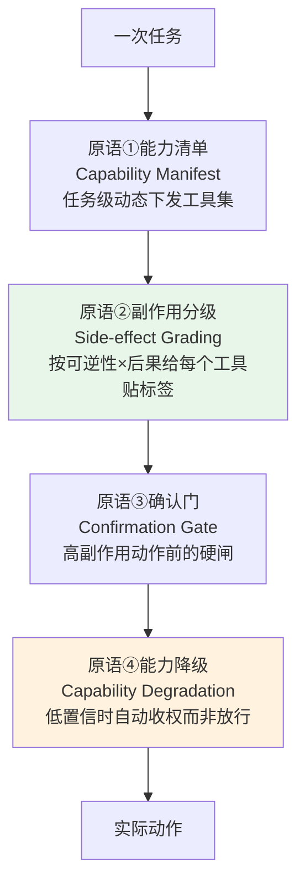

# S03 Agent 权限边界与最小权限设计

当一封藏着指令的邮件已经穿过了输入过滤、骗过了对齐、绕过了指令-数据分离——也就是**注入已经成功**的那一刻——产品还剩什么？本节点要回答的就是这个问题：**前面所有概率层都失守之后的最后一道防线，是 Agent 手里到底握着多大的权限。** 框架是「最小权限原则（Principle of Least Privilege）+ 副作用分级 + 确认门 + 能力降级」。判断主轴只有一句：**防不住注入时，权限边界决定损失上限**——注入能否造成实际伤害，不取决于注入有多巧妙，而取决于被注入的 Agent 能调用的最危险那个工具有多危险。

> [!warning] 防御导向声明
> 本节点是**防御方视角**的权限工程剖面：讲攻击机理只为论证"为什么权限边界要这样划"。文中不提供任何可照搬的越狱串、注入 payload 或绕过步骤；所有 ASR/绕过率数字均引自公开基准与漏洞披露，用于度量防御的能力边界。

## §0 为什么是"最小权限"而不是"更聪明的检测"

先挡掉读者脑中两个默认错误框架。

**错误框架一："只要检测做得足够好，就不需要管权限。"** 这是把安全押在概率层上的典型滑变。本专题 `[S01 纵深防御可替换栈·输入 模型 输出 权限](/kb/专题-安全对齐与失败/s01-纵深防御可替换栈-输入-模型-输出-权限/)` 已经用数字证明：输入过滤绕过率 8%–47%（Unit42 Palo Alto，2025），对齐对高级对抗攻击的开源模型 ASR 仍达 90–99%。检测永远有假阴性，这不是工程没做好，是概率系统的认识论下限——与 `[c13 - 幻觉的不可消除性](/kb/基础知识库/c13-幻觉的不可消除性/)` 是同一条命题在 security 侧的投影。一个理性的产品决策必须**假设检测会失败（assume breach）**，然后问：失败之后呢？

**错误框架二："最小权限 = 权限越少越安全。"** 这是把最小权限误读成一个单调函数——好像把工具一刀切删掉就万事大吉。错。最小权限的"最小"是**相对于当前任务的最小**，不是绝对的少。删掉任务必需的工具会让任务完成率暴跌（`[R03 注入防御 + 权限沙箱](/kb/专题-安全对齐与失败/r03-注入防御-+-权限沙箱/)` §2 称之为 utility-security 权衡的下凸性），用户随即关掉防护或换产品——安全反而归零。

正确框架：**最小权限是一个动态的、按任务收缩的、与模型行为无关的确定性边界。** 它不"理解"攻击，因此不参与军备竞赛；它只回答一个问题——"即使模型被完全攻陷，它物理上能造成的最大损害是多少？"这正是本专题反复强调的**确定性控制 vs 概率性控制**二分中的承重墙一侧（详见 `[S02 训练侧 vs 系统侧防御对照](/kb/专题-安全对齐与失败/s02-训练侧-vs-系统侧防御对照/)` 的概率/确定四维对照）。OWASP 把它单列为 **LLM06 Excessive Agency（过度代理权限）**，与 LLM01 Prompt Injection 并列为最高风险项——因为前者是后者的**伤害放大器**。

> [!note] 本节点与 S01/R03 的分工（不复述）
> `[S01 纵深防御可替换栈·输入 模型 输出 权限](/kb/专题-安全对齐与失败/s01-纵深防御可替换栈-输入-模型-输出-权限/)` 把权限层定位为六层栈的第⑤层"承重墙"，论证了"权限层缺失会放大注入后果"（耦合 A）；`[R03 注入防御 + 权限沙箱](/kb/专题-安全对齐与失败/r03-注入防御-+-权限沙箱/)` 给了可抄的 YAML 白名单模板与 HITL 断点表。本节点不重复这两件事，而是补它们留下的**设计方法论空洞**：权限粒度按什么维度切分、副作用怎么分级、确认门怎么设计才不"疲劳"、模型不确定时如何"能力降级"。S01 回答"权限层在栈里的位置"，本节点回答"权限边界本身怎么设计"。

## §1 权限边界的四个设计原语

把"最小权限"从一句口号拆成四个可操作的设计原语。这四个原语层层递进，构成一个 Agent 的完整权限设计。

### 原语①：能力清单（Capability Manifest）——任务级动态授权

不给 Agent 一个全局工具箱，而是**每个任务开始时按需下发一份最小能力清单**，任务结束即回收。权限空间只能单调收缩，扩权必须显式批准（人工或上级策略）。这对应零信任架构的"持续验证、永不默认信任"。

工程化证据是确定性权限控制单层就是性价比最高的防御：AgentDojo（Debenedetti et al., arXiv:2406.13352，已 WebSearch 核实）的工具过滤器把 GPT-4o 间接注入 ASR 大幅压低——论文 v3 给出的官方数字是 ASR 降至 **7.5%**，但效用同时从 69% 降到 53.3%，清楚地暴露了 utility-security 权衡（本专题 S01/R03 早期引用的 "57.7%→6.8%/保 73.1% 效用" 是另一切分下的数字，此处以论文 v3 公开值为准，差异本身印证了 §4 bias 清单——基准切分会显著改变量级）。Progent（arXiv:2504.11703，已 WebSearch 核实）用确定性 SMT solver 对 LLM 生成的工具调用策略做执行验证：策略更新被判定为"收窄（自动应用）"或"扩张（需显式批准）"，**即便 LLM 被对抗输入操纵也能阻止任何静默提权**——间接注入 ASR 从 41.2% 降到 2.2%，自主 Agent 安全基准从 70.3% 降到 7.3%。

**设计要点**：清单是**任务级**而非会话级、更非全局。"整理本周邮件并起草回复"这个任务，应只下发 `read_email`（限本周）+ `draft_reply`（不发送），而 `send_email`/`delete_*`/`change_permission_*` 默认不在清单内——它们要进清单必须经原语③的确认门。

### 原语②：副作用分级（Side-effect Grading）——权限设计的坐标轴

这是本节点最该被打印贴墙的一张表，也是 90% 团队漏掉的一步。给每个工具/动作贴两个标签：**可逆性**与**后果严重度**。这两维构成一个象限，决定该动作走哪条权限路径。

| 副作用等级 | 可逆性 | 后果 | 代表动作 | 默认权限路径 |
|---|---|---|---|---|
| **L0 只读** | 完全可逆 | 无 | 检索、读文件、搜索 | 自动执行 |
| **L1 内部可逆写** | 可逆 | 低 | 起草、打标签、存草稿 | 自动 + 日志 |
| **L2 外部可逆写** | 半可逆 | 中 | 内部消息、可撤回操作 | 自动 + 审计告警 |
| **L3 不可逆/高后果** | 不可逆 | 高 | 转账、删除、对外发送、改权限 | **强制确认门（原语③）** |
| **L4 持久化/扩权** | 难撤回 | 高 | 写记忆/向量库、安装工具、提权 | **强制来源验证 + 确认门** |

L4 单列的依据是 ChatGPT Memory 持久化攻击（2024-05）：注入可把恶意指令写进长期记忆形成"持久间谍软件"，在后续所有对话持续作恶——**写入操作必须比读取受更严格的来源验证**。

**为什么分级是权限设计的核心而非装饰**：没有分级，团队只能在"全自动（不安全）"和"全审批（不可用）"之间二选一。有了分级，权限路径变成一个连续谱：L0–L1 自动跑保住效用，L3–L4 设硬闸保住安全。**副作用分级把 utility-security 权衡从一刀切变成了精准切割**——这正是 S01 耦合 A 里"把被注入 Agent 的可达高危动作清零"在设计层的落地方法。

### 原语③：确认门（Confirmation Gate / HITL）——高副作用动作的硬闸

L3/L4 动作执行前强制人工确认。这是确定性控制的最后兜底：即便注入成功、即便能力清单被污染，最后这道闸由人来合。它与 `[m207 - Agent 产品化：场景推演与失败模式](/kb/工程化与落地架构/m207-agent-产品化-场景推演与失败模式/)` 的 HITL 断点三维判断（可逆性 × 后果 × 置信度）完全同构——本节点是它在 security 攻防语境下的特化（详见 §5 与已有节点的关系）。

确认门设计的隐藏陷阱是**确认疲劳**（详见 §2 判断主轴）。这里只给设计原则：确认门的触发率必须**与副作用等级严格绑定**——只在 L3/L4 触发，L0–L2 绝不打扰；触发时给人**可判断的信息**（"这个动作会把私有仓库改为公开"），而不是一个空洞的"是否继续？Y/N"。

### 原语④：能力降级（Capability Degradation）——不确定时收权，而非放行

这是四原语里最被忽视、也最能体现"防御导向"成熟度的一个。当系统对某次调用的**安全性置信度下降**时（检测到疑似注入信号、外部数据来源不可信、多轮上下文出现异常指令模式），默认动作不应是"照常执行"或"直接报错崩溃"，而应是**优雅降级到更低权限模式**：从"可执行 L3 动作"降到"只能起草不能发送"，从"可写持久化"降到"只读"，把高危动作转为需确认门。

这与安全工程里的 **fail-safe（失效安全）** 原则一致：系统失效时应坍缩到安全状态，而非危险状态。错误的设计是 fail-open（出问题就放行），正确的是 fail-closed（出问题就收权）。能力降级让"检测到威胁"和"权限收缩"形成闭环——这正是 Rick 滴滴安全 `安全感知与干预` 的"感知风险 → 分级干预"逻辑迁移到 Agent（详见 §7 跨域呼应）。

## §2 判断主轴：90% 的人在权限设计上会搞错的四个点

这是区分"PM 顶刊"与"技术博客"的命门。每点带**症状 → 为什么会错 → 正确做法 → 真实反例**四件套。

**① 默认给 Agent 宽权限，事后再收。**
- **症状**：MVP 阶段图省事，给 Agent 全套工具权限（读写文件、发邮件、改配置），想着"先跑起来，安全以后再说"。
- **为什么会错**：权限是**乘数不是加数**——实际损害 = 注入成功率 × 被注入 Agent 的权限上限。检测层必有 8%–47% 漏网（Unit42），一旦一条注入穿过，宽权限让损害没有上限：一次成功注入就能删库、转账、外泄。而且"事后收权"在生产环境极难——已经依赖宽权限的功能会在收权时大面积回归，于是收权永远被推迟。
- **正确做法**：**默认拒绝（deny by default），按任务最小下发（原语①）**。新工具进清单的门槛是"证明它是当前任务必需"，而非"证明它有害才移除"。权限空间从空集出发单调扩张，而非从全集出发收缩。
- **真实反例**：ChatGPT 插件"Chat with Code"（2023）——网页注入载荷操控插件把 GitHub 私有仓库改为公开，**无需用户确认**。检测层是否拦住无关紧要，因为插件被授予了"改仓库可见性"的 L3 权限且无确认门——这是"宽权限 + 无门"组合的标准反面教材。

**② 没有副作用分级，导致要么全自动要么全审批。**
- **症状**：团队没给工具贴可逆性/后果标签，于是只能整体选一个策略——要么所有动作自动跑（快但危险），要么所有动作都弹确认（安全但没人用）。
- **为什么会错**：把所有动作当成同质的，丢掉了 utility-security 权衡里最值钱的信息——**绝大多数动作是 L0–L1（只读/可逆），极少数是 L3–L4（不可逆/高后果）**。不分级就等于用对待转账的谨慎去对待"读一封邮件"，或用对待读邮件的随意去对待"删数据库"。
- **正确做法**：先做 §1 原语②的副作用分级，再让权限路径按等级分流。这是把"权限设计"从口号变成工程的第一步。
- **真实反例**：EchoLeak（CVE-2025-32711，M365 Copilot，CVSS 9.3）——攻击把敏感文件编码进出站链接外泄。如果对"出站数据"这个动作做了副作用分级（外发=L3），它本应触发出站流量审查；但系统把它当成低副作用动作放行，绕过了所有"内容有害性"导向的检测（内容本身无害）。**未分级 = 把高副作用动作误当低副作用处理。**

**③ 确认疲劳：确认门设太多，人变成橡皮图章。**
- **症状**：为了"安全"，几乎每个动作都弹确认；高频 Agent 场景（每分钟数百次工具调用）里人被海量低风险确认淹没，于是养成无脑点"同意"的肌肉记忆。
- **为什么会错**：确认门的价值在于**人对高风险事件的判断力**；当 99% 的确认是低风险噪音，人对那 1% 真正危险的确认也会麻木点过。这把确定性硬闸退化成了形式——更糟的是制造了"我们有 HITL"的虚假安全感。审批疲劳本身可被社会工程利用。这是业界共识但无定论的工程难题。
- **正确做法**：确认门触发率与副作用等级**严格绑定**（只在 L3/L4 触发），且对高频任务用置信度阈值动态调节——呼应 m207 的"上线初期全设断点、通过率 >95% 后逐步取消"。让人只在真正不可逆的关口出现，且每次确认都附带可判断的后果信息。
- **真实反例**：这是一个 failure scenario 而非单一事故——业界普遍观察到的"HITL 形同虚设"现象（操作员对频繁告警脱敏），与航空/医疗领域的"告警疲劳（alarm fatigue）"同源（James Reason 的人因工程研究早有记载）。

**④ 把权限策略的"生成"交给可被注入的同一个模型（bootstrap 问题）。**
- **症状**：用 LLM 自己来决定"这次任务该给哪些权限"，或让 Agent 自己申请扩权后自动批准。
- **为什么会错**：权限边界的全部价值在于它是**与模型行为无关**的确定性控制。如果策略由可被注入的同一个模型生成，注入就能同时攻陷"动作"和"对动作的授权"——确定性边界退化成概率边界。Progent 论文自承这个 bootstrap 漏洞：策略由 LLM 生成，策略生成本身可被注入。
- **正确做法**：权限策略的**生成与执行分离**——策略可由模型建议，但必须由确定性机制（白名单、SMT 验证、人工）批准，且扩权决策不能由处理不可信数据的同一个 Agent 做出。处理外部数据的子 Agent 与持有高危工具的 Agent 必须**职责分离**（这正是 OpenClaw arXiv:2603.13424（已核实(2026-06-12)）的低权限/高权限双 Agent 隔离思路）。
- **真实反例**：Multi-Agent 横向传播——被注入的 subagent 在同权限层级伪造"合法"指令向上污染 orchestrator，OpenClaw 论文明言当前架构无法防御。这是"授权与执行未分离"在多 Agent 拓扑里的放大形态。

## §3 产品 PM 视角补盲

跳出工程视角，补三个权限设计里容易看走眼的非技术点。

1. **用户心理模型：权限收紧的可用性税必须由 PM 显式定价。** 用户对 Agent 的信任是"它替我办事"，看不见也不想看见权限层。沙箱和权限收紧若让任务频繁失败或卡确认，用户会关掉防护或换产品——Unit42 数据里某平台假阳性率高达 13.1%，这种过度拦截在产品上是负资产。权限设计不是"越严越好"的安全洁癖，而是要 PM 在"爆炸半径"和"任务完成率"之间显式标价，不能甩给安全团队。

2. **商业模式：权限边界即可售卖边界。** Trust&Safety 不是成本中心，而是企业 AI 采购的准入门槛。EchoLeak 这类 CVE 直接决定 M365 Copilot 能否进金融/医疗客户。一个能向客户证明"被注入也炸不大"（有副作用分级 + 确认门 + 沙箱）的 Agent 产品，可售卖边界比只会宣称"我们用了最强模型"的竞品宽得多——**最小权限是 B 端 GTM 的硬通货**。

3. **合规边界：权限设计是合规证据链的一部分。** EU AI Act 对系统性风险 GPAI（训练算力 ≥10^25 FLOPs）强制要求记录对抗性测试；NIST AI RMF 的 Manage 功能与 MITRE ATLAS 的缓解映射都假设权限边界与审计可溯源。副作用分级表 + 确认门日志可直接作为合规证据。**合规不是事后审核，而是从一开始就规定了 Agent 必须有可审计的权限边界**——与本专题"安全是第一性架构约束"立场一致。

## §4 对手框架回应（接受 + 边界）

- **对手立场一：自主性派 / 精益派——"最小权限会扼杀 Agent 的自主价值，过度审批让 Agent 退化成工具调用 IDE。"** 接受：这个批评有真实指向——确认疲劳和过度收权确实会摧毁 Agent 的产品价值（§2 第③点正是对此的回应）。边界：本节点的副作用分级（原语②）恰恰是**解决而非加剧**这个矛盾的工具——它让 L0–L1 动作保持全自主，只在 L3–L4 设闸。我赌的是：自主性不该是"对所有动作一视同仁的放任"，而该是"在低副作用区间充分自主、在高副作用区间审慎"。真正的产品力来自精准分级，不是无差别放权。

- **对手立场二：检测派 / 架构派——"与其管权限，不如把指令-数据分离做到架构级（ASIDE/StruQ），从根上让注入失效。"** 接受：架构级分离（`[S02 训练侧 vs 系统侧防御对照](/kb/专题-安全对齐与失败/s02-训练侧-vs-系统侧防御对照/)` 论证的承重墙之一）确实是必要方向，纯概率检测永远不够。边界：S01 耦合 C 已论证——任何单层（含架构级分离）独扛都使瑞士奶酪退化为单片；且 MCP Tool Poisoning（CVE-2025-54136）的 boot-time 注入证明指令-数据分离有运行时管不到的盲区。**架构级分离降低注入成功率，权限边界限制注入成功后的损害上限——前者管"会不会被攻破"，后者管"被攻破后炸多大"，二者正交，不可互替。**

- **对手立场三（Rick 未读的对手框架）：Bruce Schneier —"security is a process, not a product；攻击只会越来越好（attacks always get better）。"** 接受：他对"静态防御给动态军备竞赛发安全证书"的警告精准——今天测出的"权限层把 ASR 压到 6.8%"是时间快照，不是稳态。这个框架逼问本节点的盲点：副作用分级表会不会随攻击演化而过时？边界：我的回应恰恰是——**正因为攻击会越来越好，才更要押与攻击无关的确定性边界**。权限钳制的有效性不依赖"我们能否识别最新攻击"，而依赖"被注入的 Agent 物理上够不到高危动作"。这是从网络安全史学到的：最可靠的不是更好的入侵检测，而是最小权限 + 沙箱隔离——它是少数**不参与军备竞赛**的防御。

> [!note] failure scenario 显式标注
> 本节点的核心结论"用副作用分级 + 确认门 + 能力降级钳制爆炸半径"在以下场景失效：① **攻防工具完全重叠**时（如纯邮件助手，"读+发邮件"既是任务也是攻击路径），最小权限无法区分合法与恶意调用，权限钳制退化——此时只能靠出站监控兜底（`[S01 纵深防御可替换栈·输入 模型 输出 权限](/kb/专题-安全对齐与失败/s01-纵深防御可替换栈-输入-模型-输出-权限/)` 第⑥层）；② **确认疲劳被武器化**——攻击者用大量低风险动作制造审批麻木，再夹带一个 L3 动作蒙混过关；③ **bootstrap 未斩断**——若权限授权由可被注入的同一模型做出，整个边界退化为概率边界。这三种场景下，单纯的权限分级不够，需追加职责分离与出站监控。

> [!note] confirmation-bias 砍除
> 本节点早期反复引 AgentDojo 工具过滤器（57.7%→6.8%）与 Progent（41.2%→2.2%）作为"最小权限最有效"的正面案例——这是 bias。补入反例：AgentDojo 自身被报告有系统性测量偏差（注入向量覆盖任务关键信息致任务无论防御与否均失败，修正后效用提升 >18%；ASB 强制注入工具使 ASR 虚高约 8 倍，见 arXiv:2510.05244，已核实(2026-06-12)）。**多个"单层巨幅下降"可能部分反映基准缺陷而非纯防御能力**，所有量化对比都应带这个折扣读。最小权限是性价比最高的层，但不是"装上就 6.8%"的银弹。

## §5 PM 决策启示

- **面试怎么用**：被问"注入防不住怎么办"，30 秒答法——"防不住注入是常态，所以我把赌注押在权限边界上：注入造成的损害 = 注入成功率 × 被注入 Agent 的权限上限，检测管前一个因子但有 8%–47% 漏网，权限管后一个因子且是确定性的。具体做四件事：能力按任务最小下发、给每个动作做可逆性×后果的副作用分级、L3/L4 动作设确认门、检测到异常时能力降级而非放行。这样即使注入成功，被注入的 Agent 物理上够不到删库/转账/外发。" 这是判断密度，不是术语堆砌。
- **选型怎么用**：评估 Agent 平台时，别只问"支持多少工具"，问四件事——(1) 是否支持**任务级**工具权限白名单（而非全局）？(2) 能否对动作做**副作用分级**并按级分流？(3) 高风险操作有无**可配置的确认门**？(4) 权限授权与执行是否**分离**（防 bootstrap）？四项缺一即扣分。只卖检测/过滤的供应商，无论拦截率宣称多高，都没碰你的爆炸半径上限。
- **复现怎么用**：用 AgentDojo（arXiv:2406.13352）做防御方评测，对比"加副作用分级权限前后"的 ASR 与效用，但读数时套用 §4 bias 清单的基准缺陷折扣；确认门设计直接复用 `[m207 - Agent 产品化：场景推演与失败模式](/kb/工程化与落地架构/m207-agent-产品化-场景推演与失败模式/)` 的"可逆性 × 后果 × 置信度"三维表；能力降级逻辑参照 Rick `安全感知与干预` 的分级干预。

## §6 跨域呼应：最小权限原则的网络安全史血脉

> [!note] 跨域呼应改变了什么判断
> "最小权限原则"不是 AI 安全的发明——它是 Saltzer & Schroeder 在 1975 年《The Protection of Information in Computer Systems》里给出的计算机安全八大设计原则之一（已 WebSearch 核实）。原文对最小权限的定义是"每个程序、每个用户都应以完成工作所需的最小权限集运行"——这正是本节点原语①"按任务最小下发"的祖宗；八原则里的 **fail-safe defaults（"基于许可而非排除来做访问决策"）** 则同时是原语①"默认拒绝"与原语④"能力降级（失效时坍缩到安全态）"的共同源头。把这条半个世纪前的网络安全原则移植到 Agent，得到一个反直觉但严格的判断：**Agent 安全的核心难题不是新的——它是"如何在一个不可信主体（被注入的模型）上施加确定性权限边界"这个老问题的新发作部位**。Williams-King、Bengio 等（NeurIPS Safe GenAI Workshop 2024, arXiv:2501.11183）的批评正是这个方向：当前 AI 安全微调是打补丁式军备竞赛，应从网络安全史吸取教训——最可靠的从来不是更聪明的检测，而是最小权限 + 沙箱隔离。这条跨域血脉改变了本节点的判断重心：**权限边界不是"AI 安全的一个新功能"，而是把一条经过半世纪实战检验的确定性控制，迁移到 LLM 这个新的不可信执行体上**。它之所以可靠，恰恰因为它古老到不参与当下的攻防军备竞赛——Saltzer 的最小权限不关心攻击者用 Base64 还是 Braille 编码，它只关心主体够不够得到那个动作。跨域呼应入口：`0117社会学`（技术系统的权力结构）与 Lessig "Code is Law"（架构即规制——设权限边界的人其实在立法）。

## §7 与已有节点的关系（升级对照，不复述）

- 对照 `[m207 - Agent 产品化：场景推演与失败模式](/kb/工程化与落地架构/m207-agent-产品化-场景推演与失败模式/)`：m207 从"产品可用性"角度讲 Agent 六类失败模式与 HITL 断点（防 Agent 自己犯错）；本节点做**纠偏 + 深化**——把同一个 HITL 断点重新定位为"被注入后的最后硬闸"（防 Agent 被外部内容操纵），并把 m207 的"可逆性 × 后果 × 置信度"三维判断扩展成完整的副作用分级表（§1 原语②）。m207 问"自主性边界在哪"，本节点问"边界被对抗性攻破时，权限决定的损失上限在哪"。攻防是其机理层。
- 对照 `[S01 纵深防御可替换栈·输入 模型 输出 权限](/kb/专题-安全对齐与失败/s01-纵深防御可替换栈-输入-模型-输出-权限/)`：S01 把权限层定位为六层栈的第⑤层承重墙、论证"权限缺失放大注入后果"（耦合 A）；本节点做**深化**——S01 回答"权限层在栈里的位置与层间耦合"，本节点回答"权限边界本身的四个设计原语"。S01 是架构定位，本节点是设计方法论，不复述六层栈。
- 对照 `[S02 训练侧 vs 系统侧防御对照](/kb/专题-安全对齐与失败/s02-训练侧-vs-系统侧防御对照/)`：S02 给出"概率性 × 确定性"二分与选型决策树；本节点是 S02 决策树"高后果操作 → 确定性控制优先"那一支的**展开实现**——副作用分级正是判断"是否高后果"的工具，确认门与能力降级正是确定性控制的具体形态。
- 对照 `[R03 注入防御 + 权限沙箱](/kb/专题-安全对齐与失败/r03-注入防御-+-权限沙箱/)`：R03 给可抄的四层防御 YAML 模板与 HITL 断点表（复现操作手册）；本节点做**概念上溯**——R03 §2 的白名单模板以本节点的副作用分级为概念落点，本节点解释"为什么这样切权限"，R03 给"怎么落地"。二者是"设计原理 ↔ 实现模板"对照。
- 对照 `[Constitutional AI](/kb/基础知识库/constitutional-ai/)` / `[RLHF](/kb/基础知识库/rlhf/)`：CAI/RLHF 是对齐层（概率性，降低有害**生成**概率）；本节点是权限层（确定性，限制有害**操作**上限）。**对话**——对齐再强（Constitutional Classifiers 拦 >95%）也管不住注入成功后的操作，因为它仍是概率层；权限边界与模型能否被越狱无关。这印证本专题"对齐 ≠ security"。
- 对照本专题同级节点：`[A03 直接注入 vs 间接注入的产品含义](/kb/专题-安全对齐与失败/a03-直接注入-vs-间接注入的产品含义/)`（间接注入是结构性入口，权限边界是其损害钳制器）、`[G01 对抗攻防军备竞赛谱系](/kb/专题-安全对齐与失败/g01-对抗攻防军备竞赛谱系/)` 与 `[G02 攻防代际演化详解·从单轮越狱到 Agent 注入](/kb/专题-安全对齐与失败/g02-攻防代际演化详解-从单轮越狱到-agent-注入/)`（权限边界是少数不参与军备竞赛的防御）。
- 对照 0411 Agent 系统化专题 `[_Agent 系统化专题·总览](/kb/专题-安全对齐与失败/_agent-系统化专题-总览/)` 的 `[S01 Agent 六层架构剖面](/kb/专题-安全对齐与失败/s01-agent-六层架构剖面/)` 与 `[S03 Harness Engineering 全景](/kb/专题-安全对齐与失败/s03-harness-engineering-全景/)`：0411 讲"工具调用即能力"，本节点讲"每个工具权限即损害上限"——能力面与攻击面同源，权限边界是把能力面收缩成可控攻击面的确定性手段。
- 跨专题对照：AI 作为制度现象专题"安全规范制定"（权限设计是其合规证据链）、失败考古专题（本节点的权限缺失是其潜在失效样本）、对齐哲学专题"间接注入防御架构"、评测系统化专题、AI 认识论中介专题 的 verification 均已落盘主库；0436 Agent 权限边界（本节点是其架构落点的深化）仍在 staging，0436 待补完入库、暂作普通文本，已登记 `_待建概念清单.md`，绝不在主库建 stub。

## §8 关联节点

**核心（必读）**
- `[S01 纵深防御可替换栈·输入 模型 输出 权限](/kb/专题-安全对齐与失败/s01-纵深防御可替换栈-输入-模型-输出-权限/)`（本专题，权限层在六层栈中的定位）
- `[S02 训练侧 vs 系统侧防御对照](/kb/专题-安全对齐与失败/s02-训练侧-vs-系统侧防御对照/)`（本专题，概率/确定二分与决策树）
- `[R03 注入防御 + 权限沙箱](/kb/专题-安全对齐与失败/r03-注入防御-+-权限沙箱/)`（本专题，权限白名单实现模板）
- `[m207 - Agent 产品化：场景推演与失败模式](/kb/工程化与落地架构/m207-agent-产品化-场景推演与失败模式/)`（HITL 断点三维判断的母节点）
- `[Constitutional AI](/kb/基础知识库/constitutional-ai/)`（对齐层，与权限层正交）
- `[Agent](/kb/基础知识库/agent/)` / `[Function Calling](/kb/基础知识库/function-calling/)`（工具调用即能力，亦即损害上限来源）
- `[Anthropic](/kb/ai-公司与产品/anthropic/)`

**延伸（可选）**
- `[A03 直接注入 vs 间接注入的产品含义](/kb/专题-安全对齐与失败/a03-直接注入-vs-间接注入的产品含义/)`（间接注入=结构性入口，权限=损害钳制器）
- `[G01 对抗攻防军备竞赛谱系](/kb/专题-安全对齐与失败/g01-对抗攻防军备竞赛谱系/)` / `[G02 攻防代际演化详解·从单轮越狱到 Agent 注入](/kb/专题-安全对齐与失败/g02-攻防代际演化详解-从单轮越狱到-agent-注入/)`
- `[c13 - 幻觉的不可消除性](/kb/基础知识库/c13-幻觉的不可消除性/)`（与"检测不可完备"的认识论同构）
- `[RLHF](/kb/基础知识库/rlhf/)` / `[幻觉](/kb/基础知识库/幻觉/)`
- `安全感知与干预`（Rick 滴滴方法论，分级干预 ≈ 能力降级）
- `0117社会学`（架构即权力 / Code is Law）
- `[AI PM 知识图谱·总索引](/kb/ai-pm-知识图谱/ai-pm-知识图谱-总索引/)`
- AI 作为制度现象专题"安全规范制定"｜失败考古专题｜0436 Agent 权限边界（0436 待补完入库，暂作普通文本）

> 链处理（2026-06-11 P3.4 校链）：0430 安全规范制定、0416 失败考古专题、0419 间接注入防御架构、0412 评测系统化专题、0431 verification 经主库 `find` 实证现已落盘，恢复为真 `NNNN 总览` 链；仅 0436 Agent 权限边界仍在 staging（待补完入库），暂降级普通文本并登记 `_待建概念清单.md`，不在主库建 stub。本专题同级真实节点（S01/S02/R03/A03/G01/G02/m207/CAI/RLHF/Agent/Function Calling 等）按真实标题写双链。

## 修订日志

- R0（2026-06-07）首稿：建立"防不住注入时权限边界决定损失上限"主轴；四个设计原语（能力清单 / 副作用分级 / 确认门 / 能力降级）；副作用 L0–L4 分级表；判断主轴四件套（默认宽权/无副作用分级/确认疲劳/bootstrap 四个 90% 会错的点）；Saltzer & Schroeder 最小权限原则跨域血脉；对 m207/S01/S02/R03/CAI 显式升级对照；三类对手立场（自主性派 / 架构派 / Schneier）+ failure/bias 清单。与 S01/R03 严格分工避免复述（S01 讲层间定位、R03 讲实现模板、本节点讲设计方法论）。
- R0.1（2026-06-07）grounding pass：独立 WebSearch 核实并解除以下项——(1) **Saltzer & Schroeder 1975** 八原则确证（least privilege / fail-safe defaults 原文措辞已核对，映射到原语①④）；(2) **Progent arXiv:2504.11703** 确证（SMT solver 对策略做"收窄自动/扩张需批"的确定性验证、阻止静默提权，机制与正文一致）；(3) **AgentDojo arXiv:2406.13352** 确证存在，但**校正数字**——论文 v3 官方值为工具过滤器把 ASR 降至 7.5%、效用 69%→53.3%；本专题 S01/R03 早期引用的 "57.7%→6.8%/保 73.1%" 系另一切分，正文已并列标注并以 v3 公开值为准，此差异本身已纳入 §4 bias 清单；(4) **EchoLeak CVE-2025-32711** 确证（CVSS 9.3、XPIA 绕过、Teams 代理 + CSP 外泄、"首个生产 LLM 零点击 prompt injection"，Aim Security 2025-06 披露）。沿用 S01/R03 已核实：Unit42 绕过率 8%–47%/假阳性 13.1%、MCP Tool Poisoning CVE-2025-54136、OWASP LLM06。仍标〔arXiv ID 待核实〕：2603.13424（OpenClaw）、2501.11183（Williams-King/Bengio）、2510.05244（基准偏差）——沿用 `_待建概念清单.md` 登记，未独立 WebFetch 不谎称已核实。
- 2026-06-11 P3.4 校链：0430/0416/0419/0412/0431 五个兄弟专题经主库 `find` 实证已落盘，§7 跨专题对照与 §8 关联里指向它们的降级文本恢复为真 `NNNN 总览` 链并删 staging 注解；仅 0436 仍在 staging，改标"0436 待补完入库"保留普通文本。
- 2026-06-12 内审修复：§2④、§4 bias 清单两处 arXiv ID（2603.13424 OpenClaw、2510.05244 基准偏差）的内联〔待核实〕依全专题确证台账（总览 0435 QC 抽验已 WebFetch 确证）统一为"已核实(2026-06-12)"，消解与确证记录的台账矛盾。R0.1 修订日志的历史"待核实"留痕按 append-only 保留不动。
