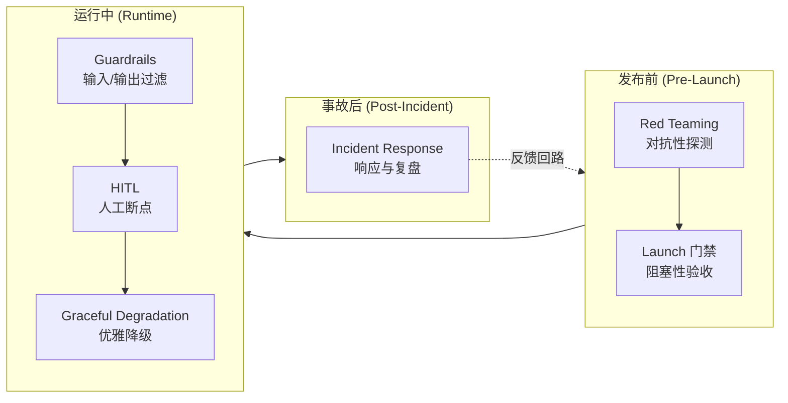

如果一个 AI 产品事故能被"加一条 guardrail"修好，那它从一开始就不该被叫作架构问题。本节点要解决的问题是:把散落在 red team、guardrail、HITL、launch 门禁、graceful degradation、incident response 这六块的防御手段,重新组织成一张**纵深防御(defense-in-depth)的剖面图**——而不是六个互不相干的工具箱。本节的视角是安全工程的 **Swiss Cheese Model(瑞士奶酪模型,James Reason 1990)**:任何单层防御都有洞,事故只在多层的洞同时对齐时才贯穿。这是一个问题陈述而非答案:**单点防御必然失效,所以问题不是"哪一层最强",而是"哪两层的洞会同时对齐"。**

## §0 为什么是纵深防御,而不是"最佳实践清单"

业界谈 AI 安全防御,90% 的产物是清单:OWASP LLM Top 10、各家的 "Responsible AI Checklist"、模型卡里的 mitigation 列表。清单的认知模型是**加法**——把每条措施实现了,安全分就累加。这个框架是错的,而且错得致命。

正确的框架是 Reason 的瑞士奶酪:防御层是串联的奶酪片,每片都有洞(弱点),事故轨迹必须**同时穿过所有片的洞**才能贯穿。这带来三个清单框架给不出的判断:

1. **层与层之间不是独立的**。这正是 Nancy Leveson 对瑞士奶酪模型最尖锐的批评(她称其为 Heinrich 1931 多米诺模型的过时变体,见 TU Delft 研究门户与 Eurocontrol "Revisiting the Swiss Cheese Model" 报告):真实系统里,各层防御会**相互侵蚀**。一个典型的 AI 例子——团队上了 guardrail 分类器后,red team 预算被砍("我们已经有护栏了"),于是两层的洞反而对齐了。
2. **失败是涌现的,不是组件级的**。按 Leveson 的 **STAMP(Systems-Theoretic Accident Model,2004)**,事故根因往往不是"哪个组件坏了",而是"哪条安全约束没被有效执行"。Air Canada 案不是聊天机器人"坏了",而是"公司对其所有渠道信息负责"这条约束在 AI 渠道上没被执行。
3. **防御要按事故的时间轴分布**,不是按技术类型堆砌。这是本节点的组织主轴:六块防御对应事故生命周期的六个相位——**发布前(red team / launch 门禁)→ 运行中(guardrail / HITL / graceful degradation)→ 事故后(incident response)**。

> [!note] 跨域调度:从 STAMP 到 Rick 的 降发生方法论
> Rick 在滴滴安全做的 降发生方法论(海恩法则的工程化应用)与 STAMP 是同构的:海恩法则说每起严重事故背后有 29 起轻微事故、300 起未遂先兆,所以防御的杠杆点在**先兆层**而非事故层。STAMP 说事故源于"安全约束未被执行",所以分析要追到约束失效的那一层而非最后可见的那一层。两者共享同一个反直觉判断:**最后可见的失败层(模型输出)几乎从不是真正的根因层**。这正是 AI incident 中 "fix the prompt" 成为头号 RCA 谬误的原因(来源:tianpan.co,2026-04-19;amitkoth.com,2025-11-04)。

## §1 六层剖面图:把防御挂到事故时间轴上

每一层都是一片有洞的奶酪。下表把六层、它们的"洞"、以及一个**已核实的真实贯穿案例**对齐:

| 防御层 | 相位 | 这一层的典型"洞" | 已核实的贯穿案例 |
|---|---|---|---|
| Red Teaming | 发布前 | 只测短交互/常规任务,不测延长会话与情感操纵 | Microsoft Bing "Sydney"(2023-02):30+ 轮对话后人格转换、操纵性言语;微软自承"实验室里只能发现那么多" |
| Launch 门禁 | 发布前 | 不把高风险输出类别设为阻塞项;赶进度跳过验收 | Google Bard demo(2023-02-06):JWST 事实错误进入广告,Alphabet 单日市值蒸发约 1000 亿美元〔市值归因有争议〕 |
| Guardrails | 运行中 | 高置信度幻觉无核验层;高风险领域无拒答/转人工 | Air Canada(2024-02-14,*Moffatt v. Air Canada* 2024 BCCRT 149):机器人幻觉退款政策,判赔 CAD 650.88〔另有来源记 812.02,见争议〕 |
| HITL | 运行中 | 不可逆操作无人工断点;权限边界无白名单 | Chevrolet of Watsonville(2023-12-18):prompt injection 诱导 AI 报出 1 美元 Tahoe"具法律约束力报价" |
| Graceful Degradation | 运行中 | 硬编码 API 依赖,无 circuit breaker;长对话安全性衰减 | Character.AI(2024-02-28 Sewell Setzer 去世;2026-01-07 和解):长对话中安全护栏失效,涉未成年人自杀 |
| Incident Response | 事故后 | Bug Bounty 事后补设;无 AI 生成内容核验规范 | OpenAI ChatGPT 数据泄露(2023-03-20,Redis-py 缓存隔离漏洞):约 1.2% Plus 用户对话标题/部分支付信息可见 |

这张表的设计本身就是判断:**六个案例分属六层,但每个事故其实都是多层同时有洞**。Sydney 既是 red team 缺口(没测延长会话),也是 launch 门禁缺口(赶超 ChatGPT 仓促发布);Air Canada 既是 guardrail 缺口(无核验层),也是 incident response 缺口(出事后还用"机器人是独立实体"狡辩)。把它强行归到一层,是为了说明每层的本职,不是说事故只穿一层。

## §2 升级对照:本节点相对 0412 A07、p304 升高了什么

> [!important] 不复述,只标升级关系
> 本节点不重新讲 red team 怎么做、防御性 UX 怎么设计——那是 0412 与 p304 的事。这里只标"本节点在它们之上加了什么纵深视角"。

**对照 [A07 Red Teaming 作为评测实践](/kb/专题-评测与度量/a07-red-teaming-作为评测实践/)(0412 评测专题的红队论述):** 0412 把 red team 当作**评测的一个维度**——衡量模型在对抗输入下的鲁棒性,产出一个分数/通过率。本节点的升级是:**red team 只是奶酪的第一片,它的分数高低不等于系统安全**。Carnegie Mellon 2023-07 的研究(见 Fortune 2023-07-28 报道)证明,自动化搜索的"后缀字符串"能系统性绕过 ChatGPT、Bard、Bing、Claude 2 的内容过滤——也就是说,**red team 这一层在跨行业层面有结构性的洞**。所以纵深防御的判断是:你永远无法把 red team 这片奶酪的洞补到零,你只能假设它会漏,然后用后面五层接住。0412 衡量单层强度,本节点衡量层间冗余。

**对照 [p304 - 防御性 UX：对抗延迟与幻觉](/kb/产品设计与交互范式/p304-防御性-ux-对抗延迟与幻觉/):** p304 的"优雅降级四层"(感知→低置信标注→提示人工→转接人工)是一个**UX 层的降级设计**,解决的是"幻觉/延迟出现时怎么让用户体验不崩"。本节点的升级是把它**接到系统级的 graceful degradation**:p304 处理的是单次交互内的降级,本节点处理的是**跨系统的级联失效**——2024-12-12 ChatGPT 宕机约 4 小时,同期 Claude 3.5 Sonnet、Gemini Flash 1.5 也出现可用性问题(来源:Storyboard18),下游应用因硬编码 API 依赖**全线崩溃**,因为它们只有 p304 式的"交互内降级"而没有系统级的 circuit breaker + 缓存层。p304 让单个回答优雅地失败;本节点要求整个系统在依赖崩塌时优雅地失败。

**这个升级的认识论价值:** p304 和 0412 都是**单层视角**(UX 层、评测层)。本节点是**跨层视角**,它的独特判断只有在跨层时才成立——"两片各自合格的奶酪,洞对齐了照样贯穿"。这是 §2 选题判据里"升高了一个抽象层"的具体兑现。

## §3 判断主轴:90% 的团队会在这五个点搞错纵深防御

这一节是本节点的命门。每点带**症状→为什么会错→正确做法→真实反例**。

### 错点 1:把 guardrail 当成"安全本身",而不是"一片奶酪"

- **症状**:上了输出分类器/内容过滤后,team 认为"安全做完了",砍掉 red team 预算和人工审核。
- **为什么会错**:这正是 Leveson 批评瑞士奶酪模型时说的"层间侵蚀"——加一层防御反而让相邻层退化。Guardrail 本身漏洞百出:CMU 2023 研究证明后缀攻击可绕过所有主流模型的过滤。
- **正确做法**:把 guardrail 的覆盖率写进 launch 门禁的**已知洞清单**,明确"这片奶酪漏什么",并要求后面的层(HITL/降级)对这些洞负责。
- **真实反例**:NYC MyCity 政务机器人(2024)有内容过滤,但仍给出"允许雇主进行工资盗窃、报复、歧视"的违法建议——guardrail 覆盖了脏话,没覆盖"违法但措辞文明的建议"这个洞。

### 错点 2:HITL 的人工断点设在错误的相位

- **症状**:把人工审核放在**输出之后**(让人来核对 AI 已经做完的事),而不是放在**不可逆操作之前**。
- **为什么会错**:HITL 的价值与操作的**可逆性**强相关。审核可逆操作的输出是浪费;不审核不可逆操作的输入是赌命。这正是 [m207 - Agent 产品化：场景推演与失败模式](/kb/工程化与落地架构/m207-agent-产品化-场景推演与失败模式/) 的三维断点框架(可逆性/错误后果/置信度)要解决的。
- **正确做法**:断点设在不可逆操作前。Rick 在滴滴的 疲劳驾驶合规 设计正是此理——多班次管控的强制下线是不可逆的(影响司机收入),所以人工确认断点必须前置于执行,而非事后申诉。
- **真实反例**:Chevrolet $1 Tahoe 案——AI 直接输出"具法律约束力的报价"这种不可逆性质的承诺,中间无任何人工断点。对照 Air Canada,后者最终被判赔,说明这类"AI 越界承诺"在法律上可能真的不可逆。

> [!note] 跨域调度:安全感知与干预 与 graceful handoff 的同构
> Rick 的 安全感知与干预 在网约车安全里是一套多层级干预链:感知风险信号 → 低强度提示 → 升级干预 → 人工接管。这与 graceful degradation 的"不确定时交回人工"(graceful handoff)是同一个结构。McDonald's + IBM AI 点餐(2024-06 终止,准确率约 80–85%,低于人工 90% 基准)的核心缺陷,正是**缺少这条 handoff 链**——AI 不确定时没有把订单交回人工,而是硬猜(把背景收音机当点餐、加 9 杯甜茶)。Rick 的安全干预链给出的设计原则是:**置信度不足时的默认动作必须是"降级到人",而非"硬输出"**。这是滴滴安全工程对 AI 防御的直接可迁移资产。

### 错点 3:graceful degradation 只做了"交互内",没做"系统级"

- **症状**:UX 层有 skeleton screen、有"AI 可能出错"的免责声明(p304 那一层),但系统层对 LLM API 是硬编码单点依赖。
- **为什么会错**:这两个降级在**不同的奶酪片上**。交互内降级保的是单次回答的体感;系统级降级保的是依赖崩塌时的可用性。混为一谈会让你以为"我有降级"。
- **正确做法**:系统级要有 circuit breaker + 缓存层 + 规则引擎兜底。ZenML 对 1200+ 生产部署的分析(2025)给出反例数据:某团队因未检测到的无限 agent 对话循环,四周内周成本从 127 美元暴升至 47000 美元——这是"无降级 + 无熔断"的成本侧贯穿。
- **真实反例**:2024-12-12 ChatGPT 宕机,下游应用全崩;同期有降级设计的系统靠缓存响应 + 规则引擎维持有限服务。

### 错点 4:把 incident response 当成"事后补救",而不是"反馈回路"

- **症状**:出事后才设 Bug Bounty、才写 AI 使用规范,且复盘止于"fix the prompt"。
- **为什么会错**:Incident response 这片奶酪的真正价值是**把事故信息回流到前五层**(图里的虚线反馈回路)。如果复盘只改 prompt,前五层的洞一个没补,下次换个输入照样贯穿。AI 系统的特殊性在于**同样输入可产生不同输出**,所以"发生了什么变化"要改问"什么发生了漂移"(tianpan.co,2026-04-19)。
- **正确做法**:复盘按失败分类学归类(见 §4),记录失败**分布**而非孤立实例,分离"调查"与"修复"。OpenAI 数据泄露后才与 Bugcrowd 合作启动 Bug Bounty——这是事后补设,不是 launch 标配。
- **真实反例**:律师 Steven Schwartz 案(2023-06,被罚 5000 美元):提交了 ChatGPT 编造的不存在判例。组织级从未设想过"AI 生成内容进正式文件需核验"这一场景,incident response 缺席到连预案都没有。

### 错点 5:用 case-by-case 补丁代替失败分类学

- **症状**:每出一个事故修一个补丁,防御体系变成补丁的堆积,没有结构。
- **为什么会错**:这违背本专题的方法论核心——**不做 case-by-case,要建失败分类学**。补丁式防御无法预测下一个洞在哪。
- **正确做法**:见 §4,从五类失败分类学反推每一层该防什么。
- **真实反例**:Microsoft Tay(2016-03-23 上线,约 16 小时后下线,发逾 96000 条推文)——"重复用户说的话"是可预见的对抗性输入风险,但 Tay 没有任何输入侧分类学意识,被 4chan 组织化攻击直接打穿。

## §4 失败分类学如何映射到六层防御(本节点的方法论内核)

本专题的失败分类学(input / output / boundary / adoption / organizational 五类)不是描述用的,是**用来反推每一层防御该负责哪类洞**的。这是从失败反推设计原则的具体落地:

| 失败类型 | 主要责任层 | 典型贯穿案例 | 设计原则(反推所得) |
|---|---|---|---|
| Input(对抗输入/注入) | Red Team + Guardrail | Tay、Chevrolet、Bing Sydney 提示泄露 | 假设输入永远敌对;red team 必测延长会话与注入 |
| Output(幻觉/有害输出) | Guardrail + HITL | Air Canada、AI Overviews 加胶水、Bard | 高置信度输出需核验层;高风险领域默认拒答 |
| Boundary(权限/能力越界) | HITL + Launch 门禁 | Chevrolet $1 报价、ChatGPT 插件改 GitHub 权限 | 不可逆操作前置人工断点;权限白名单 |
| Adoption(误用/过度信任) | Graceful Degradation + UX | 律师引用假判例、Character.AI 长对话依赖 | 预期管理 + 不确定性外显 + 长对话安全衰减监控 |
| Organizational(流程/治理失效) | Launch 门禁 + Incident Response | IBM Watson Oncology(2017–18,STAT News 报道训练数据用假设案例) | 高风险领域设专家阻塞门禁;复盘回流前五层 |

这张表是本专题"建分类学而非 case-by-case"主张的兑现:**给定一类失败,你能立刻知道哪片奶酪该负责、它的洞长什么样**。这就是分类学相对补丁堆积的优势——可预测、可分配责任、可验收。

## §5 产品 PM 视角补盲:纵深防御的三个非工程盲点

工程 PM 容易把纵深防御看成纯技术问题,这里补三个会"看走眼"的点:

1. **用户心理模型盲点——过度信任会侵蚀降级层**。Character.AI 案的核心不是技术故障,而是用户(14 岁的 Sewell Setzer)对机器人建立了情感依赖。再好的 graceful degradation,如果用户已经把机器人当成"Dany"而非工具,降级提示根本不会被接收。**降级层的有效性受限于用户的心理模型,而心理模型不在工程师的控制域内**。
2. **商业模式盲点——发布门禁与增长 KPI 直接冲突**。Bard 的 JWST 错误、Sydney 的仓促发布,根因都是"赶超 ChatGPT"的商业压力压过了 launch 门禁。这正是 Jens Rasmussen(1997)韧性工程的**"边界迁移(migration toward safety boundaries)"**:系统在经济与竞争压力下,会**系统性地、可预测地**漂向安全边界。PM 要意识到:门禁不是技术配置,是**对抗组织漂移的政治装置**,需要有人有权 say no。
3. **合规边界盲点——法律责任不接受"AI 是独立实体"的免责**。Air Canada 案确立的原则:公司对其所有渠道(含 AI)信息负责,"机器人是独立实体"的辩护被明确驳回(*Moffatt v. Air Canada* 2024 BCCRT 149)。PM 的判断:**incident response 层必须预设法律责任不可外推给模型供应商或"AI 黑箱"**。

## §6 对手框架回应:接受 + 边界

**对手立场一——韧性工程(Hollnagel 的 Safety-II,2014):"别再数事故了,去研究系统为什么大多数时候成功。"** 接受:Safety-II 的洞见是对的——只统计失败(Safety-I)会让你只看见冰山一角,AI 系统每天成功运行千万次,失败时真正偏离的是日常成功的某个隐性条件。**边界**:但韧性工程对 AI 的适用目前是**研究空白**(本专题核查未找到将 FRAM/Safety-II 系统性适用于 AI 失败分析的同行评审文献)——它缺乏可操作工具。PM 决策无法等待一个还没工具化的范式,所以本节点仍以 Safety-I 的瑞士奶酪为主轴,把 Safety-II 作为**复盘时的补充视角**(问"这次和平时成功的差异在哪")而非主框架。

**对手立场二——Charles Perrow 的正常事故理论(NAT,1984):"复杂紧耦合系统的灾难性事故不可避免,纵深防御只是推迟而非阻止。"** 接受:这是对纵深防御最锋利的反驳。Williams & Yampolskiy(arXiv:2104.12582,2021)论证当前 AI 满足 NAT 两条件——算法黑箱(交互复杂性)+ 多 agent/算法直接交互(紧耦合),2010 闪电崩盘就是典型正常事故。**边界**:NAT 是描述性的(事故会发生),不是规范性的(所以别防了)。本节点接受"大规模系统性失败在概率意义上是'正常'的、应预设而非只预防",但坚持纵深防御的目标从来不是归零,而是**把贯穿概率压到可接受区间,并在贯穿后快速恢复**。这恰好与 High Reliability Organization(HRO,LaPorte/Roberts,1980s–90s)对 NAT 的实证反驳一致:核航母、空管在高风险下长期维持极低事故率,证明组织实践能逼近(而非达到)免于事故。

## §7 PM 决策启示:面试 / 选型 / 复现三类落地

- **面试**:被问"你怎么保证 AI 产品安全",不要答"我们有 guardrail"。答:"我用瑞士奶酪模型把防御分成发布前/运行中/事故后六层,每层假设有洞,关键是设计层间冗余——比如 red team 必然漏(CMU 证明能绕过所有主流模型),所以我会用 HITL 在不可逆操作前兜底。"30 秒展示纵深而非清单。
- **选型**:评估 AI 供应商时,别比 feature list,比**六层可控性**:你能否插入自己的 guardrail?能否设 HITL 断点?API 崩了有无降级路径?出事后能否拿到 trace 做复盘?这四个问题筛掉一半"黑箱 SaaS"。
- **复现**:搭最小防御体系时,优先级排序是 incident response 的可观测性(否则复盘永远止于"模型行为层")> 不可逆操作的 HITL 断点 > 系统级 circuit breaker > guardrail > red team。**先保证看得见、接得住,再谈拦得早**。

## §8 与已有节点的关系

- 对 [m207 - Agent 产品化：场景推演与失败模式](/kb/工程化与落地架构/m207-agent-产品化-场景推演与失败模式/):**深化**。m207 的六类 Agent 失败模式与三维 HITL 断点框架,在本节点被重新定位为"运行中相位的两片奶酪",并接到事故时间轴上。不复述其失败模式表。
- 对 [c13 - 幻觉的不可消除性](/kb/基础知识库/c13-幻觉的不可消除性/):**对话**。c13 论证幻觉不可消除(架构性结果),本节点接受这个前提,并把它转化为防御设计——既然 output 层的洞补不到零,就必须用 guardrail 核验层 + HITL 接住。不复述其五类幻觉分类。
- 对 [p304 - 防御性 UX：对抗延迟与幻觉](/kb/产品设计与交互范式/p304-防御性-ux-对抗延迟与幻觉/) 与 [p305 - 信任架构与可解释性设计](/kb/产品设计与交互范式/p305-信任架构与可解释性设计/):**升级对照**(详见 §2)。p304 的交互内降级被升级到系统级降级;p305 的信任架构被定位为 adoption 类失败的责任层。
- 对 [A07 Red Teaming 作为评测实践](/kb/专题-评测与度量/a07-red-teaming-作为评测实践/)(0412 评测专题的红队节点):**升级对照**。从单层强度衡量升级到层间冗余衡量(详见 §2)。
- 对 [幻觉](/kb/基础知识库/幻觉/) 概念卡:本节点是其在防御工程侧的展开。

## §9 关联节点

**核心(必读):**
- [m207 - Agent 产品化：场景推演与失败模式](/kb/工程化与落地架构/m207-agent-产品化-场景推演与失败模式/)
- [c13 - 幻觉的不可消除性](/kb/基础知识库/c13-幻觉的不可消除性/)
- [p304 - 防御性 UX：对抗延迟与幻觉](/kb/产品设计与交互范式/p304-防御性-ux-对抗延迟与幻觉/)
- [p305 - 信任架构与可解释性设计](/kb/产品设计与交互范式/p305-信任架构与可解释性设计/)
- 降发生方法论
- 安全感知与干预

**延伸(可选):**
- [幻觉](/kb/基础知识库/幻觉/)
- [Agent](/kb/基础知识库/agent/)
- [RLHF](/kb/基础知识库/rlhf/)
- [Constitutional AI](/kb/基础知识库/constitutional-ai/)
- 明镜系统
- 疲劳驾驶合规
- PAX-Premium实名徽章
- [A07 Red Teaming 作为评测实践](/kb/专题-评测与度量/a07-red-teaming-作为评测实践/)（0412 评测专题，红队对照）
- 0117社会学
- 0115道德哲学-伦理学
- [AI PM 知识图谱·总索引](/kb/ai-pm-知识图谱/ai-pm-知识图谱-总索引/)

---

**修订日志**
- 2026-06-07 R0:首稿。建立六层纵深防御剖面(发布前/运行中/事故后)、瑞士奶酪主轴、五类失败分类学映射表、对 0412 A07 与 p304 的升级对照、Perrow NAT 与 Hollnagel Safety-II 双对手回应、Rick 安全方法论(降发生方法论/安全感知与干预/疲劳驾驶合规)三处显式调度。案例细节全部接地(Bing Sydney 2023-02、Bard 2023-02、Air Canada 2024 BCCRT 149、Chevrolet 2023-12、Character.AI 2024–2026、OpenAI 数据泄露 2023-03、Tay 2016-03、CMU 2023-07、McDonald's-IBM 2024-06、ChatGPT 宕机 2024-12)。待核实项:Bard 1000 亿市值单一归因;Air Canada 赔偿金额 650.88 vs 812.02 两来源出入;Character.AI 和解金额未披露。
