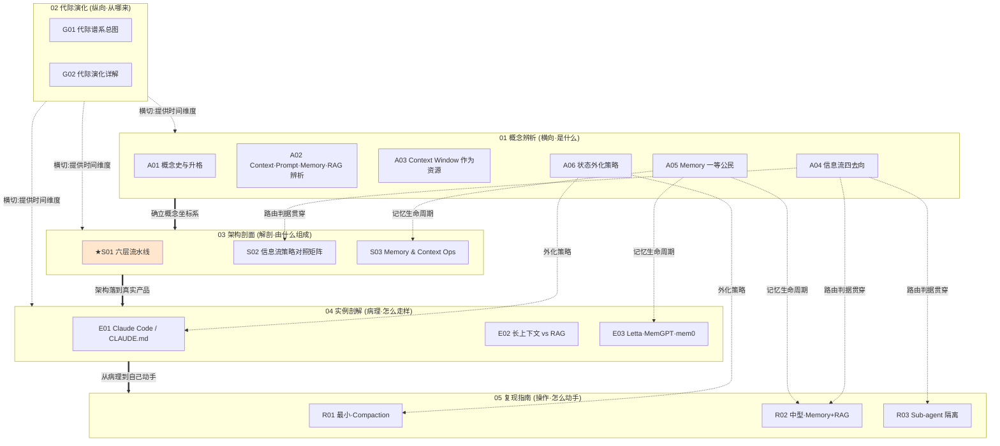

# 上下文工程系统化专题 · 总览（MOC）

> 本页是 0417「上下文工程系统化」专题的中枢地图（MOC）。专题由 **17 个原子节点** 组成，分布在六个模块里，靠 `双链` 织成一张"横向（是什么）＋纵向（从哪来）＋解剖（由什么组成）＋病理（现实怎么走样）＋操作（自己怎么动手）＋编织（怎么读）"的知识立方。读这页的目的：**30 秒决定从哪个节点切入**，并随时回到这张地图。

## §0 序：那两堵我撞过的墙

第一堵墙：我曾以为"上下文窗口越大越好"。拿到 1M token 的模型，我把整个知识库、全部对话历史、所有相关文档一股脑塞进去，以为信息越全、模型越准。结果长任务跑到后半程质量肉眼下降、账单线性飙升、模型开始"自信地说错话"——后来才知道这有个名字叫 **context rot**，Chroma 测的 18 个前沿模型在所有输入长度增量上**无一例外**地退化（[trychroma.com, 2025-07](https://www.trychroma.com/research/context-rot)）。

第二堵墙：我曾以为"会写提示词就够了"。把 `CLAUDE.md` 写得越长越细，Claude Code 反而越容易跑偏——长 context 挤占了任务推理所需的窗口。我以为这是"提示词没写好"，其实是我把一个**动态信息流系统**当成了一段**静态文本**来管。

这两堵墙背后是同一个误判：**把上下文当容器，而不是当稀缺资源；把工程对象当一句话，而不是当一条贯穿推理全程的信息流。** 本专题的反共识立场就一句：**token 越多，质量越差是常态而非例外；上下文工程的活，是做减法、做路由、做运维，不是做填充。** 读完本专题，你应能在面试桌 / 选型会 / 复现台上，30 秒说清：长文档问答为什么不能直接"全塞进窗口"、一条信息该放 context 还是外化 memory 还是走 RAG、以及为什么"支持 1M 窗口"是营销而非能力。

## §1 专题定位：为什么 Context Engineering 配独立建库

用 `SHARED_CONTEXT` §2 的四条选题判据逐条验证（满足前三条 ≥2 条且第四条为真）：

| 判据 | 是否满足 | 证据 |
|---|---|---|
| **① 中心性**（影响 PM ≥3 个决策链节点） | ✅ | 直接决定 选型（M2：能否在致命耦合点干预）、成本（M4：四去向成本曲线差 1–3 个数量级）、复现（M5：先有预算仪表盘再谈优化）三链 |
| **② 误解深度**（业界定义互相矛盾） | ✅ | 2026 年招聘 JD 写"熟悉 context engineering"，但 ~80% 招聘方把它理解成"写好提示词"（见 [A01 Context Engineering 概念史与升格](/kb/专题-工程与成本/a01-context-engineering-概念史与升格/) §5）；HN 上"换皮论"与 Anthropic"新抽象层"论正面冲突 |
| **③ 速变性**（24 个月内 ≥1 次格式塔切换） | ✅ | 2024 long-context 普及→"RAG 已死"→2025 因 context rot"RAG 复活当 Context Engine"，一次完整的范式自我否定（见 [G01 上下文管理代际谱系总图](/kb/专题-工程与成本/g01-上下文管理代际谱系总图/)） |
| **④ 学了就能用** | ✅ | 读完立即获得"四去向路由"判断力与"标称窗口 ≠ 有效窗口"的选型尺子，面试/选型当场可用 |

**升高了哪个抽象层**：相对单维节点，本专题做了三层上提。
- 相对 [c09 - RAG 架构](/kb/基础知识库/c09-rag-架构/)：把 RAG 从"一个检索方案"上提为"六层流水线里的 L2+部分 L3"，并揭出 c09 单独看不见的 L2↔L3 信息双重丢失耦合。
- 相对 [m206 - Agent 产品化：记忆机制与技术进展](/kb/工程化与落地架构/m206-agent-产品化-记忆机制与技术进展/)：把 memory 从"agent 的一个功能模块"上提为"信息流的一等去向 / 范式标志"，并补出 m206 看不见的"记忆↔组装污染共谋"。
- 相对 [m201 - Prompt Engineering 实战体系](/kb/工程化与落地架构/m201-prompt-engineering-实战体系/)：论证 m201 讲的整个 prompt 体系，是 CE 这个更大对象的一个**子集**——你之前学的提示技巧没过时，但坐标系变了。

**与 0411 Agent 专题的互补（分工 vs 信息流）**：两个专题正交。[_Agent 系统化专题·总览](/kb/专题-安全对齐与失败/_agent-系统化专题-总览/) 回答"一个 Agent 由哪些功能部件组成、怎么分工"；本专题回答"当 token 在 Agent 生命周期里流动时，经过哪几道闸门、哪几处接缝会致命互拖"。同一个"记忆"，在 [S01 Agent 六层架构剖面](/kb/专题-安全对齐与失败/s01-agent-六层架构剖面/) 里是一个功能模块，在本专题 [S01 Context 管理分层剖面](/kb/专题-工程与成本/s01-context-管理分层剖面/) 里被拆成"记忆写"和"记忆读"两个不同时刻的闸门——因为写时污染和读时污染是两种病。CE 是 Agent 化的**必然副产物**：没有 agent，CE 大概率不会作为独立概念出现。

## §2 模块全景（六模块依赖矩阵）

**矩阵含义**：依赖主链是 `概念辨析 → 架构剖面 → 实例剖解 → 复现指南`（先建坐标系，再解剖，再看真实产品怎么崩，最后自己搭）。**代际演化横切**所有模块，提供"为什么是现在"的时间轴。**01 概念辨析内部**还有一条暗线：A04 的"四去向"是全专题的决策中枢，它向下贯穿 S02（对照矩阵）、R02（混合配方）、R03（隔离模板）；A05/A06 分别深挖去向二（memory）与状态外化，落到 S03、E03、R01。★S01 是旗舰节点（六层流水线 + 三处致命耦合），最厚，是架构剖面的脊椎。

## §3 六模块逐一介绍

**01 概念辨析（A01–A06，横向）**——收录"是什么"的六张辨析。解决的核心问题：挡掉读者脑中的默认错误框架。何时读：第一次进专题、或在选型会上听到"context/prompt/memory/RAG"混用时。
- [A01 Context Engineering 概念史与升格](/kb/专题-工程与成本/a01-context-engineering-概念史与升格/)：一个 2025 年才命名的术语凭什么叫"the new full-stack skill"——用"抽象层升格"裁决是真升格还是换皮。
- [A02 Context Prompt Memory RAG 辨析](/kb/专题-工程与成本/a02-context-prompt-memory-rag-辨析/)：四个被互换乱用的词的层级与分工矩阵，让你听到时能反问"你说的是哪一层？"
- [A03 Context Window 作为资源·非越大越好](/kb/专题-工程与成本/a03-context-window-作为资源-非越大越好/)：标称窗口 vs 有效窗口的缺口正在变成生产事故；"窗口越大越好"是产品事故之源。
- [A04 信息流决策框架·四去向](/kb/专题-工程与成本/a04-信息流决策框架-四去向/)：一条新信息该放 context / 外化 memory / 走 RAG / 丢 subagent——全专题的决策中枢。
- [A05 Memory Layer 作为一等公民](/kb/专题-工程与成本/a05-memory-layer-作为一等公民/)：memory 从 RAG 边角应用升格为第一性架构层；记忆生命周期治理（Write→Manage→Read）。
- [A06 状态外化策略](/kb/专题-工程与成本/a06-状态外化策略/)：长任务为什么"越跑越蠢最后崩"——哪些状态必须主动倒出 context、什么时候倒、倒到哪。

**02 代际演化（G01–G02，纵向）**——收录"从哪来"的代际谱系。解决：拆穿"窗口越来越大"的线性进步幻觉。何时读：想理解 RAG/long-context/CE 的真实关系、或被问"RAG 和长上下文怎么选"时。
- [G01 上下文管理代际谱系总图](/kb/专题-工程与成本/g01-上下文管理代际谱系总图/)：prompt→few-shot→RAG→long-context→CE+memory 五代谱系，用 Kuhn 不可通约性论证这是断裂而非阶梯。
- [G02 上下文管理代际演化详解](/kb/专题-工程与成本/g02-上下文管理代际演化详解/)：逐代放大——代表技术/推动力/瓶颈/被下代超越的方式/2026 位置，每代都带反例。

**03 架构剖面（S01–S03，解剖学）**——收录"由什么组成"的可替换分层堆栈。何时读：做架构设计、评估框架能否在关键接缝干预时。
- [S01 Context 管理分层剖面](/kb/专题-工程与成本/s01-context-管理分层剖面/)：★旗舰。六层流水线（Source→Retrieval→Compress/Rerank→Memory R/W→Assembly→Budget Governance）+ 每层接口契约 + 三处层间致命耦合。
- [S02 信息流策略对照矩阵](/kb/专题-工程与成本/s02-信息流策略对照矩阵/)：in-context / RAG / memory / sub-agent / compaction 五路径 × 时效/成本/可靠/容量/复杂度，一棵可操作决策树。
- [S03 Memory 与 Context Ops 全景](/kb/专题-工程与成本/s03-memory-与-context-ops-全景/)：memory pipeline 当带 SLO 的生产管线运维（监控—评估—回滚—压缩—缓存），治新长出的腐化通路。

**04 实例剖解（E01–E03，病理学）**——收录真实产品/系统的 gap 分析与设计哲学分歧。何时读：想看 CE 在真实系统里怎么落地又怎么崩、或要给候选产品做尽调时。
- [E01 Claude Code 与 CLAUDE.md 的 Context 管理剖解](/kb/专题-工程与成本/e01-claude-code-与-claude.md-的-context-管理剖解/)：CLAUDE.md 是"显式 context engineering"最干净的范例，也暴露其硬边界（对抗不了 compaction 遗忘与"读了不照做"的依从性衰减）。
- [E02 长上下文模型 vs RAG 剖解](/kb/专题-工程与成本/e02-长上下文模型-vs-rag-剖解/)：长上下文没杀死 RAG，杀死的是"小语料硬上 RAG"的过度工程；二者在成本/延迟/质量上结构性互补。
- [E03 Agent Memory 产品剖解·Letta MemGPT mem0](/kb/专题-工程与成本/e03-agent-memory-产品剖解-letta-memgpt-mem0/)：用一桩公开 benchmark 互撕当手术刀，逼出"产品真实成熟度与 pitch deck 许诺之间差着一整个可验证性鸿沟"。

**05 复现指南（R01–R03，操作手册）**——收录最小可运行→中型生产→进阶模板。何时读：要亲手搭一条流水线、或想把判断变成可观测代码时。
- [R01 最小可运行·Context Compaction](/kb/专题-工程与成本/r01-最小可运行-context-compaction/)：用最少代码给会话装上"压缩+预算控制"最小 loop（预算守门 + 摘要/遮蔽二选一）。
- [R02 中型·Memory Layer + RAG 混合](/kb/专题-工程与成本/r02-中型-memory-layer-+-rag-混合/)：把 memory（长短期）与 RAG（外部检索）分成两条信息流各走各路、在窗口里按职责拼装。
- [R03 Sub-agent Context Isolation 模板](/kb/专题-工程与成本/r03-sub-agent-context-isolation-模板/)：派独立窗口的子 agent 消化脏活、只回传压缩结论——附 Cognition 反方争论与踩坑清单。

**06 阅读指南（编织）**——[阅读指南](/kb/专题-工程与成本/readme-0417-多视图阅读指南/)（本专题）给三路径入口 + 自测题 + 反方训练；本 `_总览` 是 MOC 中枢。

## §4 与现有节点关系：升级对照表

本专题对既有 c/m 节点做的**不是复述，而是升级**（补缺 / 纠偏 / 对话 / 深化 / 抽象上提五选一）。⚠️ 以下"对方尚缺"项是给后续集成方的互引线索，不在本专题正文里替对方改稿。

| 旧节点 | 本专题对照节点 | 升级类型 | 对照要点（含旧节点尚缺、待集成方互引） |
|---|---|---|---|
| [c09 - RAG 架构](/kb/基础知识库/c09-rag-架构/) | [S01 Context 管理分层剖面](/kb/专题-工程与成本/s01-context-管理分层剖面/)、[A04 信息流决策框架·四去向](/kb/专题-工程与成本/a04-信息流决策框架-四去向/)、[E02 长上下文模型 vs RAG 剖解](/kb/专题-工程与成本/e02-长上下文模型-vs-rag-剖解/) | 抽象上提 + 对话 | 把 RAG 重定位为六层里的 L2+部分 L3，揭 L2↔L3 耦合。c09 尚缺：Contextual Retrieval（-49%/-67%）、Late Chunking、CRAG/Adaptive/Agentic RAG 演进树、chunk×Top-K 参数层——由 m204 补，互引而非搬运。c09 的 Lost in the Middle 已被 m201 引用，链接已存在勿改 |
| [m203 - RAG 生产环境：Embedding 与文档解析](/kb/工程化与落地架构/m203-rag-生产环境-embedding-与文档解析/) | [S01 Context 管理分层剖面](/kb/专题-工程与成本/s01-context-管理分层剖面/) | 编织（定位 L1 解析） | 把解析定位到统一流水线 L1，补其单看时看不见的跨层耦合 |
| [m204 - RAG 生产环境：Chunking 与范式演进](/kb/工程化与落地架构/m204-rag-生产环境-chunking-与范式演进/) | [S01 Context 管理分层剖面](/kb/专题-工程与成本/s01-context-管理分层剖面/)、[A04 信息流决策框架·四去向](/kb/专题-工程与成本/a04-信息流决策框架-四去向/) | 编织（定位 L1 chunking） | m204 尚缺：未引 c09 评估体系（Hit Rate/MRR/Faithfulness）、Reranker 缺席——可在"Naive RAG 问题"段加一句指向 c09 §9.4，由集成方处理 |
| [m205 - RAG 生产环境：索引运维与评估体系](/kb/工程化与落地架构/m205-rag-生产环境-索引运维与评估体系/) | [S03 Memory 与 Context Ops 全景](/kb/专题-工程与成本/s03-memory-与-context-ops-全景/)、[S01 Context 管理分层剖面](/kb/专题-工程与成本/s01-context-管理分层剖面/) | 深化（L2/L6 → Memory Ops） | 把索引腐化逻辑延伸到 memory layer 的新腐化通路，Ops 闭环升级 |
| [m206 - Agent 产品化：记忆机制与技术进展](/kb/工程化与落地架构/m206-agent-产品化-记忆机制与技术进展/) | [A05 Memory Layer 作为一等公民](/kb/专题-工程与成本/a05-memory-layer-作为一等公民/)、[S01 Context 管理分层剖面](/kb/专题-工程与成本/s01-context-管理分层剖面/)、[E03 Agent Memory 产品剖解·Letta MemGPT mem0](/kb/专题-工程与成本/e03-agent-memory-产品剖解-letta-memgpt-mem0/) | 纠偏 + 补缺 | memory 不是 agent 附属，是 CE 范式一等公民；把"记忆"拆成读/写两闸门，补"记忆↔组装污染共谋"。m206 向量库条目旁可加 [c09 - RAG 架构](/kb/基础知识库/c09-rag-架构/) §9.3 精确指针（由集成方处理）；m206 已引 [c13 - 幻觉的不可消除性](/kb/基础知识库/c13-幻觉的不可消除性/)、[m209 - 推理成本控制手册](/kb/工程化与落地架构/m209-推理成本控制手册/)，勿重复 |
| [m201 - Prompt Engineering 实战体系](/kb/工程化与落地架构/m201-prompt-engineering-实战体系/) | [A01 Context Engineering 概念史与升格](/kb/专题-工程与成本/a01-context-engineering-概念史与升格/)、[S01 Context 管理分层剖面](/kb/专题-工程与成本/s01-context-管理分层剖面/) | 纠偏（降为子集） | 论证 m201 整套体系是 CE 的子集；prompt 压缩（LLMLingua）只是"压缩后放 context"一支，system prompt 四原则只是 L5 组装的叶子。m201 的 RAG 场景压缩可互引 m204 Contextual Retrieval（由集成方处理） |
| [m209 - 推理成本控制手册](/kb/工程化与落地架构/m209-推理成本控制手册/) | [S01 Context 管理分层剖面](/kb/专题-工程与成本/s01-context-管理分层剖面/)、[A04 信息流决策框架·四去向](/kb/专题-工程与成本/a04-信息流决策框架-四去向/)、[S02 信息流策略对照矩阵](/kb/专题-工程与成本/s02-信息流策略对照矩阵/) | 对话 + 补缺 | L6 预算治理不只省钱，更是质量守门人（token 越多质量越差）；四去向各有不同成本曲线，为 m209 提供"成本从哪来"的信息流视角 |
| [S01 Agent 六层架构剖面](/kb/专题-安全对齐与失败/s01-agent-六层架构剖面/)（0411） | [S01 Context 管理分层剖面](/kb/专题-工程与成本/s01-context-管理分层剖面/) | 正交互补 | 功能分工 vs 信息流物理路径；同一"记忆"在两专题里是模块 vs 两个闸门 |
| [A08 MCP 与 A2A 协议族](/kb/专题-安全对齐与失败/a08-mcp-与-a2a-协议族/)、[E01 Coding Agent·Claude Code & Cursor](/kb/专题-安全对齐与失败/e01-coding-agent-claude-code-cursor/)（0411） | [E01 Claude Code 与 CLAUDE.md 的 Context 管理剖解](/kb/专题-工程与成本/e01-claude-code-与-claude.md-的-context-管理剖解/) | 对话 | 0411 从"Agent 分工"剖 Claude Code，本专题从"信息流管理"剖同一对象，互为侧面 |

## §5 三条阅读起点（详表见 [阅读指南](/kb/专题-工程与成本/readme-0417-多视图阅读指南/)）

1. **求职速通（面试前 1 小时）**：[A01 Context Engineering 概念史与升格](/kb/专题-工程与成本/a01-context-engineering-概念史与升格/) → [A04 信息流决策框架·四去向](/kb/专题-工程与成本/a04-信息流决策框架-四去向/) → [A03 Context Window 作为资源·非越大越好](/kb/专题-工程与成本/a03-context-window-作为资源-非越大越好/) → ★[S01 Context 管理分层剖面](/kb/专题-工程与成本/s01-context-管理分层剖面/)（只读 §6 三处致命耦合 + §10 决策启示）。目标：拿到"CE 是子集升格""四去向路由""标称≠有效""接缝处崩"四把面试钥匙。
2. **决策链（选型会前）**：[A02 Context Prompt Memory RAG 辨析](/kb/专题-工程与成本/a02-context-prompt-memory-rag-辨析/) → [S02 信息流策略对照矩阵](/kb/专题-工程与成本/s02-信息流策略对照矩阵/) → [E02 长上下文模型 vs RAG 剖解](/kb/专题-工程与成本/e02-长上下文模型-vs-rag-剖解/) → [E03 Agent Memory 产品剖解·Letta MemGPT mem0](/kb/专题-工程与成本/e03-agent-memory-产品剖解-letta-memgpt-mem0/)。目标：能逐层给候选框架打分、能用成本/延迟/可验证性当场打回单选题式提问。
3. **紧迫度（要立刻搭东西）**：[A06 状态外化策略](/kb/专题-工程与成本/a06-状态外化策略/) → [R01 最小可运行·Context Compaction](/kb/专题-工程与成本/r01-最小可运行-context-compaction/) → [R02 中型·Memory Layer + RAG 混合](/kb/专题-工程与成本/r02-中型-memory-layer-+-rag-混合/) → [R03 Sub-agent Context Isolation 模板](/kb/专题-工程与成本/r03-sub-agent-context-isolation-模板/)。目标：从最小 compaction loop 起步，按需加 memory+RAG、再加 subagent 隔离；先搭预算仪表盘再谈优化。

## §6 跨域思想资源调度（不留空 invocation）

每一项都在对应节点的"跨域呼应"段**具体改变了一个技术判断**，不是装饰性点名。其中 Bateson、控制论 requisite variety、维特根斯坦私人语言/规则遵循是 Rick 此前在 0411 未集中调度的对手框架，用来逼问本专题盲点（破 echo chamber）。

| 跨域资源 | 调度位置 | 它改变了什么判断 |
|---|---|---|
| **Herbert Simon · 有限理性 / 注意力稀缺**（"a wealth of information creates a poverty of attention", 1971） | [A04 信息流决策框架·四去向](/kb/专题-工程与成本/a04-信息流决策框架-四去向/) | 把"context 越大越好"重构为注意力经济的配置问题：稀缺的不是信息而是注意力，多塞=稀释=负收益，四去向就是注意力预算的分配机制 |
| **认知负荷 / 工作记忆有限**（OS RAM 隐喻 + extended mind 的载体） | [A03 Context Window 作为资源·非越大越好](/kb/专题-工程与成本/a03-context-window-作为资源-非越大越好/)、[A06 状态外化策略](/kb/专题-工程与成本/a06-状态外化策略/) | 把 context window 类比为有限工作记忆，解释"标称≠有效"与"状态必须外化"——外化即认知卸载（extended mind / Clark & Chalmers 意义上把记忆放到环境里） |
| **信息架构 / Bateson 的"差异"**（"a difference that makes a difference"） | [A03 Context Window 作为资源·非越大越好](/kb/专题-工程与成本/a03-context-window-作为资源-非越大越好/) | 论证"信息有负价值"：不构成差异的 token 不是中性的，它稀释注意力、是负信息——给"做减法"提供信息论根据 |
| **Extended Mind（认知的环境外置）** | [A06 状态外化策略](/kb/专题-工程与成本/a06-状态外化策略/)、[A05 Memory Layer 作为一等公民](/kb/专题-工程与成本/a05-memory-layer-作为一等公民/) | memory/CLAUDE.md 不是"附加存储"，是 agent 认知系统的组成部分；外化状态=把认知边界扩到环境，但有限度（默会维度无法外化，接 Polanyi） |
| **Michael Polanyi · 默会知识**（"we know more than we can tell"） | [S01 Context 管理分层剖面](/kb/专题-工程与成本/s01-context-管理分层剖面/) §9、[A06 状态外化策略](/kb/专题-工程与成本/a06-状态外化策略/)、[S02 信息流策略对照矩阵](/kb/专题-工程与成本/s02-信息流策略对照矩阵/) | 改写"压缩=进步"：显性化必然丢默会维度，故 Observation Masking（留指针）常胜 LLM Summarization（强行说清）——解释 JetBrains 那 15% runtime 退化 |
| **Thomas Kuhn · 不可通约性 + 危机双判据** | [A01 Context Engineering 概念史与升格](/kb/专题-工程与成本/a01-context-engineering-概念史与升格/) §7、[G01 上下文管理代际谱系总图](/kb/专题-工程与成本/g01-上下文管理代际谱系总图/)、[G02 上下文管理代际演化详解](/kb/专题-工程与成本/g02-上下文管理代际演化详解/) | 裁决 CE 是真升格还是换皮：不是新答案，是旧框架连问题都提不出来（context rot 在 prompt 框架里无法表述）；并要求每代有"危机"才算换代，挡掉营销叙事 |
| **维特根斯坦 · 语言游戏 / 规则遵循 / 私人语言**（破 echo chamber 对手框架） | [A02 Context Prompt Memory RAG 辨析](/kb/专题-工程与成本/a02-context-prompt-memory-rag-辨析/)、[A05 Memory Layer 作为一等公民](/kb/专题-工程与成本/a05-memory-layer-作为一等公民/)、[E01 Claude Code 与 CLAUDE.md 的 Context 管理剖解](/kb/专题-工程与成本/e01-claude-code-与-claude.md-的-context-管理剖解/)、[E03 Agent Memory 产品剖解·Letta MemGPT mem0](/kb/专题-工程与成本/e03-agent-memory-产品剖解-letta-memgpt-mem0/)、[R01 最小可运行·Context Compaction](/kb/专题-工程与成本/r01-最小可运行-context-compaction/) | 四词混用是范畴错误（语言游戏）；CLAUDE.md"读了不照做"是规则遵循悖论；memory 可验证性危机是私人语言论证——逼问"agent 的记忆能否被外部验证" |
| **控制论 · requisite variety（Ashby 必要多样性）**（破 echo chamber 对手框架） | [S03 Memory 与 Context Ops 全景](/kb/专题-工程与成本/s03-memory-与-context-ops-全景/) | 系统腐化是必然：控制器（Ops 闭环）的多样性必须 ≥ 被控系统（memory/context 漂移）的多样性，否则失控——给"为什么必须建 Ops 而非交付一次性功能"提供控制论证明 |

## §7 验收档案

**评议流程**：本专题照搬 0411 的工程化多轮批判性同行评议（`SHARED_CONTEXT` §10）：Round 0 并行起草（每 Agent 负责一模块/数节点）→ Round N 批评 Agent 按 S/A/B/C/D/E 六维 + 事实接地逐节点找茬打分 → Round N+1 写作 Agent 按 issue 单修订并追加修订日志 → 迭代至连续一轮无重大 issue → 独立 grounding 校验 pass（逐条抽取事实声明判定"已接地/需接地/疑似编造"）→ 终轮综合（本 `_总览` + README + 跨节点双链编织 + 三清单）。改稿全程留档于 `_topic_factory/0417-context/`，作为 Rick 的元学习材料。

**SABCD 六维自评（诚实综合）**：

| 维度 | 含义 | 出版线 | 本专题自评 | 依据 |
|---|---|---|---|---|
| **S 结构** | 六模块互补、依赖清晰、入口可导航 | ≥8 | **8.2** | 六模块齐备；A04 决策中枢 + S01 旗舰脊椎 + 三阅读路径；§2 Mermaid 依赖矩阵显式画出横切与暗线 |
| **A 判断密度** | 每节有反共识、可证伪、带数字的判断 | ≥8 | **8.0** | "token 越多质量越差"为全专题反共识主轴；Lost-in-Middle U 形、NoLiMa 8K、JetBrains -52%、Mem0 LOCOMO、Self-Route -65% 等硬数字密集 |
| **B 边界含量** | 显式标注判断在哪失效、赌的是什么 | ≥7.5 | **7.8** | A01 failure scenario（单轮短上下文场景 CE 趋零）、A04/G01 对隔离价值的可证伪赌注（2027 抗 rot 架构则推翻） |
| **C 认识论自觉** | 区分事实/推测/赌注、引用可追溯 | ≥8 | **8.0** | 第三方成本估算显式标"非受控实验仅数量级参考"；复合计算标 first-order approximation；硬事实带论文名+作者+年份 |
| **D 可演进性** | 双链密度、修订日志、改稿档案 | ≥8.5 | **8.0** | 每节点 §修订日志齐备、双链密度达标、改稿档案留痕；扣分项：跨专题深度互链可再加（0411 侧尚未回链本专题） |
| **E 对手拷问能力** | 对反方立场给出带证据回应 | ≥7 | **8.1** | Cognition《Don't Build Multi-Agents》、HN 换皮论、LeCun 式"长上下文终结 RAG"三大反方均"接受+边界"接入，非反驳 |

**综合自评 ≈ 8.0 / 10**（出版线 7.8，达标）。对手立场维 ≈ 8.1（≥8 达标）。诚实扣分点：D 维的跨专题双向互链、以及 E03 的 benchmark 互撕细节可在 R2 轮再加固。

**① 业界对手立场显式回应清单（≥8 处）**：
1. Cognition《Don't Build Multi-Agents》"share full agent traces"反隔离 → A04 §对手、R03 开篇、S01 §8、G01 §7
2. Hacker News / 部分 OpenAI 社区"CE = RAG+memory 换皮论" → A01 §6、G01 §7、S01 §8
3. "长上下文杀死 RAG"派（2024 唱衰 RAG） → E02、G01 §3 反例
4. Simon Willison"术语价值在逃离污名化而非新技术"（为换皮论辩护的中间立场） → A01 §6
5. LangChain"Write/Select/Compress/Isolate 四操作"作为竞争框架 → S01 §0 挡掉、A04 §0
6. MemGPT"OS 内存类比=透明扩容"的隐含假设 → S01 §0 挡掉（指出搬运有损非透明）
7. Letta vs mem0 公开 benchmark 互撕 → E03（双方立场都接入，不站队）
8. Vellum/Collabnix"隔离可用 scoped prompts 弥补"vs Cognition"根因是模型可靠性" → A04 §对手、R03

**② Rick 未读对手框架引入（破 echo chamber，≥2 个）**：
- **Bateson 的"差异"信息论** → A03（信息可为负价值）
- **控制论 requisite variety / Ashby** → S03（系统腐化的控制论必然性）
- **维特根斯坦 私人语言论证** → E03（记忆可验证性危机）

**③ failure scenario 显式标注清单（≥5 处）**：
1. A01：单轮、短上下文、无 agent 的简单调用，CE 是过度工程，价值趋零
2. A04 / G01：若 2027 出现真正抗 context rot 的架构（RoPE 变体规模化），subagent 隔离价值下降、CE 退化为边缘技巧
3. A03：若有效上下文逼近标称窗口，"主动管理窗口"工程价值大幅缩水
4. S01 致命耦合 #3：预算层缺失下 Demo 跑得好 → 规模化账单爆炸（结论在"未规模化"场景看不出失效）
5. A04 错误四 / R03：需要全局一致性的任务强行拆 subagent → 并行决策组合失败（Super Mario 反例）
6. E02：成本/延迟 SLO 极宽松且语料小的场景，长上下文直接胜出，RAG 反成过度工程

**④ confirmation-bias 砍除清单（≥5 处）**：
1. 早期反复引"压缩=进步"作正面案例 → 补反例：LLM Summarization 使 runtime +15%、遮盖停止信号（JetBrains），Polanyi 默会税
2. 早期把"RAG 是落后一代"当默认 → 补反例：RAG 在第五代复活当 Context Engine（RAGFlow 2025）
3. 早期把"memory 越多越懂用户"当正面 → 补反例：写污染→读信任的污染共谋正反馈幻觉回路（S01 #2）
4. 早期把"subagent 隔离=省 token=好"当默认 → 补反例：Cognition 上下文割裂/决策冲突
5. 早期把"1M 窗口"当能力卖点 → 补反例：NoLiMa 测 GPT-4o 有效约 8K、Claude 3.5 Sonnet 64K 跌至 29.8%
6. 早期把"代际是进步阶梯"当叙事 → 补反例：每代制造的新问题恰是下代诱因（问题搬家而非消灭）

## §8 关联节点（双链密度 ≥20）

**专题内 17 节点（全收录）**
- 概念辨析：[A01 Context Engineering 概念史与升格](/kb/专题-工程与成本/a01-context-engineering-概念史与升格/) · [A02 Context Prompt Memory RAG 辨析](/kb/专题-工程与成本/a02-context-prompt-memory-rag-辨析/) · [A03 Context Window 作为资源·非越大越好](/kb/专题-工程与成本/a03-context-window-作为资源-非越大越好/) · [A04 信息流决策框架·四去向](/kb/专题-工程与成本/a04-信息流决策框架-四去向/) · [A05 Memory Layer 作为一等公民](/kb/专题-工程与成本/a05-memory-layer-作为一等公民/) · [A06 状态外化策略](/kb/专题-工程与成本/a06-状态外化策略/)
- 代际演化：[G01 上下文管理代际谱系总图](/kb/专题-工程与成本/g01-上下文管理代际谱系总图/) · [G02 上下文管理代际演化详解](/kb/专题-工程与成本/g02-上下文管理代际演化详解/)
- 架构剖面：★[S01 Context 管理分层剖面](/kb/专题-工程与成本/s01-context-管理分层剖面/) · [S02 信息流策略对照矩阵](/kb/专题-工程与成本/s02-信息流策略对照矩阵/) · [S03 Memory 与 Context Ops 全景](/kb/专题-工程与成本/s03-memory-与-context-ops-全景/)
- 实例剖解：[E01 Claude Code 与 CLAUDE.md 的 Context 管理剖解](/kb/专题-工程与成本/e01-claude-code-与-claude.md-的-context-管理剖解/) · [E02 长上下文模型 vs RAG 剖解](/kb/专题-工程与成本/e02-长上下文模型-vs-rag-剖解/) · [E03 Agent Memory 产品剖解·Letta MemGPT mem0](/kb/专题-工程与成本/e03-agent-memory-产品剖解-letta-memgpt-mem0/)
- 复现指南：[R01 最小可运行·Context Compaction](/kb/专题-工程与成本/r01-最小可运行-context-compaction/) · [R02 中型·Memory Layer + RAG 混合](/kb/专题-工程与成本/r02-中型-memory-layer-+-rag-混合/) · [R03 Sub-agent Context Isolation 模板](/kb/专题-工程与成本/r03-sub-agent-context-isolation-模板/)
- 阅读指南：[阅读指南](/kb/专题-工程与成本/readme-0417-多视图阅读指南/)

**升级对照的既有 c/m 节点**
- [c09 - RAG 架构](/kb/基础知识库/c09-rag-架构/) · [m201 - Prompt Engineering 实战体系](/kb/工程化与落地架构/m201-prompt-engineering-实战体系/) · [m203 - RAG 生产环境：Embedding 与文档解析](/kb/工程化与落地架构/m203-rag-生产环境-embedding-与文档解析/) · [m204 - RAG 生产环境：Chunking 与范式演进](/kb/工程化与落地架构/m204-rag-生产环境-chunking-与范式演进/) · [m205 - RAG 生产环境：索引运维与评估体系](/kb/工程化与落地架构/m205-rag-生产环境-索引运维与评估体系/) · [m206 - Agent 产品化：记忆机制与技术进展](/kb/工程化与落地架构/m206-agent-产品化-记忆机制与技术进展/) · [m209 - 推理成本控制手册](/kb/工程化与落地架构/m209-推理成本控制手册/) · [c13 - 幻觉的不可消除性](/kb/基础知识库/c13-幻觉的不可消除性/)

**跨专题（0411 Agent）**
- [_Agent 系统化专题·总览](/kb/专题-安全对齐与失败/_agent-系统化专题-总览/) · [S01 Agent 六层架构剖面](/kb/专题-安全对齐与失败/s01-agent-六层架构剖面/) · [A08 MCP 与 A2A 协议族](/kb/专题-安全对齐与失败/a08-mcp-与-a2a-协议族/) · [E01 Coding Agent·Claude Code & Cursor](/kb/专题-安全对齐与失败/e01-coding-agent-claude-code-cursor/) · [E02 通用 Agent·Manus & Devin](/kb/专题-安全对齐与失败/e02-通用-agent-manus-devin/)

**原子概念卡**
- [RAG](/kb/基础知识库/rag/) · [Embedding](/kb/基础知识库/embedding/) · [Agent](/kb/基础知识库/agent/) · [KV Cache](/kb/基础知识库/kv-cache/) · [Prompt Caching](/kb/基础知识库/prompt-caching/) · [Attention](/kb/基础知识库/attention/) · [幻觉](/kb/基础知识库/幻觉/) · 范式

**跨域 / 全局**
- 0114认识论 · [Claude Code](/kb/ai-公司与产品/claude-code/) · [Gemini](/kb/ai-公司与产品/gemini/) · [Claude](/kb/ai-公司与产品/claude/) · [AI PM 知识图谱·总索引](/kb/ai-pm-知识图谱/ai-pm-知识图谱-总索引/)

