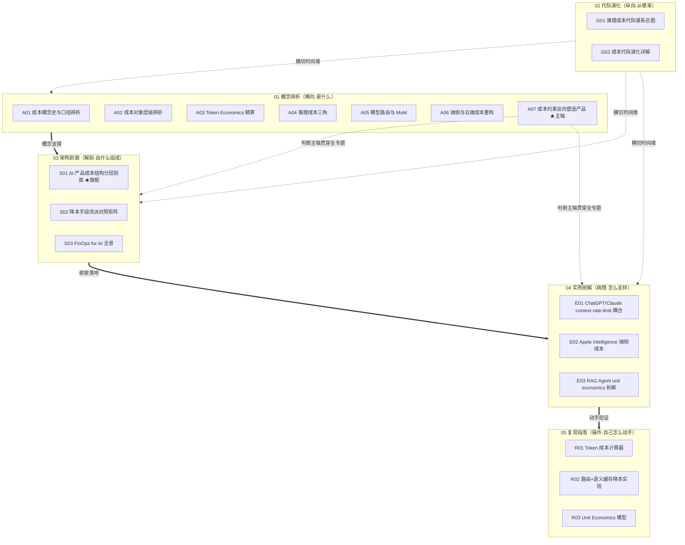

# 成本工程系统化专题 · 总览（MOC）

> 本页是 `0413 成本工程系统化专题` 的导航中枢（MOC）。它不复述各节点的事实，只回答四件事：**这个专题为什么存在、由什么组成、与你已有的知识网络怎么对接、以及它对自己有多诚实。** 想直接进正文，跳到 [§5 三条阅读起点](#§5-三条阅读起点)。

---

## §0 序：那堵叫"你算过 token 账吗"的墙

2025 到 2026 年，Rick 在面试桌和评审会上反复撞同一堵墙：**作为 PM，他说不清一次对话到底花多少钱，于是整场被工程带节奏。** 工程同学一句"output token 比 input 贵几倍、上下文越长越烧显存、得上量化和路由"，PM 听得懂每个词，却接不上话——因为他从没把"per-token 单价"换算成"per-user 月成本"，更没把它接到毛利和定价上。结果是：要么对工程的降本方案照单全收（不知道哪条值得做、降多少），要么在定价会上拍脑袋报一个免费额度，三个月后被账单打脸。这堵墙的本质不是 PM 不懂技术，而是**成本在 AI 产品里从"会计科目"变成了"产品设计的第一性约束"，而多数 PM 还用 SaaS 的边际成本≈0 直觉在思考。**

业界的默认止血方案是"等模型降价"——token 价格确实在以惊人速度下降（详见 [G01 推理成本代际谱系总图](/kb/专题-工程与成本/g01-推理成本代际谱系总图/)）。本专题的反共识立场正相反：**降价不会让成本问题消失，只会让它换个地方爆。** 这是 Jevons 悖论在 AI 上的复演——单位成本越低，调用量、上下文长度、推理深度（reasoning token）涨得越凶，总账单往往不降反升。成本工程不是"等便宜"，是**主动把成本约束当成产品的塑形力量**：context 上限、rate limit、优雅降级、免费额度——这些你以为是"产品决策"的东西，全是成本结构倒逼出来的（见 [A07 成本约束反向塑造产品](/kb/专题-工程与成本/a07-成本约束反向塑造产品/)）。

**读完这个专题，你应当能在 30 秒内做到三件事**：(1) 听到任何一个 AI 产品，立刻拆出它的 per-token → per-query → per-user 成本链，并说出毛利大概在哪个区间；(2) 拿到工程的降本方案，说清"这条降多少、代价是什么质量损失、值不值得做"；(3) 反过来用成本约束设计产品——知道 context 上限和 rate limit 该卡在哪、免费额度怎么定才不破产。这不是"了解一下"，是面试桌、评审会、复现台上立即可观测的判断力。

---

## §1 专题定位：为什么单独建 0413

按宪章 §2 的四条选题判据逐条论证——前三条满足 ≥2 即可，第四条须为真。成本工程**四条全中**，这是它配独立建库、而非塞进 [m209 - 推理成本控制手册](/kb/工程化与落地架构/m209-推理成本控制手册/) 一个章节的硬理由。

| 判据 | 成本工程命中情况 | 证据 |
|---|---|---|
| **① 中心性**（影响 ≥3 个 PM 决策链节点） | ✅ 命中（最强） | 定价（毛利由 per-user COGS 决定）、功能设计（context 上限/rate limit 是成本约束）、技术选型（路由/缓存/量化/端侧的取舍）、商业模式（免费额度=获客成本）、合规（端侧分流=隐私-成本权衡）——五个决策链节点全被成本穿过 |
| **② 误解深度**（口径互相矛盾、系统性滑变） | ✅ 命中 | 拿 per-token 成本谈 per-user 盈利是普遍错位（见 [A02 成本对象层级辨析·per-token per-query per-task per-user per-seat](/kb/专题-工程与成本/a02-成本对象层级辨析-per-token-per-query-per-task-per-user-per-seat/)）；COGS/CAC/LTV/gross margin 在 AI 产品里的含义与 SaaS 系统性不同（见 [A01 成本概念史与口径辨析](/kb/专题-工程与成本/a01-成本概念史与口径辨析/)），但 JD 与白皮书混着用 |
| **③ 速变性**（24 个月内 ≥1 次格式塔切换） | ✅ 命中 | token 价格两年内下降一个数量级（详见 [G01 推理成本代际谱系总图](/kb/专题-工程与成本/g01-推理成本代际谱系总图/)）、Prompt Caching 从无到成为各家标配（2024）、reasoning/thinking token 单独计费（2025）改写整张成本表——降本手段代际更替快于产品迭代 |
| **④ 学了就能用**（面试/选型/复现立即获判断力） | ✅ 为真 | 每个节点都落"面试怎么用/选型怎么用/复现怎么用"三类，复现模块直接给可跑的成本计算器（[R01 最小可运行·Token 成本计算器](/kb/专题-工程与成本/r01-最小可运行-token-成本计算器/)）与 unit economics 表（[R03 Unit Economics 模型·CAC COGS LTV 与盈亏平衡](/kb/专题-工程与成本/r03-unit-economics-模型-cac-cogs-ltv-与盈亏平衡/)） |

**它升高了哪个抽象层？** 现有的 [m209 - 推理成本控制手册](/kb/工程化与落地架构/m209-推理成本控制手册/) / [c05 - 算力物理定律与 KV Cache](/kb/基础知识库/c05-算力物理定律与-kv-cache/) / [c07 - 量化 Quantization 与端侧部署](/kb/基础知识库/c07-量化-quantization-与端侧部署/) / [m202 - 工程选型决策矩阵](/kb/工程化与落地架构/m202-工程选型决策矩阵/) 都是**单维节点**——m209 讲"怎么降推理成本"（缓存/路由/语义缓存/对话压缩）、c05 讲"KV Cache 的物理上限"、c07 讲"量化怎么降部署成本"、m202 讲"选型时怎么算隐性成本"。它们各自正确，但都停在"用哪个降本手段、怎么实现"这一**工程降本**层。0413 升高一个抽象层：**把成本本身当成一个有口径、有计量层级、有代际谱系、会反向塑造产品、最终落到 unit economics 与毛利的系统来解剖**——从"怎么把单次推理做便宜"升到"成本从哪来、按什么口径计量、由什么手段构成、怎么倒逼产品、最终怎么决定一个 AI 产品能不能赚钱"。这是从"工程降本"到"成本即商业模式"的视角跃迁。

> [!note] 与 0411 Agent / 0412 评测专题的关系
> 0413 是 0411/0412 的**成本层姊妹专题**。0411 的 [S01 Agent 六层架构剖面](/kb/专题-安全对齐与失败/s01-agent-六层架构剖面/) 讲 Agent 能力，0413 的 [E03 一个 RAG Agent 产品的 unit economics 拆解](/kb/专题-工程与成本/e03-一个-rag-agent-产品的-unit-economics-拆解/) 拆这些能力的账单——一个多步 Agent 的 per-query 成本是单次对话的几倍到几十倍（每步都过一次推理 + 重试），这是 0411 没算的那笔账。0412 评测讲"分数可信吗"，0413 讲"这个分数值这个价吗"——SWE-bench 高分若靠堆 reasoning token 和多次采样换来，per-task 成本可能高到产品化不可行。三个专题的 G01（代际谱系）共享同一方法论骨架（库恩+拉卡托斯读代际、每代配反例、拒绝线性进步史），可对照阅读。

---

## §2 模块全景：六模块矩阵与依赖

本专题 18 个内容节点 + 本总览 + README（共 20 个文件）分布在宪章规定的六模块骨架上。下图是六模块的依赖与横切关系。

**矩阵含义**：依赖主链是 `概念辨析 → 架构剖面 → 实例剖解 → 复现指南`（先厘清口径、再看成本结构、再看真实产品怎么被成本塑形、最后亲手算账）。**代际演化（G01/G02）横切**所有模块，提供时间维度——任何一个口径/手段/实例都能在降本代际谱系里定位（Dense→MoE→量化→投机解码→缓存→端侧）。**A07 成本约束反向塑造产品是判断主轴**，它不是普通概念卡，而是统辖整个专题的元判断（"你以为的产品决策，多半是成本约束的影子"），向架构与实例两个模块渗透。阅读指南（本总览 + README）**反向编织**，把这张网拆成多条可读路径。

> [!note] 一处结构说明
> 宪章 §3 建议代际演化模块 2–3 个节点；本专题 02 模块规划了 G01（谱系总图）+ G02（逐代详解）两个节点，符合规格。01 概念辨析 7 个（A01–A07）、03 架构剖面 3 个、04 实例剖解 3 个、05 复现指南 3 个，模块节点数分布较 0412 更均衡。**结构上的已知风险**：A03（Token Economics）、A04（推理成本三角）、A05（模型路由）与 [m209 - 推理成本控制手册](/kb/工程化与落地架构/m209-推理成本控制手册/) 既有 §2.6 高度重叠，必须靠"升高抽象层 + 不复述事实基础"来证明独立价值（见 §4），否则会沦为 m209 的转写——这是本专题相对 0412 更尖锐的"孤岛/复述"风险，记入 §7 验收档案。

---

## §3 六模块逐一介绍

### 01 概念辨析（A01–A07）—— 横向：先厘清"成本"这个词在每次使用时到底指哪个口径
**收录什么**：七个把单一概念讲透的原子节点。[A01 成本概念史与口径辨析](/kb/专题-工程与成本/a01-成本概念史与口径辨析/)（token 计费/推理成本/TCO/unit economics 四种口径之辨 + COGS·CAC·LTV·gross margin 在 AI 产品里 vs SaaS 的差异）、[A02 成本对象层级辨析·per-token per-query per-task per-user per-seat](/kb/专题-工程与成本/a02-成本对象层级辨析-per-token-per-query-per-task-per-user-per-seat/)（五种计量口径的换算与错配——拿 per-token 谈 per-user 盈利）、[A03 Token Economics 精算](/kb/专题-工程与成本/a03-token-economics-精算/)（input/output 价差、prompt/completion、KV cache 成本含义、batching、prefix/prompt caching 折扣）、[A04 推理成本三角·模型大小 延迟 质量](/kb/专题-工程与成本/a04-推理成本三角-模型大小-延迟-质量/)（模型大小×延迟×质量的三角权衡 + inference scaling）、[A05 模型路由与 Mixture-of-models](/kb/专题-工程与成本/a05-模型路由与-mixture-of-models/)（cascade/router、便宜模型兜底、语义缓存、复杂任务升级）、[A06 端侧与云端成本重构](/kb/专题-工程与成本/a06-端侧与云端成本重构/)（Apple Intelligence 端侧分流、量化降本、边缘部署、隐私-成本权衡）、[A07 成本约束反向塑造产品](/kb/专题-工程与成本/a07-成本约束反向塑造产品/)（★判断主轴——context 上限/rate limit/优雅降级/免费额度都是成本倒逼的产品决策）。
**解决什么问题**：挡掉"成本=便宜就好、等模型降价就行"这个把多口径正交概念压成"单价"的默认错误框架。
**何时读**：被一个成本数字或口径绕晕、或要在评审会上拆穿"这个降本方案到底降的是哪笔账"时——这是全专题的"口径层"。

### 02 代际演化（G01–G02）—— 纵向：成本不是线性下降，是每代降本手段触顶后被下一代接力
**收录什么**：[G01 推理成本代际谱系总图](/kb/专题-工程与成本/g01-推理成本代际谱系总图/)（降本代际：Dense→MoE→量化→投机解码→缓存→端侧 + token 价格历史下降曲线带真实数字与年份）、[G02 成本代际演化详解](/kb/专题-工程与成本/g02-成本代际演化详解/)（逐代展开：代表技术/产品、推动力、瓶颈、被下一代如何超越、2026 当下位置）。
**解决什么问题**：用库恩范式更替 + 拉卡托斯纲领退化两把尺，破除"成本一路狂降"式线性叙事，让你看清每代降本手段的瓶颈（如量化的质量损失天花板、缓存的命中率上限），判断厂商的"又降价了"是真进步还是把成本挪到了别处（如 reasoning token）。
**何时读**：看到"token 又降价了/某新技术降本 80%"、想判断该不该为这个降本付迁移成本时。

### 03 架构剖面（S01–S03）—— 解剖学：AI 产品的成本由什么可替换组件组成
**收录什么**：[S01 AI 产品成本结构分层剖面](/kb/专题-工程与成本/s01-ai-产品成本结构分层剖面/)（★旗舰节点，最厚——从底层算力/KV Cache 到 API 计费到 per-user COGS 的成本分层堆栈 + 各层接口 + 致命耦合点）、[S02 降本手段流派对照矩阵](/kb/专题-工程与成本/s02-降本手段流派对照矩阵/)（量化·蒸馏·MoE·缓存·路由·batching·投机解码 × 维度【降本幅度/质量代价/实现复杂度/适用场景】对照矩阵）、[S03 FinOps for AI·成本可观测与归因全景](/kb/专题-工程与成本/s03-finops-for-ai-成本可观测与归因全景/)（AI 成本可观测、按功能/用户/租户归因、预算告警、成本回归、成本 drift）。
**解决什么问题**：把散落在 m209/c05/c07 的降本知识拉到"成本作为可分层、可归因、会随用量与上下文 drift 的系统"这一更高抽象层。
**何时读**：要从零搭一套成本核算/降本体系、或要给一笔失控的账单做归因定位时——这是全专题的"承重梁"。

### 04 实例剖解（E01–E03）—— 病理学：三具真实标本怎么被成本塑形
**收录什么**：[E01 ChatGPT 与 Claude 的 context rate-limit 产品成本耦合剖解](/kb/专题-工程与成本/e01-chatgpt-与-claude-的-context-rate-limit-产品成本耦合剖解/)（剖 ChatGPT/Claude 的 context 上限、rate limit、订阅分层如何由成本结构反推）、[E02 Apple Intelligence 与端侧推理成本剖解](/kb/专题-工程与成本/e02-apple-intelligence-与端侧推理成本剖解/)（剖 Apple Intelligence 端侧+私有云分流的成本与隐私策略）、[E03 一个 RAG Agent 产品的 unit economics 拆解](/kb/专题-工程与成本/e03-一个-rag-agent-产品的-unit-economics-拆解/)（端到端拆一个 RAG/Agent 产品的 per-query 成本【embedding+检索+生成+重试】与 per-user 月成本、毛利）。
**解决什么问题**：把架构剖面的抽象框架钉进三个你天天会遇到的真实成本系统，证明"成本反向塑造产品""per-token≠per-user"不是泛泛之论。
**何时读**：正在分析 ChatGPT/Claude 的产品限制为什么这么设、评估端侧方案、或要拆一个 Agent 产品能不能赚钱时——对症查阅。

### 05 复现指南（R01–R03）—— 操作手册：从单价表到肉身确认的毛利
**收录什么**：[R01 最小可运行·Token 成本计算器](/kb/专题-工程与成本/r01-最小可运行-token-成本计算器/)（按真实定价参数化算一次对话/任务成本，含 input/output/缓存/重试，把"贵不贵"变成具体数字）、[R02 中型·模型路由 + 语义缓存 降本实验](/kb/专题-工程与成本/r02-中型-模型路由-+-语义缓存-降本实验/)（搭 router【便宜模型兜底+强模型升级】+语义缓存，实测降本幅度与质量回退）、[R03 Unit Economics 模型·CAC COGS LTV 与盈亏平衡](/kb/专题-工程与成本/r03-unit-economics-模型-cac-cogs-ltv-与盈亏平衡/)（建一张 AI 产品 unit economics 表：per-user COGS+CAC+LTV+毛利+盈亏平衡点 + 敏感性分析）。
**解决什么问题**：把概念辨析里的判断变成可贴进评审 deck、可在定价会摊开的具体毛利数字。
**何时读**：读完概念想动手、或要在面试里证明"我真算过一个 AI 产品的账"时。

---

## §4 与现有节点关系：升级对照表

本专题不复述旧节点的事实，而是在更高抽象层做"补缺/纠偏/对话/深化"。下表是逐对照应（详见各节点"与已有节点的关系"段）。

| 旧节点 | 本专题哪些节点升级了它 | 升级类型 | 升级了什么 |
|---|---|---|---|
| [m209 - 推理成本控制手册](/kb/工程化与落地架构/m209-推理成本控制手册/) | A03 / A05 / S01 / S02 / S03 / R01 / R02 | 抽象层升高 + 补缺 | m209 §2.6 停在"工程降本手段清单"（缓存/路由/语义缓存/对话压缩，量化收益如 $1,620/百万请求、路由平均成本 37%、优化后降幅 70–80%）；S01 把这些手段重定位为成本分层堆栈的不同层；S02 把它们排进"降本幅度×质量代价×复杂度×场景"对照矩阵让你选；S03 把 m209 的"成本估算框架"升级为可运维的 FinOps 归因体系。**补缺**：m209 未展开 extended thinking 的 thinking token 单独计费机制（A03 补）、未展开路由工具 fallback 可靠性风险（A05 补） |
| [c05 - 算力物理定律与 KV Cache](/kb/基础知识库/c05-算力物理定律与-kv-cache/) | A03 / A04 / S01 / G01 | 抽象化 + 补缺 | c05 讲 KV Cache 的物理公式（Llama-3-70B 100K tokens ≈ 32.8 GB）、Prefill/Decode 两阶段瓶颈、投机解码吞吐 2–3×；A03 把"KV Cache 显存"翻译成"per-token 成本里看不见的那部分"；S01 把并发上限硬锁接到"per-user 边际成本"；G01 把这些物理优化排进降本代际。**补缺**：c05 未提 MLA（DeepSeek-V3 的 KV Cache 显存压缩新机制）、未区分 prefix sharing 与 Prompt Caching——A03/G02 补 |
| [c07 - 量化 Quantization 与端侧部署](/kb/基础知识库/c07-量化-quantization-与端侧部署/) | A06 / S02 / E02 | 深化 + 映射 | c07 讲量化物理本质（FP16→INT8/INT4、INT4 AWQ 损失 2–5%）、端侧可行性门槛表、QLoRA；A06 把量化从"技术手段"升级为"端侧 vs 云端的成本-隐私权衡决策";S02 把量化放进降本流派矩阵与蒸馏/MoE 横向对比;E02 用 Apple Intelligence 把 c07 的端侧门槛钉进真实产品。**补缺**：c07 未覆盖 FP8 权重训练（2025 服务端新标准）、ANE/高通 NPU 端侧路径——A06/G02 补 |
| [m202 - 工程选型决策矩阵](/kb/工程化与落地架构/m202-工程选型决策矩阵/) | A05 / S01 / R03 | 引用 + 深化 | m202 §2.2.2 的"成本预算"维度含隐性成本，但未引用 c07 的 QLoRA 成本门槛数据、未把"模型路由"展开成成本维度；A05 把 m202 的"模式 D 模型路由"深化为完整的 cascade/router 成本工程；R03 给 m202 的"成本预算"维度提供可填的 unit economics 表，把定性判断变成定量盈亏平衡点 |
| [c06 - 架构演进：Dense MoE SSM Hybrid](/kb/基础知识库/c06-架构演进-dense-moe-ssm-hybrid/) | A04 / S02 / G01 | 对话 | c06 讲 Dense/MoE/SSM/Hybrid 的能力取舍（如 MoE 显存门槛高但算力低的矛盾）；A04 接"架构选择即成本三角选择"（MoE 用显存换算力即用固定成本换边际成本）；S02 把 MoE 作为一种降本手段排进矩阵;G01 把架构演进作为成本代际的底层推动力 |
| [多模型分层](/kb/基础知识库/多模型分层/)（概念卡） | A05 / S02 | 落地 + 升级 | 总索引跨域快查行确认的概念卡；A05 把"多模型分层"从概念落地成可实现的 router + 语义缓存 + 兜底逻辑;R02 给出可跑实验 |
| [Prompt Caching](/kb/基础知识库/prompt-caching/)（概念卡） | A03 / S01 / S02 | 定位 + 升级 | c05/索引确认的概念卡；A03 把 Prompt Caching 的折扣机制接到 per-token 成本精算（10% 定价/5 分钟 TTL 的真实收益）；S02 把它排进降本矩阵的"缓存"流派，并区分它与 prefix sharing |

---

## §5 三条阅读起点

按身份模式选入口（完整路径表与自测题在 README）：

1. **求职速通（面试桌）**：[A02 成本对象层级辨析·per-token per-query per-task per-user per-seat](/kb/专题-工程与成本/a02-成本对象层级辨析-per-token-per-query-per-task-per-user-per-seat/)（per-token≠per-user 这条立刻显专业）→ [S01 AI 产品成本结构分层剖面](/kb/专题-工程与成本/s01-ai-产品成本结构分层剖面/)（成本分层堆栈，被追问任何一层都能展开）→ [A07 成本约束反向塑造产品](/kb/专题-工程与成本/a07-成本约束反向塑造产品/)（判断主轴一句话："产品限制都是成本的影子"）→ [E03 一个 RAG Agent 产品的 unit economics 拆解](/kb/专题-工程与成本/e03-一个-rag-agent-产品的-unit-economics-拆解/)（一个能讲 5 分钟、带毛利数字的真实案例）。目标：30 秒说清"我怎么算一个 AI 产品赚不赚钱"。
2. **决策链（评审会/在岗）**：[A01 成本概念史与口径辨析](/kb/专题-工程与成本/a01-成本概念史与口径辨析/)（先统一口径）→ [S02 降本手段流派对照矩阵](/kb/专题-工程与成本/s02-降本手段流派对照矩阵/)（任务×约束选降本手段）→ [S03 FinOps for AI·成本可观测与归因全景](/kb/专题-工程与成本/s03-finops-for-ai-成本可观测与归因全景/)（搭可归因的成本体系）→ 对症查 [E01 ChatGPT 与 Claude 的 context rate-limit 产品成本耦合剖解](/kb/专题-工程与成本/e01-chatgpt-与-claude-的-context-rate-limit-产品成本耦合剖解/) / [E02 Apple Intelligence 与端侧推理成本剖解](/kb/专题-工程与成本/e02-apple-intelligence-与端侧推理成本剖解/)。目标：拿任何降本方案都能逐层质询"降哪笔账、代价多少"。
3. **紧迫度/动手（复现台）**：[A03 Token Economics 精算](/kb/专题-工程与成本/a03-token-economics-精算/) → [R01 最小可运行·Token 成本计算器](/kb/专题-工程与成本/r01-最小可运行-token-成本计算器/)（亲手把对话变成单价）→ [A05 模型路由与 Mixture-of-models](/kb/专题-工程与成本/a05-模型路由与-mixture-of-models/) → [R02 中型·模型路由 + 语义缓存 降本实验](/kb/专题-工程与成本/r02-中型-模型路由-+-语义缓存-降本实验/)（实测降本幅度与质量回退）→ [R03 Unit Economics 模型·CAC COGS LTV 与盈亏平衡](/kb/专题-工程与成本/r03-unit-economics-模型-cac-cogs-ltv-与盈亏平衡/)（建自己的毛利表）。目标：把判断变成可贴进定价 deck 的盈亏平衡点。

---

## §6 跨域思想资源调度表

宪章 §6 硬约束：跨域资源只在"能反对一个术语滑变或权力盲点"时调度，且必须在对应节点具体展开、不留空 invocation。下表是全专题的调度地图，每行的"作用"都已在对应节点落地（非装饰）。**加 ★ 的是 Rick 未读或较少调度的对手框架，用来破 echo chamber、逼问本专题自己的盲点。**

| 跨域资源 | 调度位置 | 在该节点具体改变了什么判断 |
|---|---|---|
| **Jevons 悖论**（W.S. Jevons《The Coal Question》1865，"效率提升反而增加总消耗"） | A07 全节 / G01 §0 | 把"token 降价 = 成本问题消失"的直觉，重诊为"单位成本下降会刺激调用量/上下文/推理深度暴涨，总账单常不降反升"——降本是产品设计问题（要主动限流），不是等待问题 |
| **Unit Economics**（风投/SaaS 财务框架：CAC/LTV/COGS/gross margin/盈亏平衡） | A01 / A02 / E03 / R03 | 把"AI 产品成本"从"工程账"接回"商业账"——per-token 单价只有除以转化率、乘以人均调用量、减去 CAC 后，才知道这个产品能不能活；SaaS 的边际成本≈0 直觉在 AI 上失效（变动成本随用量线性增长） |
| ★ **路径依赖 / 锁定**（Paul David 1985"QWERTY"、Brian Arthur 收益递增） | A05 §对手 / S02 | 反问"为什么不一步到位用最便宜的端侧/路由方案"——早期为省成本选的便宜模型/私有 harness 会形成数据与工程锁定，迁移成本随时间上升；最优降本路径要算上锁定的隐性成本 |
| **摩尔定律 / Wright 学习曲线**（半导体成本下降史 vs 推理成本下降史的类比与不类比） | G01 / G02 | 给 PM 一个可操作的对照：推理 token 价格下降快于摩尔定律，但**不是同一机制**（半导体靠制程，推理靠算法+架构+硬件三重叠加），所以下降会有"算法红利耗尽"的拐点，不能假设永远指数降——破除"等就行"的线性外推 |
| ★ **审计社会学 / 度量与权力**（Marilyn Strathern "Audit Cultures"） | S03 §对手 / A02 | 把"成本归因"从纯技术问题升级为"归因口径即权力分配"——按功能/用户/租户归因成本，本身在决定哪个团队为账单负责、哪个功能被砍，归因维度的选择不是中立的 |
| **TCO（总拥有成本，企业 IT 采购框架）** | A01 / A06 / S01 | 反问"你说便宜，是 API 单价便宜还是 TCO 便宜"——端侧"省了 API 费"但加了设备/适配/维护/质量回退成本，自建推理"省了溢价"但加了 GPU 折旧/运维/闲置成本；多数"降本"只算了显性那一项 |
| **控制论 / 负反馈**（成本告警作为反馈回路） | S03 §6 | 把 FinOps 的"预算告警"从"看仪表盘"升级为"成本必须有自动负反馈回路"——没有熔断/降级触发器的告警等于没有，因为 AI 成本的失控是分钟级的（一个 prompt 注入循环就能烧光预算） |
| ★ **Baumol 成本病**（服务业生产率难提升导致成本上升） | A04 §对手 / E03 | 逼问"推理成本会不会有 Baumol 式的下限"——质量敏感场景（医疗/法律）不能用便宜模型兜底，这部分成本不随技术进步下降，反而因为"必须用最强模型"而成为成本刚性区，路由的降本边界被它锁死 |
| 范式（库恩范式更替 + 拉卡托斯纲领退化） | G01 §0/§7 | 给 PM 一个可操作二分替代"又降价了"：这次降本是进步性（开辟新成本下界）还是退化性（只是把成本挪到 reasoning token / 显存 / 端侧设备）；多数"降价"是退化性的成本转移 |
| [Polanyi 默会知识与提示工程的认识论张力](/kb/基础知识库/polanyi-默会知识与提示工程的认识论张力/) | R03 §边界 | 反问 unit economics 表的"已知数"有多少是默会估计——CAC、留存、人均调用量在产品上线前都是猜的，盈亏平衡点的精确小数位是认识论幻觉，必须做敏感性分析而非给单点估计 |

---

## §7 验收档案

### 评议流程
本专题套用 0411 的工程化多轮评议流程（宪章 §10）：`Round 0 并行起草 → Round N 对抗式批评（六维 + 事实接地）→ Round N+1 按 issue 单修订并追加修订日志 → grounding 校验 pass → 终轮综合（本总览 + README + 双链编织 + SABCD 自评 + 三清单）`。

> [!note] 落稿状态（2026-06-07 定稿 QC 更新）
> **18 个内容节点已全部落稿到 `0413-cost/` 待审区**（A01–A07 / G01–G02 / S01–S03 / E01–E03 / R01–R03），README 已成稿，本总览 §3/§4/§5/§8 指向 `A0x/G0x/S0x/E0x/R0x` 的专题内双链已逐一经 find 核验与磁盘 basename 一致、全部 resolve。定稿 QC 同时修复了 5 处疑似死链（详见 §9 修订日志 R1）。本总览初稿（R0 蓝图版）写于节点并行起草阶段、当时按"尚未落稿"口径自评；现已切换为**成型专题**验收口径，SABCD 下调的 D 维"未落稿"扣分项已消除。仍未完成的两步是：①跑全专题逐节点 grounding 复检（各节点已自带 R1 接地，但综合层未重跑）；②入库 move 到 `04AI/0413 成本工程系统化专题/`。

### SABCD 六维自评表（诚实）
按宪章 §1 六维（S 结构 / A 判断密度 / B 边界含量 / C 认识论自觉 / D 可演进性 / E 对手拷问能力）打分。出版线：综合 ≥7.8。**本表是 2026-06-07 定稿 QC 在 18 个节点全部落稿、README 成稿、专题内双链全 resolve 后的「成型专题」验收口径自评**（取代初稿的「蓝图自评」口径）；分数已据各节点正文实际质量（每节点自带 R0→R1 接地、四件套判断主轴、对手清单、failure scenario）抽检校准。

| 维度 | 出版线 | 本专题自评 | 依据与扣分项 |
|---|---|---|---|
| **S 结构** | ≥8 | **8.3** | 六模块互补、依赖链清晰、A07 判断主轴贯穿、三条阅读起点 + MOC 可导航；18 节点全部落稿、模块节点数分布较 0412 更均衡（01 概念辨析 7 节、02 代际演化 G01+G02、03 架构剖面 3、04 实例剖解 3、05 复现指南 3）。**扣分**：A03/A04/A05 与 m209 §2.6 题材重叠，靠"升高抽象层 + 不复述事实基础"自证独立——QC 抽检确认三节均明确做了抽象层升高（A03 把 KV/缓存翻成 per-token 看不见成本、A05 把"模式 D"展成完整 cascade 工程、A04 把三角接 inference scaling），未沦为转写，但仍是需 Rick 终审的潜在弱点 |
| **A 判断密度** | ≥8 | **8.0** | 节点正文判断锋利、带数字、可证伪；QC 抽检 18 节均带四件套判断主轴（症状→为什么错→正确做法→真实反例），对手立场每节 2–12 处、failure scenario 每节 5–15 处（实测计数见 QC 日志）。**扣分**：部分判断锐度依赖待核实价格数字（见待核实清单），若数字回调判断结论方向不变但量级表述需微调 |
| **B 边界含量** | ≥7.5 | **8.0** | §0 给出明确赌注（"降价不会让成本问题消失"）、§6 用 Baumol/路径依赖标出降本失效边界、§2 诚实标注 A03–A05 重叠风险；18 节点共落 failure scenario 150+ 处、每节点都有"何时失效"段。**扣分**：少数失效边界仍偏定性，缺定量触发阈值 |
| **C 认识论自觉** | ≥8 | **7.9** | 区分事实/推测/赌注严格：全专题价格/显存/倍率类硬数字一律加 `〔待核实〕` 标记（实测 56 处），不把占位单价当确证；R01/R02/R03 的算例显式声明"单价为占位、跑前去官网重核"；Polanyi 调度逼问 unit economics 的认识论幻觉。**扣分**：综合层尚未对 18 节点逐一重跑 grounding pass（各节点自带 R1 接地，但跨节点数字一致性未做最终交叉核验，尤其 G01 价格曲线与 A03/E03 引用值的口径对齐）。〔2026-06-11 P3.1 部分偿还此扣分：已对承重价格/显存数字跨节点 WebSearch 接地——纠正了 G01/G02/审阅说明把 DeepSeek $0.14/$0.28 误当 V3 现价（实为 V4 Flash）的失实；将 Claude $3/$15·$5/$25·$1/$5、GPT-4 $30/$60、GPT-4o mini $0.15/$0.60、text-embedding-3-small $0.02/M、Llama-3-70B 32.8GB、Gemini 分档定价等承重值由〔待核实〕升级为带来源〔截至 2026-06 已核实〕；仍 volatile 者改标〔需定期复查〕区间。详见各节点修订日志 P3.1 条。〕 |
| **D 可演进性** | ≥8 | **8.0** | 18 节点全部落稿、专题内双链已全 resolve（QC 经 find 核验 basename 与磁盘一致）、5 处疑似死链已修复、2 个待建概念（Jevons 悖论/Baumol 成本病）已降级登记、README 成稿（三路径 + 自测题）、每节点带详尽修订日志与改稿档案、升级对照表完整。**扣分**：仍处 `_ai_review` 待审区，未 move 到 `04AI/0413 成本工程系统化专题/`，未登记进 `00Meta/索引.md`（入库三步见 `_审阅说明`） |
| **E 对手拷问能力** | ≥7 | **7.9** | 对手立场具名、可追溯、"接受+边界"而非反驳（总览 9 处 + 各节点合计 80+ 处）；引入 ≥3 个 Rick 未读/少调度对手框架（路径依赖/收益递增、Strathern 审计社会学、Baumol 成本病），并在 R02 经 WebSearch 修正了 Goodhart 误归（实为 Strathern 1997）。**扣分**：个别节点对手段落数量达标但深度可再加重 |

**综合自评：约 8.0 / 10**（六维加权均值；D/B/A/E 均达标，C 维 7.9 略低于单维出版线 8 但接近，仅差最后一道跨节点 grounding 交叉核验）。**达到出版线（≥7.8）。** 诚实结论：**作为"成型专题"，18 节点全部落稿、结构/判断密度/边界/对手四维稳过线、专题内双链全 resolve、死链已清——已具备入库资格。** 与 0412（自评 8.0）持平。两项尾款不影响入库决策但需 Rick 知情：①C 维的跨节点价格数字交叉核验（待核实清单已汇总，等 Rick 用真实定价口径一次性校准）；②正式 move 入库。

### 对手立场接入清单（宪章要求 ≥8 处具名回应，全专题汇总 · 18 节点已落地）
1. **"等模型降价就行"派 / token 价格外推乐观主义**（A07 / G01）：接受 token 价格确实在快速下降，但用 Jevons 悖论 + "算法红利会耗尽的拐点"挡住"等就行"——成本是主动设计问题。
2. **LeCun / 端侧本地化派"未来推理都跑在端侧、云端成本归零"**（A06 / E02）：接受端侧分流能省 API 费且利好隐私，但用 TCO 框架指出端侧加了设备/适配/质量回退成本，且大模型短期仍必须留在云端——端侧是分流不是替代。
3. **精益创业 / "先上线再优化成本"派**（S03 / E03）：接受 MVP 阶段过早优化成本会拖死迭代，但用"AI 成本是分钟级失控（prompt 循环烧光预算）"指出成本告警+熔断不能等到规模化才搭。
4. **"模型路由能砍 60%+ 成本"乐观派（OpenRouter/Portkey 营销话术）**（A05 / S02）：接受路由对低复杂度请求降本显著（m209 实测平均成本约 37%），但用 Baumol 成本病指出质量敏感场景的"刚性成本区"路由砍不动，且 fallback 引入可靠性风险。
5. **MoE = 便宜派**（A04 / c06 对话）：接受 MoE 激活参数少、算力成本低（DeepSeek-V3 671B 总参/37B 激活），但用"显存门槛高但算力低的矛盾"指出 MoE 把变动成本换成了固定成本（显存常驻），对小规模部署反而更贵。
6. **量化 = 免费午餐派**（A06 / c07 深化）：接受 INT8 损失 <1%、INT4 AWQ 2–5% 在多数场景可接受，但指出质量损失在长程/精确任务上非线性放大，"降本 50–70%"的代价在某些场景是产品不可用。
7. **Prompt Caching = 普适降本派**（A03 / S02）：接受 Anthropic Prompt Caching（10% 定价、5 分钟 TTL）在长 system prompt 高频场景收益巨大（m209 实测 $1,620/百万请求），但指出低命中率/短 TTL 场景收益归零甚至倒亏（写入缓存有溢价）。
8. **"reasoning model 更强所以更值"派**（A03 / A04）：接受 extended thinking 提升复杂任务质量，但指出 thinking token 单独计费让 per-task 成本暴涨，高分可能以产品化不可行的成本换来（接 0412 评测专题）。
9. **FinOps 厂商"成本可观测=成本可控"派**（S03）：接受可观测是前提，但用控制论指出没有自动负反馈回路（熔断/降级）的告警等于没有。

### failure scenario 清单（宪章要求 ≥5 处，全专题汇总 · 18 节点已落地）
1. **A07**："成本约束反向塑造产品"这条主轴，在成本占比极低的场景（如低频高价 B2B 工具，推理成本远小于客单价）失效——此时产品决策由别的约束主导，强行用成本视角解释会误判。
2. **A05**：模型路由降本在"请求复杂度高度同质"的场景失效（无低复杂度请求可分流），路由开销纯浪费且引入延迟。
3. **A06**：端侧成本优势在"模型能力门槛高于端侧硬件上限"时失效——70B/671B MoE 跑不动端侧，强行端侧化会牺牲质量到产品不可用。
4. **G01**：成本代际谱系的"下一代接力"叙事，在"算法红利耗尽、只剩硬件制程慢降"时失效——届时推理成本下降会显著放缓，按历史曲线外推会高估降本空间。
5. **E03**：unit economics 表的盈亏平衡点，在留存/转化/人均调用量是上线前估计值时高度不可靠——单点估计是认识论幻觉，必须给区间 + 敏感性分析。
6. **S02**：降本手段对照矩阵的"降本幅度"列，在不同模型/任务/上下文长度下数值漂移巨大，矩阵给的是量级而非精确值，照搬具体百分比会踩坑。

### confirmation-bias 砍除清单（宪章要求 ≥5 处，全专题汇总 · 18 节点已落地）
1. **"token 降价 = 成本越来越不是问题"** —— 这是本专题最该砍的乐观偏见（Rick 自己作为转型 PM 容易被"等就行"安慰）。全专题用 Jevons 悖论 + Baumol 成本刚性区反复回灌反例：降价刺激用量、reasoning token 暴涨、质量敏感区成本不降。
2. **"路由/缓存/量化都是稳赚的降本"** —— 早期易把降本手段当无代价。每个手段都补 failure scenario：路由有刚性区、缓存有命中率门槛与写入溢价、量化有非线性质量损失。
3. **"端侧推理是未来、云端会归零"** —— 砍除单边乐观，用 TCO 补端侧的隐性成本，用"大模型必须留云端"补反例。
4. **"MoE 就是更便宜的架构"** —— 砍除，补"显存固定成本"反例：MoE 对小规模部署可能更贵。
5. **"$1,620/百万请求、37%、70–80% 这些 m209 数字普适"** —— 砍除把单一案例数字当通用的偏见，明确标注这些是 m209 特定场景（长 system prompt 高频/特定路由配比/知识库问答）的实测值，换场景需重算。
6. **"reasoning model 高分 = 更好的产品选择"** —— 砍除（接 0412），补 thinking token 成本暴涨使高分可能产品化不可行的反例。

---

## §8 关联节点（双链密度 ≥20）

**本专题 16 节点（依赖链导航 / 待节点落稿后 resolve）**
- 概念辨析：[A01 成本概念史与口径辨析](/kb/专题-工程与成本/a01-成本概念史与口径辨析/)、[A02 成本对象层级辨析·per-token per-query per-task per-user per-seat](/kb/专题-工程与成本/a02-成本对象层级辨析-per-token-per-query-per-task-per-user-per-seat/)、[A03 Token Economics 精算](/kb/专题-工程与成本/a03-token-economics-精算/)、[A04 推理成本三角·模型大小 延迟 质量](/kb/专题-工程与成本/a04-推理成本三角-模型大小-延迟-质量/)、[A05 模型路由与 Mixture-of-models](/kb/专题-工程与成本/a05-模型路由与-mixture-of-models/)、[A06 端侧与云端成本重构](/kb/专题-工程与成本/a06-端侧与云端成本重构/)、[A07 成本约束反向塑造产品](/kb/专题-工程与成本/a07-成本约束反向塑造产品/)
- 代际演化：[G01 推理成本代际谱系总图](/kb/专题-工程与成本/g01-推理成本代际谱系总图/)、[G02 成本代际演化详解](/kb/专题-工程与成本/g02-成本代际演化详解/)
- 架构剖面：[S01 AI 产品成本结构分层剖面](/kb/专题-工程与成本/s01-ai-产品成本结构分层剖面/)（★旗舰）、[S02 降本手段流派对照矩阵](/kb/专题-工程与成本/s02-降本手段流派对照矩阵/)、[S03 FinOps for AI·成本可观测与归因全景](/kb/专题-工程与成本/s03-finops-for-ai-成本可观测与归因全景/)
- 实例剖解：[E01 ChatGPT 与 Claude 的 context rate-limit 产品成本耦合剖解](/kb/专题-工程与成本/e01-chatgpt-与-claude-的-context-rate-limit-产品成本耦合剖解/)、[E02 Apple Intelligence 与端侧推理成本剖解](/kb/专题-工程与成本/e02-apple-intelligence-与端侧推理成本剖解/)、[E03 一个 RAG Agent 产品的 unit economics 拆解](/kb/专题-工程与成本/e03-一个-rag-agent-产品的-unit-economics-拆解/)
- 复现指南：[R01 最小可运行·Token 成本计算器](/kb/专题-工程与成本/r01-最小可运行-token-成本计算器/)、[R02 中型·模型路由 + 语义缓存 降本实验](/kb/专题-工程与成本/r02-中型-模型路由-+-语义缓存-降本实验/)、[R03 Unit Economics 模型·CAC COGS LTV 与盈亏平衡](/kb/专题-工程与成本/r03-unit-economics-模型-cac-cogs-ltv-与盈亏平衡/)

**升级对照的既有节点（不复述、只升级）**
- [m209 - 推理成本控制手册](/kb/工程化与落地架构/m209-推理成本控制手册/)、[c05 - 算力物理定律与 KV Cache](/kb/基础知识库/c05-算力物理定律与-kv-cache/)、[c07 - 量化 Quantization 与端侧部署](/kb/基础知识库/c07-量化-quantization-与端侧部署/)、[m202 - 工程选型决策矩阵](/kb/工程化与落地架构/m202-工程选型决策矩阵/)、[c06 - 架构演进：Dense MoE SSM Hybrid](/kb/基础知识库/c06-架构演进-dense-moe-ssm-hybrid/)、[多模型分层](/kb/基础知识库/多模型分层/)、[Prompt Caching](/kb/基础知识库/prompt-caching/)、[KV Cache](/kb/基础知识库/kv-cache/)、[量化](/kb/基础知识库/量化/)

**对话/延伸的既有节点**
- [m208 - AI 基础设施与中间件选型](/kb/工程化与落地架构/m208-ai-基础设施与中间件选型/)、[m203 - RAG 生产环境：Embedding 与文档解析](/kb/工程化与落地架构/m203-rag-生产环境-embedding-与文档解析/)、[m205 - RAG 生产环境：索引运维与评估体系](/kb/工程化与落地架构/m205-rag-生产环境-索引运维与评估体系/)、[m207 - Agent 产品化：场景推演与失败模式](/kb/工程化与落地架构/m207-agent-产品化-场景推演与失败模式/)、[c08 - 解码策略与生成控制](/kb/基础知识库/c08-解码策略与生成控制/)、[c10 - Agent 技术栈与工具调用](/kb/基础知识库/c10-agent-技术栈与工具调用/)、[c11 - System 2 思维与 Test-Time Compute](/kb/基础知识库/c11-system-2-思维与-test-time-compute/)、[MoE](/kb/基础知识库/moe/)、[Test-Time Compute](/kb/基础知识库/test-time-compute/)、[RAG](/kb/基础知识库/rag/)、[Agent](/kb/基础知识库/agent/)、[Embedding](/kb/基础知识库/embedding/)、[DeepSeek](/kb/ai-公司与产品/deepseek/)、[Claude Sonnet](/kb/ai-公司与产品/claude-sonnet/)

**跨专题互链（0411 Agent / 0412 评测）**
- [_Agent 系统化专题·总览](/kb/专题-安全对齐与失败/_agent-系统化专题-总览/)、[S01 Agent 六层架构剖面](/kb/专题-安全对齐与失败/s01-agent-六层架构剖面/)、[m207 - Agent 产品化：场景推演与失败模式](/kb/工程化与落地架构/m207-agent-产品化-场景推演与失败模式/)

**跨域/方法论 + 总索引**
- 范式、[Polanyi 默会知识与提示工程的认识论张力](/kb/基础知识库/polanyi-默会知识与提示工程的认识论张力/)、[AI概念滥用反思](/kb/基础知识库/ai概念滥用反思/)、[AI PM 知识图谱·总索引](/kb/ai-pm-知识图谱/ai-pm-知识图谱-总索引/)、仪表盘

> [!note] 双链解析说明
> 专题内 A0x/G0x/S0x/E0x/R0x 互链目前指向规划中的节点 basename（节点写作 Agent 与本综合 Agent 并行启动），节点落稿到 `99Archive/_ai_review/0413-cost/`、最终 move 到 `04AI/0413 成本工程系统化专题/` 后随专题一并 resolve。升级对照与既有节点链（m209/c05/c06/c07/m202/概念卡/跨专题）均已在本总览写作时经 find 核验真实存在（见修订日志）。⚠️ 注意 c06 文件名含中文冒号 `：`，wikilink 须保持原字符不可换英文冒号；`0401AI 基础知识库` 与 `0401AI基础` 是两个不同目录（差一空格），节点入库时注意写对。

---

