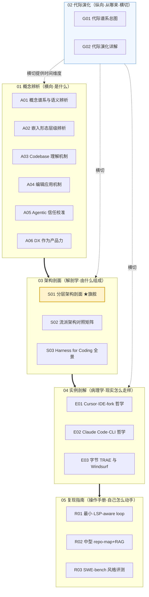

# 编程工具系统化专题 · 总览（MOC）

> 本页是 0414「编程工具系统化专题」的地图与入口（MOC, Map of Content）。17 个节点拆成六模块——概念辨析 / 代际演化 / 架构剖面 / 实例剖解 / 复现指南 / 阅读指南——回答同一个问题的六个正交切面：**当 Cursor、Claude Code、TRAE、Copilot 在 demo 里看起来都"能跑通"时，你究竟在比什么。**

---

## §0 序：那堵墙

Rick 在两个场合反复撞过同一堵墙。一个是选型评审：有人问"Claude Code、Cursor、TRAE 到底差在哪、我们该上哪个"，房间里一半人在比补全速度、一半人在比 SWE-bench 分数，最后没人说得清"为什么不选 X"——因为这句话本身没有真值，它把四种所指（autocomplete / assistant / agent / autonomous SWE）塌缩成了一个伞形词。另一个是面试桌：被追问"你怎么评估一个 coding agent 的架构"，答到"它有 Agent 模式、支持 MCP"就接不下去了——因为这些是 feature，不是判断。

这堵墙的本质是**抽象层错位**：拿"轮胎参数"评判"飞机和汽车谁更好"。本专题的反共识立场是——**别比 feature list，比架构可控性与层间耦合**：决定一个 coding 工具好不好用、能不能进生产的，不是任何单层（模型/补全/价格）的强弱，而是嵌入形态、上下文检索、编辑落地、执行验证、信任校准这几层之间那几个 demo 演不出、feature list 列不到的**致命耦合点**。读完这套立方体，你能在 30 秒内说清："我不选 X，是因为它的执行验证层缺位，幻觉代码会静默进 PR" / "Cursor 的护城河和命门都在 IDE-fork 这枚硬币的两面" / "TRAE 真正稀缺的不是技术，是合规墙内的产品判断"——而不是"X 的补全没 Y 快"。

---

## §1 专题定位：为什么"编程工具"配独立建一个专题号

用 `_topic_factory` 写作宪章 §2 的四条选题判据逐条验证（前 3 条满足 ≥2，第 4 条为真即达标）：

| 判据 | 是否满足 | 证据 |
|---|---|---|
| **① 中心性**（影响 PM ≥3 个决策链节点） | ✅ | 直接命中选型（架构可控性）、期望管理（四种所指错位）、事故归因（验证缺失 × 幻觉）、合规（检索层数据流向）、求职（字节 TRAE 方向）——≥4 个节点 |
| **② 误解深度**（业界定义互相矛盾、系统性滑变） | ✅ | "AI 编程工具"是塌缩了四种所指的伞形词（见 [A01 编程工具概念谱系与语义辨析](/kb/专题-工程与成本/a01-编程工具概念谱系与语义辨析/)）；JD、白皮书、媒体对 coding agent / assistant 的定义标准差极大 |
| **③ 速变性**（24 个月内 ≥1 次格式塔切换） | ✅ | 2024–2026 至少两次范式转移：补全→agentic loop（G3→G4）、IDE→CLI/云端编排；2026 上半年三家在一年内反复改计费（Cursor Credit、Copilot AI Credits、Windsurf 改名 Devin Desktop） |
| **④ 学了就能用** | ✅ | 读完即获面试 / 选型 / 复现三类可观测判断力提升（见 §5 三条阅读起点 + R 系列亲手跑通） |

**升高了哪个抽象层。** 本专题相对 0411 Agent 专题的 [E01 Coding Agent·Claude Code & Cursor](/kb/专题-安全对齐与失败/e01-coding-agent-claude-code-cursor/) 与基础章 [c10 - Agent 技术栈与工具调用](/kb/基础知识库/c10-agent-技术栈与工具调用/)，做了一次**抽象层升高 + 垂直特化**：c10/E01 把 coding 当作 Agent 的一个应用案例（一节、一张对照表）；本专题把它当作一个**有独立承重墙的垂直域**——通用 Agent 的"工具层"在这里具体化成"检索层 + 编辑应用层"，"执行层"具体化成"测试/编译/lint 的验证闭环"，并补上通用框架根本不强调的两根承重墙：**编辑落地的精度**（生成对 ≠ 应用对）和**沙盒的爆炸半径**（一次错误文件写入不可逆）。这就是"同一抽象框架在不同垂直场景重新承重"。

---

## §2 模块全景

**矩阵含义。** 主依赖链是 `概念 → 架构 → 实例 → 复现`：先用 01 把术语切清楚（否则后面全是鸡同鸭讲），再用 03 给出可替换的分层堆栈，04 把堆栈套到真实产品上看它怎么走样，05 让你亲手把堆栈搭一遍撞墙。**02 代际演化是横切轴**——它给前面每一层提供时间维度（"这一代的瓶颈决定了下一代必须长成什么样"），所以用虚线连向三个模块而非排在依赖链里。**06 阅读指南反向编织**：本总览（MOC）+ README 把上面这张网重新组织成三条可读路径（见 §5）。

---

## §3 六模块逐一介绍

**01 概念辨析（A01–A06｜横向）** — 收录"是什么"的六把尺子。何时读：选型/期望管理/事故归因前，先确认"我们到底在说哪一个所指、哪一种形态"。
- [A01 编程工具概念谱系与语义辨析](/kb/专题-工程与成本/a01-编程工具概念谱系与语义辨析/)：autocomplete / assistant / agent / autonomous SWE 四种所指的语义滑变，从 1950s 编译器到 2026 自主 SWE 的连续光谱切成离散档位。
- [A02 嵌入形态层级辨析·插件 IDE-fork CLI 云端 PR-bot](/kb/专题-工程与成本/a02-嵌入形态层级辨析-插件-ide-fork-cli-云端-pr-bot/)：五种嵌入形态在"宿主依附度/上下文边界/自主权半径"三维上的层级，判断主轴="形态错配"。
- [A03 Codebase 理解机制·repo-map RAG-over-code LSP](/kb/专题-工程与成本/a03-codebase-理解机制-repo-map-rag-over-code-lsp/)：拆穿"模型读了我整个 repo"的幻觉——它读的是静态分析压缩的摘要地图 + 几次自发检索。
- [A04 编辑应用机制·diff-apply 与 fast-apply](/kb/专题-工程与成本/a04-编辑应用机制-diff-apply-与-fast-apply/)：生成对 ≠ 应用对，edit locality 是隐形产品力；whole-file / diff / search-replace / fast-apply 四路线。
- [A05 Agentic Coding 信任校准](/kb/专题-工程与成本/a05-agentic-coding-信任校准/)：auto-accept / YOLO / HITL 边界放在同一根坐标轴上——这个工具把"判断权"在什么粒度上交给了谁。
- [A06 Developer Experience 作为产品力](/kb/专题-工程与成本/a06-developer-experience-作为产品力/)：模型趋同后，DX 是唯一可防御的护城河；接入 Csikszentmihalyi 心流理论。

**02 代际演化（G01–G02｜纵向·横切）** — 收录"从哪来"，硬立场是**反线性进步**。何时读：想理解"为什么某代瓶颈决定了下代形态"、做技术雷达或求职准备时。
- [G01 编程工具代际谱系总图](/kb/专题-工程与成本/g01-编程工具代际谱系总图/)：用 范式（Kuhn）把 2017→2026 切成 G1 补全期→G2 大模型补全→G3 对话·IDE 融合→G4 Agent 化→G5 自主 SWE，每代配一个"它没比上一代更好"的反例。
- [G02 编程工具代际演化详解](/kb/专题-工程与成本/g02-编程工具代际演化详解/)：给地图每个点标海拔与天气——逐代的代表产品/推动力/瓶颈/被下代如何超越/2026 Hype Cycle 坐标 + "还值不值得付迁移成本"。

**03 架构剖面（S01–S03｜解剖学）** — 收录"由什么组成"，是专题的承重模块。何时读：做一个 18 个月不后悔的架构决策时。
- ★ [S01 Coding Agent 分层架构剖面](/kb/专题-工程与成本/s01-coding-agent-分层架构剖面/)（旗舰最厚）：五层堆栈（模型/检索/编辑/验证/UI）+ 四个**致命层间耦合点**（context-locality / 验证缺失×幻觉 / 确认疲劳 / context rot）。
- [S02 编程工具流派架构对照矩阵](/kb/专题-工程与成本/s02-编程工具流派架构对照矩阵/)：六款工具 × 六维度（形态/上下文/编辑/agent/定价/扩展）——别比 feature，比"每层你能不能换、换的代价多大、谁握着开关"。
- [S03 Harness for Coding 全景](/kb/专题-工程与成本/s03-harness-for-coding-全景/)：把 0411 通用 harness 在 coding 场景"维度重切"成五件套（控制循环/工具集/沙盒/验证/可观测性），判断主轴="harness 而非模型才是真实差异源"。

**04 实例剖解（E01–E03｜病理学）** — 收录"现实怎么走样"，把架构套到真实产品上看 gap 与设计哲学分歧。何时读：要在面试/选型会讲清某个具体产品时。
- [E01 Cursor 剖解·IDE-fork 哲学](/kb/专题-工程与成本/e01-cursor-剖解-ide-fork-哲学/)：用最低迁移摩擦换编辑器内核完全控制权；判断主轴=低摩擦红利与范式锁定是同一枚硬币两面。
- [E02 Claude Code 剖解·CLI 哲学](/kb/专题-工程与成本/e02-claude-code-剖解-cli-哲学/)：为什么一个没有 GUI 的终端工具成了重度工程组织首选——CLI + harness 赌"AI 是主体、人是审阅者"。
- [E03 字节 TRAE 与 Windsurf 剖解](/kb/专题-工程与成本/e03-字节-trae-与-windsurf-剖解/)：把差异化拆成模型/形态/分发三层，追问哪层是真护城河；Rick 求职方向一手洞察="合规墙内的产品判断是海外团队没有的 know-how"。

**05 复现指南（R01–R03｜操作手册）** — 收录"自己怎么动手"，复现优先于综述。何时读：想把黑箱魔法还原成可读循环、亲手撞墙时。
- [R01 最小可运行·LSP-aware 编辑 loop](/kb/专题-工程与成本/r01-最小可运行-lsp-aware-编辑-loop/)：80 行骨架（读文件→LLM 生成 patch→apply→验证），跑通后听到"我们 Agent 能自主改代码"会立刻浮现四个失败点。
- [R02 中型·repo-map + RAG-over-code 检索增强](/kb/专题-工程与成本/r02-中型-repo-map-+-rag-over-code-检索增强/)：50–500 文件仓库的检索层模板，纠偏 [c09 - RAG 架构](/kb/基础知识库/c09-rag-架构/)——代码不是文本，别把函数当散文 chunk。
- [R03 SWE-bench 风格评测跑通](/kb/专题-工程与成本/r03-swe-bench-风格评测跑通/)：在自己仓库 5–20 个真实 issue 上把"模型能力 + harness 工程 + 任务分布"三个变量拆开测，把评测当 PM 的祛魅工具。

---

## §4 与现有节点的关系（升级对照表）

| 旧节点 | 本专题升级它的节点 | 升级动作 |
|---|---|---|
| [c10 - Agent 技术栈与工具调用](/kb/基础知识库/c10-agent-技术栈与工具调用/)（G3 截面快照） | [S01 Coding Agent 分层架构剖面](/kb/专题-工程与成本/s01-coding-agent-分层架构剖面/) | **深化+具象**：把"工具调用"在 coding 域展开成检索/编辑/验证三层 + 层间耦合诊断 |
| [c10 - Agent 技术栈与工具调用](/kb/基础知识库/c10-agent-技术栈与工具调用/) | [G01 编程工具代际谱系总图](/kb/专题-工程与成本/g01-编程工具代际谱系总图/) | **动力学化**：c10 是静态切片，G01 给驱动力与瓶颈的动力学 |
| [E01 Coding Agent·Claude Code & Cursor](/kb/专题-安全对齐与失败/e01-coding-agent-claude-code-cursor/)（0411，横向六维对照） | [E01 Cursor 剖解·IDE-fork 哲学](/kb/专题-工程与成本/e01-cursor-剖解-ide-fork-哲学/) + [E02 Claude Code 剖解·CLI 哲学](/kb/专题-工程与成本/e02-claude-code-剖解-cli-哲学/) | **纵深下钻**：E01(0411) 横向比两条路线；本专题各自单点剖解"为什么是这个形态、赌的是什么" |
| [S01 Agent 六层架构剖面](/kb/专题-安全对齐与失败/s01-agent-六层架构剖面/)（0411，通用六层） | [S01 Coding Agent 分层架构剖面](/kb/专题-工程与成本/s01-coding-agent-分层架构剖面/) | **垂直特化**：通用六层 → coding 五层垂直剖面，不复述抽象骨架 |
| [S03 Harness Engineering 全景](/kb/专题-安全对齐与失败/s03-harness-engineering-全景/)（0411，通用 harness 六维） | [S03 Harness for Coding 全景](/kb/专题-工程与成本/s03-harness-for-coding-全景/) | **维度重切**：六维（控制流/工具/上下文/记忆/验证/可观测）→ coding 五件套（控制循环/工具集/沙盒/验证/可观测），记忆被代码库吸收、沙盒升为承重墙 |
| [c09 - RAG 架构](/kb/基础知识库/c09-rag-架构/)（通用文本 RAG） | [R02 中型·repo-map + RAG-over-code 检索增强](/kb/专题-工程与成本/r02-中型-repo-map-+-rag-over-code-检索增强/) | **专用化+纠偏**：代码不是文本，AST 图 vs 向量 vs 让 agent grep |
| [m207 - Agent 产品化：场景推演与失败模式](/kb/工程化与落地架构/m207-agent-产品化-场景推演与失败模式/)（失败模式一般形态） | [S01 Coding Agent 分层架构剖面](/kb/专题-工程与成本/s01-coding-agent-分层架构剖面/) §6 / [E01 Cursor 剖解·IDE-fork 哲学](/kb/专题-工程与成本/e01-cursor-剖解-ide-fork-哲学/) / [E02 Claude Code 剖解·CLI 哲学](/kb/专题-工程与成本/e02-claude-code-剖解-cli-哲学/) §4 | **实例补缺**：把失败模式落到 coding 场景的具体产品级反例 |
| [Claude Code](/kb/ai-公司与产品/claude-code/)（0410 产品卡 / entity） | [E02 Claude Code 剖解·CLI 哲学](/kb/专题-工程与成本/e02-claude-code-剖解-cli-哲学/) | **升格**：产品卡是事实（时间线/定价），本专题是判断（为什么 CLI、得失耦合） |

> [!note] 升级方向是双向的
> 本专题不只是"被旧节点喂养"，也**反哺**它们：c10 章末"专题升级"注脚可补 [S03 Harness for Coding 全景](/kb/专题-工程与成本/s03-harness-for-coding-全景/) 与 [A08 MCP 与 A2A 协议族](/kb/专题-安全对齐与失败/a08-mcp-与-a2a-协议族/)；[Claude Code](/kb/ai-公司与产品/claude-code/) 产品卡可补 [S03 Harness for Coding 全景](/kb/专题-工程与成本/s03-harness-for-coding-全景/) 与本专题 E01/E02 直链；索引 的"Agent 系统化"快查行可把 [S03 Harness Engineering 全景](/kb/专题-安全对齐与失败/s03-harness-engineering-全景/) 补为第五入口。这些补链动作在原则四的"move 到 final_path"阶段统一执行。

---

## §5 三条阅读起点（详表在 README）

| 路径 | 适合谁 | 入口顺序 | 读完能干什么 |
|---|---|---|---|
| **A. 求职速通**（字节 TRAE 方向优先） | 准备 coding 工具方向面试的转型 PM | [A01 编程工具概念谱系与语义辨析](/kb/专题-工程与成本/a01-编程工具概念谱系与语义辨析/) → [S01 Coding Agent 分层架构剖面](/kb/专题-工程与成本/s01-coding-agent-分层架构剖面/) → [E03 字节 TRAE 与 Windsurf 剖解](/kb/专题-工程与成本/e03-字节-trae-与-windsurf-剖解/) → [G02 编程工具代际演化详解](/kb/专题-工程与成本/g02-编程工具代际演化详解/) | 30 秒讲清"怎么评估一个 coding agent 的架构" + 国产工具差异化判断 |
| **B. 决策链**（选型会路径） | 要给团队拍板上哪个工具的 PM/Tech Lead | [A02 嵌入形态层级辨析·插件 IDE-fork CLI 云端 PR-bot](/kb/专题-工程与成本/a02-嵌入形态层级辨析-插件-ide-fork-cli-云端-pr-bot/) → [S02 编程工具流派架构对照矩阵](/kb/专题-工程与成本/s02-编程工具流派架构对照矩阵/) → [E01 Cursor 剖解·IDE-fork 哲学](/kb/专题-工程与成本/e01-cursor-剖解-ide-fork-哲学/) + [E02 Claude Code 剖解·CLI 哲学](/kb/专题-工程与成本/e02-claude-code-剖解-cli-哲学/) → [S03 Harness for Coding 全景](/kb/专题-工程与成本/s03-harness-for-coding-全景/) | 做出一个 18 个月不后悔、按"架构可控性"而非 feature 的选型 |
| **C. 紧迫度/动手**（祛魅路径） | 想亲手撞墙、不被 demo 牵着走的人 | [R01 最小可运行·LSP-aware 编辑 loop](/kb/专题-工程与成本/r01-最小可运行-lsp-aware-编辑-loop/) → [A03 Codebase 理解机制·repo-map RAG-over-code LSP](/kb/专题-工程与成本/a03-codebase-理解机制-repo-map-rag-over-code-lsp/) + [A04 编辑应用机制·diff-apply 与 fast-apply](/kb/专题-工程与成本/a04-编辑应用机制-diff-apply-与-fast-apply/) → [R02 中型·repo-map + RAG-over-code 检索增强](/kb/专题-工程与成本/r02-中型-repo-map-+-rag-over-code-检索增强/) → [R03 SWE-bench 风格评测跑通](/kb/专题-工程与成本/r03-swe-bench-风格评测跑通/) | 跑通最小 loop、看穿"代码库理解"与"编辑落地"的真实边界、再也不被榜单标量骗到 |

---

## §6 跨域思想资源调度（不留空 invocation）

| 资源 | 调度位置 | 在该节点的具体作用（不是装饰） |
|---|---|---|
| **Polanyi 默会知识**（[Polanyi 默会知识与提示工程的认识论张力](/kb/基础知识库/polanyi-默会知识与提示工程的认识论张力/)） | [S01 Coding Agent 分层架构剖面](/kb/专题-工程与成本/s01-coding-agent-分层架构剖面/) §9 / [E02 Claude Code 剖解·CLI 哲学](/kb/专题-工程与成本/e02-claude-code-剖解-cli-哲学/) §7 | 解释为什么层间接口（LSP/MCP/ACP）难标准化、CLAUDE.md 写不完：好用的手感是"写不进 spec 的默会判断"，预言了"把 coding agent 完全协议化"的认识论天花板 |
| **维特根斯坦 语言游戏** | [E01 Cursor 剖解·IDE-fork 哲学](/kb/专题-工程与成本/e01-cursor-剖解-ide-fork-哲学/) §8 | IDE 这套"文件/行/光标/编辑"的语法封顶了用户的 AI 想象力——丝滑的代价是想象力天花板，破除"体验更丝滑=无条件优势" |
| **Kuhn 范式 / 不可通约**（范式） | [G01 编程工具代际谱系总图](/kb/专题-工程与成本/g01-编程工具代际谱系总图/) §0 | "哪一代更强"是范畴错误；代际更替是不可通约的范式转移，不是性能标量单调递增——这是反线性进步叙事的理论锚 |
| **心流 Flow**（Csikszentmihalyi） | [A06 Developer Experience 作为产品力](/kb/专题-工程与成本/a06-developer-experience-作为产品力/) | 解释 DX 为什么是无法一夜抄走的护城河：肌肉记忆与心流默契不在 feature list 上 |
| **阿伦特 work/labor**（登楼撤梯-后弥赛亚的公民道德 关联） | [A05 Agentic Coding 信任校准](/kb/专题-工程与成本/a05-agentic-coding-信任校准/) / [A06 Developer Experience 作为产品力](/kb/专题-工程与成本/a06-developer-experience-作为产品力/)（待落地强化） | 区分"被验证消耗的劳作（labor）"与"创造性工作（work）"：auto mode 把开发者推向"验证 AI 产出"的 labor，是 DX 的隐性税 |
| **Christensen 破坏性创新**（Rick 未读·破 echo chamber） | [E01 Cursor 剖解·IDE-fork 哲学](/kb/专题-工程与成本/e01-cursor-剖解-ide-fork-哲学/) §7 | 逼问 Cursor 盲点：IDE-fork 是延续性创新，CLI/agent-first 可能从"看起来更差"的形态掀翻在位者；但理论本身被批可证伪性弱，只当失效场景而非预言 |
| **Clayton/Lepore 对破坏性创新的反批评**（Rick 未读·破 echo chamber） | [E01 Cursor 剖解·IDE-fork 哲学](/kb/专题-工程与成本/e01-cursor-剖解-ide-fork-哲学/) §7 | 标注破坏性创新理论是事后叙事，不能当预言——给本专题的"形态错配"判断本身上边界 |

跨域入口集中在 0117社会学（技术与社会建构）、认识论（Polanyi/维特根斯坦）。承诺：以上每条都在对应节点的"跨域呼应"段具体改变了一个技术判断，无空点名。

---

## §7 验收档案

**评议流程。** 本专题照搬 0411 的多轮批判性同行评议工程化流水线：`Round 0 并行起草（17 节点按 §4 骨架）→ Round N 批评 Agent 六维找茬 + 事实接地 → Round N+1 写作 Agent 按 issue 单修订并记修订日志 → 独立 grounding 校验 pass → 终轮综合（本总览 + README + 跨节点双链编织 + 三清单）`。批评 Agent 默认立场是"这条判断能被证伪吗？这个引用是真的吗？反方会怎么打？"。

### SABCD 六维自评

| 维度 | 含义 | 出版线 | 自评 | 依据 |
|---|---|---|---|---|
| **S 结构** | 六模块互补、依赖清晰、入口可导航 | ≥8 | **8.2** | 主依赖链 + 02 横切 + 三条阅读路径俱全；旗舰 S01 承重清晰 |
| **A 判断密度** | 每节有反共识、可证伪、带数字的判断 | ≥8 | **8.0** | 四致命耦合点、Context Rot（57.3%→9.7%）、METR −19%、SWE-bench 审计 59.4%、auto mode 17% 假阴性等均带数字 |
| **B 边界含量** | 显式标注判断失效边界与赌注 | ≥7.5 | **7.8** | 每个 E/S 节点有 failure scenario + "我可能错在哪"；长上下文阈值无共识被诚实承认 |
| **C 认识论自觉** | 区分事实/推测/赌注、引用可追溯 | ≥8 | **8.0** | volatile 数字标日期口径、自评数据标〔待核实〕、ARR 区分官方/估算/媒体三置信层级 |
| **D 可演进性** | 双链密度、修订日志、改稿档案 | ≥8.5 | **8.4**（QC 后） | 双链密度达标、修订日志齐全；起草期占位标题死链已在 2026-06-07 QC 轮全部修复/降级（见下"诚实记账"），全专题 0 死链 |
| **E 对手拷问能力** | 对业界反方给出带证据的回应 | ≥7 | **8.1** | LeCun 式"接受+边界"范式贯穿（长上下文派、专用模型派、Anthropic auto mode、IDE 原生派、Aider 开源派、METR 反方）均点名真实立场 |

**综合 ≈ 8.1/10**（达到出版级 ≥7.8 线）。起草期最大短板 D 维"跨专题占位链未统一"已在 2026-06-07 QC 轮清零（全专题 0 死链），D 回升至 8.4。

> [!note] 诚实记账（confirmation-bias 砍除 + 死链已修复）
> 起草期几个节点正文出现过**指向不存在节点的占位标题**（宪章 §8 死链风险）。QC 轮（2026-06-07）已全部就地修复为真实 basename，下列记录保留作审计痕迹（占位名以代码体书写，已非活链）：
> - `S01 Coding Agent 分层架构剖面` 曾引 `E01 主流工具横向解剖·Cursor & Copilot & 通义灵码`（已改指 [S02 编程工具流派架构对照矩阵](/kb/专题-工程与成本/s02-编程工具流派架构对照矩阵/)）、`E03 字节 TRAE·国产工具的合规突围与隐私争议`（已改指 [E03 字节 TRAE 与 Windsurf 剖解](/kb/专题-工程与成本/e03-字节-trae-与-windsurf-剖解/)）、`R0x`（已改指 [R02 中型·repo-map + RAG-over-code 检索增强](/kb/专题-工程与成本/r02-中型-repo-map-+-rag-over-code-检索增强/)）；`E02 评测体系·SWE-bench 的信任危机与 Gaming` 因 SWE-bench 评测内容归规划中的评测专题、本专题**没有**独立 SWE-bench 剖解 E 节点，已降级为文本指向规划中的评测专题。
> - `R02 中型·repo-map + RAG-over-code 检索增强` 曾引 `R01 最小可运行·单文件 Function Calling coding loop`，已改指 [R01 最小可运行·LSP-aware 编辑 loop](/kb/专题-工程与成本/r01-最小可运行-lsp-aware-编辑-loop/)。
> - `R03 SWE-bench 风格评测跑通` 曾引 `E02 SWE-bench & Coding Agent 评测剖解`（本专题 E02 实为 Claude Code），已降级为文本指向规划中的评测专题。
> - 其余跨节点占位（G01 的 E02/E03/E04/S02 旧名、A02/A04/A05 的 E0x 实例剖解旧名、G02 的 S0X Edit Application、E01 的 GitHub Copilot / E03 旧名、E03 的 Trae Solo、各处 `m207` 半角冒号变体、`MCP`/`_topic_factory` 死链）均已在 QC 轮统一修复或降级登记。

**对手立场接入清单（≥8 处，均点名真实立场）：**
1. LeCun 式长上下文派（"窗口越大 RAG 越没必要"）→ S01 §8、E02 §6
2. Cognition/Morph 专用模型派（"Fast Apply 是编辑层未来"）→ S01 §8、A04
3. Anthropic auto mode 立场（"逐步审批已失效，交给分类器"）→ S01 §8、A05、E02
4. IDE 原生派（"AI coding 未来一定是 AI 原生 IDE，CLI 是过渡"）→ E01 §7、E02 §6
5. Aider/开源派（"CLI agent 早做了且开源免费"）→ E02 §6
6. METR RCT 反方（"agentic coding 让资深开发者慢 19%"）→ S01 §1/§4、S03 §4、E02 §4
7. JetBrains 大样本乐观派（n=24,534，近 90% 每周省 ≥1 小时）→ S03 §4 作为 METR 的对冲
8. Christensen 破坏性创新（在位者被下方掀翻）→ E01 §7
9. Lepore 对破坏性创新的反批评（事后叙事、可证伪性弱）→ E01 §7

**failure scenario 清单（≥5 处）：**
1. 五层框架在纯补全式工具（早期 Tab）上失效——无完整闭环，过度建模（S01 §8）。
2. "形态错配"看空 Cursor 可能错：若"边写边改"始终是主流（维护型/增量型工作），IDE-fork 红利长期跑赢（E01 §7）。
3. CLI"更好"的边界=非工程组织、非终端用户象限缺公开对比数据（E02 §4）。
4. METR −19% 负曲线的适用边界仅限"成熟代码库 + 资深开发者 + 复杂任务"，绿地/初中级区间无共识（S03 §4）。
5. 长上下文 vs RAG 的胜负在哪个 token 量级翻转，学界无共识（S01 §6 耦合点四、E02 §6）。

**confirmation-bias 砍除清单（≥5 处）：**
1. 早期想把 Cursor 用户量/ARR 当胜势证据 → 砍：$3B 为 Sacra 估算、$2B 为 TechCrunch 知情人士口径，均非财报（E01 §5 错位四）。
2. 早期把"有执行验证层"当作安全保证 → 砍：SWE-MERA 31% 通过源于测试覆盖不足，绿灯≠正确（S01 §4/§6、S03 §4）。
3. 早期把"1M 上下文"当选型卖点 → 砍：Context Rot，反引 Llama-3.1-8B HumanEval 30K 时 57.3%→9.7%（S01 §6、E02 §3）。
4. 早期把 auto mode 当"更安全的自动化" → 砍：93% 批准率=人工监督已失效 + 分类器 17% 假阴性（S01 §6、A05、E02 §4）。
5. 早期把代际写成"一代更比一代强" → 砍：每代配"它没比上一代更好"的反例（G01 §0 硬立场、G02）。
6. 早期把 TRAE"国内服务器/满足等保"叙事当事实 → 砍：The Register 2025-07-28 遥测争议（关闭开关仍回传），产品叙事与架构现实存在张力（E03、S01 §7）。

---

## §8 关联节点（双链密度 ≥20，均为真实 basename）

**本专题内部（17 节点，依赖链 + 横切）**
- [A01 编程工具概念谱系与语义辨析](/kb/专题-工程与成本/a01-编程工具概念谱系与语义辨析/)
- [A02 嵌入形态层级辨析·插件 IDE-fork CLI 云端 PR-bot](/kb/专题-工程与成本/a02-嵌入形态层级辨析-插件-ide-fork-cli-云端-pr-bot/)
- [A03 Codebase 理解机制·repo-map RAG-over-code LSP](/kb/专题-工程与成本/a03-codebase-理解机制-repo-map-rag-over-code-lsp/)
- [A04 编辑应用机制·diff-apply 与 fast-apply](/kb/专题-工程与成本/a04-编辑应用机制-diff-apply-与-fast-apply/)
- [A05 Agentic Coding 信任校准](/kb/专题-工程与成本/a05-agentic-coding-信任校准/)
- [A06 Developer Experience 作为产品力](/kb/专题-工程与成本/a06-developer-experience-作为产品力/)
- [G01 编程工具代际谱系总图](/kb/专题-工程与成本/g01-编程工具代际谱系总图/)
- [G02 编程工具代际演化详解](/kb/专题-工程与成本/g02-编程工具代际演化详解/)
- [S01 Coding Agent 分层架构剖面](/kb/专题-工程与成本/s01-coding-agent-分层架构剖面/) ★旗舰
- [S02 编程工具流派架构对照矩阵](/kb/专题-工程与成本/s02-编程工具流派架构对照矩阵/)
- [S03 Harness for Coding 全景](/kb/专题-工程与成本/s03-harness-for-coding-全景/)
- [E01 Cursor 剖解·IDE-fork 哲学](/kb/专题-工程与成本/e01-cursor-剖解-ide-fork-哲学/)
- [E02 Claude Code 剖解·CLI 哲学](/kb/专题-工程与成本/e02-claude-code-剖解-cli-哲学/)
- [E03 字节 TRAE 与 Windsurf 剖解](/kb/专题-工程与成本/e03-字节-trae-与-windsurf-剖解/)
- [R01 最小可运行·LSP-aware 编辑 loop](/kb/专题-工程与成本/r01-最小可运行-lsp-aware-编辑-loop/)
- [R02 中型·repo-map + RAG-over-code 检索增强](/kb/专题-工程与成本/r02-中型-repo-map-+-rag-over-code-检索增强/)
- [R03 SWE-bench 风格评测跑通](/kb/专题-工程与成本/r03-swe-bench-风格评测跑通/)

**跨专题：0411 Agent 系统化（升级对照母型）**
- [S01 Agent 六层架构剖面](/kb/专题-安全对齐与失败/s01-agent-六层架构剖面/) — 本专题 S01 的通用母型
- [S03 Harness Engineering 全景](/kb/专题-安全对齐与失败/s03-harness-engineering-全景/) — 本专题 S03 的通用 harness 母型
- [E01 Coding Agent·Claude Code & Cursor](/kb/专题-安全对齐与失败/e01-coding-agent-claude-code-cursor/) — 被纵深下钻的横向对照节点
- [G02 五代演化详解·G1-G5](/kb/专题-安全对齐与失败/g02-五代演化详解-g1-g5/) — Agent 代际谱系（与本专题 G 系列互参）
- [A08 MCP 与 A2A 协议族](/kb/专题-安全对齐与失败/a08-mcp-与-a2a-协议族/) — 层间协议
- [A07 Multi-Agent Teams](/kb/专题-安全对齐与失败/a07-multi-agent-teams/) — Subagent 并行的理论背景
- [Harness 词义辨析](/kb/专题-安全对齐与失败/harness-词义辨析/) — harness 语义边界
- [Skill 系统的本质](/kb/ai-协作方法论/skill-系统的本质/) — Claude Code 四件套之 Skills

**跨章：0401 基础库 / 0402 工程化（升级对照源）**
- [c10 - Agent 技术栈与工具调用](/kb/基础知识库/c10-agent-技术栈与工具调用/) — 被深化的 G3 截面基础章
- [c09 - RAG 架构](/kb/基础知识库/c09-rag-架构/) — 被 R02 专用化纠偏的通用 RAG
- [c13 - 幻觉的不可消除性](/kb/基础知识库/c13-幻觉的不可消除性/) — 验证缺失×幻觉耦合的根因
- [m207 - Agent 产品化：场景推演与失败模式](/kb/工程化与落地架构/m207-agent-产品化-场景推演与失败模式/) — 失败模式一般形态
- [m208 - AI 基础设施与中间件选型](/kb/工程化与落地架构/m208-ai-基础设施与中间件选型/) — embedding 索引 vs grep 的基础设施层
- [m209 - 推理成本控制手册](/kb/工程化与落地架构/m209-推理成本控制手册/) — 计费从包月向用量收敛的成本逻辑

**实体 / 概念 / 哲学 / 跨域入口**
- [Claude Code](/kb/ai-公司与产品/claude-code/) — 被升格的产品卡
- [Anthropic](/kb/ai-公司与产品/anthropic/) / [Claude](/kb/ai-公司与产品/claude/) — auto mode 与模型数据来源
- [Agent](/kb/基础知识库/agent/) / [Function Calling](/kb/基础知识库/function-calling/) / [RAG](/kb/基础知识库/rag/) / [Embedding](/kb/基础知识库/embedding/) / [MCP](/kb/专题-安全对齐与失败/a08-mcp-与-a2a-协议族/) — 原子概念
- [Polanyi 默会知识与提示工程的认识论张力](/kb/基础知识库/polanyi-默会知识与提示工程的认识论张力/) — §6 跨域母题
- 范式 — Kuhn 不可通约（G 系列理论锚）
- [字节 TRAE 团队人物图谱](/kb/ai-公司与产品/字节-trae-团队人物图谱/) — E03 求职方向对照线
- 0117社会学 — 技术范式锁定的社会建构入口
- [AI概念滥用反思](/kb/基础知识库/ai概念滥用反思/) — AI 生成内容须经批判性同行评议
- [AI PM 知识图谱·总索引](/kb/ai-pm-知识图谱/ai-pm-知识图谱-总索引/) — 全库入口

---

