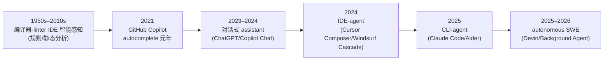

当有人在选型会上说"我们要不要上一个 AI 编程工具"时，房间里至少坐着四种互相听不懂对方的人——而这句话本身没有真值。本节要解决的问题是:"AI 编程工具"是一个**塌缩了四种所指的伞形词**(autocomplete / coding assistant / coding agent / autonomous SWE),这四种东西在自主性、责任归属、计费模型、失败模式上根本不在同一维度。本节用"语义滑变谱系"这个框架,把这条从 1950 年代编译器到 2026 年自主 SWE 的连续光谱切成可决策的离散档位,让 PM 在选型/期望管理/事故归因时,先确认"我们到底在说哪一个所指"。

> [!warning] 判断主轴(先说结论)
> "AI 编程工具"四种所指错位,是 2025–2026 选型事故与期望落差的**头号语义根因**。买 autocomplete 的预算去对标 autonomous SWE 的承诺,或拿 coding agent 的失败模式去骂 coding assistant,都是同一个病:**没把伞形词拆开就开始谈判**。

## §0 为什么用"语义滑变谱系",而不是"功能清单对照"

最容易被想到的默认框架是"列一张功能对照表"——这家有 Tab 补全,那家有 Agent Mode,打勾比多少。**这个框架是错的**,因为它把"自主性程度"这个连续变量伪装成了一堆离散的布尔特性。Cursor 既有 Tab 补全又有 Background Agent;[Claude Code](/kb/ai-公司与产品/claude-code/) 既能单步问答又能跑完整 PR——同一个产品横跨多个档位。功能清单会让你得出"它们都差不多,都全"的结论,然后在落地时被失败模式狠狠教育。

正确的框架是**沿"自主性 × 责任归属"两个轴,把工具行为(而非产品品牌)定位到光谱上的某一档**。一个产品可以提供多档行为;PM 要管理的不是"买哪个品牌",而是"在哪个任务上允许它跑到哪一档"。这与认知科学里 Clark & Chalmers(1998)的**扩展心智(extended mind)**论题同构:工具是认知的延伸,而延伸的"耦合紧密度"决定了你要为它的输出负多少责任——这条线我们留到跨域呼应展开。

这一框架辨析也是对 [c10 - Agent 技术栈与工具调用](/kb/基础知识库/c10-agent-技术栈与工具调用/) 的显式升高:c10 讲的是"Agent 如何调用工具"的技术栈快照(G3 截面),本节不复述那套 Function Calling 机制,而是升高一层去问"我们为什么把某些编程工具叫 Agent、另一些不叫,这个命名本身可靠吗"。

## §1 四种所指:把伞形词拆成四个离散档位

| 档位 | 所指 | 自主性 | 单位动作 | 责任归属 | 计费心智 | 失败模式 |
|---|---|---|---|---|---|---|
| ① 代码补全 autocomplete | 在光标处预测下 1–3 行/下一处编辑 | 极低,人在驾驶座 | 一次补全 | 人 100% 负责,工具只建议 | 包月不计量(补全不烧钱) | 误补全→人随手改,几乎无成本 |
| ② Coding Assistant | 对话式答疑、解释、生成片段,人复制粘贴 | 低,工具是顾问 | 一轮对话 | 人审阅后负责 | 按消息/token | 幻觉 API、过时方案,人需甄别 |
| ③ Coding Agent | 多步自主:读库→改多文件→跑测试→提交 | 中–高,工具短暂接管 | 一个任务(task) | 责任开始模糊化 | 按任务/信用额度 | 跑偏、改错文件、删错东西 |
| ④ Autonomous SWE | 给 issue 自己出 PR,人事后 review | 高,工具持续接管 | 一个 ticket/PR | 责任最模糊,review 沦为橡皮图章 | 按完成的工作量(尚未成熟) | 静默引入 bug、过度自信、需求误解 |

四个档位的分界**不是功能数量,而是"动作的单位"和"责任在谁手上"**:从"建议一行"到"交付一个 PR",每跨一档,人的角色从"驾驶"退到"副驾",再退到"乘客",最后退到"事后审计员"。把这四档塞进同一个词,就是事故的起点。

- **代码补全(autocomplete)**:谱系最早的成员。GitHub Copilot 的 Tab 补全、Cursor 的 Tab(预测 1–3 行,延迟 <100ms,来源:deployhq.com,2026-06 WebSearch)都是这一档。关键特征:**人始终在每一个 keystroke 的回路里**,工具的输出在被接受的瞬间就被人脑过了一遍。
- **Coding Assistant**:对话式顾问。你问"这段为什么报错",它解释;你说"写个快排",它给片段——但**搬运和落地由你完成**。这一档的产品边界最模糊,因为几乎所有聊天 LLM 都能客串。
- **Coding Agent**:质变发生在这里。工具获得了**工具调用权**(读文件、写文件、跑 shell、提交 git),能在一个"任务"内自主走多步。[Claude Code](/kb/ai-公司与产品/claude-code/) 的项目级 agentic、Cursor 3 的 Background Agent(2026-04-02 发布,来源:deployhq.com)都在此。责任从这一档开始模糊:它改了 12 个文件,你真的逐一读过吗?
- **Autonomous SWE**:理想态——给一个 GitHub issue,它自己产出可合并的 PR。Cognition 的 Devin 是这个词最早的旗手。但注意:**这是一个营销承诺多于产品现实的档位**,下文 §4 会用反例戳破。

## §2 从 autocomplete 到 autonomous SWE 的滑变:谱系不是台阶而是斜坡

这条光谱在历史上是**连续滑变**的,没有清晰的代际断点——这正是语义混乱的根源。粗略时间线(各节点见各厂公开资料,日期口径见下):

- **史前史**:IDE 的智能感知(IntelliSense)、linter、重构工具早就在"帮你写代码",但基于规则与静态分析,没人叫它"AI 编程工具"。这提醒我们:**"AI"这个限定词本身就在制造一条虚假的起跑线**。
- **autocomplete 元年(2021)**:GitHub Copilot 把统计语言模型接进光标,第一次让"AI 写代码"成为大众产品。
- **assistant 阶段(2023–2024)**:ChatGPT 与 Copilot Chat 把对话式答疑普及。
- **IDE-agent(2024)**:Cursor 的 Composer(多文件生成对话框,2024 引入)、Windsurf 的 Cascade(多步 agentic 编辑,2024-11 由 Codeium 推出,来源:cognition.ai)把"自主多步"装进 IDE。
- **CLI-agent(2025)**:[Claude Code](/kb/ai-公司与产品/claude-code/) 与 Aider(纯 CLI、开源 MIT)把 agent 从 IDE 里解放到命令行,因为终端天然适合"读库→改文件→跑测试→提交"的工具调用循环。
- **autonomous SWE(2025–2026)**:Devin、Cursor Background Agent 把"后台异步跑完一个 ticket"作为卖点。

斜坡的危险在于:**任意相邻两档之间没有清晰的"你已离开 assistant、进入 agent"的提示**。用户在 UI 上点了一下"Agent Mode",心智模型却还停在 autocomplete——以为它只是"补得多一点",结果它删了一个目录。

> [!note] 反线性进步提醒(§7 charter 要求)
> 这条谱系**不是一代更比一代强**。autocomplete 在"低延迟、不烧 token、人始终在环"上至今无可替代;autonomous SWE 在大多数真实任务上仍不可靠(见 §4 METR 数据)。后一档不是前一档的升级版,而是**用可靠性换自主性的不同权衡点**。把谱系画成进步阶梯,本身就是一种 hype 腔。

## §3 形态正交于档位:CLI / IDE-fork / 插件 是另一个轴

一个高频混淆:把"形态"当成"档位"。形态(产品长什么样)和档位(自主性多高)是**两个正交的轴**:

| 形态 | 代表 | 与档位的关系 |
|---|---|---|
| 插件(plugin) | GitHub Copilot(VS Code/JetBrains 插件) | 可覆盖 ①–④ 全档 |
| IDE-fork(VS Code 分支) | Cursor、Windsurf→Devin Desktop、字节 TRAE | 可覆盖 ①–④ 全档 |
| CLI 工具 | [Claude Code](/kb/ai-公司与产品/claude-code/)、Aider | 主打 ③④,弱 ① |
| CLI+IDE 集成混合 | [Claude Code](/kb/ai-公司与产品/claude-code/)(同时有 IDE sidebar、桌面 App) | ③④ 为主 |

关键判断:**形态影响的是"嵌入工作流的方式"和"切换成本",不直接决定自主性档位**。Copilot 作为插件,照样在 2026-03 GA 了 Agent Mode(③);[Claude Code](/kb/ai-公司与产品/claude-code/) 作为 CLI,也能退回单步问答(②)。PM 在选型时若把"它是不是 IDED"当成"它够不够自主"的代理变量,就会选错。

> [!note] 一手洞察:CLI-agent 形态为什么对 [Claude Code](/kb/ai-公司与产品/claude-code/) 不是偶然
> 作为 [Claude Code](/kb/ai-公司与产品/claude-code/) 深度用户的观察:CLI 形态不是"做不出 IDE 的退而求其次",而是**和 ③④ 档位天然同构**。终端的输入输出就是文本流,工具调用(读文件/跑测试/git)就是子进程——agent 的"动作单位是任务"这件事,在 CLI 里比在 IDE 的可视化面板里更诚实地暴露出来:你看到的是它一条条执行的命令,而不是被 UI 糖衣包装过的"它在帮你"。这也是为什么 Aider、[Claude Code](/kb/ai-公司与产品/claude-code/) 这类 CLI 工具的用户更早形成"我在委托一个会跑偏的自主体"的正确心智模型。

## §4 判断主轴:四种所指错位致选型与期望事故(症状→为什么错→正确做法→真实反例)

这是本节的命门。四种所指的混用,在四个高频场景里制造可预测的事故:

**错位一:拿 autonomous SWE 的承诺,管 coding agent 的期望**
- **症状**:团队看了 Devin"自己出 PR"的 demo,采购后发现工程师还要逐 PR review、返工,失望"被骗了"。
- **为什么错**:把营销档位(④)当成了交付档位(③)。④ 在真实任务上的可靠性远未到"撒手不管"。
- **正确做法**:采购前明确"我们买的是③(需人 review 的任务执行器),不是④(可信赖的自主工程师)",据此设 review 流程与 KPI。
- **真实反例**:METR 的随机对照试验(arXiv:2507.09089,n=16 资深开源开发者,246 任务,2025 年 2–6 月)发现,允许使用 AI 工具时任务完成时间**增加 19%**,而开发者**事前预测会快 24%、事后仍以为快了 20%**——感知与实测方向相反。这正是"以为在用④、实际在用③还拖慢了自己"的实证。⚠️〔以2026-06为准·待核实:该研究 n=16 样本小、限"资深开发者 + 成熟项目",不可外推到绿地/初级场景〕

**错位二:拿 coding agent 的失败模式,骂 coding assistant**
- **症状**:有人说"AI 编程工具会删库、会跑偏,不能用",据此否决全部 ①②。
- **为什么错**:删库跑偏是③④(有 shell/写权限)的失败模式;①②(只建议、人搬运)根本没有这个风险面。
- **正确做法**:按档位分别评估风险——①②的风险是"幻觉建议被采纳",③④的风险才是"自主动作不可逆"。
- **真实反例**:Anthropic 工程博客(2026-03-25)披露 [Claude Code](/kb/ai-公司与产品/claude-code/) 用户批准了 **93%** 的权限请求——手动 review 已沦为橡皮图章;其 auto 模式分类器实测假阴性率 **17%**(危险动作被放行)。这套防御机制是为③④存在的;若你用的只是①补全,这些数字与你无关。把这套③④的风险讨论套到①②头上,是另一种错位。

**错位三:用 autocomplete 的计费心智,买 coding agent 的额度**
- **症状**:习惯了"包月随便用"的 Tab 补全,上了 agent 后月底账单爆炸或额度耗尽,怪工具"乱收费"。
- **为什么错**:①补全几乎不烧 token(本地小模型/低成本),③④每个任务跑多步、读大量上下文,成本结构完全不同。
- **正确做法**:按档位建立计费心智——③④要按"任务复杂度 × 上下文量"预估,纳入 [m209 - 推理成本控制手册](/kb/工程化与落地架构/m209-推理成本控制手册/) 的成本控制框架。
- **真实反例**:2025–2026 各厂集体从"次数包月"转向"信用额度/用量计费":Cursor 2025-06 从"500 次请求包月"改为 Credit 制($20 计划约折合 225 次高级请求,效果相当缩水);GitHub Copilot 2026-06-01 全面切换 AI Credits(补全/NES 不消耗、聊天/agent/review 消耗),Visual Studio Magazine 一篇报道直接以"You Will Get Less, but Pay the Same Price"为标题。⚠️〔以2026-06为准·待核实:定价为 volatile,口径 2026-06 WebSearch〕这场计费革命的本质,正是行业在为"③④不是①"这件事补收语义错位的学费。

**错位四:用单一 SWE-bench 分数,跨档位横评工具**
- **症状**:看到"某工具 SWE-bench 80%",就认为它在所有档位、所有场景都强。
- **为什么错**:SWE-bench 测的是③④档(给 issue 出 patch)的特定能力,且其任务 87% 是孤立 bug 修复、>80% 来自 5 个 Python 仓库(来源:Epoch AI 分析)。它根本不测①②的体验,也不测架构决策、需求模糊处理。
- **正确做法**:把 benchmark 当成"③④档某窄能力的代理指标",而非工具总评分;详见本专题 [E02 Claude Code 剖解·CLI 哲学](/kb/专题-工程与成本/e02-claude-code-剖解-cli-哲学/) 与评测专题。
- **真实反例**:OpenAI 于 2026-02-23 宣布**不再用 SWE-bench Verified 评测**,因审计发现其困难子集(约 138 题)中 **59.4%** 的测试用例有实质问题(来源:OpenAI 博客"Why we no longer evaluate SWE-bench Verified")。一个被官方弃用的 benchmark,却仍被选型会当成跨工具的"智商分"——这是 Goodhart 陷阱的活标本,呼应 [c14 - 模型评估体系与 Goodhart 陷阱](/kb/基础知识库/c14-模型评估体系与-goodhart-陷阱/)。

## §5 产品 PM 视角补盲:三个非工程的"看走眼"点

1. **用户心理模型的档位错配是留存杀手**。一个把 autonomous SWE 写进落地页、实际只交付 coding agent 的产品,会在 onboarding 后 7 天遭遇期望崩塌。RedMonk(Kara Holterhoff,2025-12)调研指出,开发者在 agentic IDE 中最想要的恰恰是"背景自主 + 人工控制机制 + 回滚能力"——即**他们清醒地知道自己在用③,需要安全网**。把③包装成④,是在主动制造留存风险。
2. **合规边界随档位指数级上升**。①补全的代码片段可能涉及训练数据版权;③④则可能自主执行生产部署、修改 IAM 权限——责任与审计要求完全不同。字节 TRAE 的遥测争议(Unit 221B / The Register,2025-07)显示,即便是 IDE-fork 形态的工具,数据外发也会成为企业采购的一票否决项。档位越高,数据与动作的合规面越大。
3. **商业模式被档位锁定**。①补全适合包月走量(GitHub Copilot 全量用户约 2000 万,口径 2025-07 TechCrunch);③④的高成本注定走用量计费或高价订阅($200/月的 Cursor Ultra、[Claude Code](/kb/ai-公司与产品/claude-code/) Max 20x)。一个 PM 若想用①的低价心智去卖④的能力,单位经济根本不成立。⚠️〔以2026-06为准·待核实:用户量与定价均为 volatile〕

## §6 对手框架回应:接受 + 边界

**对手立场一(行业主流):"区分四档是学究气,用户只关心能不能干活,'AI 编程工具'这个统称没问题。"**
接受:在 marketing 与大众沟通层面,伞形词确实降低认知门槛,Cursor/Copilot 也确实在一个产品里融合多档,从用户视角"它就是个会帮我写代码的东西"。**但坚持的边界**:在**选型、计费、事故归因、KPI 设定**这四个决策节点,伞形词会直接造成可量化的损失(见 §4 四类事故)。统称服务于传播,辨析服务于决策——两者不矛盾,但 PM 不能在决策时还停留在传播话术。

**对手立场二(技术乐观派,以 Cognition/Devin 阵营为代表):"autonomous SWE 不是营销,SWE-1.6 比 Claude Sonnet 4.5 快 13×,自主交付是真实趋势。"**
接受:自主化是真实的技术方向,后台异步 agent、subagent 并行确实在 2025–2026 落地,长期看④档会越来越可用。**但坚持的边界**:"快 13×"出自 Cognition 官方声明、未经独立第三方复现(来源:devin.ai/blog,SWE-1.6 于 2026-04-07 发布);而 METR 的客观计时显示当前 AI 辅助甚至让资深开发者**变慢 19%**。PM 决策不能押注于未被独立验证的厂商自评数字——可以为④留接口,但今天的流程必须按③设计。

**Rick 未读对手框架引入(破 echo chamber):Lucy Suchman《Plans and Situated Actions》(1987)。** Suchman 在 STS 领域论证:人类行动是**情境化(situated)**的,而非按预设 plan 线性展开;把交互系统设计成"执行计划的自主体",会系统性低估真实工作中的临场调整。映射到本节:autonomous SWE(④)的整个叙事预设了"需求→plan→自动执行"的瀑布,而真实软件工程的核心恰恰是 Suchman 所说的"需求在与代码、测试、同事的碰撞中才逐步澄清"。这解释了为什么 SWE-bench(无需求模糊性的封闭任务)上的高分,无法预测④在开放工程现场的表现——**不是模型不够强,而是"自主执行计划"这个框架对工作的本体论刻画就是错的**。

## §7 跨域呼应:工具作为认知延伸(extended mind)与责任的滑移

Clark & Chalmers(1998)《The Extended Mind》提出:当外部工具与认知过程**持续、可靠、紧密耦合**时(他们的判据:随时可取用、自动被信任、过去曾被认可),这个工具就应被视为心智的一部分,而非外物。把这个框架对准本节的四档谱系,会得到一个本节最锋利的判断:

**四个档位,本质是认知延伸的"耦合紧密度"从松到紧的四档;而耦合越紧,责任的归属就越难从工具撕回到人。**

- ①补全:耦合松。每个建议都过人脑,工具像一支"会预测的笔",心智边界清晰——出错是"我写错了"。
- ④autonomous SWE:耦合极紧。Clark & Chalmers 的三条判据(随时取用、自动信任、曾被认可)全部满足时,工具就**事实上**成了你认知的一部分——可吊诡的是,法律与组织的责任框架仍把它当"外部工具",于是出现责任真空:bug 是"AI 写的",但 merge 的是人,而人因为"自动信任"早已不再实质 review(回到那个 93% 批准率)。

这个跨域呼应直接改变了一个技术判断:**Anthropic 的 auto 模式分类器,本质不是"安全功能",而是在认知耦合过紧、人类信任已失效的前提下,试图用另一个 AI 重新撑起本该由人承担的认知边界**——这是 extended mind 论题在工程上的应激反应。它也呼应 [Polanyi 默会知识与提示工程的认识论张力](/kb/基础知识库/polanyi-默会知识与提示工程的认识论张力/):当我们把"判断代码对不对"这种默会能力外包给工具,我们就在悄悄丧失重新接管它的能力(vibe coding 的"auto-accept 悖论")。这条线接入 0117社会学 对技术与行动者网络的讨论。

## §8 PM 决策启示

- **面试怎么用**:被问"你怎么看 AI 编程工具的格局",不要列 feature。先说"这个词塌缩了四个所指",画出谱系,再说"我会先问对方在哪个档位做决策"——30 秒展示框架性思维,瞬间和"罗列 Cursor/Copilot 功能"的候选人拉开差距。求职字节 TRAE 方向时,可进一步指出 TRAE 的 Builder/SOLO 模式(自然语言→PRD→代码→部署)正是押注④档的国产代表,而其真实交付仍在③。
- **选型怎么用**:把候选工具的每项能力**钉到谱位**,再问三件事——这一档的失败模式我有没有兜底?计费心智对不对?responsibility 归谁?拒绝"功能多就是强"的清单式比较。
- **复现怎么用**:自己搭 agent 时,显式声明每个工具调用属于哪一档、需不需要人确认——这正是 [Claude Code](/kb/ai-公司与产品/claude-code/) permission modes 的设计哲学(default/acceptEdits/plan/auto/bypassPermissions),把谱系做成了可配置的权限旋钮。

## §9 与已有节点的关系

- 对 [c10 - Agent 技术栈与工具调用](/kb/基础知识库/c10-agent-技术栈与工具调用/):**升高抽象层**。c10 是 G3 截面的"Agent 怎么调工具"技术快照,本节不复述 Function Calling 机制,而是质疑"编程工具该不该被叫 Agent"这一命名行为本身,提供 c10 的上游辨析。
- 对 [m207 - Agent 产品化：场景推演与失败模式](/kb/工程化与落地架构/m207-agent-产品化-场景推演与失败模式/):**做对话与具化**。m207 讲 Agent 通用失败模式,本节把其中"自主性失控"这条,具化到编程工具的四档错位与四类事故上,提供领域特例。
- 对 [c14 - 模型评估体系与 Goodhart 陷阱](/kb/基础知识库/c14-模型评估体系与-goodhart-陷阱/):**做引用与落地**。本节的"错位四"是 c14 Goodhart 陷阱在编程工具选型中的具体犯案现场(SWE-bench 被弃用却仍被当智商分)。
- 对 [m208 - AI 基础设施与中间件选型](/kb/工程化与落地架构/m208-ai-基础设施与中间件选型/):**互补**。m208 谈中间件选型,本节的"形态正交于档位"为其补上"编程工具形态/档位"这一选型维度。
- 均不复述上述节点的事实基础。

## §10 关联节点

**核心(必读)**
- [c10 - Agent 技术栈与工具调用](/kb/基础知识库/c10-agent-技术栈与工具调用/) — 本节升高抽象层的下游技术基础
- [m207 - Agent 产品化：场景推演与失败模式](/kb/工程化与落地架构/m207-agent-产品化-场景推演与失败模式/) — Agent 失败模式总论,本节是其编程特例
- [c14 - 模型评估体系与 Goodhart 陷阱](/kb/基础知识库/c14-模型评估体系与-goodhart-陷阱/) — 错位四的理论母题
- [Claude Code](/kb/ai-公司与产品/claude-code/) — 横跨②③④档、CLI-agent 形态的标杆,permission modes 即谱系的权限化
- [Agent](/kb/基础知识库/agent/) — "coding agent"中 agent 一词的概念锚点
- [Function Calling](/kb/基础知识库/function-calling/) — ③④档"工具调用权"的技术底座

**延伸(可选)**
- [m208 - AI 基础设施与中间件选型](/kb/工程化与落地架构/m208-ai-基础设施与中间件选型/) — 形态/档位作为选型维度
- [m209 - 推理成本控制手册](/kb/工程化与落地架构/m209-推理成本控制手册/) — 错位三(计费心智)的成本框架
- [Polanyi 默会知识与提示工程的认识论张力](/kb/基础知识库/polanyi-默会知识与提示工程的认识论张力/) — auto-accept 悖论的认识论根
- [Harness 词义辨析](/kb/专题-安全对齐与失败/harness-词义辨析/) — 与"工具/Agent/Harness"语义辨析同源
- [Skill 系统的本质](/kb/ai-协作方法论/skill-系统的本质/) — Agent 能力组织的相邻概念
- [Anthropic](/kb/ai-公司与产品/anthropic/) / [Claude](/kb/ai-公司与产品/claude/) — auto 模式分类器与权限设计的出处
- 0117社会学 — extended mind 与技术-行动者网络的入口
- [AI PM 知识图谱·总索引](/kb/ai-pm-知识图谱/ai-pm-知识图谱-总索引/) — 全局索引

## 修订日志
- R1(2026-06-07):首稿。建立"四种所指 × 自主性/责任"谱系框架;判断主轴四类错位四件套;extended mind 跨域呼应;Suchman 作为未读对手框架;接地 METR/93%批准率/17%假阴性/SWE-bench 弃用/计费变更等数字,volatile 项标注待核实。
