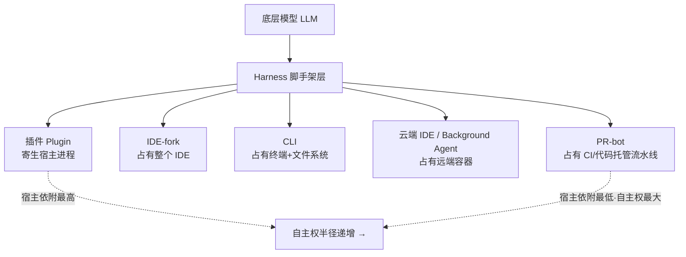

当一个 PM 在选型会上把 GitHub Copilot、Cursor、Claude Code、Devin Desktop 摆在一张表里逐项打勾时，他多半已经错了——因为这五个东西根本不在同一个抽象层上，把它们放进同一张 feature 对照表，等于拿"轮胎参数"去评判"飞机和汽车谁更好"。本节点要解决的问题是：**AI 编程工具有五种根本不同的「嵌入形态」(embedding form)——插件、IDE-fork、CLI、云端 IDE、PR-bot——它们在「宿主依附度」「上下文边界」「自主权半径」三个维度上处在不同层级；判断主轴是「形态错配」：用评估 A 形态的心智模型去评估 B 形态，会系统性地看错它的价值与风险。** 本节的视角框架是：嵌入形态不是产品的外观，而是它对 [Harness 词义辨析](/kb/专题-安全对齐与失败/harness-词义辨析/) 中「harness 主体归属」的根本承诺——谁拥有那层包裹模型的脚手架，决定了一切。

## §0 为什么用「嵌入形态」这个框架，而不是「功能清单」或「IDE vs CLI」二分

读者脑中默认有两个错误框架，先各打掉一个。

**错误框架一：功能清单对照（feature matrix）。** "支持多文件编辑吗？有 Agent 模式吗？接 MCP 吗？"——2026 年这些功能已经全员收敛，Copilot 的 Agent Mode 在 2026-03 GA（来源：GitHub Docs，2026-06 WebSearch），Cursor、Claude Code、Devin Desktop 全有 subagent，连开源的 Aider 都能自动跑 lint/test 并修复。**功能趋同恰恰说明功能不再是区分维度**。差异沉淀到了更下面一层：这套功能跑在谁的进程里、能看见多大的上下文、被授权走多远。

**错误框架二：「IDE vs CLI」简单二分。** 这个二分把 Cursor（IDE-fork）和 Copilot（插件）混为一谈——它们都是图形 IDE 里的体验，但 Copilot 寄生在微软的 VS Code 进程里、受 VS Code 扩展 API 的天花板约束，Cursor 则 fork 了整个 VS Code、能改渲染层和补全管线（Cursor 的 Tab 补全延迟 <100ms、靠的就是 fork 后端能力，来源：deployhq.com，2026 WebSearch）。同样，它把 Claude Code（CLI）和云端 PR-bot 混为"无 GUI"一类，但二者的自主权半径差着一整个数量级。

**正确框架是三维层级坐标**：

| 维度 | 含义 | 决定了什么 |
|---|---|---|
| 宿主依附度 | 工具寄生于谁的进程/天花板受谁约束 | 能力上限、被宿主"卡脖子"的风险 |
| 上下文边界 | 工具能主动看到/检索多大范围 | 跨文件能力、长上下文 vs 检索之争（见 [c09 - RAG 架构](/kb/基础知识库/c09-rag-架构/)） |
| 自主权半径 | 一次授权后能连续走多远而不回头问人 | 信任校准、失败模式、人机协作设计 |

五种形态在这三维上的坐标不同，所以**适配的评估问题也不同**。这就是为什么不能用一张表打勾——你得先问"它是哪种形态"，再问"对这种形态该问什么"。

## §1 五种形态的层级定义与坐标

**形态一 · 插件 (Plugin)。** 代表：GitHub Copilot（VS Code / JetBrains / Visual Studio / Neovim 多 IDE 插件，也嵌入 GitHub.com 网页，来源：GitHub Docs）。寄生在别人的 IDE 进程里，受宿主扩展 API 的天花板约束。优势是零迁移成本——开发者不换工具链；代价是能力上限被宿主锁死（无法重写补全渲染管线，无法深度改 UI）。Copilot 的 Next Edit Suggestions（预测下一处编辑位置）、Agent Mode 都是在 VS Code 扩展协议允许的边界内实现的。

**形态二 · IDE-fork（AI 原生 IDE）。** 代表：Cursor（VS Code fork）、Devin Desktop（原 Windsurf，2026-06-02 改名，VS Code 内核，来源：devin.ai/blog）、字节 TRAE（VS Code 开源分支，新加坡子公司发行，来源：InfoQ 2025-03）。整个 IDE 归自己，可以改渲染层、补全后端、UI 重心。Cursor 3（2026-04-02 发布，来源：deployhq.com WebSearch）把界面重心整体转向 Agent。代价是：用户必须放弃原 IDE，迁移成本高，且自己要扛起整个 IDE 的维护与稳定性（2025 年 IDE-fork 类工具的信任侵蚀主因是服务不稳定，而非功能不够，见 dx-trust 简报 RedMonk 2025-12 数据）。

**形态三 · CLI（命令行 agent）。** 代表：Claude Code（CLI 为主，附 VS Code / JetBrains sidebar 集成与桌面 App，来源：Anthropic 产品页 WebFetch）、Aider（纯 CLI，开源 MIT）。占有终端和文件系统，不依附任何 IDE 进程，把"长上下文问题转化为文件系统导航问题"（grep / terminal / python 主动检索，见 arXiv 2603.20432）。优势是宿主依附度最低、可脚本化、可进 CI；代价是无图形界面，对非终端用户门槛高。

**形态四 · 云端 IDE / Background Agent。** 代表：Cursor Background Agents、Claude Code 后台 session（Agent View，2026-05-11 发布的 CLI 统一仪表盘，来源：cloudzero.com 2026）、Devin 云端 agent。任务跑在远端容器里，异步执行，本地只看进度。自主权半径再扩一格——人不在场也能跑。

**形态五 · PR-bot（流水线嵌入）。** 代表：Cursor Bugbot（Teams/Enterprise 的 agentic code review）、GitHub Copilot Code Review（2026-06-01 起消耗 AI Credits + Actions 分钟，来源：GitHub Changelog 2026-06-01 WebFetch）、各类 CI 里跑的自主 agent。嵌入代码托管/CI 流水线，事件驱动（开 PR、提 issue 即触发），自主权半径最大——它直接对仓库动手，人只在 review 环节介入。

注意：**同一个产品可以横跨多个形态**。Claude Code 既是 CLI（形态三）又有 Background session（形态四），还能在 CI 里跑（形态五边缘）；TRAE 既是 IDE-fork 又起步于豆包 MarsCode 插件（形态一）。形态是"模式"不是"产品标签"——这正是为什么"产品对产品打勾"会错。

## §2 三维坐标下的权衡矩阵

| 形态 | 宿主依附度 | 上下文边界 | 自主权半径 | 代表产品 | 适配的核心评估问题 |
|---|---|---|---|---|---|
| 插件 | 最高（受宿主 API 锁） | 当前文件+打开的 tab+按需检索 | 小（补全/单步建议） | GitHub Copilot | 补全延迟、宿主兼容性、迁移成本 |
| IDE-fork | 中（自有 IDE，但仍 VS Code 内核） | 全工程索引+Repo Map | 中（多文件 Agent，可后台） | Cursor / TRAE / Devin Desktop | UI 体验、补全质量、模型可换性、稳定性 |
| CLI | 最低（只依赖 shell+fs） | 全文件系统+grep/工具主动检索 | 中大（可脚本/可无人值守） | Claude Code / Aider | Harness 可控性、权限分级、可组合性 |
| 云端 IDE | 低（远端容器自有） | 远端全仓+并行 | 大（异步、人不在场） | Background Agents | 并行度、隔离性、回滚、成本可控 |
| PR-bot | 最低（事件驱动嵌入流水线） | 整 PR diff+CI 上下文 | 最大（直接改仓库） | Bugbot / Copilot Code Review | 误报率、CI 成本、护栏与审计 |

这张表的用法：**先在左列定位被评对象的形态，再读最右列——那一列才是对它该问的问题**。拿"补全延迟"去问 PR-bot、拿"误报率"去问插件，都是形态错配。

## §3 判断主轴：形态错配——用插件思维评 CLI agent 的四类致命错位

这是本节点的命门。形态错配不是抽象毛病，它有四个可观测的反例：

**错位一：用「补全好不好」评 CLI agent。**
- **症状**：PM 试用 Claude Code，第一反应是"它的 Tab 补全没有 Cursor 跟手"，于是判定 Claude Code 不行。
- **为什么会错**：补全（completion）是插件/IDE-fork 形态的核心交互——人主导、AI 补片段、毫秒级反馈循环（Cursor Tab <100ms）。CLI agent 的核心交互是**委派（delegation）**——人给目标、AI 自主跑完一个任务循环。用补全的延迟指标去评一个委派型工具，等于用"方向盘手感"评自动驾驶。
- **正确做法**：评 CLI agent 看的是 [Harness 词义辨析](/kb/专题-安全对齐与失败/harness-词义辨析/) 意义上的脚手架可控性——权限分级粒度、工具调用编排、能否安全地无人值守。
- **真实反例**：Stripe 在 1370 名工程师中部署 Claude Code（来源：Anthropic 官网企业案例 WebFetch），看中的不是补全跟手，是大规模工程组织里的可脚本化与权限管控；Wiz 用它 20 小时完成 5 万行 Python→Go 迁移——这是委派任务，不是补全任务。

**错位二：用「迁移成本」评 PR-bot。**
- **症状**：PM 说"我们团队都用 JetBrains，换不了 Cursor，所以 agentic 编程对我们没用"。
- **为什么会错**：把整个 agentic 能力等同于 IDE-fork 形态。PR-bot 形态根本不需要开发者换 IDE——它嵌在 GitHub/CI 流水线里，开发者照常用 JetBrains，agent 在 PR 上自动 review。
- **正确做法**：按形态分别评估——IDE 层用插件（零迁移），自主任务走 CLI/云端，质量门走 PR-bot，三层叠加，谁说必须二选一？
- **真实反例**：GitHub Copilot 自身就是"插件 + Agent Mode + Code Review（PR-bot）"多形态叠加，开发者不换 IDE 也能吃到 agentic review。

**错位三：用「单次请求质量」评云端 Background Agent。**
- **症状**：PM 评测 Background Agent，像评聊天机器人一样看"这一次回答对不对"。
- **为什么会错**：Background Agent 的价值在**并行度 × 异步 × 隔离**——一次派出去五个子任务、人去开会、回来收结果。它的关键指标是吞吐与可回滚，不是单次准确率。
- **正确做法**：评云端形态看并行 session 管理（Claude Code 的 Agent View、Devin 的 Agent Command Center Kanban）、容器隔离、成本上限（避免后台烧钱）。
- **真实反例**：Cursor 2025-06 从"500 次请求包月"改为信用额度制（来源：getpanto.ai 2026-06 WebSearch），$20 计划约折合 225 次高级请求——后台 agent 一旦放开跑，成本可控性立刻变成第一指标，这是单次质量视角完全看不到的。

**错位四：用「自主权越大越好」评所有形态（线性进步谬误的形态版）。**
- **症状**：PM 默认 PR-bot > 云端 > CLI > IDE-fork > 插件，自主权越大越先进。
- **为什么会错**：自主权半径与失败代价正相关。Anthropic 官方测得用户批准了 93% 的权限请求——手动审查已沦为橡皮图章（来源：Anthropic Engineering Blog "Claude Code auto mode" 2026-03-25 WebFetch）；其 auto mode 分类器的危险动作漏报率仍有 17%。自主权半径越大，这 17% 的爆炸半径越大。PR-bot 直接对 main 动手，错一次的代价远高于插件补错一行。
- **正确做法**：自主权是"旋钮"不是"阶梯"——按任务可逆性匹配形态。可逆性边界处确认（而非每步或仅末尾）使任务时间减少 13.54%、81% 开发者偏好（arXiv:2510.05307）。
- **真实反例**：Claude Code 的权限模式恰恰是一条旋钮：`default`（仅读）→ `acceptEdits` → `plan` → `auto` → `bypassPermissions`（仅限隔离容器，来源：Claude Code 权限模式官方文档 WebFetch 2026-06-07）。它默认阻断 `curl | bash`、强推 main、生产部署——形态自主权越大，护栏越要前置。

## §4 产品 PM 视角补盲：形态背后的商业模式与合规分歧

工程视角只看"哪种形态能力强"，PM 必须补三个看走眼点：

**(1) 形态决定计费模式，计费模式决定留存风险。** 插件形态（Copilot）2026-06-01 全面切到 AI Credits 用量计费，补全不消耗、聊天/agent/review 消耗（来源：GitHub Changelog WebFetch）；Visual Studio Magazine 标题直言"You Will Get Less, but Pay the Same Price"（2026-04-27）。IDE-fork（Cursor）改信用额度后被批"缩水"。**自主权半径越大的形态，计费越倾向用量制，预算越不可控**——PM 选型时，CLI/云端形态的"成本可控性"必须前置，否则后台 agent 一跑，月底账单失控。

**(2) 形态决定合规边界。** 国产工具的形态选择高度受合规驱动：TRAE、通义灵码（2026-05 已更名 QoderCN，来源：阿里云开发者社区）走 IDE-fork + 国内服务器 + 私有化部署，因为等保/信通院认证要求数据本地化，Cursor/Copilot 的美国法律管辖在合规敏感企业是硬伤。**反例警示**：TRAE 曾被 Unit 221B 安全研究指控关闭遥测后仍每 30 秒向字节服务器发数据（来源：The Register 2025-07-28，字节已回应称遥测开关仅控 VS Code 层）——IDE-fork 形态因为占有整个 IDE，其遥测/数据采集面比插件大得多，这是形态本身带来的信任成本，争议尚未完全平息〔以 2026-06 为准〕。

**(3) 形态决定用户心智门槛与 GTM。** CLI 形态（Claude Code、Aider）对非终端用户门槛高，个人开发者体验缺乏公开对比数据；但它在大型工程组织（Stripe/Ramp/Wiz）落地反而快，因为这些组织本就脚本化运维。**形态错配的 GTM 版**：把 CLI agent 当大众产品推、把插件当企业级方案卖，都会错配渠道。

## §5 对手框架回应：接受"形态终将统一"，但坚持当下错配代价真实

**业界反方立场（产品融合论）**：很多人认为形态区分是过渡现象——Cursor 把 IDE-fork + 云端 + PR-bot（Bugbot）全做了，Copilot 把插件 + Agent + Review 全做了，Devin Desktop 用 Agent Command Center 统一本地+云端 agent，最终所有工具都会变成"全形态平台"，形态辨析没意义。

**接受它对的部分**：是的，头部产品确实在多形态融合，2026 年的趋势就是单一产品横跨多形态（§1 已承认 Claude Code 跨 3 形态）。融合是真的。

**但坚持的边界与赌注**：融合的是"产品",不是"评估维度"。即使一个产品横跨五形态，PM 在用它的某个具体功能时，仍然落在某一个形态层上——你用 Bugbot 时它就是 PR-bot 形态，该问误报率而非补全延迟。**形态辨析不是产品分类法，是「评估问题的路由表」**：它帮你在面对一个具体使用场景时，30 秒内路由到对的问题集。融合让产品更全，但没有取消"每个形态有自己的失败模式与指标"这个事实。我赌的是：未来 2–3 年，五形态的「评估问题差异」不会消失，会消失的只是"一个产品只做一种形态"的局面。**这个赌注的失效边界**：如果出现一种统一的人机协作范式（比如某种全自主 agent 把补全/委派/审查的交互全部抹平），那时形态区分确实会退化为历史名词——但 METR RCT（资深开发者用 AI 反而慢 19%，arXiv:2507.09089）这类反直觉数据说明，人机协作的交互形态远未收敛，赌注暂时安全。

**第二个对手框架（Rick 未必熟，破 echo chamber）——Aider 的"工具能力取决于后端模型"论**：Aider 作者实际上拒绝把 Aider 当成一个固定能力的工具来横评——它在 SWE-bench 上没有独立条目，因为其能力取决于挂哪个 LLM（来源：SWE-bench 简报争议点 6）。这等于在说"形态不是能力的决定变量，模型才是"。**接受**：模型确实是能力上限的主导项。**边界**：但形态决定了同一个模型能发挥多少——同一个 Claude Opus，在插件形态里受 IDE API 锁只能补全，在 CLI 形态里能 grep 整个文件系统、跑测试、提交 Git。形态是"模型能力的传导效率"，不是装饰。这正是 [S03 Harness Engineering 全景](/kb/专题-安全对齐与失败/s03-harness-engineering-全景/) 的核心论点：harness 决定模型能力的兑现率。

## §6 跨域呼应：麦克卢汉"媒介即讯息"——嵌入形态本身就是讯息

调度一个 Rick 熟悉的框架：麦克卢汉（Marshall McLuhan）的"媒介即讯息"（the medium is the message）。麦克卢汉的核心论点是：一种媒介真正改变社会的，不是它承载的内容，而是它作为媒介本身重塑了人的感知尺度与行为模式——重要的不是电视播什么，而是"电视"这个形态本身改变了我们如何感知世界。

把这个框架搬到嵌入形态辨析上，它**直接改变了一个技术判断**：PM 习惯问"这个工具底层用什么模型、能力多强"（内容），但麦克卢汉提醒——**真正决定开发者工作方式被如何重塑的，是嵌入形态本身（媒介），不是模型（内容）**。插件形态把开发者锁在"人主导、AI 补片段"的感知模式里，CLI 形态把开发者推向"我是任务委派者、AI 是执行者"的全新角色，PR-bot 形态则把开发者从"写代码的人"变成"审 PR 的人"。同一个 Claude Opus 模型，在不同形态里，重塑出的是三种完全不同的开发者主体性。所以"形态错配"的深层错误是**用错了媒介人类学**：你以为在评估一个内容（模型能力），实际上漏看了媒介（形态）对工作方式的结构性重塑。这也呼应 [Polanyi 默会知识与提示工程的认识论张力](/kb/基础知识库/polanyi-默会知识与提示工程的认识论张力/)——不同形态承载不同比例的默会知识：补全形态把默会知识留在人手里，委派形态要求人把默会知识显式化为 prompt 与 harness 配置。

## §7 PM 决策启示：面试 / 选型 / 复现三类落地

**面试桌**：被问"你怎么看 Cursor 和 Claude Code 谁更好"，不要陷入 feature 对比。回答："它们不在同一形态层——Cursor 是 IDE-fork、核心是补全与可视交互，Claude Code 是 CLI、核心是任务委派与脚手架可控性。问'谁更好'之前要先问'你的团队是要降低个人写代码摩擦，还是要规模化自动化工程任务'——前者选 IDE-fork，后者选 CLI/云端。"——这一句话展示了"形态路由"思维，比背 feature 表高一个抽象层。Rick 关注 TRAE 求职方向：可补一句"TRAE 选 IDE-fork 形态是合规驱动的必然——国内市场数据本地化要求让插件/云端形态先天受限，IDE-fork + 国内服务器是字节的形态护城河"。

**选型会**：把右列"适配评估问题"做成 checklist——先定位形态，再只问该形态该问的问题。拒绝一张大而全的 feature 矩阵。对成本敏感场景，把"自主权半径越大→计费越用量制→预算越不可控"作为一条硬约束写进决策表，关联 [m209 - 推理成本控制手册](/kb/工程化与落地架构/m209-推理成本控制手册/)。

**复现台**：想自己搭一个 agentic 工作流时，按可逆性分配形态——可逆任务（生成草稿、跑探索性查询）放高自主权形态（CLI auto / 云端 background），不可逆任务（改 main、删文件、部署）强制低自主权形态或人工门控。这正是 Claude Code 权限模式旋钮的设计哲学。

## §8 与已有节点的关系

- 对照 **[Harness 词义辨析](/kb/专题-安全对齐与失败/harness-词义辨析/)**（0411 专题）：本节点是它的**深化 + 应用**。Harness 辨析讲"脚手架是什么、归属谁"，本节点把"归属谁"具体化为五种嵌入形态——形态本质上是 harness 主体归属的产品化表达。不复述 harness 的词义，只用它的"主体归属"结论作为本节点的分析地基。
- 对照 **[S03 Harness Engineering 全景](/kb/专题-安全对齐与失败/s03-harness-engineering-全景/)**（0411 专题）：本节点是它在"产品形态"维度的**切片**。S03 讲 harness 工程的六维全景，本节点只取"形态如何决定模型能力兑现率"这一条线展开。
- 对照 **[c10 - Agent 技术栈与工具调用](/kb/基础知识库/c10-agent-技术栈与工具调用/)**（0401 基础库）：本节点是它的**升格补缺**。c10 讲 Agent 的工具调用技术栈（G3 截面），本节点补的是"同一套工具调用能力，在不同嵌入形态里被授予不同的自主权半径与上下文边界"——技术栈相同，形态不同，产品价值与风险天差地别。不复述 c10 的 Function Calling / 工具编排基础。
- 与本专题 **[E02 Claude Code 剖解·CLI 哲学](/kb/专题-工程与成本/e02-claude-code-剖解-cli-哲学/)**、**[E03 字节 TRAE 与 Windsurf 剖解](/kb/专题-工程与成本/e03-字节-trae-与-windsurf-剖解/)**：本节点提供形态坐标系，E 系列节点是坐标系里的具体实例点位（Claude Code = CLI 跨形态典型；TRAE = 合规驱动的 IDE-fork 典型）。

## §9 关联节点

**核心（必读）**
- [Harness 词义辨析](/kb/专题-安全对齐与失败/harness-词义辨析/) — 本节点的分析地基：形态 = harness 主体归属的产品化
- [S03 Harness Engineering 全景](/kb/专题-安全对齐与失败/s03-harness-engineering-全景/) — 形态决定模型能力兑现率的全景论证
- [c10 - Agent 技术栈与工具调用](/kb/基础知识库/c10-agent-技术栈与工具调用/) — 被升格的基础节点：同栈不同形态
- [Claude Code](/kb/ai-公司与产品/claude-code/) — CLI + 云端跨形态典型实例（产品卡）
- [字节 TRAE 团队人物图谱](/kb/ai-公司与产品/字节-trae-团队人物图谱/) — 合规驱动 IDE-fork 形态的国产典型
- [m207 - Agent 产品化：场景推演与失败模式](/kb/工程化与落地架构/m207-agent-产品化-场景推演与失败模式/) — 自主权半径与失败模式的对应

**延伸（可选）**
- [c09 - RAG 架构](/kb/基础知识库/c09-rag-架构/) — 上下文边界维度：长上下文 vs 检索之争
- [m208 - AI 基础设施与中间件选型](/kb/工程化与落地架构/m208-ai-基础设施与中间件选型/) — 形态选型的中间件视角（MCP 协议的信任空白）
- [m207 - Agent 产品化：场景推演与失败模式](/kb/工程化与落地架构/m207-agent-产品化-场景推演与失败模式/) — 自主权半径越大失败代价越大
- [Polanyi 默会知识与提示工程的认识论张力](/kb/基础知识库/polanyi-默会知识与提示工程的认识论张力/) — 不同形态承载不同比例的默会知识
- [Function Calling](/kb/基础知识库/function-calling/) — 工具调用是所有形态的共同底座
- [Agent](/kb/基础知识库/agent/) — agentic 形态（CLI/云端/PR-bot）的能力前提
- [Anthropic](/kb/ai-公司与产品/anthropic/) / [Claude](/kb/ai-公司与产品/claude/) — Claude Code 的形态承诺出自其 harness 主体归属哲学
- [AI PM 知识图谱·总索引](/kb/ai-pm-知识图谱/ai-pm-知识图谱-总索引/) — 回到总索引

## 修订日志

- **R1（2026-06-07）**：首稿。建立五形态 × 三维坐标框架；判断主轴"形态错配"四类错位（补全评 CLI / 迁移成本评 PR-bot / 单次质量评云端 / 自主权线性谬误）；接入产品融合论 + Aider"模型决定论"两个对手框架；跨域呼应麦克卢汉"媒介即讯息"。所有产品行为/定价/用户量数据接地至接地证据简报（口径 2026-06），volatile 项已标日期，无法核实项标〔以 2026-06 为准〕或〔待核实〕。
