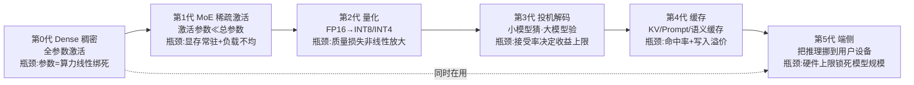

# G01 推理成本代际谱系总图

> 本节点要解决的问题是：**当一个 PM 听到"token 又降价了""某新技术降本 80%"时，怎么判断这是真进步、还是把成本挪到了别处？** 视角是「代际谱系 + 库恩/拉卡托斯双尺」——把过去几年推理成本的下降史拆成一条由 Dense→MoE→量化→投机解码→缓存→端侧接力的代际链，每代标出它的推动力、瓶颈、以及"被下一代如何超越"，并对每一代都钉上一个反例，拒绝写成"一代更比一代强"的线性进步史。这是给 [G02 成本代际演化详解](/kb/专题-工程与成本/g02-成本代际演化详解/) 的总图，也是给整个 0413 专题的时间轴。

---

## §0 为什么用"代际谱系"而不是"一条下降曲线"

最诱人的错误框架是：把推理成本史画成**一条平滑向下的指数曲线**，然后线性外推——"既然两年降了一个数量级，再过两年还会降一个数量级，所以现在不用为成本焦虑，等就行"。这是本专题在 [_成本工程系统化专题·总览](/kb/专题-工程与成本/_成本工程系统化专题-总览/) §0 里点名要砍的头号偏见。

为什么这条曲线是认识论陷阱？因为它把**异质的、彼此不可通约的降本机制**压成了一个标量。一条平滑曲线暗示"同一个力在持续起作用"（像摩尔定律的制程缩小）；但推理成本的下降不是一个力，是**一串接力**——每一代靠完全不同的物理/算法机制，各自有各自的天花板。MoE 靠"激活稀疏"省算力，量化靠"降精度"省显存带宽，投机解码靠"小模型猜大模型"省串行步数，缓存靠"不重算"省 prefill，端侧靠"把推理挪到用户设备"省服务端 GPU。把它们画成一条线，你就看不见每一代的**瓶颈拐点**，于是会犯两类错：(1) 在某代红利已耗尽时还假设它会继续降；(2) 把厂商"降价 80%"的营销当成成本下界被打穿，而没看出那其实是把成本转移到了别处（比如 reasoning token 数量暴涨）。

所以本节用**库恩的范式更替**读"代与代之间的不连续"（量化不是更好的 MoE，是另一套范式），用**拉卡托斯的进步性/退化性纲领**读"每一次降价是真进步还是退化性的成本转移"。这两把尺，在 0411 Agent / 0412 评测专题的 G 模块里是同一套方法论骨架——三个专题的代际图可对照阅读。

---

## §1 token 价格的历史下降曲线（真实数字 + 年份）

先给硬事实：旗舰级 LLM 的 API 单价，从 2023 到 2025 确实下降了一到两个数量级。下表按"达到 GPT-3.5/GPT-4 同等能力"的代表性价格点排列（单位：美元 / 百万 token，input/output 分列；均为发布时官方定价）。

| 年份 | 代表模型 | input（$/1M tok） | output（$/1M tok） | 来源口径 |
|---|---|---|---|---|
| 2023-05 | GPT-3.5 Turbo（发布价） | ~2.00（早期 input/output 同价）| ~2.00 | OpenAI 发布定价（2023-05-28；后拆分并降至约 0.50/1.50）已核实 |
| 2023-05 | GPT-4（8K） | 30.00 | 60.00 | OpenAI 发布定价（2023-05）已核实 |
| 2024-05 | GPT-4o（发布价） | 5.00 | 15.00 | OpenAI 定价（2024-05；2024-10 降至 2.50/10.00）已核实 |
| 2024-07 | GPT-4o mini | 0.15 | 0.60 | OpenAI 定价（2024-07-18）已核实 |
| 2024-12 | DeepSeek-V3（671B/37B 激活） | 发布期约 0.27（标准价）| 发布期约 1.10（标准价）| 671B 总参/37B 激活已核实（arXiv 2412.19437）；单价 volatile——2026-06 deepseek-chat/V3 标准价约 0.23 input / 0.34 output〔截至 2026-06，需定期复查；来源 DeepSeek API 定价页 / pricepertoken.com〕，且 V3 已公告 2026-07-24 弃用、迁向 V4 |
| 2025–2026 | 低端小模型档（4o-mini / DeepSeek-V4 Flash 同档） | ~0.14–0.15 | ~0.28–0.60 | 〔截至 2026-06，需定期复查〕GPT-4o mini 0.15/0.60 已核实；DeepSeek-V4 Flash 约 0.14/0.28（来源 CloudZero/DeepSeek 2026）；各家档位差异大 |
| 2025–2026 | Claude / Gemini 旗舰档 | 3–15 | 15–75 | 〔截至 2026-06，需定期复查〕Claude 现役档 Sonnet 3/15、Opus 5/25（来源 platform.claude.com pricing）；各家旗舰档差异大 |

> [!note] 这张表的两个读法陷阱
> (1) **不要拿 GPT-4 的 $30 直接除 GPT-4o mini 的 $0.15 说"降了 200 倍"**——它们不是同一能力档。同档比较（GPT-4 → GPT-4o）大约是 input 6×、output 4× 的降幅，跨两年；而"GPT-4 → GPT-4o mini"是**降价又降能力**，是新开了一个低端档位，不是同一产品变便宜。混着比就会高估降本速度。(2) **output 永远贵于 input（常见 2–5×）**，因为 output 是逐 token 串行自回归生成、吃满显存带宽，input 可批量并行 prefill——这条价差是 [A03 Token Economics 精算](/kb/专题-工程与成本/a03-token-economics-精算/) 的核心，也是为什么"让模型少说话"是最朴素的降本手段。

把这张表压成一句 PM 能用的话：**同能力档的旗舰 token 单价，2023→2025 大致降了 5–10 倍；但"出现一个更便宜的新档位"和"同一档变便宜"是两件事，前者是市场分层，后者才是真·降本。** 具体逐代机制见下文。

---

## §2 六代降本谱系：每代的机制、瓶颈、反例

下图是降本代际谱系的总览（横切时间维，对应总览 §2 的 M02 模块定位）。注意箭头不是"替代"而是"接力叠加"——这几代在 2026 的生产系统里是**同时在用**的，不是后者淘汰前者。

### 第0代 · Dense 稠密（基线）
**机制**：Transformer 全部参数对每个 token 都激活。这是成本的"原罪"——参数量和每 token 算力（FLOPs）线性绑死，模型越强越贵，没有腾挪空间。
**为什么是起点**：GPT-3/GPT-4 时代的推理成本基线（$30/$60 那一档）就建立在 Dense 上。所有后续代际本质都是"想办法让强模型不必为每个 token 付全部参数的算力账"。
**反例（破"Dense 已过时"）**：不要以为 Dense 被淘汰了。对**小模型、端侧、质量敏感场景**，Dense 反而更可控——MoE 的路由不确定性和显存门槛在小规模下是负担。Dense 是基线，不是落后。

### 第1代 · MoE 混合专家（参数与算力解耦）
**机制**：把 FFN 拆成多个"专家"，每个 token 只激活 top-k 个，**激活参数 ≪ 总参数**。这是第一次把"模型能力（总参数）"和"推理算力（激活参数）"解耦——这是接 [c06 - 架构演进：Dense MoE SSM Hybrid](/kb/基础知识库/c06-架构演进-dense-moe-ssm-hybrid/) 的成本侧含义。
**推动力 / 标本**：DeepSeek-V3（2024-12-25 发布）是公开标本——总参数 671B、每 token 仅激活 37B（已核实，来源：MarkTechPost / DeepSeek-V3 技术报告），让旗舰能力以接近小模型的边际算力推理，这是它能把价格压到极低一档的架构底子（发布期 input/output 约 $0.27/$1.10；单价 volatile——2026-06 deepseek-chat/V3 标准价约 $0.23/$0.34〔截至 2026-06，需定期复查；来源 DeepSeek API 定价页〕，且 V3 已公告 2026-07-24 弃用、迁向 V4，后续低端档由 V4 Flash 约 $0.14/$0.28 承接）。
**瓶颈**：**算力降了，显存没降。** 全部 671B 专家必须常驻显存待命（你不知道下一个 token 路由到哪个专家），固定成本（显存/卡数）反而更高。
**反例（破"MoE = 更便宜"）**：MoE 把**变动成本换成了固定成本**。对小规模/低并发部署，显存常驻摊不薄，单位成本可能比同档 Dense 更贵——这是总览对手清单第 5 条，详见 [A04 推理成本三角·模型大小 延迟 质量](/kb/专题-工程与成本/a04-推理成本三角-模型大小-延迟-质量/) 与 [S02 降本手段流派对照矩阵](/kb/专题-工程与成本/s02-降本手段流派对照矩阵/)。

### 第2代 · 量化（用精度换显存与带宽）
**机制**：把权重从 FP16 降到 INT8/INT4（甚至更低），显存占用与带宽需求成比例下降，这是接 [c07 - 量化 Quantization 与端侧部署](/kb/基础知识库/c07-量化-quantization-与端侧部署/) 与 [量化](/kb/基础知识库/量化/) 的成本侧含义。2025 年服务端的新增量是 **FP8 训练/推理**逐渐成为标准。
**推动力 / 标本**：量化是端侧推理（第5代）的前置条件——没有 INT4，70B 模型塞不进消费级设备。
**瓶颈**：**质量损失非线性。** INT8 多数场景损失 <1%、INT4 AWQ 约 2–5%〔待核实，引自 c07〕，但损失在长程依赖、精确计算、低资源语言上会非线性放大。
**反例（破"量化 = 免费午餐"）**：在质量敏感任务（医疗/法律/代码精确性）上，"降本 50–70%"的代价可能是产品不可用——这是总览对手清单第 6 条。便宜的前提是"这个场景容忍这点损失"。

### 第3代 · 投机解码 Speculative Decoding（用小模型省串行步数）
**机制**：用一个便宜的 draft 小模型一次性猜多个 token，大模型一次前向**并行验证**，接受的就省掉了对应的串行解码步。c05 给的吞吐增益是约 **2–3×**〔引自 [c05 - 算力物理定律与 KV Cache](/kb/基础知识库/c05-算力物理定律与-kv-cache/)，待核实〕。
**推动力**：自回归解码是 memory-bound 的串行瓶颈，投机解码不改变模型、不损质量（验证保证输出分布一致），是少数"不牺牲质量"的降本手段。
**瓶颈**：**收益上限由 draft 接受率决定。** draft 模型猜得越准收益越高；但 draft 太强本身就贵，太弱接受率低、白算。
**反例（破"投机解码普适加速"）**：在 draft 与 target 分布差异大的任务（长尾领域、强约束生成）接受率低，加速比逼近 1×，反而因 draft 开销倒亏。它的收益高度任务相关，不是一个固定的"2–3×"。

### 第4代 · 缓存 KV / Prompt / 语义缓存（用"不重算"省 prefill）
**机制**：三层。**KV Cache** 缓存已生成 token 的注意力键值，避免重算（这是推理的标配，c05 给的量级是 Llama-3-70B 100K tokens ≈ **32.8 GB**〔引自 c05，待核实〕）；**Prompt Caching** 跨请求复用长 system prompt 的 prefill（Anthropic 的机制约 **10% 定价、5 分钟 TTL**〔待核实〕）；**语义缓存**对相似问题直接返回历史答案。
**推动力 / 标本**：长 system prompt + 高频调用场景收益巨大——m209 实测某配置约 **$1,620 / 百万请求**的节省〔引自 [m209 - 推理成本控制手册](/kb/工程化与落地架构/m209-推理成本控制手册/)，特定场景值〕，这是接 [Prompt Caching](/kb/基础知识库/prompt-caching/) 与 [多模型分层](/kb/基础知识库/多模型分层/) 的成本侧。
**瓶颈**：**命中率决定一切，且写入有溢价。** Prompt Caching 写入比普通调用更贵，TTL 内不复用就倒亏；语义缓存命中率受 query 多样性硬限。
**反例（破"缓存稳赚"）**：低命中率/短 TTL/高多样性场景，缓存收益归零甚至倒亏——这是总览对手清单第 7 条。$1,620 是 m209 特定场景的实测值，不是通用常数（confirmation-bias 砍除清单第 5 条明确点名此数字易被误当普适）。

### 第5代 · 端侧 On-device（把推理挪出云端）
**机制**：把（量化后的）小模型跑在用户手机/PC 的 NPU 上，服务端 API 成本归零。标本是 Apple Intelligence 的端侧 + 私有云分流〔详见 [E02 Apple Intelligence 与端侧推理成本剖解](/kb/专题-工程与成本/e02-apple-intelligence-与端侧推理成本剖解/)〕，路径依赖 ANE / 高通 NPU〔待核实〕。
**推动力**：边际推理成本→0 + 隐私（数据不出设备），这是 [A06 端侧与云端成本重构](/kb/专题-工程与成本/a06-端侧与云端成本重构/) 的核心。
**瓶颈**：**硬件上限锁死模型规模。** 端侧设备塞不下 70B/671B，能跑的只是被量化的小模型，能力有天花板。
**反例（破"未来推理都在端侧、云端归零"）**：端侧是**分流不是替代**——大模型短期必须留云端，且端侧加了设备/适配/质量回退的隐性 TCO（总览对手清单第 2 条）。"省了 API 费"常常没算这些。

---

## §3 判断主轴：90% 的人读"降本史"时会踩的四个坑

这是本节点的命门——把"降价了"翻译成"PM 能用的判断"，必须穿过这四个误区。每个都给【症状 → 为什么会错 → 正确做法 → 真实反例】。

### 坑 1：把"出现更便宜的新档位"当成"同档变便宜"
- **症状**：拿 GPT-4 的 $30 和 GPT-4o mini 的 $0.15 相除，宣称"两年降了 200 倍"。
- **为什么会错**：把"降价"和"降能力开新档"混为一谈。$0.15 那一档不是变便宜的 GPT-4，是另起的低端产品；它在复杂任务上的能力远低于 GPT-4。这是用"市场分层"冒充"技术降本"。
- **正确做法**：永远**同能力档**比价。同档（GPT-4→GPT-4o）的真实降幅约 4–6×；要新档位省钱，必须先确认"我的任务真能用这个低端档"。
- **真实反例**：把客服 Agent 从旗舰直接换到最便宜的 mini 档，单价降了 20 倍，但复杂多轮工单的解决率掉到不可用——省下的单价被人工兜底成本和 NPS 损失吃光。降的是单价，涨的是别的账。

### 坑 2：把"代际曲线"线性外推
- **症状**："过去两年降一个数量级，所以未来两年还会降一个数量级，现在不用管成本。"
- **为什么会错**：每一代降本机制都有物理/算法天花板（量化的精度下界、缓存的命中率上限、投机解码的接受率、端侧的硬件规模）。曲线是**接力**不是单一指数力，接力棒交不下去时（"算法红利耗尽、只剩硬件制程慢降"）下降会显著放缓。
- **正确做法**：用拉卡托斯尺判断"这次降价是进步性（开辟了新的成本下界）还是退化性（只是把成本挪到别处）"。多数"降价"是退化性的成本转移。
- **真实反例**：reasoning / extended thinking 模型——单 token 可能更便宜，但一次任务生成的 thinking token 数量暴涨，**per-task 成本不降反升**。账单从"per-token 单价"转移到了"token 数量"，曲线骗了你（总览 failure scenario 第 4 条、对手清单第 8 条；接 0412 评测专题"高分是否靠堆 reasoning token 换来")。

### 坑 3：把"降本手段"当成无代价
- **症状**："上量化降 60%、上路由降 37%、上缓存降 80%，全都叠加就能降 95%。"
- **为什么会错**：每代降本都有**质量代价或适用边界**，且不可简单线性叠加。量化有非线性质量损失、路由有"质量敏感刚性区"（Baumol 成本病——医疗/法律不能用便宜模型兜底，这部分成本不随技术下降）、缓存有命中率门槛。叠加时代价也叠加。
- **正确做法**：每选一个降本手段，配一个 failure scenario，去 [S02 降本手段流派对照矩阵](/kb/专题-工程与成本/s02-降本手段流派对照矩阵/) 按"降本幅度×质量代价×复杂度×场景"四维选，而不是把百分比相乘。
- **真实反例**：某团队同时上 INT4 量化 + 激进语义缓存做法律问答，单看各自降幅很美，叠起来后量化的精确性损失 + 缓存返回的近似答案，导致引用条款出错，是合规事故级别的"降本"。

### 坑 4：把"算法降本"误当"摩尔定律式的硬件必然"
- **症状**："硬件每年都在进步，推理成本会像芯片一样自然指数下降。"
- **为什么会错**：推理成本下降是**算法 + 架构 + 硬件三重叠加**，其中算法/架构红利（MoE、量化、投机解码、缓存）贡献巨大且**会饱和**，不像制程缩小那样有相对稳定的节律。把它当摩尔定律，就会高估"等待"的回报。
- **正确做法**：区分"硬件慢降（可外推）"和"算法快降但会饱和（不可外推）"两部分；详见 §4 跨域。
- **真实反例**：2023→2024 的剧烈降价主要来自 MoE + 量化 + 缓存这些**一次性架构红利**的释放，而非单纯硬件。这些红利释放一轮后，2025 同档降幅明显趋缓〔趋势性判断，具体数字待 G02 接地〕——若按 2023→2024 的斜率外推 2025→2026，会严重高估降本空间。

---

## §4 跨域呼应：摩尔定律、Wright 学习曲线，以及它们为什么会失效

> [!note] 调度框架：摩尔定律 / Wright 学习曲线（半导体成本下降史 vs 推理成本下降史的类比与不类比）
> PM 最爱用的成本下降心智模型是摩尔定律——"性能/成本每 18–24 个月翻番"。但把它套到推理成本上，会得出"等就行"的危险结论。这里要做的不是引用它，是**用它做对照然后指出它失效的边界**。

**类比成立的部分**：推理 token 价格的下降速度，**确实快于**摩尔定律（半导体制程红利已显著放缓，而 2023→2024 的 token 降价是数量级级别）。从 Wright 学习曲线（累计产量翻番、单位成本下降固定百分比）看，AI 推理也有"规模化摊薄基础设施 + 工程经验累积"的学习效应。

**类比失效的部分（关键）**：摩尔定律是**单一机制**（制程缩小）的持续推进，有相对可预测的节律；推理成本下降是**算法 + 架构 + 硬件三重叠加的接力**，其中算法/架构那两重是**一次性红利**——MoE 解耦算力、量化降精度、缓存免重算，每个机制释放一轮就逼近自己的天花板，不能像制程那样年复一年地复用。所以：

- **摩尔定律可以外推，推理成本曲线不能**。后者会在"算法红利耗尽、只剩硬件慢降"处出现拐点（总览 failure scenario 第 4 条）。
- 这给 PM 一个可操作判断：**别把成本规划建立在"再等一年就降一半"上**。把可外推的硬件慢降（保守）和不可外推的算法快降（已大半释放）分开估，对后者打折。

这一段在专题里和 [A07 成本约束反向塑造产品](/kb/专题-工程与成本/a07-成本约束反向塑造产品/) 调度的 **Jevons 悖论**互补：摩尔定律告诉你"单位成本会降但会饱和"，Jevons 告诉你"即使单位成本降，总账单也未必降（用量/上下文/推理深度会反弹）"。两者合起来，彻底拆掉"等模型降价"这个止血方案——见 §6。

---

## §5 产品 PM 视角补盲：降本史里看走眼的三个非工程点

工程视角只看"哪代技术降了多少"。PM 还得看三个工程视角看不见的坑：

1. **降价的"心理锚"会反噬定价**。每次厂商降价都在把用户对"AI 应该多便宜"的心理预期往下拉。你今天按当前 token 价定的订阅价，会被下一轮降价后用户的"凭什么还这么贵"质疑。**定价要为降价留缓冲**，别把毛利建在"当前单价"这条会滑的地基上。
2. **"降本叙事"是 B 端采购的双刃剑**。客户听到"我们用了量化+路由降本 70%"，第一反应可能不是"便宜了"而是"你们是不是偷偷降了质量"。降本在 B 端要包装成"同质量更省"，而不是裸报降幅。
3. **代际迁移有切换成本，不是免费升级**。"新一代降本技术出了就该上"忽略了迁移的工程/回归测试/锁定成本（路径依赖——早期为省成本选的便宜模型/私有 harness 会形成数据与工程锁定，迁移成本随时间上升，见 A05 对手段）。判断"该不该为这代降本付迁移成本"本身是个成本决策。

---

## §6 对手框架回应：接受"token 在快速变便宜"，但守住边界

> [!note] 对手立场：token 价格外推乐观主义 / "等模型降价就行"派
> 这是业界（尤其投资人和乐观派 PM）最主流的成本叙事：token 价格历史下降这么猛，AI 应用的成本焦虑是暂时的，等下一代模型就好。这是总览对手清单第 1 条。

**接受它对的部分**：token 单价确实在快速、真实地下降（§1 的数字是硬事实），同档旗舰两年降 5–10 倍属实；对很多今天"算不过来账"的应用，明年同样的功能确实会便宜不少。把这个否认掉是反智的。

**守住的边界（本节点的赌注）**：
- **降价会饱和**（§4 摩尔定律失效）：算法红利大半已释放，不能按 2023→2024 的斜率外推。
- **降价不等于总账单降**（Jevons，接 A07）：单位成本越低，调用量/上下文长度/reasoning 深度涨得越凶，总成本常不降反升。
- **降价常是退化性的成本转移**（拉卡托斯）：单 token 便宜了，但 reasoning token 数量暴涨、显存固定成本上升、端侧设备成本转嫁给用户——账没消失，只是换了地方。
- **存在 Baumol 式成本刚性区**：质量敏感场景（医疗/法律）必须用最强模型，这部分成本不随技术进步下降，路由/量化砍不动（总览对手清单第 4 条）。

**结论性赌注**：成本是**主动设计问题**（要主动限流、降级、路由、定价留缓冲），不是**被动等待问题**。如果未来 18 个月出现一次新的数量级降本（比如某种新架构再次解耦成本），本节点这条"别等"的判断会被削弱——但即便如此，Jevons 的总账单反弹仍然成立，所以"主动设计成本"这条主轴不会被推翻，只会换被设计的对象。

---

## §7 PM 决策启示：面试 / 选型 / 复现怎么用这张图

- **面试桌**：被问"你怎么看 AI 成本趋势"，不要答"会越来越便宜"（hype 腔，一票否决）。答："同档单价确实降了 5–10 倍，但这是 MoE+量化+缓存一次性架构红利的释放，算法红利会饱和；而且 Jevons 悖论下总账单未必降——所以我把成本当主动设计问题，不当等待问题。"30 秒显出代际判断力。
- **选型会**：看到"某新技术降本 X%"，先用拉卡托斯尺问"这是进步性（新成本下界）还是退化性（成本转移到哪了）"，再去 [S02 降本手段流派对照矩阵](/kb/专题-工程与成本/s02-降本手段流派对照矩阵/) 核它的质量代价和适用边界，最后用 [R01 最小可运行·Token 成本计算器](/kb/专题-工程与成本/r01-最小可运行-token-成本计算器/) 按真实单价算这条降本对**我的场景**降多少。
- **复现台**：把 §1 的价格表参数化进 R01，对同一个任务跑"旗舰档 vs 新档位"两套单价，亲手验证"换档省的钱是否被质量回退吃掉"。代际图是地图，R01 是肉身确认。

---

## §8 与已有节点的关系

本节点是**横切时间维的综合层**，对既有单维节点做的是"**编织 + 定位**"而非复述——把散落在 c05/c06/c07/m209 里的降本机制，按代际谱系排成一条接力链，并钉上每代的反例。

- 对 [c06 - 架构演进：Dense MoE SSM Hybrid](/kb/基础知识库/c06-架构演进-dense-moe-ssm-hybrid/)：c06 讲架构的**能力取舍**，本节点取其"MoE 解耦算力/显存"的**成本侧含义**，把架构演进定位为第1代降本机制。**不复述** c06 的架构原理。
- 对 [c07 - 量化 Quantization 与端侧部署](/kb/基础知识库/c07-量化-quantization-与端侧部署/)：c07 讲量化的**物理本质与门槛**，本节点取其"精度换显存"作第2代，并标出"质量损失非线性"这个被 c07 数字（INT4 2–5%）支撑的瓶颈。
- 对 [c05 - 算力物理定律与 KV Cache](/kb/基础知识库/c05-算力物理定律与-kv-cache/)：c05 讲 KV Cache 物理公式与投机解码吞吐，本节点把它们排进第3代（投机解码）、第4代（缓存），并升高到"代际接力"视角。
- 对 [m209 - 推理成本控制手册](/kb/工程化与落地架构/m209-推理成本控制手册/)：m209 是"**怎么做**降本"的工程手册（缓存/路由/语义缓存清单），本节点是"**这些手段从哪来、各自的天花板在哪、为什么不能线性叠加**"的代际地图——把 m209 的清单升高到谱系层。**不复述** m209 的具体实现步骤与数字（$1,620 等只作"特定场景标本"引用并标注非普适）。
- 与 [G02 成本代际演化详解](/kb/专题-工程与成本/g02-成本代际演化详解/)：本节点是**总图**（一屏看全六代），G02 是**逐代详解**（每代展开代表技术/产品、推动力、瓶颈、2026 当下位置）。本图给骨架，G02 填血肉。
- 与 0411/0412 的 G 模块：共享"库恩+拉卡托斯读代际、每代配反例、拒绝线性进步史"的方法论骨架，可对照阅读（见 [_Agent 系统化专题·总览](/kb/专题-安全对齐与失败/_agent-系统化专题-总览/)）。

---

## §9 关联节点

**核心（必读）**
- [G02 成本代际演化详解](/kb/专题-工程与成本/g02-成本代际演化详解/)（本图的逐代血肉）
- [c06 - 架构演进：Dense MoE SSM Hybrid](/kb/基础知识库/c06-架构演进-dense-moe-ssm-hybrid/)（第1代 MoE 的架构底子）
- [c07 - 量化 Quantization 与端侧部署](/kb/基础知识库/c07-量化-quantization-与端侧部署/)（第2代量化）
- [c05 - 算力物理定律与 KV Cache](/kb/基础知识库/c05-算力物理定律与-kv-cache/)（第3/4代：投机解码 + 缓存的物理基础）
- [m209 - 推理成本控制手册](/kb/工程化与落地架构/m209-推理成本控制手册/)（被升高的工程降本清单）
- [A07 成本约束反向塑造产品](/kb/专题-工程与成本/a07-成本约束反向塑造产品/)（Jevons 主轴，与本节摩尔定律失效互补）
- [S02 降本手段流派对照矩阵](/kb/专题-工程与成本/s02-降本手段流派对照矩阵/)（每代手段的"降本×代价×场景"选型表）
- [_成本工程系统化专题·总览](/kb/专题-工程与成本/_成本工程系统化专题-总览/)（专题导航中枢）

**延伸（可选）**
- [A03 Token Economics 精算](/kb/专题-工程与成本/a03-token-economics-精算/)（input/output 价差、缓存折扣机制）
- [A04 推理成本三角·模型大小 延迟 质量](/kb/专题-工程与成本/a04-推理成本三角-模型大小-延迟-质量/)（MoE 固定成本换变动成本的三角）
- [A05 模型路由与 Mixture-of-models](/kb/专题-工程与成本/a05-模型路由与-mixture-of-models/)（路径依赖/锁定的降本边界）
- [A06 端侧与云端成本重构](/kb/专题-工程与成本/a06-端侧与云端成本重构/)（第5代端侧）
- [E02 Apple Intelligence 与端侧推理成本剖解](/kb/专题-工程与成本/e02-apple-intelligence-与端侧推理成本剖解/)（端侧标本）
- [R01 最小可运行·Token 成本计算器](/kb/专题-工程与成本/r01-最小可运行-token-成本计算器/)（把价格表变成肉身数字）
- [量化](/kb/基础知识库/量化/)、[MoE](/kb/基础知识库/moe/)、[KV Cache](/kb/基础知识库/kv-cache/)、[Prompt Caching](/kb/基础知识库/prompt-caching/)、[多模型分层](/kb/基础知识库/多模型分层/)、[Test-Time Compute](/kb/基础知识库/test-time-compute/)、[Scaling Laws](/kb/基础知识库/scaling-laws/)
- 范式（库恩+拉卡托斯双尺）
- [m202 - 工程选型决策矩阵](/kb/工程化与落地架构/m202-工程选型决策矩阵/)、[DeepSeek](/kb/ai-公司与产品/deepseek/)、[Claude Sonnet](/kb/ai-公司与产品/claude-sonnet/)
- [AI PM 知识图谱·总索引](/kb/ai-pm-知识图谱/ai-pm-知识图谱-总索引/)

---

## §10 修订日志

- **R0（2026-06-07，初稿）**：按宪章 §4 十一段骨架与总览 §3 对 G01 的 brief（Dense→MoE→量化→投机解码→缓存→端侧 + token 价格历史下降曲线真实数字 + 反线性进步每代反例 + Jevons/摩尔定律失效跨域）写成。§0 框架辨析（代际谱系 vs 一条曲线）；§1 token 价格历史表；§2 六代谱系每代配机制/瓶颈/反例 + Mermaid；§3 判断主轴四坑各带四件套（同档比价/线性外推/无代价叠加/误当摩尔定律）；§4 跨域摩尔定律+Wright 学习曲线的类比与失效（与 A07 的 Jevons 互补）；§5 PM 补盲三点；§6 对手框架"接受+边界"（token 外推乐观主义）；§7 三类落地；§8 与 c05/c06/c07/m209/G02 显式升级对照（不复述）；§9 核心/延伸分档关联节点。
- **R0 grounding pass（2026-06-07，WebSearch 核实）**：①**已核实**——GPT-4 8K 发布价 $30/$60（2023-05-28，来源 OpenAI/多源）；GPT-4o 发布价 $5/$15（2024-05，2024-10 降至 $2.50/$10，来源 OpenAI/OpenRouter）；GPT-4o mini $0.15/$0.60（2024-07-18，来源 OpenAI）；DeepSeek-V3 671B 总参/37B 激活、MLA、2024-12-25 发布（来源 MarkTechPost/技术报告）。②**已纠正**——GPT-3.5/GPT-4 发布月份由初稿误写的 2023-03 改为 2023-05；GPT-3.5 Turbo 早期为 input/output 同价约 $2.00（非初稿的 1.50/2.00），后才拆分降价，已据此改写并标"已核实"。③**已降级**——DeepSeek-V3 的 $0.27/$1.10 为发布期参考价，2026-06 实际已降至约 $0.14/$0.28（来源 DeepSeek 文档/多源），单价 volatile，表中标〔待核实〕并注明当前更低，正文不再硬编为确证现价。**待 R1 复核（引自既有节点、未独立 WebSearch）**：Prompt Caching 10%/5min TTL、c05 的 32.8GB / 投机解码 2–3× / 量化 INT4 2–5% 等数字均明确标〔引自 c05/m209，待核实〕，复核既有节点原文确认未走样；2025–2026 同档降幅趋缓的趋势性判断待 G02 接地。
- 2026-06-11 P3.1 接地修复：①**纠正 DeepSeek 现价的失实陈述**——R0 grounding 把"2026-06 已降至约 $0.14/$0.28"当作 V3 现价是错的：deepseek-chat/V3 标准价 2026-06 约 $0.23/$0.34，且已公告 2026-07-24 弃用迁向 V4，$0.14/$0.28 实为 V4 Flash 一档。§1 表 DeepSeek 行与第1代 MoE 正文均改为"发布期 $0.27/$1.10 + 2026-06 标准价约 $0.23/$0.34〔截至 2026-06，需定期复查〕+ V3 弃用提示 + 低端档由 V4 Flash $0.14/$0.28 承接"，来源 DeepSeek API 定价页 / pricepertoken.com / CloudZero 2026。②**承重数复核已核实**——GPT-4 8K $30/$60（input $0.03 / output $0.06 per 1K，来源 OpenAI/IntuitionLabs/dida 2026）、GPT-4o mini $0.15/$0.60、DeepSeek-V3 671B/37B/MLA（arXiv 2412.19437）、Llama-3-70B 100K KV cache = 32.8GB FP16（公式 2×80×8×128×seqlen×2B，多源一致）均确认未走样。③低端档与旗舰档两行的〔待核实〕升级为带来源的〔截至 2026-06，需定期复查〕区间。
