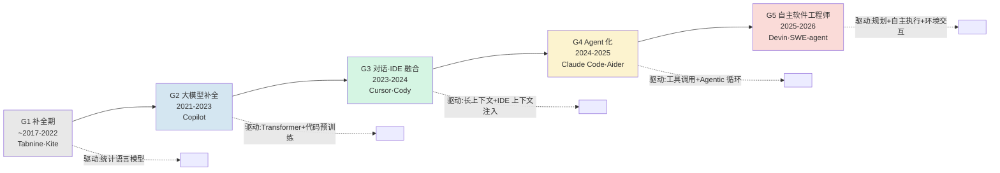

要回答的问题不是"AI 编程工具进化到哪一代了",而是**"代际更替到底由什么驱动、又被什么瓶颈卡死,以及为什么这条线根本不是一条向上的直线"**。本节点用 Kuhn 的范式（范式）框架,把 2017→2026 的编程工具切成五代,每代讲清三件事:它解决了上一代的什么瓶颈、它自己撞上了什么新瓶颈、以及一个"它没有比上一代更好"的真实反例。视角是 PM 的:你在选型会、面试桌上需要的不是"谁最新最强",而是"为什么某一代的瓶颈决定了下一代必须长成那个样子"。

> [!warning] 反线性进步是本节点的硬立场
> 凡是把这条谱系画成"Tabnine→Copilot→Cursor→Claude Code→Devin,一代更比一代强"的,都犯了 §7 反对的"进步主义叙事"错误。每一代的"进步"都是**针对特定瓶颈的局部优化**,同时**牺牲了上一代某个被忽视的优点**。这是 Kuhn 意义上的不可通约,不是性能标量的单调递增。

## §0 为什么用 Kuhn 范式而不是"能力曲线"

最常见的错误框架是把 AI 编程工具的演化画成一条 SWE-bench 分数随时间上升的曲线（2023 GPT-4 Turbo ~48.5% → 2026 前沿模型 80–93%,来源:Epoch AI / BenchLM.ai 2026-06-02 快照,⚠️含污染,见 [E02 Claude Code 剖解·CLI 哲学](/kb/专题-工程与成本/e02-claude-code-剖解-cli-哲学/) 对 benchmark 污染的拆解）。这条曲线的问题是:它假设所有代际在**同一把标尺**上比较,而真实的代际更替恰恰是**标尺本身换了**。

Kuhn 在《科学革命的结构》里的核心论点是:范式转移后,新旧范式"不可通约"（incommensurable）——它们问的问题、用的概念、判断"什么算成功"的标准都变了,所以无法用同一指标排座次。把这个框架搬到编程工具上:

- **补全范式**（Tabnine/Copilot）问的是"下一个 token 是什么",成功标准是补全接受率;
- **对话范式**（Cursor/Cody）问的是"这段代码该怎么改",成功标准是多文件编辑的正确率;
- **Agent 范式**（Claude Code/Devin）问的是"这个任务能不能端到端交付",成功标准是任务解决率 + 人工干预次数。

你没法用"补全接受率"评判 Devin,也没法用"任务解决率"评判 2018 年的 Tabnine——它压根不接任务。**所以"哪一代更强"是个范畴错误。** 正确的问法是:每一代的范式由什么技术条件催生、又因为什么内在矛盾被下一代取代。这正是本节点选 Kuhn 而非能力曲线的理由,也对照了 [c10 - Agent 技术栈与工具调用](/kb/基础知识库/c10-agent-技术栈与工具调用/) 中"Agent 是 G3 截面快照"的说法——c10 给的是一张静态切片,本节点给的是**驱动力与瓶颈的动力学**。

## §1 五代谱系总图

| 代 | 时期 | 代表 | 形态 | 驱动力（解决了什么瓶颈） | 自身瓶颈（被什么卡死） |
|---|---|---|---|---|---|
| **G1 补全期** | ~2017–2022 | Tabnine、Kite | IDE 插件 | 统计/n-gram → 早期神经语言模型,把"自动补全"从符号表查找升级到概率预测 | 只懂局部 token 模式,不懂语义;补全短、错得多 |
| **G2 大模型补全** | 2021–2023 | GitHub Copilot | IDE 插件 | Transformer + 海量代码预训练（Codex）,补全跨行、懂上下文 | 单文件视野,不会改已有代码,只会"续写";无对话 |
| **G3 对话·IDE 融合** | 2023–2024 | Cursor、Cody | IDE fork / 插件 | 长上下文 + IDE 主动注入 codebase 上下文 + 对话式编辑 | 仍以"人在驾驶座、AI 当副驾"为前提;多步任务需人逐步引导 |
| **G4 Agent 化** | 2024–2025 | Claude Code、Aider | CLI / Agent | 工具调用 + Agentic 循环(读文件→改→跑测试→修),AI 自己拿方向盘 | 长任务上下文衰减、信任校准难;无界面门槛高 |
| **G5 自主软件工程师** | 2025–2026 | Devin、SWE-agent | 云端 Agent / 后台任务 | 规划 + 自主执行 + 环境交互,目标是"派活就走" | 真实任务解决率与 benchmark 落差巨大;ROI 存疑 |

注意:**G3 到 G5 在 2026 年是并存而非替代**——Copilot（G2/G3 混血,Agent Mode 2026-03 GA）、Cursor（G3→G4,Cursor 3 于 2026-04-02 转向 Agent）、Claude Code（G4）、Devin Desktop（G5,2026-06-02 由 Windsurf 改名）同时在市场上卖钱。这本身就是反线性进步的证据:**新范式没有杀死旧范式,而是分化出不同的使用场景。**

## §2 逐代拆解:驱动力、瓶颈、反例

### G1 补全期（2017–2021）：Tabnine / Kite

**驱动力**:把 IDE 自动补全从"基于符号表的精确匹配"升级为"基于概率的预测"。Tabnine 早期用 GPT-2 级别的小模型,Kite 主打 Python 智能补全。第一次让"机器猜你下一步想写什么"成为日常体验。

**瓶颈**:模型小、上下文窗口短,只能学到局部语法模式,不懂跨函数语义。补全往往是"看起来对、用起来错"。

**反例(反线性进步)**:Kite 项目于 2022 年正式停止开发并开源。其创始人公开复盘的失败原因不是"技术不如人",而是商业模式——"我们 50 万开发者不愿付费使用"、"我们比市场早了 10 年以上,技术还没就绪"(来源:devclass.com 2022-11-21 引述 Kite 创始人;Kite 官方告别博文 kite.com/blog)。值得注意的是,Kite 做过本地化/隐私优先的工程取向,而**"本地优先 / 数据不出本地"这个被 G2 云端范式抛弃的取向,在 2026 年又因数据合规需求在国产工具线回潮**(见 [E03 字节 TRAE 与 Windsurf 剖解](/kb/专题-工程与成本/e03-字节-trae-与-windsurf-剖解/) 对私有化部署的分析)。Kite 不是"不够先进",而是同时撞上了"早于市场"和"个人开发者不付费"两堵墙——这是范式时机问题,不是能力落后。

### G2 大模型补全（2021–2023）：GitHub Copilot

**驱动力**:OpenAI Codex（GPT-3 的代码生产版本）+ GitHub 的海量公开仓库。2021-06-29 技术预览发布的 Copilot(来源:GitHub Blog "Introducing GitHub Copilot")第一次让补全能跨行、懂注释意图、生成整个函数。这是真正的范式转移——从"补 token"到"补意图"。

**瓶颈**:Copilot 的世界观是**单文件续写**。它能在你光标处接着写,但不会主动去改另一个文件里的 bug,也没有对话框让你说"把这个重构成异步的"。它是"超级自动补全",不是"协作者"。

**反例**:Copilot 至今仍是用户量最大的工具——⚠️〔以2026-06为准·待核实〕全量用户约 2000 万(来源:TechCrunch 2025-07-30),付费订阅约 470 万(口径:2026-01,getpanto.ai 等统计站),Fortune 100 渗透率约 90%。**G2 的"老范式"产品在装机量上碾压所有 G4/G5 新范式产品。** 这是反线性进步最硬的一击:如果代际是线性进步,为什么"最落后的一代"卖得最好?因为大多数开发者要的不是"自主 Agent",而是"不打断心流的快补全"——而补全恰恰是 Copilot 的看家本领(2026-06-01 计费改革后,代码补全和 NES 明确**不消耗** AI Credits,来源:GitHub Changelog 2026-06-01,WebFetch 核实)。

### G3 对话·IDE 融合（2023–2024）：Cursor / Cody

**驱动力**:两个技术条件成熟——(1) 模型上下文窗口从 4K 涨到 100K+;(2) IDE 能主动把当前文件、打开的标签、codebase 索引"喂"给模型。Cursor 把 VS Code fork 成 AI 原生 IDE,核心是 Tab 补全(预测 1–3 行,延迟 <100ms,来源:deployhq.com)+ 对话式多文件编辑(Composer,2024 引入)。范式从"续写"变成"对话改"。

**瓶颈**:G3 的隐含前提是**"人在驾驶座"**——AI 是副驾,你下达每一步指令,它执行一步。多步任务(比如"加一个新 API 端点并写测试")仍需人把任务拆成十几个小指令逐个喂。AI 不会自己"想清楚步骤再动手"。

**反例**:Cursor 的商业成功无可争议——⚠️〔以2026-06为准·待核实〕付费用户 >36 万、DAU 超 100 万(口径:2025 Q4,getpanto.ai);ARR 从 2025-11 的 $1B 涨到 2026-02 的 $2B(TechCrunch 报道,来源为"知情人士"非官方财报);Fortune 1000 中约 70% 有工程师在用(口径:2026 Q1)。**但 2025-06 它把"500 次请求包月"改成"信用额度(Credit)制",$20 计划约折合 225 次高级请求,被社区普遍解读为变相缩水。** 这说明 G3 的对话范式有个隐藏成本:每次对话都烧 token,而对话式交互的 token 消耗远高于补全。Cursor 不是"技术倒退",而是**对话范式的经济模型本身就比补全范式贵**——这是范式选择的代价,不是执行失误。

### G4 Agent 化（2024–2025）：Claude Code / Aider

**驱动力**:工具调用(Function Calling,见 [Function Calling](/kb/基础知识库/function-calling/))成熟 + Agentic 循环(读文件 → 改 → 跑测试 → 看报错 → 再改)。AI 第一次"自己拿方向盘":你说"修这个 bug",它自己决定读哪些文件、改哪几行、跑哪个测试。Claude Code 是 CLI 工具(不是 IDE fork 也不是插件),能读取整个代码库、跨文件修改、运行测试、提交 Git,带 1M token 上下文窗口和工具权限分级(来源:Anthropic 产品页,WebFetch 核实)。Aider 是开源纯 CLI 结对助手,自动生成 Git commit、失败自动修复,GitHub Stars 33,000+(来源:aiagentslist.com)。

**Rick 一手洞察(Claude Code 深度用户)**:Claude Code 的范式转移不在"能力"而在**交互单位的改变**。G3 的交互单位是"一句话一改",G4 是"一个任务多步"。这带来一个 G3 用户进入 G4 时的真实认知摩擦——你不再是"指挥每一步",而是"描述目标 + 中途校准"。Claude Code 的权限模式(default/acceptEdits/plan/auto/bypassPermissions)本质是**信任校准旋钮**,而 Anthropic 自己的工程数据暴露了 G4 的核心病理:用户批准了 93% 的权限请求,手动审查已沦为"橡皮图章"(来源:Anthropic Engineering Blog "How we built Claude Code auto mode",2026-03-25,WebFetch 核实)。这正是 §7 要展开的对手框架。

**瓶颈**:(1) **长上下文衰减**——任务一长,Agent 在大量上下文里"迷路",准确率非线性下降(Chroma "Context Rot" 研究,2025,见 [A03 Codebase 理解机制·repo-map RAG-over-code LSP](/kb/专题-工程与成本/a03-codebase-理解机制-repo-map-rag-over-code-lsp/));(2) **信任校准**——93% 的橡皮图章批准率说明人工监督失效;(3) **无界面门槛**——Claude Code 对非 terminal 用户门槛高。

**反例**:Claude Code 的标杆案例(Anthropic 官网,WebFetch 核实)都是**大型工程组织**:Stripe 1370 名工程师部署、Ramp 事故调查时间减少 80%、Wiz 用 20 小时完成 5 万行 Python→Go 迁移。**但个人开发者的对比体验缺乏公开数据**,而且 Claude Code 无免费计划(需至少 $20/月 Pro 订阅或 API 额度,⚠️口径:2026 WebSearch),门槛显著高于有免费档的 Cursor/Copilot。所以 G4 "更先进"的代价是**适用人群收窄**——它对大组织 ROI 高,对碎片化个人开发者反而不如 G2 的快补全顺手。

### G5 自主软件工程师（2025–2026）：Devin / SWE-agent

**驱动力**:规划(planning)+ 自主执行 + 环境交互(浏览器、终端、文件系统)。目标是"派活就走"——你提个 issue,Agent 自己排查、写代码、跑 CI、提 PR。SWE-agent 是学术界(普林斯顿)的开源 Agent 框架,Devin 是 Cognition 的商业自主工程师。2026-06-02 Windsurf 正式改名 **Devin Desktop**,核心重构包括 Devin Local(Cascade 继任者,Rust 重写,token 效率提升约 30%)、Agent Command Center(Kanban 看板统一管理本地+云端 agent)、ACP 开源协议(来源:devin.ai/blog 2026-06-02)。

**瓶颈**:**Benchmark 与真实任务的鸿沟**。这是 G5 最致命的问题:
- SWE-bench Verified 已于 2026-02-23 被 OpenAI 弃用,审计发现"难题子集"中 59.4% 的题目测试用例有实质性问题(来源:OpenAI blog,2026-02-23);
- 分数崩塌作为污染证据:Claude Opus 4.5 在 Verified 80.9% → Pro 仅 45.9%,差距 35 个百分点(来源:MorphLLM/CodeAnt 2026-04);
- METR 控制实验(16 名资深开发者、246 任务、Cursor Pro + Claude 3.5/3.7)发现:用 AI 反而让任务完成时间**增加 19%**,而开发者自己预测会快 24%(来源:arXiv:2507.09089,2025-07,⚠️ n=16 小样本,结论仍在热议)。

**反例**:Devin 团队的 SWE-1.6(2026-04-07)声称比 Claude Sonnet 4.5 快 13×——但这是 Cognition 官方声明,**未见独立第三方 benchmark 复现**(争议点)。而 SWE-bench Pro 榜单(2026-06-02,较可信)第一是 Claude Mythos Preview 77.8%,Devin 系自研模型并未登顶。**G5 "最自主"不等于"最能干":自主度上去了,但真实 ROI 是负的(METR 的 -19%)。** 这是反线性进步的终极证据——演化到"最先进"的一代,在最严格的客观测量下反而让人变慢。

## §3 判断主轴:代际理解的四个致命错位

> [!important] 90% 的人在读编程工具代际时会犯的四个错
> 每点带:症状 → 为什么会错 → 正确做法 → 真实反例。

**错位一:把"最新"等同于"最适合"。**
- **症状**:选型会上有人说"都 2026 年了还用 Copilot?上 Devin 啊"。
- **为什么会错**:把代际当性能标量,忽视了每代范式对应不同使用场景(补全 vs 对话 vs 任务)。
- **正确做法**:先问"我的交互单位是什么"——要快补全选 G2,要对话改代码选 G3,要端到端交付任务选 G4/G5。
- **真实反例**:Copilot 2000 万用户(⚠️2025-07 口径)碾压所有 G5 产品装机量。"落后一代"卖得最好,因为多数人要的是不打断心流的补全,不是自主 Agent。

**错位二:把 benchmark 分数当真实生产力。**
- **症状**:"Claude Mythos 93.9% SWE-bench,那它一定能干活"。
- **为什么会错**:SWE-bench Verified 已被 OpenAI 弃用(2026-02-23,59.4% 难题子集测试有缺陷);Verified→Pro 分数崩塌 35 个百分点;benchmark 不测架构决策、模糊需求、遗留系统演进。
- **正确做法**:看 benchmark 时问三件事——数据污染了吗?测的是 bug 修复(87%)还是真实工作分布?scaffolding(工程脚手架)贡献了多少分(可波动 22+ 个百分点,来源:particula.tech / arXiv:2506.17208)?
- **真实反例**:METR RCT——资深开发者用 AI 反而慢 19%,但他们自己以为快了 20%。**感知与实测方向相反。**

**错位三:把"自主"等同于"可信"。**
- **症状**:"Agent 能自己跑测试自己改,那我放心交给它就行"。
- **为什么会错**:Claude Code 用户批准 93% 权限请求,手动审查已是橡皮图章;auto mode 分类器危险动作漏报率 17%(来源:Anthropic Engineering Blog 2026-03)。自主度上升时,人的有效监督反而下降。
- **正确做法**:信任要"粒度化、动态、依赖持续审查"。在**可逆性边界**处确认(而非每步或仅末尾)——任务时间减少 13.54%,81% 参与者偏好(来源:arXiv:2510.05307)。
- **真实反例**:rm -rf 类事故(2025)证明无确认模式的真实风险;Vibe coding 的"auto-accept 悖论"——模型越强,开发者越倾向跳过审查,越无法建立对系统的理解(见 [A05 Agentic Coding 信任校准](/kb/专题-工程与成本/a05-agentic-coding-信任校准/))。

**错位四:把代际谱系读成单一国家/单一公司的故事。**
- **症状**:"AI 编程就是 OpenAI→Anthropic→Cognition 这条美国线"。
- **为什么会错**:忽视了 2025–2026 国产工具的平行演化——字节 TRAE(VS Code fork,⚠️2025 年度报告口径:600 万+注册、160 万+月活)、阿里通义灵码(2026-05 重组为 QoderCN)、腾讯 CodeBuddy、智谱 CodeGeeX 走了一条**合规优先 + 免费策略 + 云厂商捆绑**的不同范式分叉。
- **正确做法**:把代际谱系画成"驱动力的多源汇流",而非单一血统。国产工具的驱动力里有一项美国线没有的——数据本地化与等保/信通院合规。
- **真实反例**:TRAE 国内版免费策略 vs Cursor $20/月——同样是 G3/G4 范式,商业模式截然不同;TRAE 还有遥测隐私争议(Unit 221B 研究,2025-07;The Register 2025-07-28 报道),这是美国线代表产品没有的范式特征。详见 [E03 字节 TRAE 与 Windsurf 剖解](/kb/专题-工程与成本/e03-字节-trae-与-windsurf-剖解/)。

## §4 产品 PM 视角补盲:代际之外的三个非技术驱动力

工程视角容易把代际更替归因于"模型能力提升",但 PM 必须看到三个被技术叙事掩盖的驱动力:

1. **计费模式的范式转移与代际无关,却决定生死。** 2025–2026 年三大工具几乎同时从"包月/请求数"转向"用量计费":Cursor(2025-06 改 Credit 制)、Copilot(2026-06-01 改 AI Credits)、Windsurf/Devin(2026-03-19 废 Credit 改 Quota 制)。Visual Studio Magazine 给 Copilot 计费改革的标题是"You Will Get Less, but Pay the Same Price"。**对话/Agent 范式的 token 成本远高于补全,迫使全行业重构定价**——这是经济驱动力,不是技术驱动力。

2. **"第三条路":非程序员的 vibe coding。** G4/G5 并非只往"更自主的工程师工具"演化,还分叉出 Trae Solo / v0 / Bolt 这类**面向非程序员**的产品。它们赌的是"用自然语言生成可用应用"的新用户群,而非服务现有开发者。这条分叉对照了 [m207 - Agent 产品化：场景推演与失败模式](/kb/工程化与落地架构/m207-agent-产品化-场景推演与失败模式/) 里的场景分化逻辑——同一技术,服务不同用户心理模型,就是不同产品。

3. **合规边界重塑代际地图。** 国产工具的私有化部署、VPC 隔离、信通院认证不是"功能",而是**进入企业市场的准入门槛**。Cursor/Copilot 的有限私有化支持,在中国大型企业(一汽、蔚来、太保等通义灵码客户)市场是结构性劣势。代际谱系在不同合规辖区里长出不同形状。

## §5 对手框架回应:接受 + 边界

**对手立场一(进步主义者,如多数科技媒体):"分数从 48% 涨到 93%,这就是真实的代际飞跃,你过度强调反例是在否认进步。"**
- **接受**:补全质量、上下文长度、工具调用能力确有真实的、可观测的提升,这不是错觉。G2 的 Codex 相对 G1 的 Tabnine 是质变。
- **边界**:但我赌的是——**这些提升发生在"被 benchmark 覆盖的窄任务"上,而真实工作分布(80% 是遗留系统维护与演进)恰恰是 benchmark 不测的**。OpenAI 自己弃用了 Verified,METR 测出资深开发者变慢 19%。进步是真的,但"进步=代际线性向上"是把局部优化误当全局优化。

**对手立场二(自主 Agent 乐观派,如 Cognition):"G5 自主工程师是终局,人工审查只是过渡期的拐杖。"**
- **接受**:对于结构清晰、测试覆盖好的孤立 bug 修复(SWE-bench 87% 是这类),自主 Agent 确实能减少人工介入,这有真实价值。
- **边界**:但 Anthropic 自己的数据(93% 橡皮图章批准、17% 危险动作漏报)说明,**"减少确认"和"安全"是两件事**。Anthropic 官方把 auto mode 标为"research preview"并明言"reduces prompts but does not guarantee safety"。**连最激进推进自主化的公司,都不敢说人工审查可以被消除。** 我赌:可逆性边界处的确认会长期存在,因为它是 agency 和信任的载体,不是技术不成熟的临时补丁。

**对手立场三(Kuhn 框架的反对者,渐进主义/Lakatos 研究纲领派):"你用 Kuhn 的'不可通约'太强了——这些工具明明在一条连续的能力演进线上,补全→对话→Agent 是平滑过渡,不是革命性断裂。"**
- **接受**:Lakatos 对 Kuhn 的批评有道理——很多"范式转移"事后看是渐进积累,硬核(hard core)未变,变的是保护带。Copilot 的 Agent Mode、Cursor 的 Composer 确实是同一技术栈的渐进扩展。
- **边界**:但我坚持"交互单位的改变"是真断裂——从"补 token"到"派任务"不是同一指标上的进步,而是**成功标准本身换了**(补全接受率 vs 任务解决率,无法换算)。这正是 Kuhn 不可通约的核心。我承认这是个可争论的赌注:如果未来出现统一指标能把五代放在一把尺子上排序,我的 Kuhn 框架就被证伪了。

## §6 跨域呼应:Kuhn 范式与"反例驱动的科学史"

Kuhn 在《科学革命的结构》(1962)里有个常被忽略的论点:**科学史不是真理的累积,而是范式的更替,每次更替都伴随"丢失"——旧范式能解释的某些现象,新范式反而解释不了(loss of explanatory power)。** 这正是本节点反线性进步立场的哲学根基。

把这个框架落到编程工具上,产生了一个具体的、可操作的判断改变:**当某一代工具被宣告"过时"时,要主动去找它"丢失了什么"。** G2→G3 丢失了"低 token 成本的纯补全体验"(Cursor 的 Credit 制争议);G3→G4 丢失了"人逐步掌控每一步"的 agency(93% 橡皮图章);G4→G5 丢失了"benchmark 与真实任务的对齐"(METR -19%)。

这不是怀旧,而是 PM 的选型纪律:**每代"丢失"的优点,往往是某个细分市场仍然需要的。** Kite 丢失的"本地隐私优先"在 2026 年因合规需求回潮;Copilot 保留的"快补全"成了它 2000 万用户的护城河。

更进一步,Kuhn 的"反常(anomaly)积累触发范式危机"框架,预测了下一代的形状:当前 G5 的反常(benchmark 污染、ROI 为负、信任校准失效)正在积累,这意味着 G6 不会是"更自主的 Devin",而很可能是**针对"自主性反常"的范式修正**——比如把评测从 benchmark 转向真实生产数据(DeepSWE、SWE-EVO、FeatureBench 等替代基准已在 2026 年涌现),或把信任校准做成一等公民(可逆性边界确认)。这与 [m207 - Agent 产品化：场景推演与失败模式](/kb/工程化与落地架构/m207-agent-产品化-场景推演与失败模式/) 的失败模式驱动设计思路一致。

> [!note] 跨域呼应不留空 invocation
> Kuhn 在此**不是装饰**:它改变了一个具体判断——从"追最新一代"变成"追每代丢失的优点对应的细分市场",并给出了 G6 形状的可证伪预测(范式修正而非自主度升级)。

## §7 PM 决策启示

- **面试怎么用**:被问"你怎么看 AI 编程工具的发展",不要背能力曲线。讲"五代范式 + 每代的丢失",再抛一个反共识判断:"装机量最大的是 G2 的 Copilot,这说明代际不是线性进步,而是范式分化"。30 秒展示你有 Kuhn 框架而非 hype 叙事。求职字节 TRAE 方向时,补一句"美国线和国产线是平行演化,驱动力里多了合规这一维"——见 [E03 字节 TRAE 与 Windsurf 剖解](/kb/专题-工程与成本/e03-字节-trae-与-windsurf-剖解/)。
- **选型怎么用**:先定位团队的"交互单位"(补全/对话/任务),再匹配代际,**不要被"最新"绑架**。同时看计费模式(token 成本)和合规边界,这两个非技术驱动力常常比模型能力更决定 ROI。
- **复现怎么用**:想理解某代范式,就去复现它的"瓶颈"——比如用 Aider(G4)跑一个长任务,亲自观察 context rot 怎么让它迷路,比读十篇 benchmark 报告更懂 G4 的边界。

## §8 与已有节点的关系

- 对照 [c10 - Agent 技术栈与工具调用](/kb/基础知识库/c10-agent-技术栈与工具调用/):c10 是 G3 截面的**静态快照**(基础知识库入门),本节点提供**代际动力学**——做的是"深化 + 时间维度补缺",不复述 c10 的工具调用机制。
- 对照 [m207 - Agent 产品化：场景推演与失败模式](/kb/工程化与落地架构/m207-agent-产品化-场景推演与失败模式/):m207 讲单点产品的失败模式,本节点把"失败模式"上升为"代际瓶颈的驱动力"——做的是**抽象层升高**。
- 对照 [m208 - AI 基础设施与中间件选型](/kb/工程化与落地架构/m208-ai-基础设施与中间件选型/):m208 是中间件选型决策,本节点的"计费模式范式转移"为它补充了一个**时间演化维度**的驱动力。
- 与本专题 [A03 Codebase 理解机制·repo-map RAG-over-code LSP](/kb/专题-工程与成本/a03-codebase-理解机制-repo-map-rag-over-code-lsp/)、[E02 Claude Code 剖解·CLI 哲学](/kb/专题-工程与成本/e02-claude-code-剖解-cli-哲学/)、[E03 字节 TRAE 与 Windsurf 剖解](/kb/专题-工程与成本/e03-字节-trae-与-windsurf-剖解/)、[A05 Agentic Coding 信任校准](/kb/专题-工程与成本/a05-agentic-coding-信任校准/) 互为"谱系总图 ↔ 截面剖解"——本节点是地图,它们是地图上某一格的放大。

## §9 关联节点

**核心(必读)**
- [c10 - Agent 技术栈与工具调用](/kb/基础知识库/c10-agent-技术栈与工具调用/)——G3 截面快照,本图的静态起点
- [m207 - Agent 产品化：场景推演与失败模式](/kb/工程化与落地架构/m207-agent-产品化-场景推演与失败模式/)——失败模式即代际瓶颈
- [Claude Code](/kb/ai-公司与产品/claude-code/)——G4 代表产品卡
- [Agent](/kb/基础知识库/agent/)——G4/G5 的核心概念
- [Function Calling](/kb/基础知识库/function-calling/)——G3→G4 范式转移的技术钥匙
- 范式——Kuhn 框架本体

**延伸(可选)**
- [m208 - AI 基础设施与中间件选型](/kb/工程化与落地架构/m208-ai-基础设施与中间件选型/)——中间件选型的演化维度
- [Anthropic](/kb/ai-公司与产品/anthropic/) / [Claude](/kb/ai-公司与产品/claude/)——G4 代表厂商与模型
- [RAG](/kb/基础知识库/rag/) / [Embedding](/kb/基础知识库/embedding/)——G3/G4 的 codebase 理解技术(见 S02)
- [Polanyi 默会知识与提示工程的认识论张力](/kb/基础知识库/polanyi-默会知识与提示工程的认识论张力/)——为什么 benchmark 测不出真实工程默会知识
- [Skill 系统的本质](/kb/ai-协作方法论/skill-系统的本质/) / [Harness 词义辨析](/kb/专题-安全对齐与失败/harness-词义辨析/)——G4 Agent 的工程化语汇
- [字节 TRAE 团队人物图谱](/kb/ai-公司与产品/字节-trae-团队人物图谱/)——国产线 G3/G4 的团队背景
- [AI PM 知识图谱·总索引](/kb/ai-pm-知识图谱/ai-pm-知识图谱-总索引/)——回到总图

## 修订日志
- R1(2026-06-07):首稿。建立五代谱系 + Kuhn 框架 + 四错位判断主轴 + 三对手框架 + 反线性进步立场。数字接地于 0414 核实简报,volatile 项已标日期口径。
