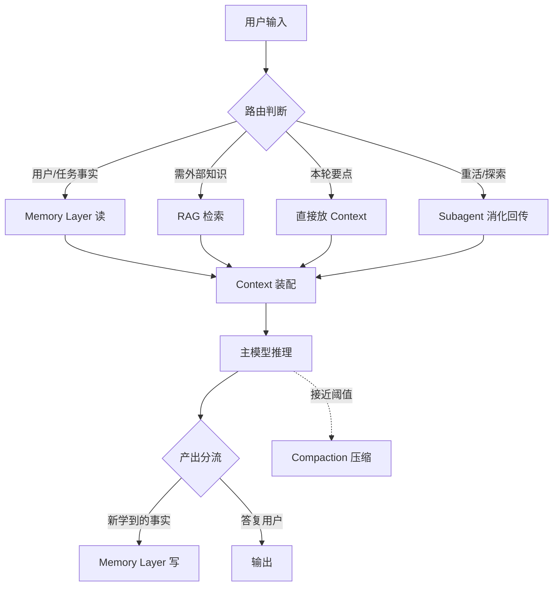

# R02 中型·Memory Layer + RAG 混合

**本节点要解决的问题：** 当一个 Agent 要"记住用户、记住任务、记住跨会话的事实"，同时又要"查海量外部文档"——这两类信息流不是一回事，却经常被工程团队塞进同一个向量库里搅成一锅粥。本节给一套可落地的中型生产配方：把 **memory layer（长短期记忆）** 和 **RAG（外部知识检索）** 分成两条信息流、各走各的路、在 context window 里按职责拼装。视角框架来自本专题的核心命题——**信息有四个去向（放 context / 外化 memory / 走 RAG / 让 subagent 先消化回传），把它们混为一谈是中型 Agent 翻车的头号原因。**

> [!warning] 这是配方页（synthesis），不是论文综述
> 本节默认你已读过 [c09 - RAG 架构](/kb/基础知识库/c09-rag-架构/) 的检索原理、[m206 - Agent 产品化：记忆机制与技术进展](/kb/工程化与落地架构/m206-agent-产品化-记忆机制与技术进展/) 的记忆分层。**这里不复述它们的事实基础**，只回答一个工程问题：两条流怎么搭在一起、边界画在哪、坑在哪。

---

## §0 为什么是"两条流"而不是"一个大向量库"

转型期工程团队最容易犯的框架错误：把"记忆"当成"对用户私有数据做的 RAG"，于是只建一个向量库——用户聊天记录、上传文档、产品手册、历史工单全进去，统一 embedding、统一 Top-K 检索。

这个框架在 demo 阶段能跑,在生产环境会塌,因为**记忆和检索的信息论性质根本不同**:

| 维度 | Memory Layer | RAG |
|---|---|---|
| **数据来源** | Agent 自己在交互中**生成/提炼**(用户偏好、任务状态、已学事实) | **外部既有**语料(文档、工单、知识库) |
| **写入主体** | Agent 主动决定"记什么"(写是动作) | 离线管道批量索引(写是工程) |
| **可变性** | 高:会更新、会冲突、会过时、要遗忘 | 低:文档是事实快照,版本化管理 |
| **检索目标** | "关于这个用户/这个任务,我之前知道什么" | "关于这个问题,语料里的证据是什么" |
| **失败模式** | 记错→人格分裂、时效幻觉 | 检索偏→答非所问、引用错误 |
| **典型规模** | 每用户 KB~MB 级 | 全局 GB~TB 级 |

把两者塞一个库,会同时损害两边:记忆的"可变性/冲突消解/遗忘"逻辑没法在静态文档索引上跑;而文档的"全局检索/重排"会把用户私有记忆冲淡成大海里的几滴水(召回被海量文档稀释)。

**正确框架:两条独立信息流,在 context 装配阶段才汇合。** 记忆走 memory layer(读写都由 Agent 控制),知识走 RAG(只读、离线索引),最后由编排逻辑决定本轮 context window 里放哪些记忆片段 + 哪些检索块。这正是 LangChain 把 context engineering 归纳为 **Write / Select / Compress / Isolate** 四操作的工程含义(来源:LangChain Blog "Context Engineering for Agents", 2025-07-02)——memory 对应 Write/Select,RAG 对应 Select,compaction 对应 Compress,subagent 对应 Isolate。

---

## §1 配方总览:四去向 × 三阶段

中型 Agent 的一轮推理,信息按"四去向"分流,在"三阶段"装配:

三阶段:
1. **读取/路由**:判断这条信息属于哪个去向(下面 §4 给路由表)。
2. **装配/隔离**:把 memory 片段 + RAG 块 + subagent 摘要,按预算拼进 context window,守住 token 预算(见 §3)。
3. **写回/压缩**:把"本轮新学到、对未来有用"的事实写回 memory layer;context 接近阈值时触发 compaction。

> [!note] 装配阶段是 context engineering 的本体
> Anthropic 把 context engineering 定义为 "curating and maintaining the optimal set of tokens at inference time"(来源:Anthropic Engineering Blog "Effective Context Engineering for AI Agents", 2025-09-29)。这个"装配"动作就是上图的 ASM 节点——它不是写好一段 prompt 就完事,而是**每一轮都在动态决定窗口里放什么**。R02 的全部工程价值,就在这个节点。

---

## §2 Memory Layer:长短期分层 + 三库落地

记忆不是一个东西,中型生产至少要分清这几层(对照 [m206 - Agent 产品化：记忆机制与技术进展](/kb/工程化与落地架构/m206-agent-产品化-记忆机制与技术进展/) 的记忆分层,这里给落地实现):

| 记忆类型 | 实现载体 | 生命周期 | 读取方式 |
|---|---|---|---|
| **Working Memory(工作)** | 当前 context window | 会话内 | 直接在窗口里 |
| **Episodic(情节)** | 向量库(会话片段) | 跨会话 | 语义检索 |
| **Semantic(语义)** | 结构化 KV / JSON(用户画像、稳定事实) | 长期 | 精确读取 |
| **Procedural(程序)** | 文件(CLAUDE.md / 规则文件) | 长期 | 系统注入 |

**为什么不全用向量库?** 因为用户画像("Rick 是 PM、做安全产品、偏好简体中文")是**精确事实**,应该精确读取而非语义近似检索;而"上周那次关于 chunking 的讨论"是**情节**,适合语义检索。把精确事实塞进向量库会引入不必要的检索误差。

**MemGPT/Letta 的范式**(论文 "MemGPT: Towards LLMs as Operating Systems", arXiv:2310.08560, UC Berkeley, 2023-10):把 OS 内存分层(RAM/磁盘)类比到 LLM——main context 是 RAM,external context 是磁盘,LLM **自己通过工具调用**(`core_memory_append`、`archival_memory_search`)驱动数据在层间移动。这给中型 Agent 一个关键设计决策:**记忆操作要不要暴露成工具让模型自控?**

- **提示自控(prompted self-control)**:记忆操作是工具,模型决定何时写/读(MemGPT 范式)。灵活,但每次操作消耗推理 token,规模化贵。
- **管道自动(pipeline-driven)**:由编排代码在固定时机抽取/写入(Mem0 范式)。便宜可控,但可能漏记或多记。

**Mem0 的生产数据**(论文 "Mem0: Building Production-Ready AI Agents with Scalable Long-Term Memory", arXiv:2504.19413, 2025-04)给了一个量级参考:相比把全部历史塞进 context 的 full-context 方案,在 LOCOMO benchmark 上 LLM-as-a-Judge 提升 **26%**、P95 延迟降低 **91%**、token 成本降低 **90%**;Graph 变体(捕捉关系)比 Base 仅高约 **2%**。

> [!important] 一个反共识判断:图记忆的溢价被高估了
> Mem0 自己的数据显示 Graph 变体只比 Base 高约 2%。对中型 Agent,**先上向量+结构化双库,图库是后期优化项,不是 MVP**。别因为"知识图谱听起来高级"就在第一版引入图数据库的运维复杂度——那 2% 换不回你维护一套图谱 schema 的工时。

---

## §3 RAG 侧:只读、离线、为 context 预算服务

RAG 在这套混合配方里的角色被收窄了:它**只负责外部知识的只读检索**,记忆的事不归它管。这反而让 RAG 侧的工程更清爽——你只需对照 [c09 - RAG 架构](/kb/基础知识库/c09-rag-架构/) 和 [m204 - RAG 生产环境：Chunking 与范式演进](/kb/工程化与落地架构/m204-rag-生产环境-chunking-与范式演进/) 把检索质量做扎实即可。

中型配方里 RAG 的两个关键约束:

1. **检索块要为 context 预算让路。** 不是召回越多越好。这是本专题的硬命题:context window 不是越大越好,是需要主动管理的资源。RULER benchmark(arXiv:2404.06654, NVIDIA, COLM 2024)的数据应该刻在每个做检索的人脑子里:GPT-4 声称 128K,在 128K 实测得分 81.2/100;Mixtral 声称 32K,128K 时跌到 44.5/100。**塞满窗口的检索块,大部分是在喂"context rot"。**

2. **Contextual Retrieval 是性价比最高的检索增强。** Anthropic 的 Contextual Retrieval(来源:anthropic.com/news/contextual-retrieval, 2024-09-19)在索引阶段用小模型给每个 chunk 加 50-100 token 上下文前缀:单用 Contextual Embeddings 检索失败率从 5.7% 降到 3.7%(-35%);配 BM25 降到 2.9%(-49%);再加 Reranker 降到 1.9%(-67%)。配合 Prompt Caching,上下文化成本约 $1.02/百万文档 token。对中型 Agent,这是"加一道离线预处理就能换 49% 失败率下降"的便宜买卖。

> [!note] RAG 与 Memory 在 context 里如何排位
> 因为 "Lost in the Middle"(Liu et al., TACL 2024, arXiv:2307.03172)——20 文档 QA 中,答案在中间位置时准确率从首尾的约 75% 跌到约 55%——装配时要把**最关键的记忆/检索块放窗口首尾,不要埋中间**。具体顺序建议:系统指令(含 procedural memory)→ 稳定 semantic memory(用户画像)→ RAG 检索块(按相关性降序,最相关靠前)→ 近期对话 → 本轮输入。把"模型最该看到的"挤到两端。

---

## §4 装配路由表:这条信息该往哪去

四去向的判断,是这套配方的操作核心。下表是路由决策的起点:

| 信息特征 | 去向 | 理由 |
|---|---|---|
| 本轮任务直接相关、一次性 | **直接放 Context** | 用完即弃,不值得外化 |
| 关于"这个用户是谁/偏好什么" | **写 Semantic Memory** | 稳定、跨会话复用、精确读取 |
| 关于"之前发生过什么交互" | **写 Episodic Memory** | 跨会话、语义检索召回 |
| 外部文档里的事实/证据 | **走 RAG** | 全局只读语料,不该进记忆 |
| 需要长时间探索/读大量中间产物 | **派 Subagent** | 探索过程别污染主 context,只回传摘要 |
| 跨会话必须保留的规则/约定 | **写 Procedural(文件)** | 系统注入,不依赖压缩存活 |

**Subagent 去向的纪律(最容易做错的一条):** subagent 的价值是隔离——它把脏活(读 50 个文件、跑一堆搜索)在自己的独立 context 里干完,只把压缩后的结论回传主 Agent。Anthropic 的 Memory Tool + Context Editing 组合数据:Agent 搜索性能提升 **39%**(单独 Context Editing 提升 29%)(来源:claude.com/blog/context-management)。

但隔离有代价,**这里必须接业界反方**:

> [!warning] 对手框架回应:Cognition "Don't Build Multi-Agents"
> Cognition(2025,cognition.ai/blog/dont-build-multi-agents)给出强力反方:子 Agent 只接收"子任务描述"会因缺乏整体决策历史而误解任务;并行子 Agent 的隐式决策会冲突(经典例:一个 subagent 建 Super Mario 风格背景,另一个建视觉不兼容的角色,各自合理、组合失败)。他们主张 "Share full agent traces, not just individual messages",并认为当前模型跨 Agent 沟通可靠性不足,**单线程+完整上下文常优于多 Agent**。
>
> **接受的部分:** Cognition 对的——subagent 隔离不是免费午餐,回传"只言片语"确实会让主 Agent 误判;对强耦合、需要全局一致性的任务(如统一视觉风格),别拆 subagent。
>
> **R02 坚持的边界:** 但对**弱耦合的探索型重活**(读文档、批量检索、独立子任务),隔离的 context 节省是实打实的,代价可控。判据是:**子任务的产出能不能被压缩成一段不丢关键决策的摘要?** 能,就隔离;不能(需要保留完整 trace 供主 Agent 决策),就别拆。这把 Cognition 的"不要多 Agent"修正为"不要把强耦合任务拆成多 Agent"。

---

## §5 写回与压缩:memory 的写是一等公民

本专题的核心命题之一:**memory layer 是一等公民,不是 RAG 的附属。** 这句话的工程含义是——"写记忆"是和"调工具""答用户"平级的 Agent 动作,要显式设计,不能指望它自动发生。

**Focus Agent 的实验给了硬证据**(arXiv:2601.07190, 2025-01):必须**显式提示**"每 10-15 次工具调用压缩一次",被动提示只节省 6%,显式提示节省 22.7%(14.9M→11.5M token)、准确率不变。结论刺耳但真实:**当前 LLM 在无脚手架的情况下不会自然优化上下文效率**。你不主动设计"何时写、何时压",Agent 就会一路把窗口塞满直到 context rot。

压缩的两条技术路线(对照 [m206 - Agent 产品化：记忆机制与技术进展](/kb/工程化与落地架构/m206-agent-产品化-记忆机制与技术进展/) 的短期记忆策略):

- **LLM Summarization(摘要压缩)**:Anthropic `compact_20260112`(beta, 2026-01)默认 150K 触发,100 轮搜索评估中 token 减少 **84%**。代价:偶发模型在摘要阶段去调工具而非写摘要;且 JetBrains Research(2025-12)发现摘要反而让 agent 运行时间增加约 **15%**(摘要可能盖住停止信号)。
- **Observation Masking(工具结果遮蔽)**:把旧 tool_result 换成占位符、保留 tool_use 记录。JetBrains 在 SWE-bench 上:Qwen3-Coder 480B 用 Masking 后解决率 +2.6%、成本 -52%。无推理开销,但会让 prompt cache 前缀失效。

> [!important] 写回纪律:别让必须存活的东西依赖压缩
> Anthropic Cookbook 的硬规则:**必须放 CLAUDE.md / 必须跨会话保留的内容,不要依赖压缩存活——假设它不会被保留**。所以"任务最终决策""用户核心约定"应该主动写进 procedural memory(文件)或 semantic memory(结构化库),而不是寄望摘要器帮你留住。这是 memory layer 作为一等公民的实操体现:重要的事,主动写,不靠压缩兜底。

---

## §6 判断主轴:这套配方上 90% 的人会栽的四个坑

每个坑给"症状 → 为什么会错 → 正确做法 → 真实反例"四件套。

**坑 1:把用户记忆和文档检索塞进同一个向量库**
- **症状:** 用户私有事实("我叫 Rick")在检索时被海量文档淹没,Top-K 召回不到。
- **为什么会错:** 误以为"记忆 = 对私有数据的 RAG",忽略了 §0 的信息论差异——召回会被全局语料稀释。
- **正确做法:** 两条流分库;记忆库按 user_id 隔离命名空间,检索范围天然收窄。
- **真实反例:** 这正是 §0 表格里"召回被海量文档稀释"的失败模式;LongMemEval(ICLR 2025, arXiv:2410.10813)发现商业 chat assistant 在跨会话记忆上准确率下降 **30%**,部分原因就是记忆没被独立对待。

**坑 2:检索召回越多越好,塞满 context**
- **症状:** Top-K 从 5 调到 50,准确率不升反降。
- **为什么会错:** 把"大窗口"当"免费空间",忽视 context rot。
- **正确做法:** 守 token 预算;关键块放首尾;宁可少而精。
- **真实反例:** RULER 显示 Mixtral 在 128K 跌到 44.5/100;NoLiMa(Adobe/ICML 2025)显示 GPT-4o 实际有效上下文约 **8K**(声称 128K),Claude 3.5 Sonnet 从 1K 的 87.6% 跌到 64K 的 29.8%。

**坑 3:指望 Agent 自动写记忆、自动压缩**
- **症状:** 跑着跑着 context 爆了,或者跨会话啥都不记得。
- **为什么会错:** 把"写记忆"当成模型的本能,而非要显式设计的动作。
- **正确做法:** 显式提示压缩节奏(Focus Agent:每 10-15 次工具调用);记忆写入设成固定时机或暴露成工具。
- **真实反例:** Focus Agent——被动提示只省 6%,显式提示省 22.7%。

**坑 4:盲目拆 subagent 隔离一切**
- **症状:** 拆出的子 Agent 各自合理、组合矛盾;或回传摘要丢了主 Agent 决策所需信息。
- **为什么会错:** 把隔离当万灵药,忽视 Cognition 指出的"上下文割裂 + 隐式决策冲突"。
- **正确做法:** 只对弱耦合探索型任务隔离;强耦合/需全局一致的任务保持单线程+完整 trace。
- **真实反例:** Cognition 的 Super Mario 背景 vs 角色视觉冲突案例(见 §4)。

---

## §7 产品 PM 视角补盲

跳出工程 PM,补三个易看走眼的点:

1. **记忆即隐私负债。** memory layer 存的是用户私有事实,跨会话长期保留。这意味着 GDPR/个保法的"被遗忘权"不是可选项——你的 memory 架构必须支持**按 user 精确删除**。这恰恰是"两条流分库"的又一理由:记忆库按 user_id 命名空间隔离,删除是 O(1) 的 drop namespace;若混在全局向量库里,删一个用户的记忆是噩梦。对 Rick 的安全/国际化产品线,这是合规硬约束。

2. **"记错"比"没记"伤害更大。** 用户能容忍 Agent "不记得",但无法容忍 Agent "记错了还言之凿凿"(把张三的偏好安到李四头上)。记忆冲突消解和遗忘机制不是技术洁癖,是产品信任的生死线——一次人格分裂式的记错,用户就再也不信这个"它记得我"的卖点了。

3. **记忆是留存(retention)杠杆,但要算 ROI。** "它记得我"是 Agent 产品最强的 switching cost。但 memory layer 每轮都在增加 token 成本和延迟。PM 要算的是:记忆带来的留存提升,能否覆盖它的边际推理成本?对高频高价值用户值得,对一次性访客可能不值——这又指向 [m209 - 推理成本控制手册](/kb/工程化与落地架构/m209-推理成本控制手册/) 的成本估算。

---

## §8 跨域呼应:维特根斯坦"记忆不是仓库"

> [!note] 跨域调度:维特根斯坦的"语言游戏"与记忆的语境性
> 工程界默认把记忆当成**仓库**(storehouse model):写进去、存着、取出来,字节不变。维特根斯坦在《哲学研究》里反对的恰是这种"心理内容如物件存放"的图景——意义不在被存储的符号本身,而在它被**使用的语境**(语言游戏)中。
>
> 这个框架直接改变一个工程判断:**记忆检索不该是"取回当时存的字节",而该是"在当前语境下重新解释当时的事实"。** 同一条记忆("用户上次说预算紧张"),在"推荐方案"语境和"评估付费意愿"语境下,该被赋予不同权重和含义。把记忆当死仓库的系统,会机械地把过时/语境错位的事实硬塞回 context,制造时效幻觉——这正是 [m206 - Agent 产品化：记忆机制与技术进展](/kb/工程化与落地架构/m206-agent-产品化-记忆机制与技术进展/) 里"记忆衰减→时效幻觉"链路([幻觉](/kb/基础知识库/幻觉/))的认识论根源。
>
> **落地动作:** 记忆条目要带时间戳和语境标签;读取时由编排逻辑判断"这条记忆在当前语境还成立吗",而非无条件注入。这把"遗忘机制"从工程优化升格为认识论必需——记忆系统的本职不是"记住一切",而是"在当前语境下提供恰当的过去"。(0114认识论)

---

## §9 PM 决策启示:三类落地

- **面试桌:** 被问"你怎么给 Agent 加记忆?",别答"用向量库存历史"。答:"先分清四去向——哪些进 context、哪些外化 memory、哪些走 RAG、哪些派 subagent;memory 和 RAG 是两条流,记忆按用户隔离命名空间、支持精确删除,RAG 是全局只读。"这一句就把你和"只会调向量库"的候选人区分开。
- **选型会:** 评估 memory 方案别只看 benchmark 分数。问三件事:(1) 支不支持按用户精确删除(合规);(2) 冲突消解和遗忘怎么做(信任);(3) 记忆操作是工具自控还是管道驱动(成本)。Mem0 的 26%/90%/91% 数据是谈判起点,不是终点。
- **复现台:** MVP 配方——向量库(episodic)+ 结构化 KV(semantic)+ 文件(procedural)三库;RAG 侧上 Contextual Retrieval(便宜的 -49%);显式设计压缩节奏(每 10-15 次工具调用);subagent 只用于弱耦合探索。**图库、复杂 reranker 留到 v2。**

---

## §10 与已有节点的关系(升级对照,不复述)

| 旧节点 | 本节点做的事 | 类型 |
|---|---|---|
| [c09 - RAG 架构](/kb/基础知识库/c09-rag-架构/) | c09 讲透了 RAG 的检索原理(Chunking/Embedding/Reranker/评估)。R02 **不复述检索机制**,而是把 RAG **降格为混合架构里的一条只读流**,回答 c09 未触及的问题:RAG 与 memory 如何分流、如何在 context 预算里排位、检索块如何为 context rot 让路。 | 深化 + 重新定位 |
| [m206 - Agent 产品化：记忆机制与技术进展](/kb/工程化与落地架构/m206-agent-产品化-记忆机制与技术进展/) | m206 给了记忆的**分层框架和设计决策**(记什么/衰减/冲突/隐私)。R02 **不复述分层理论**,而是给**可落地的三库实现 + 与 RAG 的装配配方 + 四去向路由表**,把 m206 的"记忆机制"从概念落到"中型生产怎么搭"。m206 §长期记忆用向量库但未显式连到检索层,R02 补上这条接线。 | 操作化 + 补缺 |

> [!note] 与本专题其他节点的接线
> R02 是"中型"配方,上承最小可运行版、下接进阶模板。它把本专题的**核心命题(信息流四去向 / context window 是需管理的资源 / memory 是一等公民)** 落成具体的三库+两流架构。对照其余 R 系列与本专题 §架构剖面节点,R02 的定位是"第一个真正要做信息流分类决策的复杂度档位"。

---

## §11 关联节点

**核心(必读):**
- [c09 - RAG 架构](/kb/基础知识库/c09-rag-架构/) — RAG 一条流的检索原理基础
- [m206 - Agent 产品化：记忆机制与技术进展](/kb/工程化与落地架构/m206-agent-产品化-记忆机制与技术进展/) — memory 一条流的分层与设计决策
- [m204 - RAG 生产环境：Chunking 与范式演进](/kb/工程化与落地架构/m204-rag-生产环境-chunking-与范式演进/) — Contextual Retrieval 与 chunk 策略
- [RAG](/kb/基础知识库/rag/) · [Embedding](/kb/基础知识库/embedding/) — 检索流的原子概念
- [Agent](/kb/基础知识库/agent/) — 本配方的主体
- [幻觉](/kb/基础知识库/幻觉/) — 记忆过时→时效幻觉的失败终点

**延伸(可选):**
- [m203 - RAG 生产环境：Embedding 与文档解析](/kb/工程化与落地架构/m203-rag-生产环境-embedding-与文档解析/) — RAG 流的索引前处理
- [m205 - RAG 生产环境：索引运维与评估体系](/kb/工程化与落地架构/m205-rag-生产环境-索引运维与评估体系/) — 验证检索流选型是否正确
- [m201 - Prompt Engineering 实战体系](/kb/工程化与落地架构/m201-prompt-engineering-实战体系/) — context 装配里的 prompt 层
- [m209 - 推理成本控制手册](/kb/工程化与落地架构/m209-推理成本控制手册/) — 记忆/检索的边际成本核算
- [Prompt Caching](/kb/基础知识库/prompt-caching/) · [KV Cache](/kb/基础知识库/kv-cache/) — Contextual Retrieval 成本优化与窗口装配的缓存机制
- 0114认识论 — 维特根斯坦"记忆非仓库"的跨域根
- [AI PM 知识图谱·总索引](/kb/ai-pm-知识图谱/ai-pm-知识图谱-总索引/) — 全局入口

---

## §12 结尾陷阱:你以为搭好了混合架构,其实埋了三颗雷

中型 Agent 跑通 demo 后,最危险的不是"没搭起来",而是"搭起来了、跑通了、但埋了延迟爆发的雷":

1. **记忆库无限膨胀,没有遗忘策略。** episodic 库每次会话都写,半年后单用户几万条记忆,检索召回质量断崖式下降,延迟飙升。**雷在于:** 写记忆容易,设计"什么该忘、何时忘"难,而 demo 阶段根本看不出这个问题——它要跑几个月才爆。配方里 §5 的遗忘/压缩纪律不是优化项,是定时炸弹的拆弹线。

2. **两条流"分了库却没分预算"。** 你确实建了记忆库和 RAG 库,但装配时贪心地把两边召回的都塞进 context,以为"反正窗口大"。结果是 context rot 静默吞噬质量——准确率掉了你还以为是模型不行。**雷在于:** RULER/NoLiMa 的有效上下文远小于标称(GPT-4o 实测约 8K vs 声称 128K),你的"大窗口"是幻觉,塞满=喂腐烂。

3. **记忆写入靠模型自觉,结果什么都没记住。** 你把记忆操作暴露成工具,以为模型会聪明地决定该记什么——Focus Agent 的数据打脸:被动提示只省 6%,**当前 LLM 不会自然优化上下文效率**。**雷在于:** 跨会话回来发现 Agent 啥都不记得,而你的"记忆 layer"代码明明写好了——问题是从没被触发。记忆是一等公民,意味着你要像设计核心交易流程一样**显式设计写入时机**,不能挂在"模型应该会记"的乐观假设上。

三颗雷的共性:**它们都在 demo 阶段隐身,在生产规模下引爆。** 这正是本专题反复强调的——context engineering 之所以从 prompt engineering 升格为独立工程范式("the new full-stack skill"),就是因为它管的是**动态、随规模演化、会腐烂的信息流**,而不是一段写死的静态 prompt。把混合架构搭出来只是第一步;管住它在时间和规模两个维度上的退化,才是中型 Agent 真正的工程。

---

## 修订日志
- R1(2026-06-07):首稿。建立"两条流"框架(§0)、四去向×三阶段配方(§1)、memory 三库(§2)、RAG 只读定位(§3)、装配路由表(§4)、写回压缩纪律(§5)、四坑判断主轴(§6)、PM 补盲(§7)、维特根斯坦跨域(§8)、三类落地(§9)、c09/m206 升级对照(§10)、结尾三雷陷阱(§12)。接入 Cognition 反方(§4)。事实接地:MemGPT/Mem0/RULER/NoLiMa/Contextual Retrieval/Focus Agent/JetBrains/Anthropic compaction 均标来源+年份。
