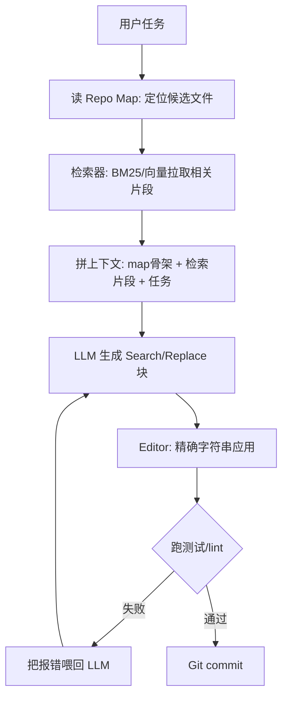

当 [R01 最小可运行·LSP-aware 编辑 loop](/kb/专题-工程与成本/r01-最小可运行-lsp-aware-编辑-loop/) 的"把整个文件塞进上下文"在第二个真实仓库面前崩溃时，你需要的不是更大的上下文窗口，而是一套**让 agent 学会"先找再读"的检索层**。本节点解决的问题是：**用 repo map + RAG-over-code 把一个能在中型仓库（50–500 文件、数万行）里干活的 coding agent 搭起来**——给可直接抄的模板，结尾把三类最致命的陷阱钉在墙上。本节的框架名叫"检索增强的 coding loop"，它对照、纠偏并深化 [c09 - RAG 架构](/kb/基础知识库/c09-rag-架构/) 在代码场景下的特殊性。

> [!warning] 升级对照（不复述 c09）
> [c09 - RAG 架构](/kb/基础知识库/c09-rag-架构/) 讲的是**文本 RAG 的通用范式**：chunk → embed → 向量检索 → 拼进 prompt。本节点**不重复**那套 pipeline，而是回答 c09 没回答的问题：**代码不是文本**。把一个 Python 函数当成一段散文去 chunk + embed，会切断它的调用关系、丢掉类型契约、把 `def __init__` 和它的 docstring 拆到两个 chunk 里。R02 是 c09 在"代码这种带结构的语料"上的专用化与纠偏：什么时候用向量、什么时候用 AST 图、什么时候根本不用检索而让 agent grep。

---

## §0 为什么是"repo map + RAG"，而不是"长上下文一把梭"

动手之前先挡掉两个默认错误框架。

**错误框架一:"上下文窗口够大就不需要检索"。** Claude 已有 1M token 上下文窗口〔以 2026-06 为准·待核实，来源:Anthropic 产品页〕,直觉上似乎可以把整个中型仓库直接塞进去。但 Chroma Research 2025 年对 18 个模型(含 Claude Opus 4 / Sonnet 4、GPT-4.1、Gemini 2.5、Qwen3)的系统测试给出了反直觉结论:**即使只加入单个无关干扰段,准确率即下降;随上下文增长,衰减非线性加速**——他们称之为 "Context Rot"(来源:Chroma "Context Rot" research,2025)。更极端的编码任务案例:Llama-3.1-8B 在 HumanEval 上的通过率从 57.3% 跌到 9.7%(30K tokens 时),Mistral 从 34.8% 跌到 0%(来源:arXiv 2510.05381 "Context Length Alone Hurts")。**把整个仓库塞进窗口不是"省事",是主动给模型灌噪声。**

**错误框架二:"检索就是上向量数据库"。** 这是 c09 范式直接平移到代码场景的惯性。但代码检索的核心实证是:在 ContextBench(SWE-bench 系列,2025)上,embedding 检索通过率 41.7% > in-context agent 检索 36.1% > AST 检索 33.3%(来源:arXiv 2602.05892,⚠️数字依任务集而定)——三者差距只有几个百分点,且**没有一种检索方式单独碾压**。更反直觉的是 arXiv 2603.20432(2026-03)的发现:给 coding agent 额外配 RAG 检索工具**并不稳定提升性能,有时反而降低**——agent 会减少更有效的 grep 操作转而依赖向量检索,导致策略退化。

所以 R02 的正确框架是**分层检索**:用 repo map 给 agent 一张"架构地图"(它知道有哪些文件、谁调用谁),再用混合检索(BM25 + 向量 + grep)按需拉取细节,而不是"一种检索方式包打天下"。这正是 [S03 Harness for Coding 全景](/kb/专题-工程与成本/s03-harness-for-coding-全景/) 强调的——**coding agent 的能力上限由 harness(检索/工具/上下文管理)决定,不只由模型决定**。

---

## §1 三件套:Repo Map / 混合检索 / 编辑应用

一个中型 coding agent 的检索增强层,由三个可替换组件构成:

| 组件 | 职责 | 最省事的实现 | 升级路径 |
|---|---|---|---|
| **Repo Map(架构地图)** | 给 agent 全局结构感:有哪些符号、谁引用谁 | tree-sitter 抽签名 + PageRank 排序 | 叠加 LSP 类型解析(Go/C++) |
| **检索器(按需拉取)** | 把"相关代码片段"喂进上下文 | BM25(grep/ripgrep) | 混合:BM25 + 向量 + reranker |
| **编辑应用(写回磁盘)** | 把模型生成的改动安全落盘 | Search/Replace block | Fast Apply 专用模型 |

这三件套对应 coding loop 里三个独立的失败面,**任意一个崩了整个 agent 就废**。下面逐个给模板。

### §1.1 Repo Map:用 tree-sitter + PageRank 造一张地图

核心思路:不把代码塞进上下文,而是用静态分析生成一张"摘要地图"——只含函数签名、类定义、调用关系,大幅降 token,同时保留架构意图。这是 Aider 在 2023 年公开、持续迭代的工程实践(来源:[Aider Repo Map 文档](https://aider.chat/docs/repomap.html))。

Aider 的做法值得逐条抄:
1. 用 **tree-sitter** 解析多语言 AST,提取所有 definitions + references(tree-sitter 覆盖 66 种语言,毫秒级增量解析,来源:Codebase-Memory 论文 arXiv 2603.27277)。
2. 在符号之上构建文件依赖图,用 **PageRank** 给节点打分——优先把"被引用最多的核心文件"放进 map(被引用多 = 架构枢纽,这是 PageRank 把网页重要性算法搬到代码图上的巧思)。
3. 默认 token 预算 **1,000 tokens**(`--map-tokens` 可调),动态伸缩:当前编辑文件少时 map 扩大,反之收缩。

最小模板(伪代码,Python + tree-sitter):

```python
# repo_map.py —— 最小可运行 repo map
import tree_sitter_languages as tsl
import networkx as nx

def build_repo_map(files: list[str], token_budget=1000):
    parser = tsl.get_parser("python")
    defs, refs = {}, []          # 符号定义表 / 引用边
    for f in files:
        tree = parser.parse(open(f, "rb").read())
        # 遍历 AST,抽取 function_definition / class_definition 的名字与签名
        # 抽取 call / attribute 节点作为 refs（谁引用了谁）
        extract_symbols(tree, f, defs, refs)

    g = nx.DiGraph()             # 用 networkx 建调用图
    for caller, callee in refs:
        g.add_edge(caller, callee)
    ranks = nx.pagerank(g)       # 关键：PageRank 给符号排重要性

    ranked = sorted(defs.items(), key=lambda kv: ranks.get(kv[0], 0), reverse=True)
    out, used = [], 0
    for sym, sig in ranked:      # 按重要性贪心填进 token 预算
        cost = len(sig) // 4     # 粗估 token
        if used + cost > token_budget:
            break
        out.append(sig); used += cost
    return "\n".join(out)        # 这段就是喂给 agent 的"架构地图"
```

> [!note] 关键决策:map 是"导航",不是"答案"
> repo map 的目的不是让模型直接读懂全部代码,而是让它知道**"我该去 grep 哪个文件"**。它解决的是 R01 的盲区——R01 里 agent 不知道仓库有什么,只能瞎读;R02 的 map 给了它一张地铁线路图。

### §1.2 检索器:BM25 打底,向量做补,reranker 收口

RAG-over-code 综述(arXiv 2510.04905,覆盖 110 篇论文,2023-01 至 2025-08)把代码检索分两大范式:

| 范式 | 检索方式 | 代表方法 | 优点 | 缺点 |
|---|---|---|---|---|
| 文本型 RAG | BM25 / 稠密向量 / 混合 | RepoCoder(迭代 RAG) | 实现简单,BM25 性价比高 | 忽略代码结构关系 |
| 结构型 RAG | AST / 调用图 / 数据流图 | GraphCoder、CodeXGraph | 细粒度语义、跨文件关系 | 可扩展性差、多语言迁移难 |

**综述核心结论:repo 规模小且结构清晰时,长上下文可匹敌甚至超过 RAG;规模/复杂度上升后,RAG 优势明显;BM25 在复杂度/收益比上持续领先。** 对中型仓库(R02 的目标),推荐的最省事配置是:

```python
# retriever.py —— BM25 打底的混合检索（最省事版）
from rank_bm25 import BM25Okapi

def hybrid_retrieve(query, chunks, k=8):
    # 第一层：BM25 词法检索（grep/ripgrep 的统计版，对标识符名极敏感）
    bm25 = BM25Okapi([c.tokens for c in chunks])
    lexical = bm25.get_top_n(query.split(), chunks, n=k*3)
    # 第二层（可选升级）：向量召回补语义近邻
    # vector = embed_retrieve(query, chunks, n=k*3)   # 见 [Embedding](/kb/基础知识库/embedding/)
    # 第三层（可选升级）：reranker 把召回的 k*3 收口到 k
    return lexical[:k]
```

⚠️ **不要一上来就上向量库。** 对中型仓库,BM25(本质就是带统计权重的 grep)往往已经够用,且没有 embedding 的索引维护成本。[Embedding](/kb/基础知识库/embedding/) 向量检索的价值在于"我搜 `处理用户登录`,但代码里写的是 `authenticate`"这种**词法不匹配的语义召回**——只有当你的查询和代码命名风格脱节时才值得加。这是对 [c09 - RAG 架构](/kb/基础知识库/c09-rag-架构/) "默认上向量"惯性的直接纠偏。

### §1.3 编辑应用:用 Search/Replace block,别用行号 diff

模型生成了改动,怎么安全写回磁盘?这是 R02 比 R01 多出来的、最容易被低估的失败面。编辑格式对比(来源:[Morph Edit Formats 指南](https://www.morphllm.com/edit-formats)、[DEV Community 基准测试](https://dev.to/ceaksan/i-benchmarked-5-file-editing-strategies-for-ai-coding-agents-heres-what-actually-works-1855)):

| 格式 | 准确率〔Morph 自评·待核实〕 | 典型问题 |
|---|---|---|
| Unified diff(标准 patch) | 80–85% | LLM 对行号极敏感,稍偏移就失效 |
| 整文件重写 | 60–75% | 大文件 token 爆炸;"中段遗忘"导致内容静默消失 |
| **Search/Replace block(精确字符串)** | **84–96%** | 字符串变化后失配 |
| 语义 / Fast Apply | ~98% | 需专门模型基础设施 |

**行业收敛点:`str_replace` 风格的精确字符串 search/replace 已成多个主流 agent(OpenHands、SWE-agent、Codex CLI)的共同选择**——比行号 diff 更鲁棒,比整文件重写更省 token。R02 中型阶段直接抄这个:

```python
# editor.py —— Search/Replace block 应用（中型阶段标配）
def apply_search_replace(file_path, search: str, replace: str):
    content = open(file_path).read()
    if content.count(search) == 0:
        raise EditError("SEARCH 块未匹配——让模型重新生成更长的上下文锚点")
    if content.count(search) > 1:
        raise EditError("SEARCH 块多处匹配——要求模型扩大 SEARCH 范围以唯一化")
    open(file_path, "w").write(content.replace(search, replace, 1))
```

Fast Apply 专用模型(Cursor Speculative Edits ~1,000 tok/s、Morph 7B 模型 ~10,500 tok/s,来源:[Fireworks × Cursor 工程博文](https://fireworks.ai/blog/cursor)、[Morph 产品页](https://www.morphllm.com/fast-apply-model))属于进阶模板（LSP / Fast Apply / subagent 编排为进阶升级位,可与 [R03 SWE-bench 风格评测跑通](/kb/专题-工程与成本/r03-swe-bench-风格评测跑通/) 的评测台配套实测）——中型阶段上专用 apply 模型是过度工程。

---

## §2 把三件套接成一个 loop



这条 loop 与 [c10 - Agent 技术栈与工具调用](/kb/基础知识库/c10-agent-技术栈与工具调用/) 描述的 ReAct 式工具调用循环同构,但 R02 在"观察"环节插入了**检索作为一等公民的工具**——agent 不是被动接收上下文,而是主动调用 `read_map` / `search_code` / `grep` 工具去拉。这呼应 [Function Calling](/kb/基础知识库/function-calling/):把检索器、编辑器都注册成工具,让模型自己决定何时检索。

---

## §3 判断主轴:三个会让你的 agent 静默崩掉的陷阱

⭐ 这一节是 R02 的命门。90% 的人搭完上面的 loop,会在这三个地方栽跟头,而且**栽了不报错,只是答案悄悄变烂**。

### 陷阱一:把代码当散文 chunk,切断了调用关系

- **症状**:agent 检索到了"相关"代码,但生成的改动引用了不存在的字段、漏掉了必须同步修改的调用方;测试报 `AttributeError`,反复改不对。
- **为什么会错**:你直接套了 [c09 - RAG 架构](/kb/基础知识库/c09-rag-架构/) 的文本 chunk 策略——按固定 token 数滑窗切分。这会把 `class User` 的定义和它的方法切到不同 chunk,把 `def foo()` 和调用它的 `bar()` 拆开。**代码的语义单元是 AST 节点,不是 512 个 token。**
- **正确做法**:用 tree-sitter 做 **AST-aware chunking**——以函数/类为最小切分单元,绝不从函数中间切断;每个 chunk 附带它的"邻居元信息"(所在文件、父类、被谁调用)。结构型 RAG(GraphCoder ASE 2024、CodeXGraph NAACL 2025,来源:RAG-over-code 综述 arXiv 2510.04905)正是为此而生。
- **真实反例**:Codebase-Memory 论文(arXiv 2603.27277)实测,纯 tree-sitter 语法解析对 **Go 的 method receiver、C++ 模板依赖调用、隐式 `this` 指针**拿不到精确调用关系——必须叠加 LSP 类型解析补足。也就是说,连"AST chunk"都不够,动态/强类型语言还要再加一层。中型阶段对 Python/TS 用 AST chunk 即可,对 Go/C++ 要预留 LSP 升级位。

### 陷阱二:无脑加向量检索,反而让 agent 变笨

- **症状**:你给 agent 接了个高大上的向量数据库,结果它在某些任务上**还不如只会 grep 的版本**;你百思不得其解,因为"检索更强了"。
- **为什么会错**:你假设"检索能力越强 = agent 越强",这是把 RAG 当成单调增益。但 arXiv 2603.20432(2026-03)发现:**给 coding agent 配 RAG 工具并不稳定提升性能,有时反而降低**——agent 一旦有了向量检索这根"拐杖",就会减少更有效的 grep/文件系统导航操作,策略退化。该研究的反直觉结论是:coding agent 处理长上下文的最佳方式,**是把它组织成目录结构、用 grep/terminal 主动检索,而非依赖注意力或向量召回**——在 5 个 benchmark(188K–3T tokens)上平均超出 SOTA 17.3%。
- **正确做法**:把检索当成**可选工具而非默认管道**。让 agent 自己决定用 grep 还是向量;向量检索只在"词法不匹配的语义召回"场景兜底。**先用纯 grep + repo map 跑通,测出 baseline,再决定要不要加向量**——而不是先堆全套 RAG。
- **真实反例**:ContextBench(arXiv 2602.05892)数据里 embedding 检索 41.7% 只比 agent 检索 36.1% 高 5.6 个百分点,而 AST 检索 33.3% 还更低。这点差距完全可能被"agent 因为有向量而少 grep"的策略退化吃掉。⚠️这些数字依任务集而定,不可外推到你的仓库——这正是要自己测 baseline 的原因。

### 陷阱三:用行号 diff 应用编辑,在大文件上静默吞改动

- **症状**:agent 说"我已修改 `service.py` 的第 142 行",但文件没变,或者改到了错误的位置;CI 显示改动应用了但行为没变。
- **为什么会错**:你用了 unified diff / 行号定位来应用编辑。LLM 对行号极不可靠——它生成的行号常有偏移,标准 patch 工具一旦 context 行对不上就**静默拒绝或错位应用**。整文件重写更糟:大文件触发"中段遗忘"(lost-in-the-middle),模型在重写时**悄悄丢掉中段内容**,你根本看不出来。
- **正确做法**:用 §1.3 的 Search/Replace block——**精确字符串匹配,匹配不到就报错重试,绝不静默**。关键是上面模板里的两个守卫:匹配 0 次报错(让模型重新生成)、匹配 >1 次报错(让模型扩大锚点唯一化)。把"失败"变成"显式异常"而不是"静默错位"。
- **真实反例**:整文件重写格式准确率仅 60–75%(来源:Morph 编辑格式对比),而 Search/Replace 达 84–96%。这 20 个百分点的差距,在一个需要几十次编辑才能完成的中型任务里会复利成"基本跑不通"。

---

## §4 产品 PM 视角补盲

工程跑通 ≠ 产品能用。三个非工程视角的"看走眼"点:

1. **用户心理模型:检索不可见 = 信任崩塌的源头**。用户看不到 agent"检索了什么、为什么选这些文件",当它改错地方时,用户的归因是"这工具太蠢",而不是"检索召回错了"。Cursor、TRAE 等产品都把检索到的文件**显式列在 UI 上**(让用户看到 agent 的"视野"),这不是炫技,是信任校准。做内部工具时,哪怕只在日志里打印"本轮检索命中的文件",都能极大降低 debug 心智负担。
2. **成本视角:检索是省钱手段,不是花钱手段**。repo map 的全部意义在于**省 token**——别把它做成"把 map 和全套检索结果都拼进 prompt"的负优化。Aider 默认 map 预算只有 1,000 token 是有道理的。这条直接呼应 [m209 - 推理成本控制手册](/kb/工程化与落地架构/m209-推理成本控制手册/):检索增强的 ROI 来自"用 1K token 的地图替代 50K token 的全量塞入",一旦检索本身的 token 开销超过它省下的,就是负收益。
3. **合规边界:代码检索 = 把代码送进第三方模型**。对 Rick 关注的字节 TRAE / 滴滴这类大组织,中型仓库往往含敏感业务逻辑。向量索引意味着代码片段被 embed 并可能离开本地;选型时**私有化部署、VPC 隔离、敏感信息过滤**(国产工具如通义灵码、Comate 的标配卖点)不是加分项而是准入项。这是 [E03 字节 TRAE 与 Windsurf 剖解](/kb/专题-工程与成本/e03-字节-trae-与-windsurf-剖解/) 与海外工具的核心差异之一。

---

## §5 对手框架回应

**业界反方立场(长上下文派):"2026 年模型都 1M 上下文了,RAG 是过渡技术,迟早被淘汰。"** 这是 Anthropic / Google 长上下文叙事的延伸,也有 arXiv 2510.04905 综述"小 repo 长上下文可匹敌 RAG"作为部分支撑。

**接受的部分**:对真正的小仓库(<50 文件)和结构清晰的代码库,直接全量塞入确实更简单有效——R02 不适用于那个场景,那是 [R01 最小可运行·LSP-aware 编辑 loop](/kb/专题-工程与成本/r01-最小可运行-lsp-aware-编辑-loop/) 的地盘。长上下文消除了检索的工程复杂度,这是实打实的优势。

**坚持的边界与赌注**:但 Context Rot 研究(Chroma,2025)证明**即使在小上下文下也存在干扰项导致的非线性衰减**——长上下文不是"塞进去就等于读懂"。我赌的是:**在 2026 年的中型生产仓库上,"先检索后读"的信噪比优势会持续压过"全量塞入"**,因为衰减是 token 量的非线性函数,而生产仓库只会越来越大。**边界在哪:如果未来出现"上下文长度不衰减"的架构突破(目前无商业级证据),这条赌注立刻失效。** 这与 [S03 Harness for Coding 全景](/kb/专题-工程与成本/s03-harness-for-coding-全景/) 的核心主张一致:harness(检索)的价值恰恰来自模型注意力的不完美。

**第二个对手框架(Rick 未必读过)——信息检索学界的"检索评测不可比"立场**:Aider 的 polyglot benchmark 有持续数据,但 SWE-bench 上**没有独立的"Aider 工具"条目**(因其能力取决于后端 LLM 选择),横向比较存在方法论问题(来源:接地简报争议点 6)。这逼问 R02 的盲点:**我给的"BM25 41.7%"这类数字,口径高度依赖任务集和 scaffold,不能当成"BM25 一定比向量好"的普适结论**。正确姿态是把它当"在你自己的仓库上跑 A/B 测"的提示,而非选型定论。

---

## §6 跨域呼应:Polanyi 的"默会知识"与"什么该进检索"

调度 [Polanyi 默会知识与提示工程的认识论张力](/kb/基础知识库/polanyi-默会知识与提示工程的认识论张力/)。Polanyi 的命题是"我们知道的比我们能说出来的多"(tacit knowing)——这恰好框定了 repo map 的认识论边界。

repo map 抽取的是**可显式编码的结构**:函数签名、调用边、类型。但一个仓库里真正难的部分是**默会的**:"这个 `legacy_handler` 名字虽然没标 deprecated,但全组都知道别碰它""这两个看似无关的模块其实通过一个全局配置耦合"。这些**不在 AST 里,不在向量里,也不在调用图里**——它们活在团队的口头传统和 commit history 的字里行间。

这改变了一个具体的技术判断:**不要指望靠加强检索来覆盖默会知识的缺口**。当你的 agent 反复在某个"看起来无关其实强耦合"的地方出错时,正确的修法不是"再上一种检索",而是把那条默会规则**显式写进 `CLAUDE.md` / 项目规则文件**(Cursor 的 `.cursor/rules/`、Claude Code 的 `CLAUDE.md`)——把 tacit 转成 explicit,喂给 agent。这也解释了为什么 [Claude Code](/kb/ai-公司与产品/claude-code/) 这类工具把"项目级规则文件"做成一等公民:**它是默会知识的显式化接口**,补的正是检索层结构化方法论上的盲区。

---

## §7 PM 决策启示

- **面试怎么用**:被问"你会怎么给大仓库搭 coding agent",别答"上 RAG"。答:"先 repo map 给架构感 → BM25 打底测 baseline → 只在词法不匹配时补向量 → 编辑用 Search/Replace 不用行号 diff",并能说出"无脑加向量可能让 agent 变笨"(arXiv 2603.20432)这条反直觉判断。这一句就能把你和"读过营销文案的候选人"区分开。
- **选型怎么用**:评估 Cursor / TRAE / Aider 时,别比 feature list,比**检索层的可观测性与可控性**——它把检索到什么暴露给你了吗?能不能限制检索范围?私有化部署时代码会不会被 embed 出本地?
- **复现怎么用**:本节模板可直接落地为一个内部工具。关键纪律:**先 grep-only 跑通测 baseline,再决定加什么**;每加一层检索都要 A/B,因为"更多检索"不等于"更好结果"。

---

## §8 与已有节点的关系

- **对照 [c09 - RAG 架构](/kb/基础知识库/c09-rag-架构/)**:做的是**纠偏 + 深化**。c09 立的是通用文本 RAG 范式;R02 指出"代码不是文本",纠正了"按 token chunk + 默认上向量"的平移错误,深化出 AST-aware chunking、结构型 RAG、检索作为可选工具三个代码专属判断。不复述 c09 的 chunk→embed→retrieve 基础。
- **对照 [c10 - Agent 技术栈与工具调用](/kb/基础知识库/c10-agent-技术栈与工具调用/)**:做的是**深化**。c10 讲工具调用循环的通用骨架;R02 把"检索"实例化为这个循环里的一等工具,给出 repo map / 检索器 / 编辑器三个具体工具的接口契约。
- **对照 [R01 最小可运行·LSP-aware 编辑 loop](/kb/专题-工程与成本/r01-最小可运行-lsp-aware-编辑-loop/)**:做的是**升格**。R01 假设"代码能整个塞进上下文";R02 解除这个假设,在仓库规模突破上下文有效窗口后接管。
- **向上承接 [R03 SWE-bench 风格评测跑通](/kb/专题-工程与成本/r03-swe-bench-风格评测跑通/)**:R02 故意把 LSP、Fast Apply 模型、subagent 编排留作升级位（中型阶段过度工程）;R03 提供把这些升级用自建评测台量化验证的方法。

---

## §9 关联节点

**核心(必读)**
- [c09 - RAG 架构](/kb/基础知识库/c09-rag-架构/) —— 本节点纠偏与深化的对象(通用 RAG → 代码 RAG)
- [c10 - Agent 技术栈与工具调用](/kb/基础知识库/c10-agent-技术栈与工具调用/) —— 检索作为工具嵌入的 loop 骨架
- [R01 最小可运行·LSP-aware 编辑 loop](/kb/专题-工程与成本/r01-最小可运行-lsp-aware-编辑-loop/) —— 上一阶段,被本节点升格
- [R03 SWE-bench 风格评测跑通](/kb/专题-工程与成本/r03-swe-bench-风格评测跑通/) —— 下一阶段,承接本节点留的升级位
- [S03 Harness for Coding 全景](/kb/专题-工程与成本/s03-harness-for-coding-全景/) —— "harness 决定能力上限"的总论
- [Embedding](/kb/基础知识库/embedding/) —— 向量检索的底层
- [Polanyi 默会知识与提示工程的认识论张力](/kb/基础知识库/polanyi-默会知识与提示工程的认识论张力/) —— §6 跨域呼应

**延伸(可选)**
- [Function Calling](/kb/基础知识库/function-calling/) —— 把检索器/编辑器注册成工具
- [m209 - 推理成本控制手册](/kb/工程化与落地架构/m209-推理成本控制手册/) —— repo map 作为 token 节省手段
- [Claude Code](/kb/ai-公司与产品/claude-code/) —— `CLAUDE.md` 作为默会知识显式化接口
- [E03 字节 TRAE 与 Windsurf 剖解](/kb/专题-工程与成本/e03-字节-trae-与-windsurf-剖解/) —— 检索层的合规/私有化差异
- [c11 - System 2 思维与 Test-Time Compute](/kb/基础知识库/c11-system-2-思维与-test-time-compute/) —— 检索-生成-验证循环的算力视角
- [A08 MCP 与 A2A 协议族](/kb/专题-安全对齐与失败/a08-mcp-与-a2a-协议族/) —— 把检索能力以 MCP 暴露给 agent

---

## 修订日志

- **R1(2026-06-07)**:首稿。建立 repo map + 混合检索 + Search/Replace 三件套模板;§3 判断主轴三陷阱(代码当散文 chunk / 无脑加向量 / 行号 diff 静默吞改动),各带症状→为什么错→正确做法→真实反例;§5 接入长上下文派 + IR 评测不可比两个对手框架;§6 调度 Polanyi 默会知识;与 c09 升级对照贯穿全文。数字接地见接地简报,volatile 项已标日期口径。
