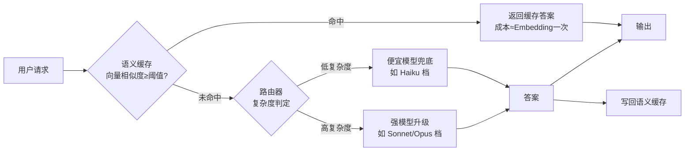

# R02 中型·模型路由 + 语义缓存 降本实验

> 本节点要解决的问题不是"路由和语义缓存能不能降本"——能，这早被各家营销话术说烂了——而是 **PM 怎么自己搭一个最小可信的实验，把"降本 X%"变成一张带质量回退数据的对照表，从而在评审会上对工程的降本承诺做独立验证。** 视角/框架名：**降本-质量双轴受控实验（cost-quality controlled experiment）**——任何只报降本幅度、不报质量回退的降本方案，都应被当作未完成的实验打回。

这是 [R01 最小可运行·Token 成本计算器](/kb/专题-工程与成本/r01-最小可运行-token-成本计算器/) 的下一站：R01 让你把一次对话算成单价，R02 让你**动手把这个单价砍下去，并亲手测出砍价的代价**。它也是 [A05 模型路由与 Mixture-of-models](/kb/专题-工程与成本/a05-模型路由与-mixture-of-models/) 的复现台、[多模型分层](/kb/基础知识库/多模型分层/) 概念卡的落地实现。

---

## §0 为什么是"双轴受控实验"而不是"降本幅度报告"

PM 拿到的降本方案，99% 长这样:"上了路由 + 语义缓存,平均成本降了 60%。" 这句话**单轴**——只有成本一个数字,没有质量这个轴。它默认了一个危险前提:被路由到便宜模型、被缓存命中返回的那些请求,质量没有显著下降。这个前提恰恰是整个降本实验里**最该被测量、却最常被省略**的部分。

为什么不能用"降本幅度报告"这个框架?因为降本和质量是**同一枚硬币的两面**,任何把请求推给更便宜模型或缓存的动作,都是在用质量风险换成本。报告只给你正面(省了多少钱),藏起反面(掉了多少质量),你就无法判断这笔交易划不划算。一个把所有请求都路由到最便宜模型的"路由器"能降本 95%,但它根本不是路由器,是降级器。

正确框架是**双轴受控实验**:固定一个评测集(test set),分别跑"基线(全部用强模型)"和"实验组(路由+缓存)",同时测两个轴——**成本轴**(每个请求的 token 花费、缓存命中率、路由分布)和**质量轴**(实验组相对基线的答案质量回退,用 LLM-as-judge 或人工抽检打分)。降本是否值得,看的是**两轴的联合**:降本 60% 但质量掉 8 分 vs 降本 40% 但质量掉 1 分,后者往往才是对的选择。这个框架直接继承 [R03 Unit Economics 模型·CAC COGS LTV 与盈亏平衡](/kb/专题-工程与成本/r03-unit-economics-模型-cac-cogs-ltv-与盈亏平衡/) 的精神:成本数字脱离了它换来的代价,就是误导。

---

## §1 实验架构:router + 语义缓存的两层拦截

整个系统是对一个请求流的**两层拦截**:先查缓存(命中就 0 推理成本直接返回),没命中再过路由(判断复杂度,简单的给便宜模型,复杂的给强模型)。



两层的成本结构完全不同,**必须分开记账**:

| 层 | 拦截动作 | 单次成本 | 主要风险 |
|---|---|---|---|
| 语义缓存 | 向量化请求 → 检索相似历史 → 命中则返回 | 一次 Embedding(极廉) + 向量检索 | **误命中**:语义相似但答案不该一样(见 §4) |
| 路由器 | 判定复杂度 → 选模型 | 规则路由≈0;LLM 路由 = 一次小模型推理 | **误判**:复杂请求被路由到便宜模型 |

关键设计决策:**路由判定本身能不能不花钱?** 三种路由器,成本与精度递增:

1. **规则路由**(零成本):按请求长度、关键词、是否含代码块等启发式分流。便宜但粗糙。
2. **小模型分类路由**(低成本):用一个便宜模型(如 Haiku 档)给请求打"复杂度 1-5 分"。多一次小推理,但判定更准。
3. **嵌入+分类器路由**:用 [Embedding](/kb/基础知识库/embedding/) 把请求向量化,喂给一个训练好的轻量分类器。需要训练数据,适合请求模式稳定的成熟产品。

> [!note] PM 决策点
> 起步用规则路由 + 语义缓存就够做出可信对照表。**别一上来上 LLM 路由器**——路由判定的那次小推理本身也是成本,在低复杂度请求占比不高时,路由开销可能吃掉一部分降本收益(这是 [A05 模型路由与 Mixture-of-models](/kb/专题-工程与成本/a05-模型路由与-mixture-of-models/) 的 failure scenario #2:请求复杂度高度同质时,路由是纯浪费)。

---

## §2 实验模板:可直接套用的最小骨架

下面是一份**评测脚本骨架**(伪代码,语言无关,PM 可交给工程或自己用脚本跑)。核心是"同一个 test set,跑两遍,记两轴"。

```python
# ---- 配置:用 R01 核实过的真实定价,绝不硬编内存里的旧价 ----
PRICES = {  # 单位 USD / 1M tokens,口径见 R01;volatile,需按调用时定价回填
    "cheap":  {"in": <cheap_in>,  "out": <cheap_out>},
    "strong": {"in": <strong_in>, "out": <strong_out>},
    "embed":  {"in": <embed_in>},
}
SIM_THRESHOLD = 0.92   # 语义缓存命中阈值,需扫描调参(见 §3)

# ---- test set:覆盖真实流量分布的代表性样本 ----
test_set = load_representative_queries(n=200)  # 含简单/复杂/边界三类

def run_baseline(q):           # 基线:全部走强模型
    return call(strong_model, q)

def run_experiment(q):         # 实验组:缓存 + 路由
    hit = semantic_cache.lookup(embed(q), SIM_THRESHOLD)
    if hit: return hit, cost_of_embed(q)            # 命中:只花一次 embedding
    complexity = route(q)                            # 规则/小模型判定
    model = cheap_model if complexity == "low" else strong_model
    ans = call(model, q)
    semantic_cache.write(embed(q), ans)
    return ans, cost_of(model, q) + cost_of_embed(q)

# ---- 双轴采集 ----
for q in test_set:
    base_ans = run_baseline(q)
    exp_ans, exp_cost = run_experiment(q)
    log({
        "q": q,
        "base_cost": cost_of(strong_model, q),
        "exp_cost": exp_cost,
        "routed_to": ...,           # cheap / strong / cache_hit
        "quality_score": judge(q, base_ans, exp_ans),  # 见 §3 评测方法
    })
```

**模板的三个不可省字段**:`routed_to`(没有路由分布,你不知道降本来自缓存还是降级)、`exp_cost` 与 `base_cost` 并排(降本幅度 = 1 - Σexp/Σbase)、`quality_score`(质量轴,缺它整个实验作废)。

---

## §3 评测方法:两轴怎么量

### 成本轴(确定性,直接算)
- **降本幅度** = 1 − (实验组总成本 / 基线总成本)。
- **拆解归因**:把降本拆成"缓存贡献"和"路由贡献"两块——分别跑"只开缓存"和"只开路由"两个消融组(ablation),否则你不知道该往哪个方向继续优化。
- **缓存命中率**:命中数 / 总请求数。这是缓存收益的天花板——命中率 20% 意味着缓存最多帮你省下那 20% 请求的推理成本。
- **路由分布**:多少 % 被分到便宜模型。这是路由收益的天花板。

### 质量轴(难点,易作弊)
- **首选 [LLM-as-judge](/kb/专题-评测与度量/a04-llm-as-judge/)**(接 0412 评测专题):用一个**独立的强模型**做裁判,给"实验组答案 vs 基线答案"打相对分(如 1-10,或"更好/相当/更差")。注意裁判模型要 ≠ 被测模型,避免自我偏好。
- **必须配人工抽检**:LLM-judge 会系统性高估便宜模型的答案(它对"流畅但错误"不敏感)。抽 10-20% 样本人工复核,校准 judge 的偏差。这是 [幻觉](/kb/基础知识库/幻觉/) 风险最容易藏身的地方——便宜模型答得流畅自信,judge 给高分,实际是错的。
- **分层看质量回退**:别只看平均分。按 `routed_to` 分层——被路由到便宜模型的请求质量掉了多少?缓存命中的请求里有没有误命中?平均分会把灾难性的局部回退稀释掉。

> [!note] 评测的认识论陷阱
> 调 `SIM_THRESHOLD`(缓存命中阈值)时有个隐蔽的过拟合:你会忍不住把阈值调低来提命中率(降本好看),但阈值越低误命中越多(质量崩)。**正确做法是在 test set 上扫描阈值,画出"命中率 vs 误命中率"曲线,选拐点**,而不是选命中率最高的点。这是典型的 Goodhart——把"命中率"当目标优化,就背叛了"返回正确答案"这个真目标。

---

## §4 判断主轴:90% 的人在这四个点上翻车

降本实验看起来简单,但下面四个点,绝大多数团队(和拿着工程方案的 PM)会栽进去。每点按 **症状 → 为什么会错 → 正确做法 → 真实反例** 四件套拆。

### 翻车点 1:语义缓存的"误命中"被当成命中
- **症状**:缓存命中率很漂亮(40%+),降本数字很好看,但上线后用户投诉"答非所问"、"明明问的不是这个"。
- **为什么会错**:语义缓存靠 [Embedding](/kb/基础知识库/embedding/) 向量相似度判命中,而**语义相似 ≠ 应该返回同一答案**。"北京今天天气"和"北京明天天气"向量极近,但答案完全不同;"怎么取消订阅"和"怎么订阅"也可能高相似度却语义相反。把相似度命中当作正确命中,是把检索问题误当成了精确匹配问题。
- **正确做法**:(a) 阈值扫描选拐点而非选最高命中(§3);(b) 对**时效性/个性化/状态相关**的请求(天气、余额、"我的订单")**禁用语义缓存或强制 TTL 过期**;(c) 在质量轴里单独统计"误命中率",把它当作一票否决指标。
- **真实反例**:把含时间词("今天/明天/最新")的请求一律缓存命中,会在跨天时返回昨天的答案——降本 0 收益、质量灾难。这类请求应在缓存前用规则过滤掉。

### 翻车点 2:只报降本,不报质量回退(单轴陷阱)
- **症状**:方案 deck 上大字写"降本 65%",通篇找不到一个质量数字。
- **为什么会错**:见 §0——降本和质量是一枚硬币两面,省略质量轴等于只展示交易的一半。这不一定是恶意,更多是**没意识到质量也要被测量**,默认"反正答案看起来都对"。
- **正确做法**:任何降本数字必须并排一个质量回退数字,且质量数字要分层(按 routed_to)。评审会上 PM 的标准提问:"这 65% 是以多少质量回退换来的?分层看,被降级的请求掉了多少分?"
- **真实反例**:一个客服 bot 把 FAQ 类请求全路由到最便宜模型,降本 70%,但其中"退款政策"这类**高后果**请求被便宜模型答错率上升,引发实际退款纠纷——降的本远小于赔的钱。质量回退在**高后果请求**上必须单独看。

### 翻车点 3:路由器把"刚性成本区"的请求也降级了
- **症状**:路由把医疗/法律/金融/安全等**质量敏感**请求也分流到便宜模型,因为它们"看起来不复杂"(短、措辞平常)。
- **为什么会错**:路由器判的是"复杂度",但**复杂度 ≠ 后果**。一句"这个药能和酒一起吃吗"措辞极简单,后果极严重。这正是 [A05 模型路由与 Mixture-of-models](/kb/专题-工程与成本/a05-模型路由与-mixture-of-models/) 调度 **Baumol 成本病**的地方:质量敏感场景存在"成本刚性区",这部分请求不能用便宜模型兜底,降本边界被它锁死。
- **正确做法**:路由判定加一道**后果/领域过滤**——命中敏感领域(关键词或分类器)的请求**强制走强模型**,绕过复杂度路由。把"复杂度路由"和"后果护栏"分成两层。
- **真实反例**:Rick 视角的安全/合规场景(司睿杰所在的安全产品线)——一个"乘客举报司机"的请求若被便宜模型误判为低复杂度而降级处理,质量回退的代价是安全事件漏判,远超任何 token 降本。安全/风控类请求应整体划入刚性区。

### 翻车点 4:在不代表真实流量的 test set 上做实验
- **症状**:实验里降本 60%、质量几乎不掉,上线后降本只有 20%、投诉一堆。
- **为什么会错**:实验用的 test set 不代表真实流量分布——比如 test set 里简单请求占 70%(所以路由降本很猛),真实流量里复杂请求占 60%(路由没东西可降)。降本幅度高度依赖**请求复杂度的分布**,test set 一旦失真,所有结论失真。
- **正确做法**:test set 必须从**真实流量采样**(或至少按真实分布构造),且覆盖简单/复杂/边界/敏感四类。上线后持续监控真实流量上的降本与质量,实验结论只是初始估计(接 [S03 FinOps for AI·成本可观测与归因全景](/kb/专题-工程与成本/s03-finops-for-ai-成本可观测与归因全景/) 的成本回归思想)。
- **真实反例**:用"常见 FAQ 100 题"做 test set 测出命中率 50%,但真实用户问法千变万化,上线命中率跌到 15%——FAQ 是被高度规整过的,真实流量长尾极长。

---

## §5 产品 PM 视角补盲

工程视角把这当成一个"降本数字优化"问题,PM 必须补三个工程看不见的盲点:

1. **延迟也是产品体验成本**。LLM 路由器多一次推理 = 多一截首 token 延迟;语义缓存查向量也有延迟。降本 60% 但每个请求慢 300ms,在对话产品里是负体验。**实验的第三个隐藏轴是延迟**,PM 要把它一起测。
2. **缓存命中的"陈旧感"是商业风险**。语义缓存让两个不同用户问相似问题得到**字字相同**的答案——在追求"个性化/拟人"的产品里,用户察觉到"机器味",信任下降。降本省的钱可能被留存下降抵消。
3. **降级的不可见性是合规风险**。当系统悄悄把用户请求降级到便宜模型,用户不知情。在受监管场景(金融建议、医疗信息),"你用了哪个模型回答我"可能是需要披露的——这是 [A07 成本约束反向塑造产品](/kb/专题-工程与成本/a07-成本约束反向塑造产品/) 里成本约束撞上合规边界的典型。

---

## §6 对手框架回应:接受 + 边界

**业界主流反方立场("模型路由能砍 60%+ 成本"——OpenRouter / Portkey 等路由网关的营销话术)**:

**接受的部分**:路由对**低复杂度请求占比高**的场景降本确实显著。[m209 - 推理成本控制手册](/kb/工程化与落地架构/m209-推理成本控制手册/) 的实测里,路由把平均成本降到约 37%(即降本约 63%)——这在知识库问答、客服 FAQ 这类大量简单请求的场景是真实的、可复现的。语义缓存在长 system prompt 高频重复问答场景同样收益巨大。这些不是营销吹的,是有实测支撑的真收益。

**坚持的边界(我赌的是什么)**:
- 这个 63% 是 m209 **特定场景**(特定路由配比、特定流量分布)的实测值,**不是普适常数**。换一个复杂请求为主的场景,降本可能只有个位数(failure scenario:复杂度同质化场景路由是纯浪费)。营销话术把单一案例的数字当通用,是本专题 §7 confirmation-bias 清单要砍除的偏见。
- 路由砍不动**刚性成本区**(Baumol):质量敏感请求必须用强模型,这部分成本不随路由下降。一个产品若高后果请求占比高,路由的降本天花板会很低。
- fallback 引入**可靠性风险**:路由网关本身是一个新的故障点和延迟来源,降本要扣掉这部分隐性成本(接 §5 延迟轴 + [A05 模型路由与 Mixture-of-models](/kb/专题-工程与成本/a05-模型路由与-mixture-of-models/) 的 fallback 可靠性讨论)。

一句话边界:**路由+缓存是真降本,但"降 60%"是一个高度场景依赖的数字,PM 的职责是自己跑实验测出"你这个场景"的数字,而不是搬营销话术。** 这正是 R02 存在的理由。

---

## §7 跨域呼应:Goodhart 定律与"命中率"的背叛

> [!note] 跨域思想资源调度:Goodhart's Law("当一个度量成为目标,它就不再是好的度量")
> 这条定律的源头是经济学家 Charles Goodhart 1975 年关于英国货币政策的论文,他的原话是"任何被观测到的统计规律,一旦被用于调控目的就会崩溃";如今广为流传的"当一个度量成为目标,它就不再是好的度量"这句精炼表述,实际是人类学家 Marilyn Strathern 1997 年对 Goodhart 工作的归纳(常被误归于 Goodhart 本人)——这恰好把它接到本专题总览 §6 调度的 Strathern「审计社会学」框架上。整个降本实验最危险的认识论陷阱,是**把"缓存命中率"和"降本幅度"当成优化目标**。一旦命中率成为 KPI,工程师会本能地调低相似度阈值去冲命中率——而每降低一点阈值,误命中就增加一点,直到缓存开始系统性返回错误答案。此时"命中率"这个度量已经背叛了它代理的真目标("返回正确答案"),变成了纯粹的数字游戏。

这个跨域框架**改变了 R02 的评测设计**:它逼我把"命中率/降本幅度"从**目标**降级为**受约束的中间指标**——真目标永远是"双轴联合最优"(降本 × 质量),命中率只有在质量护栏内才算数。所以 §3 强制要求"阈值扫描选拐点"而非"选最高命中",§4 翻车点 1 把"误命中率"设为一票否决——都是 Goodhart 在评测方法论上的直接落地。它也呼应 [S03 FinOps for AI·成本可观测与归因全景](/kb/专题-工程与成本/s03-finops-for-ai-成本可观测与归因全景/):任何成本 KPI 一旦脱离质量约束,都会被 Goodhart 化。这条与 0412 评测专题的"分数可被 Goodhart 化"是同一个认识论病灶在成本领域的复现。

---

## §8 PM 决策启示:面试 / 选型 / 复现三类落地

- **面试怎么用**:被问"你会怎么给一个 AI 产品降本",别只答"上路由和缓存"——答"我会先搭一个降本-质量双轴受控实验,固定 test set 跑基线和实验组,**同时**测降本幅度和分层质量回退,因为任何只报降本不报质量的方案我都不会签字"。这一句立刻把你和"听过这些词"的人区分开。
- **选型怎么用**:评估路由网关(OpenRouter/Portkey)或语义缓存方案时,标准问题清单:"你的降本数字是在什么流量分布上测的?质量回退怎么测的?误命中率多少?敏感请求怎么护栏?"——供应商答不上质量轴,方案直接降级。
- **复现怎么用**:套 §2 模板,从规则路由 + 语义缓存 + 200 题真实流量 test set 起步,跑出**你自己产品**的双轴对照表,贴进评审 deck。一张"降本 X% / 质量回退 Y 分 / 误命中率 Z%"的表,比任何营销话术都有说服力。

---

## §9 与已有节点的关系

- **对 [A05 模型路由与 Mixture-of-models](/kb/专题-工程与成本/a05-模型路由与-mixture-of-models/):复现/落地**。A05 在概念层讲清 cascade/router、便宜兜底+强模型升级、刚性成本区;R02 把它变成可跑的实验骨架 + 评测方法,**不复述** A05 的概念基础,只补"怎么动手测、四个翻车点怎么躲"。
- **对 [m209 - 推理成本控制手册](/kb/工程化与落地架构/m209-推理成本控制手册/):补缺 + 抽象层升高**。m209 §2.6 给了"路由平均成本约 37%、语义缓存"等**结论数字**;R02 不复述这些数字,而是补 m209 没给的东西——**如何独立验证这些数字**(双轴受控实验方法)、以及 fallback 可靠性风险与误命中风险的测量。m209 告诉你"降了多少",R02 教你"怎么自己测、怎么不被降级器冒充路由器骗到"。
- **对 [R01 最小可运行·Token 成本计算器](/kb/专题-工程与成本/r01-最小可运行-token-成本计算器/):依赖链下游**。R01 算单价,R02 用 R01 的单价做降本实验的成本轴。
- **对 [R03 Unit Economics 模型·CAC COGS LTV 与盈亏平衡](/kb/专题-工程与成本/r03-unit-economics-模型-cac-cogs-ltv-与盈亏平衡/):依赖链上游输入**。R02 测出的"降本后 per-query 成本"是 R03 unit economics 表里 COGS 的输入。
- **对 [多模型分层](/kb/基础知识库/多模型分层/) 概念卡:落地**。把概念卡变成可跑实现。

---

## §10 关联节点

**核心(必读)**
- [A05 模型路由与 Mixture-of-models](/kb/专题-工程与成本/a05-模型路由与-mixture-of-models/) —— 本节点的概念母体(cascade/router、刚性成本区)
- [R01 最小可运行·Token 成本计算器](/kb/专题-工程与成本/r01-最小可运行-token-成本计算器/) —— 成本轴的单价来源
- [R03 Unit Economics 模型·CAC COGS LTV 与盈亏平衡](/kb/专题-工程与成本/r03-unit-economics-模型-cac-cogs-ltv-与盈亏平衡/) —— 降本结果接入毛利表
- [m209 - 推理成本控制手册](/kb/工程化与落地架构/m209-推理成本控制手册/) —— 升级对照(补"如何独立验证")
- [多模型分层](/kb/基础知识库/多模型分层/) —— 落地的概念卡
- [A07 成本约束反向塑造产品](/kb/专题-工程与成本/a07-成本约束反向塑造产品/) —— 降级的合规/产品边界
- [S02 降本手段流派对照矩阵](/kb/专题-工程与成本/s02-降本手段流派对照矩阵/) —— 路由/缓存在降本流派里的定位

**延伸(可选)**
- [Embedding](/kb/基础知识库/embedding/) —— 语义缓存的相似度判定基础
- [Prompt Caching](/kb/基础知识库/prompt-caching/) —— 区别于语义缓存的另一种缓存(精确前缀复用 vs 语义近似)
- [LLM-as-judge](/kb/专题-评测与度量/a04-llm-as-judge/) —— 质量轴的评测工具(接 0412 评测专题)
- [幻觉](/kb/基础知识库/幻觉/) —— 便宜模型/误命中藏身处
- [KV Cache](/kb/基础知识库/kv-cache/) —— 推理成本的物理底层
- [S03 FinOps for AI·成本可观测与归因全景](/kb/专题-工程与成本/s03-finops-for-ai-成本可观测与归因全景/) —— 上线后的持续成本-质量监控
- [A04 推理成本三角·模型大小 延迟 质量](/kb/专题-工程与成本/a04-推理成本三角-模型大小-延迟-质量/) —— 延迟轴的理论框架
- [c09 - RAG 架构](/kb/基础知识库/c09-rag-架构/) —— 语义检索与缓存的技术近邻
- [m207 - Agent 产品化：场景推演与失败模式](/kb/工程化与落地架构/m207-agent-产品化-场景推演与失败模式/) —— 多步 Agent 的降本实验更复杂
- [_成本工程系统化专题·总览](/kb/专题-工程与成本/_成本工程系统化专题-总览/) —— 回到专题导航
- [AI PM 知识图谱·总索引](/kb/ai-pm-知识图谱/ai-pm-知识图谱-总索引/) —— 回到总图

---

## §11 修订日志

- **R0(2026-06-07,初稿)**:按宪章 §4 十一段骨架成文。一句话定义锚定"双轴受控实验"框架;§0 框架级辨析挡掉"降本幅度报告"单轴默认错误框架;§1 两层拦截架构 + Mermaid + 三种路由器成本对照;§2 可套用评测脚本骨架(三个不可省字段);§3 双轴评测方法(成本轴归因/消融 + 质量轴 LLM-judge+人工抽检+分层) + 阈值扫描选拐点的 Goodhart 警告;§4 判断主轴四个翻车点全配"症状→为什么错→正确做法→真实反例"四件套(误命中/单轴陷阱/刚性区降级/test set 失真),其中刚性区翻车点接 Baumol + Rick 安全产品线真实反例;§5 PM 补盲三点(延迟轴/陈旧感商业风险/降级不可见合规风险);§6 对手框架"路由能砍 60%"接受+边界(接受 m209 实测 63%、坚持场景依赖+Baumol 刚性区+fallback 风险);§7 跨域呼应 Goodhart 定律(★Rick 较少显式调度的对手框架),具体改变评测设计(命中率从目标降为受约束中间指标);§8 面试/选型/复现三类落地;§9 与 A05/m209/R01/R03/多模型分层 五对关系(标注升级类型,不复述);§10 关联节点分核心 7 + 延伸 11。**待核实项**:§2 PRICES 表用占位符 `<cheap_in>` 等,明确指向 R01 的真实定价口径不在本节点硬编;m209 的"平均成本约 37%/降本约 63%"已对照总览 §4 升级对照表(该数字总览已核验来自 m209 真实内容)。**已核验双链 basename 存在**:幻觉.md / Embedding.md / 量化.md / KV Cache.md / MoE.md / Prompt Caching.md / 多模型分层.md / c09 - RAG 架构.md 均在库;LLM-as-judge 在 0412 评测专题待审区有 A04 / R01 两节点(basename 为 `A04 LLM-as-Judge`,本节点用通名 `LLM-as-judge` 指向概念,入库时若无独立概念卡需改指向 `[A04 LLM-as-Judge](/kb/专题-评测与度量/a04-llm-as-judge/)`)。**R1 接地修订(2026-06-07)**:WebSearch 核实 Goodhart 定律出处——"当度量成为目标就不再是好度量"这句流行表述实为 Marilyn Strathern 1997 归纳,非 Goodhart 1975 原话(原话是"统计规律一旦被用于调控就崩溃");§7 已据此改正归属,并把它接到总览 §6 的 Strathern 审计社会学框架,消除原稿误归。
- **R2 定稿 QC(2026-06-07)**:§3/§9 正文两处 `LLM-as-judge` 通名链已按上文预案 resolve 为 `[LLM-as-judge](/kb/专题-评测与度量/a04-llm-as-judge/)`(无独立概念卡,指向 0412 评测专题待审区真实 basename,保留通名显示);本日志内 `` `LLM-as-judge` `` 因加 inline-code 反引号不构成活链,保留作决策留痕。
