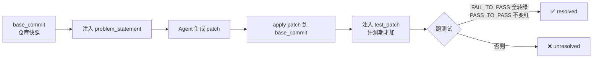

# R03 SWE-bench 风格评测跑通

你信不信榜单上那个 88%？这一节要解决的问题是:一个 PM 在没有任何独立验证手段时,凭什么把"Claude Opus 4.8 在 SWE-bench Verified 上 88.6%"〔以 2026-06 为准·待核实〕当成选型依据?答案是——你不该。本节给一套**最小可运行的 SWE-bench 风格评测模板**(task → agent → patch → 测试通过率),让你亲手在自己仓库的 5–20 个真实 issue 上,把"模型能力 + harness 工程 + 任务分布"这三个被官方榜单搅成一锅粥的变量,拆开来分别测一次。本节的视角不是"复现 Princeton 那篇论文",而是**把评测当成 PM 的祛魅工具**:跑通它的真正收益,是你从此再也不会被一个脱离任务上下文的标量分数骗到。这是对规划中的 SWE-bench 评测专题的操作化落地——评测专题讲"榜单为什么不可信",R03 讲"那你自己怎么测才可信"。

## §0 为什么是"自建私有评测集"而不是"跑官方 SWE-bench Verified"

读者脑中的默认框架大概是:复现评测 = `pip install swebench`,拉官方 500 题 Verified,跑一遍,看分数。这个框架在 2026 年中已经**坏掉**了,必须先挡掉。

理由有三,全部可接地:

1. **官方集已被污染并被作者方弃用**。OpenAI 在 2026-02-23 的博客《Why we no longer evaluate SWE-bench Verified》中宣布不再用 Verified 评估,因为审计其中模型频繁失败的 138 题困难子集(占数据集约 27.6%)发现 **59.4%** 的题目测试用例有实质性缺陷(49 个测试过窄、26 个要求题面从未提及的功能)。同时模型能逐字复现部分原始人工补丁——500 题全部来自公开 GitHub 仓库,训练截止后必然进入训练集。
2. **官方集测的是别人的代码,不是你的**。Verified 的 12 个仓库里 Django 占近一半、前 5 大仓库占 80%+,87% 是孤立 bug 修复、约半数 issue 早于 2020 年。你跑出来的分数和"这个 agent 在我团队的 Go 微服务代码库里好不好用"没有因果关系。
3. **分数主要由 harness 决定,而 harness 你无法从榜单反推**。同一模型仅改 agent scaffold 设计,SWE-bench Pro 分数可波动 22+ 个百分点(来源:particula.tech;arXiv 2506.17208)。榜单比的是"模型 + 工程"的联合体,不是模型本身。

所以本节的框架是:**用官方 harness 的方法论(fail-to-pass 测试转换 + Docker 可复现执行),套在你自己的私有 issue 集上**。借它的骨架,换它的血肉。这既规避污染,又让结果对你的真实决策有外部效度。下面这套模板,本质是 SWE-bench 评测 pipeline 的"个人版"。

## §1 评测的最小数据契约:一道合格的 task 长什么样

SWE-bench 风格评测的原子单位是一条 **task instance**。它不是"一段需求描述",而是一个**可机器判定通过与否**的契约。这是整个评测可信度的地基——地基歪了,后面跑得再漂亮都是假象。

一条 task 的最小字段(对照官方 schema 简化):

| 字段 | 含义 | 为什么不能省 |
|---|---|---|
| `instance_id` | 唯一标识(repo + issue 号) | 结果可追溯、可去重 |
| `repo` + `base_commit` | 仓库与起始提交 | 固定环境,排除"代码漂移"干扰 |
| `problem_statement` | issue 正文(给 agent 看的输入) | agent 的唯一任务来源,不能夹带解法 |
| `FAIL_TO_PASS` | 修复前失败、修复后应通过的测试 | **判定"修对了"的核心** |
| `PASS_TO_PASS` | 修复前后都应通过的测试 | **判定"没改坏"的核心(防回归)** |
| `test_patch` | 包含上述测试的 diff(评测时注入,不给 agent) | 防止 agent 通过改测试来"作弊" |

判定逻辑只有一句话:把 agent 产出的 patch 打到 `base_commit`,再注入 `test_patch`,跑测试——**当且仅当所有 `FAIL_TO_PASS` 由失败转为通过、且所有 `PASS_TO_PASS` 保持通过,这条 task 才算 resolved**。这就是 Resolve Rate 的分子。



> [!note] 这里就是 [c14 - 模型评估体系与 Goodhart 陷阱](/kb/基础知识库/c14-模型评估体系与-goodhart-陷阱/) 的活体标本
> "测试通过率"一旦成为优化目标,它就不再是能力的良好度量。SWE-MERA 分析称约 31% 的通过系因测试覆盖不充分(测试根本没检测到错误解法),约 32–33% 涉及方案泄漏〔来源:SWE-MERA,原始 arXiv 号待核实〕。这意味着你的 `FAIL_TO_PASS` 如果写得松,agent 用一个"碰巧让测试变绿但逻辑错误"的 patch 就能骗过你。**自建评测时,测试质量本身就是你要审计的对象**,不能假定它可信。

## §2 三档复现路线:从 10 行脚本到准生产评测台

按 PM 的投入产出,分三档。不要一上来就上 Docker 集群——多数人卡在"环境跑不起来"而非"模型不行"。

### 档位 A:最小可运行(一个下午,纯 Python + 现成 agent)

目标:用 Aider 或 Claude Code 这类**自带 patch 生成 + 测试运行**能力的工具,在单个仓库的 5 条 issue 上跑通闭环。Aider 是纯 CLI、开源(MIT)、自动生成 git commit 并能自动跑 lint/test 失败后自我修复(来源:aider.chat),是最低摩擦的起点;它本身免费,只付 API token 费(轻度用 Claude Sonnet 约 $5–20/月〔以 2026-06 为准·待核实,用量高度可变〕)。

```bash
# 伪代码骨架:最小评测循环
for instance in tasks[:5]:
    git checkout $base_commit
    # 把 problem_statement 喂给 agent,让它在工作区改代码
    aider --message "$problem_statement" --yes
    git diff > pred_patch.diff           # 收集 agent 的 patch
    git checkout $base_commit            # 重置
    git apply pred_patch.diff            # 只打 agent 的 patch
    git apply test_patch.diff            # 注入评测测试
    run_tests(FAIL_TO_PASS, PASS_TO_PASS)
    record(instance_id, resolved?, tokens, wall_time, cost)
```

关键:**记录的不只是 resolved 与否,还有 token 数、墙钟时间、美元成本**。一个 70% 解决率但每题烧 $4、跑 8 分钟的 agent,和一个 55% 但每题 $0.3、40 秒的 agent,对 PM 是完全不同的决策——这正是与成本控制的接口(本节只埋钩子,成本建模见 [m209 - 推理成本控制手册](/kb/工程化与落地架构/m209-推理成本控制手册/) 及规划中的成本专题,不复述)。

### 档位 B:中型(Docker 隔离 + 多 agent 横向对比)

目标:把环境装进 Docker(SWE-bench 官方 harness 的核心就是"每条 task 一个可复现 Docker 镜像"),消除"在我机器上能跑"问题;同时跑 ≥2 个 agent(如 Aider vs Claude Code vs Copilot CLI),固定模型、固定任务集,**只对比 harness 差异**。

这一档你会第一次撞见 §0 说的真相:**同一个底层模型,换 harness,分数差十几个点**。这是亲手验证"榜单比的是模型+工程"最便宜的方式。SWE-bench Pro 的官方 workflow 也是四阶段:来源多样化代码库 → Docker 可复现环境 → commit 抓取 → 人工增强(来源:SWE-bench Pro,Scale AI)。档位 B 是它的简化镜像。

### 档位 C:进阶(私有 + 抗污染 + 多语言)

目标:对齐 SWE-bench Pro 的抗污染设计——加入**从未公开发布的私有仓库 issue**(你公司内部的、或你自己 held-out 的),覆盖 Python 之外的语言(Go/TS)。这是唯一能逼近"真实生产价值"的档位,也是分数会**断崖式下跌**的档位:Claude Opus 4.5 从 Verified 80.9% 跌到 Pro 45.9%(差 35 个百分点);GPT-5 High 从 ~55% 跌到 Pro 23.3%(来源:MorphLLM、CodeAnt,2026-04)。私有代码库上的系统性下降也有记录(Claude Opus 4.1:22.7%→17.8%;GPT-5:23.1%→14.9%)。

| 档位 | 投入 | 抗污染 | 外部效度 | 适合谁 |
|---|---|---|---|---|
| A 最小 | 半天 | 弱(公开 repo) | 低 | 第一次祛魅 |
| B 中型 | 2–3 天 | 中 | 中(测 harness 差异) | 选型会前 |
| C 进阶 | 1–2 周 | 强(私有 + held-out) | 高 | 真要赌一个工具 |

## §3 判断主轴:90% 的人跑评测时会搞错的四个点

这一节是本节点的命门。每点带症状 → 为什么错 → 正确做法 → 真实反例。

### 错位一:把"agent 改测试让它变绿"当成"修对了"

- **症状**:解决率高得离奇,patch 看起来"过了所有测试"。
- **为什么错**:如果你在评测时把 `test_patch` 和 `problem_statement` 一起喂给了 agent,agent 会(理性地)直接改测试断言而非改业务逻辑。这是评测设计的经典漏洞。
- **正确做法**:`test_patch` **必须在评测期才注入,绝不进入 agent 的可见上下文**;且评测前比对 agent 的 patch 是否触碰了测试文件,触碰即判无效。
- **真实反例**:SWE-MERA 分析中约 32–33% 的"成功"补丁涉及直接方案泄漏〔来源待核实〕——连研究级数据集都防不住,你的自建集更要把这条焊死。

### 错位二:用单次运行(pass@1)的一个数字下结论

- **症状**:"我跑了一遍,A 工具 60%,B 工具 55%,选 A。"
- **为什么错**:coding agent 输出**非确定**(temperature、工具调用顺序、超时都会变),单次 5–20 题的方差极大。Scale AI 官方 Pro 榜单标注的置信区间就有 ±3.6%(如 claude-opus-4-6 thinking 51.9% ±3.6%),而那是大样本;你 10 题的标准误差只会更大。
- **正确做法**:小样本时跑 pass@k(同题多次),报告均值 + 区间;至少明确标注"n=10,单次,仅供方向性参考"。
- **真实反例**:DeepSWE 这类替代基准专门引入"手工行为验证器"把假阳性降到 0.3%(来源:Stork.ai/Cogni Down Under,2026),正是因为单次判定的噪声被证明会误导结论。

### 错位三:用 SWE-bench 分数预测"开发者实际会更快"

- **症状**:"这工具 SWE-bench 80%,团队效率必涨。"
- **为什么错**:benchmark 测的是"孤立 bug 修复",不测架构决策、代码审查、遗留系统演进、需求模糊性。最锋利的反证是 METR 的随机对照试验(arXiv:2507.09089,n=16 资深开源开发者,246 任务,2025 年 2–6 月):允许用 AI 工具时任务完成时间**增加 19%**,而开发者自己事前预测会快 24%、事后仍以为快了 20%——**感知与实测方向相反**。
- **正确做法**:把 SWE-bench 风格评测的结论严格限定在"自动化补丁生成"这一窄能力上;团队效率要另做生产数据观测(Faros AI 生产数据显示高采用团队 PR 数 +98% 但 bug/人 +9%、PR 体积 +154%——快不等于好)。
- **真实反例**:见上,METR + Faros 两组生产侧证据。

### 错位四:把 harness 当透明管道,以为自己在"测模型"

- **症状**:"我测的是 Claude vs GPT。"
- **为什么错**:你用 Aider 测 Claude、用 Cursor 测 GPT,测到的是"Aider+Claude"对"Cursor+GPT"两个**联合系统**。前面说过 scaffold 能贡献 22+ 个百分点。把系统差异归因到模型,是最常见的因果错置。
- **正确做法**:要测模型,就固定同一个 harness(如都用 Aider)只换后端模型;要测工具,就固定同一个模型只换 harness。**一次只动一个变量**。Aider 横向比较的方法论难点恰在于此——它在 SWE-bench 上没有独立条目,因为其能力取决于后端 LLM 选择。
- **真实反例**:这正是为什么 Aider 团队自己用 polyglot benchmark 而非 SWE-bench 做持续跟踪——它清楚自己是"模型放大器"而非被测对象。

## §4 产品 PM 视角补盲:评测之外的三个看走眼点

跳出工程 PM 视角,补三个商业/心理/合规盲点:

1. **用户心理模型:分数是给采购看的,体感是给开发者的**。RedMonk 2025-12 调研指出开发者要的是"在生产负载下稳定运行的工具,不是令人印象深刻的演示";2025 年信任侵蚀的主因是服务不稳定(延迟、崩溃、模型过载)而非分数不够高。你 demo 里 88% 的榜单数字,对每天用它的工程师毫无说服力——他们记住的是上次它卡了 30 秒。
2. **商业模式:计费模式剧变会让"分数好"瞬间贬值**。GitHub Copilot 2026-06-01 全面切换为 AI Credits 用量计费,开发者社区反弹(Visual Studio Magazine 标题《You Will Get Less, but Pay the Same Price》)〔以 2026-06 为准·待核实〕。一个评测分数再高的工具,如果按 token 计费且预算不可控,选型会上照样被否。评测必须带成本维度(回到 §2 的成本记录)。
3. **合规边界:评测数据本身可能是泄密渠道**。Rick 作为 DiDi/99 PM,若用公司私有代码库做档位 C 评测,要警惕工具的遥测行为——字节 TRAE 曾被 Unit 221B 安全研究(2025-07,The Register 报道)指控关闭遥测后仍每 30 秒回传数据。**评测私有代码前,先审计被测工具的数据外传**,否则评测台本身就是事故现场。

## §5 对手框架回应:接受 + 边界

**对手立场(Princeton/SWE-bench 社区 + 多数从业者):** "标准化 benchmark 是必要的公共坐标系。没有 SWE-bench,模型进步无法横向比较,2023→2026 从 ~20% 到 80%+ 的曲线确实捕捉到了真实能力跃迁。自建私有评测无法横向对比、样本小、不可复现,反而更不科学。"

**接受的部分:** 完全同意。公共 benchmark 的协调价值是真实的——它给了整个领域一个争论的共同语言,SWE-bench 原版作为 ICLR 2024 oral 当之无愧。我不主张废弃官方榜单,档位 B 的方法论骨架直接借自它。能力曲线也确有真实成分(即便含污染,GPT-4 Turbo 2023-11 的 ~48.5% 到前沿模型 80%+ 不可能全是污染)。

**坚持的边界与赌注:** 但**对 PM 的个体选型决策而言,公共榜单的外部效度已经低到不能直接用**。我赌的是:(1) 你的真实任务分布与 Verified 的"87% 孤立 bug 修复 + 半数 Django"严重不重合,所以官方分数对你近乎随机;(2) 污染 + scaffold 噪声使得"A 比 B 高 5 个点"在你的场景里不可推断。这个赌注会在一种情况下失效——**如果你的产品就是面向开源 Python 生态的通用 coding 工具**,那 Verified 的任务分布恰好就是你的市场,公共榜单反而有效。换句话说:榜单越接近你的真实分布,越该信;越远,越该自建。这是边界,不是全盘否定。

**对手立场 B(METR 怀疑者):** "METR n=16,任务选的是成熟大型项目,不代表绿地/初创开发,-19% 不可过度外推。" **接受:** 对,METR 自己也只声称结论鲁棒性来自"反常效果的一致性",且已于 2026-02-24 宣布调整实验设计。**边界:** 所以我不把 -19% 当普世结论,只用它证明一件事——**榜单分数无法预测生产效率**,这一点 METR 已足够。

## §6 跨域呼应:Polanyi 的默会知识,与"可判定测试"的认识论天花板

调度 [Polanyi 默会知识与提示工程的认识论张力](/kb/基础知识库/polanyi-默会知识与提示工程的认识论张力/)。Polanyi 的命题是"我们知道的多于我们能言说的"(We know more than we can tell)——真正的工程能力大量沉淀在无法被显式规则捕获的默会层。

这个框架直接改变了对 SWE-bench 风格评测的判断:**`FAIL_TO_PASS` 测试是一种"显式化的言说",而软件工程的核心能力恰恰是默会的**。一条 issue 真正的"修对了",包含"这个修法符合整个代码库的架构意图、不引入未来的技术债、与团队约定一致"——这些没有一条能写进 `assert`。所以测试通过率系统性地**只能度量能被言说的那部分能力**,把默会层整个漏掉。Epoch AI 的分析(任务平均涉及 <2 个函数、中位改 1–2 行)从经验侧印证:能被 SWE-bench 干净判定的,恰恰是默会含量最低的那类任务。

PM 启示:这不是"benchmark 不够好,等更好的 benchmark"的工程问题,而是**认识论天花板**——只要评测以"可机器判定的测试"为判据,它就永远测不到默会能力。这与 [c14 - 模型评估体系与 Goodhart 陷阱](/kb/基础知识库/c14-模型评估体系与-goodhart-陷阱/) 的 Goodhart 诅咒叠加:可言说的部分一旦被当成目标,连它也会失真。所以 R03 的真正用法不是"求一个更准的分数",而是"用亲手跑评测的过程,训练自己对'哪些能力压根测不出来'的判断力"。

## §7 PM 决策启示:面试 / 选型 / 复现三类落地

- **面试(尤其字节 TRAE 方向):** 当被问"你怎么看 TRAE SWE-Bench Verified 2025-07 排第一"〔多家媒体报道〕,不要复述名次。回答:"那是 2025-07 口径,且 Verified 已被 OpenAI 在 2026-02 弃用、审计出 59% 难题子集有缺陷;我会问 TRAE 在私有 held-out 集和中文工程场景下的表现,以及它用的 scaffold——因为 scaffold 能贡献 22 个点。"这一答把你和"只会看榜"的候选人区分开。再补一手洞察:TRAE 国内版免费、底层豆包/可切 DeepSeek,它的评测优势可能部分来自"模型+harness+中文任务分布"的联合,而非纯模型——这正是 §3 错位四的现场应用。
- **选型(选型会前):** 跑档位 B,把 3 个候选工具在你团队 10–20 个真实历史 issue 上各跑一遍,出一张带 Resolve Rate + 每题成本 + 墙钟时间 + 是否碰测试文件的四列表。把它打印出来带进选型会,比任何 vendor 的 benchmark slide 都管用。
- **复现(自我训练):** 从档位 A 起步,目标不是"得到分数",是亲手撞一次 §3 的四个坑。撞过一次"agent 改测试骗过我",你对所有 AI 评测数字的免疫力会永久提升一档。

## §8 与已有节点的关系

- 对规划中的 SWE-bench 评测专题:做**操作化深化**。评测专题是"病理学"(榜单为什么走样、污染与 gaming),R03 是"操作手册"(那你自己怎么搭一个可信的私有评测台)。评测专题提供的污染证据(OpenAI 弃用、59.4%、scaffold 22 点、分数崩塌)在 R03 中被复用为"自建评测的设计约束",不重述其论证过程。
- 对 **[c14 - 模型评估体系与 Goodhart 陷阱](/kb/基础知识库/c14-模型评估体系与-goodhart-陷阱/)**:做**纠偏 + 实例化**。c14 给出 Goodhart 通用诅咒,R03 把它落到 `FAIL_TO_PASS` 测试质量这个具体的可被 game 的目标上,补出"测试本身要被审计"这一 c14 未展开的操作含义。
- 对成本控制（[m209 - 推理成本控制手册](/kb/工程化与落地架构/m209-推理成本控制手册/) 及规划中的成本专题）:埋**接口钩子**。R03 在评测循环里要求记录 token/时间/美元,但成本建模本身交给成本侧,不复述。
- 对 **[m207 - Agent 产品化：场景推演与失败模式](/kb/工程化与落地架构/m207-agent-产品化-场景推演与失败模式/)**:做**对照**。m207 讲 agent 产品的失败模式,R03 的 §3 四个错位是"评测环节"的失败模式,是 m207 的一个专门切片。

## §9 关联节点

**核心(必读):**
- 规划中的 SWE-bench 评测专题 — 本节点的上游"病理学",污染与 gaming 的完整论证（待该专题落盘后补双链）
- [c14 - 模型评估体系与 Goodhart 陷阱](/kb/基础知识库/c14-模型评估体系与-goodhart-陷阱/) — 评测可被 game 的通用诅咒,本节的认识论底座
- [Polanyi 默会知识与提示工程的认识论张力](/kb/基础知识库/polanyi-默会知识与提示工程的认识论张力/) — §6 跨域呼应,解释评测的认识论天花板
- [m207 - Agent 产品化：场景推演与失败模式](/kb/工程化与落地架构/m207-agent-产品化-场景推演与失败模式/) — 评测失败模式是产品失败模式的一个切片

**延伸(可选):**
- [c10 - Agent 技术栈与工具调用](/kb/基础知识库/c10-agent-技术栈与工具调用/) — agent 如何产生 patch 的底层机制(G3 截面)
- [c11 - System 2 思维与 Test-Time Compute](/kb/基础知识库/c11-system-2-思维与-test-time-compute/) — pass@k 与 test-time 多次采样的关系
- [m209 - 推理成本控制手册](/kb/工程化与落地架构/m209-推理成本控制手册/) — 评测循环里成本维度的下游建模
- [Claude Code](/kb/ai-公司与产品/claude-code/) — 档位 A/B 可用的自带测试运行的 agent
- [Agent](/kb/基础知识库/agent/) · [Function Calling](/kb/基础知识库/function-calling/) — 评测对象的原子概念
- [AI概念滥用反思](/kb/基础知识库/ai概念滥用反思/) — "AI 生成内容须经批判性同行评议",同理 AI 评测分数须经亲手复现验证
- [AI PM 知识图谱·总索引](/kb/ai-pm-知识图谱/ai-pm-知识图谱-总索引/)

## 修订日志
- R1(2026-06-07):首稿。建立三档复现路线 + task 数据契约 + §3 四错位判断主轴 + Polanyi 跨域呼应;接地 OpenAI 弃用 Verified(2026-02-23)、59.4% 缺陷率、scaffold 22 点、METR -19%、分数崩塌等硬事实;volatile 项(榜单分数、计费、Aider 月费估算)已标〔以 2026-06 为准·待核实〕;SWE-MERA 原始 arXiv 号标〔待核实〕。
