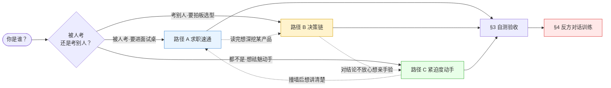

# 编程工具系统化专题 · 多视图阅读指南（README）

> 本页是 0414「编程工具系统化专题」的**读法**，不是地图。地图是 [_编程工具系统化专题·总览](/kb/专题-工程与成本/_编程工具系统化专题-总览/)（MOC）——它回答"这套立方体由哪 17 块组成"。本页回答另一个问题：**你是谁、有多少时间、要去哪个面试桌或选型会，因此该从哪一块进、按什么顺序读、读到什么程度才算读懂。**
>
> 一套知识立方体若只能从第一页线性读到最后一页，它就还是一篇长文。本专题被设计成可以从三个不同的"身份模式"切入（求职、决策、动手），每条路径都有明确的**前置产出**（读之前先答一个问题，逼出你的现有判断）和**时长预算**。读完任意一条路径，请回到 §3 用自测题验收；准备上面试桌或选型会前，请过一遍 §4 的反方对话训练——那是用业界真实的反对声音逼问你"是不是只背了结论"。

---

## §1 三条阅读路径（各标时长 · 前置产出 · 出口判据）

三条路径不是难度递进，是**目的正交**：A 服务"被人考"、B 服务"考别人/拍板"、C 服务"不被 demo 骗"。可以只走一条，也可以 A→B→C 全走（约 4–5 小时）。每条路径开头的**前置产出**请先口头或落纸回答一遍——这是为了在读之前把你脑子里的默认错误框架显形，读完再对照，提升才可观测。

### 路径 A · 求职速通（字节 TRAE 方向优先）｜约 70–90 分钟

> **适合谁**：准备 AI coding 工具方向 PM 面试的转型 PM（尤其字节 TRAE / 国产工具方向）。
> **前置产出（读前先答，限 2 分钟）**：面试官问"你怎么评估一个 coding agent 的架构"——现在的你会怎么答？把答案写下来。如果你的答案里出现了"它有 Agent 模式""支持 MCP""SWE-bench 分数高"，说明你在比 feature；读完这条路径你应该能换成"比层间可控性"。

| 步序 | 节点 | 读它干什么 | 时长 |
|---|---|---|---|
| A-1 | [A01 编程工具概念谱系与语义辨析](/kb/专题-工程与成本/a01-编程工具概念谱系与语义辨析/) | 先把"AI 编程工具"这个伞形词拆成 autocomplete / assistant / agent / autonomous SWE 四种所指——面试时第一句话就能挡掉一半误解 | 15 min |
| A-2 | [S01 Coding Agent 分层架构剖面](/kb/专题-工程与成本/s01-coding-agent-分层架构剖面/)（★旗舰） | 拿到"评估架构"的真正答案：五层堆栈 + 四个致命层间耦合点。这是全专题承重墙，读厚一点 | 30 min |
| A-3 | [E03 字节 TRAE 与 Windsurf 剖解](/kb/专题-工程与成本/e03-字节-trae-与-windsurf-剖解/) | 把架构套到求职目标公司上：TRAE 差异化拆成模型/形态/分发三层，落到"合规墙内的产品判断"这枚一手洞察 | 20 min |
| A-4 | [G02 编程工具代际演化详解](/kb/专题-工程与成本/g02-编程工具代际演化详解/) | 给上面的判断补时间维度：每代的瓶颈/被超越/2026 Hype Cycle 坐标，面试聊"趋势"时不空 | 15 min |

> **出口判据（读完应能做到）**：30 秒讲清"评估 coding agent 架构 = 比五层的层间可控性而非 feature list"，并能就字节 TRAE 给出一条不来自公关稿的差异化判断。**做不到就回 A-2 重读 S01 的四个耦合点。**

### 路径 B · 决策链（选型会路径）｜约 90–110 分钟

> **适合谁**：要给团队拍板"上 Cursor 还是 Claude Code 还是 TRAE"的 PM / Tech Lead。
> **前置产出（读前先答）**：你们团队现在准备上哪个工具、理由是什么？把理由写下来。如果理由是"补全更快/便宜/大家都在用/SWE-bench 高"，这条路径会告诉你这些都是错的比较维度。

| 步序 | 节点 | 读它干什么 | 时长 |
|---|---|---|---|
| B-1 | [A02 嵌入形态层级辨析·插件 IDE-fork CLI 云端 PR-bot](/kb/专题-工程与成本/a02-嵌入形态层级辨析-插件-ide-fork-cli-云端-pr-bot/) | 先确定你要的是哪种**形态**——形态错配是选型第一杀手（用 CLI 工具的心智买了个 IDE-fork） | 20 min |
| B-2 | [S02 编程工具流派架构对照矩阵](/kb/专题-工程与成本/s02-编程工具流派架构对照矩阵/) | 六款工具 × 六维度对照：别比 feature，比"每层你能不能换、换的代价、谁握着开关" | 25 min |
| B-3 | [E01 Cursor 剖解·IDE-fork 哲学](/kb/专题-工程与成本/e01-cursor-剖解-ide-fork-哲学/) + [E02 Claude Code 剖解·CLI 哲学](/kb/专题-工程与成本/e02-claude-code-剖解-cli-哲学/) | 把两条主流路线各自的护城河与命门看成"同一枚硬币的两面"——IDE-fork 的低摩擦红利 = 范式锁定 | 35 min |
| B-4 | [S03 Harness for Coding 全景](/kb/专题-工程与成本/s03-harness-for-coding-全景/) | 选型的终极判据：差异不在模型，在 harness（控制循环/工具集/沙盒/验证/可观测）。验证层缺位的工具一票否决 | 25 min |

> **出口判据**：能写出一份"按架构可控性而非 feature 的选型结论"，且结论里至少有一条"我不选 X，因为它的 ___ 层缺位/不可替换"。**写不出"因为某层"就回 B-4 重读 harness 五件套。**

### 路径 C · 紧迫度 / 动手（祛魅路径）｜约 120–150 分钟（含跑代码）

> **适合谁**：被 demo 和榜单牵着走、想亲手撞墙把黑箱还原成可读循环的人。
> **前置产出（读前先答）**："我们的 Agent 能自主改代码"——你信这句话吗？为什么信/不信？记下来，跑完 R01 你会列出至少四个它演不出的失败点。

| 步序 | 节点 | 读它干什么 | 时长 |
|---|---|---|---|
| C-1 | [R01 最小可运行·LSP-aware 编辑 loop](/kb/专题-工程与成本/r01-最小可运行-lsp-aware-编辑-loop/) | 亲手写 80 行骨架（读文件→LLM 生成 patch→apply→验证），跑通后"自主改代码"的魔法当场祛魅 | 40 min（含跑） |
| C-2 | [A03 Codebase 理解机制·repo-map RAG-over-code LSP](/kb/专题-工程与成本/a03-codebase-理解机制-repo-map-rag-over-code-lsp/) + [A04 编辑应用机制·diff-apply 与 fast-apply](/kb/专题-工程与成本/a04-编辑应用机制-diff-apply-与-fast-apply/) | 撞墙后回头看两根隐形承重墙：模型没"读完你的 repo"、生成对 ≠ 应用对 | 35 min |
| C-3 | [R02 中型·repo-map + RAG-over-code 检索增强](/kb/专题-工程与成本/r02-中型-repo-map-+-rag-over-code-检索增强/) | 把 loop 升级到 50–500 文件仓库的检索增强；纠偏 [c09 - RAG 架构](/kb/基础知识库/c09-rag-架构/)——代码不是散文 chunk | 35 min（含跑） |
| C-4 | [R03 SWE-bench 风格评测跑通](/kb/专题-工程与成本/r03-swe-bench-风格评测跑通/) | 在自己仓库 5–20 个真实 issue 上把"模型能力 + harness 工程 + 任务分布"三个变量拆开测，从此不被榜单标量骗 | 40 min（含跑） |

> **出口判据**：跑通最小 loop，并能口头列出"代码库理解"与"编辑落地"各自的真实边界；看到任何"SWE-bench XX 分"的标量，能反问"哪个 harness、什么任务分布、测试覆盖够不够"。**问不出这三句就回 C-4 重读评测祛魅。**

> [!tip] 碎片化读法（没有整块时间时）
> 只读三块就有 60% 的判断力提升：[A01 编程工具概念谱系与语义辨析](/kb/专题-工程与成本/a01-编程工具概念谱系与语义辨析/)（切清术语）+ [S01 Coding Agent 分层架构剖面](/kb/专题-工程与成本/s01-coding-agent-分层架构剖面/)（承重墙）+ [S02 编程工具流派架构对照矩阵](/kb/专题-工程与成本/s02-编程工具流派架构对照矩阵/)（横向对照表）。把 S02 那张对照矩阵打印出来贴在选型会白板旁边。

---

## §2 路径之间的关系（怎么组合）

A 与 B 共享 [S01 Coding Agent 分层架构剖面](/kb/专题-工程与成本/s01-coding-agent-分层架构剖面/) 这块承重墙（A 用它答"怎么评估架构"，B 用它当选型判据的源头），所以两条都走时 S01 只读一遍即可。C 是另外两条的"证伪机"——A/B 读到的所有判断，C 都能让你亲手跑一遍看它在哪失效。无论走哪条，最后都汇到 §3 自测和 §4 反方训练。

---

## §3 自测题（≥10 题 · 每题标"及格线 / 优秀线 / 反例"）

读完不等于读懂。下面每题先自己答，再对照三档标准：**及格线**=抓住了核心判断；**优秀线**=带了数字、边界或反例，能上面试桌；**反例**=典型的"看似答对其实没懂"的错误答法，看到自己的答案落在这里就回对应节点重读。

> [!note] 评分说明
> 12 题里答到 **8 题及格 = 通过**（可上选型会）；**6 题以上达优秀线 = 出版级读者**（可上面试桌且经得起追问）。落到"反例"档的题，回箭头指向的节点重读。

**Q1.「AI 编程工具」是一个好的分析单位吗？**
- 及格线：不是；它是伞形词，至少塌缩了 autocomplete / coding assistant / coding agent / autonomous SWE 四种所指。
- 优秀线：能说明这是连续光谱被切成离散档位，且能指出"为什么不选 X"这句话在伞形词层面**没有真值**——必须先问"哪一个所指"。
- 反例："是的，就是用 AI 帮你写代码的工具"——把光谱塌缩回单点，回 [A01 编程工具概念谱系与语义辨析](/kb/专题-工程与成本/a01-编程工具概念谱系与语义辨析/)。

**Q2. 评估一个 coding agent 的架构，该比什么？**
- 及格线：比五层堆栈（模型/检索/编辑/验证/UI）的层间可控性，不是比 feature list。
- 优秀线：能点名四个致命层间耦合点之一并解释症状（如"验证缺失 × 幻觉 → 幻觉代码静默进 PR"），且强调单层强弱不决定好坏、耦合点才决定。
- 反例："看它有没有 Agent 模式、支不支持 MCP、SWE-bench 多少分"——这是 feature 不是判断，回 [S01 Coding Agent 分层架构剖面](/kb/专题-工程与成本/s01-coding-agent-分层架构剖面/)。

**Q3.「模型读了我整个 repo」这句话对吗？**
- 及格线：不对；模型读的是静态分析压缩出的 repo-map / 摘要 + 几次自发检索，不是全量代码。
- 优秀线：能区分 repo-map（AST/tree-sitter/LSP 静态地图）、RAG-over-code（embedding 检索）、长上下文塞入、让 agent 自己 grep 四条路线，并指出代码不是文本、不能当散文 chunk 切。
- 反例："对，现在上下文窗口都 1M 了，整个 repo 都能塞进去"——撞上 Context Rot，回 [A03 Codebase 理解机制·repo-map RAG-over-code LSP](/kb/专题-工程与成本/a03-codebase-理解机制-repo-map-rag-over-code-lsp/)。

**Q4. 为什么"生成对"不等于"应用对"？**
- 及格线：模型生成的 diff/patch 正确，落地到文件时可能 apply 失败或错位（edit locality 问题），这是一层独立的隐形产品力。
- 优秀线：能说出 whole-file / diff / search-replace / fast-apply 四条编辑路线的权衡，并解释 fast-apply 用小模型把"大模型的草稿"精确落地的分工。
- 反例："只要模型够强，生成对了自然就改对了"——把编辑应用层抹掉，回 [A04 编辑应用机制·diff-apply 与 fast-apply](/kb/专题-工程与成本/a04-编辑应用机制-diff-apply-与-fast-apply/)。

**Q5. auto-accept / YOLO 模式更安全还是更危险？**
- 及格线：把"判断权"在更粗的粒度上交给了 AI，监督边界后移，不是单纯更高效或更安全。
- 优秀线：能引"批准率畸高 = 人工监督已失效"这条反直觉判断（93% 批准率意味着审批退化为橡皮图章），并指出用分类器替代逐步审批仍有假阴性（约 17%）的边界。〔分类器假阴性比例以节点正文标注口径为准〕
- 反例："auto mode 当然更安全，因为有 AI 帮你把关"——把自动化误当安全保证，回 [A05 Agentic Coding 信任校准](/kb/专题-工程与成本/a05-agentic-coding-信任校准/)。

**Q6. 模型趋同后，coding 工具靠什么防御？**
- 及格线：DX（Developer Experience）——onboarding、心流、信任建立、肌肉记忆，这些不在 feature list 上、抄不走。
- 优秀线：能用心流（Csikszentmihalyi）解释为什么 DX 是无法一夜复制的护城河，并能指出 auto mode 把开发者推向"验证 AI 产出"的 labor 是 DX 的隐性税（阿伦特 work/labor）。
- 反例："靠模型更强/更便宜"——模型层恰恰是最易被追平的一层，回 [A06 Developer Experience 作为产品力](/kb/专题-工程与成本/a06-developer-experience-作为产品力/)。

**Q7.「一代更比一代强」的代际叙事错在哪？**
- 及格线：代际更替是不可通约的范式转移（Kuhn），不是性能标量单调递增；每一代都有"它没比上一代更好"的反例。
- 优秀线：能举一个具体反例（如 IDE-agent 化后某些纯补全场景的延迟/打断反而更差），并说明"哪一代更强"是范畴错误。
- 反例："对啊，从 Tabnine 到 Copilot 到 Cursor 到 Devin 一路变强"——线性进步史，回 [G01 编程工具代际谱系总图](/kb/专题-工程与成本/g01-编程工具代际谱系总图/) 与 [G02 编程工具代际演化详解](/kb/专题-工程与成本/g02-编程工具代际演化详解/)。

**Q8. Cursor 的护城河和命门分别是什么？**
- 及格线：护城河 = IDE-fork 带来的低迁移摩擦 + 编辑器内核完全控制权；命门 = 同一个 IDE-fork 决策带来的范式锁定。是一枚硬币的两面。
- 优秀线：能用维特根斯坦"语言游戏"说明 IDE 的"文件/行/光标/编辑"语法封顶了用户对 AI 的想象力，并标注"形态错配看空 Cursor"的失效场景（若"边写边改"始终是主流，IDE-fork 长期跑赢）。
- 反例："Cursor 就是补全比别人快/UI 好看"——又回到 feature 比较，回 [E01 Cursor 剖解·IDE-fork 哲学](/kb/专题-工程与成本/e01-cursor-剖解-ide-fork-哲学/)。

**Q9. 为什么一个没有 GUI 的 CLI 工具（Claude Code）能成重度工程组织首选？**
- 及格线：CLI + harness 赌的是"AI 是主体、人是审阅者"的工作模式，可脚本化、可嵌入流水线、不受 IDE 语法封顶。
- 优秀线：能点名 CLAUDE.md / skills / subagents / MCP 四件套的作用，并诚实标注 CLI"更好"的边界——非工程组织、非终端用户象限缺公开对比数据。
- 反例："因为程序员就喜欢用命令行装"——把工程判断当审美偏好，回 [E02 Claude Code 剖解·CLI 哲学](/kb/专题-工程与成本/e02-claude-code-剖解-cli-哲学/)。

**Q10. 字节 TRAE 真正稀缺的是什么？**
- 及格线：不是技术（模型/形态可追平），而是合规墙内的产品判断——海外团队没有的 know-how。
- 优秀线：能把差异化拆成模型/形态/分发三层并追问哪层是真护城河，且能诚实标注 TRAE"国内服务器/满足等保"叙事与架构现实之间的张力（The Register 2025-07-28 报道关闭遥测开关后仍有回传）。
- 反例："国产工具有政策保护，肯定有戏"——把分发优势误当护城河、把叙事当事实，回 [E03 字节 TRAE 与 Windsurf 剖解](/kb/专题-工程与成本/e03-字节-trae-与-windsurf-剖解/)。

**Q11. 看到"SWE-bench XX 分"，第一反应该问什么？**
- 及格线：问"哪个 harness、什么任务分布、测试覆盖够不够"——分数是模型能力 + harness 工程 + 任务分布三个变量的纠缠，不是纯模型能力。
- 优秀线：能引"绿灯 ≠ 正确"（测试覆盖不足时通过率虚高，如 SWE-MERA 类审计中通过的样本里有相当比例源于覆盖不足），把评测当 PM 的祛魅工具而非营销标量。〔具体审计数字以 R03/0412 评测专题正文口径为准〕
- 反例："80 分啊，那快能替代程序员了"——把单一标量当能力上限，回 [R03 SWE-bench 风格评测跑通](/kb/专题-工程与成本/r03-swe-bench-风格评测跑通/)（评测信任危机细节见 0412 评测专题）。

**Q12. harness 和模型，哪个才是真实差异源？**
- 及格线：harness（控制循环/工具集/沙盒/验证/可观测性）——同一个模型套不同 harness，表现可以天差地别。
- 优秀线：能说明 coding harness 相对通用 harness 重切了两根承重墙：记忆被代码库吸收、沙盒升为承重墙（一次错误文件写入不可逆，爆炸半径大）；并能引 METR RCT（资深开发者在成熟代码库上用 agentic coding 反而慢约 19%）作为"harness/任务错配"的证据，同时标注其适用边界（仅限成熟代码库 + 资深 + 复杂任务，绿地/初中级无共识）。
- 反例："当然是模型，模型越强工具越好用"——把差异全归给模型层，回 [S03 Harness for Coding 全景](/kb/专题-工程与成本/s03-harness-for-coding-全景/)。

---

## §4 反方对话训练（编程工具 6 个高频追问）

面试桌和选型会上，真正考验你的不是"你知道什么"，而是"业界主流的反对声音打过来时你接不接得住"。下面 6 个是 AI coding 领域**最高频**的追问。每个给出：反方台词 → 业界谁在这么说 → 怎么接（接受对的部分 + 标注边界与赌注，**不是反驳**）→ 你的边界在哪。用宪章 §7 的"接受 + 边界"工艺，不要做廉价反驳。

> [!warning] 训练方法
> 先盖住"怎么接"自己说一遍（出声或落纸），再对照。**评判标准不是"你反驳得多狠"，而是"你接受了对方哪一点、又在哪条线上守住了赌注"。** 只会喊"不对，AI 编程很厉害"的，和只会喊"都是泡沫"的，是同一种没读懂。

### 追问 1 ·「Claude Code 和 Cursor 不就是套壳吗？」

- **谁在说**：投资人、不写代码的高管、看了几篇公众号的同行——"底层都是 Claude/GPT，无非套个壳"。
- **怎么接**：接受对的部分——是的，模型层高度趋同，这一层确实是"共享的"，套壳质疑在"模型不是护城河"这点上完全正确。但守住边界——决定好不好用的恰恰不是模型层，而是**模型之上的 harness**：同一个 Claude 模型，套 Cursor 的 IDE-fork harness 和套 Claude Code 的 CLI harness，得到的是两种不可互换的工作模式（边写边改 vs AI 主体人审阅）。"套壳"这个词预设了"壳是薄的"，但 coding 工具的壳是承重墙——检索层、编辑应用层、验证闭环、信任校准，每一层都演不出来却决定生死。
- **你的边界（赌注）**：我赌的是"未来 2–3 年差异在 harness 而非模型"。这个赌注的失效场景是——若模型强到能在单次推理里完成检索+编辑+自验证（harness 被模型内化），那"套壳论"就成立了。目前没有证据走到那一步，但这是我承认可能错的地方。
- 武器库：[S03 Harness for Coding 全景](/kb/专题-工程与成本/s03-harness-for-coding-全景/)、[S01 Coding Agent 分层架构剖面](/kb/专题-工程与成本/s01-coding-agent-分层架构剖面/)、[E01 Cursor 剖解·IDE-fork 哲学](/kb/专题-工程与成本/e01-cursor-剖解-ide-fork-哲学/) + [E02 Claude Code 剖解·CLI 哲学](/kb/专题-工程与成本/e02-claude-code-剖解-cli-哲学/)。

### 追问 2 ·「SWE-bench 80 分，是不是快能替代程序员了？」

- **谁在说**：媒体标题党、销售话术、被榜单营销裹挟的决策者。
- **怎么接**：接受对的部分——分数确实在涨，agentic coding 在"有明确测试、范围清晰的 issue"上确实能跑通相当一部分，这是真进步，不是泡沫。但守住边界——SWE-bench 分数是**模型能力 + harness 工程 + 任务分布**三个变量纠缠出来的标量，不是"程序员能力的百分比"。三个陷阱：(a) 任务分布偏窄（多是有现成测试的孤立 bug，不含需求澄清/架构权衡/跨团队协调）；(b) 绿灯 ≠ 正确，测试覆盖不足时通过率虚高；(c) METR 的 RCT 显示资深开发者在成熟代码库上用 agentic coding 反而慢约 19%——"benchmark 涨"和"真实生产提效"是两条曲线。
- **你的边界（赌注）**：我赌"替代的是任务而非岗位"——可被 SWE-bench 化的工作（边界清晰、有测试、低跨团队耦合）会被吃掉，但程序员工作里"把模糊需求变成可测试 issue"的那部分恰恰是 benchmark 测不到的。失效场景：若任务分布扩展到覆盖需求澄清与架构决策且分数仍高，这个边界要重画。
- 武器库：[R03 SWE-bench 风格评测跑通](/kb/专题-工程与成本/r03-swe-bench-风格评测跑通/)、[S03 Harness for Coding 全景](/kb/专题-工程与成本/s03-harness-for-coding-全景/) §4（METR vs JetBrains n=24,534 大样本乐观派的对冲）；评测信任危机细节见 0412 评测专题。

### 追问 3 ·「TRAE 是国产工具，到底有没有戏？」

- **谁在说**：求职时的面试官、关注国产替代的投资人、做技术选型的国内团队。
- **怎么接**：接受对的部分——有戏，但戏不在大多数人以为的地方。技术上 TRAE 能追平（模型可接、IDE-fork 形态可抄），分发上有字节生态和合规优势，这些是真的。但守住边界——技术和分发都不是**可防御**的护城河：模型会趋同、形态会被抄、政策红利会被多家瓜分。TRAE 真正稀缺的是**合规墙内的产品判断**——数据驻留、等保、内容审核、信创适配这些约束下"什么能做什么不能做"的 know-how，这是海外团队（Cursor/Claude Code）结构性缺失的。
- **你的边界（赌注）**：我赌"合规判断是 TRAE 唯一抄不走的资产"。但要诚实记账——TRAE 的"国内服务器/满足等保"叙事与架构现实存在张力（The Register 2025-07-28 报道：关闭遥测开关后仍观测到回传），所以"合规优势"是产品宣称，不能直接当确证事实写进判断；它是潜在护城河，前提是叙事能兑现成架构。
- 武器库：[E03 字节 TRAE 与 Windsurf 剖解](/kb/专题-工程与成本/e03-字节-trae-与-windsurf-剖解/)、[字节 TRAE 团队人物图谱](/kb/ai-公司与产品/字节-trae-团队人物图谱/)、〔私人记录〕。

### 追问 4 ·「上下文都 1M / 10M token 了，还要 RAG 和 repo-map 干嘛？」

- **谁在说**：长上下文派（LeCun 式立场的工程版："窗口够大，检索就是多余的中间层"）、模型厂商的市场话术。
- **怎么接**：接受对的部分——长上下文确实让一部分原本要靠检索拼接的场景变简单了，对中小仓库、单次任务，直接塞比维护一套 RAG 管线更省工程。这点成立。但守住边界——**Context Rot**：上下文不是越长越好，有效注意力随长度衰减（如 Llama-3.1-8B 在 HumanEval 类任务上下文拉到约 30K 时通过率从 57.3% 掉到 9.7% 这类衰减现象），把整个 repo 塞进去 ≠ 模型真的"读懂并用上了"。而且成本随 token 线性涨，检索是为了**只喂相关那部分**。代码还有结构（调用图/类型/依赖），repo-map 喂的是结构地图，不是文本块——这是长上下文不能替代的。〔具体衰减数字以节点正文标注口径为准〕
- **你的边界（赌注）**：长上下文 vs RAG 的胜负翻转点在哪个 token 量级，学界**无共识**——这是我诚实承认没有定论的地方。我的赌注是"对 50–500 文件以上的真实仓库，结构化检索在可见的未来仍不可省"，但不赌具体阈值。
- 武器库：[A03 Codebase 理解机制·repo-map RAG-over-code LSP](/kb/专题-工程与成本/a03-codebase-理解机制-repo-map-rag-over-code-lsp/)、[R02 中型·repo-map + RAG-over-code 检索增强](/kb/专题-工程与成本/r02-中型-repo-map-+-rag-over-code-检索增强/)、[S01 Coding Agent 分层架构剖面](/kb/专题-工程与成本/s01-coding-agent-分层架构剖面/) §6（耦合点四）。

### 追问 5 ·「让 AI 自动改代码（auto/YOLO 模式）效率不是更高吗？为什么还要人审？」

- **谁在说**：追求吞吐的工程负责人、Anthropic 式"逐步审批已失效、该交给分类器"的自动化派。
- **怎么接**：接受对的部分——逐步人工审批在高频小改动上确实已经失效，Anthropic 的观察是对的：当批准率畸高（如约 93%），"审批"已退化成橡皮图章，人没有在真正监督，留着它只是制造确认疲劳。所以"全靠人逐步点同意"不是答案。但守住边界——把判断权交出去不等于风险消失，而是**风险换位置**：(a) 验证缺失 × 幻觉的耦合下，错误代码会静默进 PR；(b) 沙盒爆炸半径大，一次错误文件写入不可逆；(c) 用分类器替代人审仍有假阴性（约 17%），只是把"人疲劳"换成了"分类器漏检"。正确做法是按**改动的爆炸半径**分级授权，而不是全 auto 或全手动二选一。
- **你的边界（赌注）**：我赌"信任校准的粒度（在什么改动上交权给谁）比 auto/manual 二分更重要"。失效场景：在有强测试护栏 + 可秒级回滚的环境里，全 auto 的风险被基础设施吸收了，这时人审的边际价值确实趋零——边界取决于你的验证层和回滚能力有多强。
- 武器库：[A05 Agentic Coding 信任校准](/kb/专题-工程与成本/a05-agentic-coding-信任校准/)、[S01 Coding Agent 分层架构剖面](/kb/专题-工程与成本/s01-coding-agent-分层架构剖面/) §6、[E02 Claude Code 剖解·CLI 哲学](/kb/专题-工程与成本/e02-claude-code-剖解-cli-哲学/) §4。

### 追问 6 ·「未来一定是 AI 原生 IDE，CLI 工具只是程序员的过渡偏好吧？」

- **谁在说**：IDE 原生派（"AI coding 的终局是重新设计的 AI-native 编辑器，命令行是上一个时代的残留"）。
- **怎么接**：接受对的部分——对**大多数终端用户和增量/维护型工作**，可视化的 AI 原生 IDE 大概率是更主流的形态，"边看边改"的丝滑体验有真实价值，这点 IDE 派是对的。但守住边界——这里有两个不可通约的赌注，不是一个"过渡 vs 终局"的进步轴：CLI 赌"AI 是主体、人是审阅者、工作可脚本化嵌入流水线"，IDE 赌"人是主体、AI 是副驾、工作发生在编辑器里"。重度工程组织选 CLI 不是怀旧，是因为流水线化/可组合/不受 IDE 语法封顶（维特根斯坦：IDE 的"文件/行/光标"语法封顶了 AI 想象力）。用 Christensen 破坏性创新看：CLI/agent-first 这种"看起来更简陋"的形态有从下方掀翻在位 IDE 的可能——但要立刻给这个判断上边界：Lepore 批评破坏性创新理论是**事后叙事、可证伪性弱**，所以这只是一个失效场景而非预言。
- **你的边界（赌注）**：我赌"CLI 与 IDE 是长期共存的两个生态位，不是替代关系"。"CLI 更好"的边界很窄——非工程组织、非终端用户象限缺公开对比数据，我不在那里下注。
- 武器库：[E01 Cursor 剖解·IDE-fork 哲学](/kb/专题-工程与成本/e01-cursor-剖解-ide-fork-哲学/) §7、[E02 Claude Code 剖解·CLI 哲学](/kb/专题-工程与成本/e02-claude-code-剖解-cli-哲学/) §6、[A02 嵌入形态层级辨析·插件 IDE-fork CLI 云端 PR-bot](/kb/专题-工程与成本/a02-嵌入形态层级辨析-插件-ide-fork-cli-云端-pr-bot/)。

> [!note] 反方训练的元规则（来自写作宪章 §7）
> 这 6 段全部用"**接受对的部分 → 守住边界与赌注**"的范式，不是用赞同的声音装饰、也不是用反对的声音表演。一个能被业界拷问住的 PM，标志不是"反驳得响"，而是**每个判断都背着一个显式的赌注和一个失效场景**。如果你发现自己某一段答得"全对、没有边界"，那一段就还没读懂——回对应武器库重读。

---

## §5 关联节点（双链密度 ≥20，均为真实 basename）

**本专题内部（17 节点全索引）**
- [_编程工具系统化专题·总览](/kb/专题-工程与成本/_编程工具系统化专题-总览/)（MOC，本 README 的地图对页）
- [A01 编程工具概念谱系与语义辨析](/kb/专题-工程与成本/a01-编程工具概念谱系与语义辨析/)
- [A02 嵌入形态层级辨析·插件 IDE-fork CLI 云端 PR-bot](/kb/专题-工程与成本/a02-嵌入形态层级辨析-插件-ide-fork-cli-云端-pr-bot/)
- [A03 Codebase 理解机制·repo-map RAG-over-code LSP](/kb/专题-工程与成本/a03-codebase-理解机制-repo-map-rag-over-code-lsp/)
- [A04 编辑应用机制·diff-apply 与 fast-apply](/kb/专题-工程与成本/a04-编辑应用机制-diff-apply-与-fast-apply/)
- [A05 Agentic Coding 信任校准](/kb/专题-工程与成本/a05-agentic-coding-信任校准/)
- [A06 Developer Experience 作为产品力](/kb/专题-工程与成本/a06-developer-experience-作为产品力/)
- [G01 编程工具代际谱系总图](/kb/专题-工程与成本/g01-编程工具代际谱系总图/)
- [G02 编程工具代际演化详解](/kb/专题-工程与成本/g02-编程工具代际演化详解/)
- [S01 Coding Agent 分层架构剖面](/kb/专题-工程与成本/s01-coding-agent-分层架构剖面/) ★旗舰
- [S02 编程工具流派架构对照矩阵](/kb/专题-工程与成本/s02-编程工具流派架构对照矩阵/)
- [S03 Harness for Coding 全景](/kb/专题-工程与成本/s03-harness-for-coding-全景/)
- [E01 Cursor 剖解·IDE-fork 哲学](/kb/专题-工程与成本/e01-cursor-剖解-ide-fork-哲学/)
- [E02 Claude Code 剖解·CLI 哲学](/kb/专题-工程与成本/e02-claude-code-剖解-cli-哲学/)
- [E03 字节 TRAE 与 Windsurf 剖解](/kb/专题-工程与成本/e03-字节-trae-与-windsurf-剖解/)
- [R01 最小可运行·LSP-aware 编辑 loop](/kb/专题-工程与成本/r01-最小可运行-lsp-aware-编辑-loop/)
- [R02 中型·repo-map + RAG-over-code 检索增强](/kb/专题-工程与成本/r02-中型-repo-map-+-rag-over-code-检索增强/)
- [R03 SWE-bench 风格评测跑通](/kb/专题-工程与成本/r03-swe-bench-风格评测跑通/)

**跨专题 / 跨章（升级对照源）**
- [S01 Agent 六层架构剖面](/kb/专题-安全对齐与失败/s01-agent-六层架构剖面/) — 本专题 S01 的通用母型（0411）
- [S03 Harness Engineering 全景](/kb/专题-安全对齐与失败/s03-harness-engineering-全景/) — 本专题 S03 的通用 harness 母型（0411）
- [E01 Coding Agent·Claude Code & Cursor](/kb/专题-安全对齐与失败/e01-coding-agent-claude-code-cursor/) — 被纵深下钻的横向对照节点（0411）
- [c10 - Agent 技术栈与工具调用](/kb/基础知识库/c10-agent-技术栈与工具调用/) — 被深化的 G3 截面基础章
- [c09 - RAG 架构](/kb/基础知识库/c09-rag-架构/) — 被 R02 专用化纠偏的通用 RAG
- [c13 - 幻觉的不可消除性](/kb/基础知识库/c13-幻觉的不可消除性/) — 验证缺失 × 幻觉耦合的根因
- [m207 - Agent 产品化：场景推演与失败模式](/kb/工程化与落地架构/m207-agent-产品化-场景推演与失败模式/) — 失败模式一般形态

**实体 / 概念 / 跨域 / 来源 / 入口**
- [Claude Code](/kb/ai-公司与产品/claude-code/) — 被升格的产品卡
- [字节 TRAE 团队人物图谱](/kb/ai-公司与产品/字节-trae-团队人物图谱/) — 路径 A 求职方向对照线
- 范式 — Kuhn 不可通约（Q7 理论锚）
- [Polanyi 默会知识与提示工程的认识论张力](/kb/基础知识库/polanyi-默会知识与提示工程的认识论张力/) — DX/harness 协议化天花板
- [AI概念滥用反思](/kb/基础知识库/ai概念滥用反思/) — AI 生成内容须经批判性同行评议
- 〔私人记录〕 — 路径 A/B 一手经验来源
- 〔私人记录〕 — 追问 3 来源
- [AI PM 知识图谱·总索引](/kb/ai-pm-知识图谱/ai-pm-知识图谱-总索引/) — 全库入口

---

## §6 修订日志

- **R1（2026-06-07，综合起草）**：按写作宪章 §5（README 规格）+ §12 交付清单产出多视图阅读指南首稿。§1 三条阅读路径（A 求职速通 70–90min / B 决策链 90–110min / C 紧迫度动手 120–150min），每条标时长、前置产出（读前先答的问题，逼出现有判断）、逐步节点与出口判据；附碎片化三块读法。§2 路径关系 Mermaid（A/B 共享 S01 承重墙、C 为证伪机）。§3 自测 12 题，每题"及格线/优秀线/反例"三档 + 评分说明（8 题及格通过 / 6 题优秀为出版级读者），数字（Context Rot 57.3%→9.7%、METR −19%、auto mode 93% 批准率 / 17% 假阴性、JetBrains n=24,534）均按总览 §7 口径并对 volatile/审计数字标〔以正文口径为准〕。§4 反方对话训练 6 个高频追问（套壳论 / SWE-bench 80 分替代程序员 / TRAE 国产工具有戏 / 1M 上下文取代 RAG / auto 模式无需人审 / AI 原生 IDE 取代 CLI），全部用"接受对的部分 → 守住边界与赌注 + 失效场景"范式，点名真实反方立场（LeCun 式长上下文派、Anthropic auto mode 派、IDE 原生派、Christensen + Lepore 反批评、METR vs JetBrains）。§5 关联节点 ≥25 真实 basename。**双链纪律**：全部使用总览 §8 已核定的真实 basename，规避总览 §7"诚实记账"中标注的三处占位标题死链（不引 E01/E02/E03 草稿占位名、不引 R01 旧名、SWE-bench 评测剖解指向 0412 专题而非本专题虚构 E 节点）。SWE-bench 审计具体数字与分类器假阴性比例标〔以 R03/0412 专题正文口径为准〕，避免在 README 层固化未二次核实的数字。
