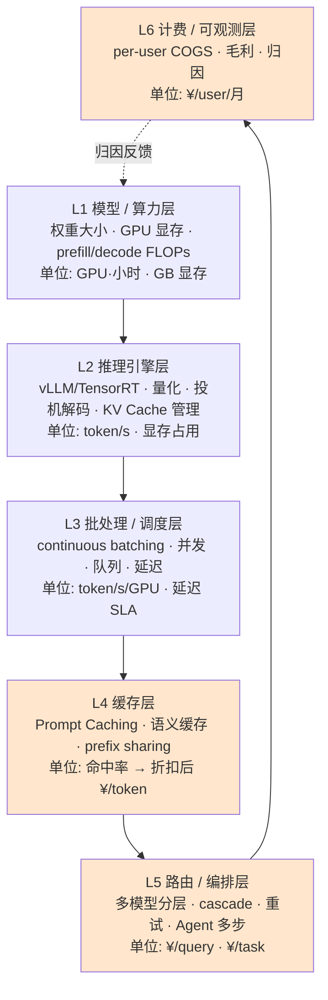

# S01 AI 产品成本结构分层剖面

> 你拿到一张暴涨的 AI 账单，老板问"这钱花在哪了、怎么砍"。你说不清——不是因为你不懂技术，而是因为**你脑子里没有一张"成本由哪些可替换的层组成"的解剖图**。本节点要解决的问题是：把一个 AI 产品的成本，从最底层的算力/显存，一路拆到最上层的 per-user COGS 与毛利，拆成**六个可独立优化、可独立归因、但彼此致命耦合**的层；并给每一层配一份"接口契约"与"PM 必问清单"。这是全专题的承重梁——[A07 成本约束反向塑造产品](/kb/专题-工程与成本/a07-成本约束反向塑造产品/) 是判断主轴（成本怎么倒逼产品），本节点是它的解剖学底座（成本到底由什么构成）。

---

## §0 为什么是"分层堆栈"这个框架，而不是"降本手段清单"

挡掉读者脑中最常见的默认错误框架。多数 PM（和 [m209 - 推理成本控制手册](/kb/工程化与落地架构/m209-推理成本控制手册/) §2.6 本身）谈成本，用的是**"降本手段清单"框架**：缓存能降 X%、路由能降 Y%、量化能降 Z%——一个并列的工具箱。这个框架对"我现在要省钱、有哪些招"够用，但它有两个致命缺陷，正是本节点要修的：

1. **它没有"层"的概念，所以无法归因。** 手段清单回答"用什么招降本"，回答不了"这笔钱本来花在哪一层"。当账单暴涨时，你需要的是一张**剖面图**——先定位"是底层显存撑爆了（并发上限被打穿），还是上层重试逻辑在烧钱（Agent 多步循环），还是计费层根本没埋点（成本不可归因）"——而不是把所有降本招挨个试一遍。

2. **它把彼此耦合的东西拆成了独立的招。** 清单框架默认"缓存"和"路由"是两个互不相干的工具，可以分别评估收益。但本节点 §7 会证明：**缓存层的命中率和路由层的分流策略是死死耦合的**——你一上路由，缓存命中率就崩，两个"各自降 X%"的招叠加起来可能净降本为负。手段清单框架结构性地看不见这种耦合。

所以本节点选**"分层堆栈"（layered cost stack）**框架：把成本想象成一个从硅片到财报的协议栈，每一层有自己的**计量单位、可替换实现、对上层暴露的接口**。这样做的三个收益——(a) **可归因**：每笔钱能定位到层；(b) **可替换**：每层的实现（哪个模型、哪种缓存、自建还是 API）可独立替换而上层接口不变；(c) **可发现耦合**：层与层之间的接口是耦合点的藏身处，把它们显式画出来才能管理。这正是 OSI 七层模型对网络做过的事——本节点对 AI 成本做同一件事。

> [!note] 一个边界：分层是认知工具，不是物理实在
> 必须先承认这个框架的局限（认识论自觉）：真实系统里这六层是**纠缠**的，不是干净分层的。一次推理请求会同时触及算力层（显存）、缓存层（KV cache 复用）、计费层（token 计数），物理上是一回事。"分层"是为了**可推理、可归因**而做的切分，不是说系统真的按这六层模块化实现。把它当 OSI 那样的"参考模型"用——指导你提问和定位，而不是当成架构强制约束。下面 §7 讲耦合点，正是在偿还"分层带来的简化"欠下的债。

---

## §1 六层成本堆栈：从硅片到财报

先给全景，再逐层拆。下图是 AI 产品成本的六层剖面，从下（物理）到上（商业）。

逐层的"它是什么 / 计量单位 / 可替换实现 / 对上层暴露的接口"如下表。这张表就是分层堆栈的"接口契约总览"：

| 层 | 它管什么 | 计量单位 | 可替换实现（决策点） | 对上层暴露的接口 |
|---|---|---|---|---|
| **L1 模型/算力** | 模型权重大小、GPU 显存占用、prefill/decode 的 FLOPs | GPU·小时、GB 显存 | 模型选型（7B/70B/MoE）、GPU 型号（H100/A100/消费级）、自建 vs 云 GPU | "这个模型在这个 GPU 上能装下、单卡能跑多大并发" |
| **L2 推理引擎** | 把权重变成 token/s 的引擎，含量化、投机解码、KV Cache 物理管理 | token/s、显存利用率 | vLLM / TensorRT-LLM / SGLang；量化精度（FP16/FP8/INT4）；是否投机解码 | "给定显存预算，单卡的吞吐曲线（throughput vs 延迟）" |
| **L3 批处理/调度** | 把并发请求拼成 batch 喂给引擎，管队列、并发上限、延迟 | token/s/GPU、p50/p99 延迟、并发数 | continuous batching、动态 batch 大小、队列优先级、延迟 SLA 档位 | "在 X 延迟 SLA 下，单卡能服务多少并发用户" |
| **L4 缓存** | 复用重复计算：system prompt、KV、语义相同的请求 | 缓存命中率 → 折扣后 ¥/token | Prompt Caching（API 侧）、prefix sharing（引擎侧）、语义缓存（应用侧） | "这类请求的有效 token 成本 = 标价 × (1 − 命中率 × 折扣)" |
| **L5 路由/编排** | 决定每个请求走哪个模型、几步、重试几次、Agent 编排 | ¥/query、¥/task（含多步与重试） | 单模型 vs cascade vs router；重试策略；Agent 步数上限；fallback 链 | "一次完整用户意图（query/task）的总 token 账单" |
| **L6 计费/可观测** | 把 token 账单按用户/功能/租户归因，算出 COGS、毛利 | ¥/user/月、毛利率、归因维度 | 埋点粒度、归因口径（按功能/用户/租户）、预算告警+熔断 | "每个用户/功能这个月花了多少、毛利是正是负" |

**这张表怎么用**：它是你审任何 AI 产品成本的"逐层质询脚手架"。从 L1 往上问到 L6，哪一层答不上来，哪一层就是这个产品成本失控的暗区。下面 §2–§6 逐层给"PM 必问清单"。

---

## §2 L1 模型/算力层 + L2 推理引擎层：成本的物理地基

这两层是成本的**物理下界**——再怎么在上层优化，也突破不了这里的物理定律。本节点**不复述** [c05 - 算力物理定律与 KV Cache](/kb/基础知识库/c05-算力物理定律与-kv-cache/) 的公式推导（KV Cache 显存随上下文线性增长、Llama-3-70B 100K tokens ≈ 32.8 GB 显存的算法）和 [c07 - 量化 Quantization 与端侧部署](/kb/基础知识库/c07-量化-quantization-与端侧部署/) 的量化物理（FP16→INT4 的精度-显存权衡），只把它们**重定位为成本堆栈的最底两层**，并接出 PM 决策接口。

L1 的核心成本变量是**显存**，不是算力。这是反直觉的第一刀：PM 直觉以为"模型贵=算得慢"，但在推理（非训练）场景，**Decode 阶段是显存带宽瓶颈而非算力瓶颈**（见 c05 的 Prefill/Decode 两阶段分析）——单卡能服务多少并发用户，主要由"权重 + 所有并发请求的 KV Cache 能不能塞进显存"决定，而不是由 FLOPs 决定。这条直接锁死了 L3 的并发上限，是 §7 第一个耦合点的物理根源。

L2 推理引擎层是"用工程手段把 L1 的物理下界往上抬"的层：量化（用精度换显存）、投机解码（c05 提到吞吐可达 2–3×〔以 c05 节点为准〕）、KV Cache 的分页管理（vLLM 的 PagedAttention）。

> [!warning] L1/L2 的 PM 必问清单
> 1. **"这个模型在我们的 GPU 上，单卡能跑多少并发？"**——这一个数决定了 per-user 边际成本的物理地板。
> 2. **"我们买的是显存还是算力？"**——MoE 模型（见 [c06 - 架构演进：Dense MoE SSM Hybrid](/kb/基础知识库/c06-架构演进-dense-moe-ssm-hybrid/)）激活参数少、算力省，但全部专家权重要常驻显存，是"用固定成本换边际成本"。小规模部署时 MoE 可能更贵——这是 [A04 推理成本三角·模型大小 延迟 质量](/kb/专题-工程与成本/a04-推理成本三角-模型大小-延迟-质量/) 展开的"显存门槛高但算力低的矛盾"。
> 3. **"量化降的是哪笔成本？"**——量化降的是 L1 显存（让单卡装下更多并发/更大模型），不直接降 API 标价；它的收益要通过 L3 的并发提升才兑现成 per-user 成本下降。

---

## §3 L3 批处理/调度层：吞吐与延迟的零和博弈

L3 是把"单请求"变成"高吞吐服务"的层，也是**成本与用户体验第一次正面冲突**的层。核心机制是 **continuous batching**（连续批处理）：推理引擎不等一个请求算完，而是把多个并发请求的 token 生成拼在一起喂给 GPU，摊薄每 token 的固定开销。batch 越大，单 token 成本越低——但**延迟越高**（你的请求要排队等凑够一批，或与别人共享算力）。

这就是 L3 的本质：**单位成本（token/s/GPU）和延迟 SLA 是一对零和变量**。把 batch 拉满，成本最低但 p99 延迟爆炸；把 batch 设为 1（来一个算一个），延迟最低但 GPU 利用率惨不忍睹、单 token 成本飙升。这是 §7 第二个致命耦合点的所在。

PM 在这一层最容易踩的坑是**把延迟当成纯体验问题，看不见它的成本标价**。一个"首 token 延迟必须 <500ms"的 SLA 承诺，等价于在 L3 强制降低 batch 上限，等价于推高每 token 成本——这个换算关系，多数 PRD 里是缺失的。

> [!warning] L3 的 PM 必问清单
> 1. **"我们的延迟 SLA 折算成成本是多少？"**——每收紧一档延迟，问工程"这让单卡并发降了多少、per-token 成本涨了多少"。
> 2. **"流式输出（streaming）救的是感知延迟还是真实成本？"**——streaming 让用户"感觉快"但不改变 L3 的总吞吐成本；它是体验止痛药，不是降本药。
> 3. **"高峰期的并发上限在哪、打穿了会怎样？"**——L3 并发上限被 L1 显存锁死（§7 耦合点 1），打穿后要么排队（延迟崩）要么拒绝（rate limit）——这正是 [E01 ChatGPT 与 Claude 的 context rate-limit 产品成本耦合剖解](/kb/专题-工程与成本/e01-chatgpt-与-claude-的-context-rate-limit-产品成本耦合剖解/) 里 rate limit 的成本根源。

---

## §4 L4 缓存层：命中率是它唯一的真实货币

L4 用"复用重复计算"降本，三种实现各管一类重复：
- **Prompt Caching**（API 侧）：复用重复的 system prompt / 长前缀。以 Anthropic 为例，缓存命中读取按基础 input 标价的 10% 计费，5 分钟 TTL 的缓存写入为基础 input 价的 1.25 倍（即约 25% 溢价），1 小时 TTL 写入为 2 倍；默认最短 TTL 为 5 分钟（来源：Anthropic Claude API 官方 Prompt caching 文档 platform.claude.com，2026-06 核实）。
- **prefix sharing**（引擎侧）：多个请求共享相同前缀的 KV Cache，省的是 L1 显存与 L2 重算——注意它与 Prompt Caching 不是一回事（一个在引擎内省显存，一个在 API 计费上打折）。
- **语义缓存**（应用侧）：把"语义相同"的请求直接返回缓存答案，省的是整次推理。

L4 的唯一真实货币是**命中率**。缓存的折扣再大，命中率为零就等于零；更糟的是**负收益**——Prompt Caching 写入有溢价，若命中率低于盈亏点（写入溢价 / 命中折扣节省），上缓存反而比不上缓存更贵。这是本专题 §7 对手清单第 7 条"Prompt Caching = 普适降本派"的边界：[m209 - 推理成本控制手册](/kb/工程化与落地架构/m209-推理成本控制手册/) 实测过长 system prompt 高频场景的巨大收益〔具体数字以 m209 为准〕，但那是**特定场景**（长前缀 + 高频 + 短间隔命中 TTL）的值，换成低命中场景直接倒亏。

> [!warning] L4 的 PM 必问清单
> 1. **"这类请求的真实命中率是多少？"**——不是"理论上能缓存"，是线上实测命中率。低于盈亏点就别上。
> 2. **"我们说的'缓存'是哪种？"**——Prompt Caching / prefix sharing / 语义缓存省的是不同层的钱，混为一谈会重复计算收益。
> 3. **"语义缓存的'语义相同'判定错了会怎样？"**——返回了"看起来对其实过时/错误"的缓存答案，是质量事故，不只是成本问题。

---

## §5 L5 路由/编排层：per-query 账单的真正主战场

L5 是从"per-token"跃迁到"per-query / per-task"的层，也是**总账单波动最大**的层。它管四件烧钱的事：(1) **路由/cascade**——便宜模型兜底、复杂任务才升级到强模型（见 [A05 模型路由与 Mixture-of-models](/kb/专题-工程与成本/a05-模型路由与-mixture-of-models/) 与 [多模型分层](/kb/基础知识库/多模型分层/)）；(2) **重试**——失败/超时/格式不符就重跑，每次重试是一次完整的 token 账单；(3) **Agent 多步编排**——一个 Agent 任务每步过一次推理，per-task 成本是单次对话的几倍到几十倍（这是 [E03 一个 RAG Agent 产品的 unit economics 拆解](/kb/专题-工程与成本/e03-一个-rag-agent-产品的-unit-economics-拆解/) 算的那笔账）；(4) **fallback 链**——主模型挂了切备用模型，可靠性与成本的权衡。

L5 是 per-token 直觉最容易**严重低估**总成本的地方。PM 看着 API 价目表上的 per-token 单价，以为乘一下上下文长度就是成本——但 L5 把"一次用户意图"展开成了"N 步 × M 次重试 × 不同模型混用"，真实 per-query 成本可能是天真估算的 5–50 倍。这正是 [A02 成本对象层级辨析·per-token per-query per-task per-user per-seat](/kb/专题-工程与成本/a02-成本对象层级辨析-per-token-per-query-per-task-per-user-per-seat/) 反复敲打的"拿 per-token 谈盈利是普遍错位"。

> [!warning] L5 的 PM 必问清单
> 1. **"一次完整用户意图，平均过几次推理？"**——把单步 per-token 乘上"平均步数 × 平均重试次数"，才是 per-query 的量级。
> 2. **"路由的兜底模型，在质量敏感场景兜得住吗？"**——这是 §6 对手框架（Baumol 成本病）的落点：医疗/法律等场景的"刚性成本区"路由砍不动。
> 3. **"重试是降本还是烧钱？"**——重试提高成功率（省了人工兜底），但失控的重试循环能分钟级烧光预算——这是 §7 耦合点 3 与 L6 熔断缺失的合谋。

---

## §6 L6 计费/可观测层：没有它，前五层的优化都是盲飞

L6 是把底下五层产生的 token 账单**按用户/功能/租户归因**、算出 COGS 与毛利、并设预算告警+熔断的层。它在多数早期 AI 产品里**根本不存在**——这是本节点要补的最大盲区，也是 §7 第三个致命耦合点（计费层缺失致成本不可归因）。

L6 缺失的症状很典型：账单总额看得见，但"哪个功能在烧钱、哪类用户是亏的、新上的 Agent 功能毛利是正是负"全是黑箱。没有 L6，前五层所有优化都是**盲飞**——你不知道该优化哪里，降本后也不知道降了多少。

> [!note] 跨域呼应：成本归因不是中立的技术问题，是权力分配（Strathern 审计社会学）
> 这里调度一个 Rick 未读的对手框架——人类学家 Marilyn Strathern 的"Audit Cultures"（审计文化，2000）。她的核心洞见：**度量与归因从来不是中立的描述，而是在重新分配责任与权力。** 把它移植到 L6：你选择"按功能归因"还是"按用户归因"还是"按租户归因"成本，不是一个纯技术口径选择——它在决定**哪个团队为账单负责、哪个功能会因为"成本归到它头上"而被砍、哪个大客户因为"算出来是亏的"而被涨价或劝退**。一个把 RAG 检索成本归到"基础设施"而非"搜索功能"的归因口径，会让搜索功能看起来很赚钱、让平台团队背锅。**这改变了一个具体判断**：L6 的设计不能只交给工程按"技术上最容易埋点的维度"来定，PM 必须介入归因口径的选择，因为它直接决定了组织内部的成本问责结构。FinOps 厂商卖的"成本可观测"默认归因是中立的——Strathern 提醒你，没有中立的归因。

> [!warning] L6 的 PM 必问清单
> 1. **"我能不能按功能/用户/租户拆出成本？"**——拆不出 = L6 缺失 = 前五层优化盲飞。
> 2. **"成本告警有没有自动熔断/降级？"**——只有告警没有熔断等于没有。AI 成本是分钟级失控的（一个 prompt 注入循环就能烧光预算），人看仪表盘根本来不及——这是控制论的负反馈回路逻辑，详见 [S03 FinOps for AI·成本可观测与归因全景](/kb/专题-工程与成本/s03-finops-for-ai-成本可观测与归因全景/)。
> 3. **"归因口径是谁定的、它让谁背锅？"**——Strathern 之问：别让工程默认口径替你做了组织问责的决策。

---

## §7 判断主轴：三个致命的层间耦合点

这是本节点区别于"技术博客"的命门，也是分层框架相对手段清单框架的最大增值。分层让我们能**看见层与层接口处的耦合**——这些耦合点是 90% 的人各自优化单层时栽跟头的地方。每点带"症状 → 为什么会错 → 正确做法 → 真实反例"四件套。

### 耦合点 1：缓存层（L4）与路由层（L5）的命中率耦合

- **症状**：团队先上了 Prompt Caching，实测命中率高、降本明显；接着为了进一步降本上了模型路由（便宜模型兜底）。结果路由上线后，缓存账单不降反升，两个"各自降本"的招叠加后净降本接近零甚至为负。
- **为什么会错**：手段清单框架把缓存和路由当成两个独立工具，分别评估收益再相加。但**Prompt Caching 的命中依赖"同一个模型 + 同一个前缀"**——路由把请求分流到不同模型后，原本会命中同一缓存的请求被打散到多个模型的缓存桶里，每个桶的命中率都被稀释，甚至频繁触发缓存写入溢价。两个局部最优叠加成全局更差，这是典型的耦合盲区。
- **正确做法**：把缓存和路由**联合设计**而非独立评估。要么按"前缀亲和"路由（相同 system prompt 的请求尽量路由到同一模型以保命中），要么承认"上了路由就要重估缓存命中率"，把路由的降本收益**减去**缓存命中率下降的损失，算净值再决策。
- **真实反例**：一个客服 bot 用统一长 system prompt（产品知识库），Prompt Caching 命中率很高。后来上路由把简单问候分流到便宜小模型——结果简单问候本来缓存命中率最高（最重复），分流走之后，留在强模型上的反而是低重复的复杂问题，强模型缓存命中率暴跌，总成本几乎没降。**正确的分流维度本应是"按缓存命中率反向分流"**（低命中的才值得路由到便宜模型），而不是按表面复杂度。

### 耦合点 2：批处理层（L3）与延迟 SLA 的耦合

- **症状**：为了降本，工程把 continuous batching 的 batch 上限调大，单 token 成本确实降了 30%〔示意量级，实际随负载漂移〕；但 p99 延迟从 800ms 飙到 3s，高价值用户（重度付费）开始流失，流失带来的 LTV 损失远超降的那点成本。
- **为什么会错**：把 L3 当成"纯成本旋钮"来拧，忘了它的另一头连着延迟、延迟连着留存、留存连着 LTV。**batch 大小是成本与延迟的零和变量**，单看成本侧调优会在体验侧爆雷，而体验侧的损失（流失、LTV）发生在 L6 的财报层，与 L3 的优化动作之间隔了好几层，因果链长到没人把它们联系起来。
- **正确做法**：延迟不能用单一全局 SLA，要**按用户分层设差异化 batch 策略**——付费/实时交互用户走低延迟小 batch（贵但留得住），异步/批量任务走大 batch（慢但便宜）。即 L3 的 batch 策略要被 L6 的"这个用户值多少 LTV"反向驱动。
- **真实反例**：一个 AI 写作产品对所有请求用统一大 batch 降本，导致付费用户的实时续写也要等 2–3s。付费用户对延迟极敏感（打断创作心流），退订率上升。把同样的延迟给免费批量导出用户则毫无问题——**延迟成本的承受力因用户价值而异，统一 SLA 是把成本省在了最不该省的地方**。

### 耦合点 3：计费层（L6）缺失导致成本不可归因，前五层全盘失控

- **症状**：账单月增 3 倍，但没人能说清是哪个功能、哪类用户、哪次发版导致的。团队只能"盲砍"——把所有降本招（量化/路由/缓存）都上一遍，结果砍错了地方（砍了占比很小的层），真正的烧钱大户（某个新上的 Agent 功能的失控重试循环）毫发无伤。
- **为什么会错**：把 L6 当成"以后再补的运维琐事"，优先做了 L1–L5 的"硬核技术优化"。但**没有归因的优化是盲飞**——你不知道成本的帕累托分布（哪 20% 的功能吃了 80% 的成本），就只能均匀用力，而成本几乎从不均匀分布。更深一层：L6 缺失时，L5 的失控（重试循环、Agent 步数爆炸）**没有任何反馈回路能发现并刹车**，成本是分钟级失控的。
- **正确做法**：L6 是**第一个该搭、而非最后一个该搭**的层——哪怕粗粒度。在写第一行 L1 优化代码前，先埋"按功能/用户的 token 计数 + 预算熔断"。归因优先于优化；熔断优先于告警。
- **真实反例**：本专题 §7 对手清单第 3 条"先上线再优化成本"派的精益创业直觉——"MVP 阶段别过早优化成本"——对 L1–L5 的**精细优化**是对的，但对 L6 的**基础归因+熔断**是致命错的。一个没有成本熔断的 Agent 产品，遭遇一次 prompt 注入触发的无限工具调用循环，能在数十分钟内烧掉数月预算。这不是"过早优化"，这是"没装保险丝"。接受精益的边界：**可以晚做精细优化，不能晚做归因与熔断。**

---

## §8 产品 PM 视角补盲：用户对"免费"的心理模型，与成本结构的正面冲突

前七节是"工程 PM"视角（成本由什么层构成、怎么耦合）。这一节显式跳出来，补三个**只有产品/商业 PM 才看得见、而工程视角结构性看不见**的"看走眼"点——因为成本堆栈的最上层（L6 毛利）直接撞上用户的定价心理。

**看走眼点 1：用户对"免费"的心理模型是"零边际成本"，但 AI 的边际成本是线性增长的。** SaaS 时代训练出的用户（和 PM）有一个根深蒂固的心理模型：免费额度 = 几乎不花我钱的获客手段（多一个免费用户的边际成本≈0）。这在 AI 上**系统性失效**——每个免费用户的每次调用都是真金白银的 token 账单（变动成本随用量线性增长，见 [A01 成本概念史与口径辨析](/kb/专题-工程与成本/a01-成本概念史与口径辨析/)）。这导致 PM 在定价会上**用 SaaS 直觉拍免费额度，三个月后被账单打脸**（正是本专题 §0 那堵墙）。看走眼的本质：把 L6 的边际成本当成 0，而它在 AI 里是正的、线性的、且被重度用户长尾拉爆。

**看走眼点 2：定价心理上，用户痛恨"按用量计费"的不确定性，但 AI 成本天然是按用量的。** 行为经济学的"flat-rate bias"（用户偏好固定月费、厌恶计量计费的不确定焦虑，哪怕计量更便宜）——用户宁愿多付也要"不用算、不会超"的安心。但 AI 的成本结构（L5 per-query 账单波动巨大）天然适合 usage-based。这是一个**定价心理与成本结构的正面冲突**：PM 想用 flat-rate 讨好用户，但 flat-rate 把成本不确定性全揽到自己身上（重度用户把你的定价打穿）；想用 usage-based 对齐成本，又触发用户的计量焦虑。多数产品的解法（订阅分层 + 软性额度 + 超额降级而非硬切断）本质是这个冲突的妥协产物——这正是 [A07 成本约束反向塑造产品](/kb/专题-工程与成本/a07-成本约束反向塑造产品/) 的判断主轴在定价心理上的具体落地。

**看走眼点 3："免费额度=获客成本"，它该进 CAC 不该被无视。** 工程视角把免费用户的 token 成本算进基础设施开销；商业视角应把它算进 **CAC（获客成本）**——免费额度是你为转化付费用户而预付的获客投资。一旦这么记账，问题就从"怎么降这部分服务器成本"变成"这笔获客投资的转化率撑得起吗"。看走眼点：不把免费成本接到 CAC/LTV 的 unit economics 里，就会在"降免费用户成本"（治标）和"提高免费转付费转化率/收紧额度"（治本）之间选错——详见 [R03 Unit Economics 模型·CAC COGS LTV 与盈亏平衡](/kb/专题-工程与成本/r03-unit-economics-模型-cac-cogs-ltv-与盈亏平衡/)。

---

## §9 对手框架回应：Baumol 成本病——成本堆栈有一块砍不动的硬骨头

调度一个 Rick 较少使用的对手框架来逼问本节点的乐观盲点：经济学家 William Baumol 的"成本病"（cost disease，1960s）——**生产率难以提升的服务部门（如现场演奏一首四重奏，三百年前和今天需要的人力时间一样），其成本会相对于高生产率部门持续上升。**

**接受它对的部分**：本节点 §2–§5 的分层优化逻辑，隐含一个乐观假设——"每一层都有降本空间，逐层优化总能把 per-user 成本压下来"。Baumol 之问戳破它：**成本堆栈里存在一块"成本病"区域，技术进步砍不动。** 具体落在 L5 路由层——质量敏感场景（医疗诊断、法律意见、金融合规）**不能用便宜模型兜底**，必须用最强模型、甚至多次采样交叉验证。这部分成本不随"token 又降价了"而下降，反而因为"必须用最贵的"而成为**成本刚性区**，把路由的降本边界死死锁住。你以为路由能砍 60%，但若你的业务有 40% 是质量敏感请求，这 40% 一分钱砍不动，整体降本上限被 Baumol 锁在 60% 以下。

**标注本节点坚持的边界与赌注**：接受 Baumol 区的存在，但坚持**它的范围比悲观派想的小、且边界在移动**——随着模型能力上升，"必须用最强模型"的刚性区在缓慢缩小（去年要 GPT-4 的任务，今年可能中端模型够用）。所以本节点的赌注是：**承认成本病区存在（别假设全堆栈都能降），但持续重测它的边界（别把去年的刚性区当成永久的）。** 对 PM 的操作含义：在 unit economics 里把"成本刚性区占比"作为一个显式变量，定期重估——这是 [A04 推理成本三角·模型大小 延迟 质量](/kb/专题-工程与成本/a04-推理成本三角-模型大小-延迟-质量/) 与 E03 的接力点。

> [!warning] 本节点的 failure scenario
> 分层堆栈框架在两种场景失效，必须显式承认：(1) **成本占比极低的场景**——低频高价 B2B 工具，推理成本远小于客单价，此时纠结六层堆栈是过度工程，产品决策应由别的约束主导（呼应 A07 的失效边界）；(2) **极早期 MVP**——还没有用户、没有真实负载分布，逐层优化没有数据支撑，此时只需搭 L6 的熔断（防灾难），其余五层等有真实负载再说。把这张六层图当成"成熟产品的成本治理脚手架"，不是"第一天就要全搭"的强制清单。

---

## §10 PM 决策启示：面试 / 选型 / 复现三类落地

- **面试桌**：被问"你怎么分析一个 AI 产品的成本"，别答"用缓存路由量化降本"（手段清单，显得只懂招式）。答"我会先画一张六层成本剖面——从 L1 显存到 L6 per-user 毛利，逐层定位钱花在哪、哪两层在耦合"，然后秒一个耦合点（如"缓存和路由的命中率耦合，叠加可能净降本为负"）。这一下把你和"背了几个降本名词"的候选人区分开。把 §1 那张六层接口表当成可口述的脚手架。
- **选型会**：拿到工程的降本方案，用 §2–§6 的"PM 必问清单"逐层质询——"这条降的是哪一层的钱（L1 显存还是 L5 per-query）？降多少？代价是哪一层的什么损失（L3 延迟还是 L4 质量）？"。尤其用 §7 三个耦合点检查"这两个降本招会不会互相打架"。别让单层局部最优叠加成全局更差。
- **复现台**：六层堆栈直接映射到复现模块——L1–L5 的 token 账单用 [R01 最小可运行·Token 成本计算器](/kb/专题-工程与成本/r01-最小可运行-token-成本计算器/) 算（含 input/output/缓存/重试），L4/L5 的路由+缓存降本用 [R02 中型·模型路由 + 语义缓存 降本实验](/kb/专题-工程与成本/r02-中型-模型路由-+-语义缓存-降本实验/) 实测（顺便复现耦合点 1 的命中率稀释），L6 的 per-user COGS+毛利用 [R03 Unit Economics 模型·CAC COGS LTV 与盈亏平衡](/kb/专题-工程与成本/r03-unit-economics-模型-cac-cogs-ltv-与盈亏平衡/) 建表。亲手把六层算一遍，"贵不贵"就从感觉变成数字。

---

## §11 与已有节点的关系：升级对照（不复述事实基础）

本节点对四个既有单维节点做**抽象层升高 + 补缺**，核心动作是"把散落在各处的降本知识，从'用哪个手段'重定位为'成本堆栈的哪一层'"。

- **对 [m209 - 推理成本控制手册](/kb/工程化与落地架构/m209-推理成本控制手册/)（抽象层升高 + 补缺）**：m209 §2.6 是一份优秀的**降本手段清单**（缓存/路由/语义缓存/对话压缩 + 实测收益数字）。本节点不复述这些手段和数字，而是把它们**重定位为成本堆栈的不同层**——Prompt Caching 是 L4、模型路由是 L5、KV Cache 管理是 L2。升级在于：m209 回答"用什么招降本"，本节点回答"这笔钱本来在哪一层、招与招之间怎么耦合"。**补缺**：m209 把降本手段并列罗列，看不见 §7 那三个层间耦合点（尤其缓存×路由的命中率耦合），这是本节点最大的增量。
- **对 [c05 - 算力物理定律与 KV Cache](/kb/基础知识库/c05-算力物理定律与-kv-cache/)（抽象化）**：c05 给 L1/L2 的物理公式（显存随上下文线性增长、Prefill/Decode 两阶段）。本节点不复述公式，只把"KV Cache 显存"接成"L1 锁死 L3 并发上限"的成本因果链，把物理定律翻译成 per-user 边际成本的地板。
- **对 [c07 - 量化 Quantization 与端侧部署](/kb/基础知识库/c07-量化-quantization-与端侧部署/)（重定位）**：c07 讲量化的物理本质（精度-显存权衡）。本节点把量化从"一个技术手段"重定位为"L2 引擎层用精度换 L1 显存、再通过 L3 并发提升兑现成 per-user 降本"的跨层因果链——强调量化不直接降 API 标价，收益要逐层传导。
- **对 [m202 - 工程选型决策矩阵](/kb/工程化与落地架构/m202-工程选型决策矩阵/)（深化）**：m202 的"成本预算"维度是定性的隐性成本提示。本节点给它一张可逐层质询的剖面图，把"成本预算"从一个维度深化成六层接口契约 + 三个耦合点的具体质询清单。
- **对 [A07 成本约束反向塑造产品](/kb/专题-工程与成本/a07-成本约束反向塑造产品/)（互为底座）**：A07 是判断主轴（成本怎么倒逼产品决策），本节点是它的解剖学底座（成本由什么层构成）。A07 的每一个"产品决策其实是成本影子"的论断，都能在本节点的某一层找到物理/工程根源（rate limit 在 L1→L3、context 上限在 L1 显存、免费额度在 L6 毛利）。

---

## §12 关联节点

**核心（必读）**
- [A07 成本约束反向塑造产品](/kb/专题-工程与成本/a07-成本约束反向塑造产品/)——判断主轴，本节点是其解剖学底座
- [A02 成本对象层级辨析·per-token per-query per-task per-user per-seat](/kb/专题-工程与成本/a02-成本对象层级辨析-per-token-per-query-per-task-per-user-per-seat/)——L5/L6 的计量口径基础（per-token≠per-user）
- [m209 - 推理成本控制手册](/kb/工程化与落地架构/m209-推理成本控制手册/)——本节点的主要升级对照对象（手段清单→分层堆栈）
- [c05 - 算力物理定律与 KV Cache](/kb/基础知识库/c05-算力物理定律与-kv-cache/)——L1/L2 物理地基
- [S02 降本手段流派对照矩阵](/kb/专题-工程与成本/s02-降本手段流派对照矩阵/)——把各层降本手段排进"幅度×代价×复杂度×场景"矩阵
- [S03 FinOps for AI·成本可观测与归因全景](/kb/专题-工程与成本/s03-finops-for-ai-成本可观测与归因全景/)——L6 计费/可观测层的完整展开
- [E03 一个 RAG Agent 产品的 unit economics 拆解](/kb/专题-工程与成本/e03-一个-rag-agent-产品的-unit-economics-拆解/)——本节点六层框架在真实产品上的端到端落地

**延伸（可选）**
- [c07 - 量化 Quantization 与端侧部署](/kb/基础知识库/c07-量化-quantization-与端侧部署/)、[c06 - 架构演进：Dense MoE SSM Hybrid](/kb/基础知识库/c06-架构演进-dense-moe-ssm-hybrid/)、[m202 - 工程选型决策矩阵](/kb/工程化与落地架构/m202-工程选型决策矩阵/)
- [A04 推理成本三角·模型大小 延迟 质量](/kb/专题-工程与成本/a04-推理成本三角-模型大小-延迟-质量/)、[A05 模型路由与 Mixture-of-models](/kb/专题-工程与成本/a05-模型路由与-mixture-of-models/)、[A03 Token Economics 精算](/kb/专题-工程与成本/a03-token-economics-精算/)
- [E01 ChatGPT 与 Claude 的 context rate-limit 产品成本耦合剖解](/kb/专题-工程与成本/e01-chatgpt-与-claude-的-context-rate-limit-产品成本耦合剖解/)、[E02 Apple Intelligence 与端侧推理成本剖解](/kb/专题-工程与成本/e02-apple-intelligence-与端侧推理成本剖解/)
- [R01 最小可运行·Token 成本计算器](/kb/专题-工程与成本/r01-最小可运行-token-成本计算器/)、[R02 中型·模型路由 + 语义缓存 降本实验](/kb/专题-工程与成本/r02-中型-模型路由-+-语义缓存-降本实验/)、[R03 Unit Economics 模型·CAC COGS LTV 与盈亏平衡](/kb/专题-工程与成本/r03-unit-economics-模型-cac-cogs-ltv-与盈亏平衡/)
- [KV Cache](/kb/基础知识库/kv-cache/)、[量化](/kb/基础知识库/量化/)、[MoE](/kb/基础知识库/moe/)、[Prompt Caching](/kb/基础知识库/prompt-caching/)、[多模型分层](/kb/基础知识库/多模型分层/)、[Test-Time Compute](/kb/基础知识库/test-time-compute/)、[RAG](/kb/基础知识库/rag/)
- [S01 Agent 六层架构剖面](/kb/专题-安全对齐与失败/s01-agent-六层架构剖面/)（0411 跨专题：能力分层 ↔ 本节点成本分层，可对照）
- [_成本工程系统化专题·总览](/kb/专题-工程与成本/_成本工程系统化专题-总览/)、[AI PM 知识图谱·总索引](/kb/ai-pm-知识图谱/ai-pm-知识图谱-总索引/)

---

## §13 修订日志

- **R0（2026-06-07，首稿）**：按宪章 §4 十一段骨架 + 本节点 brief 写成旗舰节点。确立"分层堆栈 vs 降本手段清单"的框架级辨析（§0）；六层成本堆栈（L1 模型/算力→L2 推理引擎→L3 批处理/调度→L4 缓存→L5 路由/编排→L6 计费/可观测）+ 每层接口契约表 + PM 必问清单（§1–§6）；判断主轴三个致命层间耦合点四件套（缓存×路由命中率耦合、批处理×延迟SLA耦合、计费层缺失致不可归因，§7）；产品 PM 补盲三点（用户"免费"心理模型=零边际成本的失效、flat-rate bias 与按用量计费的冲突、免费额度该进 CAC，§8）；对手框架 Baumol 成本病"接受+边界"（成本刚性区锁死路由降本上限，§9）；跨域呼应 Strathern 审计社会学（成本归因即权力分配，§6 callout）；升级对照 m209/c05/c07/m202/A07（§11）。**R0.1（2026-06-07，事实接地）**：WebSearch 核实 Anthropic Prompt Caching 定价——缓存读取 = 基础 input 价 10%、5min TTL 写入 = 1.25×（约 25% 溢价）、1h TTL 写入 = 2×、默认最短 TTL = 5min，与首稿一致，去掉〔待核实〕标记并补来源（platform.claude.com 官方文档）。**剩余待核实项（1 项）**：投机解码 2–3× 吞吐——引自 [c05 - 算力物理定律与 KV Cache](/kb/基础知识库/c05-算力物理定律与-kv-cache/) 内部节点，标"以 c05 为准"，未独立外部核实。**已接地策略**：m209 的具体降本数字（$1,620/百万请求、37%、70–80%）本节点未硬编，全部指向 m209 节点；c05 的 32.8GB 等数字标"见 c05"。**待后续**：节点入库后复检专题内双链 resolve、与 A07/S02/S03/E03 接口对齐。
- 2026-06-11 P3.1 接地复核：本节点承重显存数字复检——§6.5 L1/L2 引用的 c05 Llama-3-70B 100K KV cache = 32.8GB，经独立 WebSearch 交叉验证为 FP16 真值（公式 2×层×头×维×seqlen×2B + 多源一致），原文标"见 c05"未走样，承重无误；Prompt Caching 0.1×/1.25×/2× 经 claude-api 文档复核一致；投机解码 2–3× 仍维持"以 c05 为准"。本节点无 token 单价类硬编 volatile 数字（$1,620 等指向 m209、未硬编；S03 mermaid 的 $300k/$120k 等为归因示意非真实定价），无需改动正文。
