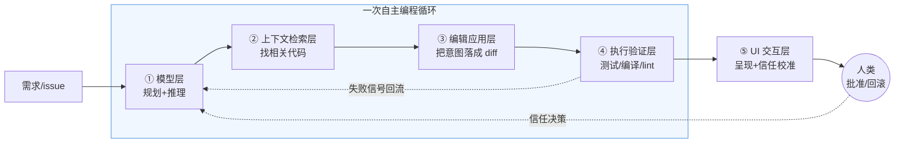

把一个 Coding Agent 拆成可替换的五层堆栈——模型层 / 上下文检索层 / 编辑应用层 / 执行验证层 / UI 交互层——并回答一个选型会上最致命的问题：**当 Cursor、Claude Code、TRAE、Copilot 在 demo 里看起来都"能跑通"时，你究竟在比什么?** 本节点的视角是"分层解剖 + 层间耦合诊断":真正决定一个 Coding Agent 好不好用、能不能进生产的，不是任何单层的强弱，而是层与层之间那几个**致命耦合点**——它们恰恰是 demo 演示不出、feature list 列不到、产品 PM 最容易看走眼的地方。

> [!warning] 这不是一篇"工具横评"
> 横评比的是功能清单和价格(那是 [S02 编程工具流派架构对照矩阵](/kb/专题-工程与成本/s02-编程工具流派架构对照矩阵/) 的活)。本节点比的是**架构剖面**:同样号称"agentic coding",拆开看,五层的接口契约和层间耦合方式天差地别。读完你应该能在选型会上说出"我不选 X 是因为它的执行验证层缺位,导致幻觉代码会静默进 PR",而不是"X 的补全没 Y 快"。

---

## §0 为什么是"五层"而不是"前端/后端"或"模型/Prompt"两分

动笔前先挡掉两个错误框架。

**错误框架一:"Coding Agent = 一个更强的模型 + 一段 system prompt"。** 这是大多数人(包括相当一部分 AI PM)脑中的默认图景,也是 2023 年 GPT-4 刚出时的真实情况。但它在 2024 年后彻底失效了:[c10 - Agent 技术栈与工具调用](/kb/基础知识库/c10-agent-技术栈与工具调用/) 那一章给的是 G3 截面的快照(模型 + 工具调用),而本节点要刻画的是 2025–2026 年 Coding Agent 真正的工程现实——**模型只是五层中的一层,而且往往不是决定体验的那一层**。一个直接的反证:同一个 Claude Opus 4.8 模型,在 Cursor、Claude Code、Aider 里跑出的体感和成功率差异巨大,差的全在另外四层。

**错误框架二:"前端/后端"或 MVC 这类传统软件分层。** Coding Agent 的分层不是按"展示/逻辑/数据"切的,而是按**一次自主编程循环的数据流**切的:理解需求(模型)→ 找到相关代码(检索)→ 改对地方(编辑)→ 确认改对了(验证)→ 让人看懂并决定信不信(交互)。这条数据流是个**带反馈的闭环**,验证层的失败信号要回流给模型层重新规划——这正是它区别于"补全式"工具(Tab 补全只有模型层 + 编辑层,没有闭环)的本质。

为什么偏偏是这五层?因为这五层各自对应一类**可独立替换的工程决策**,且每一层都有清晰的接口契约和一份独立的 PM 问题清单。它和 [S01 Agent 六层架构剖面](/kb/专题-安全对齐与失败/s01-agent-六层架构剖面/)(0411 专题)是"专用 vs 通用"的关系:0411 的六层(模型/记忆/规划/工具/执行/反思)刻画的是**通用 Agent**;Coding Agent 是它的一个**垂直特化剖面**——"工具层"在编程场景里具体化成了"检索层 + 编辑应用层",而"执行层"具体化成了"执行验证层(跑测试/编译/lint)"。本节点是 0411 S01 在 coding 垂直域的**深化与具象**,不复述其抽象骨架。



---

## §1 模型层(Model Layer):被高估的"地基"

**这一层做什么。** 接收自然语言需求 + 检索来的上下文,产出"下一步动作"(调用哪个工具、生成什么代码、是否结束)。它是规划与推理的中枢,但**不是体验的全部**。

**接口契约。** 输入:system prompt + 上下文窗口(代码片段、工具结果、对话历史);输出:结构化的工具调用或代码 patch。关键参数:上下文窗口大小(1M token 已于 2026-03-13 对 Claude Opus 4.6 / Sonnet 4.6 正式 GA,无 beta header、无长上下文附加费——来源:Anthropic 官方公告,2026-03-13)、是否支持 [Function Calling](/kb/基础知识库/function-calling/)、温度(编辑场景通常趋近 0 以求确定性)。

**这一层为什么被高估。** 因为它是榜单(SWE-bench)唯一直接测的东西,也是发布会唯一吹的东西。但规划中的 SWE-bench 评测专题已经拆穿:SWE-bench Verified 被 OpenAI 于 2026-02-23 弃用,审计其困难子集(约 138 题)发现 59.4% 的测试用例有实质问题(来源:OpenAI blog "Why we no longer evaluate SWE-bench Verified",2026-02-23)。换句话说,**模型层的榜单分数早已和真实编程能力脱钩**,而 PM 还在拿它当选型依据。

**PM 问题清单(模型层):**
- 这个工具锁死单一模型,还是允许换模型?(Aider 支持 100+ LLM;Cursor/Copilot 多模型;TRAE 国内版以豆包为主、可切 DeepSeek——来源:接地简报)
- 模型版本变更时,我的 prompt/规则文件会不会失效?(这是 [Polanyi 默会知识与提示工程的认识论张力](/kb/基础知识库/polanyi-默会知识与提示工程的认识论张力/) 的活体案例:你调出来的提示词是默会知识,换模型即贬值)
- 长上下文是不是真有用?——见 §6 的"context rot"诊断。

---

## §2 上下文检索层(Context Retrieval Layer):决定成败的隐形战场

**这一层做什么。** 在一个动辄几十万行的代码库里,决定"把哪些代码喂给模型"。这是 Coding Agent 与玩具 demo 的真正分水岭:模型再强,喂错上下文也只会自信地改错地方。

**三条技术路线(接口契约各异):**

| 路线 | 机制 | 接口产出 | 代表 |
|---|---|---|---|
| Repo Map / AST | tree-sitter 解析 + PageRank 排序,只喂函数签名地图 | 摘要级符号图 | Aider(默认 1,000 token 预算,来源:Aider 官方文档) |
| 向量检索 / [RAG](/kb/基础知识库/rag/) | [Embedding](/kb/基础知识库/embedding/) 相似度召回片段 | top-k 代码片段 | Cursor codebase index |
| Agent 主动检索 | 模型自己 grep / 读文件 / 跑 LSP | 多轮工具调用结果 | Claude Code、Aider |

**反直觉的实证。** arXiv 2603.20432(2026-03)发现:coding agent 把长上下文问题**转化为文件系统导航问题**(用 grep/terminal 主动检索),在 5 个 benchmark 上平均超 SOTA 17.3%;而**给 agent 额外配 RAG 检索工具并不稳定提升性能,有时反而降低**——agent 会偷懒少用更有效的 grep。ContextBench(arXiv 2602.05892)的另一组数字则显示 embedding 检索(41.7%)> agent 检索(36.1%)> AST 检索(33.3%)。两组结论在不同任务设置下都成立,说明**"哪种检索更好"没有普适答案**——这是 §7 要回应的核心争议。

**PM 问题清单(检索层):**
- 索引是本地构建还是上传云端?(直接关乎 [E03 字节 TRAE 与 Windsurf 剖解](/kb/专题-工程与成本/e03-字节-trae-与-windsurf-剖解/) 里的遥测争议——TRAE 被 Unit 221B 指控关闭遥测后仍回传数据,来源:The Register 2025-07-28)
- 大库(>万文件)时索引会不会爆?跨文件重构能不能拿到调用关系?
- 检索结果对用户可见吗?(不可见 = §5 的信任校准灾难)

---

## §3 编辑应用层(Edit Application Layer):最被忽视、最该单列的一层

**这一层做什么。** 把模型"想改什么"翻译成"文件里精确改哪几个字符"。这是产品 PM 最容易完全忽略的一层——因为它在 UI 上不可见,但它是**幻觉之外第二大的失败来源**。

**编辑格式决定鲁棒性(接口契约):**

| 格式 | 准确率〔Morph 自评,待核实〕 | 致命问题 |
|---|---|---|
| Unified diff(行号 patch) | 80–85% | 模型对行号极敏感,偏一行即失效 |
| 整文件重写 | 60–75% | token 爆炸 + "中段遗忘"导致内容静默消失 |
| Search/Replace block(精确字符串) | 84–96% | 字符串变化即失配 |
| 语义 / Fast Apply 专用模型 | ~98% | 需专门模型基础设施 |

数据来源:Morph Edit Formats 指南、DEV Community 基准测试(均为厂商/社区自评,无第三方独立复现,标〔待核实〕)。

**行业收敛点。** `str_replace`(精确字符串 search/replace)已成为 OpenHands、SWE-agent、Codex CLI 的共同选择——比行号 diff 鲁棒,比整文件省 token。而 Cursor / Morph 走"Fast Apply 专用模型"路线:Cursor 的 Speculative Edits 达 ~1,000 tok/s(来源:Fireworks 工程博文),Morph 的 7B 专用模型号称 10,500 tok/s、98% 准确率(来源:Morph 产品页,自评)。

**PM 问题清单(编辑层):**
- 大段重构(跨函数、多作用域)失败率多高?这是 demo 永远不演的。
- 编辑是否原子?半完成的编辑会不会把文件改坏?
- "快"是不是真需求?——批量异步任务里,Morph 的"100× 速度优势"可能毫无意义(见 §7 争议)。

---

## §4 执行验证层(Execution Verification Layer):缺它=幻觉代码直通生产

**这一层做什么。** 编辑落盘后,真的去**跑**:编译、跑测试、跑 lint,把红/绿信号回流给模型层。这是把"看起来对的代码"和"真的对的代码"区分开的唯一机制。

**接口契约:** 沙箱/容器环境 + 测试运行器 + 失败信号解析 + 回流给模型重规划。Aider 自动跑 lint/test 并在失败时自动修复;Claude Code 已接入原生 LSP——会通过 `clientInfo` 向语言服务器标识自身,并修复了"编辑后陈旧诊断导致重复读文件"的问题,实现每次编辑后的类型感知诊断(来源:Claude Code changelog / LSP 诊断修复说明,口径 2026-06)。

**缺失这一层的代价,有硬数据。** 规划中的 SWE-bench 评测专题引的 SWE-MERA 分析:约 31% 的"通过"是因为测试覆盖不充分——**测试根本没检测到错误解法**。这正是执行验证层的失效模式:有验证 ≠ 有效验证。METR 的 RCT(arXiv 2507.09089,n=16,2025)更狠:允许用 AI 工具时,资深开发者完成任务时间反而**增加 19%**,而他们自己预测会快 24%——其中一部分成本就是验证 AI 生成代码的元认知负担。

**PM 问题清单(验证层):**
- 有没有自动跑测试?失败信号是否真的回流给模型?(很多工具"生成完就交卷",验证留给人)
- 验证在沙箱里还是直接在本地跑?(直接跑意味着 AI 能执行任意命令)
- 测试本身可靠吗?——绿灯不等于正确(SWE-MERA 的 31%)。

---

## §5 UI 交互层(UI Interaction Layer):产品 PM 的主场,也是信任校准的成败点

**这一层做什么。** 把前四层的过程呈现给人,并管理"人何时介入、何时放手"——这是**信任校准**(trust calibration)问题,不是美工问题。

**自主光谱(接口契约就是权限模式):**

```
手动审批每步 → acceptEdits → auto mode → bypassPermissions / YOLO
   └─ 最大监督                                      最大自主 ─┘
```

Claude Code 的权限模式系列(`default` / `acceptEdits` / `plan` / `auto` / `bypassPermissions`)是这条光谱的教科书实现(来源:Claude Code 官方文档,WebFetch 口径 2026-06-07)。GitHub Copilot CLI 有 Autopilot + `/yolo`(`/allow-all`,且**不可切换回**,来源:GitHub Docs)。

**PM 问题清单(交互层):**
- 自主度可调吗?调节粒度是"全有/全无"还是分级旋钮?
- 危险动作(force push、删文件、`curl|bash`)有没有兜底拦截?
- 过程可见性如何?用户能不能在 agent 跑偏时及时叫停并回滚?(RedMonk 2025-12 调研:回滚能力是开发者对 agentic IDE 的第 9 大诉求)

---

## §6 判断主轴:四个致命层间耦合点(90% 的人在这里看走眼)

这是本节点的命门。单层都强,不代表系统好用——杀手是**层与层之间的耦合**。下面每个耦合点配齐"症状 → 为什么错 → 正确做法 → 真实反例"。

### 耦合点一:检索层 × 编辑层的 context-locality 耦合

- **症状:** Agent 找到了正确的函数(检索层成功),却把代码改到了另一处同名/相似的位置,或改对了函数但漏改了它的所有调用点。
- **为什么会错:** 检索层产出的是"语义相关片段",编辑层需要的是"精确字符锚点"。当检索只给了 embedding 召回的片段、没给调用图时,编辑层不知道"改这里会波及哪里"。向量检索天然丢失结构关系——这正是 §2 表里"向量检索"路线的盲区。
- **正确做法:** 检索层必须向编辑层传递**结构信息(调用图 / LSP find-all-references),而非纯文本片段**。大库跨文件重构场景下,结构型检索(图 + LSP)优于纯向量(综述 arXiv 2510.04905 结论:repo 复杂度上升后 RAG 优势明显,但需结构感知)。
- **真实反例:** tree-sitter 纯语法解析在 Go 的 method receiver、C++ 模板依赖调用上拿不到精确调用关系(来源:Codebase-Memory 论文 arXiv 2603.27277)——检索层"以为找全了",编辑层据此改动,漏掉了类型系统才能解析的引用点。Codebase-Memory 的对策是叠加 LSP 类型解析;多数轻量工具选择忽略,赌的是用户代码库以 Python/TS 这类动态语言为主。

### 耦合点二:执行验证层缺失 × 模型层幻觉的放大耦合

- **症状:** 代码 demo 跑通、PR 合入,三周后线上报错——AI 生成了一个调用了不存在的 API、或参数顺序错误的函数,而没人发现。
- **为什么会错:** 模型层有不可消除的幻觉(见 [c13 - 幻觉的不可消除性](/kb/基础知识库/c13-幻觉的不可消除性/));如果执行验证层缺位或无效,幻觉代码就**没有任何关卡**直达生产。更隐蔽的是:验证层存在但无效(测试覆盖不足),给了一个虚假的绿灯,反而**强化**了人对 AI 的过度信任。
- **正确做法:** 把执行验证层当作**强制关卡而非可选项**:编辑后必须跑测试 + 编译,失败信号必须回流给模型重规划(闭环),而不是把红灯丢给人。同时警惕"绿灯幻觉"——SWE-MERA 显示 31% 的通过源于测试没覆盖到错误解法。
- **真实反例:** Vibe coding(完全委托 AI、最小化审查)的安全事故已有文档案例——密码明文存储等漏洞被直接引入(来源:ReversingLabs 2025 安全分析)。这就是"模型幻觉 × 验证缺失"耦合的极端形态:没有验证关卡,加上 §5 的过度自主,幻觉直接变成生产漏洞。

### 耦合点三:UI 交互层 × 信任校准的"确认疲劳"耦合

- **症状:** 工具为了"安全"对每一步都弹确认框,用户点到第 50 次时已经条件反射式"全部批准"——审查沦为橡皮图章。
- **为什么会错:** UI 层的"确认机制"本意是信任校准,但当频率超过人的认知带宽,它就从"校准"退化成"疲劳"。Anthropic 自己的数据:用户批准了 **93%** 的权限请求(来源:Anthropic Engineering Blog "How we built Claude Code auto mode",2026-03-25)——93% 的批准率意味着人工监督**已经失效**,确认框制造的是"安全感知"而非"安全"。
- **正确做法:** 把确认放在**可逆性边界**上(不可逆动作才拦),而非每步或仅末尾。arXiv 2510.05307 的设计研究:可逆性边界确认使任务时间减少 13.54%,81% 参与者偏好它优于全量确认。Claude Code 的 `auto` 模式正是这条路——用模型分类器替代人工逐步审批。
- **真实反例:** 但替代方案本身也耦合着风险:Claude Code auto mode 的分类器测出**假阴性率 17%**(危险动作被放行)、假阳性率 0.4%(来源:同上 Anthropic blog,research preview)。1/6 的危险动作被放行——这说明"信任校准"没有免费午餐,只是把"谁来判断(人 vs 分类器)"的难题换了个形态。Anthropic 官方明确标注 "reduces prompts but does not guarantee safety"。

### 耦合点四:检索层 × 模型层的长上下文"context rot"耦合

- **症状:** 同一个模型,上下文塞得越满,准确率反而越低——尤其编程任务。
- **为什么会错:** 直觉认为"上下文越大越好,索性把整个库塞进 1M 窗口"。但 Chroma Research 对 18 个模型的测试显示:即使加入单个无关干扰段,准确率即下降,且随上下文增长**非线性加速衰减**(来源:Chroma Context Rot research,2025)。编程任务的极端案例:Llama-3.1-8B 在 HumanEval 上从 57.3% 跌至 9.7%(30K tokens 时,来源:arXiv 2510.05381)。
- **正确做法:** 检索层的职责不是"塞满",而是"**精准喂、少喂**"——这正是 Aider Repo Map 默认只给 1,000 token 摘要的逻辑。检索层与模型层的耦合应当是"按需拉取",而非"一次灌满长上下文"。
- **真实反例:** 把"1M 上下文窗口"当作选型卖点的工具,在大库场景下可能因 context rot 表现劣于一个会主动 grep 的小窗口 agent(arXiv 2603.20432 的 +17.3% 正是此意)。**长上下文是模型层的能力上限,不是检索层的偷懒借口。**

---

## §7 产品 PM 视角补盲:四个"看走眼"点

跳出工程视角,补产品 PM 最容易栽的坑。

1. **把"模型层榜单分"当产品价值。** SWE-bench 高分 ≠ 用户真省时间。METR RCT:资深开发者用 AI 反而慢 19%;Faros AI 生产数据:高采用团队 PR 数 +98% 但 bug/人 +9%(来源:接地简报引 TianPan.co)。PM 选型若只看榜单,会买到"demo 强、产线弱"的工具。

2. **把"自主度"当卖点而非风险。** Auto / YOLO 模式在发布会很炫,但 §6 耦合点三、二说明:自主度越高,对执行验证层和信任校准的要求越苛刻。卖"全自动"而不配兜底拦截,是把风险转嫁给用户。

3. **忽视合规层就是忽视检索层的数据流向。** 检索层要"读你的代码",代码去哪了?TRAE 隐私争议(关闭遥测仍回传,来源:The Register 2025-07-28)正是检索层数据流向不透明的后果。对 Rick 关注的字节 TRAE 求职方向,这是一手洞察:**国产工具的合规优势(本地化、私有部署)恰恰建立在"检索层数据不出境"这个架构承诺上**,而 TRAE 的遥测争议动摇的正是这个承诺——产品叙事("中国服务器、满足等保")与架构现实(新加坡服务器、遥测回传)之间存在 PM 必须看穿的张力。

4. **以为 UI 层是"皮肤"。** Claude Code 是 CLI(无 GUI),对非终端用户门槛极高——这不是 UI 层做得差,而是它**主动选择了一种信任校准模型**(终端用户默认有能力审查)。Rick 作为 Claude Code 深度用户的一手体感:CLI 的"过程全文可见"反而比某些 IDE 的"漂亮进度条"提供了更真实的信任校准——你能看到它每一步 grep 了什么、改了哪几行,而不是一个黑箱的转圈动画。UI 层的本质是"暴露多少过程给人判断",不是好不好看。

---

## §8 对手框架回应(接受 + 边界)

**对手一:Cognition / Morph 等"专用模型派"——"Fast Apply 专用模型是编辑层的未来"。**
接受:在低延迟交互场景(用户盯着屏幕等编辑落地),Morph 的 10,500 tok/s 确实带来质变体感,这是 frontier 模型 ~80 tok/s 给不了的。边界:其 98% 准确率是**自评、无第三方复现**(标〔待核实〕);且在批量异步任务(后台 agent 跑一晚)里,速度优势几乎归零。我的赌注:编辑层的胜负手不在"快",在"鲁棒"——str_replace 这类格式收敛比专用模型的速度更具普适价值。

**对手二:"长上下文派"(部分一线团队)——"上下文窗口越大,RAG 越没必要"。**
接受:小而结构清晰的 repo(<50 文件),长上下文确实可匹敌甚至超过 RAG(综述 arXiv 2510.04905 结论)。边界:Chroma 的 context rot 研究证明即使小上下文也有干扰衰减,而 repo 复杂度一上来 RAG 优势就显现。**边界在哪个 token 量级,目前学界无共识**(这是我必须承担的认识论诚实,见 §6 耦合点四)。

**对手三:Anthropic 的 auto mode 立场——"人工逐步审批已失效,该交给分类器"。**
接受:93% 批准率确实证明逐步审批退化成橡皮图章,分类器是合理演进。边界:17% 假阴性率在生产环境不可接受;"由模型评判模型"存在 self-referential 风险(分类器自身可能被 prompt injection)。我的边界:这不是"是否需要判断",而是"在可逆性边界上由谁判断"——把判断点从"每步"移到"不可逆动作处"比争论"人 vs 模型"更有产品价值。

**failure scenario 显式标注:** 本节点的"五层"框架在**纯补全式工具**(如早期 Tab 补全)上会失效——它们没有完整闭环,强行套五层是过度建模。本框架适用于"自主多步编辑型" Coding Agent,这是它的适用边界。

---

## §9 跨域呼应:Polanyi 的默会知识与"层间接口的不可言说性"

调度 [Polanyi 默会知识与提示工程的认识论张力](/kb/基础知识库/polanyi-默会知识与提示工程的认识论张力/) 的核心命题——"我们知道的比我们能说出的多"——来逼问一个被工程话语掩盖的盲点:**为什么层间接口这么难标准化?**

LSP(Language Server Protocol)、MCP、新兴的 ACP / LSAP 都在试图把"编辑器 ↔ 语言服务 ↔ AI agent"的层间接口**显式化、协议化**。但 [Harness 词义辨析](/kb/专题-安全对齐与失败/harness-词义辨析/) 与 [Skill 系统的本质](/kb/ai-协作方法论/skill-系统的本质/) 揭示的恰恰是:一个 Coding Agent 好不好用的关键,大量沉淀在**无法被接口契约捕捉的默会知识**里——哪段上下文该喂、什么时候该停下问人、一个失败的测试意味着"改代码"还是"改测试"。这些是 harness 工程师调出来的、写不进 spec 的手感。

这解释了 §6 所有耦合点的共同根源:**层间耦合之所以致命且难根治,是因为它发生在"可显式化的接口"与"默会的工程判断"的交界处**。MCP 协议至今缺 `requiresApproval` 字段、缺权限作用域机制(来源:changkun.de《Confirmation Fatigue and the Protocol Gap》)——不是工程师懒,而是"什么动作需要批准"本质是情境依赖的默会判断,抗拒被编码成静态字段。Polanyi 在此不是装饰:它预言了"把 Coding Agent 完全协议化/自动化"的认识论天花板,也解释了为什么 [S03 Harness Engineering 全景](/kb/专题-安全对齐与失败/s03-harness-engineering-全景/) 把 harness 工程视为一门有 Dreyfus 式技能分级的手艺,而非可被 spec 穷尽的配置工作。

---

## §10 PM 决策启示

- **面试怎么用:** 被问"怎么评估一个 Coding Agent",别背 feature。画这张五层图,指出"我会先看它的执行验证层是不是强制闭环、检索层数据流向是否合规"——30 秒展示架构判断力。字节 TRAE 方向尤其要能讲 §7 第 3 点的合规-架构张力。
- **选型怎么用:** 把 §1–§5 的五份"PM 问题清单"做成 checklist,在 POC 时逐层压测,特别压 §6 的四个耦合点(它们 demo 演不出来)。别比补全速度,比"幻觉代码能不能进 PR"。
- **复现怎么用:** 自建/魔改 Coding Agent 时,五层是模块边界。优先把执行验证层做成强制闭环(收益最高),其次在检索层选 Repo Map(性价比最优,见 [R02 中型·repo-map + RAG-over-code 检索增强](/kb/专题-工程与成本/r02-中型-repo-map-+-rag-over-code-检索增强/) 复现节点)。

---

## §11 与已有节点的关系

- **深化 [c10 - Agent 技术栈与工具调用](/kb/基础知识库/c10-agent-技术栈与工具调用/):** c10 给的是 G3 截面的"模型+工具调用"快照(基础知识库);本节点把"工具层"在 coding 垂直域**展开成检索/编辑/验证三层**,并补上 c10 没有的"层间耦合"诊断。属于**深化 + 具象**。
- **特化 [S01 Agent 六层架构剖面](/kb/专题-安全对齐与失败/s01-agent-六层架构剖面/)(0411):** 0411 刻画通用 Agent 六层;本节点是其在 coding 域的**垂直特化剖面**,不复述其抽象骨架,只接它的依赖链。
- **互补 [m207 - Agent 产品化：场景推演与失败模式](/kb/工程化与落地架构/m207-agent-产品化-场景推演与失败模式/):** m207 讲失败模式的一般形态;本节点的 §6 四耦合点是它在 coding 场景的**具体落地反例**。
- **对话规划中的 SWE-bench 评测专题:** 本节点 §1/§4 直接复用其"榜单脱钩"结论,作为"模型层被高估"的证据,**不复述其审计细节**。

---

## §12 关联节点

**核心(必读):**
- [S01 Agent 六层架构剖面](/kb/专题-安全对齐与失败/s01-agent-六层架构剖面/) — 本节点的通用母型
- [c10 - Agent 技术栈与工具调用](/kb/基础知识库/c10-agent-技术栈与工具调用/) — 被本节点深化的基础章
- 规划中的 SWE-bench 评测专题 — "模型层脱钩"的证据来源（待该专题落盘后补双链）
- [m207 - Agent 产品化：场景推演与失败模式](/kb/工程化与落地架构/m207-agent-产品化-场景推演与失败模式/) — 失败模式一般形态
- [c13 - 幻觉的不可消除性](/kb/基础知识库/c13-幻觉的不可消除性/) — 耦合点二的根因
- [Polanyi 默会知识与提示工程的认识论张力](/kb/基础知识库/polanyi-默会知识与提示工程的认识论张力/) — §9 跨域母题

**延伸(可选):**
- [S03 Harness Engineering 全景](/kb/专题-安全对齐与失败/s03-harness-engineering-全景/) — 层间默会知识的工程化
- [Harness 词义辨析](/kb/专题-安全对齐与失败/harness-词义辨析/) / [Skill 系统的本质](/kb/ai-协作方法论/skill-系统的本质/) — 接口背后的默会判断
- [RAG](/kb/基础知识库/rag/) / [Embedding](/kb/基础知识库/embedding/) / [Function Calling](/kb/基础知识库/function-calling/) — 检索层与模型层的原子概念
- [Claude Code](/kb/ai-公司与产品/claude-code/) — UI 交互层的 CLI 范式实证
- [Anthropic](/kb/ai-公司与产品/anthropic/) / [Claude](/kb/ai-公司与产品/claude/) — auto mode 数据来源
- [Agent](/kb/基础知识库/agent/) — 上位概念
- [AI PM 知识图谱·总索引](/kb/ai-pm-知识图谱/ai-pm-知识图谱-总索引/) — 回总图

---

## 修订日志

- **R1(2026-06-07,起草)**:按 SHARED_CONTEXT §4 十一段骨架产出首稿。五层接口 + 各层 PM 问题清单 + §6 四个致命层间耦合点(均配四件套)+ §7 产品 PM 补盲(含 TRAE 合规-架构张力一手洞察)+ §8 三个对手框架"接受+边界" + §9 Polanyi 跨域呼应。数字接地于接地简报,自评/无第三方复现项标〔待核实〕。已 WebSearch 复核:1M 上下文 2026-03-13 对 Opus 4.6 / Sonnet 4.6 GA(来源 Anthropic 官方),Claude Code 原生 LSP 诊断已确认(changelog),两项由〔待核实〕升级为确证。剩余〔待核实〕:Morph/Cursor Fast Apply 速度与准确率(厂商自评,无第三方复现)、SWE-MERA 原始 arXiv 号。
