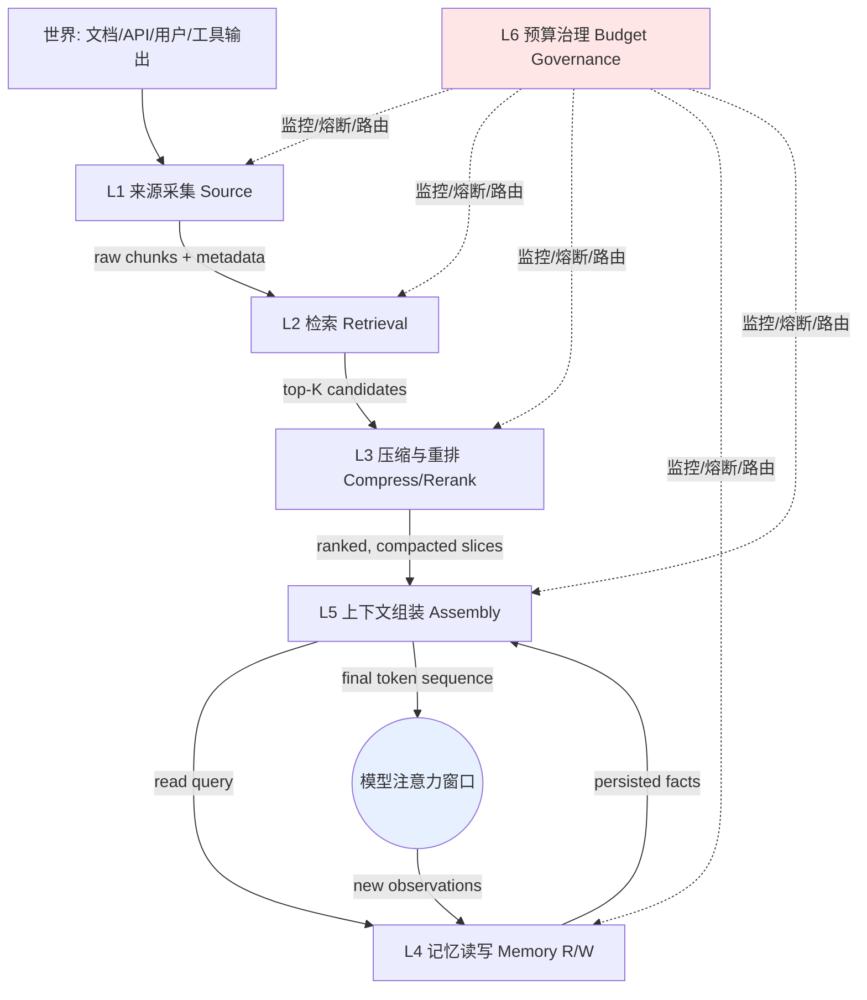

如果说 [Agent](/kb/基础知识库/agent/) 专题的 S01（[S01 Agent 六层架构剖面](/kb/专题-安全对齐与失败/s01-agent-六层架构剖面/)）回答的是"一个 Agent 由哪些可替换的部件组成、各层怎么解耦"，那么本节点回答一个正交的问题：**当 token 在一个 Agent 的生命周期里流动时，它经过哪几道闸门，每道闸门由谁负责、向上向下暴露什么接口、哪几处接缝会致命地相互拖垮**。这是上下文工程的"解剖学"——不是讲某个具体技术（那是 [c09 - RAG 架构](/kb/基础知识库/c09-rag-架构/) / [m206 - Agent 产品化：记忆机制与技术进展](/kb/工程化与落地架构/m206-agent-产品化-记忆机制与技术进展/) 的活），而是把"信息从世界进入模型注意力窗口"这条流水线切成六层，给每层一张接口契约表和一份 PM 问题清单，并诚实标出三处"换了人都会栽"的层间致命耦合。本节的框架名叫 **六层 Context 流水线（Source → Retrieval → Compress/Rerank → Memory R/W → Assembly → Budget Governance）**。

## §0 为什么是"六层流水线"而不是"四操作"或"OS 类比"

读到这里，你脑子里大概率已经装了两个现成框架，我要先把它们挡掉，否则下面六层会被你强行塞进错误的格子。

**默认框架一：LangChain 的 Write / Select / Compress / Isolate 四操作**（来源：[LangChain Blog, Context Engineering for Agents, 2025-07-02](https://www.langchain.com/blog/context-engineering-for-agents)）。这是个好记的助记词，但它是**动词清单**不是**分层架构**——它告诉你"能对 context 做哪四类操作"，却不告诉你"这些操作发生在流水线的哪个位置、谁的输出是谁的输入"。一个 PM 拿着四操作去选型，会发现自己无法回答"压缩到底压的是检索结果还是记忆读出还是工具回传"——因为 Compress 在四操作里是个悬空动词，可以挂在任何地方。分层的价值恰恰是**定位**：同一个"压缩"动作，挂在检索层之后 vs 挂在组装层之前，PM 要操心的事完全不同（见 §6 的致命耦合 #1）。

**默认框架二：MemGPT 的 OS 内存类比（main context = RAM，external context = disk）**（来源：[MemGPT, Packer et al., arXiv:2310.08560, 2023-10](https://arxiv.org/abs/2310.08560)）。这个类比极有解释力，Anthropic、LangChain 都在用"context window 是需要主动管理的稀缺资源、像 OS 管 CPU 内存"的说法。但 OS 类比有个 PM 陷阱：它暗示"分层是为了透明地扩容"（程序员不必关心数据在 RAM 还是 disk）。而上下文工程的现实恰恰相反——**层与层之间的搬运是有损且有偏的**，每一次"从 disk 调进 RAM"都可能丢信息、引污染、加成本，绝不透明。OS 给你的是抽象屏蔽，上下文工程给你的是必须亲自盯防的接缝。

所以我选**流水线**而非操作清单或 OS 类比：流水线强制每层有明确的"上游输入 / 下游输出 / 接口契约 / 失败模式"，这正是 PM 做选型和归因时需要的坐标系。代价是：流水线看起来比"四操作"啰嗦，且现实系统里六层经常被某个框架打包成黑盒（这本身就是一个 PM 要警惕的信号——见 §7）。

> [!note] 与 0411 Agent 专题的分工
> [S01 Agent 六层架构剖面](/kb/专题-安全对齐与失败/s01-agent-六层架构剖面/) 切的是 Agent 的**功能部件**（感知/规划/记忆/工具/执行/反思）；本节点切的是**信息流的物理路径**。一句话:Agent 专题="怎么分工"，CE="怎么管信息流"。同一个"记忆"，在 Agent S01 里是一个功能模块，在本节点里被拆成"记忆写"和"记忆读"两个发生在不同时刻的闸门——因为写时的污染和读时的污染是两种病（见致命耦合 #2）。

## §1 六层总图与接口契约

| 层 | 职责（一句话） | 上游输入 | 下游输出（接口契约） | 主要失败模式 |
|---|---|---|---|---|
| **L1 来源采集** | 把世界变成可索引的原始片段 | 文档/API/工具/用户输入 | `{chunk, metadata, source_id}` 流 | 解析丢结构、chunk 边界切碎语义 |
| **L2 检索** | 从海量片段里召回相关候选 | 索引 + query | `top-K candidates + scores` | 召回不全 / 位置偏差 / 召回过量 |
| **L3 压缩与重排** | 精排 + 去冗余 + 降 token | top-K candidates | `ranked, token-budgeted slices` | 压缩丢关键证据、重排引位置偏差 |
| **L4 记忆读写** | 跨会话持久化事实的存取 | 观测流（写）/ 组装请求（读） | 写：持久化条目；读：`relevant memories` | 写入幻觉、读出污染、冲突未消解 |
| **L5 上下文组装** | 把 system/工具/检索/记忆/历史拼成最终序列 | L3 + L4 + 历史 + system prompt | `final token sequence` | 拼装顺序引位置偏差、缓存前缀失效 |
| **L6 预算治理** | 监控总 token、成本、延迟，触发熔断/压缩/路由 | 各层信号 | 阈值动作（压缩/清除/降级/路由） | 缺失 → 成本失控 + context rot |

下面逐层给 PM 问题清单。注意:本节点**不复述**各层的具体技术实现（chunking 五策略见 [m204 - RAG 生产环境：Chunking 与范式演进](/kb/工程化与落地架构/m204-rag-生产环境-chunking-与范式演进/)，embedding 与解析见 [m203 - RAG 生产环境：Embedding 与文档解析](/kb/工程化与落地架构/m203-rag-生产环境-embedding-与文档解析/)，记忆三库见 [m206 - Agent 产品化：记忆机制与技术进展](/kb/工程化与落地架构/m206-agent-产品化-记忆机制与技术进展/)），只讲"作为分层接口，PM 该问什么、该盯哪条接缝"。

## §2 L1 来源采集层

**接口契约**：输出 `{chunk, metadata, source_id}`。这层决定了"下游所有层能看到什么粒度的世界"。

**PM 问题清单**：
- chunk 边界是否切碎了语义单元？（一张表格被切成两半，检索召回半张表是常见灾难——详见 [m204 - RAG 生产环境：Chunking 与范式演进](/kb/工程化与落地架构/m204-rag-生产环境-chunking-与范式演进/) 的 Late Chunking 讨论）
- metadata 是否够下游做过滤和归因？（没有 `source_id` + 时间戳，L4 记忆层就无法判断信息时效，L6 就无法做来源级成本归因）
- 多模态来源（图/PDF/音频）的 token 成本是否在采集时就被低估？

这层最容易被 PM 忽视，因为它"看起来只是数据预处理"。但它是流水线的**地基偏置**：L1 切坏的语义，L2/L3 无论多强都救不回来。

## §3 L2 检索层

**接口契约**：输入 query + 索引，输出 `top-K candidates + scores`。

**PM 问题清单**：
- 召回模式是 BM25 / Embedding / Hybrid 中的哪种？召回不全 vs 召回过量，你在赌哪一头？（检索范式见 [c09 - RAG 架构](/kb/基础知识库/c09-rag-架构/)）
- K 值是怎么定的？K 越大召回越全，但下游 L3 的压缩压力和 L5 的位置偏差风险越大——**这是第一处层间耦合的伏笔**。
- 检索是"一次性"还是"Agent 多轮自主检索"？后者意味着 L6 预算层必须能管住检索轮数（否则一个 Agent 能把自己检索到破产）。

**反共识判断**：很多团队把"检索质量"等同于"召回率"，拼命调高 K。但在长上下文时代，**召回过量比召回不全更隐蔽地致命**——因为模型会"lost in the middle"。Liu et al.（"Lost in the Middle", TACL 2024, [arXiv:2307.03172](https://arxiv.org/abs/2307.03172)）在 20 文档多文档问答里发现一条 U 形曲线:答案在首位或末位时准确率约 75%，置于第 10 篇（中间）时降至约 55%，跌幅约 20 个百分点；极端情形下 GPT-3.5-Turbo 在 20–30 篇文档时准确率竟低于其闭卷表现（56.1%）——**给更多上下文反而更差**。这意味着 L2 调高 K 不是免费的，它把成本转嫁给了 L3 和 L5。

## §4 L3 压缩与重排层

**接口契约**：输入 top-K candidates，输出 `ranked, token-budgeted slices`。这层同时干两件事:重排（把最相关的放到模型注意力友好的位置）和压缩（在 token 预算内塞进最多信号）。

**PM 问题清单**：
- 压缩用的是 LLM Summarization（语义摘要）还是 Observation Masking（观测遮蔽）还是 Pruning（剪枝）？三者的成本/可靠性差异巨大。
- 重排是否在对抗 L2 引入的位置偏差，还是在叠加新的偏差？
- 压缩是否会丢掉"下游 debug 所需的字符级信息"？（代码场景尤其致命——见 [m209 - 推理成本控制手册](/kb/工程化与落地架构/m209-推理成本控制手册/) 的成本-质量权衡）

**带数字的判断**：压缩方案的选择不是"哪个更先进"，而是"在你的任务上哪个不掉链子"。JetBrains Research（2025-12, [Efficient Context Management](https://blog.jetbrains.com/research/2025/12/efficient-context-management/)）在 SWE-bench 上的对比显示:Observation Masking 比 LLM Summarization **更便宜更可靠**——Qwen3-Coder 480B 用 Masking 后解决率提升 2.6%、成本降低 52%；而 LLM Summarization 反而使 Agent 运行时间增加约 15%（推测是摘要遮盖了停止信号）。Anthropic 官方也提供了两档实现:`clear_tool_uses_20250919`（工具结果清除，无推理开销但使缓存前缀失效）和 `compact_20260112`（摘要压缩，beta，默认 150K token 触发，在 100 轮网页搜索评估中 token 消耗减少 84%）（来源：[Anthropic Compaction 文档](https://platform.claude.com/docs/en/build-with-claude/compaction)）。

## §5 L4 记忆读写层 与 L5 上下文组装层

把这两层放一起讲，因为它们之间藏着第二处致命耦合（§6 #2）。

**L4 记忆读写**——接口契约:写入侧吃观测流，输出持久化条目；读取侧吃组装请求，输出 `relevant memories`。这是 memory layer 作为"一等公民"的落点（[m206 - Agent 产品化：记忆机制与技术进展](/kb/工程化与落地架构/m206-agent-产品化-记忆机制与技术进展/) 讲透了三库架构与衰减/冲突决策）。PM 要盯的是:**写时是否会把模型幻觉当事实写进长期记忆**（self-reflection 写入的记忆可能含幻觉，arXiv 综述将其列为开放挑战），以及**读时是否把过时/矛盾的记忆污染进当前窗口**。Mem0（[arXiv:2504.19413](https://arxiv.org/abs/2504.19413)）在 LOCOMO 上相比 OpenAI full-context 提升 26%、P95 延迟降 91%、token 成本降 90%，靠的正是"动态提取 + 主动遗忘过时/矛盾信息"——遗忘机制不是可选项，是记忆层的核心防线。

**L5 上下文组装**——接口契约:把 system prompt、工具定义、L3 检索切片、L4 记忆读出、消息历史拼成最终 token 序列。这是 [m201 - Prompt Engineering 实战体系](/kb/工程化与落地架构/m201-prompt-engineering-实战体系/) 的主场，但在分层视角下，PM 要多盯两件事:(1) **拼装顺序**直接决定哪些信息落在"lost in the middle"的死区；(2) **拼装是否破坏了 [Prompt Caching](/kb/基础知识库/prompt-caching/) / [KV Cache](/kb/基础知识库/kv-cache/) 的稳定前缀**——把动态内容（检索结果、记忆）放在 system prompt 之前，会让整个缓存前缀失效，成本翻数倍（[Attention](/kb/基础知识库/attention/) 机制决定了前缀变了后面全得重算）。

## §6 判断主轴：三处层间致命耦合（90% 的人在这里栽）

这是本节点的命门。分层最大的幻觉是"每层独立优化就能整体最优"。错。下面三处接缝是非局部的——**只优化单层会让整体更糟**。

### 致命耦合 #1：检索层 ↔ 压缩层的"信息丢失双重传递"

- **症状**：团队把 L2 的 K 调高以提召回，又把 L3 的压缩率调高以省 token，上线后发现答案质量不升反降，且越是复杂问题越糟。
- **为什么会错**：L2 调高 K 引入更多干扰项；L3 压缩在"信号被干扰项稀释"的输入上做摘要，会优先丢掉真正的关键证据（因为它在一堆相关但无关的内容里分不清主次）。两层各自的局部最优（高召回 + 高压缩）在接缝处复合成"召回了正确答案但压缩时把它扔了"。Chroma 的 context rot 研究（2025-07, [trychroma.com](https://www.trychroma.com/research/context-rot)）测试 18 个前沿模型，发现**1 个干扰项就已降低基线性能，4 个干扰项累积更显著**——这正是高 K 喂给压缩层的毒。
- **正确做法**：L2 和 L3 必须**联合调参**，定义一个端到端指标（如 Faithfulness × token 成本），而不是分别优化召回率和压缩率。把 Reranker 放在压缩之前做"硬精排"，先砍掉干扰项再压缩。
- **真实反例**：Anthropic Contextual Retrieval（2024-09-19, [官方博客](https://www.anthropic.com/news/contextual-retrieval)）的解法本质就是在 L1/L2 接缝处给每个 chunk 补 50-100 token 上下文前缀，使检索失败率从 5.7% 降到 2.9%（配 BM25），加 Reranker 后降到 1.9%——它不是单独优化检索，而是优化检索喂给下游的**质量**。

### 致命耦合 #2：记忆层 ↔ 组装层的"污染共谋"

- **症状**：Agent 用得越久越"自信地说错话"，且错误会在多个会话间传播。
- **为什么会错**：L4 写入侧把一次幻觉写进长期记忆 → L5 组装侧在后续会话忠实地把这条"记忆"读进窗口 → 模型把自己的旧幻觉当作可信外部事实，强化输出 → 又被写回记忆。L4 的写污染和 L5 的读信任**合谋**成一个正反馈幻觉回路。组装层"忠实拼装"这个看似正确的行为，恰恰是污染的放大器。
- **正确做法**：L4 写入必须有"事实 vs 推测"的来源标签，L5 组装时对"自生记忆"和"外部检索"给予不同的信任权重（甚至显式提示模型"以下是你过去的笔记，可能有误"）。Mem0 的"主动遗忘矛盾信息"和 LongMemEval（[arXiv:2410.10813](https://arxiv.org/abs/2410.10813), ICLR 2025）强调的"主动放弃 abstention"能力，都是为切断这个回路。
- **真实反例**：LongMemEval 发现商业 chat assistants 和 long-context LLM 在跨会话记忆上准确率下降 30%，且"高检索准确率不等于强知识更新能力"——记忆读得准，不代表组装进去就安全。

### 致命耦合 #3：预算层缺失 → 全链成本与质量双失控

- **症状**：Demo 跑得很好，规模化后账单爆炸、延迟飙升、质量诡异下降，且没人能说清钱花在哪层。
- **为什么会错**：L6 预算治理如果缺失，L1–L5 各层都会"贪婪地"占用 token——检索贪婪召回、记忆贪婪读出、历史无限累积。结果不仅是成本失控，更触发 context rot:Chroma 证实**所有 18 个模型在所有输入长度增量上均性能下降**，无一例外。预算层不是"省钱"功能，它是**质量的守门人**——因为在这条流水线里，token 越多质量越差是常态而非例外。
- **正确做法**：L6 必须有(a) 总 token 软/硬阈值触发压缩；(b) 来源级成本归因（哪层吃了多少 token）；(c) 路由能力（简单 query 走 RAG、复杂 query 走长上下文，即 Self-Route，[EMNLP 2024, arXiv:2407.16833](https://arxiv.org/abs/2407.16833)，可降 Gemini-1.5-Pro 计算成本 65%）。Anthropic 的生产模式正是分层熔断:工具结果清除（约 80K 触发）→ 摘要压缩（约 250K 触发）→ 跨会话持久化记忆。
- **真实反例**：第三方框架（[TianPan.co, 2026](https://tianpan.co/blog/2026-04-09-long-context-vs-rag-production-decision-framework)，估算非受控实验，仅数量级参考）估算 RAG 约 $0.00008/查询、长上下文（约 160K token）约 $0.20/查询——无预算路由层，等于默认对每个查询都付最贵那档。

## §7 产品 PM 视角补盲：四个"看走眼"点

工程 PM 盯着上面六层的接口就够了。产品 PM 还得跳出去看四件事:

1. **黑盒框架的"假分层"陷阱**：很多 Agent 框架把六层打包成黑盒，对外只暴露一个 `add_documents()`。看起来省心，实则你失去了在致命耦合点干预的能力。**选型时要问的不是"它支不支持 RAG/memory"，而是"L2 和 L3 之间、L4 和 L5 之间，我能不能插手"**。不能插手的黑盒，规模化后没法治 context rot。
2. **"上下文越大越值钱"的定价幻觉**：1M token 窗口是营销卖点，但 NoLiMa（Adobe/ICML 2025, [GitHub](https://github.com/adobe-research/NoLiMa)）显示 Claude 3.5 Sonnet 在 64K 时准确率从 87.6% 跌到 29.8%、GPT-4o 实际有效上下文约 8K（尽管声称 128K）。**产品如果向用户承诺"我们能处理你的百万字文档"，而后端没有 L2–L3–L6 的治理，交付的是幻觉而非能力。** 这是会被用户用脚投票的 GTM 风险。
3. **记忆即隐私即合规**：L4 记忆层一旦持久化用户信息，就从"功能"变成"数据资产"——GDPR 的"被遗忘权"直接落在 L4 的遗忘机制上。**记忆层的"遗忘"不是工程优化，是合规义务**。Rick 在国际化产品上对这点应有职业直觉:一个能跨会话记住用户的 Agent，在欧盟就是一个需要 DPA 的数据控制器。
4. **成本归因即商业模式**：L6 如果只会"省钱"不会"归因到层/到用户/到功能"，PM 就无法做定价分层（哪些用户/功能该走贵档）。**预算治理层的真正产品价值是让 token 成本可计量、可定价、可向上游 PRD 解释。**

## §8 对手框架回应

**接受 + 边界**，不反驳。

- **Cognition「Don't Build Multi-Agents」（2025, [博客](https://cognition.ai/blog/dont-build-multi-agents)）**：他们主张子 Agent 隔离会造成"上下文割裂"和"隐式决策冲突"，应"共享完整 agent traces 而非孤立消息"。**接受**:本节点把"subagent 先消化回传"作为信息流的一个合法去向时，必须承认 Cognition 的边界——隔离不是免费的，子 Agent 只拿到压缩摘要会误解任务。**本节点坚持的边界**:隔离 vs 共享是 L5 组装层的一个**可调参数**而非教条;在探索型任务（子 Agent 的 50 行 `ls` 输出主 Agent 不需要看）隔离收益高，在协作型任务（决策需要全局历史）共享收益高。Cognition 的反例恰恰证明了"组装层必须能按任务类型切换隔离策略"，而不是证明分层错了。
- **Hacker News 批评派（[news.ycombinator.com/item?id=44464219](https://news.ycombinator.com/item?id=44464219)）**：认为 context engineering 不过是 RAG + memory 换皮，没有新实质。**接受**:本节点的六层里，L2/L3 确实大量复用 RAG 既有技术，L4 复用 memory 研究，没凭空发明。**边界**:换皮论看不见的恰恰是**层间耦合**——RAG 论文不会告诉你"检索层和压缩层会信息双重丢失"，memory 论文不会告诉你"记忆层和组装层会污染共谋"。新实质不在任何单层，而在接缝。这也是本节点存在的理由:把散落在 RAG/memory/prompt 三个领域的知识，按信息流重新接成一条能归因的流水线。

## §9 跨域呼应：Polanyi 的默会知识与"压缩必然有损"

L3 压缩层有一个无法绕过的哲学硬核:**任何把高熵信息压成低熵摘要的动作，都在做一次"显性化"，而显性化必然丢失默会维度**。Michael Polanyi 的命题"我们知道的比我们能说出的多"（we know more than we can tell）在这里不是修辞——它解释了为什么 LLM Summarization 会"遮盖停止信号"（JetBrains 那 15% runtime 增长）:摘要把"调试现场的字符级线索"这种默会上下文压成了"已尝试 X、失败"的显性陈述，而 Agent 后续决策恰恰依赖那些没被说出来的细节。

这改变了一个具体的技术判断:**不要默认"压缩=进步"**。Observation Masking 之所以常常打败 Summarization，正因为它不做显性化——它只是把旧工具结果换成占位符，保留了"我调用过这个工具"这一事实，而不强行把内容翻译成自然语言摘要。Polanyi 告诉我们:有时候"留个指针、别强行说清"比"压成一句话"更忠实。这是 Context Engineering 2.0（[arXiv:2510.26493](https://arxiv.org/abs/2510.26493)）"熵减"框架的反面——熵减是目标，但每次熵减都要付默会税，PM 要判断这税在当前任务上值不值得交。（更系统的认识论张力见 0114认识论。）

## §10 PM 决策启示

- **面试**：被问"你怎么设计一个长文档问答产品"，不要答"用 RAG"。答"我会把它拆成六层，重点盯检索-压缩接缝（避免高 K 喂毒）和预算治理层（避免 context rot），因为单层最优会在接缝处崩"——这是 30 秒区分"用过框架的人"和"理解流水线的人"。
- **选型**：评估任何 Agent/RAG 框架，用本节点的接口契约表逐层打分,重点问"三处致命耦合点我能否干预"。不能干预的黑盒一票否决。
- **复现**：自己搭最小流水线时，先把 L6 预算治理的 token 计数器和阈值熔断搭起来（哪怕只是打印日志），它是你归因一切问题的坐标系。先有仪表盘，再谈优化。

## §11 与已有节点的关系

- 对照 [c09 - RAG 架构](/kb/基础知识库/c09-rag-架构/)：c09 讲的是 L2 检索层的范式（BM25/Embedding/Hybrid/Reranker）和评估矩阵。本节点**做"上提抽象层"的升级**——把 RAG 从"一个检索方案"重新定位为"六层流水线里的 L2+部分 L3"，并指出 c09 单独看不见的 L2↔L3 耦合。不复述 c09 的检索技术细节。
- 对照 [m203 - RAG 生产环境：Embedding 与文档解析](/kb/工程化与落地架构/m203-rag-生产环境-embedding-与文档解析/) / [m204 - RAG 生产环境：Chunking 与范式演进](/kb/工程化与落地架构/m204-rag-生产环境-chunking-与范式演进/) / [m205 - RAG 生产环境：索引运维与评估体系](/kb/工程化与落地架构/m205-rag-生产环境-索引运维与评估体系/)：三者分别是 L1（解析）、L1（chunking）、L2/L6（索引运维与评估）的生产级深化。本节点**做"编织"的升级**——把它们定位到统一流水线坐标系，并补出三篇各自看不见的跨层耦合。
- 对照 [m206 - Agent 产品化：记忆机制与技术进展](/kb/工程化与落地架构/m206-agent-产品化-记忆机制与技术进展/)：m206 讲透 L4 记忆层的三库架构与设计决策。本节点**做"对话+补缺"的升级**——把 m206 的"记忆"拆成读/写两个闸门，并补出 m206 单看记忆层时看不见的"记忆↔组装污染共谋"（致命耦合 #2）。
- 对照 [m201 - Prompt Engineering 实战体系](/kb/工程化与落地架构/m201-prompt-engineering-实战体系/)：m201 是 L5 组装层的主场（system prompt 四原则、压缩）。本节点**做"纠偏"的升级**——指出 prompt engineering 在分层视角下只是 L5 的一部分，且组装顺序对缓存前缀和位置偏差的影响是 m201 未充分展开的接口级问题。
- 对照 [m209 - 推理成本控制手册](/kb/工程化与落地架构/m209-推理成本控制手册/)：m209 是 L6 预算治理的成本侧深化。本节点**做"对话"的升级**——指出 L6 不只是省钱，更是质量守门人（token 越多质量越差），把成本控制和 context rot 防治统一进同一层。

## §12 关联节点

**核心（必读）**
- [c09 - RAG 架构](/kb/基础知识库/c09-rag-架构/) — L2 检索层的范式基础
- [m206 - Agent 产品化：记忆机制与技术进展](/kb/工程化与落地架构/m206-agent-产品化-记忆机制与技术进展/) — L4 记忆读写层
- [m201 - Prompt Engineering 实战体系](/kb/工程化与落地架构/m201-prompt-engineering-实战体系/) — L5 组装层主场
- [m209 - 推理成本控制手册](/kb/工程化与落地架构/m209-推理成本控制手册/) — L6 预算治理成本侧
- [S01 Agent 六层架构剖面](/kb/专题-安全对齐与失败/s01-agent-六层架构剖面/) — 正交视角:功能分工 vs 信息流

**延伸（可选）**
- [m203 - RAG 生产环境：Embedding 与文档解析](/kb/工程化与落地架构/m203-rag-生产环境-embedding-与文档解析/) — L1 解析
- [m204 - RAG 生产环境：Chunking 与范式演进](/kb/工程化与落地架构/m204-rag-生产环境-chunking-与范式演进/) — L1 chunking + Contextual Retrieval
- [m205 - RAG 生产环境：索引运维与评估体系](/kb/工程化与落地架构/m205-rag-生产环境-索引运维与评估体系/) — L2/L6 评估
- [RAG](/kb/基础知识库/rag/) · [Embedding](/kb/基础知识库/embedding/) · [KV Cache](/kb/基础知识库/kv-cache/) · [Prompt Caching](/kb/基础知识库/prompt-caching/) · [Attention](/kb/基础知识库/attention/) · [Agent](/kb/基础知识库/agent/) · [幻觉](/kb/基础知识库/幻觉/) — 原子概念卡
- [Claude Code](/kb/ai-公司与产品/claude-code/) — Rick 的一手体感来源:Claude Code 的 compaction 是本节点六层在真实产品里的活样本
- 0114认识论 — Polanyi 默会知识的认识论入口
- [AI PM 知识图谱·总索引](/kb/ai-pm-知识图谱/ai-pm-知识图谱-总索引/)

## 修订日志
- 2026-06-07 R0:首稿。建立六层流水线框架（Source/Retrieval/Compress-Rerank/Memory R/W/Assembly/Budget Governance），每层接口契约表 + PM 问题清单;判断主轴落三处致命耦合（检索-压缩信息双失、记忆-组装污染共谋、预算缺失双失控），各带四件套;补四个产品 PM 看走眼点;接 Cognition 与 HN 换皮论两个对手框架;跨域调度 Polanyi 默会知识改写"压缩=进步"判断;与 c09/m203/m204/m205/m206/m201/m209/Agent-S01 显式升级对照。事实接地:核心数字（Lost in the Middle U 形、NoLiMa 跌幅、JetBrains Masking、Anthropic compaction/Contextual Retrieval、Mem0 LOCOMO、Chroma context rot、Self-Route）均带论文/博客线索与年份。
